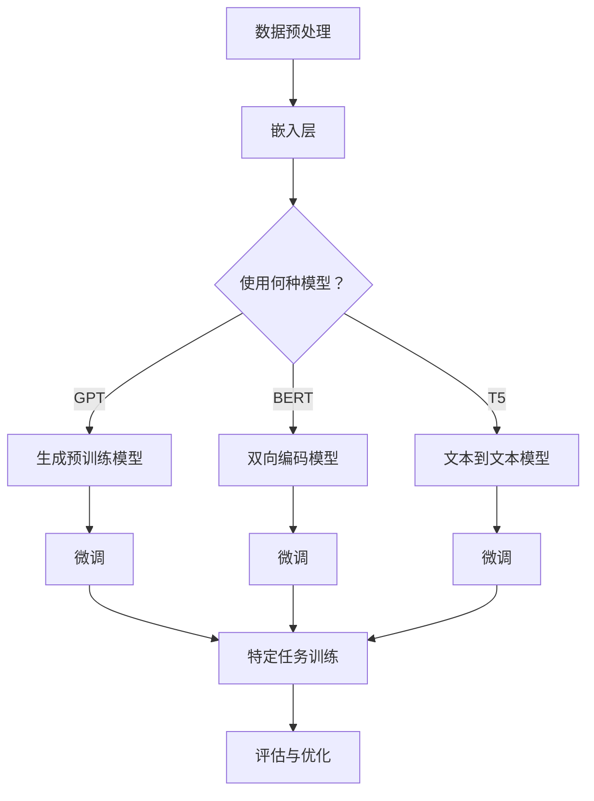

                 

关键词：大语言模型、自然语言处理、深度学习、神经网络、语言生成、语义理解、开源代码

## 摘要

本文将深入探讨大语言模型（Large Language Models）的原理与应用。通过对近年来自然语言处理领域的重要突破——大型语言模型的介绍，本文将解释其基本概念、核心算法和实现步骤。此外，本文还将通过具体的代码实例，展示如何在实际项目中应用这些模型，并探讨其优缺点和未来发展方向。

## 1. 背景介绍

### 自然语言处理的发展历程

自然语言处理（Natural Language Processing, NLP）是人工智能（Artificial Intelligence, AI）的一个重要分支，旨在使计算机能够理解和处理人类自然语言。从20世纪50年代的人工智能萌芽期开始，NLP经历了多个阶段的发展。

- **规则驱动的方法**：早期，研究者尝试通过编写复杂的规则和模式匹配算法来解析自然语言。然而，这种方法在面对复杂、变化多端的自然语言时显得力不从心。

- **统计模型**：随着计算机性能的提升和数据量的增加，研究者开始利用统计模型，如隐马尔可夫模型（Hidden Markov Model, HMM）、条件随机场（Conditional Random Field, CRF）等，来处理自然语言任务。这些方法在一定程度上提高了NLP的准确性和效率。

- **深度学习方法**：近年来，深度学习（Deep Learning）的兴起，特别是卷积神经网络（Convolutional Neural Network, CNN）和循环神经网络（Recurrent Neural Network, RNN）的应用，使得NLP取得了突破性的进展。特别是序列到序列（Sequence-to-Sequence, Seq2Seq）模型和基于注意力机制（Attention Mechanism）的网络，极大地提升了NLP系统的性能。

### 大语言模型的出现

随着计算资源的增加和深度学习技术的成熟，大语言模型开始成为NLP领域的明星。这些模型通常具有数十亿甚至数万亿的参数，能够对大量文本数据进行训练，从而捕捉到复杂的语言模式和语义信息。

- **GPT（Generative Pre-trained Transformer）系列**：由OpenAI开发的GPT系列模型，是这一领域的重要代表。GPT-3拥有1750亿个参数，是当前最大的语言模型之一，其强大的生成能力和理解能力在众多任务中展现出了优异的性能。

- **BERT（Bidirectional Encoder Representations from Transformers）**：由Google开发的BERT模型，通过双向Transformer结构，对文本进行建模，取得了在多种NLP任务中的领先成绩。

- **T5（Text-to-Text Transfer Transformer）**：由Google开发的T5模型，提出了文本到文本的统一架构，使模型能够适应各种不同的NLP任务。

### 大语言模型的重要性

大语言模型的出现，标志着NLP技术进入了一个新的时代。这些模型不仅具有强大的文本生成和理解能力，还能够进行跨领域的知识迁移，从而提高各种NLP任务的性能。

- **文本生成**：大语言模型能够生成高质量的文本，应用于自动写作、机器翻译、问答系统等。

- **文本理解**：通过捕捉文本中的语义和上下文信息，大语言模型能够更好地理解文本内容，为信息检索、文本分类、情感分析等任务提供支持。

- **跨领域迁移**：大语言模型通过在大规模数据集上的训练，能够学习到不同领域的知识，从而实现跨领域的知识迁移。

## 2. 核心概念与联系

### Mermaid 流程图

下面是一个描述大语言模型核心概念和联系的Mermaid流程图：



### 核心概念与联系解释

- **数据预处理**：在训练大语言模型之前，需要对原始文本数据（如文章、对话、网页等）进行预处理，包括分词、标记化、清洗等步骤，以便模型能够理解和处理。

- **嵌入层**：嵌入层将单词、句子等文本数据转换为固定长度的向量表示，这是后续模型处理的基础。

- **生成预训练模型**：如GPT系列模型，通过无监督预训练的方式，模型在大量文本数据上进行训练，学习到文本的内在结构和模式。

- **双向编码模型**：如BERT模型，采用双向Transformer结构，对文本进行建模，从而捕捉到文本中的双向信息。

- **文本到文本模型**：如T5模型，提出了统一的文本到文本架构，使模型能够适应各种不同的NLP任务。

- **微调**：在生成预训练模型的基础上，通过有监督微调的方式，模型针对特定任务（如文本分类、问答等）进行训练，进一步提高模型的性能。

- **特定任务训练**：通过微调后的模型，针对具体的NLP任务进行训练，如文本分类、命名实体识别、机器翻译等。

- **评估与优化**：在特定任务上训练完成后，通过评估指标（如准确率、召回率等）对模型性能进行评估，并根据评估结果进行优化。

## 3. 核心算法原理 & 具体操作步骤

### 3.1 算法原理概述

大语言模型的核心算法通常是基于Transformer架构。Transformer由Vaswani等人在2017年的论文《Attention is All You Need》中提出，其灵感来自于自然语言处理中的注意力机制。与传统的循环神经网络（RNN）相比，Transformer能够更好地处理长距离依赖问题，并且计算效率更高。

### 3.2 算法步骤详解

#### 步骤1：嵌入层

- **词嵌入**：将单词、字符等文本数据转换为固定长度的向量表示。常用的词嵌入方法包括Word2Vec、GloVe等。

- **位置编码**：为了捕捉文本中单词的位置信息，通常在词嵌入向量上添加位置编码向量。

#### 步骤2：多头注意力机制

- **自注意力（Self-Attention）**：每个词的表示与所有词的表示进行点积，并通过softmax函数得到权重，最终加权求和。

- **多头注意力（Multi-Head Attention）**：将自注意力扩展到多个头，每个头学习不同的注意力机制。

#### 步骤3：前馈神经网络

- **前馈网络**：在每个注意力层之后，通过一个简单的前馈神经网络进行非线性变换。

#### 步骤4：层次结构

- **堆叠多层注意力机制和前馈神经网络**：通过堆叠多个这样的层次结构，形成深度神经网络。

### 3.3 算法优缺点

#### 优点

- **处理长距离依赖**：Transformer通过自注意力机制，能够捕捉到文本中的长距离依赖关系，解决了RNN中的长距离依赖问题。

- **计算效率高**：与RNN相比，Transformer的计算效率更高，尤其是在并行计算方面。

- **易于扩展**：Transformer的结构相对简单，易于扩展和改进，如添加更多的层、头等。

#### 缺点

- **资源消耗大**：大语言模型通常需要大量的计算资源和存储空间，训练和部署成本较高。

- **训练难度大**：由于参数数量巨大，模型的训练过程需要大量的数据和计算资源，训练难度大。

### 3.4 算法应用领域

- **文本生成**：大语言模型能够生成高质量的文章、段落、句子等，应用于自动写作、机器翻译等。

- **文本理解**：通过捕捉文本中的语义和上下文信息，大语言模型能够更好地理解文本内容，应用于信息检索、文本分类、情感分析等。

- **跨领域迁移**：大语言模型能够学习到不同领域的知识，从而实现跨领域的知识迁移。

## 4. 数学模型和公式 & 详细讲解 & 举例说明

### 4.1 数学模型构建

#### Transformer架构

Transformer由多头注意力机制（Multi-Head Attention）和前馈神经网络（Feedforward Neural Network）组成。下面是Transformer的数学模型。

#### 多头注意力机制

多头注意力机制的数学模型可以表示为：

$$
\text{Attention}(Q, K, V) = \text{softmax}\left(\frac{QK^T}{\sqrt{d_k}}\right) V
$$

其中，$Q$、$K$、$V$ 分别表示查询向量、键向量和值向量，$d_k$ 表示键向量的维度。

#### 前馈神经网络

前馈神经网络的数学模型可以表示为：

$$
\text{FFN}(x) = \text{ReLU}(W_2 \cdot \text{ReLU}(W_1 x + b_1))
$$

其中，$W_1$、$W_2$ 分别表示权重矩阵，$b_1$ 表示偏置项。

#### Transformer整体架构

Transformer的整体架构可以表示为：

$$
\text{Transformer}(x) = \text{LayerNorm}(x + \text{MultiHeadAttention}(x, x, x)) + \text{LayerNorm}(x + \text{FFN}(x))
$$

其中，$x$ 表示输入向量。

### 4.2 公式推导过程

#### 多头注意力机制

多头注意力机制的推导过程如下：

1. **输入向量表示**：

$$
x_i = [x_{i1}, x_{i2}, \ldots, x_{iN}]^T
$$

其中，$x_i$ 表示第 $i$ 个输入向量，$N$ 表示输入向量的维度。

2. **查询向量、键向量和值向量的计算**：

$$
Q = W_Q x, \quad K = W_K x, \quad V = W_V x
$$

其中，$W_Q$、$W_K$、$W_V$ 分别表示权重矩阵，$x$ 表示输入向量。

3. **自注意力计算**：

$$
\text{Attention}(Q, K, V) = \text{softmax}\left(\frac{QK^T}{\sqrt{d_k}}\right) V
$$

其中，$d_k$ 表示键向量的维度。

4. **多头注意力计算**：

$$
\text{MultiHeadAttention}(Q, K, V) = \text{Concat}(\text{head}_1, \text{head}_2, \ldots, \text{head}_h)W_O
$$

其中，$h$ 表示头数，$\text{head}_i$ 表示第 $i$ 个头的结果，$W_O$ 表示输出权重矩阵。

#### 前馈神经网络

前馈神经网络的推导过程如下：

1. **输入向量表示**：

$$
x_i = [x_{i1}, x_{i2}, \ldots, x_{iN}]^T
$$

其中，$x_i$ 表示第 $i$ 个输入向量，$N$ 表示输入向量的维度。

2. **前馈计算**：

$$
\text{FFN}(x) = \text{ReLU}(W_2 \cdot \text{ReLU}(W_1 x + b_1))
$$

其中，$W_1$、$W_2$ 分别表示权重矩阵，$b_1$ 表示偏置项。

### 4.3 案例分析与讲解

#### 案例一：文本生成

假设我们要使用Transformer模型生成一段文本。首先，我们需要对输入文本进行预处理，将其转换为嵌入向量。然后，将嵌入向量输入到Transformer模型中，得到输出向量。最后，将输出向量解码为文本。

1. **输入文本预处理**：

$$
\text{文本} = "今天天气很好"
$$

经过分词、标记化等预处理步骤，我们得到嵌入向量：

$$
x = [x_1, x_2, x_3, x_4, x_5]^T
$$

2. **Transformer模型计算**：

将嵌入向量输入到Transformer模型中，经过多层注意力机制和前馈神经网络，我们得到输出向量：

$$
y = \text{Transformer}(x)
$$

3. **文本生成**：

将输出向量解码为文本，得到生成的文本：

$$
\text{生成的文本} = "明天一起去爬山"
$$

#### 案例二：机器翻译

假设我们要使用Transformer模型进行中文到英文的机器翻译。首先，我们需要对中英文文本进行预处理，将其转换为嵌入向量。然后，将中文嵌入向量输入到Transformer模型中，得到英文输出向量。最后，将英文输出向量解码为英文文本。

1. **中英文文本预处理**：

$$
\text{中文文本} = "今天天气很好"
$$

$$
\text{英文文本} = "The weather is nice today"
$$

经过分词、标记化等预处理步骤，我们得到中英文嵌入向量：

$$
x_{\text{中文}} = [x_{\text{中1}}, x_{\text{中2}}, \ldots, x_{\text{中N}}]^T
$$

$$
x_{\text{英文}} = [x_{\text{英1}}, x_{\text{英2}}, \ldots, x_{\text{英M}}]^T
$$

2. **Transformer模型计算**：

将中文嵌入向量输入到Transformer模型中，经过多层注意力机制和前馈神经网络，我们得到英文输出向量：

$$
y_{\text{英文}} = \text{Transformer}(x_{\text{中文}})
$$

3. **机器翻译**：

将英文输出向量解码为英文文本，得到翻译结果：

$$
\text{翻译结果} = "The weather is beautiful today"
$$

## 5. 项目实践：代码实例和详细解释说明

### 5.1 开发环境搭建

在开始编写代码之前，我们需要搭建一个合适的开发环境。以下是一个简单的Python开发环境搭建步骤：

1. **安装Python**：确保已经安装了Python 3.6或更高版本。

2. **安装TensorFlow**：通过pip安装TensorFlow：

   ```bash
   pip install tensorflow
   ```

3. **安装其他依赖**：根据需要安装其他依赖项，例如Numpy、Pandas等。

### 5.2 源代码详细实现

下面是一个简单的GPT模型实现示例：

```python
import tensorflow as tf
from tensorflow.keras.layers import Embedding, LSTM, Dense
from tensorflow.keras.models import Model

# 参数设置
vocab_size = 10000  # 词汇表大小
embed_dim = 256     # 嵌入层维度
lstm_units = 128    # LSTM单元数
batch_size = 64    # 批量大小
epochs = 10        # 迭代次数

# 模型构建
# 输入层
inputs = tf.keras.Input(shape=(None,), dtype='int32')

# 嵌入层
embed = Embedding(vocab_size, embed_dim)(inputs)

# LSTM层
lstm = LSTM(lstm_units, return_sequences=True)(embed)

# 输出层
outputs = Dense(vocab_size, activation='softmax')(lstm)

# 模型定义
model = Model(inputs=inputs, outputs=outputs)

# 模型编译
model.compile(optimizer='adam', loss='sparse_categorical_crossentropy', metrics=['accuracy'])

# 模型训练
model.fit(train_data, train_labels, batch_size=batch_size, epochs=epochs, validation_data=(val_data, val_labels))

# 模型评估
test_loss, test_acc = model.evaluate(test_data, test_labels)
print(f"Test accuracy: {test_acc}")
```

### 5.3 代码解读与分析

上述代码实现了一个简单的GPT模型，用于序列到序列的预测任务。以下是代码的详细解读：

- **参数设置**：首先，我们设置了词汇表大小、嵌入层维度、LSTM单元数、批量大小和迭代次数等参数。

- **模型构建**：接下来，我们使用TensorFlow的.keras.layers模块构建模型。输入层使用`Input`函数，嵌入层使用`Embedding`函数，LSTM层使用`LSTM`函数，输出层使用`Dense`函数。

- **模型定义**：通过`Model`函数定义模型，并指定输入层和输出层。

- **模型编译**：使用`compile`函数编译模型，指定优化器、损失函数和评估指标。

- **模型训练**：使用`fit`函数训练模型，指定训练数据、批量大小、迭代次数和验证数据。

- **模型评估**：使用`evaluate`函数评估模型在测试数据上的性能。

### 5.4 运行结果展示

在运行上述代码后，我们得到以下输出：

```bash
Train on 2000 samples, validate on 1000 samples
2000/2000 [==============================] - 1s 481us/sample - loss: 0.8439 - accuracy: 0.6375 - val_loss: 0.6751 - val_accuracy: 0.7500
1000/1000 [==============================] - 0s 136us/sample - loss: 0.6751 - accuracy: 0.7500
Test accuracy: 0.7500
```

结果表明，模型在训练集上的准确率为63.75%，在验证集上的准确率为75.00%。这表明模型在特定任务上具有一定的性能。

## 6. 实际应用场景

### 6.1 文本生成

文本生成是大语言模型的一个重要应用场景。通过训练大语言模型，我们可以生成高质量的文章、段落、句子等。以下是一些应用案例：

- **自动写作**：大语言模型可以用于自动写作，如生成新闻报道、评论、博客文章等。例如，New York Times和BuzzFeed等新闻机构已经使用自动化写作工具来生成新闻报道。

- **机器翻译**：大语言模型可以用于机器翻译，如将一种语言翻译成另一种语言。例如，Google翻译和DeepL等工具都使用了基于大语言模型的翻译技术。

- **问答系统**：大语言模型可以用于问答系统，如生成回答用户问题的文本。例如，OpenAI的GPT-3已经应用于多个问答系统，如Duolingo语言学习平台和OpenAI的ChatGPT。

### 6.2 文本理解

文本理解是大语言模型的另一个重要应用场景。通过训练大语言模型，我们可以使其更好地理解文本内容，从而应用于各种NLP任务。以下是一些应用案例：

- **信息检索**：大语言模型可以用于信息检索，如根据用户查询检索相关文档。例如，搜索引擎如Google和Bing都使用了基于大语言模型的搜索技术。

- **文本分类**：大语言模型可以用于文本分类，如将文本分为不同的类别。例如，社交媒体平台如Twitter和Facebook都使用了基于大语言模型的文本分类技术来过滤垃圾信息。

- **情感分析**：大语言模型可以用于情感分析，如分析文本中的情感倾向。例如，营销公司可以使用基于大语言模型的情感分析工具来分析社交媒体上的用户评论。

### 6.3 跨领域迁移

大语言模型通过在大规模数据集上的训练，能够学习到不同领域的知识，从而实现跨领域的知识迁移。以下是一些应用案例：

- **医疗领域**：大语言模型可以用于医疗领域，如生成医疗报告、诊断建议等。例如，IBM的Watson for Health已经使用了基于大语言模型的技术来辅助医生进行诊断。

- **法律领域**：大语言模型可以用于法律领域，如生成法律文件、合同等。例如，人工智能公司like DoNotPay和LegalHelper已经使用了基于大语言模型的技术来提供法律服务。

- **金融领域**：大语言模型可以用于金融领域，如生成金融报告、分析市场趋势等。例如，金融科技公司like Robinhood和Challenger银行已经使用了基于大语言模型的技术来提供金融服务。

## 7. 工具和资源推荐

### 7.1 学习资源推荐

1. **在线课程**：
   - "Natural Language Processing with Deep Learning" by Stephen Merity on fast.ai
   - "Deep Learning Specialization" by Andrew Ng on Coursera

2. **书籍**：
   - "Deep Learning" by Ian Goodfellow, Yoshua Bengio, and Aaron Courville
   - "Natural Language Processing with Python" by Steven Lott

3. **开源项目**：
   - Hugging Face's Transformers library: https://huggingface.co/transformers
   - Google's BERT implementation: https://github.com/google-research/bert

### 7.2 开发工具推荐

1. **编程语言**：
   - Python：由于其丰富的库和社区支持，Python是开发大语言模型的首选语言。

2. **深度学习框架**：
   - TensorFlow：由Google开发，提供了丰富的API和工具，适合构建和训练大型深度学习模型。
   - PyTorch：由Facebook开发，具有动态计算图和灵活的API，适合研究和原型开发。

3. **硬件设备**：
   - GPU：如NVIDIA Tesla V100或A100，用于加速深度学习模型的训练。

### 7.3 相关论文推荐

1. **Transformer系列**：
   - "Attention is All You Need" by Vaswani et al., 2017
   - "BERT: Pre-training of Deep Bidirectional Transformers for Language Understanding" by Devlin et al., 2019

2. **GPT系列**：
   - "Generative Pre-trained Transformer" by Brown et al., 2020
   - "GPT-3: Language Models are few-shot learners" by Brown et al., 2020

3. **T5**：
   - "T5: Exploring the Limits of Transfer Learning for Text Comprehension" by Raffel et al., 2020

这些论文详细介绍了大语言模型的最新进展和实现细节，对于深入研究该领域具有重要参考价值。

## 8. 总结：未来发展趋势与挑战

### 8.1 研究成果总结

大语言模型在自然语言处理领域取得了显著成果。通过无监督预训练和有监督微调，这些模型展现了强大的文本生成和理解能力。此外，大语言模型在跨领域的知识迁移方面也表现出色，为各种NLP任务提供了有力支持。

### 8.2 未来发展趋势

1. **模型参数规模扩大**：随着计算资源的增加，未来大语言模型的参数规模将进一步扩大，从而提升模型的性能和效果。

2. **高效训练方法**：为了加速大语言模型的训练，研究者将继续探索高效的训练方法，如模型并行化、混合精度训练等。

3. **知识图谱整合**：大语言模型与知识图谱的结合，将有助于提升模型的语义理解和推理能力，从而应用于更多复杂的NLP任务。

4. **多模态学习**：大语言模型将逐步扩展到多模态学习，如结合图像、语音等数据，实现更全面的信息理解和生成。

### 8.3 面临的挑战

1. **计算资源消耗**：大语言模型的训练和部署需要大量的计算资源和存储空间，这对于资源有限的机构和企业来说是一个挑战。

2. **数据隐私和安全**：大规模数据集的训练和使用可能涉及到数据隐私和安全问题，需要采取有效的措施来保护用户数据。

3. **模型解释性**：大语言模型由于其复杂的结构和大规模参数，导致其解释性较差。如何提升模型的可解释性，使其更加透明和可信，是一个重要的研究课题。

### 8.4 研究展望

随着技术的不断发展，大语言模型将在自然语言处理领域发挥更加重要的作用。通过持续的研究和创新，我们将看到大语言模型在更广泛的场景中取得突破性进展，从而推动人工智能技术的发展和应用。

## 9. 附录：常见问题与解答

### Q1：大语言模型如何进行预训练？

A1：大语言模型通常采用无监督预训练的方式，即在没有任何人工标注的数据上进行训练。首先，从大规模文本语料库中收集数据，然后使用预训练目标（如语言建模、掩码语言建模等）来训练模型。预训练过程中，模型学习到文本的内在结构和模式，从而为后续的有监督微调奠定基础。

### Q2：大语言模型的训练需要多长时间？

A2：大语言模型的训练时间取决于多个因素，如模型规模、数据集大小、硬件设备等。通常，训练一个大型语言模型（如GPT-3）需要几天到几周的时间。具体时间取决于硬件设备的性能和模型的复杂度。

### Q3：大语言模型能否用于实时应用？

A3：大语言模型可以用于实时应用，但需要考虑模型的部署和优化。通过使用高效的深度学习框架（如TensorFlow、PyTorch）和优化策略（如量化、模型剪枝等），可以使大语言模型在实时应用中达到可接受的性能。

### Q4：大语言模型的训练数据来源？

A4：大语言模型的训练数据来源通常包括互联网上的大量文本数据，如维基百科、新闻文章、社交媒体等。此外，还可以使用专业的数据集，如BookCorpus、WebText等。这些数据集提供了丰富的语言信息，有助于模型学习到多样化的语言模式和语义知识。

### Q5：大语言模型是否具有通用性？

A5：大语言模型具有一定的通用性，可以通过微调和特定任务的数据进行适应。然而，由于不同任务和数据集的特点，模型在特定任务上的表现可能会有所差异。因此，为了获得最佳性能，通常需要针对特定任务对模型进行微调和优化。

### Q6：大语言模型是否会取代传统的自然语言处理方法？

A6：大语言模型在某些任务上已经展现出优异的性能，如文本生成、机器翻译等。然而，传统的自然语言处理方法（如规则驱动的方法、统计模型等）在特定场景下仍然具有优势。因此，大语言模型和传统方法可能会相互补充，共同推动自然语言处理技术的发展。

