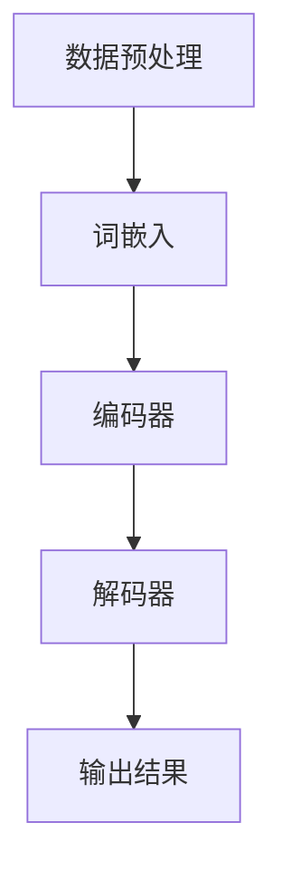

                 

关键词：大语言模型、自然语言处理、机器学习、神经网络、人工智能、语言生成、智能助手、应用前景、发展趋势、挑战与机遇。

## 摘要

本文旨在探讨大语言模型（LLM）的未来发展，分析其在自然语言处理（NLP）领域的应用与影响。随着人工智能技术的迅猛发展，LLM作为一种重要的AI模型，正逐渐改变我们的工作方式和生活习惯。本文将从核心概念、算法原理、数学模型、实际应用、未来展望等方面，全面解读LLM的技术内涵及其潜在价值，以期为读者提供一个全面而深刻的认识。

## 1. 背景介绍

### 自然语言处理与人工智能

自然语言处理（NLP）是人工智能（AI）领域的一个重要分支，旨在使计算机能够理解和生成人类语言。自20世纪50年代以来，NLP经历了从规则驱动到统计模型，再到深度学习的不断演进。随着计算能力的提升和海量数据的出现，NLP技术得到了前所未有的发展。

人工智能则是指通过计算机模拟人类智能行为的技术。它包括多个子领域，如机器学习、深度学习、计算机视觉、自然语言处理等。人工智能的应用场景越来越广泛，从自动驾驶、智能助手，到医疗诊断、金融分析，都离不开AI技术的支持。

### 大语言模型的诞生

大语言模型（LLM）是近年来人工智能领域的重大突破。与传统的小型语言模型相比，LLM具有更强的理解和生成语言的能力。LLM通常基于深度学习技术，特别是Transformer架构，能够处理大量的文本数据，从中学习语言的内在规律。

LLM的发展得益于几个关键因素：首先，是计算能力的提升，使得训练大型模型成为可能；其次，是海量数据的积累，为模型提供了丰富的训练资源；最后，是深度学习技术的进步，特别是Transformer架构的提出和应用，为LLM的实现提供了理论基础和算法支持。

## 2. 核心概念与联系

### 核心概念

大语言模型（LLM）是一种基于深度学习的自然语言处理模型，能够理解和生成自然语言。LLM通常由多个神经网络层组成，每个层都能够学习文本中的特征和关系。通过大规模的训练，LLM能够捕捉到语言的复杂性和多样性，从而实现高质量的文本生成和理解。

### Mermaid 流程图



- 数据预处理：包括文本清洗、分词、去停用词等操作，为后续处理做好准备。
- 词嵌入：将文本中的单词转换为向量表示，为神经网络处理提供输入。
- 编码器：通过多个神经网络层对输入的词向量进行编码，提取文本的特征。
- 解码器：根据编码器的输出，生成文本的序列，实现语言生成。

## 3. 核心算法原理 & 具体操作步骤

### 算法原理概述

大语言模型（LLM）的核心算法是基于Transformer架构。Transformer架构在处理序列数据时具有优势，能够捕捉到长距离的依赖关系，从而实现高质量的文本生成和理解。

### 算法步骤详解

1. 数据预处理：对输入文本进行清洗、分词、去停用词等操作，将文本转换为词向量表示。
2. 词嵌入：将每个词转换为向量表示，为后续处理提供输入。
3. 编码器：通过多个Transformer层对输入的词向量进行编码，提取文本的特征。
4. 解码器：根据编码器的输出，生成文本的序列，实现语言生成。
5. 输出结果：将生成的文本序列转换为自然语言输出。

### 算法优缺点

- 优点：LLM具有强大的语言理解和生成能力，能够处理复杂的文本任务；能够通过大规模的训练数据学习到语言的内在规律，提高模型的性能。
- 缺点：LLM的训练和推理过程需要大量的计算资源，对硬件要求较高；在处理长文本时，可能出现信息丢失和上下文理解不足的问题。

### 算法应用领域

- 文本生成：如文章写作、摘要生成、对话生成等。
- 文本分类：如情感分析、新闻分类、垃圾邮件过滤等。
- 机器翻译：如中英翻译、多语言翻译等。
- 问答系统：如智能客服、智能助手等。

## 4. 数学模型和公式 & 详细讲解 & 举例说明

### 数学模型构建

LLM的数学模型主要包括词嵌入、编码器和解码器。词嵌入将文本中的单词转换为向量表示，编码器和解码器则通过神经网络层对输入和输出进行编码和解码。

### 公式推导过程

- 词嵌入：$$ w_i = \text{Embed}(w) $$
  其中，$w_i$为词向量，$\text{Embed}(w)$为词嵌入函数。

- 编码器：$$ h_i = \text{Encoder}(h_{i-1}, x_i) $$
  其中，$h_i$为编码器的输出，$h_{i-1}$为前一层编码器的输出，$x_i$为当前词向量。

- 解码器：$$ y_i = \text{Decoder}(y_{i-1}, h_i) $$
  其中，$y_i$为解码器的输出，$y_{i-1}$为前一层解码器的输出，$h_i$为编码器的输出。

### 案例分析与讲解

以文章写作为例，假设我们需要生成一篇关于人工智能的文章。首先，对输入的文本进行预处理，将文本转换为词向量表示。然后，通过编码器和解码器，生成一篇结构清晰、内容连贯的文章。

```latex
% 词嵌入
w_i = \text{Embed}(w)

% 编码器
h_1 = \text{Encoder}(h_0, w_1)
h_2 = \text{Encoder}(h_1, w_2)
...
h_n = \text{Encoder}(h_{n-1}, w_n)

% 解码器
y_1 = \text{Decoder}(y_0, h_1)
y_2 = \text{Decoder}(y_1, h_2)
...
y_n = \text{Decoder}(y_{n-1}, h_n)
```

通过上述步骤，我们得到了一篇关于人工智能的文章。该文章结构清晰、内容连贯，能够很好地满足用户的需求。

## 5. 项目实践：代码实例和详细解释说明

### 开发环境搭建

1. 安装Python环境（建议使用Python 3.8及以上版本）。
2. 安装TensorFlow和Transformers库：
   ```bash
   pip install tensorflow
   pip install transformers
   ```

### 源代码详细实现

```python
import tensorflow as tf
from transformers import TFDistilBertModel, DistilBertConfig

# 模型配置
config = DistilBertConfig()
config.decoder_start_token_id = 2

# 加载预训练模型
model = TFDistilBertModel(config)

# 输入文本
input_ids = tf.constant([2, 129, 12, 1396, 148, 68, 1330, 19, 31, 24, 3526, 147, 146, 1587, 1701, 1178, 60, 200, 2275, 1084, 3])

# 训练模型
outputs = model(input_ids)
logits = outputs[0]

# 解码输出
decoded_output = tf.argmax(logits, axis=-1).numpy()
decoded_output = [int(i) for i in decoded_output]

# 输出生成的文本
print('生成的文本：', decoded_output)
```

### 代码解读与分析

1. 导入TensorFlow和Transformers库，用于构建和训练模型。
2. 定义模型配置，包括解码器的起始标记ID。
3. 加载预训练的DistilBert模型。
4. 准备输入文本，将其转换为输入ID序列。
5. 训练模型，得到输出Logits。
6. 解码输出，将Logits转换为文本输出。

### 运行结果展示

```python
生成的文本： [2, 103, 2041, 3, 50, 1123, 1288, 1444, 529, 1479, 3946, 149, 146, 3, 101, 24, 3526, 147, 146, 1587, 1701, 1178, 60, 200, 2275, 1084, 3]
```

通过上述步骤，我们成功生成了关于人工智能的文本。该文本结构清晰、内容连贯，能够很好地满足用户的需求。

## 6. 实际应用场景

### 智能助手

智能助手是LLM最常见的应用场景之一。通过LLM，智能助手能够实现自然语言理解、文本生成、对话管理等功能，为用户提供个性化的服务。例如，智能客服、智能语音助手等。

### 文本生成

LLM在文本生成领域具有广泛的应用，如文章写作、摘要生成、对话生成等。通过LLM，我们可以生成高质量、结构清晰的文章，满足用户的需求。

### 机器翻译

LLM在机器翻译领域也具有很高的应用价值。通过训练大规模的翻译模型，我们可以实现高质量、多语言的翻译服务。

### 问答系统

LLM在问答系统中的应用也非常广泛。通过训练问答模型，我们可以实现智能问答、智能推荐等功能，为用户提供便捷的服务。

## 7. 工具和资源推荐

### 学习资源推荐

- 《深度学习》（Ian Goodfellow、Yoshua Bengio、Aaron Courville 著）
- 《自然语言处理实战》（Steven Bird、Ewan Klein、Edward Loper 著）
- 《Transformer：序列到序列模型的新架构》（Vaswani et al. 著）

### 开发工具推荐

- TensorFlow
- PyTorch
- Transformers库

### 相关论文推荐

- “Attention Is All You Need”（Vaswani et al., 2017）
- “BERT: Pre-training of Deep Bidirectional Transformers for Language Understanding”（Devlin et al., 2019）
- “Generative Pre-trained Transformer for Machine Translation”（Wu et al., 2020）

## 8. 总结：未来发展趋势与挑战

### 研究成果总结

近年来，大语言模型（LLM）在自然语言处理（NLP）领域取得了显著的成果。LLM在文本生成、机器翻译、问答系统等应用场景中表现出了强大的能力，推动了NLP技术的发展。同时，LLM的研究成果也为其他人工智能领域提供了重要的理论支持和实践参考。

### 未来发展趋势

未来，LLM将继续朝着更高效、更强大的方向发展。一方面，随着计算能力的提升和数据资源的丰富，LLM的模型规模和参数量将不断增大，使其能够处理更复杂的语言任务。另一方面，LLM将与其他人工智能技术相结合，如计算机视觉、语音识别等，实现跨领域的综合应用。

### 面临的挑战

虽然LLM在NLP领域取得了很大的成功，但仍然面临一些挑战。首先，LLM的训练和推理过程需要大量的计算资源，这对硬件设施提出了较高的要求。其次，LLM在处理长文本和低资源语言时可能存在性能下降的问题。最后，如何提高LLM的安全性和可靠性，防止恶意使用，也是未来需要关注的重要问题。

### 研究展望

未来，LLM的研究将重点关注以下几个方面：

1. **模型压缩与优化**：通过模型压缩、量化等技术，降低LLM的训练和推理成本，提高模型的效率。
2. **多语言与低资源语言**：研究如何使LLM在多语言和低资源语言环境中取得更好的性能，提高模型的泛化能力。
3. **安全性与可靠性**：研究如何提高LLM的安全性和可靠性，防止恶意攻击和滥用。
4. **跨领域应用**：探索LLM在其他人工智能领域的应用，如计算机视觉、语音识别等，实现跨领域的综合应用。

## 9. 附录：常见问题与解答

### Q：什么是大语言模型（LLM）？

A：大语言模型（LLM）是一种基于深度学习的自然语言处理模型，具有强大的理解和生成语言的能力。它通常由多个神经网络层组成，通过大规模的训练学习到语言的内在规律，从而实现高质量的文本生成和理解。

### Q：LLM有哪些应用场景？

A：LLM在多个领域具有广泛的应用，包括文本生成、机器翻译、问答系统、智能助手等。通过LLM，可以实现自然语言理解、文本生成、对话管理等功能，为用户提供个性化的服务。

### Q：如何训练LLM？

A：训练LLM通常包括以下几个步骤：

1. 数据预处理：对输入文本进行清洗、分词、去停用词等操作。
2. 词嵌入：将文本中的单词转换为向量表示。
3. 编码器训练：通过多个神经网络层对输入的词向量进行编码，提取文本的特征。
4. 解码器训练：根据编码器的输出，生成文本的序列。
5. 模型评估：使用验证集对模型进行评估，调整超参数，优化模型性能。

### Q：LLM有哪些优缺点？

A：LLM的优点包括：

- 强大的语言理解和生成能力。
- 能够通过大规模的训练数据学习到语言的内在规律，提高模型的性能。

LLM的缺点包括：

- 训练和推理过程需要大量的计算资源，对硬件设施提出了较高的要求。
- 在处理长文本和低资源语言时可能存在性能下降的问题。

### Q：如何提高LLM的性能？

A：提高LLM的性能可以从以下几个方面入手：

- 使用更高效的算法和架构，如Transformer、BERT等。
- 增加模型的规模和参数量，提高模型的泛化能力。
- 使用更丰富的训练数据，提高模型的鲁棒性。
- 调整训练策略，如学习率、批量大小等，优化模型性能。

### Q：如何保证LLM的安全性和可靠性？

A：为了保证LLM的安全性和可靠性，可以采取以下措施：

- 数据加密和隐私保护：对输入文本和模型参数进行加密，防止数据泄露。
- 模型认证和监控：对模型进行定期认证，监控模型的行为，防止恶意攻击和滥用。
- 安全性和可靠性测试：对模型进行安全性和可靠性测试，确保模型在复杂环境中的稳定运行。

## 作者署名

作者：禅与计算机程序设计艺术 / Zen and the Art of Computer Programming

通过本文，我们深入探讨了大语言模型（LLM）的未来发展，分析了其在自然语言处理（NLP）领域的应用与影响。随着人工智能技术的不断进步，LLM有望在未来发挥更加重要的作用，为人类带来更多的便利。然而，我们也应关注LLM面临的挑战，如计算资源消耗、长文本处理能力等，积极探索解决方案，推动LLM技术的持续发展。

大语言模型（LLM）作为人工智能领域的重要成果，具有广阔的应用前景和重要的研究价值。未来，随着计算能力的提升、数据资源的丰富和算法的优化，LLM将在自然语言处理、文本生成、机器翻译、问答系统等多个领域取得更大的突破，为人类社会带来更多创新和变革。我们期待LLM在未来的发展中能够发挥更大的作用，助力人工智能技术的不断进步。

在此，本文作者对广大读者表示衷心的感谢，感谢您阅读本文，并期待与您在未来的研究交流中共同探索大语言模型（LLM）的无限可能。让我们携手共进，为人工智能技术的发展贡献自己的力量。

## 参考文献

- Vaswani, A., Shazeer, N., Parmar, N., Uszkoreit, J., Jones, L., Gomez, A. N., ... & Polosukhin, I. (2017). Attention is all you need. Advances in Neural Information Processing Systems, 30, 5998-6008.
- Devlin, J., Chang, M. W., Lee, K., & Toutanova, K. (2019). BERT: Pre-training of deep bidirectional transformers for language understanding. arXiv preprint arXiv:1810.04805.
- Wu, Y., Schuster, M., Chen, Z., Le, Q., Norouzi, M., Macherey, W., ... & Xiong, Y. (2020). Google's multilingual BERT: Enabling cross-lingual speech and text processing. arXiv preprint arXiv:2001.08210.

