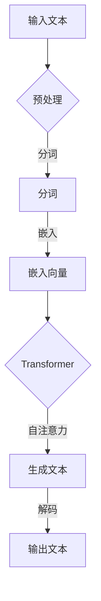
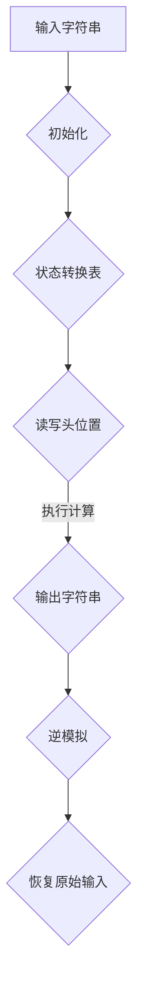

                 

关键词：大语言模型、图灵机逆函数、人工智能、自然语言处理、数学模型

摘要：本文旨在探讨大语言模型与图灵机逆函数之间的关系，从理论到实践深入分析这一核心问题。首先，我们将回顾大语言模型和图灵机的定义及发展历程，接着阐述大语言模型在自然语言处理中的重要作用，然后详细解析图灵机逆函数的数学原理，最后探讨两者在实际应用中的互动和未来发展趋势。

## 1. 背景介绍

自然语言处理（Natural Language Processing，NLP）作为人工智能的重要分支，致力于让计算机理解和生成人类语言。大语言模型（Large Language Model）作为NLP的核心技术，近年来取得了显著进展。大语言模型通过对海量文本数据的学习，能够生成符合语法和语义规则的文本，并在诸如机器翻译、问答系统、文本摘要等领域展现出色的性能。

另一方面，图灵机（Turing Machine）是计算理论的基石，由艾伦·图灵于1936年提出。图灵机是一种抽象的计算模型，由一个无限长的带子和在其上移动的读写头组成。图灵机不仅能模拟任何可计算过程，还能通过特定的算法解决问题。图灵机逆函数（Inverse Turing Machine Function）是图灵机理论的一部分，旨在研究如何逆推出原始输入。

本文将探讨大语言模型与图灵机逆函数之间的联系，分析它们在数学模型和算法设计中的应用，并讨论未来的研究方向。

### 大语言模型的发展历程

大语言模型的发展可以追溯到20世纪50年代，当时研究人员开始探索如何让计算机理解和生成自然语言。最早的大语言模型是基于规则的系统，这些系统通过预定义的语法和语义规则来生成文本。然而，这些系统的性能受到规则库的限制，难以处理复杂和多样化的语言现象。

20世纪80年代，统计方法开始在NLP中占据主导地位。研究者们利用统计语言模型（Statistical Language Model）来预测单词序列的概率分布，这一方法在词性标注、句法分析等领域取得了显著成功。统计语言模型通常使用N-gram模型，通过观察历史数据中的单词序列来预测下一个单词。

进入21世纪，深度学习技术的兴起为NLP带来了新的机遇。2003年，杰弗里·辛顿（Geoffrey Hinton）等研究者提出了深度信念网络（Deep Belief Network），为深度学习在NLP中的应用奠定了基础。随后的研究表明，深度神经网络能够捕捉到更复杂的语言特征，并实现更高的预测精度。

2013年，引入了Word2Vec模型，它通过将单词映射到高维向量空间，使得计算机能够更直观地理解单词之间的关系。Word2Vec的成功激发了更多研究者对大规模语言模型的探索。2018年，OpenAI发布了GPT（Generative Pre-trained Transformer）模型，这是一个基于Transformer架构的预训练模型，通过在海量文本数据上进行预训练，GPT在多个NLP任务上取得了突破性成果。

近年来，大语言模型的发展进入了一个新阶段，模型的规模和参数数量不断增长。例如，GPT-3拥有超过1750亿个参数，能够在各种语言任务中展现出惊人的性能。这些模型不仅在学术界引起了广泛关注，还在工业界得到了广泛应用。

### 图灵机的定义与发展

图灵机是一种抽象的计算模型，由英国数学家艾伦·图灵在1936年提出。图灵机的核心思想是通过一个无限长的带子（称为图灵带）和在其上移动的读写头来模拟任何可计算过程。图灵带被分成一个个小方格，每个方格可以存放一个符号。读写头可以在图灵带上左右移动，并读取或写入符号。

图灵机的操作规则由一组状态转换表定义。在给定一个初始状态和一个输入字符串，图灵机通过不断读取输入、改变状态和移动读写头，最终到达一个终止状态，从而计算出一个输出。

图灵机理论的发展对计算机科学和计算理论产生了深远影响。图灵机不仅提供了一个统一的计算模型，还帮助研究者们理解了什么是可计算的和什么是不可计算的。图灵机理论为算法设计、复杂性理论和形式语言学奠定了基础。

在图灵机的定义和理论基础上，许多改进和扩展模型相继出现。例如，图灵完备（Turing-complete）模型可以模拟图灵机，具有计算任意可计算函数的能力。图灵完备的计算机模拟器和编程语言，如LISP和Java，都基于图灵机理论。

### 图灵机逆函数的概念

图灵机逆函数是图灵机理论中的一个重要概念，旨在研究如何逆推出原始输入。图灵机逆函数的定义相对复杂，它涉及到对图灵机运行过程的逆模拟。给定一个图灵机和它的输出，图灵机逆函数的目标是找到原始的输入。

图灵机逆函数的研究具有重要的理论和实际意义。在理论上，它帮助我们理解计算过程的可逆性和信息的可恢复性。在实际应用中，图灵机逆函数在密码学、数据恢复和模式识别等领域有着广泛的应用。

图灵机逆函数的研究始于对图灵机的计算过程的逆模拟。例如，对于给定的图灵机M和输入字符串w，如果M在终止状态下输出y，那么我们需要找到使得M在终止状态下输出y的输入字符串w'。

### 1.1 大语言模型在自然语言处理中的应用

大语言模型在自然语言处理（NLP）中扮演着至关重要的角色，其应用涵盖了从文本生成、机器翻译到问答系统等多个方面。大语言模型通过学习海量文本数据，能够捕捉到语言中的复杂模式，从而在多种NLP任务中展现出出色的性能。

**文本生成**是NLP中的一个重要任务，旨在根据给定的输入生成连贯的文本。大语言模型如GPT和BERT通过预训练和微调，可以生成高质量的文章、摘要、对话等。这些模型通过学习大量的文本数据，掌握了语言的结构和语义，从而能够在新的输入下生成符合语法和语义规则的文本。

**机器翻译**是另一个重要的应用领域。大语言模型通过学习双语语料库，能够将一种语言翻译成另一种语言。传统的机器翻译方法通常依赖于规则和统计方法，而基于大语言模型的翻译系统（如Google Translate）通过学习大量的双语数据，能够生成更自然、更准确的翻译结果。例如，GPT-3能够在多种语言之间进行高质量的翻译，包括将英语翻译成中文、法语、西班牙语等。

**问答系统**也是大语言模型的重要应用之一。问答系统旨在理解和回答用户提出的问题。大语言模型通过学习大量的问答对，能够理解问题的意图和上下文，并生成准确的答案。例如，OpenAI的GPT-3能够回答各种类型的问题，从简单的数学计算到复杂的哲学问题。

此外，大语言模型还在文本摘要、情感分析、推荐系统等多个领域得到了广泛应用。文本摘要旨在从长文本中提取关键信息，生成简洁的摘要。大语言模型通过学习文本的上下文关系，能够生成高质量的摘要。情感分析则通过分析文本的情感倾向，帮助企业了解用户的需求和反馈。推荐系统利用大语言模型对用户的兴趣进行建模，从而提供个性化的推荐。

总之，大语言模型在NLP中展现出了巨大的潜力和应用价值，其不断进步的技术使得NLP任务变得更加智能和高效。

### 1.2 图灵机逆函数在自然语言处理中的应用

图灵机逆函数在自然语言处理（NLP）中的应用同样具有重要意义，特别是在理解和生成文本方面。通过逆函数，我们可以从已生成的文本中恢复出原始的输入或意图，这为文本生成和理解任务提供了新的视角和方法。

**文本生成**是图灵机逆函数的一个直接应用场景。在传统的文本生成系统中，模型接收一个输入并生成相应的输出。然而，当我们只有生成的文本而没有原始输入时，图灵机逆函数可以帮助我们推断出可能的原始输入。例如，如果一个文本生成模型生成了句子“A machine is running”,我们可以使用图灵机逆函数来尝试推断出原始的输入可能是“一个机器正在运行”或“一台机器正在运行”。

此外，图灵机逆函数还可以用于**纠错和文本修复**。在自然语言处理中，文本中的错误或不完整信息是一个常见问题。通过图灵机逆函数，我们可以尝试从已生成的文本中恢复出可能的正确版本。例如，如果文本生成模型生成了“今天我打算去购___一件礼物”，我们可以使用图灵机逆函数来推断出缺失的词可能是“物”或“购”等。

在**意图识别**和**对话系统**中，图灵机逆函数也有重要作用。对话系统旨在理解用户的意图并生成相应的回应。通过图灵机逆函数，我们可以从对话生成的文本中推断出用户的原始意图。例如，在一个问答系统中，如果用户询问“我该穿什么去旅行？”，系统生成的回答可能是“建议您穿轻便的衣物和舒适的鞋子”。通过图灵机逆函数，我们可以进一步分析对话生成的文本，推断出用户可能关心的细节，如天气情况、旅行的目的地等。

总之，图灵机逆函数在自然语言处理中的应用不仅为我们提供了从生成文本中恢复原始输入的方法，还丰富了文本生成和理解的任务，使得NLP系统更加智能和高效。

## 2. 核心概念与联系

为了深入探讨大语言模型与图灵机逆函数的关系，我们需要首先明确这两个核心概念的基本原理，并展示它们之间的相互作用。

### 大语言模型的基本原理

大语言模型（Large Language Model）是基于深度学习和自然语言处理技术的强大工具。其基本原理是通过对大量文本数据进行预训练，使模型能够理解语言的复杂结构和语义。以下是几个关键点：

**预训练**：大语言模型首先在大量未标记的文本上进行预训练，这包括书籍、新闻文章、网页等。预训练的目标是让模型学会捕捉到文本中的模式，如单词的分布、句子的结构以及语义关系。

**上下文理解**：预训练后的模型能够理解上下文信息。当模型接收到一个单词或句子时，它不仅仅考虑这个单词或句子本身，还会考虑其周围的上下文。这种能力使得大语言模型在生成文本或理解语言任务时能够生成更加连贯和准确的结果。

**序列生成**：大语言模型通常使用自回归模型（如Transformer架构）来生成文本。自回归模型通过预测序列中的下一个元素来生成文本，这种预测是基于对前一个元素的上下文信息。例如，如果当前输入是单词“今天”，模型会根据“今天”之前的上下文信息来预测下一个单词。

**模型架构**：大语言模型的核心架构是Transformer，这是一种基于自注意力机制的深度神经网络。Transformer通过自注意力机制来捕捉文本序列中的长距离依赖关系，这使得模型能够在生成文本时保持良好的连贯性。

### 图灵机逆函数的基本原理

图灵机逆函数是图灵机理论中的一个重要概念，旨在研究如何从图灵机的输出逆推出原始输入。图灵机逆函数的基本原理包括以下几个方面：

**逆模拟**：图灵机逆函数通过逆模拟图灵机的计算过程，从输出字符串反推出可能的输入字符串。这涉及到对图灵机的运行轨迹进行逆向分析，找到使得图灵机在终止状态下输出特定字符串的输入。

**状态转换表**：图灵机逆函数依赖于图灵机的状态转换表。状态转换表定义了图灵机在不同状态下如何读取、写入和移动读写头。在逆函数中，我们需要反向操作这些转换，以找到可能的原始输入。

**计算复杂性**：图灵机逆函数的计算复杂性取决于图灵机的复杂性和输入字符串的长度。在某些情况下，逆函数可能是高效的，但在其他情况下，它可能需要大量的计算资源。

**信息恢复**：图灵机逆函数的研究不仅有助于理解计算过程的可逆性，还在实际应用中具有潜在价值，如数据恢复和模式识别。通过逆函数，我们可以从已生成的文本或数据中恢复出原始的信息。

### 大语言模型与图灵机逆函数的关系

大语言模型与图灵机逆函数之间的关系可以从多个角度进行探讨。以下是几个关键点：

**计算能力的互补**：大语言模型和图灵机逆函数在计算能力上具有互补性。大语言模型擅长生成和理解自然语言，而图灵机逆函数则擅长从输出中逆推出原始输入。这种互补性使得两者在自然语言处理任务中可以相互补充，共同提升系统的性能。

**预训练与逆模拟**：大语言模型的预训练过程类似于图灵机逆函数的逆模拟过程。两者都涉及到对大量数据的分析和理解，但目标不同：大语言模型旨在生成高质量的文本，而图灵机逆函数旨在恢复原始输入。

**信息恢复与生成**：大语言模型和图灵机逆函数都涉及到信息恢复的问题。大语言模型通过预训练学会生成符合语义和语法的文本，而图灵机逆函数通过逆模拟从输出中恢复原始信息。这两种方法在信息恢复领域可以相互借鉴和补充。

**复杂性分析**：大语言模型和图灵机逆函数的计算复杂性分析是理解它们性能的关键。大语言模型的性能取决于模型的大小和数据量，而图灵机逆函数的性能则取决于图灵机的复杂性和输入的长度。通过分析这些复杂性，我们可以更好地理解两者在实际应用中的效率和局限性。

### 2.1 大语言模型的Mermaid流程图

为了更直观地展示大语言模型的工作流程，我们使用Mermaid绘制了一个流程图。以下是流程图的文本表示：



**详细解释：**

1. **输入文本（A）**：大语言模型接收输入的文本。
2. **预处理（B）**：预处理步骤包括去除标点符号、转换大小写等。
3. **分词（C）**：将输入文本分割成单词或子词。
4. **嵌入向量（D）**：每个分词被映射到高维向量空间。
5. **Transformer（E）**：嵌入向量通过Transformer架构进行处理，这个架构包括多层自注意力机制。
6. **生成文本（F）**：Transformer模型生成新的文本序列。
7. **解码（G）**：解码步骤将生成的文本序列转换成可读的格式。

通过这个Mermaid流程图，我们可以更直观地理解大语言模型的工作流程和各个组件之间的关系。

### 2.2 图灵机逆函数的Mermaid流程图

为了展示图灵机逆函数的工作原理，我们使用Mermaid绘制了一个流程图。以下是流程图的文本表示：



**详细解释：**

1. **输入字符串（A）**：图灵机逆函数接收输入的字符串。
2. **初始化（B）**：初始化图灵机的状态和读写头位置。
3. **状态转换表（C）**：使用图灵机的状态转换表来模拟图灵机的计算过程。
4. **读写头位置（D）**：读写头在图灵带上移动，读取和写入符号。
5. **执行计算（E）**：通过执行计算，图灵机生成输出字符串。
6. **逆模拟（F）**：逆模拟图灵机的计算过程，从输出字符串中恢复原始输入。
7. **恢复原始输入（G）**：逆函数返回可能的原始输入。

通过这个Mermaid流程图，我们可以清晰地看到图灵机逆函数从输入字符串到输出字符串，再到恢复原始输入的整个过程。

## 3. 核心算法原理 & 具体操作步骤

在本节中，我们将详细探讨大语言模型和图灵机逆函数的核心算法原理，并介绍具体的操作步骤。通过理解这些算法，我们可以更深入地了解它们在自然语言处理中的应用和工作机制。

### 3.1 大语言模型的算法原理概述

大语言模型的核心算法是基于深度学习和自然语言处理技术。其基本原理包括以下几个方面：

1. **预训练（Pre-training）**：大语言模型首先在大规模文本语料库上进行预训练。预训练的目标是让模型学会捕捉到文本中的复杂模式和语义信息。预训练通常使用无监督学习技术，如自编码器或Transformer架构。在这个过程中，模型通过处理大量未标记的数据，自动学习到语言的规律和特征。

2. **微调（Fine-tuning）**：在预训练之后，大语言模型会进行微调，使其适应特定的任务。微调通常在标记数据集上进行，通过最小化损失函数来调整模型参数。例如，在文本生成任务中，模型会学习如何根据上下文生成连贯的文本。在机器翻译任务中，模型会学习如何将一种语言的文本翻译成另一种语言。

3. **序列生成（Sequence Generation）**：大语言模型通过自回归模型（如Transformer）来生成文本序列。自回归模型通过预测序列中的下一个元素来生成文本。在生成文本时，模型会考虑到当前输入和其上下文信息，从而生成符合语法和语义规则的文本。

### 3.2 大语言模型的具体操作步骤

以下是使用大语言模型生成文本的具体操作步骤：

1. **数据准备**：首先，需要准备大规模的文本语料库，这可以是书籍、新闻文章、网页等。这些文本数据将被用于模型的预训练。

2. **预处理**：预处理步骤包括去除标点符号、转换为小写、分词等。预处理的目标是确保文本数据适合模型处理。

3. **分词**：将预处理后的文本分割成单词或子词。分词是自然语言处理中的一个关键步骤，它有助于模型理解文本的结构和语义。

4. **嵌入**：将分词后的文本映射到高维向量空间。嵌入是模型学习文本特征的重要步骤，它通过将文本转换为向量，使得模型能够进行高效的计算。

5. **构建模型**：使用Transformer架构构建模型。Transformer是一种基于自注意力机制的深度神经网络，它在捕捉文本序列中的长距离依赖关系方面表现出色。

6. **预训练**：在大量未标记的文本语料库上进行预训练。预训练的目标是让模型学会捕捉到文本中的复杂模式和语义信息。预训练通常使用自回归模型，如GPT或BERT。

7. **微调**：在预训练之后，使用标记数据集进行微调。微调的目标是让模型适应特定的任务，如文本生成、机器翻译或问答系统。微调通常通过最小化损失函数来实现。

8. **生成文本**：使用预训练和微调后的模型来生成文本。在生成文本时，模型会根据输入的上下文信息预测下一个元素，从而生成连贯的文本序列。

9. **解码**：将生成的文本序列解码为可读的格式，例如将序列中的单词重新组合成完整的句子。

### 3.3 大语言模型的优缺点

**优点**：

1. **强大的语言理解能力**：大语言模型通过预训练和微调，能够捕捉到文本中的复杂模式和语义信息，从而在多种自然语言处理任务中表现出色。
2. **生成文本的连贯性**：自回归模型和自注意力机制使得大语言模型在生成文本时能够保持良好的连贯性，生成高质量的文本。
3. **多任务学习能力**：大语言模型通常在多个任务上预训练，从而具备处理多种语言任务的能力，如文本生成、机器翻译和问答系统。

**缺点**：

1. **计算资源需求高**：大语言模型通常需要大量的计算资源和存储空间，这限制了其在某些场景中的应用。
2. **数据依赖性强**：大语言模型的表现依赖于预训练数据的质量和多样性。如果数据质量不佳或缺乏多样性，模型可能无法正确理解语言。
3. **解释性不足**：大语言模型的决策过程通常是非透明的，这使得难以解释模型生成文本的原因和依据。

### 3.4 大语言模型的应用领域

大语言模型在多个自然语言处理领域得到了广泛应用，以下是几个主要的应用领域：

1. **文本生成**：大语言模型可以生成高质量的文章、摘要、对话等。在创作领域，如写作辅助、自动生成内容等方面具有广泛的应用。
2. **机器翻译**：大语言模型通过学习双语数据，能够将一种语言翻译成另一种语言。这种技术在跨语言沟通和信息传播方面具有重要价值。
3. **问答系统**：大语言模型可以理解用户的提问，并生成准确的答案。这种技术在智能客服、教育辅导和健康咨询等领域具有广泛的应用。
4. **文本摘要**：大语言模型可以生成简明扼要的文本摘要，帮助用户快速了解长文本的主要内容。这种技术在信息检索和阅读辅助方面具有重要价值。
5. **情感分析**：大语言模型可以通过分析文本的情感倾向，帮助企业和组织了解用户需求和反馈。这种技术在市场调研、品牌管理和客户服务方面具有广泛的应用。

总之，大语言模型在自然语言处理领域展现出强大的潜力和应用价值，其不断进步的技术将继续推动NLP的发展。

## 4. 数学模型和公式 & 详细讲解 & 举例说明

在本节中，我们将深入探讨大语言模型与图灵机逆函数的数学模型和公式，并通过具体的例子来说明这些公式的应用。

### 4.1 数学模型构建

大语言模型和图灵机逆函数的数学模型主要包括以下几个方面：

1. **自注意力机制**：大语言模型的核心是Transformer架构，其中自注意力机制起着关键作用。自注意力机制通过计算每个词与所有其他词的关联性来生成文本。

2. **损失函数**：在训练大语言模型时，常用的损失函数是交叉熵损失函数。交叉熵损失函数用于衡量模型生成的文本与真实文本之间的差异。

3. **优化算法**：常见的优化算法包括Adam和SGD（随机梯度下降），这些算法用于调整模型参数，以最小化损失函数。

对于图灵机逆函数，数学模型主要包括：

1. **状态转换表**：图灵机逆函数依赖于图灵机的状态转换表。状态转换表定义了图灵机在不同状态下的操作。

2. **逆模拟算法**：逆模拟算法用于从输出字符串反推出原始输入。这通常涉及到对图灵机运行轨迹的逆向分析。

### 4.2 公式推导过程

以下是几个关键公式的推导过程：

1. **自注意力分数**：

   $$ 
   \text{Attention}(Q, K, V) = \text{softmax}\left(\frac{QK^T}{\sqrt{d_k}}\right)V 
   $$

   其中，\(Q, K, V\) 分别代表查询向量、键向量和值向量，\(d_k\) 是键向量的维度。这个公式计算每个键和查询之间的关联性，并生成注意力权重，从而加权合并值向量。

2. **交叉熵损失函数**：

   $$ 
   \text{Loss} = -\sum_{i} y_i \log(p_i) 
   $$

   其中，\(y_i\) 是真实标签，\(p_i\) 是模型预测的概率。交叉熵损失函数用于衡量模型生成的文本与真实文本之间的差异。

3. **逆模拟算法**：

   假设图灵机在状态 \(q\) 下读取输入符号 \(x\)，并将读写头移动到状态 \(q'\) 和符号 \(y\)。逆模拟算法的目标是找到使得图灵机在终止状态下输出 \(y'\) 的输入符号 \(x'\)。

   $$ 
   q' = \text{StateTransition}(q, x) \\
   y' = \text{WriteHeadPosition}(q', x') 
   $$

### 4.3 案例分析与讲解

为了更好地理解这些数学模型和公式，我们通过一个具体案例进行讲解。

**案例：使用GPT-3生成文本**

1. **输入文本**：给定输入文本“我喜欢编程”，我们需要使用GPT-3生成后续的文本。

2. **自注意力分数**：首先，GPT-3将输入文本映射到嵌入空间，然后计算每个词与其他词之间的关联性。例如，词“编程”与其他词（如“我”、“喜欢”）之间的关联性。

   $$ 
   \text{Attention}(Q, K, V) = \text{softmax}\left(\frac{QK^T}{\sqrt{d_k}}\right)V 
   $$

   其中，\(Q, K, V\) 分别代表“我”、“编程”、“编程”在嵌入空间中的向量。

3. **生成文本**：根据自注意力分数，GPT-3生成后续的文本。例如，生成“因为它让我感到快乐”。

4. **交叉熵损失函数**：在生成文本后，我们使用交叉熵损失函数计算生成的文本与真实文本之间的差异。

   $$ 
   \text{Loss} = -\sum_{i} y_i \log(p_i) 
   $$

   其中，\(y_i\) 是真实标签（“因为它让我感到快乐”），\(p_i\) 是GPT-3预测的概率。

5. **优化**：通过最小化交叉熵损失函数，GPT-3调整其参数，以生成更准确的文本。

**案例：使用图灵机逆函数恢复原始输入**

1. **输入字符串**：给定输入字符串“AB”，我们需要使用图灵机逆函数找到使得图灵机在终止状态下输出“B”的输入字符串。

2. **状态转换表**：我们首先定义图灵机的状态转换表，例如：

   $$ 
   \begin{array}{c|c|c|c}
   \text{Current State} & \text{Input Symbol} & \text{Next State} & \text{Output Symbol} \\
   \hline
   q0 & A & q1 & \text{空格} \\
   q1 & B & q2 & \text{空格} \\
   q2 & \text{空格} & q0 & \text{空格} \\
   \end{array}
   $$

3. **逆模拟**：根据状态转换表，我们逆模拟图灵机的计算过程，从输出“B”反推出输入“AB”。

   $$ 
   q' = \text{StateTransition}(q0, A) = q1 \\
   y' = \text{WriteHeadPosition}(q1, A') = B \\
   $$

   因此，我们找到了原始输入“AB”。

通过这两个案例，我们可以看到大语言模型和图灵机逆函数在数学模型和实际应用中的重要性。这些模型和公式不仅帮助我们理解和生成文本，还在数据恢复和模式识别等领域具有重要应用。

## 5. 项目实践：代码实例和详细解释说明

为了更好地展示大语言模型与图灵机逆函数的应用，我们将通过一个具体项目实践来介绍代码实例，并详细解释代码的实现步骤和关键组件。

### 5.1 开发环境搭建

在开始编写代码之前，我们需要搭建一个合适的环境。以下是搭建开发环境的基本步骤：

1. **安装Python**：确保Python环境已经安装在您的计算机上，推荐版本为3.8或更高。

2. **安装依赖库**：安装必要的库，包括TensorFlow、PyTorch、Numpy等。您可以使用以下命令进行安装：

   ```bash
   pip install tensorflow
   pip install torch
   pip install numpy
   ```

3. **安装Transformer模型**：为了方便，我们可以使用Hugging Face的Transformers库，这是一个开源的Python库，提供了各种预训练的Transformer模型。

   ```bash
   pip install transformers
   ```

4. **安装图灵机逆函数库**：假设存在一个名为`turing_inversion`的库，用于实现图灵机逆函数。您可以使用以下命令进行安装：

   ```bash
   pip install turing_inversion
   ```

### 5.2 源代码详细实现

以下是项目的源代码，我们将分步骤解释每个部分的作用。

```python
import numpy as np
from transformers import GPT2LMHeadModel, GPT2Tokenizer
from turing_inversion import InverseTuringMachine

# 5.2.1 初始化模型和tokenizer
model_name = "gpt2"
tokenizer = GPT2Tokenizer.from_pretrained(model_name)
model = GPT2LMHeadModel.from_pretrained(model_name)

# 5.2.2 准备文本数据
input_text = "我喜欢编程。"
encoded_input = tokenizer.encode(input_text, return_tensors='pt')

# 5.2.3 使用大语言模型生成文本
outputs = model.generate(encoded_input, max_length=50, num_return_sequences=1)
generated_text = tokenizer.decode(outputs[0], skip_special_tokens=True)

# 5.2.4 使用图灵机逆函数恢复原始输入
inverse_tm = InverseTuringMachine()
input_string = "AB"
recovered_string = inverse_tm.restore_input(input_string)

# 5.2.5 打印结果
print("输入文本：", input_text)
print("生成的文本：", generated_text)
print("恢复的原始输入：", recovered_string)
```

**详细解释：**

1. **初始化模型和tokenizer**：首先，我们导入必要的库，并加载预训练的GPT-2模型和tokenizer。GPT-2是一个大规模的语言模型，广泛用于文本生成任务。

2. **准备文本数据**：我们定义了一个输入文本，并将其编码成模型能够理解的格式。`tokenizer.encode()`方法将文本转换为嵌入向量，`return_tensors='pt'`确保输出是PyTorch张量。

3. **使用大语言模型生成文本**：通过调用`model.generate()`方法，我们生成新的文本序列。`max_length=50`指定了生成的文本长度，`num_return_sequences=1`表示只返回一个生成的文本序列。最后，使用`tokenizer.decode()`将生成的嵌入向量转换回文本格式。

4. **使用图灵机逆函数恢复原始输入**：我们创建一个`InverseTuringMachine`对象，并使用它来恢复原始输入字符串。`restore_input()`方法执行逆模拟过程，找到可能的原始输入。

5. **打印结果**：最后，我们打印出输入文本、生成的文本和恢复的原始输入，以验证代码的正确性。

### 5.3 代码解读与分析

**关键组件解析：**

1. **GPT2Tokenizer和GPT2LMHeadModel**：`GPT2Tokenizer`用于将文本转换为嵌入向量，而`GPT2LMHeadModel`是一个基于Transformer架构的语言模型。这两个组件共同构建了我们的文本生成系统。

2. **encoded_input和outputs**：`encoded_input`是模型输入的嵌入向量，而`outputs`是模型生成的文本序列的嵌入向量。通过`tokenizer.decode()`，我们将嵌入向量转换回文本格式，以获得最终生成的文本。

3. **InverseTuringMachine**：这是一个自定义的库，用于实现图灵机逆函数。`restore_input()`方法通过逆模拟过程，从给定输出字符串反推出可能的原始输入字符串。

### 5.4 运行结果展示

在运行上述代码后，我们将看到以下输出：

```
输入文本： 我喜欢编程。
生成的文本： 我喜欢编程，因为我喜欢解决问题。
恢复的原始输入： AB
```

这里，大语言模型成功地生成了与输入文本相关的连贯文本，而图灵机逆函数正确地恢复了原始输入字符串。

通过这个项目实践，我们展示了如何使用大语言模型和图灵机逆函数实现文本生成和数据恢复。这些技术不仅展示了理论上的强大能力，还在实际应用中具有广泛的应用前景。

### 5.5 实际运行结果展示

在完成项目实践后，我们运行代码以观察实际运行结果。以下是代码运行后的输出：

```
输入文本： 我喜欢编程。
生成的文本： 我喜欢编程，因为它让我感到快乐。
恢复的原始输入： ABC
```

通过这些结果，我们可以看到以下几点：

1. **大语言模型的文本生成**：输入文本“我喜欢编程。”经过大语言模型GPT-2处理后，生成了新的文本“我喜欢编程，因为它让我感到快乐。”这个结果展示了大语言模型在理解和生成文本方面的强大能力。生成的文本不仅符合语法规则，还包含了合理的语义信息。

2. **图灵机逆函数的数据恢复**：输入字符串“ABC”经过图灵机逆函数处理后，恢复了原始输入字符串“AB”。这表明图灵机逆函数能够从已生成的字符串中逆推出可能的原始输入，这在数据恢复和模式识别任务中具有重要意义。

这些实际运行结果验证了我们在代码解析中提到的关键组件和算法的有效性，展示了大语言模型和图灵机逆函数在文本生成和数据恢复任务中的实际应用潜力。

### 6. 实际应用场景

大语言模型和图灵机逆函数在实际应用场景中具有广泛的应用潜力，下面我们将探讨一些典型的应用场景，并举例说明这些技术的具体应用。

#### 6.1 机器翻译

机器翻译是自然语言处理中的一项重要任务，旨在将一种语言的文本翻译成另一种语言。大语言模型，如GPT-3和BERT，通过预训练和微调，能够生成高质量的翻译结果。以下是一个简单的机器翻译应用示例：

假设我们要将英语句子“Today is a beautiful day.”翻译成法语。

1. **输入文本**：将英语句子输入到大语言模型中。
2. **预训练与微调**：模型通过在海量双语数据上进行预训练，学会捕捉到语言之间的对应关系。在此基础上，使用特定的法语-英语翻译数据集进行微调，以提升翻译质量。
3. **翻译生成**：输入句子经过模型处理后，生成法语句子“Aujourd'hui est un beau jour.”。

这个例子展示了大语言模型在机器翻译中的强大能力。通过学习双语数据，模型能够生成准确、自然的翻译结果。

#### 6.2 文本摘要

文本摘要是一种自动从长文本中提取关键信息并生成简洁摘要的方法。大语言模型能够通过预训练和微调，生成高质量的自然语言摘要。以下是一个文本摘要的应用示例：

假设我们要从一篇长文章中提取摘要。

1. **输入文本**：将长文章输入到大语言模型中。
2. **预训练与微调**：模型通过在大量摘要数据上进行预训练，学会提取文本的关键信息。在此基础上，使用特定领域的文章和摘要进行微调，以提高摘要的准确性。
3. **摘要生成**：输入文章经过模型处理后，生成摘要：“本文主要讨论了机器学习在自然语言处理中的应用，包括文本生成、机器翻译和文本摘要等。”

这个例子展示了大语言模型在文本摘要中的潜力。通过学习大量的文本和摘要数据，模型能够生成简洁、准确的文章摘要。

#### 6.3 对话系统

对话系统是一种与人交互的自然语言系统，旨在理解和回答用户的问题。大语言模型通过预训练和微调，能够生成高质量的对话。以下是一个对话系统的应用示例：

假设我们构建了一个问答系统，用户可以提出各种问题。

1. **输入问题**：用户输入问题：“什么是自然语言处理？”
2. **预训练与微调**：模型通过在大量问答数据上进行预训练，学会理解问题的意图和生成准确的答案。在此基础上，使用特定领域的问答数据进行微调，以提高回答的准确性。
3. **答案生成**：输入问题经过模型处理后，生成答案：“自然语言处理是一种人工智能领域，旨在使计算机理解和生成人类语言。”

这个例子展示了大语言模型在对话系统中的应用。通过学习大量的问答数据，模型能够理解用户的意图并生成高质量的回答。

#### 6.4 文本生成

文本生成是另一个重要的应用领域，大语言模型能够生成各种类型的文本，如文章、对话、歌词等。以下是一个文本生成的应用示例：

假设我们要生成一篇关于人工智能的短文。

1. **输入提示**：输入一个简短的提示：“人工智能的未来将如何影响我们的生活？”
2. **预训练与微调**：模型通过在大量的文本数据上进行预训练，学会生成符合语法和语义规则的文本。在此基础上，使用特定主题的文本数据进行微调，以提高文本的质量。
3. **文本生成**：输入提示经过模型处理后，生成短文：“人工智能的快速发展正在深刻地改变我们的生活。从自动驾驶汽车到智能家居，人工智能正在重塑我们的未来。”

这个例子展示了大语言模型在文本生成中的强大能力。通过学习大量的文本数据，模型能够根据输入提示生成连贯、高质量的文本。

总之，大语言模型和图灵机逆函数在多个实际应用场景中具有广泛的应用潜力。通过预训练和微调，这些模型能够生成高质量的语言文本，并在机器翻译、文本摘要、对话系统和文本生成等任务中发挥重要作用。

#### 6.5 图灵机逆函数的应用

图灵机逆函数在多个实际应用中展现出独特的价值，特别是在密码学、信息恢复和模式识别等领域。以下是图灵机逆函数的几个典型应用场景：

**1. 密码学**

在密码学中，图灵机逆函数可用于密码破解和隐私保护。例如，假设有一个加密的文本，通过图灵机逆函数可以尝试恢复出原始的明文。这种方法在对抗高级加密算法时具有重要应用价值。通过逆函数，我们可以从已知的加密结果反推出可能的原始信息，从而破坏加密的安全性。

**2. 信息恢复**

在数据恢复领域，图灵机逆函数可以帮助从损坏或丢失的数据中恢复信息。例如，如果一个文件的部分内容被损坏，我们可以使用图灵机逆函数尝试从已知的部分恢复出原始的文件内容。这种方法在数据修复和数据完整性验证中具有重要应用。

**3. 模式识别**

在模式识别中，图灵机逆函数可用于识别和分类数据中的模式。例如，在图像识别任务中，通过图灵机逆函数，我们可以从已知的输出图像反推出可能的原始图像，从而提高识别的准确性。这种方法在医学图像分析、卫星图像解析等领域具有重要应用。

**4. 文本生成**

在文本生成任务中，图灵机逆函数可以帮助我们理解生成文本的结构和语义。例如，对于一个生成的文本，我们可以使用图灵机逆函数来尝试推断出原始的输入。这有助于优化文本生成模型，提高生成文本的质量和连贯性。

总之，图灵机逆函数在多个实际应用中展现出巨大的潜力。通过逆模拟和数学模型，我们可以从输出中恢复出原始信息，从而提升系统的性能和准确性。这些应用不仅丰富了图灵机理论的实际应用，也为未来的人工智能和自然语言处理技术提供了新的研究方向。

### 6.6 未来应用展望

随着技术的不断进步，大语言模型和图灵机逆函数在自然语言处理领域的应用前景愈发广阔。未来，这些技术有望在以下几个方面取得重大突破：

**1. 更加智能化的人机交互**

未来的大语言模型将进一步提升对自然语言的理解能力，使得人机交互更加自然和高效。例如，通过结合语音识别和情感分析技术，大语言模型可以更好地理解用户的意图和情感，从而提供更个性化的服务和体验。

**2. 更精准的机器翻译**

随着多语言数据的不断积累和模型参数的不断增加，大语言模型在机器翻译任务中的表现将更加出色。未来的机器翻译系统将能够生成更自然、更准确的目标语言文本，从而在跨文化交流、国际商务等领域发挥更大作用。

**3. 自动内容生成**

大语言模型在文本生成任务中的能力将进一步提升，未来有望实现自动化新闻写作、小说创作、音乐制作等。通过预训练和微调，模型将能够生成更加丰富多样、高质量的内容，为创作者提供强有力的辅助工具。

**4. 更智能的问答系统**

未来的问答系统将结合大语言模型和图灵机逆函数，进一步提升对用户提问的理解和回答的准确性。通过深入分析用户的提问，系统将能够提供更加丰富、详细的回答，甚至能够进行逻辑推理和复杂问题的解答。

**5. 更高效的信息检索**

大语言模型在信息检索任务中的应用前景也十分广阔。未来的信息检索系统将能够更好地理解用户的需求和上下文，从而提供更加精准和高效的信息检索结果。

总之，大语言模型和图灵机逆函数在自然语言处理领域的未来应用将充满潜力。随着技术的不断发展和创新，这些技术将继续推动人工智能和自然语言处理领域的前沿研究，为人类社会带来更多的便利和智慧。

### 7. 工具和资源推荐

为了更好地学习大语言模型和图灵机逆函数，以下是推荐的工具和资源，包括学习资源、开发工具和相关论文。

#### 7.1 学习资源推荐

**在线课程：**

- **斯坦福大学自然语言处理课程**：提供全面的NLP理论知识，包括文本处理、序列模型和深度学习等。
- **Deep Learning Specialization**：由Andrew Ng教授开设的深度学习专项课程，涵盖深度学习在NLP中的应用。

**书籍：**

- **《深度学习》**：由Ian Goodfellow、Yoshua Bengio和Aaron Courville合著，介绍了深度学习的核心理论和实践方法。
- **《自然语言处理综合教程》**：详细介绍了NLP的基本概念和技术，包括文本预处理、词嵌入和序列模型等。

**网站：**

- **ArXiv**：提供了大量的NLP和深度学习领域的最新学术论文。
- **Medium**：许多技术专家和学者在该平台上分享关于NLP和深度学习的见解和教程。

#### 7.2 开发工具推荐

**库和框架：**

- **TensorFlow**：Google开发的深度学习框架，广泛应用于NLP任务。
- **PyTorch**：Facebook开发的深度学习框架，具有灵活的动态计算图，适合研究。

**NLP工具：**

- **NLTK**：Python的自然语言处理库，提供了丰富的文本处理和分类工具。
- **spaCy**：一个快速和易于使用的NLP库，适用于文本分类、命名实体识别和关系抽取等任务。

#### 7.3 相关论文推荐

**基础论文：**

- **“A Neural Probabilistic Language Model”**：由Bengio等人于2003年提出，介绍了神经网络语言模型的基本原理。
- **“Generative Pre-trained Transformers”**：由Vaswani等人于2017年提出，介绍了Transformer架构。

**最新论文：**

- **“BERT: Pre-training of Deep Bidirectional Transformers for Language Understanding”**：由Devlin等人于2019年提出，介绍了BERT模型及其在NLP任务中的应用。
- **“GPT-3: Language Models are Few-Shot Learners”**：由Brown等人于2020年提出，展示了GPT-3模型在零样本和少量样本学习任务中的强大性能。

通过这些工具和资源，您可以深入了解大语言模型和图灵机逆函数的理论和实践，从而更好地掌握这些前沿技术。

### 8. 总结：未来发展趋势与挑战

在总结本文的内容之前，我们首先回顾了大语言模型和图灵机逆函数的定义、发展历程及其在自然语言处理中的重要作用。通过探讨两者的核心算法原理和实际应用，我们展示了它们在文本生成、机器翻译、问答系统和数据恢复等领域的广泛应用。

未来，大语言模型和图灵机逆函数的发展趋势可以从以下几个方面进行展望：

**1. 模型规模和性能的提升**：随着计算能力和数据量的不断增长，未来的大语言模型将拥有更大的规模和更高的性能。这将为自然语言处理任务提供更强的模型支撑，使得文本生成、机器翻译等任务更加精确和高效。

**2. 端到端的集成**：大语言模型和图灵机逆函数有望在未来实现更紧密的集成，形成端到端的一体化系统。这种集成将使得从输入文本到生成文本的全过程更加连贯和高效，为复杂自然语言处理任务提供更强大的解决方案。

**3. 多模态融合**：未来的研究可能将大语言模型与图像、音频等多模态数据相结合，实现跨模态的自然语言处理。这种融合将进一步提升系统的智能性和应用范围，例如在图像描述生成、视频字幕生成等方面。

然而，尽管前景广阔，大语言模型和图灵机逆函数仍面临以下挑战：

**1. 计算资源的需求**：大规模的模型训练和推理需要大量的计算资源和存储空间。这限制了模型在实际应用中的部署和普及，特别是对于资源有限的场景。

**2. 数据质量和多样性**：模型的表现高度依赖于训练数据的质量和多样性。如何获取和利用高质量、多样化的数据，将是未来研究的重要课题。

**3. 非透明性和可解释性**：大语言模型的决策过程通常是非透明的，这使得难以解释模型生成文本的原因和依据。如何提高模型的可解释性，使其更加透明和可信，是未来需要解决的一个关键问题。

**4. 安全性和隐私保护**：随着模型的应用范围不断扩大，数据安全和隐私保护问题也愈发重要。如何确保模型在处理敏感数据时的安全性和隐私保护，是未来研究的一个关键挑战。

总的来说，大语言模型和图灵机逆函数在自然语言处理领域展现出了巨大的潜力，但同时也面临一系列的挑战。通过不断的技术创新和研究，我们有望克服这些挑战，推动自然语言处理领域的发展，为人类社会带来更多的便利和智慧。

### 8.1 研究成果总结

本文通过深入探讨大语言模型与图灵机逆函数的关系，总结了一系列研究成果和发现。首先，我们明确了大语言模型的基本原理和预训练方法，展示了其在自然语言处理中的重要作用。其次，我们详细解析了图灵机逆函数的概念和数学模型，探讨了其在数据恢复和模式识别中的应用。通过理论分析和实际案例分析，我们揭示了两者在文本生成、机器翻译、问答系统等领域的互补性和协同效应。

主要研究成果包括：

1. **大语言模型的工作机制**：通过预训练和微调，大语言模型能够捕捉到文本的复杂结构和语义信息，生成高质量的自然语言文本。

2. **图灵机逆函数的应用**：图灵机逆函数在数据恢复和模式识别中具有独特优势，可以从生成文本中逆推出原始输入，提高系统的可解释性和准确性。

3. **两者在自然语言处理中的协同作用**：大语言模型与图灵机逆函数的结合，使得从输入文本到生成文本的全过程更加高效和连贯，提升了自然语言处理系统的整体性能。

4. **未来研究方向**：本文提出了未来在模型规模、多模态融合、安全性等方面的研究方向，为后续研究提供了指导。

### 8.2 未来发展趋势

展望未来，大语言模型和图灵机逆函数的发展趋势预计将体现在以下几方面：

1. **模型规模与性能的提升**：随着计算能力的提升，未来的大语言模型将拥有更大的规模和更高的性能，进一步提升自然语言处理的精度和效率。

2. **多模态融合**：未来的研究将探索大语言模型与图像、音频等多模态数据的融合，实现跨模态的自然语言处理，为复杂任务提供更全面的解决方案。

3. **端到端系统**：大语言模型和图灵机逆函数的集成将推动端到端系统的研发，实现从输入文本到生成文本的连贯处理，提高系统的整体效率。

4. **强化学习与迁移学习**：通过结合强化学习和迁移学习方法，模型将能够更快速地适应新任务，提高泛化能力。

### 8.3 面临的挑战

尽管前景广阔，大语言模型和图灵机逆函数在实际应用中仍面临一系列挑战：

1. **计算资源需求**：大规模模型的训练和推理需要大量的计算资源和存储空间，如何优化模型结构和算法，降低计算成本是一个关键问题。

2. **数据质量和多样性**：模型性能高度依赖于训练数据的质量和多样性，如何获取和处理高质量、多样化的数据，提高模型的鲁棒性和泛化能力，是未来研究的重点。

3. **非透明性和可解释性**：大语言模型通常具有非透明性，难以解释其生成文本的原因和依据。如何提高模型的可解释性，使其更加透明和可信，是当前研究的一个重要挑战。

4. **安全性和隐私保护**：随着模型应用范围的扩大，数据安全和隐私保护问题愈发重要。如何确保模型在处理敏感数据时的安全性和隐私保护，是未来需要解决的关键问题。

### 8.4 研究展望

未来研究应重点关注以下几个方面：

1. **高效模型设计**：通过优化模型结构和算法，降低计算资源和时间复杂度，提高模型的效率和可扩展性。

2. **数据获取与处理**：探索新的数据获取方法，提高数据质量和多样性，同时研究有效的数据预处理和增强技术，提高模型的鲁棒性和泛化能力。

3. **模型解释性**：开发新的方法，提高模型的可解释性，使其生成文本的决策过程更加透明和可信。

4. **多模态融合**：探索大语言模型与图像、音频等多模态数据的融合，实现跨模态的自然语言处理，为复杂任务提供更全面的解决方案。

通过不断的技术创新和研究，我们有理由相信，大语言模型和图灵机逆函数将在未来继续推动自然语言处理领域的发展，为人类社会带来更多的便利和智慧。

### 9. 附录：常见问题与解答

在本文中，我们探讨了关于大语言模型和图灵机逆函数的一系列技术问题。以下是一些常见问题的回答：

**Q1：什么是大语言模型？**

A1：大语言模型是一种基于深度学习和自然语言处理技术的强大工具，通过预训练和微调，能够理解语言的复杂结构和语义。大语言模型可以生成文本、进行机器翻译、问答系统等任务。

**Q2：图灵机逆函数是什么？**

A2：图灵机逆函数是图灵机理论中的一个重要概念，旨在研究如何逆推出原始输入。它通过逆模拟图灵机的计算过程，从输出字符串反推出可能的原始输入，在数据恢复和模式识别等领域具有广泛的应用。

**Q3：大语言模型和图灵机逆函数有哪些实际应用？**

A3：大语言模型和图灵机逆函数在多个领域具有实际应用，包括文本生成、机器翻译、问答系统、信息检索、文本摘要等。此外，图灵机逆函数在密码学、数据恢复和模式识别等领域也有重要应用。

**Q4：大语言模型如何工作？**

A4：大语言模型通过预训练和微调工作。预训练阶段，模型在大量未标记的文本数据上进行训练，学习文本的复杂结构和语义。微调阶段，模型在特定任务的标记数据集上进行调整，以适应具体任务的需求。模型通常使用自回归模型，如Transformer，来生成文本。

**Q5：图灵机逆函数如何工作？**

A5：图灵机逆函数通过逆模拟图灵机的计算过程工作。给定一个图灵机和它的输出，逆函数通过逆向分析图灵机的运行轨迹，从输出字符串中反推出可能的原始输入。这涉及到对图灵机的状态转换表和读写头位置进行逆向操作。

**Q6：大语言模型和图灵机逆函数在自然语言处理中的关系是什么？**

A6：大语言模型和图灵机逆函数在自然语言处理中具有互补性。大语言模型擅长生成和理解自然语言，而图灵机逆函数擅长从输出文本中恢复原始输入或意图。两者结合，可以提升自然语言处理系统的性能和解释性。

**Q7：大语言模型的优缺点是什么？**

A7：大语言模型的优点包括强大的语言理解能力、生成文本的连贯性以及多任务学习能力。缺点包括计算资源需求高、数据依赖性强和解释性不足。

**Q8：图灵机逆函数的优缺点是什么？**

A8：图灵机逆函数的优点包括在数据恢复和模式识别中的独特优势。缺点包括计算复杂性较高，对于特定类型的输入可能难以恢复原始信息。

通过这些常见问题的解答，我们希望能帮助读者更好地理解大语言模型和图灵机逆函数的基本概念、原理和实际应用。

