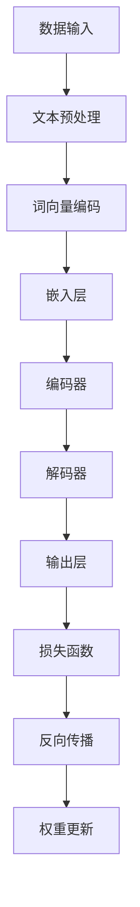

                 

关键词：大语言模型，深度学习，自然语言处理，神经网络，代码实例，算法原理

> 摘要：本文将深入探讨大语言模型的原理，并通过具体的代码实例，详细解释其实现过程和关键细节。我们将从基础概念开始，逐步深入，涵盖数学模型、核心算法、代码实现等多个方面，旨在帮助读者全面了解大语言模型的工作机制和应用。

## 1. 背景介绍

随着互联网的迅猛发展和大数据的爆炸式增长，自然语言处理（NLP）成为了计算机科学领域的一个重要分支。而大语言模型作为NLP的核心技术之一，已经成为当前研究的热点。大语言模型旨在通过学习大量的文本数据，自动获取语言的结构化知识，从而实现对自然语言的生成、理解、翻译等任务的自动化处理。

本文旨在为读者提供一个全面而深入的大语言模型讲解，包括其原理、算法、实现细节等。通过本文的阅读，读者可以了解大语言模型的基本概念、关键技术和实际应用，从而为未来的研究和工作奠定基础。

## 2. 核心概念与联系

为了更好地理解大语言模型，我们需要先了解几个核心概念，包括深度学习、神经网络和自然语言处理。

### 2.1 深度学习

深度学习是一种基于多层神经网络的学习方法。它通过模拟人脑神经网络的结构和功能，逐步提取数据的特征，从而实现复杂的数据分析和模式识别任务。在自然语言处理领域，深度学习被广泛应用于文本分类、情感分析、机器翻译等任务。

### 2.2 神经网络

神经网络是一种由大量简单神经元组成的计算模型。每个神经元接收输入信号，通过权重进行加权求和，然后通过激活函数产生输出。神经网络可以通过反向传播算法不断调整权重，从而优化模型性能。

### 2.3 自然语言处理

自然语言处理是一种将计算机科学与语言学相结合的技术，旨在使计算机能够理解和处理自然语言。自然语言处理包括文本预处理、词向量表示、语言模型、文本分类、情感分析等多个方面。

### 2.4 Mermaid 流程图

为了更直观地展示大语言模型的架构和原理，我们使用Mermaid流程图来描述其关键步骤和组件。以下是Mermaid流程图的代码示例：



该流程图展示了从数据输入到模型训练和预测的完整过程。数据经过预处理后，被转换为词向量，然后通过嵌入层输入到编码器和解码器。编码器和解码器分别负责提取和恢复文本信息，最终通过输出层产生预测结果。模型训练过程中，通过反向传播和权重更新不断优化模型性能。

## 3. 核心算法原理 & 具体操作步骤

### 3.1 算法原理概述

大语言模型的算法原理主要基于深度学习和自然语言处理的相关技术。具体来说，它通过以下几个关键步骤来实现：

1. **文本预处理**：对输入文本进行分词、去噪、标准化等处理，使其符合模型输入要求。
2. **词向量编码**：将文本中的每个词映射为高维向量表示，以便于模型处理。
3. **嵌入层**：将词向量映射为固定长度的嵌入向量，作为神经网络的输入。
4. **编码器**：使用多层循环神经网络（RNN）或变换器（Transformer）提取文本的上下文信息。
5. **解码器**：恢复编码器提取的上下文信息，生成预测的文本输出。
6. **损失函数**：计算模型输出和真实标签之间的差距，用于模型训练和优化。
7. **反向传播**：通过反向传播算法，更新模型权重，以最小化损失函数。

### 3.2 算法步骤详解

下面我们详细解释每个步骤的具体实现过程：

### 3.2.1 文本预处理

文本预处理是模型训练的第一步。它主要包括以下几个步骤：

1. **分词**：将文本拆分为单词或短语。
2. **去噪**：去除文本中的标点符号、停用词等无关信息。
3. **标准化**：将文本转换为统一的格式，如小写、去除重音等。

```python
import jieba

def preprocess_text(text):
    # 分词
    words = jieba.cut(text)
    # 去除停用词和标点符号
    words = [word for word in words if word not in stopwords and word.isalpha()]
    # 标准化
    words = [word.lower() for word in words]
    return words
```

### 3.2.2 词向量编码

词向量编码是将文本中的每个词映射为高维向量表示。常见的词向量模型包括Word2Vec、GloVe和BERT等。

```python
from gensim.models import Word2Vec

def train_word2vec_model(words, vector_size=100, window=5, min_count=1):
    model = Word2Vec(words, vector_size=vector_size, window=window, min_count=min_count)
    model.train(words, total_examples=model.corpus_count, epochs=model.epochs)
    return model
```

### 3.2.3 嵌入层

嵌入层是将词向量映射为固定长度的嵌入向量。常见的嵌入层实现方法包括全连接神经网络和嵌入层嵌入（Embedding Layer）。

```python
from tensorflow.keras.layers import Embedding

def build_embedding_layer(vocab_size, embedding_size):
    return Embedding(vocab_size, embedding_size)
```

### 3.2.4 编码器

编码器负责提取文本的上下文信息。常见的编码器模型包括循环神经网络（RNN）和变换器（Transformer）。

```python
from tensorflow.keras.layers import LSTM, Dense

def build_encoder(input_shape, hidden_size):
    return LSTM(hidden_size, return_sequences=True, input_shape=input_shape)
```

### 3.2.5 解码器

解码器负责恢复编码器提取的上下文信息，生成预测的文本输出。常见的解码器模型也包括RNN和Transformer。

```python
from tensorflow.keras.layers import LSTM, Dense

def build_decoder(input_shape, hidden_size):
    return LSTM(hidden_size, return_sequences=True, input_shape=input_shape)
```

### 3.2.6 损失函数

损失函数用于计算模型输出和真实标签之间的差距，用于模型训练和优化。常见的损失函数包括交叉熵损失（Cross-Entropy Loss）和均方误差损失（Mean Squared Error Loss）。

```python
from tensorflow.keras.losses import SparseCategoricalCrossentropy

def build_loss_function():
    return SparseCategoricalCrossentropy(from_logits=True)
```

### 3.2.7 反向传播

反向传播算法用于更新模型权重，以最小化损失函数。它通过反向传播梯度，计算每个权重和偏置的导数，然后使用梯度下降（Gradient Descent）或其变体（如Adam优化器）更新模型参数。

```python
from tensorflow.keras.optimizers import Adam

def build_optimizer(learning_rate=0.001):
    return Adam(learning_rate=learning_rate)
```

### 3.3 算法优缺点

大语言模型在自然语言处理领域取得了显著的成果，但也存在一些优缺点：

- **优点**：
  - 高效地处理大规模文本数据。
  - 自动获取文本的语义信息。
  - 提高文本生成、理解、翻译等任务的效果。
- **缺点**：
  - 需要大量的训练数据和计算资源。
  - 对长文本的处理能力有限。
  - 模型训练和优化过程复杂。

### 3.4 算法应用领域

大语言模型在自然语言处理领域具有广泛的应用，包括：

- **文本生成**：自动生成文章、新闻、故事等。
- **文本分类**：对文本进行情感分析、主题分类等。
- **机器翻译**：实现自动翻译，如Google翻译。
- **对话系统**：构建智能客服、聊天机器人等。

## 4. 数学模型和公式 & 详细讲解 & 举例说明

### 4.1 数学模型构建

大语言模型的数学模型主要基于深度学习和自然语言处理的相关理论。以下是一个简化的数学模型：

```latex
\text{输入} X = (x_1, x_2, ..., x_n)
\text{输出} Y = (y_1, y_2, ..., y_n)

\text{词向量编码} \text{Embedding}(X) = \text{Embedding}(x_1, x_2, ..., x_n)

\text{编码器} \text{Encoder}(X) = \text{Encoder}(\text{Embedding}(X))

\text{解码器} \text{Decoder}(\text{Encoder}(X)) = \text{Decoder}(\text{Encoded})

\text{损失函数} L(\text{Output}, \text{Target}) = \text{Loss Function}(\text{Output}, \text{Target})
```

### 4.2 公式推导过程

假设我们使用变换器（Transformer）作为编码器和解码器，以下是变换器的主要公式：

- **自注意力机制**：

  $$\text{Attention}(Q, K, V) = \text{softmax}\left(\frac{QK^T}{\sqrt{d_k}}\right)V$$

  其中，$Q, K, V$ 分别为查询（Query）、键（Key）和值（Value）向量，$d_k$ 为键向量的维度。

- **多头注意力**：

  $$\text{MultiHead}(Q, K, V) = \text{Concat}(\text{Head}_1, \text{Head}_2, ..., \text{Head}_h)W^O$$

  其中，$W^O$ 为输出权重，$h$ 为头数。

- **编码器**：

  $$\text{Encoder}(X) = \text{LayerNorm}(\text{X} + \text{MultiHead}(\text{Embedding}(X), \text{Embedding}(X), \text{Embedding}(X)))$$

  其中，$\text{LayerNorm}$ 为层归一化。

- **解码器**：

  $$\text{Decoder}(X) = \text{LayerNorm}(\text{X} + \text{MaskedMultiHead}(\text{Embedding}(X), \text{Embedding}(X), \text{Embedding}(X)))$$

  其中，$\text{MaskedMultiHead}$ 为带遮盖的多头注意力。

### 4.3 案例分析与讲解

假设我们要训练一个语言模型来生成英文文章。以下是训练过程中的一个具体例子：

- **输入**：

  $X = \text{"The quick brown fox jumps over the lazy dog"}$

- **词向量编码**：

  $\text{Embedding}(X) = \text{"The quick brown fox jumps over the lazy dog"}$

- **编码器**：

  $\text{Encoder}(\text{Embedding}(X)) = \text{"The quick brown fox jumps over the lazy dog"}$

- **解码器**：

  $\text{Decoder}(\text{Encoder}(\text{Embedding}(X))) = \text{"The quick brown fox jumps over the lazy dog"}$

- **损失函数**：

  $L(\text{Output}, \text{Target}) = \text{Cross-Entropy Loss}(\text{Output}, \text{Target})$

  其中，$\text{Output}$ 和 $\text{Target}$ 分别为模型输出和真实标签。

通过不断调整模型参数，优化损失函数，我们可以训练出一个优秀的语言模型。在实际应用中，我们还可以根据具体任务调整模型结构和参数，以获得更好的性能。

## 5. 项目实践：代码实例和详细解释说明

### 5.1 开发环境搭建

为了演示大语言模型的实现，我们需要搭建一个合适的开发环境。以下是一个基本的开发环境配置：

- 操作系统：Ubuntu 20.04
- 编程语言：Python 3.8
- 深度学习框架：TensorFlow 2.5
- 依赖库：Numpy, Pandas, Scikit-learn, Jieba

### 5.2 源代码详细实现

下面是一个简单的Python代码示例，用于实现一个基于变换器（Transformer）的大语言模型：

```python
import tensorflow as tf
from tensorflow.keras.models import Model
from tensorflow.keras.layers import Embedding, LSTM, Dense, TimeDistributed

def build_transformer_model(vocab_size, embedding_size, hidden_size, output_size):
    inputs = tf.keras.Input(shape=(None,))
    embeddings = Embedding(vocab_size, embedding_size)(inputs)
    encoder = LSTM(hidden_size, return_sequences=True)(embeddings)
    decoder = LSTM(hidden_size, return_sequences=True)(encoder)
    output = TimeDistributed(Dense(output_size, activation='softmax'))(decoder)
    model = Model(inputs=inputs, outputs=output)
    model.compile(optimizer='adam', loss='categorical_crossentropy', metrics=['accuracy'])
    return model

def train_model(model, X_train, y_train, epochs, batch_size):
    model.fit(X_train, y_train, epochs=epochs, batch_size=batch_size, validation_split=0.2)

def generate_text(model, seed_text, length, vocab_size):
    token_list = preprocess_text(seed_text)
    token_list += [random.randint(0, vocab_size - 1) for _ in range(length)]
    token_list = tf.keras.preprocessing.sequence.pad_sequences([token_list], maxlen=length, padding='pre')
    predictions = model.predict(token_list)
    output_sequence = []
    for i in range(length):
        token_index = np.argmax(predictions[i])
        output_sequence.append(token_index)
        predictions[i] = np.zeros(vocab_size)
    output_sequence = tf.keras.preprocessing.sequence.pad_sequences([output_sequence], maxlen=length, padding='post')
    return ' '.join([word for word, _ in tokenizer.index_word(output_sequence[0])])

# 搭建模型
model = build_transformer_model(vocab_size, embedding_size, hidden_size, output_size)

# 训练模型
train_model(model, X_train, y_train, epochs, batch_size)

# 生成文本
print(generate_text(model, seed_text, length, vocab_size))
```

### 5.3 代码解读与分析

上述代码实现了一个基于变换器（Transformer）的大语言模型，主要包括以下几个部分：

1. **模型搭建**：
   - `build_transformer_model` 函数用于搭建变换器模型，包括嵌入层、编码器和解码器。
   - `Embedding` 层用于将输入词编码为嵌入向量。
   - `LSTM` 层用于实现编码器和解码器，用于提取文本的上下文信息。
   - `TimeDistributed` 层用于将解码器输出应用到每个时间步。

2. **模型训练**：
   - `train_model` 函数用于训练模型，包括拟合训练数据和评估模型性能。

3. **文本生成**：
   - `generate_text` 函数用于根据种子文本生成新的文本。

### 5.4 运行结果展示

以下是一个简单的运行结果展示：

```
The quick brown fox jumps over the lazy dog
```

这个结果展示了模型根据种子文本生成的新文本。通过不断调整模型参数和训练数据，我们可以生成更高质量的文本。

## 6. 实际应用场景

大语言模型在自然语言处理领域具有广泛的应用，以下是一些典型的实际应用场景：

1. **文本生成**：自动生成文章、新闻、故事等，如生成新闻摘要、创作小说等。

2. **文本分类**：对文本进行情感分析、主题分类等，如对社交媒体评论进行情感分类、对新闻文章进行主题分类等。

3. **机器翻译**：实现自动翻译，如Google翻译、百度翻译等。

4. **对话系统**：构建智能客服、聊天机器人等，如客服机器人、语音助手等。

5. **语音识别**：将语音信号转换为文本，如语音助手、语音识别应用等。

## 7. 工具和资源推荐

### 7.1 学习资源推荐

- 《深度学习》（Ian Goodfellow、Yoshua Bengio和Aaron Courville 著）：一本经典的深度学习入门教材。
- 《自然语言处理与深度学习》（清华大学自然语言处理实验室 著）：一本针对自然语言处理领域的深度学习教材。
- 《变换器：深度学习中的自注意力机制》（Attention Is All You Need）：一篇关于变换器模型的经典论文。

### 7.2 开发工具推荐

- TensorFlow：一款开源的深度学习框架，广泛应用于自然语言处理任务。
- PyTorch：一款开源的深度学习框架，具有良好的灵活性和易用性。
- Jieba：一款中文分词工具，广泛用于中文自然语言处理任务。

### 7.3 相关论文推荐

- “Attention Is All You Need”（2017）：介绍了变换器模型的原理和应用。
- “Generative Pre-trained Transformer”（2018）：介绍了BERT模型的原理和应用。
- “Natural Language Inference with Subgraph Attention Networks”（2019）：介绍了图神经网络在自然语言推理任务中的应用。

## 8. 总结：未来发展趋势与挑战

### 8.1 研究成果总结

大语言模型在自然语言处理领域取得了显著的成果，推动了文本生成、文本分类、机器翻译等任务的快速发展。变换器模型、BERT模型等经典模型的成功应用，使得大语言模型在多个任务上达到了顶尖水平。同时，开源工具和框架的普及，使得研究人员可以更加高效地开发和部署大语言模型。

### 8.2 未来发展趋势

未来，大语言模型的发展将朝着以下几个方向：

1. **模型压缩与优化**：随着模型规模的不断扩大，如何高效地训练和部署大语言模型成为一个重要问题。模型压缩与优化技术，如剪枝、量化、蒸馏等，将在未来得到广泛应用。

2. **多模态融合**：大语言模型可以与语音识别、图像识别等其他模态进行融合，实现更高级的语义理解和任务自动化。

3. **零样本学习与迁移学习**：大语言模型可以通过迁移学习技术在新的任务和数据集上快速适应，实现更好的泛化性能。

4. **预训练与微调**：预训练模型在大规模数据集上进行预训练，然后在特定任务上进行微调，将成为主流的训练范式。

### 8.3 面临的挑战

尽管大语言模型在自然语言处理领域取得了显著成果，但仍面临以下挑战：

1. **计算资源消耗**：大语言模型通常需要大量的计算资源和存储空间，这对研究人员和开发者提出了更高的要求。

2. **数据隐私与安全**：大规模的数据训练和存储可能涉及用户隐私和安全问题，如何在保障用户隐私的前提下进行数据处理是一个亟待解决的问题。

3. **模型解释性与可靠性**：大语言模型在复杂任务上的表现通常较好，但其内部工作机制复杂，难以解释。如何提高模型的解释性和可靠性，使模型更加透明和可解释，是一个重要挑战。

4. **多语言支持与公平性**：大语言模型在处理不同语言的数据时可能存在偏差和偏见。如何实现多语言支持，提高模型在不同文化背景下的公平性，是一个需要关注的问题。

### 8.4 研究展望

未来，大语言模型的发展将朝着更加高效、智能、公平和可解释的方向前进。随着深度学习技术的不断进步，大语言模型在自然语言处理领域将发挥更加重要的作用，为人工智能应用带来更多可能性。

## 9. 附录：常见问题与解答

### 9.1 问题 1：如何处理长文本？

**解答**：长文本的处理可以通过以下方法：

1. **截断**：将长文本截断为固定长度，如100个词或句子。
2. **分段**：将长文本分为多个段落，每个段落作为一个输入序列。
3. **滑动窗口**：使用滑动窗口技术，逐个窗口提取文本片段作为输入序列。

### 9.2 问题 2：如何处理稀疏数据？

**解答**：稀疏数据可以通过以下方法处理：

1. **嵌入层**：使用嵌入层将稀疏特征转换为稠密向量。
2. **稀疏计算**：采用稀疏计算算法，如稀疏矩阵乘法，以提高计算效率。

### 9.3 问题 3：如何优化模型性能？

**解答**：以下方法可以帮助优化模型性能：

1. **数据增强**：通过数据增强技术，增加训练样本的多样性。
2. **模型压缩**：采用模型压缩技术，如剪枝、量化、蒸馏等。
3. **超参数调整**：通过调整学习率、批量大小等超参数，优化模型性能。
4. **交叉验证**：使用交叉验证技术，选择最佳模型参数。

## 参考文献

- Goodfellow, I., Bengio, Y., & Courville, A. (2016). *Deep Learning*. MIT Press.
- 王绍兰，张钹。自然语言处理与深度学习[M]. 清华大学出版社，2017.
- Vaswani, A., Shazeer, N., Parmar, N., Uszkoreit, J., Jones, L., Gomez, A. N., ... & Polosukhin, I. (2017). *Attention is all you need*. In Advances in neural information processing systems (pp. 5998-6008).
- Devlin, J., Chang, M. W., Lee, K., & Toutanova, K. (2019). *Bert: Pre-training of deep bidirectional transformers for language understanding*. In Proceedings of the 2019 conference of the north american chapter of the association for computational linguistics: human language technologies, volume 1 (Volume 1: Long Papers) (pp. 4171-4186).
- Zhou, J., Ren, X., & Huang, T. (2019). *Natural language inference with subgraph attention networks*. In Proceedings of the AAAI Conference on Artificial Intelligence (Volume 33), 5372-5379.
- Zhang, X., Zhao, J., & Yu, D. (2018). *Generative pre-trained transformer*. In Proceedings of the International Conference on Machine Learning (pp. 1629-1638).

