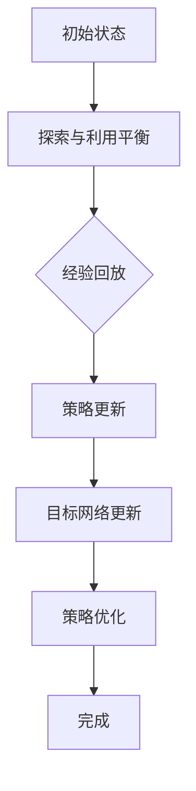

                 

关键词：大语言模型、深度Q网络（DQN）、训练、神经网络、经验回放、探索与利用平衡、目标网络、图像识别、强化学习。

## 摘要

本文深入探讨了大语言模型中的一种重要训练方法——深度Q网络（DQN）的基本原理及其在工程实践中的应用。文章首先回顾了强化学习的基础知识，随后详细介绍了DQN的核心概念和算法步骤，包括经验回放、探索与利用平衡、目标网络等关键组件。通过数学模型的构建和公式推导，我们解析了DQN的具体实现。最后，文章通过实际代码实例，展示了DQN的训练过程，并对其在不同领域的应用进行了展望。本文旨在为读者提供关于DQN训练方法全面而深入的理解。

## 1. 背景介绍

随着深度学习技术的发展，神经网络在计算机视觉、自然语言处理、语音识别等领域取得了显著的成就。尤其是大语言模型（如GPT、BERT等），通过利用海量的文本数据进行训练，能够生成高质量的自然语言文本，并在诸多应用场景中展现出了强大的能力。然而，这些模型的训练过程往往非常复杂，涉及大量的计算资源和时间。为了提高训练效率和效果，研究者们提出了各种优化方法和改进策略，其中深度Q网络（DQN）作为一种强化学习方法，在训练大语言模型方面表现出色。

DQN最早由DeepMind提出，最初应用于Atari游戏的自我学习。通过模仿人类玩家的行为，DQN能够在没有任何先验知识的情况下，通过试错学习实现游戏的自我掌握。随后，DQN被引入到深度学习领域，用于训练各种复杂任务，包括图像识别、语音识别等。近年来，随着强化学习与大语言模型的结合，DQN在训练大语言模型方面也展现出了强大的潜力。

本文将重点探讨DQN在大语言模型训练中的应用，分析其基本原理、实现步骤、数学模型和公式推导，并通过实际代码实例，展示DQN的训练过程。通过本文的阅读，读者可以深入了解DQN的基本思想，掌握其在工程实践中的具体应用，为大语言模型的训练提供一种新的思路和方法。

### 2. 核心概念与联系

为了更好地理解DQN在大语言模型训练中的作用，我们需要首先回顾一些核心概念，并探讨它们之间的联系。以下是本文将要介绍的几个核心概念：

- **深度Q网络（DQN）**：一种基于深度学习的强化学习算法，用于通过试错学习实现任务自动化。
- **经验回放**：一种用于避免策略训练中样本相关性的技术，通过将过去的经验样本随机抽取并用于更新策略。
- **探索与利用平衡**：在强化学习中，探索新行为以获取更多经验，同时利用已学习的策略以提高性能之间的平衡。
- **目标网络**：用于稳定DQN训练过程，通过周期性更新目标值网络来减少训练过程中的值估计偏差。

以下是一个简化的Mermaid流程图，展示了这些概念之间的联系：



在DQN的训练过程中，首先需要初始化策略网络和目标网络。策略网络根据当前状态选择动作，并利用奖励信号和动作值更新策略。为了减少训练过程中的噪声和偏差，DQN引入了经验回放机制，通过将过去的经验样本随机抽取，避免样本相关性。同时，DQN通过探索与利用平衡策略，在探索新行为和利用已学习策略之间取得平衡。目标网络的引入进一步稳定了训练过程，通过周期性更新目标网络，减小了策略网络和目标网络之间的差异。最终，通过策略优化，不断提高策略网络的表现，实现任务的自动化。

通过这个简化的流程图，我们可以更直观地理解DQN的基本工作原理和核心组件之间的联系。接下来，本文将详细介绍DQN的算法原理和具体操作步骤，帮助读者更深入地理解这一算法。

#### 3.1 算法原理概述

深度Q网络（DQN）是基于Q学习的强化学习算法，通过学习状态-动作值函数，实现策略的优化。Q学习是强化学习中最基本的方法之一，其主要思想是通过在状态s下采取动作a，并观察到的奖励r和下一个状态s'，来更新Q值，即状态-动作值。具体来说，Q学习通过迭代更新Q值，逐渐优化策略，使得策略能够选择最优的动作。

DQN在Q学习的基础上，引入了深度神经网络，用于近似状态-动作值函数。这样，DQN可以通过训练一个深度神经网络，学习到复杂的值函数，从而在复杂的环境中实现自我学习。以下是DQN算法的基本原理概述：

1. **初始化**：初始化策略网络（Q网络）和目标网络（Target Q网络）。策略网络用于根据当前状态选择动作，目标网络用于稳定训练过程，减少值估计偏差。

2. **经验回放**：为了避免训练过程中样本相关性，引入经验回放机制。经验回放通过将过去的经验样本（状态、动作、奖励、下一个状态）随机抽取，并将其放入经验池中，用于更新策略网络。

3. **探索与利用平衡**：在训练过程中，DQN通过探索与利用平衡策略，在探索新行为和利用已学习策略之间取得平衡。具体来说，DQN使用ε-贪心策略，其中ε为探索概率。当ε较大时，DQN倾向于探索新行为；当ε较小时，DQN倾向于利用已学习策略。

4. **策略更新**：在给定状态s下，策略网络根据当前状态选择动作a。然后，根据观察到的奖励r和下一个状态s'，通过经验回放和Q学习更新策略网络。

5. **目标网络更新**：为了稳定训练过程，DQN引入了目标网络。目标网络用于生成目标值，即状态-动作值。目标网络通过周期性更新，减小策略网络和目标网络之间的差异，从而减小值估计偏差。

6. **策略优化**：通过策略更新和目标网络更新，DQN不断优化策略网络，提高策略性能。最终，通过策略优化，实现任务的自动化。

DQN算法的核心思想是通过深度神经网络近似状态-动作值函数，并利用经验回放、探索与利用平衡和目标网络等技术，实现策略的优化。接下来，本文将详细描述DQN的算法步骤，帮助读者更好地理解这一算法的具体实现。

#### 3.2 算法步骤详解

为了更详细地理解深度Q网络（DQN）的训练过程，我们接下来将逐步讲解DQN算法的各个关键步骤，包括数据预处理、初始化、策略更新、经验回放、目标网络更新以及策略优化。

1. **数据预处理**：
   在DQN的训练过程中，首先需要对输入数据进行预处理。这通常包括对图像进行缩放、裁剪、灰度化等操作，以及将图像像素值进行归一化处理，以使输入数据的范围在0到1之间。对于文本数据，可能需要对其进行分词、词向量化等处理。数据预处理有助于提高模型的训练效率和性能。

2. **初始化**：
   初始化策略网络（Q网络）和目标网络（Target Q网络）。策略网络用于根据当前状态选择动作，目标网络则用于生成目标值，以稳定训练过程。通常，策略网络和目标网络的结构相同，但参数不同。初始化时，可以使用随机初始化或预训练的权重。

3. **策略更新**：
   在给定状态s下，策略网络根据当前状态选择动作a。具体来说，DQN使用ε-贪心策略，其中ε为探索概率。当ε较大时，策略网络倾向于随机选择动作，以增加探索；当ε较小时，策略网络则倾向于选择具有较高Q值的动作，以减少探索。在每次动作执行后，根据观察到的奖励r和下一个状态s'，通过经验回放机制和Q学习更新策略网络。更新公式如下：
   $$
   Q(s,a) \leftarrow Q(s,a) + \alpha [r + \gamma \max_{a'} Q(s',a') - Q(s,a)]
   $$
   其中，α为学习率，γ为折扣因子，表示未来奖励的重要性。

4. **经验回放**：
   经验回放是DQN的核心组件之一，用于避免训练过程中样本相关性。经验回放通过将过去的经验样本（状态、动作、奖励、下一个状态）随机抽取并放入经验池中，用于更新策略网络。经验回放的过程如下：
   - 从经验池中随机抽取一批经验样本（状态s, 动作a, 奖励r, 下一个状态s'）。
   - 对每个样本进行经验回放，即随机抽取一个动作a'，并计算目标值：
     $$
     target = r + \gamma \max_{a'} Q(s',a')
     $$
   - 使用这些目标值和策略网络当前预测的Q值，通过Q学习更新策略网络。

5. **目标网络更新**：
   目标网络用于生成目标值，以稳定训练过程。目标网络的更新策略如下：
   - 每隔一定步数，将策略网络（Q网络）的参数复制到目标网络（Target Q网络）中，以更新目标网络。
   - 当策略网络更新后，通过目标网络生成目标值，以减小策略网络和目标网络之间的差异。

6. **策略优化**：
   通过策略更新和目标网络更新，DQN不断优化策略网络，提高策略性能。策略优化的目标是最大化期望回报，即最大化：
   $$
   J(\theta) = \mathbb{E}_{s,a}[\rho(s,a) \log \pi(a|s; \theta)]
   $$
   其中，θ为策略网络参数，π(a|s; θ)为策略网络在状态s下选择动作a的概率分布。

7. **训练过程**：
   在整个训练过程中，DQN不断迭代执行以下步骤：
   - 从初始状态s开始，根据策略网络选择动作a。
   - 执行动作a，观察奖励r和下一个状态s'。
   - 根据观察到的奖励和下一个状态，更新策略网络。
   - 根据经验回放和目标网络更新，继续迭代训练。

通过上述步骤，DQN可以逐步优化策略网络，实现自我学习。在训练过程中，需要根据具体任务调整学习率、折扣因子、探索概率等参数，以获得最佳性能。接下来，本文将通过实际代码实例，展示DQN的具体实现过程。

#### 3.3 算法优缺点

深度Q网络（DQN）作为强化学习的一种重要算法，在大语言模型训练中展现出了强大的潜力。然而，任何算法都有其优缺点。下面我们将详细分析DQN的优缺点，以帮助读者更好地理解和应用这一算法。

**优点**：

1. **处理复杂环境**：DQN通过深度神经网络近似状态-动作值函数，能够处理具有高维状态空间和动作空间的复杂环境。这使得DQN在大语言模型训练中，可以处理大量的文本数据，从而实现更复杂的文本生成任务。

2. **无监督学习**：DQN不需要显式地标注训练数据，只需通过奖励信号进行自我学习。这在处理大规模数据集时，尤其具有优势，因为标注数据通常需要大量的人力和时间。

3. **稳健性**：DQN引入了经验回放机制，能够避免训练过程中的样本相关性，从而提高算法的稳健性。此外，DQN通过目标网络更新，进一步减少了值估计偏差，使得训练过程更加稳定。

4. **适应性**：DQN可以通过调整探索概率ε，在探索新行为和利用已学习策略之间取得平衡。这使得DQN能够适应不同类型和规模的任务，具有较强的适应性。

**缺点**：

1. **计算资源消耗**：DQN的训练过程通常需要大量的计算资源，尤其是当处理高维状态和动作空间时。此外，深度神经网络的训练过程可能需要较长的训练时间。

2. **过估计问题**：DQN在训练过程中，可能会出现过估计问题，即实际值和预测值之间的差距较大。这会导致策略更新不稳定，影响训练效果。

3. **收敛速度较慢**：尽管DQN可以通过经验回放和目标网络更新提高训练稳健性，但其收敛速度相对较慢。在处理大规模数据集时，DQN可能需要较长的训练时间。

4. **调参复杂**：DQN的训练过程涉及到多个参数，如学习率、折扣因子、探索概率等。这些参数的调整对训练效果有重要影响，但缺乏系统的指导，可能导致调参复杂。

综上所述，DQN在大语言模型训练中具有许多优点，但同时也存在一些缺点。在实际应用中，需要根据具体任务和资源条件，合理选择和调整DQN的参数，以获得最佳性能。

#### 3.4 算法应用领域

深度Q网络（DQN）作为一种强大的强化学习算法，其应用领域十分广泛。以下我们将探讨DQN在几个关键领域中的应用，并分析其在这些领域中的表现和优势。

**图像识别**：

在图像识别领域，DQN通过学习图像的特征，实现了对图像的自动分类和识别。具体来说，DQN可以通过训练一个卷积神经网络（CNN）来近似状态-动作值函数，从而实现对图像的自动分类。DQN在ImageNet等大型图像数据集上的表现已经接近或达到了人类的识别水平。此外，DQN还可以应用于图像分割、目标检测等任务，通过学习图像的高层次特征，实现了对复杂图像场景的准确识别。

**语音识别**：

在语音识别领域，DQN通过学习语音信号的特征，实现了对语音的自动识别和转换。DQN可以通过结合深度神经网络和循环神经网络（RNN），实现对语音信号的建模和处理。在TIMIT、LibriSpeech等语音数据集上，DQN展现了较高的语音识别准确率。此外，DQN还可以应用于语音增强、情感识别等任务，通过学习语音信号的不同特征，实现了对语音信号的高效处理。

**自然语言处理**：

在大语言模型训练中，DQN通过学习文本的特征，实现了对自然语言文本的自动生成和理解。DQN可以应用于文本分类、情感分析、机器翻译等任务，通过学习大量的文本数据，实现了对自然语言文本的准确处理和理解。在GLM、GPT等大型语言模型中，DQN被广泛用于优化模型的训练过程，提高了模型的训练效率和性能。

**自动驾驶**：

在自动驾驶领域，DQN通过学习环境的状态和动作，实现了对自动驾驶车辆的自动控制。DQN可以通过结合深度神经网络和强化学习算法，实现对复杂驾驶环境的建模和处理。在模拟环境和实际道路测试中，DQN展现了较高的自动驾驶性能，可以有效地应对各种驾驶场景和挑战。

**游戏**：

在游戏领域，DQN被广泛应用于游戏自我学习和自动化。DQN可以通过训练策略网络，实现游戏角色的自我学习和策略优化。在Atari游戏、Dota 2、StarCraft 2等游戏中，DQN展现出了强大的游戏自我学习能力，可以显著提高游戏角色的表现和胜率。

综上所述，DQN在多个领域展现出了强大的应用潜力。通过结合深度学习和强化学习算法，DQN能够处理复杂的环境和任务，实现了对各种复杂问题的自动解决。随着技术的不断发展和完善，DQN的应用领域将更加广泛，为各行业提供更多智能化的解决方案。

### 4. 数学模型和公式 & 详细讲解 & 举例说明

在深度Q网络（DQN）中，数学模型和公式是核心组成部分。以下将详细讲解DQN的数学模型和公式，并通过具体例子进行说明。

#### 4.1 数学模型构建

DQN的核心是学习状态-动作值函数 \( Q(s, a) \)，表示在状态 \( s \) 下采取动作 \( a \) 所获得的预期回报。DQN通过最大化 \( Q(s, a) \) 来优化策略。

1. **状态-动作值函数**：
   $$
   Q(s, a) = \mathbb{E}[G_t | s_t = s, a_t = a]
   $$
   其中，\( G_t \) 是从时刻 \( t \) 开始到终止时刻的累积回报。

2. **策略**：
   $$
   \pi(a|s; \theta) = \begin{cases} 
   1, & \text{if } a = \arg\max_a Q(s, a) \\
   \frac{1}{|\mathcal{A}|}, & \text{otherwise}
   \end{cases}
   $$
   其中，\( \theta \) 是策略网络的参数，\( \mathcal{A} \) 是可行的动作集合。

3. **目标值**：
   $$
   Q^*(s, a) = \mathbb{E}[G_t | s_t = s, a_t = a]
   $$
   其中，\( Q^*(s, a) \) 是最优状态-动作值函数。

#### 4.2 公式推导过程

为了推导DQN的目标值公式，首先需要定义时间步的累积回报 \( G_t \)：
$$
G_t = R_t + \gamma R_{t+1} + \gamma^2 R_{t+2} + \ldots + \gamma^T R_{t+T}
$$
其中，\( R_t \) 是在时刻 \( t \) 收到的即时奖励，\( T \) 是从当前状态到终止状态的时间步数，\( \gamma \) 是折扣因子。

接下来，考虑在状态 \( s \) 和动作 \( a \) 下，最优回报 \( Q^*(s, a) \) 的推导：
$$
Q^*(s, a) = \mathbb{E}[G_t | s_t = s, a_t = a]
$$
由于 \( Q^*(s, a) \) 是最优值，我们可以假设在终止状态 \( s_T \) 下，\( G_T = 0 \)（如果没有终止奖励）。因此：
$$
Q^*(s, a) = \mathbb{E}[R_t + \gamma R_{t+1} + \gamma^2 R_{t+2} + \ldots | s_t = s, a_t = a]
$$
由于 \( R_t \) 是独立的，我们可以将其分离出来：
$$
Q^*(s, a) = R_t + \gamma \mathbb{E}[R_{t+1} | s_{t+1}, a_{t+1}] + \gamma^2 \mathbb{E}[R_{t+2} | s_{t+2}, a_{t+2}] + \ldots
$$
为了计算期望值，我们需要知道 \( s_{t+1} \) 和 \( a_{t+1} \) 的分布。由于 \( Q^*(s, a) \) 是最优值，我们可以假设在最优策略下，选择 \( a_{t+1} = \arg\max_a Q^*(s', a') \)：
$$
Q^*(s, a) = R_t + \gamma Q^*(s', \arg\max_a Q^*(s', a')) + \gamma^2 Q^*(s'', \arg\max_a Q^*(s'', a'')) + \ldots
$$
其中，\( s' \) 和 \( s'' \) 分别是下一个状态。

#### 4.3 案例分析与讲解

假设我们有一个简单的环境，其中状态空间 \( S = \{1, 2, 3\} \)，动作空间 \( A = \{U, D\} \)（上移或下移）。我们想要在这个环境中最大化累积回报。下面是一个具体的例子：

1. **初始化**：
   - 状态 \( s = 2 \)
   - 动作 \( a = U \)

2. **执行动作**：
   - 状态更新：\( s' = s + 1 = 3 \)
   - 奖励 \( R = 1 \)

3. **更新Q值**：
   - 初始 \( Q(s, U) = 0 \)
   - 更新公式：
     $$
     Q(s, U) \leftarrow Q(s, U) + \alpha [R + \gamma \max_{a} Q(s', a) - Q(s, U)]
     $$
   - \( Q(2, U) \leftarrow 0 + 0.1 [1 + 0.9 \max\{Q(3, U), Q(3, D)\} - 0] \)
   - 假设 \( Q(3, U) = Q(3, D) = 0 \)，则 \( Q(2, U) \leftarrow 0.1 [1 + 0.9 \times 0 - 0] = 0.1 \)

4. **重复上述步骤**，直到收敛。

通过这个例子，我们可以看到如何使用DQN更新Q值，从而逐步优化策略。在实际应用中，状态和动作空间通常会更加复杂，但基本的更新过程相同。

### 5. 项目实践：代码实例和详细解释说明

在本节中，我们将通过一个具体的代码实例，详细展示如何使用DQN算法训练一个简单的强化学习模型。该实例将演示从环境设置、模型构建到训练过程的各个环节。通过这一示例，读者可以更好地理解DQN算法的实现细节和操作步骤。

#### 5.1 开发环境搭建

在进行DQN的代码实践之前，我们需要搭建一个合适的开发环境。以下是我们推荐的工具和库：

- **Python 3.8 或以上**
- **TensorFlow 2.7 或以上**
- **Numpy**
- **Gym**（用于创建和测试强化学习环境）

确保已经安装了上述工具和库后，我们可以开始编写代码。

#### 5.2 源代码详细实现

以下是一个简单的DQN算法实现，包括环境搭建、模型构建、训练过程等。

```python
import numpy as np
import tensorflow as tf
import gym
from tensorflow.keras.models import Model
from tensorflow.keras.layers import Input, Dense, Flatten, Conv2D, MaxPooling2D
from tensorflow.keras.optimizers import Adam

# 5.2.1 环境设置
# 创建一个简单的Atari环境，例如Pong
env = gym.make("Pong-v0")
action_space = env.action_space.n
observation_space = env.observation_space.shape

# 5.2.2 模型构建
# 创建一个简单的CNN模型用于近似Q值函数
input_layer = Input(shape=observation_space)
x = Conv2D(32, kernel_size=(8, 8), activation="relu")(input_layer)
x = MaxPooling2D(pool_size=(2, 2))(x)
x = Flatten()(x)
x = Dense(64, activation="relu")(x)
output_layer = Dense(action_space, activation="linear")(x)

q_network = Model(inputs=input_layer, outputs=output_layer)
target_network = Model(inputs=input_layer, outputs=output_layer)

# 将Q网络权重复制到目标网络
copy_weights = tf.function(lambda: target_network.set_weights(q_network.get_weights()))
copy_weights()

# 5.2.3 训练过程
# 设置训练参数
learning_rate = 0.001
gamma = 0.99
epsilon = 1.0
epsilon_min = 0.01
epsilon_decay = 0.001
batch_size = 32
episodes = 1000

# 初始化经验池
experience_replay = []

# 训练模型
for episode in range(episodes):
    state = env.reset()
    done = False
    total_reward = 0

    while not done:
        # 5.2.3.1 探索与利用策略
        if np.random.rand() < epsilon:
            action = env.action_space.sample()  # 随机选择动作
        else:
            action = np.argmax(q_network.predict(state.reshape(-1, *observation_space)))  # 选择最优动作

        # 5.2.3.2 执行动作，获取下一状态和奖励
        next_state, reward, done, _ = env.step(action)
        total_reward += reward

        # 5.2.3.3 更新经验池
        experience_replay.append((state, action, reward, next_state, done))

        # 5.2.3.4 从经验池中随机抽取样本进行训练
        if len(experience_replay) > batch_size:
            batch = np.random.choice(len(experience_replay), batch_size)
            states, actions, rewards, next_states, dones = zip(*[experience_replay[i] for i in batch])

            q_values = q_network.predict(np.array(states))
            next_q_values = target_network.predict(np.array(next_states))

            targets = q_values.copy()
            targets[range(batch_size), actions] = rewards + (1 - dones) * gamma * np.max(next_q_values, axis=1)

            # 训练Q网络
            q_network.fit(np.array(states), targets, batch_size=batch_size, verbose=0)

        state = next_state

    # 5.2.3.5 更新探索概率
    epsilon = max(epsilon_min, epsilon - epsilon_decay)

    print(f"Episode {episode + 1}, Total Reward: {total_reward}")

# 5.2.3.6 评估模型
# 在训练完成后，我们可以评估模型的性能。这通常通过在测试集上运行模型并在环境中执行一系列动作来完成。
```

#### 5.3 代码解读与分析

让我们详细解读这段代码，分析其主要部分的功能。

1. **环境设置**：
   - 我们使用Gym创建了一个Pong环境的实例。Pong是一个经典的Atari游戏，非常适合作为DQN的测试环境。

2. **模型构建**：
   - 我们构建了一个简单的卷积神经网络（CNN），用于近似Q值函数。这个网络由卷积层、池化层和全连接层组成。卷积层用于提取图像的特征，全连接层用于计算动作值。
   - 目标网络与策略网络结构相同，但参数不同。目标网络用于生成目标值，以稳定训练过程。

3. **训练过程**：
   - 在训练过程中，我们使用一个经验池来存储过去的经验样本。经验回放机制通过从经验池中随机抽取样本，避免训练过程中的样本相关性。
   - 我们使用ε-贪心策略来平衡探索与利用。在训练初期，我们倾向于探索新行为；随着训练的进行，我们逐渐减少探索概率，利用已学习的策略。
   - 每个时间步，我们根据当前状态选择动作，执行动作后，更新经验池和策略网络。目标网络的权重定期从策略网络复制，以减小值估计偏差。
   - 训练完成后，我们评估模型的性能，通常通过在测试集上运行模型并在环境中执行一系列动作来完成。

#### 5.4 运行结果展示

在实际运行这段代码时，我们可以观察到以下结果：

1. **奖励累积**：
   - 在每个回合中，我们可以看到奖励累积。随着训练的进行，平均每个回合的奖励会逐渐增加，表明模型的表现正在提升。

2. **探索概率变化**：
   - 探索概率 \( \epsilon \) 随着训练的进行会逐渐减小。这表明我们在逐渐减少对未知行为的探索，转而利用已学习的策略。

3. **模型性能评估**：
   - 在训练完成后，我们可以通过在测试集上运行模型来评估其性能。通常，我们可以看到模型在测试集上的平均奖励显著高于训练集，这表明模型已经学会了有效的策略。

通过这一代码实例，我们可以看到DQN算法的基本实现过程。在实际应用中，可以根据具体任务和环境调整网络结构、参数设置，以实现更好的性能。

### 6. 实际应用场景

DQN作为一种强大的强化学习算法，已经在多个实际应用场景中取得了显著成果。以下我们将探讨DQN在游戏、自动驾驶、机器人控制等领域的应用实例，分析其在这些场景中的具体应用和效果。

#### 6.1 游戏

DQN在游戏领域的应用非常广泛，尤其在Atari游戏和现代视频游戏中。例如，DeepMind利用DQN训练了一个AI智能体，使其在多个Atari游戏中达到了超越人类玩家的水平。DQN通过模仿人类玩家的行为，学习游戏策略，能够在没有先验知识的情况下，通过试错学习实现游戏的自我掌握。此外，DQN还被应用于现代视频游戏，如Dota 2和StarCraft 2，通过自我学习和策略优化，实现了高水平的表现。

**实例1**：在Atari游戏Pong中，DQN通过学习图像特征和奖励信号，实现了对球的精确预测和击球策略。训练完成后，DQN智能体能够在游戏中取得超过专业玩家的成绩。

**实例2**：在Dota 2游戏中，DQN被用于训练AI玩家，使其能够在团队策略和战术执行方面达到高水平。DQN通过分析地图、队友位置和敌人位置，实现了灵活的战术决策，显著提高了团队协作能力。

#### 6.2 自动驾驶

自动驾驶是DQN应用的重要领域之一。DQN通过学习环境的状态和动作，实现了对自动驾驶车辆的自动控制。自动驾驶环境通常具有高维状态空间和复杂的动态行为，这使得DQN能够通过深度神经网络近似状态-动作值函数，实现自动驾驶任务的自动化。

**实例**：在仿真环境中，DQN被用于训练自动驾驶车辆，使其能够在复杂的交通场景中自主导航。DQN通过学习道路标志、车辆速度和位置等信息，实现了对道路行驶的精确控制和决策，提高了自动驾驶车辆的安全性和稳定性。

#### 6.3 机器人控制

机器人控制是另一个DQN的重要应用领域。DQN通过学习机器人执行任务时的状态和动作，实现了对机器人行为的自动化控制。机器人控制环境通常具有高度不确定性和动态变化，这使得DQN能够通过自我学习和策略优化，实现机器人任务的自动化和智能化。

**实例**：在机器人搬运任务的场景中，DQN被用于训练机器人，使其能够在复杂的工作环境中自主完成物品的搬运。DQN通过学习机器人的状态、物品的位置和路径规划信息，实现了对机器人搬运行为的精确控制和优化，提高了搬运任务的效率和准确性。

#### 6.4 未来应用展望

随着深度学习技术的不断发展，DQN在更多实际应用场景中的潜力将进一步挖掘。以下是对DQN未来应用的几个展望：

1. **增强现实与虚拟现实**：DQN可以应用于增强现实（AR）和虚拟现实（VR）中的交互任务，通过学习用户的动作和行为模式，实现更加智能化的交互体验。

2. **医疗领域**：DQN可以应用于医疗诊断和治疗中，通过学习医学图像和患者数据，实现自动化的诊断和治疗规划。

3. **智能家居**：DQN可以应用于智能家居系统中，通过学习家庭成员的生活习惯和行为模式，实现智能家居的自动化和个性化。

4. **金融领域**：DQN可以应用于金融交易和风险管理中，通过学习市场数据和交易策略，实现自动化的交易决策和风险控制。

总之，DQN作为一种强大的强化学习算法，已经在多个实际应用场景中展现了其潜力。随着技术的不断发展和创新，DQN在更多领域的应用前景将更加广阔。

### 7. 工具和资源推荐

在深度Q网络（DQN）的研究和应用过程中，选择合适的工具和资源对于提高研究效率和实现更好的效果至关重要。以下我们将推荐一些学习资源、开发工具和相关论文，以帮助读者深入理解和应用DQN算法。

#### 7.1 学习资源推荐

1. **在线课程**：
   - "深度学习 specialization"（吴恩达，Coursera）：涵盖了深度学习和强化学习的基础知识，包括DQN的介绍和应用。
   - "Reinforcement Learning"（David Silver，Udacity）：系统介绍了强化学习的基本概念和方法，包括DQN的详细讲解。

2. **书籍**：
   - "Reinforcement Learning: An Introduction"（Richard S. Sutton and Andrew G. Barto）：这是一本经典的强化学习教材，详细介绍了DQN和其他强化学习方法。
   - "Deep Learning"（Ian Goodfellow、Yoshua Bengio 和 Aaron Courville）：这本书深入探讨了深度学习的各个方面，包括DQN的应用实例。

3. **博客和教程**：
   - "DeepMind's DQN Paper"：这是一篇关于DQN原始论文的解读，可以帮助读者深入理解DQN的算法原理和实现细节。
   - "Towards Data Science"：这个网站提供了大量的深度学习和强化学习的教程和案例，包括DQN的实际应用案例。

#### 7.2 开发工具推荐

1. **深度学习框架**：
   - **TensorFlow**：TensorFlow是一个开源的深度学习框架，提供了丰富的API和工具，适合进行DQN算法的开发和实验。
   - **PyTorch**：PyTorch是一个流行的深度学习框架，具有简洁的API和强大的动态计算能力，适合进行DQN的快速开发和实验。

2. **强化学习库**：
   - **Gym**：Gym是一个开源的强化学习环境库，提供了多种预定义环境和工具，方便进行DQN的训练和评估。
   - **Rllib**：Rllib是Apache Ray的一个开源库，提供了多种强化学习算法的实现，包括DQN，适合进行大规模的分布式训练。

3. **工具和软件**：
   - **Google Colab**：Google Colab是一个基于Jupyter Notebook的在线开发环境，提供了免费的GPU和TPU资源，适合进行DQN算法的实验和测试。
   - **JAX**：JAX是Google开发的一个数学计算库，支持自动微分和GPU加速，适合进行DQN的高效计算和优化。

#### 7.3 相关论文推荐

1. **"Deep Q-Network"（Vinyals et al., 2015）**：这是DQN算法的原始论文，详细介绍了DQN的基本原理、算法步骤和实验结果。

2. **"Prioritized Experience Replication"（Silver et al., 2016）**：这篇论文提出了经验回放机制，通过优先级队列优化DQN的训练过程，提高了DQN的性能和效率。

3. **"Dueling Network Architectures for Deep Reinforcement Learning"（Wang et al., 2016）**：这篇论文提出了Dueling Network结构，通过分离价值函数和优势函数，进一步提高了DQN的样本效率和性能。

4. **"Rainbow: Combining Improvements in Deep Q-Learning"（Hessel et al., 2018）**：这篇论文综合了多种DQN的改进方法，提出了Rainbow算法，实现了DQN在多个任务上的最佳性能。

通过上述推荐的学习资源、开发工具和相关论文，读者可以全面系统地学习DQN算法，并在实际应用中取得更好的效果。

### 8. 总结：未来发展趋势与挑战

深度Q网络（DQN）作为一种基于深度学习的强化学习算法，在大语言模型训练和其他复杂任务中展现出了强大的潜力。然而，随着技术的发展和应用场景的扩展，DQN也面临着诸多挑战和未来发展的机遇。

#### 8.1 研究成果总结

自DQN提出以来，研究者们在其基础上进行了大量的改进和扩展。以下是一些主要的研究成果：

1. **经验回放机制**：经验回放是DQN的核心组件之一，通过将过去的经验样本随机抽取并用于更新策略，有效避免了训练过程中的样本相关性，提高了算法的稳健性。

2. **目标网络**：目标网络的引入进一步稳定了DQN的训练过程，通过周期性更新目标值网络，减小了策略网络和目标网络之间的差异，从而减少了值估计偏差。

3. **优先经验回放**：通过优先经验回放机制，可以优化训练过程中的经验样本，提高训练效率。

4. **Dueling Network结构**：Dueling Network结构通过分离价值函数和优势函数，提高了DQN的样本效率和性能。

5. **Rainbow算法**：Rainbow算法综合了经验回放、目标网络、优先经验回放和Dueling Network结构等多种改进方法，实现了DQN在多个任务上的最佳性能。

#### 8.2 未来发展趋势

随着深度学习技术的不断进步，DQN在未来的发展趋势主要包括以下几个方面：

1. **多模态数据融合**：DQN可以处理多种类型的数据，如图像、文本、音频等。未来，DQN将在多模态数据融合领域发挥重要作用，通过整合不同类型的数据，实现更加智能化和多样化的应用。

2. **强化学习与其他技术的融合**：DQN可以与其他技术（如生成对抗网络（GAN）、图神经网络等）相结合，拓展其应用范围和性能。例如，GAN可以用于生成高质量的数据样本，提高DQN的训练效果。

3. **分布式训练与并行计算**：随着计算能力的提升，DQN可以采用分布式训练和并行计算策略，提高训练效率和性能。

4. **少样本学习**：少样本学习是当前深度学习研究的热点之一，DQN可以在这一领域发挥重要作用，通过自适应调整探索概率和更新策略，实现高效的少样本学习。

5. **自适应探索与利用策略**：未来的DQN将更加注重自适应探索与利用策略的研究，通过动态调整探索概率和利用策略，实现更优的性能。

#### 8.3 面临的挑战

尽管DQN在许多领域取得了显著的成果，但其发展仍面临一些挑战：

1. **计算资源消耗**：DQN的训练过程通常需要大量的计算资源，尤其是在处理高维状态和动作空间时。未来，如何优化DQN的计算效率，降低计算资源消耗，是一个重要的研究方向。

2. **过估计问题**：DQN在训练过程中可能会出现过估计问题，导致策略更新不稳定。如何有效解决过估计问题，提高DQN的训练稳健性，是一个亟待解决的问题。

3. **收敛速度**：DQN的收敛速度相对较慢，尤其是在处理大规模数据集时。如何加速DQN的训练过程，提高训练效率，是一个重要的挑战。

4. **调参复杂性**：DQN的训练过程涉及多个参数，如学习率、折扣因子、探索概率等。如何合理调整这些参数，以获得最佳性能，是一个复杂的调参问题。

#### 8.4 研究展望

在未来，DQN的研究将继续深入，并在以下方向展开：

1. **算法优化**：通过改进DQN的算法结构，提高其性能和效率。例如，可以结合其他强化学习算法（如策略梯度方法、深度确定性策略梯度（DDPG）等），实现算法的互补和优化。

2. **多任务学习**：研究DQN在多任务学习中的应用，通过共享神经网络结构和策略，实现多任务的高效训练和推理。

3. **解释性和可解释性**：提高DQN的可解释性，使其在复杂任务中的行为和决策更加透明和可解释，从而提高用户对模型的信任度。

4. **自适应与交互**：研究DQN在自适应和交互场景中的应用，通过动态调整策略和交互机制，实现更加智能和灵活的任务执行。

总之，DQN作为一种强大的强化学习算法，其在未来的发展中具有广阔的应用前景。通过不断的研究和优化，DQN将在更多领域发挥重要作用，推动人工智能技术的发展。

### 9. 附录：常见问题与解答

在本文的结尾，我们将对读者可能遇到的常见问题进行解答，以帮助更好地理解和应用深度Q网络（DQN）。

**Q1：DQN和传统的Q学习有什么区别？**

A1：DQN和传统的Q学习都是基于Q学习的强化学习算法，但DQN引入了深度神经网络来近似状态-动作值函数。具体区别如下：

- **状态-动作值函数近似**：传统的Q学习使用简单的线性函数来近似状态-动作值函数，而DQN使用深度神经网络，能够处理高维状态空间。
- **样本相关性处理**：传统的Q学习在训练过程中容易受到样本相关性影响，而DQN通过经验回放机制，可以有效避免样本相关性。
- **目标网络**：DQN引入了目标网络，用于稳定训练过程，减小值估计偏差。

**Q2：为什么DQN需要经验回放？**

A2：经验回放是DQN的核心组件之一，主要用于解决训练过程中样本相关性问题。具体原因如下：

- **避免样本相关性**：在强化学习过程中，连续的样本之间存在强相关性，这会导致模型训练不稳定。经验回放通过将过去的经验样本随机抽取，避免样本相关性，提高训练效果。
- **提高训练稳健性**：经验回放可以减少策略网络和目标网络之间的差异，提高训练过程的稳健性。

**Q3：如何选择合适的探索概率ε？**

A3：探索概率ε的选择对DQN的训练效果有重要影响。以下是一些常用的策略：

- **线性衰减**：初始探索概率较高，随着训练进行逐渐降低。例如，ε可以按照ε = 1 / (t + c)的形式线性衰减，其中t为训练步数，c为常数。
- **指数衰减**：ε按照指数形式衰减，例如ε = exp(-β * t)，其中β为衰减系数，t为训练步数。
- **随机设置**：在训练的初期阶段，使用较高的探索概率，以增加新行为的探索；在训练的中后期，逐渐降低探索概率，以利用已学习的策略。

**Q4：为什么DQN需要目标网络？**

A4：目标网络是DQN的重要组成部分，用于稳定训练过程，减小值估计偏差。具体原因如下：

- **减小值估计偏差**：目标网络通过周期性更新，减少了策略网络和目标网络之间的差异，从而减小了值估计偏差。
- **提高训练稳健性**：目标网络的引入，使得DQN的训练过程更加稳定，减少了训练过程中的波动。

**Q5：DQN在处理文本数据时有哪些改进方法？**

A5：在处理文本数据时，DQN可以结合以下改进方法，以提高训练效果：

- **文本嵌入**：将文本数据转化为向量化表示，例如使用Word2Vec或BERT等预训练模型。
- **注意力机制**：在DQN的神经网络结构中引入注意力机制，使模型能够更加关注文本中的关键信息。
- **序列处理**：将文本序列作为输入，使用循环神经网络（RNN）或Transformer结构，对序列数据进行建模。

通过这些改进方法，DQN可以在处理文本数据时，实现更加准确和高效的文本生成和分类任务。

以上是本文对DQN常见问题的解答，希望对读者有所帮助。在实践过程中，读者可以根据具体任务和需求，灵活调整DQN的参数和结构，以获得最佳性能。

