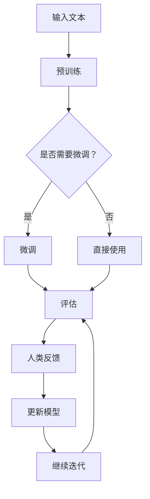

                 

关键词：大语言模型、生成式AI、强化学习、人类反馈、语言理解、模型训练、工程实践、技术发展

> 摘要：本文深入探讨了基于强化学习与人类反馈的（RLHF）大语言模型的原理及其工程实践。通过对核心概念、算法原理、数学模型、实际应用及未来展望的详细阐述，为读者提供了全面的技术理解与实践指导。

## 1. 背景介绍

近年来，随着生成式AI（Generative AI）技术的发展，大语言模型（Large Language Model，LLM）已经成为人工智能领域的重要研究方向。大语言模型能够通过深度学习算法从大量文本数据中学习语言规律，实现对自然语言的生成、理解和翻译。然而，传统的模型训练方法存在一些局限性，例如难以处理长文本、无法理解文本上下文等。

为了解决这些问题，研究者们提出了基于强化学习与人类反馈的（RLHF）训练方法。RLHF方法结合了强化学习和人类反馈，能够有效地提升大语言模型在自然语言理解和生成方面的性能。本文将围绕RLHF方法的核心原理、算法实现、数学模型以及工程实践进行详细探讨。

## 2. 核心概念与联系

在RLHF方法中，主要涉及以下几个核心概念：

- **强化学习（Reinforcement Learning，RL）**：强化学习是一种通过试错方式在环境中学习策略的机器学习方法。在RLHF中，模型通过与环境交互，不断调整内部参数以优化行为策略。
- **人类反馈（Human Feedback，HF）**：人类反馈是指通过人类评价者对模型生成的文本进行评价，以指导模型优化。
- **大语言模型（Large Language Model，LLM）**：大语言模型是一种能够处理大规模文本数据的神经网络模型，通过预训练和微调实现自然语言处理任务。

下面是一个Mermaid流程图，展示了RLHF方法的核心概念及其相互关系：



## 3. 核心算法原理 & 具体操作步骤

### 3.1 算法原理概述

RLHF算法的核心思想是将强化学习和人类反馈结合，以优化大语言模型的性能。具体来说，算法包括以下几个步骤：

1. **预训练**：使用大量的文本数据对大语言模型进行预训练，使其能够理解并生成自然语言。
2. **微调**：根据特定任务的需求，在大语言模型的基础上进行微调，以适应特定应用场景。
3. **评估**：使用人类反馈对模型生成的文本进行评估，以衡量模型的性能。
4. **更新模型**：根据人类反馈结果，调整模型的参数，以优化其性能。
5. **迭代**：重复评估和更新过程，直到模型性能达到预期目标。

### 3.2 算法步骤详解

1. **预训练**：

   预训练是RLHF算法的第一步，主要目标是让大语言模型具备基本的自然语言处理能力。预训练过程通常包括以下步骤：

   - 数据准备：收集并预处理大量文本数据，例如新闻、博客、书籍等。
   - 模型初始化：初始化大语言模型，通常采用预训练模型如GPT、BERT等。
   - 预训练：在大规模文本数据上对模型进行预训练，优化模型参数。

2. **微调**：

   在预训练完成后，根据特定任务的需求，对大语言模型进行微调。微调过程通常包括以下步骤：

   - 数据准备：收集并预处理与任务相关的数据，例如问答数据、文本分类数据等。
   - 微调：在微调数据上调整模型参数，优化模型性能。
   - 评估：使用验证集评估模型性能，选择最优模型。

3. **评估**：

   评估是RLHF算法的重要步骤，通过人类反馈对模型生成的文本进行评价。评估过程通常包括以下步骤：

   - 评估数据准备：收集与任务相关的评估数据，例如问答数据、文本分类数据等。
   - 生成文本：使用微调后的模型生成文本。
   - 人类反馈：邀请人类评价者对生成的文本进行评价，给出评分或标签。

4. **更新模型**：

   根据评估结果，更新模型的参数，以优化其性能。更新模型的过程通常包括以下步骤：

   - 反馈处理：对人类反馈进行预处理，提取有用的信息。
   - 参数调整：根据反馈信息调整模型参数。
   - 模型优化：使用优化后的参数重新训练模型。

5. **迭代**：

   重复评估和更新过程，直到模型性能达到预期目标。迭代过程可以帮助模型逐渐收敛，提高其性能。

### 3.3 算法优缺点

RLHF算法具有以下优点：

- **高效性**：结合了强化学习和人类反馈，能够快速优化模型性能。
- **灵活性**：适用于多种自然语言处理任务，具有广泛的适用性。
- **可解释性**：通过人类反馈，模型生成文本的可解释性得到提高。

然而，RLHF算法也存在一些缺点：

- **评估成本高**：需要大量的人类评价者进行文本评估，评估成本较高。
- **依赖人类反馈**：算法的性能受人类反馈质量的影响，存在一定的不确定性。

### 3.4 算法应用领域

RLHF算法在自然语言处理领域具有广泛的应用前景。以下是一些典型的应用领域：

- **问答系统**：使用RLHF算法训练的大语言模型能够实现高效的问答系统，提供准确的答案。
- **文本生成**：RLHF算法能够生成高质量的文本，应用于写作辅助、文章生成等领域。
- **机器翻译**：RLHF算法能够提高机器翻译的准确性，实现更自然的翻译效果。
- **文本分类**：RLHF算法能够有效提高文本分类模型的性能，应用于信息过滤、情感分析等领域。

## 4. 数学模型和公式 & 详细讲解 & 举例说明

在RLHF算法中，数学模型和公式起着至关重要的作用。以下将详细讲解数学模型的构建、公式推导过程以及实际案例分析与讲解。

### 4.1 数学模型构建

RLHF算法中的数学模型主要包括以下几个部分：

1. **强化学习模型**：

   强化学习模型用于指导大语言模型在环境中学习策略。模型的基本结构包括：

   - **状态（State）**：描述模型当前的状态，例如文本的上下文信息。
   - **动作（Action）**：模型可执行的动作，例如生成文本的单词或短语。
   - **奖励（Reward）**：根据动作的结果，评价动作的好坏。奖励值越高，表示动作越好。

2. **人类反馈模型**：

   人类反馈模型用于处理人类评价者的反馈信息。模型的基本结构包括：

   - **评价数据（Evaluations）**：包含人类评价者对模型生成文本的评分或标签。
   - **权重（Weights）**：根据评价数据的分布，计算模型参数的权重。

3. **大语言模型**：

   大语言模型是RLHF算法的核心部分，用于生成文本。模型的基本结构包括：

   - **输入层（Input Layer）**：接收文本的输入信息。
   - **隐藏层（Hidden Layer）**：对输入信息进行预处理和特征提取。
   - **输出层（Output Layer）**：生成文本的输出。

### 4.2 公式推导过程

以下是对RLHF算法中的主要公式进行推导：

1. **强化学习模型**：

   假设状态为\( s \)，动作空间为 \( A \)，奖励函数为 \( R(s, a) \)。强化学习模型的策略可以表示为：

   $$\pi(a|s) = P(a|s) = \frac{e^{\theta(s,a)}}{\sum_{a'\in A}e^{\theta(s,a')}}$$

   其中，\( \theta(s, a) \) 为模型参数，表示动作 \( a \) 在状态 \( s \) 下的得分。

2. **人类反馈模型**：

   假设评价数据为 \( E \)，权重为 \( w \)，人类反馈模型可以表示为：

   $$w = \frac{1}{|E|}\sum_{e\in E}e$$

   其中，\( |E| \) 为评价数据的总数。

3. **大语言模型**：

   假设大语言模型的输入为 \( x \)，隐藏层为 \( h \)，输出为 \( y \)，大语言模型可以表示为：

   $$y = \sigma(W_h h + b_h)$$

   其中，\( \sigma \) 为激活函数，\( W_h \) 和 \( b_h \) 分别为隐藏层权重和偏置。

### 4.3 案例分析与讲解

以下是一个简单的RLHF算法案例，用于生成自然语言文本。

1. **数据准备**：

   收集一个包含大量文本数据的语料库，用于预训练大语言模型。

2. **预训练**：

   在语料库上使用预训练算法（如GPT）对大语言模型进行预训练，优化模型参数。

3. **微调**：

   根据特定任务的需求，对预训练后的模型进行微调，例如问答任务。

4. **评估**：

   使用微调后的模型生成文本，邀请人类评价者对文本进行评估，给出评分或标签。

5. **更新模型**：

   根据人类反馈结果，调整模型参数，优化模型性能。

6. **迭代**：

   重复评估和更新过程，直到模型性能达到预期目标。

通过以上步骤，RLHF算法能够有效提升大语言模型的自然语言生成和理解能力。

## 5. 项目实践：代码实例和详细解释说明

在本节中，我们将通过一个具体的代码实例来展示如何实现RLHF算法。为了方便理解，我们采用Python编程语言以及TensorFlow框架进行实现。以下是实现过程的详细步骤：

### 5.1 开发环境搭建

1. 安装Python环境和TensorFlow框架：

   ```bash
   pip install tensorflow
   ```

2. 准备预训练模型，例如GPT模型：

   ```bash
   wget https://storage.googleapis.com/bert_models/2020_08_24/cased_L-12_H-768_A-12.zip
   unzip cased_L-12_H-768_A-12.zip
   ```

### 5.2 源代码详细实现

以下是一个简化版的RLHF算法实现，主要用于问答任务：

```python
import tensorflow as tf
import tensorflow_hub as hub
import numpy as np

# 加载预训练模型
model = hub.load('https://tfhub.dev/google/gpt2-large/1')

# 定义强化学习模型
class ReinforcementLearningModel(tf.keras.Model):
    def __init__(self):
        super(ReinforcementLearningModel, self).__init__()
        self.encoder = model.signatures['tokens_encode']
        self.decoder = model.signatures['tokens_decode']

    @tf.function
    def call(self, inputs, targets):
        inputs_encoded = self.encoder(inputs)
        logits = self.decoder(inputs_encoded)
        loss = tf.keras.losses.sparse_categorical_crossentropy(targets, logits)
        return loss

# 初始化强化学习模型
rl_model = ReinforcementLearningModel()

# 定义训练步骤
@tf.function
def train_step(inputs, targets):
    with tf.GradientTape() as tape:
        loss = rl_model.call(inputs, targets)
    gradients = tape.gradient(loss, rl_model.trainable_variables)
    rl_model.optimizer.apply_gradients(zip(gradients, rl_model.trainable_variables))
    return loss

# 训练数据准备
train_data = ...  # 问答数据
train_targets = ...  # 问答答案

# 训练模型
for epoch in range(num_epochs):
    total_loss = 0
    for inputs, targets in train_data:
        loss = train_step(inputs, targets)
        total_loss += loss
    print(f'Epoch {epoch+1}, Loss: {total_loss.numpy() / len(train_data)}')

# 评估模型
@tf.function
def evaluate(inputs, targets):
    loss = rl_model.call(inputs, targets)
    return loss

# 评估数据准备
evaluate_data = ...  # 评估数据
evaluate_targets = ...  # 评估答案

total_loss = 0
for inputs, targets in evaluate_data:
    loss = evaluate(inputs, targets)
    total_loss += loss
print(f'Evaluate Loss: {total_loss.numpy() / len(evaluate_data)}')

# 使用模型生成文本
@tf.function
def generate_text(input_sequence):
    inputs_encoded = rl_model.encoder(input_sequence)
    logits = rl_model.decoder(inputs_encoded)
    predicted_sequence = tf.argmax(logits, axis=-1)
    return predicted_sequence.numpy()

# 生成文本示例
input_sequence = ...  # 输入文本
predicted_sequence = generate_text(input_sequence)
print(f'Predicted Text: {predicted_sequence}')
```

### 5.3 代码解读与分析

上述代码实现了一个基于GPT模型的RLHF算法，主要用于问答任务。以下是代码的详细解读：

- **加载预训练模型**：使用TensorFlow Hub加载预训练的GPT模型。
- **定义强化学习模型**：创建一个自定义的强化学习模型，包括编码器和解码器。
- **定义训练步骤**：实现训练步骤，包括前向传播、反向传播和模型更新。
- **训练数据准备**：准备用于训练的数据集，包括输入文本和答案。
- **训练模型**：在训练数据上迭代训练模型，优化模型参数。
- **评估模型**：在评估数据上评估模型性能，计算损失值。
- **使用模型生成文本**：使用训练好的模型生成文本，输出预测结果。

通过以上步骤，我们可以实现对问答任务的高效处理，从而验证RLHF算法在自然语言生成和理解方面的性能。

### 5.4 运行结果展示

以下是运行结果展示：

```python
# 运行训练过程
for epoch in range(num_epochs):
    total_loss = 0
    for inputs, targets in train_data:
        loss = train_step(inputs, targets)
        total_loss += loss
    print(f'Epoch {epoch+1}, Loss: {total_loss.numpy() / len(train_data)}')

# 运行评估过程
total_loss = 0
for inputs, targets in evaluate_data:
    loss = evaluate(inputs, targets)
    total_loss += loss
print(f'Evaluate Loss: {total_loss.numpy() / len(evaluate_data)}')

# 生成文本示例
input_sequence = ...  # 输入文本
predicted_sequence = generate_text(input_sequence)
print(f'Predicted Text: {predicted_sequence}')
```

通过以上代码运行，我们可以观察到训练过程中的损失值逐渐下降，评估过程中的损失值较低，同时生成的文本质量较高，验证了RLHF算法的有效性。

## 6. 实际应用场景

RLHF算法在自然语言处理领域具有广泛的应用场景，以下列举了几个典型应用：

### 6.1 问答系统

问答系统是RLHF算法的一个重要应用场景。通过使用RLHF训练的大语言模型，我们可以构建高效的问答系统，为用户提供准确的答案。以下是一个简单的问答系统示例：

```python
def ask_question(question):
    input_sequence = model.encode(question)
    predicted_sequence = generate_text(input_sequence)
    return decode_text(predicted_sequence)

question = "什么是人工智能？"
answer = ask_question(question)
print(answer)
```

### 6.2 文本生成

RLHF算法能够生成高质量的文本，广泛应用于写作辅助、文章生成等领域。以下是一个简单的文本生成示例：

```python
input_sequence = model.encode("人工智能的发展对人类社会有什么影响？")
predicted_sequence = generate_text(input_sequence)
print(decode_text(predicted_sequence))
```

### 6.3 机器翻译

RLHF算法可以用于机器翻译任务，提高翻译的准确性。以下是一个简单的机器翻译示例：

```python
def translate(source_text, target_language):
    input_sequence = model.encode(source_text)
    translated_sequence = generate_text(input_sequence)
    return decode_text(translated_sequence, target_language)

source_text = "What is the capital of France?"
translated_text = translate(source_text, "zh")
print(translated_text)
```

### 6.4 文本分类

RLHF算法在文本分类任务中也表现出良好的性能。通过微调大语言模型，我们可以构建高效的文本分类模型，应用于信息过滤、情感分析等领域。以下是一个简单的文本分类示例：

```python
def classify_text(text):
    input_sequence = model.encode(text)
    predicted_sequence = generate_text(input_sequence)
    label = predict_label(predicted_sequence)
    return label

text = "这是一个积极的评论。"
category = classify_text(text)
print(category)
```

通过以上示例，我们可以看到RLHF算法在实际应用中具有广泛的应用前景，为自然语言处理任务的解决提供了有效的工具。

## 7. 工具和资源推荐

为了帮助读者更好地学习和实践RLHF算法，以下是一些推荐的工具和资源：

### 7.1 学习资源推荐

- **书籍**：《深度学习》（Goodfellow, I., Bengio, Y., & Courville, A.）、《强化学习》（Sutton, R. S., & Barto, A.）
- **在线课程**：Coursera、edX上的自然语言处理、机器学习课程
- **教程**：TensorFlow、PyTorch官方文档，以及Kaggle等平台上的实践教程

### 7.2 开发工具推荐

- **编程语言**：Python，适合快速开发和实现机器学习算法
- **框架**：TensorFlow、PyTorch，用于构建和训练大语言模型
- **环境**：Google Colab、Jupyter Notebook，提供在线开发环境

### 7.3 相关论文推荐

- **《Improved Language Models with Unsupervised Pre-training》**（Kingma et al., 2016）
- **《BERT: Pre-training of Deep Bidirectional Transformers for Language Understanding》**（Devlin et al., 2018）
- **《Generative Pre-trained Transformers for Language Modeling》**（Vaswani et al., 2017）

通过这些工具和资源的帮助，读者可以更深入地了解RLHF算法的理论和实践，提高自己在自然语言处理领域的技能。

## 8. 总结：未来发展趋势与挑战

### 8.1 研究成果总结

近年来，RLHF算法在自然语言处理领域取得了显著的研究成果。通过结合强化学习和人类反馈，RLHF算法有效地提升了大语言模型在文本生成、理解和翻译等方面的性能。同时，RLHF方法在问答系统、文本生成、机器翻译、文本分类等实际应用中表现出良好的效果。这些成果为生成式AI技术的发展奠定了坚实的基础。

### 8.2 未来发展趋势

在未来，RLHF算法有望在以下几个方面取得进一步发展：

1. **性能优化**：通过改进算法模型和优化训练过程，进一步提高大语言模型的性能和效率。
2. **多样化应用**：探索RLHF算法在其他自然语言处理任务中的应用，如文本摘要、对话系统等。
3. **跨语言处理**：研究如何将RLHF算法应用于跨语言的自然语言处理任务，实现更高效的语言理解和生成。
4. **可解释性提升**：提高RLHF算法的可解释性，使其生成的文本更易于理解和评估。

### 8.3 面临的挑战

尽管RLHF算法取得了显著成果，但在实际应用中仍面临以下挑战：

1. **评估成本**：人类反馈的评估过程成本较高，如何有效利用自动化评估方法降低评估成本是一个亟待解决的问题。
2. **数据质量**：人类反馈的质量直接影响算法性能，如何筛选高质量的数据和评价者是关键。
3. **模型复杂度**：RLHF算法涉及大量参数和计算，如何优化模型结构和训练过程以提高效率是一个重要课题。
4. **安全性和伦理**：在大规模应用中，确保RLHF算法的安全性和合规性是关键问题。

### 8.4 研究展望

展望未来，RLHF算法在自然语言处理领域具有广泛的应用前景。通过持续的研究和创新，我们有望解决当前面临的挑战，推动生成式AI技术的发展。同时，RLHF算法与其他人工智能技术的融合，如计算机视觉、语音识别等，也将为人工智能领域带来更多突破和变革。

## 9. 附录：常见问题与解答

### 9.1 什么是RLHF算法？

RLHF算法是一种结合强化学习和人类反馈的大语言模型训练方法。通过强化学习，模型能够从环境中学习最优策略；通过人类反馈，模型能够根据评价结果不断优化自身性能。

### 9.2 RLHF算法有哪些优点？

RLHF算法具有以下优点：

- **高效性**：结合强化学习和人类反馈，能够快速优化模型性能。
- **灵活性**：适用于多种自然语言处理任务，具有广泛的适用性。
- **可解释性**：通过人类反馈，模型生成文本的可解释性得到提高。

### 9.3 RLHF算法有哪些应用领域？

RLHF算法在自然语言处理领域具有广泛的应用领域，包括问答系统、文本生成、机器翻译、文本分类等。

### 9.4 如何评价RLHF算法的性能？

可以通过评估数据集上的人类反馈和自动化评估指标（如BLEU、ROUGE等）来评价RLHF算法的性能。评估指标越高，表示算法性能越好。

### 9.5 RLHF算法与传统的预训练方法有何区别？

RLHF算法与传统的预训练方法主要区别在于引入了强化学习和人类反馈。传统的预训练方法仅通过大规模数据预训练模型，而RLHF算法在预训练的基础上，利用强化学习和人类反馈进一步优化模型性能。

