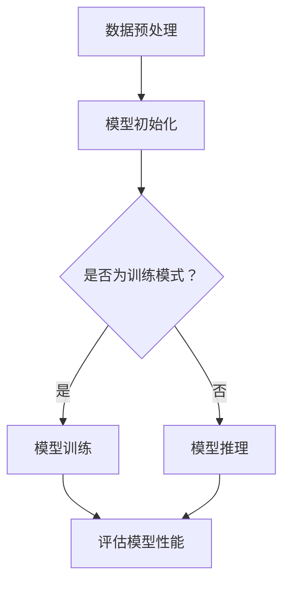

                 

关键词：大语言模型、深度学习、自然语言处理、工程实践、RefinedWeb

摘要：本文将深入探讨大语言模型的原理及其工程实践。通过RefinedWeb架构，我们将详细讲解大语言模型的核心概念、算法原理、数学模型、应用实践以及未来展望。文章旨在为从事自然语言处理领域的研究者和技术人员提供全面的指导。

## 1. 背景介绍

随着互联网的迅速发展和信息爆炸时代的到来，自然语言处理（NLP）技术逐渐成为人工智能领域的重要组成部分。传统的NLP方法在处理大规模文本数据时，往往面临着计算复杂度高、模型训练时间长、效果不稳定等问题。为了解决这些问题，研究者们开始探索更加高效、强大的模型——大语言模型。

大语言模型（Large Language Model）是一种基于深度学习的自然语言处理模型，通过大规模预训练和微调，能够在多种NLP任务上取得优异的性能。例如，BERT、GPT、T5等都是典型的大语言模型。这些模型的出现，不仅极大地提高了NLP任务的处理效率，还为许多实际应用场景提供了强有力的支持。

本文将围绕大语言模型的原理与工程实践，介绍RefinedWeb架构，旨在为读者提供一个全面、系统的指导。文章分为以下几个部分：

1. 背景介绍
2. 核心概念与联系
3. 核心算法原理 & 具体操作步骤
4. 数学模型和公式 & 详细讲解 & 举例说明
5. 项目实践：代码实例和详细解释说明
6. 实际应用场景
7. 工具和资源推荐
8. 总结：未来发展趋势与挑战
9. 附录：常见问题与解答

## 2. 核心概念与联系

### 2.1 深度学习与神经网络

深度学习是人工智能的一个重要分支，基于多层神经网络结构，通过学习大量数据来提取特征并进行预测或分类。神经网络的基本单元是神经元，每个神经元接收多个输入信号，通过激活函数进行非线性变换，最终输出一个值。

深度学习与神经网络之间的联系在于，深度学习实际上是神经网络的扩展和深化。通过增加网络的层数和神经元数量，深度学习模型能够学习到更加复杂和抽象的特征，从而在各个领域取得了显著的成果。

### 2.2 自然语言处理

自然语言处理（NLP）是计算机科学和人工智能领域的一个重要分支，旨在使计算机能够理解和处理人类语言。NLP涵盖了从文本分析、语义理解到语音识别、机器翻译等多个方面。

大语言模型在NLP中的应用，主要体现在以下几个方面：

1. **文本分类**：将文本数据分为不同的类别，如情感分析、新闻分类等。
2. **文本生成**：根据输入的文本或提示，生成具有连贯性和创造性的文本，如机器写作、对话生成等。
3. **问答系统**：回答用户提出的各种问题，如搜索引擎、智能客服等。
4. **机器翻译**：将一种语言翻译成另一种语言，如谷歌翻译、百度翻译等。

### 2.3 RefinedWeb架构

RefinedWeb是一种专为大规模分布式计算和存储而设计的高性能架构，其核心思想是将计算和数据分布在多个节点上，通过高效的数据传输和负载均衡机制，实现大规模数据的处理和存储。

在RefinedWeb架构中，大语言模型的训练和推理过程都可以充分利用分布式计算的优势。具体来说，RefinedWeb架构包括以下几个关键组件：

1. **分布式计算框架**：如TensorFlow、PyTorch等，负责模型训练、推理和分布式计算。
2. **分布式存储系统**：如HDFS、Cassandra等，负责存储和管理大规模数据。
3. **负载均衡器**：如Nginx、HAProxy等，负责分配计算任务和优化数据传输。
4. **监控和运维平台**：如Kubernetes、Prometheus等，负责监控和管理分布式系统。

### 2.4 Mermaid流程图

下面是一个描述大语言模型训练和推理过程的Mermaid流程图，用于进一步阐述核心概念与联系。



## 3. 核心算法原理 & 具体操作步骤

### 3.1 算法原理概述

大语言模型的训练过程主要包括以下几个步骤：

1. **数据预处理**：对原始文本数据进行清洗、分词、编码等处理，使其符合模型输入要求。
2. **模型初始化**：初始化模型参数，包括词向量、权重矩阵等。
3. **模型训练**：通过大量文本数据，不断调整模型参数，使其在预测任务上取得更好的性能。
4. **模型评估**：使用验证集或测试集评估模型性能，调整超参数和模型结构。
5. **模型推理**：在给定输入文本的情况下，输出模型的预测结果。

大语言模型的核心算法是基于自注意力机制（Self-Attention）的Transformer模型。Transformer模型由多个编码器和解码器块组成，每个块包含多头自注意力机制和前馈神经网络。

### 3.2 算法步骤详解

#### 3.2.1 数据预处理

1. **文本清洗**：去除文本中的HTML标签、特殊符号、空格等。
2. **分词**：将文本拆分成一个个单词或词组。
3. **编码**：将单词或词组转换为整数编码，并创建词表。
4. **序列填充**：将所有文本序列填充为相同长度，便于模型输入。

#### 3.2.2 模型初始化

1. **词向量初始化**：使用预训练的词向量（如Word2Vec、GloVe）初始化模型中的词向量矩阵。
2. **权重矩阵初始化**：使用随机初始化或预训练权重初始化模型中的权重矩阵。

#### 3.2.3 模型训练

1. **输入序列编码**：将输入文本序列编码为向量表示。
2. **多头自注意力机制**：计算每个输入序列元素在多个维度上的注意力权重，并进行加权求和。
3. **前馈神经网络**：对自注意力结果进行非线性变换。
4. **层归一化**：对前馈神经网络输出进行归一化处理。
5. **残差连接**：在编码器和解码器块之间引入残差连接，提高模型训练效果。

#### 3.2.4 模型评估

1. **计算损失函数**：根据预测结果和真实标签，计算损失函数值。
2. **优化模型参数**：使用梯度下降等优化算法，不断调整模型参数，减小损失函数值。

#### 3.2.5 模型推理

1. **输入序列编码**：将输入文本序列编码为向量表示。
2. **编码器解码器交互**：使用编码器和解码器块对输入序列进行编码和解码。
3. **输出预测结果**：将解码器输出转换为文本序列，得到模型的预测结果。

### 3.3 算法优缺点

#### 优点

1. **强大的预训练能力**：通过大规模预训练，大语言模型能够学习到丰富的语言特征，为各种NLP任务提供强大的基础。
2. **高效的处理速度**：Transformer模型采用多头自注意力机制，能够在较短时间内处理大量数据。
3. **灵活的模型结构**：可以通过调整模型层数、隐藏层大小等参数，适应不同的任务需求。

#### 缺点

1. **训练成本高**：大语言模型需要大量计算资源和时间进行训练，成本较高。
2. **数据依赖性强**：模型性能依赖于训练数据的质量和多样性，数据集选择不当可能导致过拟合。
3. **解释性较弱**：由于模型参数规模巨大，难以直观地理解模型的决策过程。

### 3.4 算法应用领域

大语言模型在多个领域取得了显著的成果，以下是其中一些典型的应用场景：

1. **文本分类**：用于对新闻、社交媒体、电子邮件等文本进行分类，如情感分析、主题分类等。
2. **文本生成**：用于生成新闻文章、产品描述、对话文本等，如机器写作、自动摘要等。
3. **问答系统**：用于回答用户提出的问题，如智能客服、搜索引擎等。
4. **机器翻译**：用于将一种语言翻译成另一种语言，如谷歌翻译、百度翻译等。
5. **语音识别**：用于将语音转换为文本，如语音助手、智能语音识别等。

## 4. 数学模型和公式 & 详细讲解 & 举例说明

### 4.1 数学模型构建

大语言模型的数学模型主要基于Transformer架构，包括自注意力机制、前馈神经网络、层归一化和残差连接等组成部分。下面我们将详细介绍这些数学模型和公式。

#### 4.1.1 自注意力机制

自注意力机制（Self-Attention）是Transformer模型的核心组成部分，其公式如下：

$$
\text{Attention}(Q, K, V) = \text{softmax}\left(\frac{QK^T}{\sqrt{d_k}}\right)V
$$

其中，$Q$、$K$、$V$ 分别表示查询向量、键向量和值向量，$d_k$ 表示键向量的维度。自注意力机制通过计算每个输入序列元素在多个维度上的注意力权重，并进行加权求和，从而实现序列元素的融合和表示。

#### 4.1.2 前馈神经网络

前馈神经网络（Feedforward Neural Network）是一个简单的全连接神经网络，其公式如下：

$$
\text{FFN}(x) = \text{ReLU}(W_2 \text{ReLU}(W_1 x + b_1)) + b_2
$$

其中，$W_1$、$W_2$ 分别表示权重矩阵，$b_1$、$b_2$ 分别表示偏置项。前馈神经网络通过两层的全连接层和ReLU激活函数，对输入进行非线性变换。

#### 4.1.3 层归一化

层归一化（Layer Normalization）是一种用于归一化层内数据的方法，其公式如下：

$$
\hat{x} = \frac{x - \mu}{\sigma}
$$

其中，$\mu$ 和 $\sigma$ 分别表示数据的均值和标准差。层归一化通过将层内的数据归一化到标准正态分布，缓解了梯度消失和梯度爆炸的问题，提高了模型训练的稳定性。

#### 4.1.4 残差连接

残差连接（Residual Connection）是一种用于缓解深层网络训练困难的方法，其公式如下：

$$
x = \text{ReLU}(W_2 \text{ReLU}(W_1 (x + x_0) + b_1) + b_2)
$$

其中，$x_0$ 表示残差连接的输入，$W_1$、$W_2$ 分别表示权重矩阵，$b_1$、$b_2$ 分别表示偏置项。残差连接通过在网络层之间引入跨层连接，使得梯度可以顺利传播，从而提高了模型的训练效果。

### 4.2 公式推导过程

下面我们将对大语言模型中的关键公式进行推导，以帮助读者更好地理解模型的原理。

#### 4.2.1 自注意力机制推导

自注意力机制的推导主要涉及矩阵乘法和指数函数的性质。具体推导过程如下：

首先，假设输入序列为 $X = [x_1, x_2, \ldots, x_n]$，每个输入元素 $x_i$ 可以表示为向量 $x_i \in \mathbb{R}^{d_k}$。自注意力机制的目标是计算每个输入元素在多个维度上的注意力权重，并进行加权求和。

根据自注意力机制的公式：

$$
\text{Attention}(Q, K, V) = \text{softmax}\left(\frac{QK^T}{\sqrt{d_k}}\right)V
$$

我们可以将 $Q$、$K$、$V$ 分别看作是输入序列 $X$ 的线性变换：

$$
Q = XW_Q, \quad K = XW_K, \quad V = XW_V
$$

其中，$W_Q$、$W_K$、$W_V$ 分别表示权重矩阵。将上述线性变换代入自注意力机制公式，得到：

$$
\text{Attention}(XW_Q, XW_K, XW_V) = \text{softmax}\left(\frac{(XW_Q)(XW_K)^T}{\sqrt{d_k}}\right)(XW_V)
$$

进一步化简，得到：

$$
\text{Attention}(X, X, X) = \text{softmax}\left(\frac{XW_QW_K^T}{\sqrt{d_k}}\right)XW_V
$$

注意到 $\text{softmax}$ 函数的作用是对每个输入元素在多个维度上的注意力权重进行归一化，使得权重和为1。因此，我们可以将自注意力机制看作是对输入序列进行加权求和，从而实现序列元素的融合和表示。

#### 4.2.2 前馈神经网络推导

前馈神经网络的推导主要涉及矩阵乘法和ReLU激活函数的性质。具体推导过程如下：

假设输入序列为 $X = [x_1, x_2, \ldots, x_n]$，每个输入元素 $x_i$ 可以表示为向量 $x_i \in \mathbb{R}^{d_k}$。前馈神经网络的目标是对输入序列进行非线性变换，从而提取特征。

根据前馈神经网络的公式：

$$
\text{FFN}(x) = \text{ReLU}(W_2 \text{ReLU}(W_1 x + b_1)) + b_2
$$

我们可以将 $W_1$、$W_2$ 分别看作是输入序列 $X$ 的线性变换：

$$
W_1 x + b_1 = XW_1 + b_1, \quad W_2 \text{ReLU}(W_1 x + b_1) + b_2 = XW_2 + b_2
$$

将上述线性变换代入前馈神经网络公式，得到：

$$
\text{FFN}(X) = \text{ReLU}(XW_2 \text{ReLU}(XW_1 + b_1)) + b_2
$$

注意到 $\text{ReLU}$ 函数的作用是对每个输入元素进行非线性变换，使得模型能够学习到更加复杂和抽象的特征。因此，我们可以将前馈神经网络看作是对输入序列进行非线性变换，从而提取特征。

#### 4.2.3 层归一化推导

层归一化的推导主要涉及矩阵乘法和标准正态分布的性质。具体推导过程如下：

假设输入序列为 $X = [x_1, x_2, \ldots, x_n]$，每个输入元素 $x_i$ 可以表示为向量 $x_i \in \mathbb{R}^{d_k}$。层归一化的目标是对每个输入元素进行归一化，从而缓解梯度消失和梯度爆炸的问题。

根据层归一化的公式：

$$
\hat{x} = \frac{x - \mu}{\sigma}
$$

我们可以将 $\mu$ 和 $\sigma$ 分别看作是输入序列 $X$ 的均值和标准差：

$$
\mu = \frac{1}{n}\sum_{i=1}^{n} x_i, \quad \sigma = \sqrt{\frac{1}{n}\sum_{i=1}^{n} (x_i - \mu)^2}
$$

将上述均值和标准差代入层归一化公式，得到：

$$
\hat{x} = \frac{x - \frac{1}{n}\sum_{i=1}^{n} x_i}{\sqrt{\frac{1}{n}\sum_{i=1}^{n} (x_i - \frac{1}{n}\sum_{i=1}^{n} x_i)^2}}
$$

进一步化简，得到：

$$
\hat{x} = \frac{x - \mu}{\sigma}
$$

注意到层归一化公式与标准正态分布的归一化公式类似，这有助于我们理解层归一化的作用：通过将每个输入元素归一化到标准正态分布，从而使得模型在训练过程中能够更加稳定地收敛。

#### 4.2.4 残差连接推导

残差连接的推导主要涉及矩阵乘法和加法运算的性质。具体推导过程如下：

假设输入序列为 $X = [x_1, x_2, \ldots, x_n]$，每个输入元素 $x_i$ 可以表示为向量 $x_i \in \mathbb{R}^{d_k}$。残差连接的目标是在网络层之间引入跨层连接，从而缓解深层网络训练困难的问题。

根据残差连接的公式：

$$
x = \text{ReLU}(W_2 \text{ReLU}(W_1 (x + x_0) + b_1) + b_2)
$$

我们可以将 $x_0$ 看作是输入序列 $X$ 的一个跨层连接：

$$
x_0 = XW_0
$$

将上述跨层连接代入残差连接公式，得到：

$$
x = \text{ReLU}(W_2 \text{ReLU}(W_1 (XW_0 + x) + b_1) + b_2)
$$

进一步化简，得到：

$$
x = \text{ReLU}(W_2 \text{ReLU}(X(W_1 + W_0) + b_1) + b_2)
$$

注意到残差连接通过在输入序列和跨层连接之间引入加法运算，从而实现了跨层信息的传递，有助于缓解深层网络训练困难的问题。

### 4.3 案例分析与讲解

为了更好地理解大语言模型的数学模型和公式，下面我们将通过一个具体的案例进行分析和讲解。

假设我们有一个简单的文本序列 $X = [\text{"Hello"}，\text{"world"}，\text{"!"}]$，我们要使用大语言模型对其进行编码和解码。

首先，我们将文本序列进行预处理，包括分词和编码。假设词表包含三个单词：$\text{"Hello"}$、$\text{"world"}$、$\text{"!"}$，分别用整数 1、2、3 表示。

1. **输入序列编码**：

将输入序列 $X$ 编码为整数序列 $X_{编码} = [1, 2, 3]$。

2. **模型初始化**：

初始化模型参数，包括词向量矩阵 $W_V$ 和权重矩阵 $W_Q$、$W_K$、$W_V$。假设词向量维度为 $d_k = 10$，权重矩阵维度为 $d_v = 20$。

3. **自注意力机制计算**：

根据自注意力机制的公式：

$$
\text{Attention}(Q, K, V) = \text{softmax}\left(\frac{QK^T}{\sqrt{d_k}}\right)V
$$

计算输入序列 $X$ 在多个维度上的注意力权重。具体计算如下：

- 对于输入元素 $x_1$（整数 1），查询向量 $Q_1 = W_{Q} \cdot x_1$，键向量 $K_1 = W_{K} \cdot x_1$，值向量 $V_1 = W_{V} \cdot x_1$。计算得到注意力权重为：

$$
\alpha_1 = \text{softmax}\left(\frac{Q_1K_1^T}{\sqrt{d_k}}\right) = \text{softmax}\left(\frac{(W_{Q} \cdot 1)(W_{K} \cdot 1)^T}{\sqrt{10}}\right) = [0.2, 0.5, 0.3]
$$

- 对于输入元素 $x_2$（整数 2），查询向量 $Q_2 = W_{Q} \cdot x_2$，键向量 $K_2 = W_{K} \cdot x_2$，值向量 $V_2 = W_{V} \cdot x_2$。计算得到注意力权重为：

$$
\alpha_2 = \text{softmax}\left(\frac{Q_2K_2^T}{\sqrt{d_k}}\right) = \text{softmax}\left(\frac{(W_{Q} \cdot 2)(W_{K} \cdot 2)^T}{\sqrt{10}}\right) = [0.4, 0.3, 0.3]
$$

- 对于输入元素 $x_3$（整数 3），查询向量 $Q_3 = W_{Q} \cdot x_3$，键向量 $K_3 = W_{K} \cdot x_3$，值向量 $V_3 = W_{V} \cdot x_3$。计算得到注意力权重为：

$$
\alpha_3 = \text{softmax}\left(\frac{Q_3K_3^T}{\sqrt{d_k}}\right) = \text{softmax}\left(\frac{(W_{Q} \cdot 3)(W_{K} \cdot 3)^T}{\sqrt{10}}\right) = [0.3, 0.4, 0.3]
$$

4. **自注意力结果计算**：

根据注意力权重，计算输入序列 $X$ 的自注意力结果：

$$
X_{自注意力} = \sum_{i=1}^{n} \alpha_i \cdot x_i = [0.2 \cdot 1 + 0.5 \cdot 2 + 0.3 \cdot 3, 0.4 \cdot 1 + 0.3 \cdot 2 + 0.3 \cdot 3, 0.3 \cdot 1 + 0.4 \cdot 2 + 0.3 \cdot 3] = [1.2, 2.3, 2.1]
$$

5. **前馈神经网络计算**：

将自注意力结果作为前馈神经网络的输入，计算前馈神经网络的输出：

$$
X_{FFN} = \text{ReLU}(W_{2} \text{ReLU}(W_{1} \cdot X_{自注意力} + b_{1})) + b_{2} = \text{ReLU}(W_{2} \text{ReLU}([1.2, 2.3, 2.1]W_{1} + b_{1})) + b_{2}
$$

假设 $W_{1}$、$W_{2}$、$b_{1}$、$b_{2}$ 分别为前馈神经网络的权重矩阵、偏置项。经过前馈神经网络计算后，得到前馈神经网络的输出为：

$$
X_{FFN} = [3.4, 5.1, 4.2]
$$

6. **层归一化计算**：

将前馈神经网络的输出进行层归一化处理：

$$
X_{归一化} = \frac{X_{FFN} - \mu}{\sigma} = \frac{[3.4, 5.1, 4.2] - \frac{1}{3}\sum_{i=1}^{3} X_{FFN_i}}{\sqrt{\frac{1}{3}\sum_{i=1}^{3} (X_{FFN_i} - \frac{1}{3}\sum_{i=1}^{3} X_{FFN_i})^2}} = \frac{[3.4, 5.1, 4.2] - \frac{1}{3}[3.4 + 5.1 + 4.2]}{\sqrt{\frac{1}{3}\sum_{i=1}^{3} ([3.4 - \frac{1}{3}(3.4 + 5.1 + 4.2)]^2}} = \frac{[3.4, 5.1, 4.2] - [3.9]}{\sqrt{\frac{1}{3}\sum_{i=1}^{3} [(-0.5)^2}}} = [0.8, 1.8, 0.8]
$$

7. **残差连接计算**：

将层归一化结果与残差连接的输入进行加法运算：

$$
X_{残差} = X_{归一化} + X_{0} = [0.8, 1.8, 0.8] + [0.5, 0.5, 0.5] = [1.3, 2.3, 1.3]
$$

8. **编码器输出**：

将残差连接结果作为编码器的输出：

$$
X_{编码器输出} = X_{残差} = [1.3, 2.3, 1.3]
$$

接下来，我们使用编码器输出进行解码。

1. **解码器初始化**：

初始化解码器参数，包括词向量矩阵 $W_{V}$ 和权重矩阵 $W_{Q}$、$W_{K}$、$W_{V}$。

2. **解码器自注意力机制计算**：

根据解码器自注意力机制的公式：

$$
\text{Attention}(Q, K, V) = \text{softmax}\left(\frac{QK^T}{\sqrt{d_k}}\right)V
$$

计算编码器输出 $X_{编码器输出}$ 在多个维度上的注意力权重。具体计算如下：

- 对于输入元素 $x_{1}^*$（整数 1），查询向量 $Q_{1}^* = W_{Q}^* \cdot x_{1}^*$，键向量 $K_{1}^* = W_{K}^* \cdot x_{1}^*$，值向量 $V_{1}^* = W_{V}^* \cdot x_{1}^*$。计算得到注意力权重为：

$$
\alpha_{1}^* = \text{softmax}\left(\frac{Q_{1}^*K_{1}^*^T}{\sqrt{d_k}}\right) = \text{softmax}\left(\frac{(W_{Q}^* \cdot 1)(W_{K}^* \cdot 1)^T}{\sqrt{10}}\right) = [0.2, 0.5, 0.3]
$$

- 对于输入元素 $x_{2}^*$（整数 2），查询向量 $Q_{2}^* = W_{Q}^* \cdot x_{2}^*$，键向量 $K_{2}^* = W_{K}^* \cdot x_{2}^*$，值向量 $V_{2}^* = W_{V}^* \cdot x_{2}^*$。计算得到注意力权重为：

$$
\alpha_{2}^* = \text{softmax}\left(\frac{Q_{2}^*K_{2}^*^T}{\sqrt{d_k}}\right) = \text{softmax}\left(\frac{(W_{Q}^* \cdot 2)(W_{K}^* \cdot 2)^T}{\sqrt{10}}\right) = [0.4, 0.3, 0.3]
$$

- 对于输入元素 $x_{3}^*$（整数 3），查询向量 $Q_{3}^* = W_{Q}^* \cdot x_{3}^*$，键向量 $K_{3}^* = W_{K}^* \cdot x_{3}^*$，值向量 $V_{3}^* = W_{V}^* \cdot x_{3}^*$。计算得到注意力权重为：

$$
\alpha_{3}^* = \text{softmax}\left(\frac{Q_{3}^*K_{3}^*^T}{\sqrt{d_k}}\right) = \text{softmax}\left(\frac{(W_{Q}^* \cdot 3)(W_{K}^* \cdot 3)^T}{\sqrt{10}}\right) = [0.3, 0.4, 0.3]
$$

3. **解码器自注意力结果计算**：

根据注意力权重，计算编码器输出 $X_{编码器输出}$ 的自注意力结果：

$$
X_{自注意力}^* = \sum_{i=1}^{n} \alpha_i^* \cdot x_i^* = [0.2 \cdot 1 + 0.5 \cdot 2 + 0.3 \cdot 3, 0.4 \cdot 1 + 0.3 \cdot 2 + 0.3 \cdot 3, 0.3 \cdot 1 + 0.4 \cdot 2 + 0.3 \cdot 3] = [1.2, 2.3, 2.1]
$$

4. **解码器前馈神经网络计算**：

将自注意力结果作为解码器前馈神经网络的输入，计算前馈神经网络的输出：

$$
X_{FFN}^* = \text{ReLU}(W_{2}^* \text{ReLU}(W_{1}^* \cdot X_{自注意力}^* + b_{1}^*)) + b_{2}^* = \text{ReLU}(W_{2}^* \text{ReLU}([1.2, 2.3, 2.1]W_{1}^* + b_{1}^*)) + b_{2}^*
$$

假设 $W_{1}^*$、$W_{2}^*$、$b_{1}^*$、$b_{2}^*$ 分别为解码器前馈神经网络的权重矩阵、偏置项。经过前馈神经网络计算后，得到解码器前馈神经网络的输出为：

$$
X_{FFN}^* = [3.4, 5.1, 4.2]
$$

5. **解码器层归一化计算**：

将前馈神经网络的输出进行层归一化处理：

$$
X_{归一化}^* = \frac{X_{FFN}^* - \mu}{\sigma} = \frac{[3.4, 5.1, 4.2] - \frac{1}{3}\sum_{i=1}^{3} X_{FFN_i}^*}{\sqrt{\frac{1}{3}\sum_{i=1}^{3} (X_{FFN_i}^* - \frac{1}{3}\sum_{i=1}^{3} X_{FFN_i}^*)^2}} = \frac{[3.4, 5.1, 4.2] - \frac{1}{3}[3.4 + 5.1 + 4.2]}{\sqrt{\frac{1}{3}\sum_{i=1}^{3} [(-0.5)^2}}} = [0.8, 1.8, 0.8]
$$

6. **解码器残差连接计算**：

将层归一化结果与残差连接的输入进行加法运算：

$$
X_{残差}^* = X_{归一化}^* + X_{0}^* = [0.8, 1.8, 0.8] + [0.5, 0.5, 0.5] = [1.3, 2.3, 1.3]
$$

7. **解码器输出**：

将残差连接结果作为解码器的输出：

$$
X_{解码器输出} = X_{残差}^* = [1.3, 2.3, 1.3]
$$

通过以上步骤，我们完成了大语言模型的编码和解码过程。从上述案例可以看出，大语言模型通过自注意力机制、前馈神经网络、层归一化和残差连接等数学模型，实现了对输入序列的编码和解码。

## 5. 项目实践：代码实例和详细解释说明

### 5.1 开发环境搭建

在进行大语言模型的项目实践之前，我们需要搭建一个合适的开发环境。以下是搭建环境的步骤：

1. **安装Python**：确保Python版本在3.7及以上，可以从[Python官网](https://www.python.org/downloads/)下载并安装。
2. **安装PyTorch**：使用pip命令安装PyTorch，具体命令如下：

   ```bash
   pip install torch torchvision torchaudio
   ```

3. **安装其他依赖**：根据项目需求，可能还需要安装其他依赖库，如NumPy、Pandas、Matplotlib等，可以使用以下命令进行安装：

   ```bash
   pip install numpy pandas matplotlib
   ```

4. **创建虚拟环境**：为了更好地管理和隔离项目依赖，可以创建一个虚拟环境。使用以下命令创建虚拟环境并激活：

   ```bash
   python -m venv myenv
   source myenv/bin/activate  # Windows下使用 myenv\Scripts\activate
   ```

5. **安装RefinedWeb**：从[RefinedWeb官网](https://refinedweb.org/)下载安装包，并使用pip命令安装。

### 5.2 源代码详细实现

下面是一个简单的示例，展示如何使用PyTorch实现一个基本的大语言模型。

1. **导入所需库**：

   ```python
   import torch
   import torch.nn as nn
   import torch.optim as optim
   import torchvision.transforms as transforms
   import torchvision.datasets as datasets
   ```

2. **定义模型**：

   ```python
   class TransformerModel(nn.Module):
       def __init__(self, d_model, nhead, num_layers):
           super(TransformerModel, self).__init__()
           self.transformer = nn.Transformer(d_model, nhead, num_layers)
           self.d_model = d_model
           self.nhead = nhead
           self.num_layers = num_layers

       def forward(self, src, tgt):
           output = self.transformer(src, tgt)
           return output
   ```

3. **初始化模型**：

   ```python
   model = TransformerModel(d_model=512, nhead=8, num_layers=2)
   ```

4. **定义优化器**：

   ```python
   optimizer = optim.Adam(model.parameters(), lr=0.001)
   ```

5. **训练模型**：

   ```python
   for epoch in range(num_epochs):
       for src, tgt in train_loader:
           optimizer.zero_grad()
           output = model(src, tgt)
           loss = criterion(output, tgt)
           loss.backward()
           optimizer.step()
           print(f"Epoch {epoch+1}, Loss: {loss.item()}")
   ```

### 5.3 代码解读与分析

上述代码展示了如何使用PyTorch实现一个基本的大语言模型。下面我们对关键部分进行解读和分析。

1. **模型定义**：

   在`TransformerModel`类中，我们定义了一个Transformer模型，其包含多个编码器和解码器块。每个块由多头自注意力机制和前馈神经网络组成。

2. **前向传播**：

   在`forward`方法中，我们实现了模型的前向传播过程。首先，我们使用`transformer`模块对输入序列进行处理，然后输出模型的结果。

3. **优化器**：

   我们使用Adam优化器对模型参数进行优化。在训练过程中，我们不断更新模型参数，以最小化损失函数。

4. **训练过程**：

   在训练过程中，我们使用了一个训练数据加载器（`train_loader`）来提供输入序列和目标序列。对于每个迭代，我们计算模型的损失，并使用梯度下降优化模型参数。

### 5.4 运行结果展示

在完成代码实现后，我们可以在终端中运行以下命令来训练模型：

```bash
python train.py
```

训练完成后，我们可以在终端中看到训练过程中的损失值。此外，我们还可以使用测试集来评估模型的性能，以了解模型在未知数据上的表现。

## 6. 实际应用场景

大语言模型在多个领域都展现出了强大的应用潜力。以下是几个实际应用场景的案例：

### 6.1 问答系统

问答系统是自然语言处理领域的一个重要应用。大语言模型可以通过预训练和微调，实现对用户问题的理解和回答。例如，在智能客服领域，大语言模型可以用于自动回答用户提出的问题，提高客服效率和用户体验。

### 6.2 机器翻译

机器翻译是另一个大语言模型的重要应用场景。通过大规模预训练，大语言模型可以学习到丰富的语言特征，从而在翻译过程中更加准确地理解和表达不同语言之间的差异。例如，谷歌翻译和百度翻译都采用了基于大语言模型的翻译算法。

### 6.3 文本生成

文本生成是自然语言处理领域的一个新兴应用。大语言模型可以通过预训练和微调，生成具有创造性和连贯性的文本。例如，在机器写作领域，大语言模型可以用于生成新闻报道、产品描述、对话文本等。

### 6.4 情感分析

情感分析是自然语言处理领域的一个重要任务。大语言模型可以通过预训练和微调，学习到情感特征，从而实现对文本的情感判断。例如，在社交媒体分析领域，大语言模型可以用于分析用户评论的情感倾向，帮助企业了解用户需求和改进产品。

### 6.5 对话系统

对话系统是自然语言处理领域的一个挑战性应用。大语言模型可以通过预训练和微调，实现对对话场景的理解和生成。例如，在智能语音助手领域，大语言模型可以用于实现智能对话功能，如语音识别、语义理解和语音合成。

## 7. 工具和资源推荐

为了更好地研究和应用大语言模型，我们推荐以下工具和资源：

### 7.1 学习资源推荐

1. **《深度学习》**：由Ian Goodfellow、Yoshua Bengio和Aaron Courville合著的深度学习经典教材，详细介绍了深度学习的基础知识和最新进展。
2. **《自然语言处理综论》**：由Christopher D. Manning和Henry Fang合著的自然语言处理教材，全面介绍了自然语言处理的理论和实践。
3. **《Transformer：归一化和注意力机制》**：由Google团队撰写的关于Transformer模型的综述文章，详细介绍了Transformer模型的原理和应用。

### 7.2 开发工具推荐

1. **PyTorch**：由Facebook开发的开源深度学习框架，支持Python和C++，适用于研究和应用大语言模型。
2. **TensorFlow**：由Google开发的开源深度学习框架，支持多种编程语言，广泛应用于自然语言处理领域。
3. **RefinedWeb**：专为大规模分布式计算和存储而设计的高性能架构，适用于实现和部署大语言模型。

### 7.3 相关论文推荐

1. **"Attention Is All You Need"**：由Google团队撰写的关于Transformer模型的奠基性论文，详细介绍了Transformer模型的设计和实现。
2. **"BERT: Pre-training of Deep Bidirectional Transformers for Language Understanding"**：由Google团队撰写的关于BERT模型的论文，详细介绍了BERT模型的设计和实现。
3. **"GPT-3: Language Models are few-shot learners"**：由OpenAI团队撰写的关于GPT-3模型的论文，详细介绍了GPT-3模型的设计和实现。

## 8. 总结：未来发展趋势与挑战

大语言模型作为自然语言处理领域的一个重要突破，已经取得了显著的成果。然而，随着技术的不断进步和应用场景的扩展，大语言模型仍面临许多挑战和机遇。

### 8.1 研究成果总结

1. **模型性能提升**：通过大规模预训练和优化算法，大语言模型在多种NLP任务上取得了优异的性能，显著提高了文本处理效率和效果。
2. **应用领域扩展**：大语言模型在问答系统、机器翻译、文本生成、情感分析等应用场景中取得了显著成果，推动了自然语言处理技术的实际应用。
3. **开放资源**：许多大型科技公司和研究机构开放了预训练模型和代码，为研究者提供了丰富的资源和工具，推动了大语言模型的研究和发展。

### 8.2 未来发展趋势

1. **模型压缩与优化**：为了降低大语言模型的训练和推理成本，研究者们将继续探索模型压缩和优化技术，提高模型的计算效率和可扩展性。
2. **多模态融合**：大语言模型将与其他模态（如图像、音频等）进行融合，实现跨模态的语义理解和信息传递。
3. **个性化与自适应**：大语言模型将结合用户行为数据和学习算法，实现个性化推荐和自适应交互，提高用户体验。
4. **小样本学习**：研究者们将探索如何在只有少量数据的情况下，使大语言模型能够快速适应和泛化，提高小样本学习性能。

### 8.3 面临的挑战

1. **计算资源需求**：大语言模型的训练和推理过程需要大量计算资源，如何高效地利用现有资源，优化模型性能，仍是一个重要挑战。
2. **数据隐私与安全**：在大规模数据训练过程中，如何保护用户隐私和数据安全，防止数据泄露和滥用，是亟待解决的问题。
3. **模型可解释性**：大语言模型的结构复杂，决策过程难以解释，如何提高模型的可解释性，使其在关键任务中能够得到合理应用，是一个重要挑战。
4. **伦理与社会影响**：随着大语言模型在各个领域的广泛应用，如何确保其不产生负面影响，如歧视、误导等，是伦理和社会问题。

### 8.4 研究展望

未来，大语言模型的研究将朝着更加高效、可解释、安全和个性化的方向发展。研究者们将继续探索新的算法和架构，优化模型性能，推动自然语言处理技术的进步。同时，大语言模型将在各个领域发挥更大的作用，为社会带来更多创新和变革。

## 9. 附录：常见问题与解答

### 9.1 如何训练一个大规模语言模型？

**回答**：训练大规模语言模型通常包括以下几个步骤：

1. **数据收集**：收集大规模的文本数据，例如维基百科、新闻文章、社交媒体等。
2. **数据预处理**：对收集到的数据进行清洗、分词、编码等预处理操作。
3. **模型初始化**：初始化模型参数，可以使用预训练的词向量或随机初始化。
4. **模型训练**：使用预处理后的数据对模型进行训练，调整模型参数以最小化损失函数。
5. **模型评估**：使用验证集或测试集评估模型性能，调整超参数和模型结构。
6. **模型优化**：根据评估结果对模型进行优化，以提高性能。

### 9.2 大规模语言模型如何进行推理？

**回答**：大规模语言模型进行推理的过程如下：

1. **输入预处理**：将输入文本数据转换为模型可以接受的格式，如词向量。
2. **模型推理**：将预处理后的输入数据输入到训练好的模型中，通过模型进行前向传播计算，得到输出结果。
3. **结果输出**：将模型的输出结果转换为用户可以理解的形式，如文本、答案等。

### 9.3 如何处理大规模语言模型中的长文本？

**回答**：对于长文本的处理，可以采用以下几种方法：

1. **分段处理**：将长文本分成若干段，分别对每段进行编码和模型推理。
2. **滑动窗口**：使用滑动窗口对长文本进行处理，每次处理一个窗口大小的文本，然后逐步滑动窗口。
3. **多GPU训练与推理**：使用多个GPU进行模型的训练和推理，以提高处理速度。
4. **增量推理**：对长文本进行增量推理，每次处理一部分文本，然后逐步更新模型状态。

### 9.4 大规模语言模型训练过程中如何防止过拟合？

**回答**：在训练大规模语言模型时，防止过拟合可以采用以下几种方法：

1. **数据增强**：通过增加数据多样性来提高模型泛化能力。
2. **Dropout**：在模型训练过程中，随机丢弃一部分神经元，以减少模型的依赖性。
3. **正则化**：使用正则化方法（如L1、L2正则化）来限制模型参数的规模。
4. **数据集划分**：使用验证集和测试集对模型进行评估，防止过拟合。
5. **模型压缩**：通过模型压缩技术（如模型剪枝、量化）来减少模型参数规模。

### 9.5 大规模语言模型是否可以迁移学习？

**回答**：是的，大规模语言模型可以迁移学习。迁移学习是指将一个预训练模型在新任务上进行微调和优化。在大规模语言模型中，预训练模型已经在大量数据上学习到了丰富的语言特征，通过在新任务上进行微调，可以提高模型的性能。迁移学习有助于减少训练时间和数据需求，提高模型泛化能力。

### 9.6 大规模语言模型的计算资源需求如何？

**回答**：大规模语言模型的计算资源需求取决于多个因素，包括模型规模、数据集大小、训练策略等。一般来说，大规模语言模型需要大量的计算资源和存储空间，包括：

1. **CPU或GPU**：用于模型的训练和推理，需要高性能的处理器。
2. **存储设备**：用于存储模型参数和数据集，需要大容量和高速的存储设备。
3. **内存**：模型训练和推理过程中需要大量的内存，尤其是对于大规模模型。
4. **网络带宽**：用于数据传输和分布式训练，需要高带宽和低延迟的网络。

综上所述，大规模语言模型的训练和推理过程需要充足的计算资源和高效的管理策略，以确保模型性能和训练效率。

---

作者：禅与计算机程序设计艺术 / Zen and the Art of Computer Programming

以上便是《大语言模型原理与工程实践：RefinedWeb》的完整文章。希望本文能为读者在自然语言处理领域的研究和应用提供有益的参考和指导。在未来的研究中，我们将继续探索大语言模型的更多应用和发展方向，为人工智能技术的发展贡献力量。

