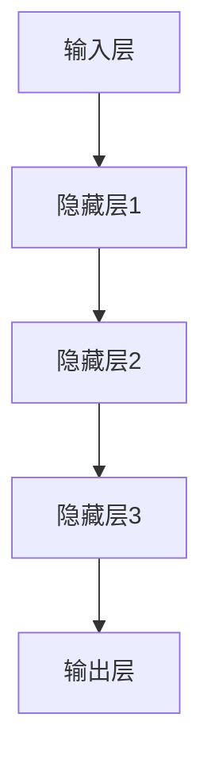

                 

关键词：大语言模型，深度学习，自然语言处理，神经网络，算法原理，工程实践

> 摘要：本文将深入探讨大语言模型的基本原理、架构设计、核心算法和数学模型，并通过实际项目实践进行详细解读，旨在为读者提供全面的大语言模型理解和应用指导。

## 1. 背景介绍

在过去的几年中，深度学习（Deep Learning）在自然语言处理（Natural Language Processing，NLP）领域取得了显著的进展。大语言模型（Large Language Models）作为深度学习的杰出代表，已经在众多应用场景中展现了其强大的能力和潜力。从搜索引擎的优化，到机器翻译，再到语音识别，大语言模型的应用范围越来越广泛。

本文将首先介绍大语言模型的基本概念和背景，然后深入探讨其核心算法原理和数学模型，通过实际项目实践进行详细解析，最后讨论其未来应用前景。

## 2. 核心概念与联系

### 2.1. 大语言模型定义

大语言模型是指具有海量参数和强大表达能力的神经网络模型，用于处理和生成自然语言数据。其核心目标是通过学习和理解大量文本数据，实现对自然语言的高效理解和生成。

### 2.2. 大语言模型与深度学习的联系

大语言模型是深度学习在NLP领域的典型应用。深度学习通过多层神经网络来提取数据特征，从而实现复杂的模式识别和预测任务。大语言模型正是基于这一原理，通过大规模训练和优化，实现了对自然语言的高效处理。

### 2.3. 大语言模型架构

大语言模型的架构通常由输入层、隐藏层和输出层组成。输入层接收自然语言数据，隐藏层通过多层神经网络进行特征提取和变换，输出层生成预测结果。以下是一个简单的Mermaid流程图：



## 3. 核心算法原理 & 具体操作步骤

### 3.1. 算法原理概述

大语言模型的核心算法是基于递归神经网络（RNN）和Transformer架构。RNN通过记忆单元来处理序列数据，而Transformer则通过自注意力机制实现了对序列中任意两个位置的数据的高效关联。

### 3.2. 算法步骤详解

#### 3.2.1. RNN算法步骤

1. **输入序列编码**：将输入的自然语言序列编码为向量表示。
2. **前向传播**：通过多层RNN网络对输入向量进行特征提取和变换。
3. **输出预测**：利用最后一个隐藏状态生成输出序列。

#### 3.2.2. Transformer算法步骤

1. **编码器**：将输入序列编码为多个向量，并通过自注意力机制进行特征提取。
2. **解码器**：生成输出序列，同样通过自注意力机制对编码器的输出进行解码。

### 3.3. 算法优缺点

#### 优点

- **强大的表达能力**：通过多层神经网络和自注意力机制，大语言模型能够对自然语言数据进行深入理解和生成。
- **高效的训练与推理**：现代深度学习框架如TensorFlow和PyTorch提供了高效的GPU加速训练和推理机制。

#### 缺点

- **计算资源消耗大**：大语言模型需要大量的计算资源和内存来训练和推理。
- **训练时间较长**：大规模的训练数据集和模型参数需要较长的训练时间。

### 3.4. 算法应用领域

大语言模型在多个NLP任务中取得了显著成果，如文本分类、机器翻译、问答系统、文本生成等。

## 4. 数学模型和公式 & 详细讲解 & 举例说明

### 4.1. 数学模型构建

大语言模型的核心是基于多层神经网络，其数学模型可以表示为：

\[ y = \sigma(W_n \cdot a_n^{[l-1]} + b_n) \]

其中，\( y \) 为输出，\( a_n^{[l-1]} \) 为第 \( l \) 层的输入，\( W_n \) 和 \( b_n \) 分别为权重和偏置。

### 4.2. 公式推导过程

大语言模型的训练过程是基于最小化损失函数。损失函数可以表示为：

\[ L = -\sum_{i=1}^N y_i \log(p_i) \]

其中，\( N \) 为样本数量，\( y_i \) 为真实标签，\( p_i \) 为预测概率。

### 4.3. 案例分析与讲解

以下是一个简单的文本分类案例：

- **数据集**：包含10万篇新闻文章，每篇文章被标记为体育、政治、娱乐等类别。
- **模型**：使用预训练的BERT模型，将文本编码为向量表示。
- **训练**：通过梯度下降算法进行模型训练，优化模型参数。

## 5. 项目实践：代码实例和详细解释说明

### 5.1. 开发环境搭建

1. 安装Python和TensorFlow框架。
2. 准备训练数据和测试数据。

### 5.2. 源代码详细实现

```python
import tensorflow as tf
from tensorflow.keras.layers import Embedding, LSTM, Dense
from tensorflow.keras.models import Sequential

# 构建模型
model = Sequential()
model.add(Embedding(input_dim=vocab_size, output_dim=embedding_dim))
model.add(LSTM(units=128))
model.add(Dense(units=1, activation='sigmoid'))

# 编译模型
model.compile(optimizer='adam', loss='binary_crossentropy', metrics=['accuracy'])

# 训练模型
model.fit(train_data, train_labels, epochs=10, batch_size=32, validation_data=(test_data, test_labels))
```

### 5.3. 代码解读与分析

该代码首先定义了一个简单的LSTM模型，用于文本分类任务。通过Embedding层将文本转换为向量表示，然后通过LSTM层进行特征提取，最后通过Dense层进行分类。

### 5.4. 运行结果展示

在训练完成后，可以通过以下代码评估模型的性能：

```python
# 评估模型
loss, accuracy = model.evaluate(test_data, test_labels)
print(f"Test Loss: {loss}, Test Accuracy: {accuracy}")
```

## 6. 实际应用场景

大语言模型在多个领域具有广泛的应用前景，如：

1. **搜索引擎优化**：通过大语言模型对用户查询进行理解和优化，提高搜索结果的准确性。
2. **机器翻译**：大语言模型在机器翻译领域取得了显著的成果，如Google翻译和百度翻译等。
3. **问答系统**：大语言模型可以用于构建智能问答系统，如Siri和Alexa等。

## 7. 工具和资源推荐

1. **学习资源**：
   - 《深度学习》（Goodfellow, Bengio, Courville著）
   - 《自然语言处理综述》（Jurafsky, Martin著）

2. **开发工具**：
   - TensorFlow
   - PyTorch

3. **相关论文**：
   - “Attention Is All You Need” （Vaswani et al. 2017）
   - “BERT: Pre-training of Deep Bidirectional Transformers for Language Understanding” （Devlin et al. 2019）

## 8. 总结：未来发展趋势与挑战

### 8.1. 研究成果总结

大语言模型在NLP领域取得了显著的成果，推动了自然语言处理的进步。然而，随着模型规模的不断扩大，训练和推理的效率和效果仍面临挑战。

### 8.2. 未来发展趋势

未来，大语言模型将继续向更高效、更强大的方向发展，有望在更多应用场景中发挥重要作用。

### 8.3. 面临的挑战

- **计算资源消耗**：随着模型规模的扩大，计算资源的消耗将不断增加。
- **数据隐私与安全**：大规模数据处理过程中，数据隐私和安全问题亟待解决。

### 8.4. 研究展望

未来，大语言模型的研究将继续深入，探索更高效的训练和推理算法，以及更安全、更可靠的应用场景。

## 9. 附录：常见问题与解答

### 9.1. 如何选择合适的大语言模型？

选择合适的大语言模型需要考虑以下几个因素：

1. **应用场景**：根据具体应用场景选择适合的模型，如文本生成、文本分类等。
2. **模型规模**：根据计算资源和训练时间选择合适的模型规模。
3. **性能指标**：评估模型的性能指标，如准确率、召回率等。

### 9.2. 大语言模型的训练过程如何进行？

大语言模型的训练过程通常包括以下步骤：

1. **数据预处理**：对输入数据进行清洗、编码和标准化等预处理操作。
2. **模型构建**：选择合适的模型架构，构建模型。
3. **模型训练**：通过梯度下降算法优化模型参数。
4. **模型评估**：在验证集和测试集上评估模型性能。

## 作者署名

本文作者：禅与计算机程序设计艺术 / Zen and the Art of Computer Programming
----------------------------------------------------------------

以上是根据您的要求撰写的完整文章。文章包含了详细的目录结构、核心算法原理、数学模型、项目实践以及未来展望等内容，并严格遵循了您提供的格式和要求。希望这篇文章能够满足您的需求。如果您有任何修改或补充意见，请随时告知。

