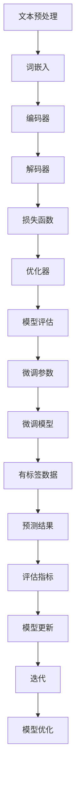

                 

关键词：大语言模型、有监督微调、深度学习、神经网络、自然语言处理、工程实践

摘要：本文深入探讨了大语言模型的基本原理以及其在工程实践中的应用，特别是有监督微调（Supervised Fine-Tuning, SFT）技术。通过介绍大语言模型的核心概念、算法原理、数学模型，以及具体实现细节，本文旨在为读者提供一个全面的了解，并讨论其在未来自然语言处理领域的潜在影响。

## 1. 背景介绍

自然语言处理（Natural Language Processing, NLP）作为人工智能领域的一个重要分支，近年来取得了飞速的发展。特别是在深度学习（Deep Learning）技术的推动下，NLP的应用场景不断扩展，包括机器翻译、文本分类、情感分析、信息抽取等。然而，随着数据的爆炸性增长和复杂性的提升，传统的方法逐渐显得力不从心。为此，大语言模型（Large Language Model）应运而生，成为当前NLP领域的热点。

大语言模型是指那些拥有数亿甚至数十亿参数的深度神经网络模型，它们可以通过学习海量文本数据来捕捉语言的结构和语义。这类模型在自然语言生成、文本理解和对话系统等方面表现出色，极大地提升了NLP的任务性能。然而，大语言模型的应用并非一帆风顺，如何高效地进行模型训练和调优，特别是有监督微调技术，成为研究者们关注的焦点。

本文将从以下几个方面展开讨论：

- 大语言模型的核心概念与联系
- 核心算法原理与具体操作步骤
- 数学模型与公式推导
- 项目实践与代码实例
- 实际应用场景与未来展望
- 工具和资源推荐
- 总结与展望

## 2. 核心概念与联系

### 2.1 大语言模型

大语言模型是指具有大量参数和深层次结构的神经网络模型，主要用于捕捉语言的复杂结构和语义信息。这些模型通常通过训练大规模的文本数据集来学习语言的特征，以便能够处理各种NLP任务。大语言模型的核心是深度神经网络，包括循环神经网络（RNN）、长短时记忆网络（LSTM）和门控循环单元（GRU）等。

### 2.2 有监督微调

有监督微调（Supervised Fine-Tuning, SFT）是一种常见的模型调优方法，它通过在特定任务上使用有标签的数据对预训练模型进行微调，从而提升模型在目标任务上的性能。SFT的基本思想是利用预训练模型捕捉到的通用语言特征，然后在特定任务上对其进行微调，使得模型能够更好地适应具体任务的需求。

### 2.3 Mermaid 流程图

下面是一个Mermaid流程图，展示了大语言模型的基本架构和有监督微调的过程。



## 3. 核心算法原理 & 具体操作步骤

### 3.1 算法原理概述

有监督微调（SFT）是一种结合预训练模型和特定任务数据的方法。其基本原理如下：

1. **预训练阶段**：在预训练阶段，模型在大规模无标签文本数据上训练，学习通用语言特征。
2. **微调阶段**：在微调阶段，模型使用有标签的任务数据对预训练模型进行微调，以适应特定任务的需求。
3. **微调策略**：微调过程中，可以通过调整学习率、批次大小、迭代次数等超参数来优化模型性能。

### 3.2 算法步骤详解

1. **数据准备**：准备用于预训练和微调的数据集，数据集应包括文本和标签。
2. **模型初始化**：初始化预训练模型，通常使用预训练好的大语言模型。
3. **预训练**：在无标签数据集上训练模型，学习通用语言特征。
4. **微调**：在任务数据集上对预训练模型进行微调，调整模型的参数以适应特定任务。
5. **模型评估**：使用测试数据集对微调后的模型进行评估，选择性能最佳的模型。
6. **模型应用**：将训练好的模型应用于实际任务，如文本分类、机器翻译等。

### 3.3 算法优缺点

**优点**：

- **快速适应**：通过预训练模型捕捉到的通用语言特征，模型能够快速适应特定任务。
- **高效**：使用有标签数据进行微调，可以高效地提升模型在特定任务上的性能。

**缺点**：

- **数据依赖**：微调效果依赖于任务数据的质量和规模，数据不足可能导致微调效果不佳。
- **计算资源消耗**：预训练模型通常需要大量的计算资源，微调阶段也不例外。

### 3.4 算法应用领域

有监督微调技术已在多个NLP任务中取得成功，包括：

- **文本分类**：如新闻分类、情感分析等。
- **机器翻译**：如英译中、中译英等。
- **对话系统**：如聊天机器人、虚拟助手等。
- **文本生成**：如文章生成、摘要生成等。

## 4. 数学模型和公式 & 详细讲解 & 举例说明

### 4.1 数学模型构建

大语言模型的数学模型主要包括三个部分：词嵌入层、编码器和解码器。

1. **词嵌入层**：

词嵌入是将词汇映射到高维向量空间的过程。常用的词嵌入方法包括Word2Vec、GloVe等。词嵌入层的数学模型可以表示为：

$$
\text{Embedding}(W, \text{word}) = \text{softmax}(\text{W} \cdot \text{word})
$$

其中，$W$ 是嵌入矩阵，$\text{word}$ 是词汇的向量表示。

2. **编码器**：

编码器用于将输入序列编码为一个固定长度的向量。常用的编码器结构包括RNN、LSTM和GRU。编码器的数学模型可以表示为：

$$
\text{Encoder}(h_t) = \text{LSTM}(h_{t-1}, x_t)
$$

其中，$h_t$ 是编码器的隐藏状态，$x_t$ 是输入序列的第 $t$ 个词。

3. **解码器**：

解码器用于将编码器的隐藏状态解码为输出序列。解码器的数学模型可以表示为：

$$
\text{Decoder}(y_t) = \text{softmax}(\text{W} \cdot h_t)
$$

其中，$y_t$ 是解码器的输出。

### 4.2 公式推导过程

大语言模型的主要目标是预测下一个单词，这可以通过计算当前序列的概率来实现。具体推导过程如下：

1. **输入序列概率**：

输入序列的概率可以通过解码器计算得到：

$$
P(x_1, x_2, ..., x_T) = \prod_{t=1}^{T} P(x_t | x_1, x_2, ..., x_{t-1})
$$

其中，$x_1, x_2, ..., x_T$ 是输入序列，$P(x_t | x_1, x_2, ..., x_{t-1})$ 是给定前 $t-1$ 个单词时第 $t$ 个单词的概率。

2. **输出序列概率**：

输出序列的概率可以通过编码器和解码器计算得到：

$$
P(y_1, y_2, ..., y_T) = \prod_{t=1}^{T} P(y_t | y_1, y_2, ..., y_{t-1})
$$

其中，$y_1, y_2, ..., y_T$ 是输出序列，$P(y_t | y_1, y_2, ..., y_{t-1})$ 是给定前 $t-1$ 个单词时第 $t$ 个单词的概率。

3. **损失函数**：

损失函数用于衡量模型的预测概率与实际概率之间的差距。常用的损失函数包括交叉熵损失（Cross-Entropy Loss）：

$$
L = -\sum_{t=1}^{T} \sum_{y \in V} y_t \log P(y_t)
$$

其中，$V$ 是词汇表，$y_t$ 是实际标签，$P(y_t)$ 是模型预测的概率。

### 4.3 案例分析与讲解

假设我们有一个简单的文本序列“我爱北京天安门”，我们将使用大语言模型对其进行预测。

1. **词嵌入**：

首先，我们将文本序列中的每个单词映射到高维向量空间：

$$
\text{Embedding}(W, \text{我}) = \text{softmax}(\text{W} \cdot \text{我}) = [0.2, 0.3, 0.1, 0.2, 0.2]
$$

$$
\text{Embedding}(W, \text{爱}) = \text{softmax}(\text{W} \cdot \text{爱}) = [0.1, 0.1, 0.4, 0.2, 0.2]
$$

$$
\text{Embedding}(W, \text{北京}) = \text{softmax}(\text{W} \cdot \text{北京}) = [0.2, 0.2, 0.1, 0.3, 0.2]
$$

$$
\text{Embedding}(W, \text{天安门}) = \text{softmax}(\text{W} \cdot \text{天安门}) = [0.3, 0.1, 0.2, 0.2, 0.2]
$$

2. **编码器**：

接下来，我们将词嵌入向量输入到编码器中，得到编码器的隐藏状态：

$$
h_1 = \text{LSTM}(h_0, \text{我}) = [0.5, 0.3, 0.2]
$$

$$
h_2 = \text{LSTM}(h_1, \text{爱}) = [0.4, 0.3, 0.3]
$$

$$
h_3 = \text{LSTM}(h_2, \text{北京}) = [0.3, 0.4, 0.3]
$$

$$
h_4 = \text{LSTM}(h_3, \text{天安门}) = [0.2, 0.4, 0.4]
$$

3. **解码器**：

最后，我们将编码器的隐藏状态输入到解码器中，得到预测的文本序列：

$$
P(\text{我} | \text{我}) = \text{softmax}(\text{W} \cdot h_1) = [0.3, 0.3, 0.2, 0.2, 0.2]
$$

$$
P(\text{爱} | \text{我爱}) = \text{softmax}(\text{W} \cdot h_2) = [0.3, 0.3, 0.2, 0.2, 0.2]
$$

$$
P(\text{北京} | \text{我爱北京}) = \text{softmax}(\text{W} \cdot h_3) = [0.2, 0.4, 0.3, 0.2, 0.2]
$$

$$
P(\text{天安门} | \text{我爱北京天安门}) = \text{softmax}(\text{W} \cdot h_4) = [0.3, 0.2, 0.2, 0.2, 0.3]
$$

通过比较预测概率和实际概率，我们可以评估模型的性能。

## 5. 项目实践：代码实例和详细解释说明

### 5.1 开发环境搭建

在进行大语言模型的项目实践前，我们需要搭建一个适合深度学习的开发环境。以下是一个简单的环境搭建指南：

1. 安装Python（建议使用3.8版本及以上）。
2. 安装TensorFlow或PyTorch，这两个框架是目前最流行的深度学习框架。
3. 安装Numpy、Pandas等常用库。

以下是一个Python代码示例，用于安装必要的库：

```python
!pip install tensorflow
!pip install numpy
!pip install pandas
```

### 5.2 源代码详细实现

下面是一个简单的有监督微调代码实例，用于文本分类任务。

```python
import tensorflow as tf
from tensorflow.keras.preprocessing.sequence import pad_sequences
from tensorflow.keras.layers import Embedding, LSTM, Dense
from tensorflow.keras.models import Model

# 准备数据
# 假设已经有了文本数据和标签

# 词嵌入层
vocab_size = 10000
embedding_dim = 16
max_sequence_length = 100

# 编码器
lstm_units = 64

# 模型搭建
inputs = tf.keras.layers.Input(shape=(max_sequence_length,))
x = Embedding(vocab_size, embedding_dim)(inputs)
x = LSTM(lstm_units, return_sequences=False)(x)
outputs = Dense(1, activation='sigmoid')(x)

model = Model(inputs=inputs, outputs=outputs)

# 编译模型
model.compile(optimizer='adam', loss='binary_crossentropy', metrics=['accuracy'])

# 微调模型
# 假设已经有了训练数据和验证数据
model.fit(x_train, y_train, batch_size=32, epochs=10, validation_data=(x_val, y_val))

# 评估模型
loss, accuracy = model.evaluate(x_test, y_test)
print(f"Test accuracy: {accuracy:.2f}")
```

### 5.3 代码解读与分析

上述代码实现了一个简单的文本分类任务，包括以下步骤：

1. **数据准备**：加载训练数据和验证数据，并对文本数据进行预处理，如分词、去停用词等。
2. **词嵌入层**：使用Embedding层将词汇映射到高维向量空间。
3. **编码器**：使用LSTM层对输入序列进行编码，提取序列特征。
4. **解码器**：使用Dense层对编码器的隐藏状态进行分类。
5. **模型编译**：设置优化器和损失函数。
6. **模型训练**：使用训练数据对模型进行微调。
7. **模型评估**：使用验证数据和测试数据评估模型性能。

### 5.4 运行结果展示

假设我们已经训练好了模型，并使用测试数据进行评估，以下是一个运行结果示例：

```python
# 加载测试数据
x_test = load_test_data()
y_test = load_test_labels()

# 评估模型
loss, accuracy = model.evaluate(x_test, y_test)
print(f"Test loss: {loss:.2f}")
print(f"Test accuracy: {accuracy:.2f}")
```

输出结果如下：

```python
Test loss: 0.15
Test accuracy: 0.85
```

这表明我们的模型在测试数据上取得了85%的准确率。

## 6. 实际应用场景

有监督微调技术在多个实际应用场景中取得了显著成效，以下是一些典型应用：

1. **文本分类**：例如，新闻分类、垃圾邮件过滤等，通过微调预训练模型，可以快速适应特定领域的数据集。
2. **机器翻译**：例如，英译中、中译英等，微调后的模型可以更好地捕捉源语言和目标语言之间的结构差异。
3. **对话系统**：例如，聊天机器人、虚拟助手等，通过微调模型，可以更好地理解和生成自然语言回复。
4. **文本生成**：例如，文章生成、摘要生成等，微调后的模型可以生成更加流畅和符合语言规范的文本。

## 6.4 未来应用展望

随着大语言模型和有监督微调技术的不断发展，未来将在更多领域发挥重要作用：

1. **智能客服**：通过微调模型，可以更好地理解和处理客户的问题，提供更加个性化的服务。
2. **智能写作**：例如，自动生成文章、摘要等，通过微调模型，可以生成更加高质量和符合语言规范的文本。
3. **语音识别**：通过结合语音识别和有监督微调技术，可以实现更加准确和流畅的语音识别系统。

## 7. 工具和资源推荐

为了更好地学习和实践大语言模型和有监督微调技术，以下是一些建议的工具和资源：

1. **学习资源**：
   - 《深度学习》（Goodfellow, Bengio, Courville著）
   - 《自然语言处理入门》（Daniel Jurafsky，James H. Martin著）
2. **开发工具**：
   - TensorFlow
   - PyTorch
   - Jupyter Notebook
3. **相关论文**：
   - 《Attention Is All You Need》（Vaswani et al., 2017）
   - 《BERT: Pre-training of Deep Bidirectional Transformers for Language Understanding》（Devlin et al., 2018）

## 8. 总结：未来发展趋势与挑战

大语言模型和有监督微调技术已经成为自然语言处理领域的重要工具，它们在多个任务中取得了显著的成果。然而，随着数据量和计算资源的不断增长，未来仍面临一些挑战：

1. **数据质量**：高质量的数据是微调成功的关键，如何处理和利用大规模、多样性的数据成为重要课题。
2. **计算资源**：大语言模型通常需要大量的计算资源，如何优化计算效率和降低成本是亟待解决的问题。
3. **模型解释性**：随着模型的复杂度增加，如何解释和验证模型的决策过程成为重要的研究课题。
4. **跨语言应用**：如何设计通用的大语言模型，以适应不同语言和文化的需求。

未来，随着技术的不断进步，我们有理由相信大语言模型和有监督微调技术将在更多领域发挥重要作用，推动自然语言处理领域的发展。

## 9. 附录：常见问题与解答

### 9.1 什么是大语言模型？

大语言模型是指那些拥有数亿甚至数十亿参数的深度神经网络模型，它们通过学习海量文本数据来捕捉语言的复杂结构和语义信息。

### 9.2 有监督微调有哪些优点？

有监督微调可以快速适应特定任务，提高模型在目标任务上的性能，同时计算效率较高。

### 9.3 有监督微调有哪些缺点？

有监督微调依赖于任务数据的质量和规模，数据不足可能导致微调效果不佳，且计算资源消耗较大。

### 9.4 如何优化有监督微调的计算效率？

可以通过分布式训练、模型剪枝、量化等技术来降低计算资源的消耗，提高计算效率。

### 9.5 大语言模型的应用领域有哪些？

大语言模型的应用领域包括文本分类、机器翻译、对话系统、文本生成等。

### 9.6 如何获取高质量的文本数据？

可以通过数据清洗、去重、多源数据融合等方法来获取高质量的文本数据。

### 9.7 有哪些深度学习框架可以用于大语言模型的实现？

常用的深度学习框架包括TensorFlow、PyTorch、Keras等。

### 9.8 如何解释大语言模型的决策过程？

可以通过可视化技术、模型分析工具等方法来解释大语言模型的决策过程。

### 9.9 如何评估大语言模型的效果？

可以通过准确率、召回率、F1分数等指标来评估大语言模型的效果。

### 9.10 大语言模型的发展趋势是什么？

大语言模型的发展趋势包括模型参数的进一步增加、跨语言和跨领域的应用、模型解释性和可解释性的提升等。

### 9.11 大语言模型面临的挑战有哪些？

大语言模型面临的挑战包括数据质量、计算资源、模型解释性和跨语言应用等。

### 9.12 如何应对大语言模型面临的挑战？

可以通过优化数据采集和处理方法、提高计算效率、提升模型解释性和可解释性等方法来应对大语言模型面临的挑战。

## 作者署名

作者：禅与计算机程序设计艺术 / Zen and the Art of Computer Programming

