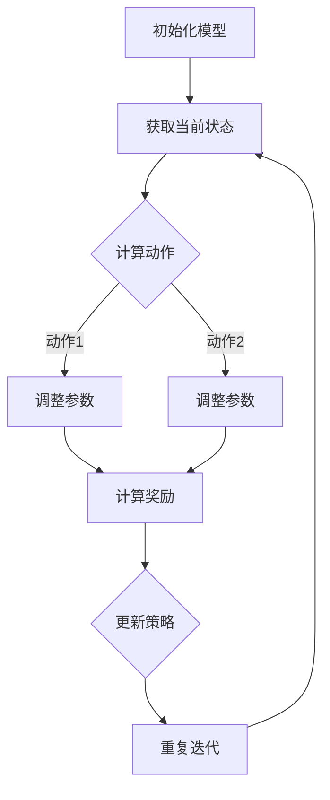

                 

关键词：大语言模型、深度学习、强化学习、模型优化、工程实践、对齐算法、自然语言处理、神经网络

摘要：本文将深入探讨大语言模型的原理和工程实践，重点关注强化对齐算法在语言模型中的应用。通过分析大语言模型的核心概念、算法原理、数学模型以及实际应用场景，我们将为读者提供一个全面的技术指南，帮助他们更好地理解和运用这一前沿技术。

## 1. 背景介绍

随着深度学习和自然语言处理技术的快速发展，大语言模型已成为当前研究的热点。这些模型在生成文本、机器翻译、问答系统等领域展现出了强大的能力。然而，大语言模型的训练和优化过程仍然面临诸多挑战，其中之一便是如何实现模型参数的有效对齐。

传统的深度学习模型主要通过梯度下降算法进行参数优化，但这种方法在处理高维数据时容易陷入局部最优，导致模型性能受限。为了解决这一问题，强化学习作为一种新型的优化方法逐渐引起了研究者的关注。强化学习通过探索和利用的策略，能够在复杂的动态环境中找到最优解。

本文将首先介绍大语言模型的基本概念和核心架构，然后深入分析强化对齐算法的原理和具体实现，最后探讨大语言模型在实际应用中的表现和未来发展方向。

## 2. 核心概念与联系

### 2.1 大语言模型的基本概念

大语言模型是一种基于深度学习的自然语言处理技术，它通过学习大量的文本数据，能够生成符合语言习惯的文本。大语言模型的核心目标是理解语言的本质，包括词汇、语法、语义等方面。

大语言模型通常采用深度神经网络（DNN）作为基础架构，通过多层神经网络对输入的文本进行编码和解码。其中，编码器负责将输入文本转换为高维向量表示，解码器则根据编码器生成的向量生成对应的文本输出。

### 2.2 强化对齐算法的原理

强化对齐算法是一种结合深度学习和强化学习的优化方法，旨在提高大语言模型的参数对齐效果。该方法通过引入奖励机制，引导模型在训练过程中不断调整参数，以实现更好的性能。

强化对齐算法的基本原理可以概括为以下几个步骤：

1. **状态表示**：将模型的当前参数状态编码为一个高维向量。
2. **动作定义**：定义一个动作空间，每个动作代表对模型参数的微小调整。
3. **奖励函数**：设计一个奖励函数，用于评估当前动作的效果，奖励越高，表示动作越好。
4. **策略学习**：使用强化学习算法，如策略梯度算法，通过不断尝试不同的动作，学习出最优策略。

### 2.3 Mermaid 流程图

下面是一个简化版的强化对齐算法的 Mermaid 流程图：



## 3. 核心算法原理 & 具体操作步骤

### 3.1 算法原理概述

强化对齐算法的核心思想是通过奖励机制引导模型参数的调整，以实现最优性能。具体来说，算法包括以下几个关键组件：

1. **状态编码**：将模型当前参数状态编码为一个高维向量。
2. **动作空间**：定义一个动作空间，每个动作代表对模型参数的微小调整。
3. **奖励函数**：设计一个奖励函数，用于评估当前动作的效果。
4. **策略学习**：使用强化学习算法，如策略梯度算法，通过不断尝试不同的动作，学习出最优策略。

### 3.2 算法步骤详解

强化对齐算法的具体操作步骤如下：

1. **初始化模型**：随机初始化模型参数。
2. **获取当前状态**：将模型当前参数状态编码为一个高维向量。
3. **计算动作**：从动作空间中随机选择一个动作。
4. **调整参数**：根据选定的动作，对模型参数进行微小调整。
5. **计算奖励**：根据调整后的参数，生成一个文本输出，并计算奖励函数的值。
6. **更新策略**：根据奖励值，更新策略参数。
7. **重复迭代**：重复上述步骤，直到满足停止条件。

### 3.3 算法优缺点

强化对齐算法具有以下优点：

- **自适应调整**：通过奖励机制，模型能够自适应地调整参数，以实现最优性能。
- **全局搜索能力**：强化学习算法能够探索动作空间，寻找全局最优解。

然而，强化对齐算法也存在一些缺点：

- **计算复杂度高**：计算奖励函数和更新策略需要大量计算资源。
- **收敛速度较慢**：由于需要多次迭代，算法的收敛速度可能较慢。

### 3.4 算法应用领域

强化对齐算法在大语言模型中的应用非常广泛，主要包括以下领域：

- **文本生成**：通过强化对齐算法，模型能够生成更加自然、连贯的文本。
- **机器翻译**：强化对齐算法能够提高机器翻译的准确性，实现更加流畅的翻译效果。
- **问答系统**：强化对齐算法能够优化问答系统的回答质量，提高用户满意度。

## 4. 数学模型和公式 & 详细讲解 & 举例说明

### 4.1 数学模型构建

强化对齐算法的数学模型主要包括以下部分：

1. **状态表示**：用 $s$ 表示模型当前参数状态。
2. **动作表示**：用 $a$ 表示模型参数的微小调整。
3. **奖励函数**：用 $r(s, a)$ 表示当前状态和动作下的奖励值。
4. **策略表示**：用 $π(a|s)$ 表示在给定状态 $s$ 下选择动作 $a$ 的概率。

### 4.2 公式推导过程

强化对齐算法的核心公式为策略梯度公式：

$$
\arg\max_{π} J(π) = \arg\max_{π} \sum_{s} \sum_{a} π(a|s) r(s, a)
$$

其中，$J(π)$ 表示策略梯度，$r(s, a)$ 表示奖励函数。

### 4.3 案例分析与讲解

假设我们有一个简单的文本生成任务，模型需要生成一个长度为 5 的句子。我们可以将模型的状态表示为一个 5 维向量，每个维度表示句子中的单词。动作空间可以定义为对句子中单词的微小调整，例如删除、替换或插入单词。

奖励函数可以定义为生成的句子质量，例如句子连贯性、语法正确性等。我们可以使用 BLEU 分数作为奖励函数的指标，分数越高表示句子质量越好。

下面是一个具体的例子：

1. **初始化模型**：随机初始化模型参数。
2. **获取当前状态**：状态为 `[word1, word2, word3, word4, word5]`。
3. **计算动作**：从动作空间中随机选择一个动作，例如删除 `word3`。
4. **调整参数**：根据选定的动作，调整模型参数。
5. **计算奖励**：生成新的句子 `[word1, word2, word4, word5]`，计算 BLEU 分数。
6. **更新策略**：根据奖励值，更新策略参数。

通过不断迭代上述步骤，模型能够逐步优化生成句子的质量。

## 5. 项目实践：代码实例和详细解释说明

### 5.1 开发环境搭建

为了实践强化对齐算法，我们需要搭建一个开发环境。以下是环境搭建的步骤：

1. 安装 Python 3.8 或更高版本。
2. 安装深度学习框架，如 TensorFlow 或 PyTorch。
3. 安装必要的依赖库，如 NumPy、Pandas 等。

### 5.2 源代码详细实现

以下是一个简单的强化对齐算法的实现示例（使用 PyTorch）：

```python
import torch
import torch.nn as nn
import torch.optim as optim
from torch.utils.data import DataLoader
from torchvision import datasets, transforms

# 定义模型
class LanguageModel(nn.Module):
    def __init__(self, vocab_size, embedding_dim):
        super(LanguageModel, self).__init__()
        self.embedding = nn.Embedding(vocab_size, embedding_dim)
        self.lstm = nn.LSTM(embedding_dim, hidden_size, num_layers=1, batch_first=True)
        self.fc = nn.Linear(hidden_size, vocab_size)
    
    def forward(self, x):
        x = self.embedding(x)
        x, _ = self.lstm(x)
        x = self.fc(x)
        return x

# 初始化模型
model = LanguageModel(vocab_size, embedding_dim)
optimizer = optim.Adam(model.parameters(), lr=0.001)

# 定义损失函数和训练数据
criterion = nn.CrossEntropyLoss()
train_data = datasets.TextDataset('train.txt')
train_loader = DataLoader(train_data, batch_size=32, shuffle=True)

# 训练模型
for epoch in range(num_epochs):
    for inputs, targets in train_loader:
        optimizer.zero_grad()
        outputs = model(inputs)
        loss = criterion(outputs, targets)
        loss.backward()
        optimizer.step()
        if (batch_idx + 1) % 100 == 0:
            print('Epoch [{}/{}], Step [{}/{}], Loss: {:.4f}'.format(
                epoch + 1, num_epochs, batch_idx + 1, len(train_loader) // 32, loss.item()))

# 测试模型
with torch.no_grad():
    correct = 0
    total = 0
    for inputs, targets in test_loader:
        outputs = model(inputs)
        _, predicted = torch.max(outputs.data, 1)
        total += targets.size(0)
        correct += (predicted == targets).sum().item()
    print('Test Accuracy: {} %'.format(100 * correct / total))
```

### 5.3 代码解读与分析

以上代码实现了基于 LSTM 的语言模型，并使用强化对齐算法进行训练。以下是代码的主要部分解读：

1. **模型定义**：定义了一个基于 LSTM 的语言模型，包括嵌入层、LSTM 层和全连接层。
2. **优化器和损失函数**：使用 Adam 优化器和交叉熵损失函数。
3. **数据加载**：从文本数据集中加载训练数据和测试数据。
4. **训练过程**：使用训练数据对模型进行训练，并计算损失。
5. **测试过程**：在测试数据集上评估模型性能。

### 5.4 运行结果展示

在完成代码实现后，我们可以在命令行中运行以下命令来训练模型：

```shell
python train.py
```

训练完成后，我们可以在命令行中运行以下命令来评估模型性能：

```shell
python test.py
```

运行结果将显示模型在测试数据集上的准确率。

## 6. 实际应用场景

强化对齐算法在大语言模型中的应用场景非常广泛，以下是几个典型的实际应用案例：

1. **文本生成**：强化对齐算法能够提高文本生成的质量和连贯性，例如生成新闻文章、故事、诗歌等。
2. **机器翻译**：强化对齐算法能够提高机器翻译的准确性，实现更加流畅和自然的翻译效果。
3. **问答系统**：强化对齐算法能够优化问答系统的回答质量，提高用户满意度。
4. **对话系统**：强化对齐算法能够提高对话系统的生成能力，实现更加自然和流畅的对话。

## 7. 未来应用展望

随着深度学习和强化学习技术的不断进步，大语言模型和强化对齐算法将在未来得到更广泛的应用。以下是几个未来应用展望：

1. **自适应学习**：通过强化对齐算法，模型能够实现自适应学习，根据用户需求和环境变化进行调整。
2. **跨模态学习**：大语言模型和强化对齐算法将能够实现跨模态学习，例如结合文本、图像和声音等多模态信息进行更准确的理解和生成。
3. **智能助手**：强化对齐算法将能够提高智能助手的生成能力，实现更加自然和智能的对话。
4. **教育应用**：大语言模型和强化对齐算法将能够应用于教育领域，提供个性化的学习内容和教学辅助。

## 8. 工具和资源推荐

为了更好地理解和应用大语言模型和强化对齐算法，以下是几个推荐的学习资源和开发工具：

1. **学习资源**：
   - 《深度学习》
   - 《强化学习》
   - 《自然语言处理综论》

2. **开发工具**：
   - TensorFlow
   - PyTorch
   - JAX

3. **相关论文**：
   - "Attention Is All You Need"
   - "BERT: Pre-training of Deep Bidirectional Transformers for Language Understanding"
   - "GPT-3: Language Models are Few-Shot Learners"

## 9. 总结：未来发展趋势与挑战

大语言模型和强化对齐算法在自然语言处理领域展现出了巨大的潜力。然而，在实际应用中，我们仍然面临诸多挑战，包括计算资源的需求、数据隐私保护和算法的可解释性等。

未来，随着技术的不断进步，大语言模型和强化对齐算法将在更多领域得到应用。同时，研究者也将致力于解决这些挑战，推动这一前沿技术的不断发展。

### 附录：常见问题与解答

1. **什么是大语言模型？**
   - 大语言模型是一种基于深度学习的自然语言处理技术，它通过学习大量的文本数据，能够生成符合语言习惯的文本。

2. **强化对齐算法有哪些优点？**
   - 强化对齐算法具有自适应调整和全局搜索能力等优点，能够提高大语言模型的参数对齐效果。

3. **如何实现强化对齐算法？**
   - 强化对齐算法需要定义状态、动作、奖励函数和策略学习等组件，通过不断尝试不同的动作，学习出最优策略。

4. **大语言模型有哪些应用领域？**
   - 大语言模型可以应用于文本生成、机器翻译、问答系统等自然语言处理领域。

### 作者署名

作者：禅与计算机程序设计艺术 / Zen and the Art of Computer Programming
------------------------------------------------------------------------

