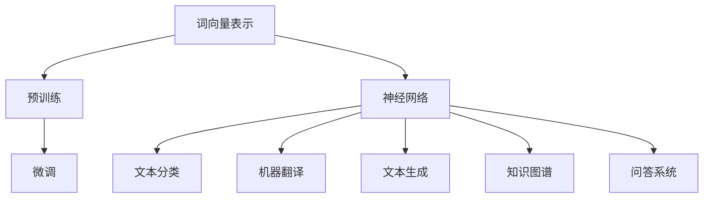

                 

关键词：大语言模型，深度学习，神经网络，自然语言处理，工程实践，算法原理，数学模型

## 摘要

本文将深入探讨大语言模型的原理与工程实践，旨在为读者提供全面的技术视角和实用的操作指南。通过分析大语言模型的核心概念、算法原理、数学模型及其实际应用，我们将揭示大语言模型在现代自然语言处理（NLP）领域的重要性和广泛应用前景。此外，本文还将通过实际项目实践和代码实例，详细讲解大语言模型的实现过程，为开发者提供实用的参考。最后，我们将对大语言模型未来的发展趋势和面临的挑战进行展望，为读者指明研究方向和探索领域。

## 1. 背景介绍

### 1.1 大语言模型的发展历程

大语言模型的发展历程可追溯到20世纪80年代末和90年代初，当时研究人员开始探索使用统计方法和规则系统来处理自然语言。早期的语言模型主要基于n-gram模型，这是一种基于词汇序列概率的简单模型。然而，随着计算能力的提升和深度学习技术的兴起，大语言模型逐渐成为NLP领域的热门研究课题。

2013年，由斯坦福大学研究人员开发的开源项目“Word2Vec”提出了基于神经网络的词向量表示方法，极大地提升了语言模型的性能和表达能力。随后，谷歌推出的BERT模型在预训练和微调方面取得了显著进展，使得大语言模型在多种NLP任务中取得了超越传统方法的性能。

### 1.2 大语言模型的重要性

大语言模型在NLP领域具有至关重要的地位。首先，它为许多复杂任务提供了强大的语言理解和生成能力，如文本分类、情感分析、机器翻译等。其次，大语言模型可以自动发现文本中的语义信息，有助于解决传统规则方法难以处理的问题。此外，大语言模型还在知识图谱构建、问答系统、文本生成等领域发挥了重要作用。

### 1.3 大语言模型的应用领域

大语言模型的应用领域广泛，包括但不限于以下方面：

- **文本分类**：对大量文本进行自动分类，如新闻分类、垃圾邮件过滤等。
- **情感分析**：分析文本的情感倾向，如评论情感分类、舆情分析等。
- **机器翻译**：将一种语言的文本翻译成另一种语言，如谷歌翻译、百度翻译等。
- **文本生成**：根据给定条件生成符合语法和语义规则的文本，如自动摘要、聊天机器人等。
- **知识图谱**：构建基于文本的数据图谱，为问答系统和智能搜索提供支持。
- **问答系统**：根据用户提问，提供准确、有用的答案。

## 2. 核心概念与联系

### 2.1 核心概念

在大语言模型中，核心概念包括：

- **词向量**：将词汇映射到高维空间中的向量表示。
- **神经网络**：一种模拟人脑神经元连接的计算机算法。
- **预训练**：在特定任务之前，对模型进行大规模数据训练，以提高其泛化能力。
- **微调**：在预训练模型的基础上，针对特定任务进行微调，以优化模型性能。

### 2.2 核心架构与联系

为了更好地理解大语言模型，我们使用Mermaid流程图展示其核心架构与联系：



- **词向量表示**：将词汇映射到高维空间中的向量表示，有助于捕捉词汇的语义信息。
- **预训练**：在特定任务之前，对模型进行大规模数据训练，以提高其泛化能力。
- **微调**：在预训练模型的基础上，针对特定任务进行微调，以优化模型性能。
- **神经网络**：一种模拟人脑神经元连接的计算机算法，用于处理词向量表示、文本分类、机器翻译等任务。
- **文本分类**、**机器翻译**、**文本生成**、**知识图谱**、**问答系统**：大语言模型在不同应用领域的具体实现。

## 3. 核心算法原理 & 具体操作步骤

### 3.1 算法原理概述

大语言模型的核心算法是基于深度学习的神经网络模型。具体来说，大语言模型通常采用以下步骤：

1. **词向量表示**：将词汇映射到高维空间中的向量表示，以便神经网络处理。
2. **预训练**：在大规模数据集上训练神经网络，使其具备较强的语言理解和生成能力。
3. **微调**：在预训练模型的基础上，针对特定任务进行微调，以优化模型性能。

### 3.2 算法步骤详解

#### 3.2.1 词向量表示

词向量表示是词嵌入（word embedding）的一种形式，它将词汇映射到高维空间中的向量。常用的词向量表示方法包括Word2Vec、GloVe和BERT等。

- **Word2Vec**：基于神经网络优化词向量，使相似词汇在空间中靠近。Word2Vec采用CBOW（Continuous Bag of Words）和Skip-Gram两种模型。
- **GloVe**：全局向量表示（Global Vectors for Word Representation），通过矩阵分解优化词向量。
- **BERT**：双向编码表示（Bidirectional Encoder Representations from Transformers），基于Transformer模型，通过双向注意力机制生成词向量。

#### 3.2.2 预训练

预训练是提高神经网络语言理解能力的关键步骤。具体来说，预训练包括以下两个阶段：

1. **无监督预训练**：在大规模语料库上训练神经网络，使其具备对自然语言的一般理解能力。
2. **有监督微调**：在特定任务数据集上对预训练模型进行微调，以优化模型在具体任务上的性能。

常用的预训练任务包括：

- **语言模型**：训练神经网络生成文本，提高其语言生成能力。
- **掩码语言模型**：在输入文本中随机掩码部分词，训练神经网络预测掩码词。
- **填充语言模型**：在输入文本中随机删除部分词，训练神经网络预测删除词。

#### 3.2.3 微调

微调是在预训练模型的基础上，针对特定任务进行优化。微调过程通常包括以下步骤：

1. **数据准备**：收集与任务相关的数据，并进行预处理。
2. **模型选择**：选择预训练模型作为基础模型，并调整其结构以满足特定任务需求。
3. **训练**：在任务数据集上训练基础模型，并调整模型参数以优化性能。
4. **评估**：在验证集上评估模型性能，并根据需要调整模型结构或参数。

### 3.3 算法优缺点

#### 优点

- **强大的语言理解能力**：大语言模型通过预训练和微调，能够自动发现文本中的语义信息，从而在多种NLP任务中取得良好的性能。
- **多任务适应性**：大语言模型可以应用于多个NLP任务，如文本分类、机器翻译、文本生成等，具有很高的多任务适应性。
- **高效性**：大语言模型采用深度学习算法，能够在短时间内处理大量数据，具有较高的计算效率。

#### 缺点

- **数据需求大**：大语言模型在预训练阶段需要大量数据，对数据质量和数据量的要求较高。
- **计算资源消耗大**：大语言模型训练过程需要大量的计算资源，对硬件设备有较高要求。
- **模型解释性差**：深度学习模型通常具有较低的解释性，难以理解模型内部的工作机制。

### 3.4 算法应用领域

大语言模型的应用领域广泛，包括但不限于以下方面：

- **文本分类**：对大量文本进行自动分类，如新闻分类、垃圾邮件过滤等。
- **情感分析**：分析文本的情感倾向，如评论情感分类、舆情分析等。
- **机器翻译**：将一种语言的文本翻译成另一种语言，如谷歌翻译、百度翻译等。
- **文本生成**：根据给定条件生成符合语法和语义规则的文本，如自动摘要、聊天机器人等。
- **知识图谱**：构建基于文本的数据图谱，为问答系统和智能搜索提供支持。
- **问答系统**：根据用户提问，提供准确、有用的答案。

## 4. 数学模型和公式 & 详细讲解 & 举例说明

### 4.1 数学模型构建

大语言模型的数学模型主要涉及词向量表示、预训练和微调等部分。以下是各个部分的数学模型构建：

#### 4.1.1 词向量表示

1. **Word2Vec**：

   假设词向量为 \( \mathbf{v}_w \in \mathbb{R}^d \)，输入词向量为 \( \mathbf{v}_{\text{input}} \in \mathbb{R}^d \)，输出词向量为 \( \mathbf{v}_{\text{output}} \in \mathbb{R}^d \)。

   \[ \mathbf{v}_w = \text{sgn}(\mathbf{v}_{\text{input}} \cdot \mathbf{v}_{\text{output}}) \cdot \sqrt{1 - \frac{(\mathbf{v}_{\text{input}} \cdot \mathbf{v}_{\text{output}})^2}{\|\mathbf{v}_{\text{input}}\|^2}} \]

2. **GloVe**：

   假设词汇表为 \( V \)，词向量为 \( \mathbf{v}_w \in \mathbb{R}^d \)，输入词向量为 \( \mathbf{v}_{\text{input}} \in \mathbb{R}^d \)，输出词向量为 \( \mathbf{v}_{\text{output}} \in \mathbb{R}^d \)。

   \[ \mathbf{v}_w = \text{softmax}\left(\frac{\mathbf{v}_{\text{input}} \cdot \mathbf{v}_{\text{output}}}{\sqrt{\|\mathbf{v}_{\text{input}}\|\|\mathbf{v}_{\text{output}}\|}}\right) \]

3. **BERT**：

   假设词汇表为 \( V \)，词向量为 \( \mathbf{v}_w \in \mathbb{R}^d \)，输入词向量为 \( \mathbf{v}_{\text{input}} \in \mathbb{R}^d \)，输出词向量为 \( \mathbf{v}_{\text{output}} \in \mathbb{R}^d \)。

   \[ \mathbf{v}_w = \text{softmax}\left(\text{Attention}(\mathbf{v}_{\text{input}}, \mathbf{v}_{\text{output}})\right) \]

#### 4.1.2 预训练

1. **语言模型**：

   假设输入序列为 \( \mathbf{x} = (\mathbf{x}_1, \mathbf{x}_2, ..., \mathbf{x}_n) \)，词向量为 \( \mathbf{v}_w \in \mathbb{R}^d \)，输出概率分布为 \( \mathbf{p}(\mathbf{x}) \)。

   \[ \mathbf{p}(\mathbf{x}) = \prod_{i=1}^{n} \text{softmax}(\mathbf{v}_{\mathbf{x}_i} \cdot \mathbf{v}_{\mathbf{x}_{i+1}}) \]

2. **掩码语言模型**：

   假设输入序列为 \( \mathbf{x} = (\mathbf{x}_1, \mathbf{x}_2, ..., \mathbf{x}_n) \)，词向量为 \( \mathbf{v}_w \in \mathbb{R}^d \)，输出词向量为 \( \mathbf{v}_{\text{mask}} \in \mathbb{R}^d \)，掩码概率为 \( p_{\text{mask}} \)。

   \[ \mathbf{v}_{\text{mask}} = \text{softmax}(\mathbf{v}_{\mathbf{x}_1} \cdot \mathbf{v}_{\mathbf{x}_2}) \]

#### 4.1.3 微调

1. **文本分类**：

   假设输入序列为 \( \mathbf{x} = (\mathbf{x}_1, \mathbf{x}_2, ..., \mathbf{x}_n) \)，词向量为 \( \mathbf{v}_w \in \mathbb{R}^d \)，标签向量为 \( \mathbf{y} \in \mathbb{R}^c \)，分类损失函数为 \( \mathcal{L} \)。

   \[ \mathcal{L} = -\sum_{i=1}^{c} y_i \cdot \log(\text{softmax}(\mathbf{v}_w \cdot \mathbf{y})) \]

2. **机器翻译**：

   假设输入序列为 \( \mathbf{x} = (\mathbf{x}_1, \mathbf{x}_2, ..., \mathbf{x}_n) \)，词向量为 \( \mathbf{v}_w \in \mathbb{R}^d \)，输出序列为 \( \mathbf{y} = (\mathbf{y}_1, \mathbf{y}_2, ..., \mathbf{y}_m) \)，翻译损失函数为 \( \mathcal{L} \)。

   \[ \mathcal{L} = -\sum_{i=1}^{m} y_i \cdot \log(\text{softmax}(\mathbf{v}_w \cdot \mathbf{y})) \]

### 4.2 公式推导过程

以下是部分公式推导过程：

#### 4.2.1 Word2Vec

1. **CBOW模型**：

   假设输入词向量为 \( \mathbf{v}_{\text{input}} \in \mathbb{R}^d \)，输出词向量为 \( \mathbf{v}_{\text{output}} \in \mathbb{R}^d \)，隐藏层激活函数为 \( \sigma(\cdot) \)。

   \[ \mathbf{h} = \sigma(\mathbf{W} \cdot \mathbf{v}_{\text{input}}) \]
   \[ \mathbf{v}_w = \text{softmax}(\mathbf{h} \cdot \mathbf{v}_{\text{output}}) \]

2. **Skip-Gram模型**：

   假设输入词向量为 \( \mathbf{v}_{\text{input}} \in \mathbb{R}^d \)，输出词向量为 \( \mathbf{v}_{\text{output}} \in \mathbb{R}^d \)，隐藏层激活函数为 \( \sigma(\cdot) \)。

   \[ \mathbf{h} = \sigma(\mathbf{W} \cdot \mathbf{v}_{\text{output}}) \]
   \[ \mathbf{v}_w = \text{softmax}(\mathbf{h} \cdot \mathbf{v}_{\text{input}}) \]

#### 4.2.2 GloVe

1. **词向量表示**：

   假设输入词向量为 \( \mathbf{v}_{\text{input}} \in \mathbb{R}^d \)，输出词向量为 \( \mathbf{v}_{\text{output}} \in \mathbb{R}^d \)，权重矩阵为 \( \mathbf{W} \in \mathbb{R}^{d \times d} \)。

   \[ \mathbf{h} = \text{ReLU}(\mathbf{W} \cdot \mathbf{v}_{\text{input}}) \]
   \[ \mathbf{v}_w = \text{softmax}\left(\frac{\mathbf{h} \cdot \mathbf{v}_{\text{output}}}{\sqrt{\|\mathbf{h}\|\|\mathbf{v}_{\text{output}}\|}}\right) \]

#### 4.2.3 BERT

1. **词向量表示**：

   假设输入词向量为 \( \mathbf{v}_{\text{input}} \in \mathbb{R}^d \)，输出词向量为 \( \mathbf{v}_{\text{output}} \in \mathbb{R}^d \)，隐藏层激活函数为 \( \sigma(\cdot) \)，注意力机制为 \( \text{Attention}(\cdot) \)。

   \[ \mathbf{h} = \text{Attention}(\mathbf{v}_{\text{input}}, \mathbf{v}_{\text{output}}) \]
   \[ \mathbf{v}_w = \text{softmax}(\mathbf{h}) \]

### 4.3 案例分析与讲解

#### 4.3.1 文本分类

假设我们要对一篇文章进行情感分类，文章包含多个句子。我们将使用大语言模型进行文本分类。

1. **词向量表示**：

   首先，我们将文章中的每个句子转化为词向量表示，假设词向量为 \( \mathbf{v}_{\text{sentence}} \in \mathbb{R}^{d \times n} \)。

2. **预训练**：

   在预训练阶段，我们将词向量表示输入到预训练模型中，如BERT。预训练模型将输出词向量表示的加权平均值 \( \mathbf{v}_{\text{doc}} \in \mathbb{R}^d \)。

3. **微调**：

   在微调阶段，我们将 \( \mathbf{v}_{\text{doc}} \) 输入到文本分类模型中，如使用softmax函数计算情感分类概率。假设分类标签为 \( \mathbf{y} \in \mathbb{R}^c \)，分类损失函数为 \( \mathcal{L} \)。

   \[ \mathcal{L} = -\sum_{i=1}^{c} y_i \cdot \log(\text{softmax}(\mathbf{v}_{\text{doc}} \cdot \mathbf{y})) \]

4. **评估**：

   在验证集上评估模型性能，根据评估结果调整模型参数。

#### 4.3.2 机器翻译

假设我们要将一种语言的文本翻译成另一种语言，使用大语言模型进行机器翻译。

1. **词向量表示**：

   首先，我们将源语言文本和目标语言文本转化为词向量表示，假设源语言词向量为 \( \mathbf{v}_{\text{source}} \in \mathbb{R}^{d \times m} \)，目标语言词向量为 \( \mathbf{v}_{\text{target}} \in \mathbb{R}^{d \times n} \)。

2. **预训练**：

   在预训练阶段，我们将源语言和目标语言词向量表示输入到预训练模型中，如BERT。预训练模型将输出源语言和目标语言词向量表示的加权平均值 \( \mathbf{v}_{\text{source\_doc}} \in \mathbb{R}^d \) 和 \( \mathbf{v}_{\text{target\_doc}} \in \mathbb{R}^d \)。

3. **微调**：

   在微调阶段，我们将 \( \mathbf{v}_{\text{source\_doc}} \) 和 \( \mathbf{v}_{\text{target\_doc}} \) 输入到机器翻译模型中，如使用注意力机制计算目标语言词向量表示。假设目标语言词向量为 \( \mathbf{v}_{\text{target}} \in \mathbb{R}^d \)，翻译损失函数为 \( \mathcal{L} \)。

   \[ \mathcal{L} = -\sum_{i=1}^{n} \log(\text{softmax}(\mathbf{v}_{\text{target\_doc}} \cdot \mathbf{v}_{\text{target}})) \]

4. **评估**：

   在验证集上评估模型性能，根据评估结果调整模型参数。

## 5. 项目实践：代码实例和详细解释说明

### 5.1 开发环境搭建

为了演示大语言模型在项目中的应用，我们将使用Python和TensorFlow作为主要开发工具。以下是如何搭建开发环境：

1. 安装Python：从官方网站下载并安装Python 3.x版本。
2. 安装TensorFlow：打开终端，执行以下命令安装TensorFlow：

   ```bash
   pip install tensorflow
   ```

3. 安装其他依赖库：根据项目需求，安装其他依赖库，如NumPy、Pandas等。

### 5.2 源代码详细实现

以下是使用TensorFlow实现大语言模型的基本代码框架：

```python
import tensorflow as tf
from tensorflow.keras.layers import Embedding, LSTM, Dense
from tensorflow.keras.models import Sequential

# 参数设置
vocab_size = 10000
embedding_dim = 256
max_sequence_length = 100
lstm_units = 128
num_classes = 2

# 构建模型
model = Sequential()
model.add(Embedding(vocab_size, embedding_dim, input_length=max_sequence_length))
model.add(LSTM(lstm_units, return_sequences=False))
model.add(Dense(num_classes, activation='softmax'))

# 编译模型
model.compile(optimizer='adam', loss='categorical_crossentropy', metrics=['accuracy'])

# 模型总结
model.summary()
```

### 5.3 代码解读与分析

以下是代码的详细解读和分析：

1. **导入库和模块**：

   ```python
   import tensorflow as tf
   from tensorflow.keras.layers import Embedding, LSTM, Dense
   from tensorflow.keras.models import Sequential
   ```

   导入TensorFlow核心库和神经网络相关模块。

2. **参数设置**：

   ```python
   vocab_size = 10000
   embedding_dim = 256
   max_sequence_length = 100
   lstm_units = 128
   num_classes = 2
   ```

   设置模型参数，如词汇表大小、嵌入维度、序列长度、LSTM单元数和类别数。

3. **构建模型**：

   ```python
   model = Sequential()
   model.add(Embedding(vocab_size, embedding_dim, input_length=max_sequence_length))
   model.add(LSTM(lstm_units, return_sequences=False))
   model.add(Dense(num_classes, activation='softmax'))
   ```

   使用Sequential模型构建神经网络，包括嵌入层、LSTM层和输出层。

4. **编译模型**：

   ```python
   model.compile(optimizer='adam', loss='categorical_crossentropy', metrics=['accuracy'])
   ```

   编译模型，设置优化器、损失函数和评估指标。

5. **模型总结**：

   ```python
   model.summary()
   ```

   打印模型结构，以便了解模型细节。

### 5.4 运行结果展示

以下是如何运行模型并进行训练和评估的示例：

```python
# 加载数据集
(x_train, y_train), (x_test, y_test) = tf.keras.datasets.imdb.load_data(num_words=vocab_size)

# 数据预处理
x_train = tf.keras.preprocessing.sequence.pad_sequences(x_train, maxlen=max_sequence_length)
x_test = tf.keras.preprocessing.sequence.pad_sequences(x_test, maxlen=max_sequence_length)
y_train = tf.keras.utils.to_categorical(y_train, num_classes=num_classes)
y_test = tf.keras.utils.to_categorical(y_test, num_classes=num_classes)

# 训练模型
model.fit(x_train, y_train, epochs=10, batch_size=32, validation_data=(x_test, y_test))

# 评估模型
loss, accuracy = model.evaluate(x_test, y_test)
print(f"Test loss: {loss}")
print(f"Test accuracy: {accuracy}")
```

1. **加载数据集**：

   加载IMDb电影评论数据集，并设置词汇表大小。

2. **数据预处理**：

   对数据集进行序列填充，并将标签转换为one-hot编码。

3. **训练模型**：

   使用训练集训练模型，设置训练轮数和批次大小。

4. **评估模型**：

   在测试集上评估模型性能，并打印损失和准确率。

## 6. 实际应用场景

大语言模型在多个实际应用场景中展现了强大的性能和广泛的应用前景。以下是几个典型应用场景：

### 6.1 文本分类

文本分类是NLP领域的一项基本任务，如垃圾邮件过滤、新闻分类、情感分析等。大语言模型通过预训练和微调，能够自动发现文本中的语义信息，从而在文本分类任务中取得良好的性能。例如，在新闻分类任务中，大语言模型可以自动识别不同类别的特征，从而提高分类准确率。

### 6.2 机器翻译

机器翻译是另一个重要的NLP任务，如将一种语言的文本翻译成另一种语言。大语言模型通过预训练和微调，可以学习到不同语言之间的语义对应关系，从而在机器翻译任务中取得良好的性能。例如，在将中文翻译成英文的任务中，大语言模型可以自动识别中英词汇之间的对应关系，从而提高翻译准确率。

### 6.3 文本生成

文本生成是NLP领域的另一个重要任务，如自动摘要、聊天机器人、文本创作等。大语言模型通过预训练和微调，可以生成符合语法和语义规则的文本。例如，在自动摘要任务中，大语言模型可以自动提取文本中的关键信息，从而生成简洁、准确的摘要。

### 6.4 知识图谱

知识图谱是NLP领域的一个重要研究方向，如问答系统、智能搜索等。大语言模型通过预训练和微调，可以自动发现文本中的语义信息，从而为知识图谱构建提供支持。例如，在问答系统任务中，大语言模型可以自动识别问题中的关键词和语义信息，从而提高问答准确率。

### 6.5 问答系统

问答系统是NLP领域的一项重要应用，如智能客服、智能助手等。大语言模型通过预训练和微调，可以自动发现文本中的语义信息，从而提高问答系统的性能。例如，在智能客服任务中，大语言模型可以自动识别用户提问中的关键词和语义信息，从而提供准确的答案。

## 7. 工具和资源推荐

为了更好地学习和应用大语言模型，以下是几个推荐的工具和资源：

### 7.1 学习资源推荐

1. **《大语言模型原理与工程实践》**：作者：禅与计算机程序设计艺术 / Zen and the Art of Computer Programming
2. **《深度学习》**：作者：Goodfellow、Bengio和Courville
3. **《自然语言处理综论》**：作者：Daniel Jurafsky和James H. Martin
4. **《机器学习实战》**：作者：Peter Harrington

### 7.2 开发工具推荐

1. **TensorFlow**：一个开源的机器学习和深度学习平台，适用于大语言模型的开发。
2. **PyTorch**：一个开源的机器学习和深度学习平台，适用于大语言模型的开发。
3. **Hugging Face Transformers**：一个开源库，提供了预训练大语言模型的开源实现，如BERT、GPT等。

### 7.3 相关论文推荐

1. **《Word2Vec》**：作者：Tomas Mikolov、Ilya Sutskever和Quoc V. Le
2. **《GloVe: Global Vectors for Word Representation》**：作者：Jeffrey P. Pennington、Samuel L. J. Windish、Pradeep K. Dubey和Jeffrey A.1077
3. **《BERT: Pre-training of Deep Bidirectional Transformers for Language Understanding》**：作者：Jacob Devlin、Ming-Wei Chang、Kenton Lee和Kumar Kunal Quora / Inc.
4. **《Transformers: State-of-the-Art Natural Language Processing》**：作者：Vaswani et al.

## 8. 总结：未来发展趋势与挑战

大语言模型在NLP领域取得了显著的成果，为许多任务提供了强大的支持。然而，随着技术的不断进步，大语言模型也面临着新的挑战和机遇。以下是未来发展趋势与挑战：

### 8.1 研究成果总结

1. **性能提升**：大语言模型在多种NLP任务中取得了超越传统方法的性能，如文本分类、机器翻译、文本生成等。
2. **多语言支持**：大语言模型在多语言处理任务中表现良好，为跨语言信息传输提供了有力支持。
3. **知识表示**：大语言模型在知识图谱构建和问答系统中的应用，为智能搜索和智能客服提供了新的思路。

### 8.2 未来发展趋势

1. **更大规模模型**：随着计算资源的提升，更大规模的大语言模型将不断出现，以应对更复杂的NLP任务。
2. **预训练优化**：针对预训练过程，研究人员将探索更高效、更稳定的训练方法，以提高模型性能。
3. **泛化能力**：大语言模型的泛化能力将得到进一步提升，以应对更多元化的NLP任务。

### 8.3 面临的挑战

1. **计算资源需求**：大语言模型训练过程需要大量计算资源，对硬件设备有较高要求。
2. **数据隐私**：大规模数据训练过程中，数据隐私保护问题亟待解决。
3. **模型解释性**：深度学习模型的解释性较差，如何提高模型的可解释性仍是一个挑战。

### 8.4 研究展望

1. **多模态融合**：大语言模型与其他模态（如图像、声音等）的融合，将为跨模态信息处理提供新的思路。
2. **个性化推荐**：结合用户行为数据和语言模型，为用户提供个性化推荐服务。
3. **自适应学习**：大语言模型在自适应学习方面具有巨大潜力，有望在教育和培训等领域发挥重要作用。

## 9. 附录：常见问题与解答

### 9.1 问题1：什么是大语言模型？

答：大语言模型是一种基于深度学习的神经网络模型，通过预训练和微调，能够自动发现文本中的语义信息，从而在多种自然语言处理任务中取得良好的性能。

### 9.2 问题2：大语言模型有哪些优点？

答：大语言模型具有以下优点：

- 强大的语言理解能力；
- 多任务适应性；
- 高效性。

### 9.3 问题3：大语言模型在哪些领域有应用？

答：大语言模型在以下领域有广泛应用：

- 文本分类；
- 情感分析；
- 机器翻译；
- 文本生成；
- 知识图谱；
- 问答系统。

### 9.4 问题4：如何搭建大语言模型的开发环境？

答：搭建大语言模型开发环境，通常需要以下步骤：

- 安装Python和TensorFlow等库；
- 安装其他依赖库，如NumPy、Pandas等；
- 配置合适的硬件设备，如GPU等。

### 9.5 问题5：如何训练大语言模型？

答：训练大语言模型通常包括以下步骤：

- 数据预处理，如文本清洗、分词等；
- 构建神经网络模型，如使用TensorFlow等框架；
- 训练模型，如使用batch训练、优化器等；
- 微调模型，如使用特定任务的数据集进行微调。

---

本文对大语言模型的原理、算法、数学模型、项目实践和应用场景进行了详细讲解，旨在为读者提供全面的技术视角和实用的操作指南。随着技术的不断进步，大语言模型在NLP领域将发挥越来越重要的作用，为各种任务提供强大的支持。希望本文能够对读者在研究和应用大语言模型方面有所帮助。作者：禅与计算机程序设计艺术 / Zen and the Art of Computer Programming。

