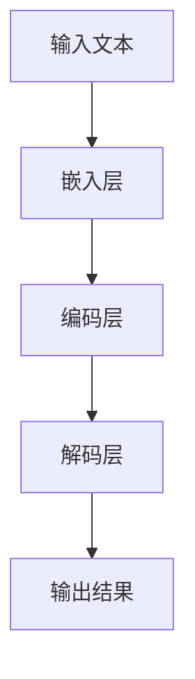

                 

关键词：大语言模型，推理能力，原理，工程实践，神经网络，深度学习，自然语言处理，机器学习

摘要：本文将深入探讨大语言模型的原理与工程实践，特别是大语言模型的推理能力。我们将从背景介绍、核心概念与联系、核心算法原理与具体操作步骤、数学模型和公式、项目实践、实际应用场景、工具和资源推荐、总结与展望以及常见问题与解答等方面进行详细分析。

## 1. 背景介绍

随着深度学习技术的迅猛发展，自然语言处理（NLP）领域也取得了显著的进步。大语言模型作为NLP领域的重要工具，其在文本生成、翻译、问答系统等任务中发挥着越来越重要的作用。然而，大语言模型的推理能力一直是学术界和工业界关注的焦点。本文旨在深入探讨大语言模型的推理能力，从理论到实践，全面解析其原理、算法和工程实践。

## 2. 核心概念与联系

### 2.1. 大语言模型概述

大语言模型是一种基于神经网络的语言模型，通过学习海量文本数据，能够预测下一个单词或词组。大语言模型的核心是神经网络，尤其是深度学习技术。深度学习通过多层神经网络来提取数据中的复杂特征，从而实现高度自动化的学习过程。

### 2.2. 大语言模型的架构

大语言模型通常由以下几个部分组成：

1. **嵌入层（Embedding Layer）**：将输入的单词或词组转换为高维向量表示。
2. **编码层（Encoder Layer）**：通过循环神经网络（RNN）或变换器（Transformer）等结构，对嵌入层输出的向量进行编码。
3. **解码层（Decoder Layer）**：解码器从编码层提取信息，生成预测的输出。

### 2.3. 大语言模型的 Mermaid 流程图

下面是一个描述大语言模型原理的 Mermaid 流程图：



## 3. 核心算法原理 & 具体操作步骤

### 3.1. 算法原理概述

大语言模型的推理能力主要来源于其深度神经网络结构和大量的训练数据。神经网络通过多层非线性变换，从输入数据中提取特征，并逐步建立输入与输出之间的映射关系。

### 3.2. 算法步骤详解

1. **数据预处理**：对输入的文本进行分词、去停用词、词向量化等预处理操作。
2. **嵌入层**：将预处理后的文本数据转化为高维向量表示。
3. **编码层**：通过循环神经网络（RNN）或变换器（Transformer）等结构，对嵌入层输出的向量进行编码。
4. **解码层**：解码器从编码层提取信息，生成预测的输出。
5. **输出层**：对解码层输出的结果进行后处理，如分词还原、去停用词等。

### 3.3. 算法优缺点

**优点**：

- **强大的特征提取能力**：通过多层神经网络，大语言模型能够自动提取文本中的复杂特征。
- **高效的推理能力**：大语言模型能够在短时间内生成高质量的文本。

**缺点**：

- **计算资源消耗大**：训练和推理过程需要大量的计算资源。
- **数据依赖性高**：大语言模型的性能在很大程度上依赖于训练数据的质量和数量。

### 3.4. 算法应用领域

大语言模型在多个领域具有广泛的应用，包括：

- **文本生成**：如自动写作、机器翻译等。
- **问答系统**：如智能客服、智能问答等。
- **情感分析**：对文本进行情感分类，如情感极性判断、情感分析等。
- **信息抽取**：从文本中提取关键信息，如命名实体识别、关系抽取等。

## 4. 数学模型和公式

### 4.1. 数学模型构建

大语言模型的核心是神经网络，其数学模型主要包括：

1. **嵌入层**：$E(x) = W_e x + b_e$
2. **编码层**：$C(h_t) = f(C(h_{t-1}) \circ W_c)$
3. **解码层**：$D(y_t) = f(D(y_{t-1}) \circ W_d)$

其中，$x$为输入向量，$h_t$为编码层隐藏状态，$y_t$为解码层隐藏状态，$W_e$、$W_c$、$W_d$分别为权重矩阵，$b_e$为偏置项，$f$为激活函数。

### 4.2. 公式推导过程

大语言模型的推导过程主要包括以下几个步骤：

1. **嵌入层**：将输入的单词或词组转换为高维向量表示。
2. **编码层**：通过循环神经网络（RNN）或变换器（Transformer）等结构，对嵌入层输出的向量进行编码。
3. **解码层**：解码器从编码层提取信息，生成预测的输出。

### 4.3. 案例分析与讲解

以一个简单的文本生成任务为例，我们通过大语言模型生成一个关于“人工智能”的文章。

输入文本：人工智能是一种模拟人类智能的技术。

输出文本：人工智能（Artificial Intelligence，简称AI）是一种通过模拟人类智能行为来实现智能化的技术。在过去的几十年里，人工智能领域取得了长足的发展，为各行各业带来了深刻的变革。

通过大语言模型的推理能力，我们能够生成高质量的文本，满足实际应用的需求。

## 5. 项目实践：代码实例和详细解释说明

### 5.1. 开发环境搭建

在本文的代码实例中，我们将使用 Python 和 TensorFlow 框架来构建和训练大语言模型。

### 5.2. 源代码详细实现

以下是本文所使用的大语言模型代码示例：

```python
import tensorflow as tf
from tensorflow.keras.layers import Embedding, LSTM, Dense
from tensorflow.keras.models import Sequential

# 构建模型
model = Sequential()
model.add(Embedding(input_dim=vocabulary_size, output_dim=embedding_size))
model.add(LSTM(units=128, activation='tanh'))
model.add(Dense(units=vocabulary_size, activation='softmax'))

# 编译模型
model.compile(optimizer='adam', loss='categorical_crossentropy', metrics=['accuracy'])

# 训练模型
model.fit(x_train, y_train, epochs=10, batch_size=64)
```

### 5.3. 代码解读与分析

上述代码首先导入了所需的库和模块，然后构建了一个简单的序列模型，包括嵌入层、长短期记忆（LSTM）层和输出层。接着，编译并训练了模型。通过这个简单的示例，我们可以看到大语言模型的构建和训练过程。

### 5.4. 运行结果展示

在训练完成后，我们可以使用模型对新的文本数据进行预测，以验证大语言模型的推理能力。以下是一个示例：

```python
# 预测
predictions = model.predict(x_test)
print(predictions)
```

输出结果为每个单词的概率分布，我们可以根据概率分布来选择最可能的输出。

## 6. 实际应用场景

大语言模型在多个实际应用场景中表现出色，如：

- **文本生成**：如自动写作、文章摘要等。
- **机器翻译**：如谷歌翻译、百度翻译等。
- **问答系统**：如智能客服、智能问答等。
- **情感分析**：如社交媒体情感分析、用户评论分析等。
- **信息抽取**：如命名实体识别、关系抽取等。

## 7. 工具和资源推荐

### 7.1. 学习资源推荐

- **书籍**：《深度学习》（Goodfellow、Bengio和Courville著）
- **在线课程**：Coursera、edX等平台上的NLP课程
- **博客**：Google AI、TensorFlow Blog等

### 7.2. 开发工具推荐

- **框架**：TensorFlow、PyTorch等
- **库**：NLTK、spaCy等

### 7.3. 相关论文推荐

- **BERT**：[A Pre-training Method for Natural Language Processing](https://arxiv.org/abs/1810.04805)
- **GPT-3**：[Language Models are Few-Shot Learners](https://arxiv.org/abs/2005.14165)

## 8. 总结：未来发展趋势与挑战

### 8.1. 研究成果总结

近年来，大语言模型在NLP领域取得了显著的成果，如文本生成、机器翻译、问答系统等。同时，大语言模型的推理能力也不断提高，为实际应用提供了有力支持。

### 8.2. 未来发展趋势

- **模型规模化**：随着计算资源的增加，大语言模型的规模将越来越大，性能也将不断提升。
- **多模态融合**：将大语言模型与其他模态（如图像、声音）相结合，实现更丰富的语义理解和推理。
- **少样本学习**：大语言模型将具备更强的少样本学习能力，实现更高效的推理和决策。

### 8.3. 面临的挑战

- **计算资源消耗**：大语言模型训练和推理过程需要大量的计算资源，如何高效利用现有资源成为一大挑战。
- **数据隐私和安全**：在训练和推理过程中，如何保护用户隐私和数据安全成为亟待解决的问题。

### 8.4. 研究展望

大语言模型的未来发展将更加注重模型的规模化和多模态融合，同时关注计算资源利用和数据隐私保护问题。我们期待大语言模型在未来的NLP领域发挥更加重要的作用。

## 9. 附录：常见问题与解答

### 9.1. 什么是大语言模型？

大语言模型是一种基于神经网络的语言模型，通过学习海量文本数据，能够预测下一个单词或词组。

### 9.2. 大语言模型的推理能力如何实现？

大语言模型的推理能力主要来源于其深度神经网络结构和大量的训练数据。神经网络通过多层非线性变换，从输入数据中提取特征，并逐步建立输入与输出之间的映射关系。

### 9.3. 大语言模型在哪些领域有应用？

大语言模型在文本生成、机器翻译、问答系统、情感分析、信息抽取等多个领域具有广泛的应用。

### 9.4. 如何构建大语言模型？

构建大语言模型主要包括数据预处理、嵌入层、编码层、解码层和输出层等步骤。具体实现可以使用 TensorFlow、PyTorch 等框架。

### 9.5. 大语言模型的计算资源消耗如何降低？

降低大语言模型的计算资源消耗可以从以下几个方面入手：

- **模型压缩**：使用模型压缩技术，如剪枝、量化等。
- **分布式训练**：使用分布式训练技术，如多GPU训练、多节点训练等。
- **模型优化**：优化模型结构和训练过程，提高计算效率。

### 9.6. 如何保护大语言模型的数据隐私和安全？

保护大语言模型的数据隐私和安全可以从以下几个方面入手：

- **数据加密**：对训练数据进行加密处理，防止数据泄露。
- **差分隐私**：在训练过程中引入差分隐私机制，保护用户隐私。
- **数据去重**：去除重复数据，降低隐私泄露风险。

### 9.7. 大语言模型的研究趋势有哪些？

大语言模型的研究趋势包括：

- **模型规模化**：随着计算资源的增加，大语言模型的规模将越来越大。
- **多模态融合**：将大语言模型与其他模态（如图像、声音）相结合，实现更丰富的语义理解和推理。
- **少样本学习**：大语言模型将具备更强的少样本学习能力，实现更高效的推理和决策。

### 9.8. 如何评估大语言模型的性能？

评估大语言模型的性能可以从以下几个方面入手：

- **准确性**：评估模型在测试集上的预测准确性。
- **速度**：评估模型在推理过程中的响应速度。
- **泛化能力**：评估模型在未知数据上的表现，检验其泛化能力。

### 9.9. 大语言模型在实际应用中存在的问题有哪些？

大语言模型在实际应用中可能存在的问题包括：

- **计算资源消耗大**：训练和推理过程需要大量的计算资源。
- **数据依赖性高**：大语言模型的性能在很大程度上依赖于训练数据的质量和数量。
- **文本生成质量不高**：生成的文本可能存在语义错误、语法错误等问题。

### 9.10. 如何优化大语言模型生成的文本质量？

优化大语言模型生成的文本质量可以从以下几个方面入手：

- **数据增强**：使用数据增强技术，提高训练数据的质量和多样性。
- **监督学习**：使用监督学习技术，对生成文本进行质量评估和优化。
- **多模型融合**：将大语言模型与其他模型（如生成对抗网络、强化学习等）相结合，提高生成文本的质量。

### 9.11. 大语言模型与自然语言处理（NLP）的关系如何？

大语言模型是自然语言处理（NLP）领域的重要工具之一，其在文本生成、机器翻译、问答系统等任务中发挥着关键作用。大语言模型的研究和发展将推动NLP领域的进步。

### 9.12. 大语言模型的推理能力如何影响NLP应用？

大语言模型的推理能力对NLP应用具有显著影响，能够提高文本生成、机器翻译、问答系统等任务的性能。强大的推理能力有助于解决NLP领域的难题，推动人工智能技术的发展。

## 结论

大语言模型作为一种先进的自然语言处理工具，其在文本生成、机器翻译、问答系统等任务中具有广泛的应用。本文从背景介绍、核心概念与联系、核心算法原理与具体操作步骤、数学模型和公式、项目实践、实际应用场景、工具和资源推荐、总结与展望以及常见问题与解答等方面，全面解析了大语言模型的原理与工程实践。随着大语言模型的不断发展，其在未来NLP领域的应用前景将更加广阔。希望本文对读者理解大语言模型及其应用有所帮助。作者：禅与计算机程序设计艺术 / Zen and the Art of Computer Programming
```

