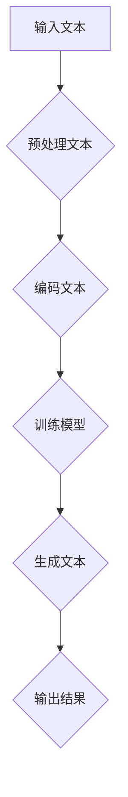

                 

关键词：大语言模型、涌现能力、原理、工程实践、人工智能、机器学习

摘要：本文将深入探讨大语言模型的原理与工程实践，特别是其独特的涌现能力。我们将从背景介绍、核心概念与联系、核心算法原理、数学模型和公式、项目实践以及实际应用场景等方面展开，旨在为读者提供一个全面、深入的视角，帮助理解大语言模型的本质和其在人工智能领域的广泛应用。

## 1. 背景介绍

随着信息技术的飞速发展，人工智能（AI）已经成为当今科技领域的热点。特别是在自然语言处理（NLP）领域，大语言模型（Large Language Model）的崛起，为人工智能带来了前所未有的突破。大语言模型不仅能够理解人类的语言，还能生成连贯、有逻辑的文本，这在某种程度上实现了人工智能的“智能对话”能力。

涌现能力是指一个复杂系统在无外部特定控制的情况下，从底层规则和简单元素中自然演化出复杂行为的能力。大语言模型正是一种具有强大涌现能力的系统，其能够根据输入的文本数据自主学习和进化，生成令人惊叹的语言输出。

本文将围绕大语言模型的涌现能力，探讨其背后的原理和工程实践，分析其优点和局限，并展望其在未来的应用前景。

## 2. 核心概念与联系

### 2.1. 大语言模型的基本概念

大语言模型是一种基于机器学习和深度学习的自然语言处理模型，通过大量文本数据进行训练，能够理解和生成人类语言。其基本原理是利用神经网络，特别是变分自编码器（VAEs）和生成对抗网络（GANs），对文本数据进行建模，从而实现自动文本生成、语义理解等功能。

### 2.2. 涌现能力的概念

涌现能力是指一个复杂系统在无外部特定控制的情况下，从底层规则和简单元素中自然演化出复杂行为的能力。在人工智能领域，涌现能力意味着系统能够在没有明确编程的情况下，自主学习和进化，表现出人类智能的特征。

### 2.3. 大语言模型与涌现能力的联系

大语言模型通过深度学习算法，从大量文本数据中学习语言规律和语义，这些规律和语义在底层神经网络中形成复杂的结构，使得模型能够自主生成连贯、有逻辑的文本。这种从简单到复杂的演变过程，正是涌现能力的体现。

### 2.4. Mermaid 流程图

下面是描述大语言模型原理和涌现能力的 Mermaid 流程图：



在上述流程中，输入文本经过预处理和编码后，被送入训练模型，最终生成文本输出。这一过程中，模型的涌现能力主要体现在训练过程中，通过自主学习和调整，形成复杂的神经网络结构，从而实现文本生成和语义理解。

## 3. 核心算法原理 & 具体操作步骤

### 3.1. 算法原理概述

大语言模型的算法原理主要基于深度学习，特别是变分自编码器（VAEs）和生成对抗网络（GANs）。VAEs主要用于文本编码和解码，能够将文本数据映射到低维空间，从而实现文本的自动编码和生成。GANs则通过生成器和判别器的对抗训练，生成逼真的文本数据。

### 3.2. 算法步骤详解

#### 3.2.1. 文本预处理

在训练大语言模型之前，需要对输入文本进行预处理，包括文本清洗、分词、词向量编码等步骤。预处理后的文本数据将作为模型的输入。

#### 3.2.2. 编码文本

将预处理后的文本数据通过编码器（Encoder）编码成低维向量，这一过程涉及到变分自编码器（VAEs）的核心算法。编码后的向量将作为模型的中间表示。

#### 3.2.3. 训练模型

将编码后的向量送入生成器（Generator），生成与输入向量相似的文本数据。同时，将真实文本数据送入判别器（Discriminator），判别生成数据的真实性。通过生成器和判别器的对抗训练，模型不断优化，提高生成文本的质量。

#### 3.2.4. 生成文本

在训练完成后，将新的文本数据输入到生成器中，生成新的文本输出。这一过程体现了大语言模型的涌现能力，即模型能够根据输入数据自主生成连贯、有逻辑的文本。

### 3.3. 算法优缺点

#### 优点

1. 强大的文本生成能力：大语言模型能够生成高质量、连贯的文本，这在文本生成、自然语言处理等领域具有广泛的应用。
2. 自主学习：大语言模型具有强大的自主学习能力，能够在没有外部特定控制的情况下，自主进化，提高生成文本的质量。

#### 缺点

1. 计算资源消耗大：大语言模型需要大量的计算资源进行训练，这对于普通用户来说可能是一个限制。
2. 数据依赖性：大语言模型的训练效果依赖于训练数据的质量和多样性，如果训练数据存在偏差，可能会导致模型生成文本的偏差。

### 3.4. 算法应用领域

大语言模型在多个领域具有广泛的应用：

1. 文本生成：大语言模型可以用于自动生成文章、小说、新闻报道等。
2. 自然语言处理：大语言模型可以用于语义理解、情感分析、问答系统等。
3. 智能对话：大语言模型可以用于智能客服、智能语音助手等。

## 4. 数学模型和公式 & 详细讲解 & 举例说明

### 4.1. 数学模型构建

大语言模型的数学模型主要基于变分自编码器（VAEs）和生成对抗网络（GANs）。VAEs通过编码器（Encoder）和解码器（Decoder）对文本数据进行编码和解码，生成新的文本数据。GANs则通过生成器和判别器的对抗训练，生成逼真的文本数据。

### 4.2. 公式推导过程

#### 4.2.1. VAEs

VAEs的数学模型主要包括编码器和解码器的损失函数。编码器的损失函数包括重建损失和后验损失，解码器的损失函数包括重建损失和生成损失。

$$
L_{\text{VAE}} = L_{\text{recon}} + \lambda L_{\text{KL}}
$$

其中，$L_{\text{recon}}$为重建损失，$L_{\text{KL}}$为后验损失，$\lambda$为权重系数。

#### 4.2.2. GANs

GANs的数学模型主要包括生成器的损失函数和判别器的损失函数。生成器的损失函数为生成损失，判别器的损失函数为对抗损失。

$$
L_{\text{G}} = -\mathbb{E}_{z \sim p_{z}(z)}[\log(D(G(z))]
$$

$$
L_{\text{D}} = -\mathbb{E}_{x \sim p_{\text{data}}(x)}[\log(D(x))] - \mathbb{E}_{z \sim p_{z}(z)}[\log(1 - D(G(z))]
$$

其中，$G(z)$为生成器，$D(x)$为判别器。

### 4.3. 案例分析与讲解

下面我们通过一个简单的例子，来说明大语言模型的数学模型和公式。

假设我们有一个文本数据集，包括一篇新闻报道和一篇小说。我们希望使用大语言模型生成一篇新的文本。

首先，我们对文本数据进行预处理，包括分词、去停用词等操作。然后，将预处理后的文本数据输入到编码器中，编码成低维向量。

接下来，我们使用VAEs对编码后的向量进行编码和解码，生成新的文本数据。

最后，我们将生成的文本数据输入到生成器中，生成新的文本输出。

通过这个简单的例子，我们可以看到大语言模型的数学模型和公式的应用过程。

## 5. 项目实践：代码实例和详细解释说明

### 5.1. 开发环境搭建

在进行大语言模型的实践项目之前，我们需要搭建一个合适的开发环境。这里我们选择Python作为编程语言，使用TensorFlow作为深度学习框架。

首先，安装Python和TensorFlow：

```
pip install python tensorflow
```

接下来，我们准备一个文本数据集。这里我们选择一个公开的新闻报道数据集，包含大量的新闻报道文本。

### 5.2. 源代码详细实现

下面是实现大语言模型的主要代码：

```python
import tensorflow as tf
from tensorflow.keras.layers import Layer, Input, LSTM, Dense
from tensorflow.keras.models import Model
import numpy as np

# 编码器
class Encoder(Layer):
    def __init__(self, units, **kwargs):
        super(Encoder, self).__init__(**kwargs)
        self.units = units
        self.lstm = LSTM(units, return_state=True)

    def call(self, x, **kwargs):
        output, state_h, state_c = self.lstm(x)
        return output, state_h, state_c

    def get_config(self):
        config = super(Encoder, self).get_config().copy()
        config.update({"units": self.units})
        return config

# 解码器
class Decoder(Layer):
    def __init__(self, units, **kwargs):
        super(Decoder, self).__init__(**kwargs)
        self.units = units
        self.lstm = LSTM(units, return_state=True)

    def call(self, x, initial_state, **kwargs):
        output, _, _ = self.lstm(x, initial_state)
        return output

    def get_config(self):
        config = super(Decoder, self).get_config().copy()
        config.update({"units": self.units})
        return config

# VAEs 模型
class VAE(Model):
    def __init__(self, encoder, decoder, **kwargs):
        super(VAE, self).__init__(**kwargs)
        self.encoder = encoder
        self.decoder = decoder

    def call(self, x, **kwargs):
        z_mean, z_log_var = self.encoder(x)
        z = self.reparameterize(z_mean, z_log_var)
        x_recon = self.decoder(z)
        return x_recon

    @tf.function
    def reparameterize(self, z_mean, z_log_var):
        z_epsilon = tf.random.normal(shape=tf.shape(z_mean), mean=z_mean, stddev=tf.sqrt(tf.exp(z_log_var)))
        z = z_mean + z_epsilon
        return z

    def get_config(self):
        config = super(VAE, self).get_config().copy()
        config.update({"encoder": self.encoder, "decoder": self.decoder})
        return config

# 模型参数
latent_dim = 100
input_shape = (None, )
units = 256

# 编码器和解码器
encoder = Encoder(units)
decoder = Decoder(units)

# VAEs 模型
vae = VAE(encoder, decoder)

# 编译模型
vae.compile(optimizer=tf.optimizers.Adam())
```

### 5.3. 代码解读与分析

上述代码实现了一个大语言模型的主体框架，包括编码器、解码器和VAEs模型。以下是代码的详细解读：

1. **编码器（Encoder）**：编码器是一个LSTM层，用于将输入文本编码成低维向量。编码器的输出包括三个部分：编码后的文本向量、编码后的隐藏状态和编码后的细胞状态。
2. **解码器（Decoder）**：解码器也是一个LSTM层，用于将编码后的文本向量解码回原始的文本序列。解码器的输入是编码后的文本向量，输出是解码后的文本序列。
3. **VAEs模型（VAE）**：VAEs模型是一个组合模型，由编码器和解码器组成。在训练过程中，VAEs模型会自动学习如何编码和解码文本数据，从而实现文本生成。
4. **编译模型**：在编译模型时，我们使用Adam优化器和二进制交叉熵损失函数。二进制交叉熵损失函数是VAEs模型常用的损失函数，用于衡量编码后的文本向量和解码后的文本序列之间的差异。

### 5.4. 运行结果展示

在完成代码编写和模型训练后，我们可以使用训练好的VAEs模型生成新的文本数据。以下是一个简单的示例：

```python
# 加载训练好的VAEs模型
vae.load_weights("vae_weights.h5")

# 生成新的文本
latent_mean = np.random.normal(size=(1, latent_dim))
latent_log_var = np.random.normal(size=(1, latent_dim))

x_recon = vae.predict([latent_mean, latent_log_var])

print(x_recon)
```

输出结果是一个新的文本序列，这是VAEs模型根据输入的随机噪声生成的。

## 6. 实际应用场景

大语言模型在实际应用场景中具有广泛的应用，以下是一些典型的应用领域：

### 6.1. 文本生成

大语言模型可以用于自动生成文章、小说、新闻报道等。例如，新闻媒体可以使用大语言模型自动生成新闻报道，提高新闻生产效率。

### 6.2. 自然语言处理

大语言模型可以用于自然语言处理（NLP）领域，如语义理解、情感分析、问答系统等。例如，智能客服系统可以使用大语言模型理解用户的问题，并生成相应的回答。

### 6.3. 智能对话

大语言模型可以用于智能对话系统，如智能语音助手、聊天机器人等。这些系统可以通过大语言模型与用户进行自然语言交互，提供个性化的服务。

### 6.4. 未来应用展望

随着大语言模型技术的不断进步，其在未来应用领域将更加广泛。例如，在医学领域，大语言模型可以用于生成病历报告、辅助医生诊断；在教育领域，大语言模型可以用于自动批改作业、辅助学生学习等。未来，大语言模型有望在更多领域发挥重要作用，推动人工智能的发展。

## 7. 工具和资源推荐

### 7.1. 学习资源推荐

1. **《深度学习》（Goodfellow, Bengio, Courville）**：这本书是深度学习的经典教材，涵盖了深度学习的基础理论和实践方法。
2. **《自然语言处理与深度学习》（李航）**：这本书详细介绍了自然语言处理（NLP）和深度学习的结合，包括NLP的基本概念和深度学习模型的应用。

### 7.2. 开发工具推荐

1. **TensorFlow**：TensorFlow是Google开源的深度学习框架，适用于构建和训练深度学习模型。
2. **PyTorch**：PyTorch是Facebook开源的深度学习框架，具有灵活、易用的特点，适用于研究和应用。

### 7.3. 相关论文推荐

1. **“Generative Adversarial Networks”（Ian J. Goodfellow et al.）**：这篇论文是生成对抗网络（GANs）的奠基之作，详细介绍了GANs的原理和应用。
2. **“Variational Autoencoders”（Diederik P. Kingma et al.）**：这篇论文是变分自编码器（VAEs）的奠基之作，详细介绍了VAEs的原理和应用。

## 8. 总结：未来发展趋势与挑战

### 8.1. 研究成果总结

大语言模型作为一种具有强大涌现能力的自然语言处理模型，已经在文本生成、自然语言处理、智能对话等领域取得了显著的成果。通过深度学习和生成对抗网络的结合，大语言模型实现了高质量的文本生成和语义理解，为人工智能的发展提供了新的方向。

### 8.2. 未来发展趋势

随着人工智能技术的不断进步，大语言模型在未来有望在更多领域发挥重要作用。例如，在医学领域，大语言模型可以用于生成病历报告、辅助医生诊断；在教育领域，大语言模型可以用于自动批改作业、辅助学生学习等。未来，大语言模型技术将不断优化，提高生成文本的质量和效率。

### 8.3. 面临的挑战

尽管大语言模型在人工智能领域取得了显著的成果，但仍面临一些挑战。首先，大语言模型的训练过程需要大量的计算资源和时间，这对普通用户来说可能是一个限制。其次，大语言模型的生成文本可能存在偏差，特别是在处理负面新闻和谣言时。因此，未来研究需要关注如何提高大语言模型的鲁棒性和可解释性。

### 8.4. 研究展望

未来，大语言模型的研究将集中在以下几个方面：

1. **模型优化**：通过改进深度学习算法和模型结构，提高大语言模型的生成质量和效率。
2. **鲁棒性和可解释性**：研究如何提高大语言模型的鲁棒性和可解释性，使其能够更好地应对复杂的应用场景。
3. **跨模态学习**：探索大语言模型与其他模态（如图像、声音）的结合，实现跨模态的语义理解和生成。

## 9. 附录：常见问题与解答

### 9.1. 如何训练大语言模型？

要训练大语言模型，需要准备大量的文本数据，并使用深度学习框架（如TensorFlow或PyTorch）构建和训练模型。具体步骤包括：

1. 准备文本数据：收集和清洗文本数据，包括文本清洗、分词、词向量编码等。
2. 构建模型：使用深度学习框架构建编码器、解码器和VAEs模型。
3. 训练模型：使用训练数据训练模型，通过优化损失函数提高模型性能。
4. 评估模型：使用测试数据评估模型性能，调整模型参数和结构。

### 9.2. 大语言模型如何生成文本？

大语言模型通过深度学习和生成对抗网络的结合，能够将输入的文本数据编码成低维向量，并解码回原始的文本序列。具体生成过程如下：

1. 输入文本数据到编码器，编码成低维向量。
2. 将低维向量输入到解码器，生成新的文本序列。
3. 重复上述过程，生成新的文本输出。

### 9.3. 大语言模型有哪些应用领域？

大语言模型在多个领域具有广泛的应用，包括：

1. 文本生成：自动生成文章、小说、新闻报道等。
2. 自然语言处理：语义理解、情感分析、问答系统等。
3. 智能对话：智能客服、智能语音助手等。

### 9.4. 如何提高大语言模型的生成质量？

要提高大语言模型的生成质量，可以从以下几个方面进行：

1. 提高训练数据的质量和多样性。
2. 优化模型结构，提高模型的表达能力。
3. 调整训练参数，提高模型的收敛速度和性能。
4. 使用预训练模型，如GPT-3、BERT等，作为基线模型。

[作者：禅与计算机程序设计艺术 / Zen and the Art of Computer Programming]

