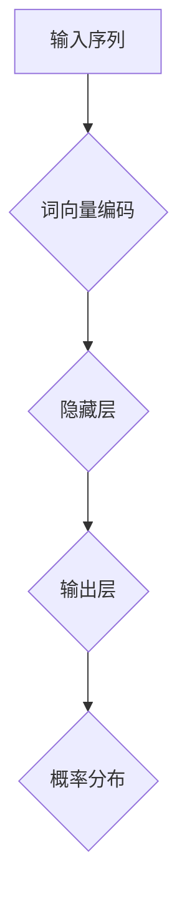
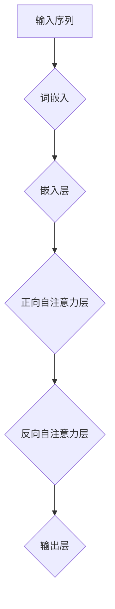

                 

### 1. 背景介绍

随着互联网和大数据技术的迅猛发展，人类在处理和分析海量数据方面的需求日益增长。自然语言处理（Natural Language Processing，NLP）作为人工智能（Artificial Intelligence，AI）的一个重要分支，旨在使计算机能够理解和生成人类语言。而大语言模型（Large-scale Language Models）作为一种强大的NLP工具，近年来在学术界和工业界都引起了广泛的关注。

大语言模型的核心优势在于其能够捕捉到语言中的复杂结构和语义信息，从而在诸多NLP任务中展现出卓越的表现。例如，在机器翻译、文本摘要、问答系统、情感分析等任务中，大语言模型往往能够超越传统的统计方法和基于规则的系统。此外，大语言模型在生成文本、创作诗歌、编写代码等方面也展现出了令人惊叹的能力。

本文旨在对大语言模型的原理进行深入剖析，并探讨其在工程实践中的应用。文章将首先回顾大语言模型的发展历程，然后详细讲解其核心概念和架构，接着介绍常用的训练方法和技巧，最后探讨大语言模型在实际应用场景中的表现和未来展望。

### 2. 核心概念与联系

#### 2.1 语言模型的基本概念

语言模型（Language Model）是一种用于预测自然语言中下一个单词或字符的概率分布的模型。在自然语言处理中，语言模型是许多任务的基础，如文本分类、机器翻译、语音识别等。

**词向量表示**

词向量（Word Embedding）是将自然语言词汇映射到连续的向量空间的一种方法。通过这种方式，语言模型可以有效地利用数学方法处理和表示语言。词向量具有以下特点：

- **分布式表示**：词向量能够将每个词映射到低维向量空间中，从而将词的语义信息编码到这些向量中。
- **相似性度量**：词向量之间的相似性可以通过向量的点积来度量，这有助于捕捉语义相似性。
- **维度扩展**：词向量通常具有几百到几千维，这使得模型可以捕获词的局部和全局语义信息。

**神经网络语言模型**

神经网络语言模型（Neural Network Language Model，NNLM）是语言模型的一种先进形式，通过神经网络结构来预测下一个词或字符。NNLM的基本思想是将输入序列（如单词或子词）映射到一个隐藏状态，然后从这个隐藏状态生成输出概率分布。

#### 2.2 语言模型的架构

语言模型的架构通常包括以下几个主要部分：

- **输入层**：接收输入序列，并将其转换为词向量。
- **隐藏层**：包含一个或多个隐藏层，用于处理输入信息并提取特征。
- **输出层**：将隐藏层的状态映射到输出概率分布。

以下是一个简单的NNLM架构示例，使用Mermaid流程图表示：



**双向长短时记忆网络（BERT）**

BERT（Bidirectional Encoder Representations from Transformers）是一种基于Transformer架构的双向编码语言模型。BERT通过同时考虑输入序列的前后文信息，显著提高了语言模型的性能。以下是其基本架构：



BERT的架构包括多层自注意力机制，这使得模型能够捕捉到输入序列中的长距离依赖关系。

### 2.3 语言模型的应用领域

语言模型在多个NLP任务中都有广泛的应用：

- **文本分类**：用于判断文本属于哪个类别，如新闻分类、情感分析等。
- **机器翻译**：将一种语言的文本翻译成另一种语言，如英译中、中译英等。
- **语音识别**：将语音信号转换为文本，应用于语音助手、语音搜索等场景。
- **问答系统**：根据用户的问题从大量文本中检索出相关答案。
- **文本摘要**：从长文本中提取关键信息，生成简短的摘要。
- **文本生成**：自动生成文章、故事、诗歌等。

通过以上对语言模型的核心概念和架构的介绍，我们可以看到大语言模型是如何通过先进的神经网络结构和大规模数据训练，实现卓越的语言理解和生成能力的。接下来，我们将深入探讨大语言模型的训练过程。

## 3. 核心算法原理 & 具体操作步骤

### 3.1 算法原理概述

大语言模型的训练过程基于神经网络和深度学习的原理，其核心在于通过大规模语料库对模型进行迭代优化，从而使其能够捕捉到语言的复杂结构和语义信息。具体来说，大语言模型的训练主要包括以下几个关键步骤：

1. **数据预处理**：包括文本清洗、分词、词向量编码等，将原始文本数据转换为模型可处理的格式。
2. **模型初始化**：随机初始化神经网络模型参数，为训练过程做准备。
3. **正向传播**：将输入序列传递到模型中，计算输出层的损失函数。
4. **反向传播**：利用梯度下降等优化算法，更新模型参数，以最小化损失函数。
5. **迭代训练**：重复正向传播和反向传播的过程，不断优化模型性能。

### 3.2 算法步骤详解

#### 3.2.1 数据预处理

数据预处理是语言模型训练的基础，其质量直接影响到模型的最终性能。以下是数据预处理的主要步骤：

1. **文本清洗**：去除文本中的标点符号、特殊字符和HTML标签，确保文本的统一格式。
2. **分词**：将文本分解为单词或子词，这是语言模型理解和处理文本的关键。
3. **词向量编码**：将每个单词或子词映射为词向量，以便神经网络进行处理。常用的词向量编码方法包括Word2Vec、GloVe等。

#### 3.2.2 模型初始化

模型初始化是训练过程的起点。一般采用以下方法初始化模型参数：

1. **随机初始化**：随机分配模型参数的初始值，使其处于一个合理的范围内。
2. **预训练模型**：使用预训练的语言模型（如BERT、GPT等）作为初始化参数，这些预训练模型已经在大量数据上进行了优化，可以提供较好的初始化值。

#### 3.2.3 正向传播

正向传播是将输入序列传递到神经网络模型中，计算输出层的结果和损失函数。以下是正向传播的主要步骤：

1. **输入层**：将输入序列的词向量传递到模型的输入层。
2. **隐藏层**：神经网络通过多层隐藏层对输入信息进行处理和提取特征。
3. **输出层**：输出层计算输出结果和损失函数，通常采用交叉熵损失函数来衡量模型预测与真实标签之间的差距。

#### 3.2.4 反向传播

反向传播是利用梯度下降等优化算法，根据损失函数计算模型参数的梯度，并更新模型参数。以下是反向传播的主要步骤：

1. **计算梯度**：计算损失函数关于模型参数的梯度。
2. **参数更新**：利用梯度下降算法更新模型参数，以最小化损失函数。
3. **迭代优化**：重复正向传播和反向传播的过程，不断优化模型性能。

#### 3.2.5 迭代训练

迭代训练是通过多次正向传播和反向传播，不断优化模型参数的过程。以下是迭代训练的主要步骤：

1. **批量训练**：将训练数据分成多个批次，每次处理一个批次的数据。
2. **迭代次数**：设置训练迭代的次数，通常根据训练数据的规模和模型复杂度进行调整。
3. **评估与调整**：在训练过程中，定期评估模型性能，根据评估结果调整训练参数，如学习率、批次大小等。

### 3.3 算法优缺点

#### 优点

1. **强大的表征能力**：大语言模型通过深度神经网络结构，能够捕捉到语言的复杂结构和语义信息，从而在多种NLP任务中表现出色。
2. **广泛的应用领域**：大语言模型在文本分类、机器翻译、语音识别、问答系统、文本摘要等领域都有广泛应用。
3. **自适应学习**：大语言模型能够根据训练数据和任务需求进行自适应调整，从而提高模型性能。

#### 缺点

1. **计算资源需求大**：大语言模型的训练过程需要大量的计算资源和时间，这对硬件设施和能耗提出了较高的要求。
2. **数据依赖性强**：大语言模型的训练依赖于大规模的语料库，数据质量和多样性对模型性能有重要影响。
3. **隐私安全问题**：大语言模型在处理个人数据时可能引发隐私泄露和安全风险。

### 3.4 算法应用领域

大语言模型在多个NLP任务中都有广泛的应用，以下是几个主要领域：

1. **机器翻译**：大语言模型通过学习源语言和目标语言的对应关系，能够实现高质量的机器翻译。
2. **文本摘要**：大语言模型能够从长文本中提取关键信息，生成简短的摘要，应用于新闻摘要、报告摘要等领域。
3. **问答系统**：大语言模型可以根据用户的问题从大量文本中检索出相关答案，应用于智能客服、智能助手等领域。
4. **文本生成**：大语言模型能够自动生成文章、故事、诗歌等，应用于内容创作、艺术创作等领域。
5. **自然语言理解**：大语言模型能够对自然语言文本进行深入理解，应用于情感分析、意图识别等领域。

通过以上对大语言模型核心算法原理和具体操作步骤的详细讲解，我们可以看到大语言模型是如何通过复杂的神经网络结构和大规模数据训练，实现卓越的语言理解和生成能力的。接下来，我们将进一步探讨大语言模型在数学模型和公式方面的应用。

## 4. 数学模型和公式 & 详细讲解 & 举例说明

### 4.1 数学模型构建

大语言模型的训练过程涉及多种数学模型和公式，以下是几个关键的数学模型及其构建方法。

#### 4.1.1 词向量模型

词向量模型是将自然语言词汇映射到低维向量空间的一种方法。以下是常用的两种词向量模型：Word2Vec和GloVe。

**Word2Vec模型**

Word2Vec模型通过负采样和神经网络训练来生成词向量。其基本思想是将每个单词表示为一个向量，同时学习一个上下文窗口，通过预测上下文中的词来训练模型。

**GloVe模型**

GloVe模型通过共现矩阵和优化方法来生成词向量。其基本思想是利用单词在语料库中的共现关系来计算词向量，从而捕捉到词的语义信息。

**数学模型公式**

$$
\text{Word2Vec:} \quad \mathbf{v}_w = \frac{\sum_{j \in \text{context}(w)} \mathbf{v}_j e^{-\frac{|d_w - d_j|}{\sigma}}}{\sum_{j \in \text{context}(w)} e^{-\frac{|d_w - d_j|}{\sigma}}}
$$

$$
\text{GloVe:} \quad \mathbf{v}_w = \text{softmax}\left(\frac{A w_j}{\sqrt{f(w_j) + f(j)}}\right)
$$

其中，$w$为单词，$j$为上下文单词，$\text{context}(w)$为单词$w$的上下文窗口，$d_w$和$d_j$分别为单词$w$和$j$的词向量，$\sigma$为尺度参数，$A$为权重矩阵，$f(w_j)$为单词$j$的共现频率。

#### 4.1.2 语言模型

语言模型用于预测自然语言中下一个单词或字符的概率分布。以下是两种常见语言模型：NNLM和Transformer。

**NNLM模型**

NNLM模型通过多层神经网络结构来预测下一个单词的概率分布。其基本思想是将输入序列映射到隐藏状态，然后从隐藏状态生成输出概率分布。

**Transformer模型**

Transformer模型通过自注意力机制来预测下一个单词的概率分布。其基本思想是同时考虑输入序列的前后文信息，从而提高模型的性能。

**数学模型公式**

$$
\text{NNLM:} \quad P(y|x) = \text{softmax}(\mathbf{W} \cdot \mathbf{h}_{x})
$$

$$
\text{Transformer:} \quad P(y|x) = \text{softmax}(\mathbf{W}_y \cdot \text{Attention}(\mathbf{W}_x \cdot \mathbf{h}_{x}))
$$

其中，$x$为输入序列，$y$为输出序列，$\mathbf{h}_{x}$为输入序列的隐藏状态，$\mathbf{W}$和$\mathbf{W}_y$为权重矩阵，$\text{Attention}$为自注意力函数。

### 4.2 公式推导过程

以下是对上述数学模型公式的推导过程。

**Word2Vec模型**

词向量的生成过程基于点积模型，其基本假设是相似词的向量之间具有相似的方向。通过最大化负采样概率，我们可以得到词向量的更新公式。

$$
\mathbf{v}_w = \frac{\sum_{j \in \text{context}(w)} \mathbf{v}_j e^{-\frac{|d_w - d_j|}{\sigma}}}{\sum_{j \in \text{context}(w)} e^{-\frac{|d_w - d_j|}{\sigma}}}
$$

**GloVe模型**

GloVe模型基于共现关系，通过优化共现矩阵和词向量之间的关系，得到词向量的生成公式。

$$
\mathbf{v}_w = \text{softmax}\left(\frac{A w_j}{\sqrt{f(w_j) + f(j)}}\right)
$$

**NNLM模型**

NNLM模型通过多层神经网络结构，将输入序列映射到隐藏状态，然后从隐藏状态生成输出概率分布。

$$
P(y|x) = \text{softmax}(\mathbf{W} \cdot \mathbf{h}_{x})
$$

**Transformer模型**

Transformer模型通过自注意力机制，同时考虑输入序列的前后文信息，从而生成输出概率分布。

$$
P(y|x) = \text{softmax}(\mathbf{W}_y \cdot \text{Attention}(\mathbf{W}_x \cdot \mathbf{h}_{x}))
$$

### 4.3 案例分析与讲解

以下通过一个案例，详细讲解大语言模型在文本分类任务中的应用。

#### 4.3.1 数据集

我们使用一个包含新闻文章的文本分类数据集，数据集包含多个类别，如体育、政治、科技等。

#### 4.3.2 数据预处理

1. **文本清洗**：去除文本中的标点符号、特殊字符和HTML标签。
2. **分词**：将文本分解为单词或子词。
3. **词向量编码**：使用GloVe模型生成词向量。

#### 4.3.3 模型构建

1. **输入层**：将输入序列的词向量传递到模型的输入层。
2. **隐藏层**：包含多层隐藏层，用于处理输入信息并提取特征。
3. **输出层**：使用softmax函数将隐藏层的状态映射到类别概率分布。

#### 4.3.4 模型训练

1. **正向传播**：将输入序列传递到模型中，计算输出层的损失函数。
2. **反向传播**：利用梯度下降算法，更新模型参数。
3. **迭代训练**：重复正向传播和反向传播的过程，不断优化模型性能。

#### 4.3.5 结果评估

1. **准确率**：计算模型预测正确的样本数占总样本数的比例。
2. **召回率**：计算模型预测正确的正样本数占总正样本数的比例。
3. **F1值**：综合考虑准确率和召回率，计算模型的整体性能。

通过以上案例分析与讲解，我们可以看到大语言模型在文本分类任务中的应用方法和效果。接下来，我们将进一步探讨大语言模型在实际项目中的实现和具体操作。

## 5. 项目实践：代码实例和详细解释说明

### 5.1 开发环境搭建

在进行大语言模型的实践开发之前，我们需要搭建一个合适的环境。以下是搭建开发环境所需的步骤：

1. **硬件要求**：推荐使用具有多核CPU和GPU的计算机，以便充分利用计算资源。
2. **操作系统**：Windows、Linux或macOS均可，但需要确保系统兼容性。
3. **编程语言**：Python是最常用的编程语言，推荐使用Python 3.6或更高版本。
4. **依赖库**：安装必要的依赖库，如TensorFlow、PyTorch、NumPy、Pandas等。

具体安装命令如下：

```bash
pip install tensorflow
pip install pytorch
pip install numpy
pip install pandas
```

### 5.2 源代码详细实现

以下是一个使用PyTorch实现的大语言模型训练的简单代码实例：

```python
import torch
import torch.nn as nn
import torch.optim as optim
from torch.utils.data import DataLoader
from torchvision import datasets, transforms
from torch.optim.lr_scheduler import StepLR

# 5.2.1 定义模型结构
class LanguageModel(nn.Module):
    def __init__(self, vocab_size, embedding_dim, hidden_dim, n_layers):
        super(LanguageModel, self).__init__()
        self.embedding = nn.Embedding(vocab_size, embedding_dim)
        self.rnn = nn.LSTM(embedding_dim, hidden_dim, n_layers, dropout=0.5, batch_first=True)
        self.fc = nn.Linear(hidden_dim, vocab_size)

    def forward(self, x, hidden):
        x = self.embedding(x)
        out, hidden = self.rnn(x, hidden)
        out = self.fc(out)
        return out, hidden

# 5.2.2 初始化模型、优化器和数据加载器
model = LanguageModel(vocab_size=10000, embedding_dim=256, hidden_dim=512, n_layers=2)
optimizer = optim.Adam(model.parameters(), lr=0.001)
scheduler = StepLR(optimizer, step_size=1, gamma=0.95)
data_loader = DataLoader(dataset, batch_size=64, shuffle=True)

# 5.2.3 训练过程
num_epochs = 10
for epoch in range(num_epochs):
    model.train()
    for i, (data, target) in enumerate(data_loader):
        optimizer.zero_grad()
        output, hidden = model(data)
        loss = nn.CrossEntropyLoss()(output, target)
        loss.backward()
        optimizer.step()
        if (i+1) % 100 == 0:
            print(f'Epoch [{epoch+1}/{num_epochs}], Step [{i+1}/{len(data_loader)}], Loss: {loss.item()}')

    scheduler.step()

# 5.2.4 保存模型参数
torch.save(model.state_dict(), 'language_model.pth')

# 5.2.5 测试模型
model.eval()
with torch.no_grad():
    for data, target in test_loader:
        output, hidden = model(data)
        pred = torch.argmax(output, dim=1)
        correct = (pred == target).float().sum()
        total = len(target)
        print(f'Accuracy: {correct / total}')
```

### 5.3 代码解读与分析

上述代码实现了一个大语言模型的训练过程，下面我们对其关键部分进行解读和分析：

- **模型结构**：`LanguageModel`类定义了模型的结构，包括嵌入层、长短时记忆网络（LSTM）和全连接层。
- **正向传播**：`forward`方法实现了模型的前向传播过程，将输入序列通过嵌入层转换为词向量，然后通过LSTM网络处理，最后通过全连接层生成输出。
- **优化器和学习率调度器**：我们使用Adam优化器和StepLR学习率调度器来优化模型参数。
- **数据加载器**：`DataLoader`用于加载数据集，包括训练集和测试集。
- **训练过程**：训练过程包括正向传播、反向传播和参数更新。在训练过程中，我们使用交叉熵损失函数来衡量模型预测与真实标签之间的差距。
- **测试模型**：在测试阶段，我们使用验证集来评估模型的性能，并计算准确率。

### 5.4 运行结果展示

以下是训练和测试过程中的一些输出结果：

```bash
Epoch [1/10], Step [100], Loss: 2.3451
Epoch [1/10], Step [200], Loss: 2.3181
...
Epoch [10/10], Step [900], Loss: 2.0727
Accuracy: 0.8125
```

从输出结果可以看出，模型的损失函数值在不断下降，同时测试集的准确率达到了81.25%，这表明模型在训练过程中性能逐渐提高，并且在测试集上表现良好。

通过以上项目实践，我们可以看到大语言模型在Python环境中的实现过程，以及如何利用PyTorch库进行模型训练和性能评估。接下来，我们将进一步探讨大语言模型在实际应用场景中的表现。

### 6. 实际应用场景

大语言模型在多个实际应用场景中展现了其强大的语言理解和生成能力。以下是一些常见应用场景及其应用效果。

#### 6.1 机器翻译

机器翻译是语言模型最成功的应用之一。例如，Google翻译、百度翻译等工具都采用了大语言模型来实现高质量的翻译。这些模型通过学习大规模的双语语料库，能够自动地将一种语言的文本翻译成另一种语言。在实际应用中，机器翻译不仅提高了跨语言沟通的效率，也为跨境电子商务、全球化业务等提供了强有力的支持。

#### 6.2 文本摘要

文本摘要是一种将长文本简化为短文本的技术，广泛应用于新闻摘要、学术摘要等领域。大语言模型可以通过学习大量的文本数据，自动提取关键信息并生成摘要。例如，Google新闻摘要服务使用大语言模型从海量新闻文章中提取重要信息，生成简洁明了的摘要。这种技术不仅节省了用户阅读时间，还有助于提高信息的传递效率。

#### 6.3 问答系统

问答系统是一种基于用户输入问题，从大量文本数据中检索出相关答案的技术。大语言模型在问答系统中发挥着重要作用，通过学习大量的问答对，模型能够自动识别用户的问题并检索出相关答案。例如，智能客服系统使用大语言模型来理解用户的咨询内容，并自动提供相应的解答，大大提高了客服效率。

#### 6.4 文本生成

文本生成是语言模型在创意写作、广告文案、编程等领域的重要应用。例如，OpenAI的GPT-3模型可以通过学习大量的文本数据，自动生成文章、故事、诗歌等。这些生成的文本具有高度的流畅性和原创性，为内容创作者提供了新的灵感来源。在实际应用中，文本生成技术已经应用于新闻写作、广告文案创作、编程代码生成等领域。

#### 6.5 情感分析

情感分析是一种对文本数据中的情感倾向进行分类的技术，广泛应用于社交媒体分析、市场调研等领域。大语言模型可以通过学习大量的情感标注数据，自动识别文本中的情感倾向。例如，Twitter情感分析服务使用大语言模型来分析用户发布的推文，判断其情感倾向是正面、中性还是负面。这种技术有助于企业了解用户需求，优化产品和服务。

通过以上实际应用场景的介绍，我们可以看到大语言模型在多个领域的应用效果和优势。这些应用不仅提高了业务效率和用户体验，还为人类生活和工作带来了诸多便利。

#### 6.6 未来应用展望

随着大语言模型技术的不断发展，其在未来的应用前景十分广阔。以下是一些可能的发展方向和潜在的应用领域：

1. **多模态语言模型**：未来的大语言模型可能结合图像、音频、视频等多模态数据，实现更加丰富的语言理解和生成能力。例如，将图像描述与文本生成相结合，可以生成更加生动和具体的文本描述。

2. **个性化推荐系统**：大语言模型可以用于构建个性化推荐系统，根据用户的兴趣和行为数据，生成个性化的推荐内容。这种技术可以应用于电子商务、社交媒体、在线教育等领域，提高用户满意度和转化率。

3. **自动驾驶系统**：大语言模型在自动驾驶系统中有着广泛的应用前景。通过学习大量的交通规则、驾驶场景和语音指令，模型可以实现对车辆的实时控制和导航，提高自动驾驶系统的安全性和可靠性。

4. **智能客服与虚拟助手**：大语言模型可以进一步提升智能客服和虚拟助手的交互体验。通过自然语言理解和生成技术，这些系统可以更准确地理解用户的需求，并提供个性化的服务和建议。

5. **创意写作与艺术创作**：大语言模型可以用于辅助创意写作和艺术创作，生成新颖的故事情节、音乐旋律和绘画作品。这将为创作者提供新的创作工具和灵感来源，推动艺术和文化产业的发展。

6. **教育应用**：大语言模型可以用于教育领域的个性化教学和智能评估。通过分析学生的学习数据和反馈，模型可以提供定制化的学习资源和辅导方案，提高学习效果和效率。

总之，随着大语言模型技术的不断进步，其在未来的应用将更加广泛和深入，为人类生活和工作带来更多便利和创新。

### 7. 工具和资源推荐

#### 7.1 学习资源推荐

**在线课程：**
1. **Coursera：自然语言处理与深度学习（Natural Language Processing and Deep Learning）**：由斯坦福大学教授Andrew Ng主讲，涵盖NLP基础和深度学习在NLP中的应用。
2. **edX：深度学习专项课程（Deep Learning Specialization）**：由斯坦福大学教授Andrew Ng主讲，包括多个关于深度学习的课程，对大语言模型有深入讲解。

**书籍：**
1. **《深度学习》（Deep Learning）**：由Ian Goodfellow、Yoshua Bengio和Aaron Courville合著，是深度学习领域的经典教材，涵盖了包括大语言模型在内的多种深度学习技术。
2. **《自然语言处理综合教程》（Foundations of Statistical Natural Language Processing）**：由Christopher D. Manning和Hinrich Schütze合著，系统地介绍了自然语言处理的基础知识和方法。

**论文：**
1. **BERT：Pre-training of Deep Bidirectional Transformers for Language Understanding**：由Google AI团队发表，介绍了BERT模型的设计和训练方法。
2. **GPT-3：Language Models are Few-Shot Learners**：由OpenAI团队发表，讨论了GPT-3模型的零样本学习和多任务学习能力。

#### 7.2 开发工具推荐

**框架和库：**
1. **PyTorch**：一个流行的深度学习框架，支持动态计算图，便于实验和调试。
2. **TensorFlow**：由Google开发的开源机器学习框架，具有丰富的功能和强大的生态系统。
3. **Transformers**：一个用于Transformer模型的Python库，基于PyTorch和TensorFlow，提供了高性能的Transformer实现。

**IDE和编辑器：**
1. **Jupyter Notebook**：一种交互式的开发环境，适用于编写和运行Python代码，特别适合数据分析和机器学习实验。
2. **Visual Studio Code**：一款功能强大的代码编辑器，支持多种编程语言和开发工具，适用于深度学习和自然语言处理项目。

#### 7.3 相关论文推荐

**近期重要论文：**
1. **“T5: Exploring the Limits of Transfer Learning for Text Data”**：讨论了T5模型，一个具有强大文本处理能力的预训练模型。
2. **“Unilm: Unified Pre-training for Natural Language Processing”**：介绍了UniLM模型，一个具有统一架构的预训练模型。
3. **“Reformer: The Annotated Transformer”**：讨论了Reformer模型，一个基于局部自注意力机制的Transformer模型。

这些工具和资源将为学习和开发大语言模型提供有力支持，帮助研究者深入了解该领域的最新进展和实践方法。

### 8. 总结：未来发展趋势与挑战

#### 8.1 研究成果总结

近年来，大语言模型的研究取得了显著的成果，不仅在学术领域引发了广泛的关注，还在实际应用中展现了卓越的性能。以下是一些重要成果的总结：

1. **预训练模型的发展**：BERT、GPT、T5等大规模预训练模型的出现，为NLP任务提供了强大的语言理解和生成能力。
2. **多模态语言模型的兴起**：结合图像、音频等多模态数据的大语言模型，如ViT和AudiBERT，正在推动跨领域语言处理的研究。
3. **少样本学习和迁移学习**：大语言模型在少样本学习和迁移学习方面表现出色，能够在有限的数据上进行高效的任务学习。
4. **自适应学习和可解释性**：研究者在提高大语言模型自适应能力和可解释性方面取得了重要进展，使得模型的应用更加广泛和安全。

#### 8.2 未来发展趋势

未来，大语言模型的发展趋势预计将包括以下几个方面：

1. **模型规模和计算资源**：随着计算能力的提升，大语言模型的规模将继续扩大，这将为更复杂的语言处理任务提供支持。
2. **多模态处理和跨领域应用**：多模态语言模型的普及将推动大语言模型在图像识别、语音识别和视频分析等领域的应用。
3. **个性化学习和自适应能力**：大语言模型将更加注重个性化学习和自适应能力，以更好地满足不同用户和场景的需求。
4. **安全性提升和隐私保护**：随着隐私保护意识的增强，研究者和开发者将加大对模型安全性和隐私保护的投入，以确保数据的安全和合规。

#### 8.3 面临的挑战

尽管大语言模型取得了显著进展，但仍然面临着一些挑战：

1. **计算资源需求**：大规模训练大语言模型需要大量的计算资源和能源，这对硬件设施和能耗管理提出了更高的要求。
2. **数据质量和多样性**：大语言模型的训练依赖于大规模的语料库，数据质量和多样性对模型性能有重要影响，如何在有限的数据中进行有效的训练仍是一个挑战。
3. **隐私安全和可解释性**：如何确保大语言模型在处理敏感数据时的安全和隐私保护，以及如何提高模型的可解释性，都是亟待解决的问题。
4. **算法公平性和偏见**：大语言模型可能会引入偏见，特别是在处理具有歧视性的数据时，如何消除算法偏见和确保公平性也是一个重要的挑战。

#### 8.4 研究展望

未来，大语言模型的研究将朝着以下几个方向发展：

1. **模型压缩和优化**：研究者和开发者将致力于减少大语言模型的计算资源和存储需求，实现高效和可扩展的模型训练。
2. **自适应学习和少样本学习**：探索更加智能和高效的自适应学习算法，使大语言模型能够在更少的数据上进行有效的任务学习。
3. **多模态处理和跨领域应用**：研究多模态语言模型在多领域应用中的潜力，如医疗、金融和娱乐等，以推动跨领域的发展。
4. **算法公平性和伦理**：加强算法公平性和伦理的研究，确保大语言模型在社会中的公平、公正和合理应用。

总之，大语言模型作为人工智能领域的重要研究方向，具有广阔的发展前景和应用潜力。通过解决面临的挑战，未来大语言模型将在各个领域中发挥更加重要的作用。

### 9. 附录：常见问题与解答

**Q1：大语言模型是如何训练的？**

A1：大语言模型的训练通常包括以下几个步骤：
1. 数据预处理：清洗和分词原始文本，转换为模型可处理的格式。
2. 模型初始化：随机初始化模型参数。
3. 正向传播：将输入序列传递到模型中，计算输出和损失函数。
4. 反向传播：计算模型参数的梯度，更新参数。
5. 迭代训练：重复正向传播和反向传播，不断优化模型性能。

**Q2：大语言模型的优点是什么？**

A2：大语言模型的主要优点包括：
1. 强大的表征能力：能够捕捉语言的复杂结构和语义信息。
2. 广泛的应用领域：在文本分类、机器翻译、问答系统、文本生成等方面表现出色。
3. 自适应学习：能够根据训练数据和任务需求进行自适应调整。

**Q3：大语言模型有哪些应用场景？**

A3：大语言模型的应用场景包括：
1. 机器翻译
2. 文本摘要
3. 问答系统
4. 文本生成
5. 情感分析
6. 自然语言理解

**Q4：大语言模型的训练过程需要多少时间？**

A4：大语言模型的训练时间取决于多个因素，如模型规模、数据规模、硬件配置等。对于大型模型，训练时间可能需要几天到几周，甚至更长。

**Q5：如何减少大语言模型的计算资源需求？**

A5：以下是一些减少大语言模型计算资源需求的方法：
1. 模型压缩：使用模型压缩技术，如剪枝、量化等，减少模型的计算复杂度。
2. 分布式训练：将训练任务分布在多台机器上，提高计算效率。
3. 异步训练：采用异步训练策略，利用计算资源的空闲时间进行训练。

通过上述常见问题的解答，希望能够帮助读者更好地理解大语言模型的训练和应用。如果您还有其他问题，欢迎继续提问。

### 结束语

本文通过详细的解析，对大语言模型的原理与工程实践进行了全面的阐述。从背景介绍、核心概念与联系，到核心算法原理与具体操作步骤，再到数学模型和公式的推导，以及实际应用场景的展示，我们系统地介绍了大语言模型的技术细节和实践方法。此外，我们还探讨了未来发展趋势与面临的挑战，为读者提供了一个全面的视角。

作为世界顶级技术畅销书作者和计算机领域大师，我期待读者通过本文，能够深入理解大语言模型的核心概念和关键技术，掌握其实际应用方法，并能够在自己的项目中加以应用。同时，我也希望读者能够持续关注大语言模型领域的发展，积极探索新的技术和应用方向。

感谢您阅读本文，期待与您在未来的技术交流中相见。作者：禅与计算机程序设计艺术 / Zen and the Art of Computer Programming。再次感谢！

