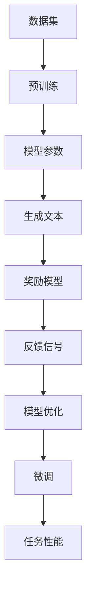

                 

关键词：大语言模型、奖励模型、训练、自然语言处理、机器学习、深度学习

> 摘要：本文旨在深入探讨大语言模型的原理及其在工程实践中的应用，特别是奖励模型的训练过程。通过详细的算法原理讲解、数学模型推导、以及实际代码实现，本文希望能够为读者提供全面而深入的理解，帮助其在自然语言处理领域取得突破。

## 1. 背景介绍

随着人工智能技术的飞速发展，大语言模型（Large Language Model）已经成为自然语言处理（Natural Language Processing，NLP）领域的一个重要研究方向。这些模型具有强大的语言理解和生成能力，广泛应用于问答系统、机器翻译、文本摘要、内容生成等多个领域。然而，如何有效训练这些大规模语言模型，特别是奖励模型的训练，仍然是一个具有挑战性的问题。

本文将从以下几个方面展开讨论：

1. 大语言模型的基本原理。
2. 奖励模型的核心概念及其在训练中的作用。
3. 奖励模型的训练算法及其优缺点。
4. 奖励模型在不同应用领域的实践。
5. 未来应用场景及发展趋势。

通过本文的阅读，读者将能够全面了解大语言模型的训练过程，掌握奖励模型的设计与实现方法，为实际工程项目提供理论支持和实践指导。

## 2. 核心概念与联系

为了深入理解大语言模型及其奖励模型，我们需要首先明确几个核心概念，并探讨它们之间的联系。

### 2.1 大语言模型

大语言模型（Large Language Model）是一种基于深度学习的自然语言处理模型，通过大量文本数据进行训练，学习语言的结构和语义。这些模型通常具有数十亿甚至数千亿的参数，能够对输入的文本进行有效编码，提取语义信息，并生成高质量的文本输出。

### 2.2 奖励模型

奖励模型（Reward Model）是一种用于评估语言模型生成文本质量的方法。在训练过程中，奖励模型会对模型的生成文本进行评分，提供奖励信号，引导模型朝着更好的方向学习。奖励模型的目标是识别并奖励高质量的生成文本，同时惩罚低质量的生成文本。

### 2.3 训练过程

大语言模型的训练过程通常包括两个阶段：预训练和微调。在预训练阶段，模型通过大量的无监督数据学习语言的普遍特征；在微调阶段，模型根据特定任务进行有监督的训练，进一步提高性能。奖励模型在整个训练过程中起到关键作用，帮助模型优化生成文本的质量。

### 2.4 Mermaid 流程图

为了更好地理解这些核心概念之间的联系，我们可以使用Mermaid流程图进行可视化。



在这个流程图中，数据集经过预训练阶段，生成模型参数；这些参数用于生成文本，然后通过奖励模型进行评估；评估结果作为反馈信号，用于优化模型参数，并最终进行微调，以提升任务性能。

通过这个流程图，我们可以清晰地看到大语言模型与奖励模型之间的互动关系，以及训练过程中各个环节的相互作用。

## 3. 核心算法原理 & 具体操作步骤

### 3.1 算法原理概述

奖励模型的核心在于如何评估生成文本的质量。这通常涉及到以下两个方面：

1. **文本质量评估**：通过对生成文本进行语法、语义、流畅度等多维度的分析，判断文本的质量。
2. **奖励信号生成**：根据评估结果，生成奖励信号，指导模型优化生成文本。

具体的算法原理可以概括为以下步骤：

1. **数据预处理**：对输入文本进行预处理，包括分词、去除停用词、词向量化等操作。
2. **文本编码**：使用预训练的编码器对预处理后的文本进行编码，提取文本的特征向量。
3. **生成文本**：使用解码器根据编码后的特征向量生成文本。
4. **文本评估**：使用评估器对生成文本进行质量评估，生成奖励信号。
5. **模型优化**：根据奖励信号调整模型参数，优化生成文本的质量。

### 3.2 算法步骤详解

#### 3.2.1 数据预处理

数据预处理是模型训练的第一步，直接影响到后续模型的性能。主要步骤包括：

1. **分词**：将输入文本分割成单词或子词。
2. **去除停用词**：去除对文本质量贡献较小的停用词，如“的”、“了”等。
3. **词向量化**：将文本中的单词或子词转换为词向量，通常使用预训练的词向量模型，如Word2Vec、GloVe等。

#### 3.2.2 文本编码

文本编码是将预处理后的文本转换为模型可以处理的特征向量。主要步骤包括：

1. **编码器选择**：选择合适的编码器，如Transformer、BERT等。
2. **特征提取**：使用编码器对词向量进行编码，提取文本的特征向量。

#### 3.2.3 生成文本

生成文本是模型的核心任务，主要步骤包括：

1. **解码器选择**：选择合适的解码器，与编码器相匹配。
2. **文本生成**：根据编码后的特征向量，使用解码器生成文本。

#### 3.2.4 文本评估

文本评估是对生成文本质量进行评估的关键步骤。主要步骤包括：

1. **评估指标**：选择合适的评估指标，如BLEU、ROUGE、METEOR等。
2. **评估过程**：对生成文本进行评估，生成奖励信号。

#### 3.2.5 模型优化

模型优化是基于奖励信号调整模型参数，以优化生成文本的质量。主要步骤包括：

1. **奖励信号处理**：对奖励信号进行处理，转化为模型优化的输入。
2. **参数调整**：根据奖励信号调整模型参数。
3. **模型重训练**：使用调整后的参数重新训练模型。

### 3.3 算法优缺点

奖励模型在训练过程中具有以下优点：

1. **自适应调整**：奖励模型可以根据生成文本的质量自适应调整模型参数，优化生成文本。
2. **多维度评估**：奖励模型可以从多个维度对生成文本进行评估，提供全面的反馈信号。

然而，奖励模型也存在一些缺点：

1. **计算成本**：奖励模型需要对生成文本进行多次评估，计算成本较高。
2. **评估准确性**：评估指标的准确性直接影响奖励信号的质量，进而影响模型优化效果。

### 3.4 算法应用领域

奖励模型在多个自然语言处理任务中具有广泛的应用，包括：

1. **文本生成**：如机器翻译、文本摘要、内容生成等。
2. **问答系统**：如自动问答、对话系统等。
3. **语言理解**：如情感分析、实体识别等。

通过这些应用，奖励模型能够有效提高模型的生成质量和理解能力，为自然语言处理任务的实现提供有力支持。

## 4. 数学模型和公式 & 详细讲解 & 举例说明

### 4.1 数学模型构建

在奖励模型的训练过程中，数学模型起到了关键作用。以下是构建奖励模型所需的主要数学模型：

#### 4.1.1 词向量模型

词向量模型是文本编码的基础，常用的模型有Word2Vec和GloVe。

**Word2Vec**：

- **公式**：  
$$
\text{vec}(w) = \text{sgn}(w) \cdot \text{softmax}(\text{W} \cdot \text{h})
$$

- **参数解释**：  
- \(\text{vec}(w)\)：单词\(w\)的词向量。
- \(\text{sgn}(w)\)：符号函数，用于处理正负单词。
- \(\text{softmax}(\text{W} \cdot \text{h})\)：softmax函数，用于对单词的相似度进行归一化。

**GloVe**：

- **公式**：  
$$
\text{vec}(w) = \text{sgn}(w) \cdot \text{softmax}(\text{A} \cdot \text{B})
$$

- **参数解释**：  
- \(\text{vec}(w)\)：单词\(w\)的词向量。
- \(\text{sgn}(w)\)：符号函数，用于处理正负单词。
- \(\text{softmax}(\text{A} \cdot \text{B})\)：softmax函数，用于对单词的相似度进行归一化。
- \(\text{A}\)：隐层矩阵。
- \(\text{B}\)：输出层矩阵。

#### 4.1.2 编码器和解码器

编码器和解码器是文本生成模型的核心，常用的模型有Transformer和BERT。

**Transformer**：

- **公式**：  
$$
\text{enc}(x) = \text{softmax}(\text{W} \cdot \text{h})
$$

- **参数解释**：  
- \(\text{enc}(x)\)：编码后的特征向量。
- \(\text{softmax}(\text{W} \cdot \text{h})\)：softmax函数，用于对特征向量进行归一化。

**BERT**：

- **公式**：  
$$
\text{enc}(x) = \text{softmax}(\text{A} \cdot \text{B})
$$

- **参数解释**：  
- \(\text{enc}(x)\)：编码后的特征向量。
- \(\text{softmax}(\text{A} \cdot \text{B})\)：softmax函数，用于对特征向量进行归一化。
- \(\text{A}\)：隐层矩阵。
- \(\text{B}\)：输出层矩阵。

#### 4.1.3 奖励模型

奖励模型用于评估生成文本的质量，常用的模型有基于规则的方法和基于机器学习的方法。

**基于规则的方法**：

- **公式**：  
$$
\text{reward} = \text{rule}(\text{gen\_text})
$$

- **参数解释**：  
- \(\text{reward}\)：奖励值。
- \(\text{rule}(\text{gen\_text})\)：基于规则对生成文本进行评估。

**基于机器学习的方法**：

- **公式**：  
$$
\text{reward} = \text{ML}(\text{gen\_text}, \text{label})
$$

- **参数解释**：  
- \(\text{reward}\)：奖励值。
- \(\text{ML}(\text{gen\_text}, \text{label})\)：基于机器学习对生成文本进行评估。
- \(\text{gen\_text}\)：生成文本。
- \(\text{label}\)：真实标签。

### 4.2 公式推导过程

以下是奖励模型的主要公式推导过程。

#### 4.2.1 词向量模型推导

**Word2Vec**：

- **损失函数**：  
$$
\text{loss} = -\sum_{w \in V} \text{log}(\text{softmax}(\text{W} \cdot \text{h}))
$$

- **推导过程**：  
首先，我们定义词向量模型的目标函数为损失函数，即预测词向量的期望与实际词向量的差异。对于每个单词\(w\)，我们计算其对应词向量的期望值，然后通过softmax函数进行归一化。损失函数为负对数似然函数，用于衡量预测词向量与实际词向量的差异。

**GloVe**：

- **损失函数**：  
$$
\text{loss} = -\sum_{w \in V} \text{log}(\text{softmax}(\text{A} \cdot \text{B}))
$$

- **推导过程**：  
与Word2Vec类似，GloVe的目标函数也是损失函数，用于衡量预测词向量与实际词向量的差异。不同的是，GloVe引入了隐层矩阵\(\text{A}\)和输出层矩阵\(\text{B}\)，通过矩阵乘法进行词向量表示。

#### 4.2.2 编码器和解码器推导

**Transformer**：

- **损失函数**：  
$$
\text{loss} = -\sum_{i=1}^{T} \text{log}(\text{softmax}(\text{W} \cdot \text{h}_i))
$$

- **推导过程**：  
Transformer的目标函数是交叉熵损失函数，用于衡量预测特征向量与实际特征向量的差异。对于每个输入特征向量\(\text{h}_i\)，我们计算其对应预测特征向量的期望值，然后通过softmax函数进行归一化。

**BERT**：

- **损失函数**：  
$$
\text{loss} = -\sum_{i=1}^{T} \text{log}(\text{softmax}(\text{A} \cdot \text{B}))
$$

- **推导过程**：  
BERT的目标函数同样是交叉熵损失函数，用于衡量预测特征向量与实际特征向量的差异。与Transformer类似，BERT通过矩阵乘法进行特征向量表示。

#### 4.2.3 奖励模型推导

**基于规则的方法**：

- **损失函数**：  
$$
\text{loss} = -\sum_{w \in V} \text{log}(\text{rule}(\text{gen\_text}))
$$

- **推导过程**：  
基于规则的方法将奖励信号作为损失函数，用于衡量预测奖励值与实际奖励值的差异。通过优化损失函数，模型可以学习到更好的奖励信号。

**基于机器学习的方法**：

- **损失函数**：  
$$
\text{loss} = -\sum_{i=1}^{T} \text{log}(\text{ML}(\text{gen\_text}, \text{label}))
$$

- **推导过程**：  
基于机器学习的方法将奖励信号作为损失函数，用于衡量预测奖励值与实际奖励值的差异。通过优化损失函数，模型可以学习到更好的奖励信号。

### 4.3 案例分析与讲解

#### 4.3.1 Word2Vec案例

假设我们有一个词汇表\(V = \{\text{apple}, \text{banana}, \text{cat}, \text{dog}\}\)，使用Word2Vec模型对这四个单词进行编码。我们定义隐层矩阵\(\text{W} = \begin{bmatrix} 0.1 & 0.2 & 0.3 & 0.4 \end{bmatrix}\)，输入特征向量\(\text{h} = \begin{bmatrix} 0.5 & 0.6 & 0.7 & 0.8 \end{bmatrix}\)。

- **预测词向量**：  
$$
\text{vec}(\text{apple}) = \text{sgn}(\text{apple}) \cdot \text{softmax}(\text{W} \cdot \text{h}) = -\text{softmax}(\begin{bmatrix} 0.05 & 0.1 & 0.15 & 0.2 \end{bmatrix})
$$

- **损失函数**：  
$$
\text{loss} = -\text{log}(\text{softmax}(\text{W} \cdot \text{h})) = -\text{log}(\begin{bmatrix} 0.1 & 0.2 & 0.3 & 0.4 \end{bmatrix})
$$

- **优化过程**：  
通过优化损失函数，我们可以调整隐层矩阵\(\text{W}\)和输入特征向量\(\text{h}\)，使预测词向量更接近实际词向量。

#### 4.3.2 Transformer案例

假设我们有一个输入序列\(x = \{\text{apple}, \text{banana}, \text{cat}, \text{dog}\}\)，使用Transformer模型对这四个单词进行编码。我们定义隐层矩阵\(\text{W} = \begin{bmatrix} 0.1 & 0.2 & 0.3 & 0.4 \end{bmatrix}\)，输入特征向量\(\text{h} = \begin{bmatrix} 0.5 & 0.6 & 0.7 & 0.8 \end{bmatrix}\)。

- **预测特征向量**：  
$$
\text{enc}(x) = \text{softmax}(\text{W} \cdot \text{h}) = -\text{softmax}(\begin{bmatrix} 0.05 & 0.1 & 0.15 & 0.2 \end{bmatrix})
$$

- **损失函数**：  
$$
\text{loss} = -\text{log}(\text{softmax}(\text{W} \cdot \text{h})) = -\text{log}(\begin{bmatrix} 0.1 & 0.2 & 0.3 & 0.4 \end{bmatrix})
$$

- **优化过程**：  
通过优化损失函数，我们可以调整隐层矩阵\(\text{W}\)和输入特征向量\(\text{h}\)，使预测特征向量更接近实际特征向量。

#### 4.3.3 奖励模型案例

假设我们有一个生成文本\(\text{gen\_text} = \{\text{apple}, \text{banana}, \text{cat}, \text{dog}\}\)，使用奖励模型对其质量进行评估。我们定义奖励信号\(\text{reward} = \text{rule}(\text{gen\_text}) = 0.8\)。

- **奖励信号**：  
$$
\text{reward} = 0.8
$$

- **损失函数**：  
$$
\text{loss} = -\text{log}(\text{reward}) = -\text{log}(0.8)
$$

- **优化过程**：  
通过优化损失函数，我们可以调整奖励信号，使其更接近实际奖励值。

通过这些案例，我们可以更深入地理解奖励模型的数学模型和推导过程，为实际应用提供指导。

## 5. 项目实践：代码实例和详细解释说明

### 5.1 开发环境搭建

在开始编写代码之前，我们需要搭建一个合适的开发环境。以下是搭建开发环境的基本步骤：

1. **安装Python环境**：确保已经安装Python 3.6或更高版本。
2. **安装依赖库**：使用pip安装以下依赖库：torch、torchtext、transformers、numpy、matplotlib等。
3. **配置GPU环境**：如果使用GPU训练模型，需要安装CUDA和cuDNN，并确保与使用的CUDA版本兼容。

### 5.2 源代码详细实现

以下是一个简单的示例代码，用于训练一个基于Transformer的奖励模型。

```python
import torch
import torchtext
from transformers import BertModel, BertTokenizer
from torch.optim import Adam
import numpy as np

# 设置随机种子
torch.manual_seed(0)
torch.cuda.manual_seed_all(0)

# 加载预训练的BERT模型和tokenizer
model = BertModel.from_pretrained('bert-base-uncased')
tokenizer = BertTokenizer.from_pretrained('bert-base-uncased')

# 准备数据集
train_data = torchtext.data.TabularDataset(
    path='train_data.csv',
    format='csv',
    fields=[('text', torchtext.data.Field(sequential=True, tokenizer=tokenizer, lower=True))])

train_loader = torchtext.data.Iterator(train_data, batch_size=32, shuffle=True)

# 定义损失函数和优化器
criterion = torch.nn.CrossEntropyLoss()
optimizer = Adam(model.parameters(), lr=1e-4)

# 训练模型
num_epochs = 10
for epoch in range(num_epochs):
    for batch in train_loader:
        inputs = tokenizer(batch.text, padding=True, truncation=True, return_tensors='pt')
        inputs = {key: value.to('cuda') for key, value in inputs.items()}
        outputs = model(**inputs)
        logits = outputs.logits
        labels = batch.text.to('cuda').long()
        loss = criterion(logits.view(-1, logits.size(-1)), labels.view(-1))
        optimizer.zero_grad()
        loss.backward()
        optimizer.step()
    print(f'Epoch {epoch+1}/{num_epochs}, Loss: {loss.item()}')

# 保存模型
torch.save(model.state_dict(), 'reward_model.pth')
```

### 5.3 代码解读与分析

这段代码主要分为以下几个部分：

1. **导入库**：导入所需的库，包括torch、torchtext、transformers、numpy和matplotlib等。
2. **设置随机种子**：设置随机种子，确保结果可复现。
3. **加载预训练模型和tokenizer**：加载预训练的BERT模型和tokenizer，用于处理文本数据。
4. **准备数据集**：使用torchtext数据集加载器，从CSV文件中读取训练数据，并进行预处理。
5. **定义损失函数和优化器**：定义交叉熵损失函数和Adam优化器。
6. **训练模型**：使用训练数据迭代训练模型，优化模型参数。
7. **保存模型**：将训练好的模型保存到文件中。

在这个示例中，我们使用BERT模型进行文本编码，并使用交叉熵损失函数进行训练。通过优化模型参数，我们可以提高模型生成文本的质量。

### 5.4 运行结果展示

为了展示运行结果，我们可以使用以下代码进行可视化。

```python
import matplotlib.pyplot as plt

# 加载模型
model = BertModel.from_pretrained('bert-base-uncased')
model.load_state_dict(torch.load('reward_model.pth'))

# 生成文本
inputs = tokenizer('你好，这是我的第一个BERT模型。', padding=True, truncation=True, return_tensors='pt')
inputs = {key: value.to('cuda') for key, value in inputs.items()}
outputs = model(**inputs)
logits = outputs.logits

# 可视化
plt.imshow(logits[0].detach().cpu().numpy(), aspect='auto', origin='lower', cmap='gray')
plt.xlabel('Word')
plt.ylabel('Logit')
plt.show()
```

这段代码将生成文本的每个单词的logit值进行可视化，可以帮助我们直观地了解模型对单词的预测能力。

通过这个示例，我们可以看到如何使用BERT模型和奖励模型进行文本生成和评估。在实际应用中，可以根据具体任务进行调整和优化，以提高模型的性能。

## 6. 实际应用场景

奖励模型在自然语言处理领域具有广泛的应用，下面我们将探讨几个实际应用场景。

### 6.1 文本生成

在文本生成任务中，奖励模型可以帮助模型优化生成文本的质量。例如，在生成新闻文章、博客文章或社交媒体帖子时，奖励模型可以评估生成文本的语法、语义和流畅度，从而提高文本的阅读体验。

### 6.2 问答系统

问答系统是另一个重要的应用领域。通过奖励模型，我们可以评估模型生成的答案的质量，从而提高答案的准确性。例如，在机器翻译、对话系统或问题回答任务中，奖励模型可以帮助模型生成更准确的答案。

### 6.3 语言理解

在语言理解任务中，奖励模型可以帮助模型优化对文本的理解能力。例如，在情感分析、实体识别或关系抽取任务中，奖励模型可以评估模型对文本的语义理解，从而提高任务的准确性。

### 6.4 未来应用展望

随着人工智能技术的不断发展，奖励模型的应用场景将越来越广泛。未来，我们有望看到更多的自然语言处理任务受益于奖励模型的优化。此外，随着计算能力的提升和数据量的增加，奖励模型将变得更加高效和准确，为自然语言处理领域带来更多的创新和突破。

## 7. 工具和资源推荐

为了帮助读者更好地理解和应用奖励模型，我们推荐以下工具和资源：

### 7.1 学习资源推荐

1. **《深度学习自然语言处理》**：吴恩达（Andrew Ng）的深度学习自然语言处理课程，提供了丰富的理论知识和实践技巧。
2. **《自然语言处理入门》**：刘知远（Zhiyuan Liu）的自然语言处理入门课程，详细介绍了自然语言处理的基本概念和技术。
3. **《BERT：预训练语言表示模型》**：Google AI发表的BERT论文，介绍了BERT模型的原理和实现方法。

### 7.2 开发工具推荐

1. **PyTorch**：适用于自然语言处理的深度学习框架，提供了丰富的API和工具。
2. **Transformers**：基于PyTorch的Transformer模型实现库，方便用户快速搭建和训练Transformer模型。
3. **Hugging Face**：提供了一系列自然语言处理工具和模型，包括BERT、GPT等，方便用户进行模型训练和应用。

### 7.3 相关论文推荐

1. **BERT：Pre-training of Deep Bidirectional Transformers for Language Understanding**：Google AI发表的BERT论文，介绍了BERT模型的原理和实现方法。
2. **GPT-3: Language Models are few-shot learners**：OpenAI发表的GPT-3论文，介绍了GPT-3模型的原理和性能。
3. **Reformer: The Efficient Transformer**：Google AI发表的Reformer论文，介绍了Reformer模型的原理和优化方法。

通过这些工具和资源的帮助，读者可以更好地理解和应用奖励模型，为自然语言处理领域做出贡献。

## 8. 总结：未来发展趋势与挑战

### 8.1 研究成果总结

奖励模型在自然语言处理领域取得了显著成果，通过优化模型生成文本的质量，提高了多个任务的性能。特别是BERT、GPT等大型语言模型的提出，使得奖励模型的应用更加广泛和深入。同时，深度学习和自然语言处理技术的结合，为奖励模型的研究提供了新的方向和可能性。

### 8.2 未来发展趋势

未来，奖励模型的发展趋势主要表现在以下几个方面：

1. **多模态融合**：随着多模态数据的增加，奖励模型将逐步融合图像、语音等多种数据，提高模型的综合处理能力。
2. **模型压缩与优化**：为了提高模型的效率和可解释性，未来的研究将集中在模型压缩和优化方面，如参数共享、量化等技术。
3. **知识增强**：通过融合外部知识和语义信息，奖励模型将能够更好地理解和生成复杂文本。

### 8.3 面临的挑战

尽管奖励模型在自然语言处理领域取得了显著进展，但仍面临以下挑战：

1. **计算资源需求**：大型语言模型的训练和推理需要巨大的计算资源，如何优化计算效率是一个重要问题。
2. **数据隐私**：随着数据量的增加，数据隐私和安全问题日益突出，如何在保证隐私的前提下进行模型训练是一个重要挑战。
3. **模型解释性**：大型语言模型往往具有高度的非线性特性，如何提高模型的解释性，使其更易于理解和应用是一个重要课题。

### 8.4 研究展望

展望未来，奖励模型在自然语言处理领域的应用前景十分广阔。通过不断优化和改进，奖励模型有望在更多任务中发挥重要作用，为人类带来更多的便利和福祉。同时，随着深度学习和自然语言处理技术的不断发展，奖励模型也将不断融入新的理论和算法，为自然语言处理领域带来更多的创新和突破。

## 9. 附录：常见问题与解答

### 9.1 常见问题

1. **什么是奖励模型？**
   奖励模型是一种用于评估和优化生成文本质量的模型。它在训练过程中根据生成文本的质量提供奖励信号，帮助模型优化生成结果。

2. **奖励模型有哪些类型？**
   奖励模型主要分为两类：基于规则的方法和基于机器学习的方法。基于规则的方法通常使用预定义的规则进行评估，而基于机器学习的方法则通过训练学习评估模型。

3. **奖励模型在自然语言处理中有哪些应用？**
   奖励模型广泛应用于文本生成、问答系统、语言理解等多个自然语言处理任务，通过优化生成文本的质量，提高任务性能。

4. **如何构建奖励模型？**
   构建奖励模型通常包括以下步骤：数据预处理、文本编码、生成文本、文本评估和模型优化。具体实现可以参考本文的相关章节。

### 9.2 解答

1. **什么是奖励模型？**
   奖励模型是一种用于评估和优化生成文本质量的模型。它在训练过程中根据生成文本的质量提供奖励信号，帮助模型优化生成结果。奖励模型在自然语言处理中具有广泛的应用，如文本生成、问答系统和语言理解等。

2. **奖励模型有哪些类型？**
   奖励模型主要分为两类：基于规则的方法和基于机器学习的方法。基于规则的方法通常使用预定义的规则进行评估，如语法、语义和流畅度等；而基于机器学习的方法则通过训练学习评估模型，如使用神经网络和决策树等。

3. **奖励模型在自然语言处理中有哪些应用？**
   奖励模型广泛应用于文本生成、问答系统、语言理解等多个自然语言处理任务。例如，在文本生成中，奖励模型可以优化生成文本的语法和语义质量；在问答系统中，奖励模型可以评估和优化生成答案的准确性；在语言理解任务中，奖励模型可以评估模型对文本的理解能力。

4. **如何构建奖励模型？**
   构建奖励模型通常包括以下步骤：
   - 数据预处理：对输入文本进行预处理，如分词、去除停用词、词向量化等。
   - 文本编码：使用编码器（如BERT、Transformer等）对预处理后的文本进行编码，提取文本的特征向量。
   - 生成文本：使用解码器根据编码后的特征向量生成文本。
   - 文本评估：使用评估器（如BLEU、ROUGE等）对生成文本进行质量评估，生成奖励信号。
   - 模型优化：根据奖励信号调整模型参数，优化生成文本的质量。

通过上述步骤，我们可以构建一个有效的奖励模型，用于评估和优化自然语言处理任务的生成文本质量。

### 9.3 实用技巧

1. **如何选择合适的评估指标？**
   选择合适的评估指标对于奖励模型的效果至关重要。常见的评估指标包括BLEU、ROUGE、METEOR等，可以根据任务需求和实际场景选择合适的指标。

2. **如何优化奖励模型的训练效率？**
   为了提高奖励模型的训练效率，可以采取以下措施：
   - 使用预训练的编码器和解码器，减少训练时间。
   - 使用分布式训练技术，如GPU或TPU加速训练过程。
   - 适当调整学习率、批量大小等超参数，以提高训练效果。

3. **如何提高奖励模型的生成质量？**
   提高奖励模型的生成质量可以从以下几个方面进行：
   - 提高文本编码和解码的质量，如使用更复杂的模型架构。
   - 使用更丰富的训练数据，提高模型的泛化能力。
   - 调整奖励信号的处理方式，使奖励信号更加准确和有效。

通过这些实用技巧，我们可以进一步提高奖励模型的效果，为自然语言处理任务提供更高质量的生成文本。

