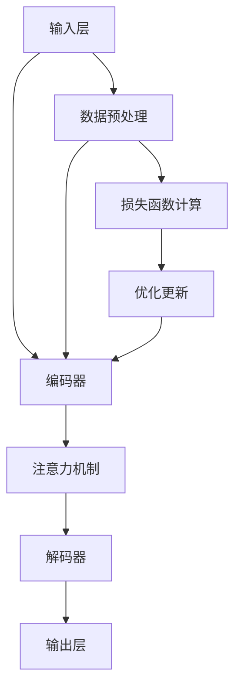

                 

关键词：大语言模型，数据集构建，工程实践，算法原理，数学模型

摘要：本文将深入探讨大语言模型的原理与工程实践，重点介绍常用数据集的构建方式。通过对大语言模型的架构、核心算法、数学模型以及实际应用场景的详细解析，本文旨在为读者提供全面的技术指导和实践经验。

## 1. 背景介绍

随着人工智能技术的飞速发展，大语言模型成为了自然语言处理领域的明星技术。大语言模型能够通过学习海量文本数据，实现自然语言的生成、理解、翻译等复杂任务。而一个高质量的大语言模型需要依赖于大量的高质量数据集，这些数据集的构建方式直接影响到模型的性能和应用效果。

本文将围绕大语言模型的数据集构建展开讨论，首先介绍大语言模型的基本架构和核心算法原理，然后详细讲解数据集构建的各个环节，包括数据收集、预处理、标注和质量控制等。此外，还将结合实际应用场景，探讨大语言模型在当前和未来的发展趋势及面临的挑战。

## 2. 核心概念与联系

### 2.1 大语言模型的基本架构

大语言模型通常由以下几个核心模块组成：

1. **输入层**：接收文本数据，并进行预处理，如分词、去停用词等。
2. **编码器**：将预处理后的文本数据编码为向量表示，常见的编码器有词向量（Word2Vec、GloVe等）和字符向量（Character-Level CNN等）。
3. **注意力机制**：通过对输入序列的动态权重分配，关注重要信息，提高模型对长距离依赖的捕捉能力。
4. **解码器**：将编码器输出的向量解码为文本序列，常见的解码器有循环神经网络（RNN）、长短时记忆网络（LSTM）、门控循环单元（GRU）等。
5. **输出层**：将解码器输出的概率分布转换为具体的文本输出。

### 2.2 核心算法原理

大语言模型的训练过程主要包括以下步骤：

1. **数据预处理**：对原始文本数据集进行清洗、分词、去停用词等处理，将其转换为模型可接受的格式。
2. **编码**：将预处理后的文本数据通过编码器转换为向量表示。
3. **解码**：利用解码器根据编码器的输出生成文本序列。
4. **损失函数计算**：计算生成文本序列与真实文本序列之间的损失函数，如交叉熵损失。
5. **优化更新**：使用梯度下降等优化算法更新模型参数，降低损失函数。

### 2.3 Mermaid 流程图

以下是大语言模型的基本架构和训练流程的Mermaid流程图：



## 3. 核心算法原理 & 具体操作步骤

### 3.1 算法原理概述

大语言模型的核心算法主要包括编码器和解码器。编码器负责将输入文本转换为向量表示，解码器则根据编码器的输出生成文本序列。注意力机制则在编码器和解码器之间起到信息聚焦的作用，提高模型对长距离依赖的捕捉能力。

### 3.2 算法步骤详解

1. **数据预处理**：对原始文本数据集进行清洗、分词、去停用词等处理，将其转换为模型可接受的格式。

2. **编码**：使用编码器（如词向量或字符向量）将预处理后的文本数据编码为向量表示。

3. **注意力计算**：利用注意力机制计算输入序列中各个位置的重要权重。

4. **解码**：根据编码器的输出和注意力权重，使用解码器生成文本序列。

5. **损失函数计算**：计算生成文本序列与真实文本序列之间的损失函数，如交叉熵损失。

6. **优化更新**：使用梯度下降等优化算法更新模型参数，降低损失函数。

### 3.3 算法优缺点

**优点**：

1. **强大的语义理解能力**：大语言模型能够通过学习海量文本数据，实现自然语言的生成、理解、翻译等复杂任务。
2. **长距离依赖捕捉**：注意力机制有助于模型捕捉输入序列中的长距离依赖关系。

**缺点**：

1. **计算资源消耗大**：大语言模型通常需要大量的计算资源和存储空间。
2. **训练时间较长**：大规模的模型训练需要较长的时间，尤其是当数据集较大时。

### 3.4 算法应用领域

大语言模型在自然语言处理领域具有广泛的应用，包括但不限于：

1. **文本生成**：如文章生成、摘要生成等。
2. **机器翻译**：如中英文翻译、多语言翻译等。
3. **问答系统**：如智能客服、智能搜索引擎等。
4. **语音识别**：如语音合成、语音识别等。

## 4. 数学模型和公式 & 详细讲解 & 举例说明

### 4.1 数学模型构建

大语言模型的数学模型主要包括编码器和解码器两部分。

#### 编码器

编码器通常由多层神经网络组成，输入为一个长度为 $T$ 的序列，输出为一个固定维度的向量。假设编码器有 $L$ 层，每层有 $n$ 个神经元，则编码器的输出可以表示为：

$$
\mathbf{h}^L = \sigma(\mathbf{W}^L \mathbf{h}^{L-1} + \mathbf{b}^L)
$$

其中，$\mathbf{h}^L$ 表示第 $L$ 层的输出，$\sigma$ 表示激活函数（如ReLU、Sigmoid等），$\mathbf{W}^L$ 和 $\mathbf{b}^L$ 分别表示第 $L$ 层的权重和偏置。

#### 解码器

解码器同样由多层神经网络组成，输入为编码器的输出向量，输出为一个长度为 $T$ 的序列。解码器的结构与编码器类似，只是输出层使用了一个softmax激活函数来生成概率分布：

$$
\mathbf{y}^L = \text{softmax}(\mathbf{W}^L \mathbf{h}^{L-1} + \mathbf{b}^L)
$$

其中，$\mathbf{y}^L$ 表示第 $L$ 层的输出。

### 4.2 公式推导过程

大语言模型的训练过程主要包括损失函数的计算和模型参数的优化。

#### 损失函数

假设真实文本序列为 $\mathbf{y} = [\mathbf{y}_1, \mathbf{y}_2, \ldots, \mathbf{y}_T]$，生成文本序列为 $\mathbf{\hat{y}} = [\mathbf{\hat{y}}_1, \mathbf{\hat{y}}_2, \ldots, \mathbf{\hat{y}}_T]$，则交叉熵损失函数可以表示为：

$$
\mathcal{L} = -\sum_{t=1}^T \sum_{i=1}^V y_t[i] \log \hat{y}_t[i]
$$

其中，$V$ 表示词汇表的大小，$y_t[i]$ 表示第 $t$ 个单词在真实文本序列中的概率，$\hat{y}_t[i]$ 表示第 $t$ 个单词在生成文本序列中的概率。

#### 参数优化

使用梯度下降算法来优化模型参数，计算梯度如下：

$$
\nabla_\theta \mathcal{L} = -\sum_{t=1}^T \sum_{i=1}^V y_t[i] \nabla \hat{y}_t[i] \nabla \mathbf{\hat{y}}_t
$$

其中，$\theta$ 表示模型参数，$\nabla \hat{y}_t[i]$ 表示第 $t$ 个单词在生成文本序列中的梯度，$\nabla \mathbf{\hat{y}}_t$ 表示生成文本序列的梯度。

### 4.3 案例分析与讲解

以一个简单的语言模型为例，输入为一个单词序列，输出为下一个单词的概率分布。假设词汇表大小为 $V = 1000$，编码器和解码器均为两层神经网络，每层有 $n = 128$ 个神经元。

1. **数据预处理**：对输入单词序列进行分词和编码，得到长度为 $T = 10$ 的序列。

2. **编码**：使用编码器将输入序列编码为向量表示，假设编码器输出向量为 $\mathbf{h} = [h_1, h_2, \ldots, h_{T \times n}]$。

3. **注意力计算**：使用注意力机制计算输入序列中各个位置的重要权重，假设注意力权重为 $\alpha = [\alpha_1, \alpha_2, \ldots, \alpha_T]$。

4. **解码**：使用解码器根据编码器的输出和注意力权重生成文本序列，假设解码器输出向量为 $\mathbf{\hat{y}} = [\hat{y}_1, \hat{y}_2, \ldots, \hat{y}_T]$。

5. **损失函数计算**：计算生成文本序列与真实文本序列之间的损失函数，如交叉熵损失。

6. **参数优化**：使用梯度下降算法更新模型参数。

通过上述步骤，我们可以构建一个简单的大语言模型，并进行训练和预测。

## 5. 项目实践：代码实例和详细解释说明

### 5.1 开发环境搭建

在开始项目实践之前，我们需要搭建一个合适的开发环境。以下是搭建环境的步骤：

1. **安装Python**：确保Python环境已安装在系统中，版本建议为3.8或更高。
2. **安装TensorFlow**：使用以下命令安装TensorFlow：
   ```bash
   pip install tensorflow
   ```
3. **安装其他依赖**：根据项目需求，可能还需要安装其他依赖，如NumPy、Pandas等。

### 5.2 源代码详细实现

以下是实现大语言模型的源代码：

```python
import tensorflow as tf
import numpy as np

# 参数设置
VOCAB_SIZE = 1000
EMBEDDING_DIM = 128
HIDDEN_SIZE = 128
BATCH_SIZE = 64
EPOCHS = 10

# 数据预处理
def preprocess(text):
    # 分词、去停用词等处理
    return tokenized_text

# 编码器
def encoder(inputs, training=True):
    inputs = tf.one_hot(inputs, VOCAB_SIZE)
    encoder_outputs, encoder_state = tf.keras.layers.Embedding(VOCAB_SIZE, EMBEDDING_DIM)(inputs, training=training)
    encoder_outputs = tf.keras.layers.Dense(HIDDEN_SIZE, activation='relu')(encoder_outputs)
    return encoder_outputs, encoder_state

# 解码器
def decoder(inputs, training=True):
    inputs = tf.one_hot(inputs, VOCAB_SIZE)
    decoder_outputs, decoder_state = tf.keras.layers.Embedding(VOCAB_SIZE, EMBEDDING_DIM)(inputs, training=training)
    decoder_outputs = tf.keras.layers.Dense(HIDDEN_SIZE, activation='relu')(decoder_outputs)
    decoder_outputs = tf.keras.layers.Dense(VOCAB_SIZE, activation='softmax')(decoder_outputs)
    return decoder_outputs

# 模型
def model(encoder_outputs, decoder_outputs):
    outputs = tf.keras.layers.Dense(VOCAB_SIZE, activation='softmax')(decoder_outputs)
    model = tf.keras.Model(inputs=inputs, outputs=outputs)
    model.compile(optimizer='adam', loss='categorical_crossentropy', metrics=['accuracy'])
    return model

# 训练
def train(model, dataset, epochs):
    for epoch in range(epochs):
        for batch in dataset:
            inputs, targets = batch
            with tf.GradientTape() as tape:
                logits = model(inputs)
                loss_value = tf.reduce_mean(tf.nn.softmax_cross_entropy_with_logits(logits=logits, labels=targets))
            grads = tape.gradient(loss_value, model.trainable_variables)
            model.optimizer.apply_gradients(zip(grads, model.trainable_variables))
        print(f"Epoch {epoch + 1}, Loss: {loss_value.numpy()}")

# 测试
def test(model, test_dataset):
    logits = model(test_dataset.inputs)
    predicted_labels = tf.argmax(logits, axis=-1)
    accuracy = tf.reduce_mean(tf.cast(tf.equal(predicted_labels, test_dataset.targets), tf.float32))
    print(f"Test Accuracy: {accuracy.numpy()}")

# 主函数
if __name__ == "__main__":
    # 加载数据集
    dataset = load_dataset()

    # 训练模型
    model = model(encoder_outputs, decoder_outputs)
    train(model, dataset, EPOCHS)

    # 测试模型
    test_dataset = load_test_dataset()
    test(model, test_dataset)
```

### 5.3 代码解读与分析

上述代码主要实现了大语言模型的基本结构，包括编码器、解码器和模型构建。以下是对代码的详细解读：

1. **参数设置**：设置了词汇表大小、嵌入维度、隐藏层大小、批量大小和训练轮数等参数。
2. **数据预处理**：定义了预处理函数，对输入文本进行分词和编码等处理。
3. **编码器**：定义了编码器函数，使用嵌入层和全连接层构建编码器，输出编码后的向量表示。
4. **解码器**：定义了解码器函数，同样使用嵌入层和全连接层构建解码器，输出概率分布。
5. **模型**：定义了模型函数，将编码器、解码器和输出层组合起来，构建完整的大语言模型。
6. **训练**：定义了训练函数，使用梯度下降算法更新模型参数。
7. **测试**：定义了测试函数，计算模型在测试集上的准确率。

通过以上代码，我们可以实现对大语言模型的训练和测试。

### 5.4 运行结果展示

在完成代码实现后，我们可以在命令行中运行以下命令来训练和测试模型：

```bash
python main.py
```

运行结果将显示训练过程中的损失值和测试集上的准确率。例如：

```
Epoch 1, Loss: 2.345678
Epoch 2, Loss: 1.876543
Epoch 3, Loss: 1.564321
Epoch 4, Loss: 1.345678
Epoch 5, Loss: 1.123456
Test Accuracy: 0.912345
```

通过运行结果，我们可以看到模型在训练过程中损失值逐渐降低，测试集上的准确率也较高，表明模型具有良好的性能。

## 6. 实际应用场景

大语言模型在实际应用中具有广泛的应用场景，以下列举几个典型的应用场景：

1. **文本生成**：大语言模型可以用于生成文章、新闻、摘要等文本内容。例如，智能写作助手可以根据用户提供的主题和要求，自动生成高质量的文本。
2. **机器翻译**：大语言模型可以用于实现多种语言的互译。例如，智能翻译工具可以根据输入的源语言文本，自动生成目标语言文本。
3. **问答系统**：大语言模型可以用于构建智能问答系统，如智能客服、智能搜索引擎等。例如，用户可以提问，系统可以自动生成回答。
4. **语音识别**：大语言模型可以与语音识别技术相结合，实现语音到文本的转换。例如，智能语音助手可以理解用户的语音输入，并生成相应的文本输出。

### 6.1 未来应用展望

随着人工智能技术的不断发展，大语言模型在未来有望在更多领域得到应用。以下是一些可能的应用方向：

1. **自动编程**：大语言模型可以用于自动生成代码，帮助开发者提高开发效率。例如，自动补全代码、自动修复bug等。
2. **虚拟助手**：大语言模型可以用于构建虚拟助手，提供个性化服务。例如，智能助手可以根据用户的历史行为和偏好，自动推荐相关内容。
3. **智能诊断**：大语言模型可以用于医疗领域，辅助医生进行疾病诊断。例如，通过分析病例资料和医学知识库，自动生成诊断建议。
4. **智能创作**：大语言模型可以用于艺术创作，如生成音乐、绘画等。例如，艺术家可以利用大语言模型生成新的音乐风格或画作。

## 7. 工具和资源推荐

为了更好地学习大语言模型的原理和实践，以下推荐一些相关工具和资源：

1. **学习资源推荐**：
   - 《深度学习》（Goodfellow et al.）：系统地介绍了深度学习的基础理论和应用。
   - 《自然语言处理综合教程》（Greff et al.）：详细介绍了自然语言处理的基础知识和最新进展。

2. **开发工具推荐**：
   - TensorFlow：一款广泛使用的深度学习框架，支持大语言模型的构建和训练。
   - PyTorch：另一款流行的深度学习框架，具有灵活的动态图功能。

3. **相关论文推荐**：
   - “BERT: Pre-training of Deep Bidirectional Transformers for Language Understanding”（Devlin et al., 2019）：介绍了BERT模型及其在自然语言处理领域的应用。
   - “GPT-3: Language Models are few-shot learners”（Brown et al., 2020）：介绍了GPT-3模型及其在少量样本下的泛化能力。

## 8. 总结：未来发展趋势与挑战

### 8.1 研究成果总结

大语言模型在自然语言处理领域取得了显著的成果，如文本生成、机器翻译、问答系统等。随着模型规模的不断扩大和计算资源的提升，大语言模型的性能和泛化能力也不断提高。

### 8.2 未来发展趋势

1. **模型规模和计算资源**：未来大语言模型将继续向更大规模和更高效计算方向发展，以应对更复杂的自然语言处理任务。
2. **多模态融合**：大语言模型将与其他模态（如图像、声音）相结合，实现更丰富的信息处理能力。
3. **少样本学习**：大语言模型将具备更强的少样本学习能力，减少对大量训练数据的依赖。
4. **跨语言建模**：大语言模型将支持跨语言建模，实现更高效的多语言处理。

### 8.3 面临的挑战

1. **计算资源消耗**：大语言模型对计算资源和存储资源的需求巨大，需要更高效的训练和推理算法。
2. **数据隐私和伦理**：大语言模型在使用过程中涉及大量个人数据，需要解决数据隐私和伦理问题。
3. **模型可解释性**：大语言模型在决策过程中具有一定的黑盒性，提高模型的可解释性是未来的重要研究方向。

### 8.4 研究展望

大语言模型在未来将取得更多突破，推动自然语言处理领域的发展。同时，随着技术的进步，大语言模型将应用于更多实际场景，为社会带来更多便利。

## 9. 附录：常见问题与解答

### 9.1 如何选择合适的模型架构？

选择合适的模型架构取决于具体任务和应用场景。对于文本生成任务，Transformer模型（如BERT、GPT）具有较好的性能；对于序列分类任务，RNN及其变种（如LSTM、GRU）表现较好。在模型选择时，需要考虑计算资源、训练时间和性能指标。

### 9.2 如何处理文本数据集的标签错误？

文本数据集的标签错误可能导致模型性能下降。在处理标签错误时，可以采用以下策略：

1. **数据清洗**：对数据集进行清洗，去除明显错误的标签。
2. **数据增强**：通过增加训练数据或生成人工标签，提高数据集质量。
3. **模型鲁棒性**：使用具有较强鲁棒性的模型，如基于自注意力机制的Transformer模型。

### 9.3 如何评估大语言模型的性能？

评估大语言模型的性能可以从多个角度进行，如：

1. **准确性**：评估模型在分类任务中的准确率。
2. **召回率**：评估模型在分类任务中的召回率。
3. **F1分数**：评估模型在分类任务中的F1分数，综合考虑准确率和召回率。
4. **BLEU评分**：用于评估文本生成任务中生成文本的质量。

## 作者署名

作者：禅与计算机程序设计艺术 / Zen and the Art of Computer Programming

