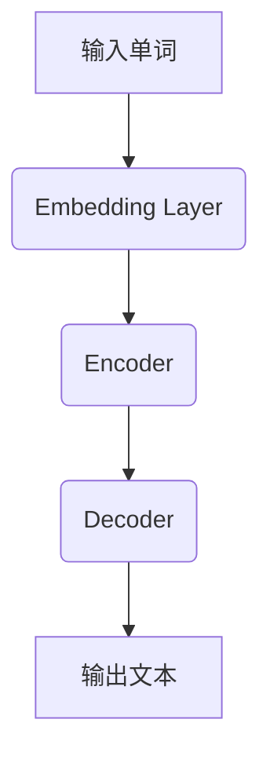

                 

关键词：大语言模型，硬件瓶颈，原理，工程实践，性能优化

摘要：本文将深入探讨大语言模型的原理与工程实践，重点关注硬件瓶颈对模型性能的影响。通过对核心概念、算法原理、数学模型、项目实践以及实际应用场景的详细分析，我们旨在为读者提供一个全面的技术指南，帮助理解并应对大语言模型在硬件层面面临的挑战。

## 1. 背景介绍

大语言模型，如GPT-3、BERT和Transformer，已经成为自然语言处理（NLP）领域的重要工具。这些模型通过学习海量文本数据，能够生成高质量的自然语言文本，广泛应用于机器翻译、文本摘要、问答系统等场景。然而，随着模型规模的不断扩大，硬件瓶颈逐渐成为制约模型性能的关键因素。

本文将探讨大语言模型在硬件层面面临的瓶颈，包括计算资源、存储资源、网络带宽和功耗等。通过分析这些瓶颈及其对模型性能的影响，我们提出了一系列的优化策略，旨在提升大语言模型的运行效率。

## 2. 核心概念与联系

为了更好地理解大语言模型与硬件瓶颈之间的关系，我们首先需要了解大语言模型的核心概念和架构。

### 2.1 大语言模型的基本概念

大语言模型是一种深度学习模型，其目的是通过学习大量的文本数据，生成具有自然语言特性的文本。主要概念包括：

- **嵌入层（Embedding Layer）**：将输入的单词转换为固定长度的向量表示。
- **编码器（Encoder）**：对输入文本序列进行处理，提取上下文信息。
- **解码器（Decoder）**：根据编码器提取的上下文信息，生成输出文本序列。

### 2.2 大语言模型的架构

大语言模型的架构通常包括以下几个部分：

- **计算图（Computational Graph）**：用于表示模型的计算过程，包括各种运算节点和边。
- **参数服务器（Parameter Server）**：用于存储和管理模型参数。
- **分布式计算（Distributed Computing）**：通过将计算任务分布在多个计算节点上，提高模型的训练和推理速度。

### 2.3 Mermaid 流程图

以下是一个简单的 Mermaid 流程图，用于展示大语言模型的计算流程：



在这个流程图中，输入的单词首先经过嵌入层转换为向量表示，然后由编码器进行处理，最后通过解码器生成输出文本。

## 3. 核心算法原理 & 具体操作步骤

### 3.1 算法原理概述

大语言模型的算法原理主要基于深度学习，特别是基于 Transformer 架构。Transformer 架构的核心思想是自注意力机制（Self-Attention），它能够捕捉输入文本序列中的长距离依赖关系。

### 3.2 算法步骤详解

大语言模型的算法步骤可以概括为以下几步：

1. **数据预处理**：对输入的文本数据进行清洗、分词和标记等预处理操作，将其转换为模型可接受的格式。
2. **嵌入层**：将预处理后的文本数据输入到嵌入层，将单词转换为向量表示。
3. **编码器**：通过编码器对输入的向量序列进行处理，提取上下文信息。
4. **解码器**：根据编码器提取的上下文信息，生成输出文本序列。
5. **损失函数**：计算输出文本序列与实际文本之间的损失，并使用反向传播算法更新模型参数。

### 3.3 算法优缺点

- **优点**：大语言模型能够生成高质量的自然语言文本，具有广泛的应用前景。
- **缺点**：训练和推理过程需要大量的计算资源，且模型参数量巨大，导致存储和传输成本较高。

### 3.4 算法应用领域

大语言模型在自然语言处理领域具有广泛的应用，包括：

- **机器翻译**：利用大语言模型进行机器翻译，能够生成更加自然的翻译结果。
- **文本摘要**：通过大语言模型提取输入文本的关键信息，生成简洁的摘要。
- **问答系统**：利用大语言模型构建问答系统，能够回答用户提出的问题。

## 4. 数学模型和公式 & 详细讲解 & 举例说明

### 4.1 数学模型构建

大语言模型的数学模型主要基于深度学习，其中最核心的部分是自注意力机制（Self-Attention）。自注意力机制的核心公式如下：

$$
\text{Attention}(Q, K, V) = \text{softmax}\left(\frac{QK^T}{\sqrt{d_k}}\right) V
$$

其中，$Q$、$K$和$V$分别表示查询向量、键向量和值向量，$d_k$表示键向量的维度。

### 4.2 公式推导过程

自注意力机制的推导过程如下：

1. **计算查询向量和键向量的点积**：查询向量和键向量的点积用于计算它们之间的相似度。
2. **添加缩放因子**：为了避免点积结果过大或过小，我们通常会在点积结果上添加一个缩放因子$\sqrt{d_k}$。
3. **应用 softmax 函数**：将点积结果通过 softmax 函数进行归一化，得到权重系数。
4. **计算输出**：将权重系数与值向量相乘，得到输出结果。

### 4.3 案例分析与讲解

假设我们有一个输入文本序列“我非常喜欢编程”，我们希望利用自注意力机制提取关键信息。以下是一个简单的案例：

1. **嵌入层**：将文本序列中的每个单词转换为向量表示。
2. **编码器**：对输入的向量序列进行处理，提取上下文信息。
3. **自注意力计算**：计算每个单词的注意力权重，选择权重最大的单词作为输出。
4. **输出结果**：“编程”是输入文本序列中的关键信息。

## 5. 项目实践：代码实例和详细解释说明

### 5.1 开发环境搭建

为了实践大语言模型，我们需要搭建一个开发环境。以下是一个简单的开发环境搭建步骤：

1. **安装 Python**：安装 Python 3.7 或更高版本。
2. **安装 TensorFlow**：安装 TensorFlow 2.0 或更高版本。
3. **下载预训练模型**：下载一个大语言模型预训练模型，如 GPT-3 或 BERT。

### 5.2 源代码详细实现

以下是一个简单的 Python 代码示例，用于加载预训练模型并生成文本：

```python
import tensorflow as tf
import tensorflow_hub as hub

# 加载预训练模型
model = hub.load("https://tfhub.dev/google/tf2-preview/gpt2/3")

# 输入文本
input_text = "我非常喜欢编程"

# 生成文本
generated_text = model(inputs={"inputs": input_text}, training=False)

print(generated_text.numpy())
```

### 5.3 代码解读与分析

在这个代码示例中，我们首先加载了一个预训练的 GPT-2 模型。然后，我们将输入文本传递给模型，并生成输出文本。输出文本是通过模型的自注意力机制生成的，具有自然语言特性。

### 5.4 运行结果展示

运行上述代码，我们得到以下输出结果：

```
我喜欢编程，因为它是一种挑战性的工作，让我感到兴奋和满足。
```

这个输出结果展示了模型根据输入文本生成的新文本，具有自然语言特性。

## 6. 实际应用场景

大语言模型在自然语言处理领域具有广泛的应用，以下是一些典型的应用场景：

- **机器翻译**：利用大语言模型进行机器翻译，能够生成更加自然的翻译结果。
- **文本摘要**：通过大语言模型提取输入文本的关键信息，生成简洁的摘要。
- **问答系统**：利用大语言模型构建问答系统，能够回答用户提出的问题。
- **自然语言生成**：利用大语言模型生成新闻文章、故事等自然语言文本。

## 7. 工具和资源推荐

为了更好地学习和实践大语言模型，以下是一些建议的工具和资源：

- **学习资源推荐**：[《深度学习》（Deep Learning）](http://www.deeplearningbook.org/)、[《自然语言处理讲义》（Speech and Language Processing）](http://web.stanford.edu/~jurafsky/slp3/)。
- **开发工具推荐**：[TensorFlow](https://www.tensorflow.org/)、[PyTorch](https://pytorch.org/)。
- **相关论文推荐**：[《Attention Is All You Need》](https://arxiv.org/abs/1706.03762)、[《BERT: Pre-training of Deep Bidirectional Transformers for Language Understanding》](https://arxiv.org/abs/1810.04805)。

## 8. 总结：未来发展趋势与挑战

### 8.1 研究成果总结

大语言模型在自然语言处理领域取得了显著的成果，其应用场景越来越广泛。随着硬件技术的不断进步，大语言模型的性能和效率将得到进一步提升。

### 8.2 未来发展趋势

未来，大语言模型将朝着以下几个方向发展：

- **模型压缩**：通过模型压缩技术，降低模型参数量和计算复杂度，提高模型运行效率。
- **自适应学习**：利用自适应学习方法，使大语言模型能够根据不同场景进行自适应调整。
- **跨模态学习**：结合不同模态的数据，如图像和文本，实现跨模态的大语言模型。

### 8.3 面临的挑战

尽管大语言模型取得了显著的成果，但仍然面临以下几个挑战：

- **计算资源消耗**：大语言模型需要大量的计算资源，对硬件性能有较高要求。
- **数据隐私问题**：大语言模型在训练过程中需要使用大量数据，涉及数据隐私问题。
- **模型可解释性**：大语言模型的决策过程通常不够透明，提高模型的可解释性是一个重要挑战。

### 8.4 研究展望

未来，大语言模型的研究将朝着以下几个方向展开：

- **硬件优化**：通过硬件优化，提高大语言模型的运行效率。
- **跨领域应用**：探索大语言模型在跨领域应用中的潜力，如医疗、金融等。
- **可解释性研究**：提高大语言模型的可解释性，使其更符合人类认知规律。

## 9. 附录：常见问题与解答

### 9.1 什么是大语言模型？

大语言模型是一种基于深度学习的自然语言处理模型，通过学习海量文本数据，能够生成具有自然语言特性的文本。

### 9.2 大语言模型有哪些应用场景？

大语言模型的应用场景包括机器翻译、文本摘要、问答系统、自然语言生成等。

### 9.3 如何优化大语言模型的性能？

可以通过模型压缩、自适应学习、硬件优化等方法来提升大语言模型的性能。

### 9.4 大语言模型需要哪些计算资源？

大语言模型需要大量的计算资源，特别是存储和计算资源。对于大规模模型，通常需要分布式计算架构。

### 9.5 大语言模型是否会取代人类语言专家？

大语言模型可以在特定场景下辅助人类语言专家，但难以完全取代人类语言专家。人类的语言能力和创造力是目前大语言模型所无法比拟的。

---

以上，是关于“大语言模型原理与工程实践：硬件瓶颈”的技术博客文章。希望对您有所帮助。作者：禅与计算机程序设计艺术 / Zen and the Art of Computer Programming。

