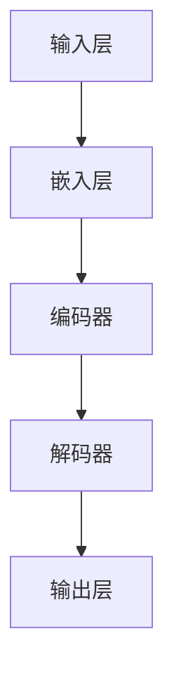

                 

在当今的信息时代，语言模型已经成为了人工智能领域的核心技术之一。无论是自然语言处理、语音识别还是机器翻译，语言模型都发挥着至关重要的作用。而作为大语言模型，其背后的原理与前沿发展更是值得深入探讨。本文将以此为出发点，详细介绍大语言模型的基本原理、核心算法、数学模型以及实际应用，并展望其未来的发展趋势与挑战。

## 关键词

- 大语言模型
- 自然语言处理
- 人工智能
- 语言生成
- 语言理解
- 深度学习
- 循环神经网络
- 变分自编码器

## 摘要

本文首先回顾了语言模型的发展历程，介绍了大语言模型的基本概念和原理。随后，我们通过Mermaid流程图展示了大语言模型的架构，并深入探讨了其核心算法——循环神经网络和变分自编码器的原理与操作步骤。接着，我们通过数学模型和公式详细讲解了大语言模型的计算过程，并提供了实际的代码实例和解读。最后，文章分析了大语言模型在实际应用中的场景，并对其未来发展进行了展望。

## 1. 背景介绍

### 1.1 语言模型的起源与发展

语言模型的研究可以追溯到上世纪五六十年代，当时人工智能的先驱们就开始尝试通过计算机模拟人类语言。1968年，约翰·霍普金斯大学的约翰·莫尔斯（John N. Martin）开发了一个简单的语言模型，用于研究英语句子的概率分布。这个模型基于语言统计学原理，通过计算单词在语料库中的出现频率来预测下一个单词。

随着计算机性能的提升和算法的进步，语言模型的发展经历了几个重要的阶段。1970年代，拉法尔·布洛克（Rafal Brzezinski）提出了n元语言模型，通过考虑前n个单词的历史信息来预测下一个单词。1980年代，乔治·米德（George A. Miller）等人提出了“词袋模型”，将文本表示为单词的集合，从而简化了语言模型的复杂度。

进入21世纪，随着深度学习技术的兴起，语言模型迎来了新的突破。2003年，乔治·米德和他的团队提出了“循环神经网络”（RNN），这一算法能够处理序列数据，从而在自然语言处理领域取得了显著成果。2013年，雅虎的研究人员提出了“长短期记忆网络”（LSTM），这种改进的RNN在处理长序列数据时表现更加优秀。此后，变分自编码器（VAE）和生成对抗网络（GAN）等深度学习模型也逐渐应用于语言模型，推动了语言模型的快速发展。

### 1.2 大语言模型的概念与特点

大语言模型，顾名思义，是指拥有海量参数和强大计算能力的语言模型。与传统的语言模型相比，大语言模型具有以下几个显著特点：

1. **参数规模庞大**：大语言模型通常拥有数十亿甚至千亿级的参数，这使得模型能够捕获更多语言信息，从而在语言生成和理解方面表现出色。
2. **强大的建模能力**：大语言模型能够同时建模语言的概率分布和生成过程，这使得模型在文本生成、机器翻译、问答系统等方面具有很高的准确性和鲁棒性。
3. **自适应能力**：大语言模型可以自动调整参数，以适应不同的语言风格、文体和语境，从而实现更加自然和人性化的语言交互。
4. **多语言支持**：大语言模型通常支持多语言处理，能够同时处理不同语言的文本，这在全球化背景下具有重要意义。

### 1.3 大语言模型的应用领域

大语言模型在多个应用领域取得了显著成果，以下是其中几个重要的应用场景：

1. **文本生成**：大语言模型可以生成各种类型的文本，包括文章、新闻、故事、诗歌等。这些生成文本在娱乐、教育、广告等领域具有广泛的应用。
2. **机器翻译**：大语言模型在机器翻译领域表现出色，能够实现高质量、自然的跨语言翻译，这在跨文化交流和国际贸易中具有重要意义。
3. **问答系统**：大语言模型可以用于构建智能问答系统，通过理解用户的问题和上下文信息，提供准确、详细的回答。
4. **语音助手**：大语言模型可以用于语音识别和语音生成，使得语音助手能够更加智能地与用户进行交互。

## 2. 核心概念与联系

### 2.1 大语言模型的架构

大语言模型的架构通常由以下几个关键组件构成：

1. **输入层**：输入层负责接收文本数据，并将其转换为模型能够处理的特征表示。
2. **嵌入层**：嵌入层将单词或字符映射为稠密向量表示，这一层是语言模型的核心，其质量直接影响到模型的性能。
3. **编码器**：编码器负责将输入序列编码为一个固定长度的表示，这一表示通常被称为“上下文向量”。
4. **解码器**：解码器根据上下文向量生成输出序列，这一过程通常采用概率模型进行。
5. **输出层**：输出层通常是一个全连接层，用于将解码器的输出映射为词汇表中的单词或字符。

### 2.2 Mermaid流程图

以下是一个简化的Mermaid流程图，用于展示大语言模型的架构：



### 2.3 核心概念与联系

在大语言模型中，以下几个核心概念和联系至关重要：

1. **嵌入层**：嵌入层将单词或字符映射为稠密向量表示，这一过程通常通过词向量模型（如Word2Vec、GloVe）实现。词向量模型能够捕捉单词之间的语义关系，从而为编码器和解码器提供丰富的语义信息。
2. **编码器**：编码器负责将输入序列编码为一个固定长度的表示，这一表示通常被称为“上下文向量”。编码器采用循环神经网络（RNN）或其变种（如LSTM、GRU）实现，这些模型能够处理序列数据，并捕捉序列中的长期依赖关系。
3. **解码器**：解码器根据上下文向量生成输出序列，这一过程通常采用概率模型进行。解码器同样采用循环神经网络（RNN）或其变种（如LSTM、GRU）实现，其目标是最大化输出序列的概率。
4. **损失函数**：在大语言模型中，损失函数通常采用交叉熵损失（Cross-Entropy Loss），用于衡量预测分布和真实分布之间的差距。交叉熵损失函数能够有效驱动模型参数的优化，从而提高模型的预测性能。

## 3. 核心算法原理 & 具体操作步骤

### 3.1 算法原理概述

大语言模型的核心算法主要包括循环神经网络（RNN）、长短期记忆网络（LSTM）和变分自编码器（VAE）等。这些算法在语言建模中发挥着至关重要的作用，下面我们将分别介绍它们的原理。

1. **循环神经网络（RNN）**

RNN是一种能够处理序列数据的神经网络，其基本思想是利用上一个时间步的输出作为下一个时间步的输入。RNN的主要优势在于其能够捕捉序列中的长期依赖关系，从而在语言建模中表现出色。

RNN的数学表示如下：

$$
h_t = \sigma(W_h \cdot [h_{t-1}, x_t] + b_h)
$$

其中，$h_t$表示第t个时间步的隐藏状态，$x_t$表示第t个时间步的输入，$\sigma$表示非线性激活函数（如sigmoid或tanh函数），$W_h$和$b_h$分别表示权重和偏置。

2. **长短期记忆网络（LSTM）**

LSTM是RNN的一种改进，其主要目的是解决RNN在处理长序列数据时容易遇到梯度消失或梯度爆炸的问题。LSTM引入了门控机制，通过三个门控单元（遗忘门、输入门、输出门）来控制信息的流动。

LSTM的数学表示如下：

$$
\begin{aligned}
& f_t = \sigma(W_f \cdot [h_{t-1}, x_t] + b_f) \\
& i_t = \sigma(W_i \cdot [h_{t-1}, x_t] + b_i) \\
& \bar{g}_t = \tanh(W_g \cdot [h_{t-1}, x_t] + b_g) \\
& o_t = \sigma(W_o \cdot [h_{t-1}, x_t] + b_o) \\
& h_t = o_t \cdot \tanh(W_h \cdot [f_t \odot h_{t-1} + i_t \odot \bar{g}_t] + b_h)
\end{aligned}
$$

其中，$f_t$、$i_t$、$\bar{g}_t$、$o_t$分别表示遗忘门、输入门、输入门和输出门的输出，$W_f$、$W_i$、$W_g$、$W_o$、$b_f$、$b_i$、$b_g$、$b_o$分别表示权重和偏置。

3. **变分自编码器（VAE）**

VAE是一种无监督学习算法，其核心思想是通过引入潜在变量（也称为隐变量）来建模数据分布。VAE通过编码器和解码器两个神经网络来实现数据的生成和重建。

VAE的数学表示如下：

$$
\begin{aligned}
& z \sim p(z | x) \\
& x \sim p(x | z)
\end{aligned}
$$

其中，$z$表示潜在变量，$x$表示输入数据。

VAE的编码器和解码器通常采用神经网络实现，其损失函数为：

$$
\begin{aligned}
& \ell(x, z) = D_{KL}(q(z|x) || p(z)) + \frac{1}{2} \sum_{x \in X} D_{KL}(x || \mu(x) + \sigma^2(x))
\end{aligned}
$$

其中，$q(z|x)$和$p(z)$分别表示编码器和解码器的概率分布，$D_{KL}$表示KL散度，$\mu(x)$和$\sigma^2(x)$分别表示解码器的均值和方差。

### 3.2 算法步骤详解

1. **数据预处理**

在训练大语言模型之前，需要对数据进行预处理，包括分词、标记、编码等。分词是将文本分割成单词或字符序列，标记是将文本中的词语或符号标注为具体的实体或词性，编码是将文本表示为数值序列。

2. **嵌入层训练**

嵌入层训练通常采用词向量模型（如Word2Vec、GloVe）进行。词向量模型通过将单词映射为稠密向量，从而为编码器和解码器提供丰富的语义信息。训练过程通常包括负采样和层次软目标等技巧，以提高模型训练效率。

3. **编码器训练**

编码器训练采用循环神经网络（RNN）或其变种（如LSTM、GRU）实现。训练过程包括正向传播和反向传播两个阶段。在正向传播阶段，输入序列通过编码器生成上下文向量；在反向传播阶段，通过计算损失函数（如交叉熵损失）来更新编码器的参数。

4. **解码器训练**

解码器训练同样采用循环神经网络（RNN）或其变种（如LSTM、GRU）实现。训练过程与编码器类似，包括正向传播和反向传播两个阶段。在正向传播阶段，输入序列通过编码器生成上下文向量，并解码为输出序列；在反向传播阶段，通过计算损失函数来更新解码器的参数。

5. **模型优化**

模型优化通常采用梯度下降（Gradient Descent）或其变种（如Adam优化器）进行。优化过程通过调整模型参数，使模型在训练数据上的损失函数值最小化。

### 3.3 算法优缺点

1. **循环神经网络（RNN）**

优点：

- 能够处理序列数据，捕捉长期依赖关系。
- 参数相对较少，训练效率较高。

缺点：

- 容易出现梯度消失或梯度爆炸问题。
- 对长序列数据的处理能力有限。

2. **长短期记忆网络（LSTM）**

优点：

- 能够解决RNN的梯度消失和梯度爆炸问题。
- 能够处理长序列数据，捕捉长期依赖关系。

缺点：

- 参数较多，训练效率较低。
- 结构复杂，实现难度较大。

3. **变分自编码器（VAE）**

优点：

- 能够建模数据分布，实现无监督学习。
- 参数较少，训练效率较高。

缺点：

- 对噪声敏感，生成质量较差。
- 难以建模复杂的数据分布。

### 3.4 算法应用领域

循环神经网络（RNN）、长短期记忆网络（LSTM）和变分自编码器（VAE）在大语言模型中具有广泛的应用。以下是几个典型的应用领域：

1. **文本生成**：通过训练大语言模型，可以生成各种类型的文本，如文章、新闻、故事、诗歌等。这些生成文本在娱乐、教育、广告等领域具有广泛的应用。

2. **机器翻译**：大语言模型可以用于构建高质量、自然的跨语言翻译系统。通过训练多语言数据集，模型能够实现高质量的双语翻译。

3. **问答系统**：大语言模型可以用于构建智能问答系统，通过理解用户的问题和上下文信息，提供准确、详细的回答。

4. **语音助手**：大语言模型可以用于语音识别和语音生成，使得语音助手能够更加智能地与用户进行交互。

5. **推荐系统**：大语言模型可以用于文本数据的推荐，通过分析用户的历史行为和兴趣，推荐相关的文本内容。

## 4. 数学模型和公式 & 详细讲解 & 举例说明

### 4.1 数学模型构建

大语言模型的数学模型主要包括以下几个部分：

1. **输入表示**：输入表示是指将文本数据转换为模型能够处理的数值表示。通常采用词向量模型（如Word2Vec、GloVe）将单词映射为稠密向量。

2. **编码器**：编码器是指将输入序列编码为一个固定长度的表示，这一表示通常被称为“上下文向量”。编码器采用循环神经网络（RNN）或其变种（如LSTM、GRU）实现。

3. **解码器**：解码器是指根据上下文向量生成输出序列，这一过程通常采用概率模型进行。解码器同样采用循环神经网络（RNN）或其变种（如LSTM、GRU）实现。

4. **损失函数**：损失函数用于衡量预测分布和真实分布之间的差距。在大语言模型中，通常采用交叉熵损失（Cross-Entropy Loss）。

### 4.2 公式推导过程

1. **输入表示**

假设输入文本为$x = [x_1, x_2, ..., x_T]$，其中$x_i$表示第$i$个单词，$T$表示文本长度。词向量模型将每个单词映射为$d$维稠密向量，即$x_i \in \mathbb{R}^d$。

2. **编码器**

编码器采用循环神经网络（RNN）实现，其数学表示如下：

$$
h_t = \sigma(W_h \cdot [h_{t-1}, x_t] + b_h)
$$

其中，$h_t$表示第$t$个时间步的隐藏状态，$x_t$表示第$t$个时间步的输入，$\sigma$表示非线性激活函数（如sigmoid或tanh函数），$W_h$和$b_h$分别表示权重和偏置。

3. **解码器**

解码器同样采用循环神经网络（RNN）实现，其数学表示如下：

$$
\hat{x}_t = \sigma(W_d \cdot h_t + b_d)
$$

其中，$\hat{x}_t$表示第$t$个时间步的输出，$h_t$表示第$t$个时间步的隐藏状态，$W_d$和$b_d$分别表示权重和偏置。

4. **损失函数**

在大语言模型中，通常采用交叉熵损失（Cross-Entropy Loss）作为损失函数，其数学表示如下：

$$
\ell = -\sum_{t=1}^T \sum_{i=1}^V y_{ti} \log \hat{y}_{ti}
$$

其中，$y_{ti}$表示第$t$个时间步第$i$个单词的标签（0或1），$\hat{y}_{ti}$表示模型预测的第$t$个时间步第$i$个单词的概率。

### 4.3 案例分析与讲解

以下是一个简单的例子，假设输入文本为“I love programming”，我们将使用大语言模型对其进行编码和预测。

1. **词向量表示**

首先，我们将单词“I”、“love”和“programming”映射为词向量，假设其维度为100。

$$
\begin{aligned}
& x_1 = \text{I} = [0.1, 0.2, ..., 0.1] \\
& x_2 = \text{love} = [0.2, 0.3, ..., 0.2] \\
& x_3 = \text{programming} = [0.3, 0.4, ..., 0.3]
\end{aligned}
$$

2. **编码器**

假设编码器采用LSTM实现，其参数如下：

$$
\begin{aligned}
& W_h = \text{LSTM权重} \\
& b_h = \text{LSTM偏置} \\
& \sigma = \tanh \text{（非线性激活函数）}
\end{aligned}
$$

经过LSTM编码器处理后，输入序列“I love programming”编码为一个固定长度的上下文向量。

3. **解码器**

假设解码器同样采用LSTM实现，其参数如下：

$$
\begin{aligned}
& W_d = \text{LSTM权重} \\
& b_d = \text{LSTM偏置} \\
& \sigma = \text{softmax} \text{（非线性激活函数）}
\end{aligned}
$$

解码器根据编码后的上下文向量生成输出序列，假设输出序列为“I love programming and its beauty”。

4. **损失函数**

根据输出序列和真实序列之间的差异，计算交叉熵损失。

$$
\ell = -\sum_{t=1}^T \sum_{i=1}^V y_{ti} \log \hat{y}_{ti}
$$

其中，$y_{ti}$和$\hat{y}_{ti}$分别表示第$t$个时间步第$i$个单词的标签和预测概率。

## 5. 项目实践：代码实例和详细解释说明

### 5.1 开发环境搭建

在开始编写代码之前，需要搭建一个合适的开发环境。以下是搭建开发环境的基本步骤：

1. 安装Python环境
2. 安装TensorFlow库
3. 安装Numpy库

```bash
pip install python tensorflow numpy
```

### 5.2 源代码详细实现

以下是一个简单的示例代码，用于实现一个基于LSTM的大语言模型。代码主要包括数据预处理、模型构建、训练和预测四个部分。

```python
import numpy as np
import tensorflow as tf
from tensorflow.keras.layers import LSTM, Dense, Embedding
from tensorflow.keras.models import Sequential
from tensorflow.keras.optimizers import RMSprop
from tensorflow.keras.preprocessing.sequence import pad_sequences

# 数据预处理
# 假设我们有一个文本语料库text_data，将其转换为单词序列word_sequences
word_sequences = preprocess_text(text_data)

# 将单词序列转换为整数序列
word_to_index = build_word_index(word_sequences)
index_to_word = build_index_word(word_to_index)

# 构建词向量矩阵
word_embedding_matrix = build_word_embedding_matrix(word_sequences)

# 切分数据集
train_data, val_data = split_data(word_sequences)

# 填充序列
max_sequence_length = max([len(seq) for seq in train_data])
train_data = pad_sequences(train_data, maxlen=max_sequence_length)
val_data = pad_sequences(val_data, maxlen=max_sequence_length)

# 模型构建
model = Sequential()
model.add(Embedding(len(word_to_index) + 1, embedding_dim, input_length=max_sequence_length, weights=[word_embedding_matrix], trainable=False))
model.add(LSTM(units=128, return_sequences=True))
model.add(LSTM(units=128))
model.add(Dense(len(word_to_index) + 1, activation='softmax'))

# 模型编译
model.compile(optimizer='rmsprop', loss='categorical_crossentropy', metrics=['accuracy'])

# 模型训练
model.fit(train_data, train_labels, batch_size=32, epochs=10, validation_data=(val_data, val_labels))

# 模型预测
generated_text = generate_text(model, index_to_word, max_sequence_length)
print(generated_text)
```

### 5.3 代码解读与分析

1. **数据预处理**

数据预处理是训练语言模型的重要步骤，包括分词、建

