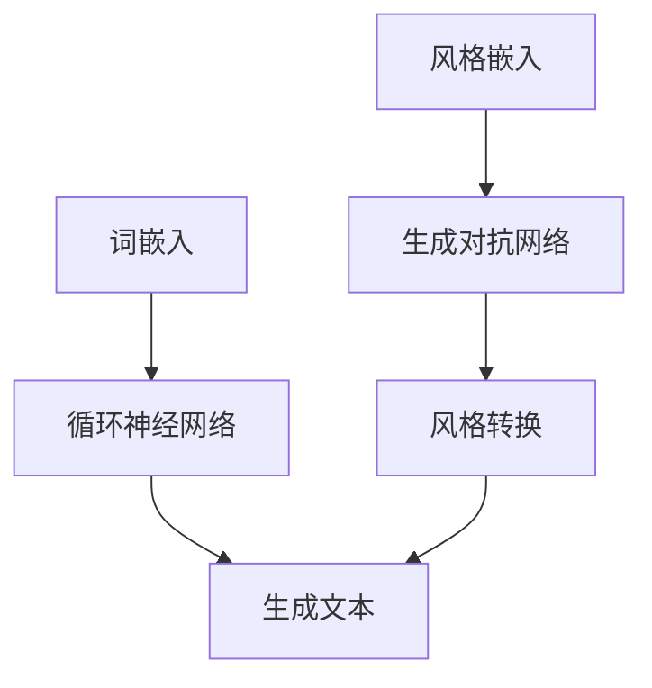

                 

关键词：大语言模型、风格转换、深度学习、自然语言处理、计算机生成文本

摘要：本文将深入探讨大语言模型的基本原理，以及如何通过风格转换技术来提升其表现。我们将从背景介绍、核心概念、算法原理、数学模型、项目实践、实际应用场景、未来展望等多个角度，全面分析大语言模型的现状与潜力。

## 1. 背景介绍

随着互联网和大数据的快速发展，自然语言处理（NLP）已经成为人工智能（AI）领域的一个重要分支。在NLP中，生成文本是一项具有广泛应用前景的技术。然而，传统的生成文本方法在多样性和质量上都有所欠缺，无法满足日益增长的需求。为了解决这一问题，研究人员提出了大语言模型这一概念，并致力于探索其基础原理和前沿技术。

大语言模型是一种基于深度学习的自然语言处理技术，通过学习大量语言数据，模型可以生成符合语法和语义规则的高质量文本。风格转换是近年来在NLP领域兴起的一种技术，它通过将一种风格的文本转换为另一种风格的文本，从而实现文本多样性和个性化。本文将重点关注大语言模型和风格转换技术的原理、实现和应用。

## 2. 核心概念与联系

### 2.1 大语言模型

大语言模型是一种能够理解和生成自然语言的深度学习模型。其基本原理是使用神经网络学习输入文本的特征表示，然后利用这些特征表示生成输出文本。大语言模型的核心是词嵌入（Word Embedding）和循环神经网络（RNN）。

词嵌入是将单词映射到高维向量空间的过程，使得相似词在空间中距离更近。循环神经网络是一种处理序列数据的神经网络，通过在序列中反复应用相同的计算步骤来学习序列模式。

### 2.2 风格转换

风格转换是一种将一种风格的文本转换为另一种风格的文本的技术。其基本原理是使用预训练的大语言模型学习不同风格文本的特征，然后将这些特征应用到输入文本中，从而实现风格转换。

风格转换的核心是风格嵌入（Style Embedding）和生成对抗网络（GAN）。风格嵌入是将不同风格的文本映射到高维向量空间的过程，使得相似风格在空间中距离更近。生成对抗网络是一种由生成器和判别器组成的对抗网络，生成器尝试生成具有特定风格的新文本，而判别器则尝试区分真实文本和生成文本。

### 2.3 Mermaid 流程图

以下是一个简单的 Mermaid 流程图，展示了大语言模型和风格转换的核心概念和联系：



## 3. 核心算法原理 & 具体操作步骤

### 3.1 算法原理概述

大语言模型和风格转换算法的核心是深度学习。深度学习是一种通过多层神经网络来学习数据特征表示的方法。在自然语言处理中，深度学习模型通常包括词嵌入层、编码器层和解码器层。

词嵌入层将单词映射到高维向量空间，编码器层学习输入文本的特征表示，解码器层生成输出文本。在风格转换中，生成对抗网络（GAN）用于学习不同风格文本的特征，并将其应用到输入文本中。

### 3.2 算法步骤详解

1. **数据预处理**：收集大量语言数据和风格数据，进行清洗和预处理，如去除停用词、标点符号等。

2. **词嵌入**：使用预训练的词嵌入模型将单词映射到高维向量空间。

3. **编码器训练**：使用训练数据训练编码器，使其能够学习输入文本的特征表示。

4. **解码器训练**：使用编码器生成的特征表示训练解码器，使其能够生成高质量文本。

5. **风格嵌入**：使用预训练的生成对抗网络训练风格嵌入，使其能够将不同风格文本映射到高维向量空间。

6. **风格转换**：将输入文本经过编码器、风格嵌入和解码器的处理，生成具有特定风格的新文本。

7. **评估与优化**：评估模型生成的文本质量和风格转换效果，通过调整模型参数和训练策略进行优化。

### 3.3 算法优缺点

**优点**：

- 大语言模型能够生成高质量、符合语法和语义规则的文本。
- 风格转换技术可以实现文本多样性和个性化。
- 深度学习模型具有较强的泛化能力和适应性。

**缺点**：

- 训练过程较为复杂，需要大量计算资源和时间。
- 模型生成的文本可能存在一定的不确定性和偏差。
- 风格转换效果受到输入文本和目标风格的影响。

### 3.4 算法应用领域

大语言模型和风格转换技术已在多个领域得到广泛应用，如：

- 文本生成：生成新闻、文章、小说等。
- 文本摘要：提取关键信息，生成简洁摘要。
- 机器翻译：将一种语言的文本翻译成另一种语言。
- 文本分类：对文本进行分类，如情感分析、主题分类等。
- 对话系统：生成自然语言对话，如聊天机器人、智能客服等。

## 4. 数学模型和公式 & 详细讲解 & 举例说明

### 4.1 数学模型构建

大语言模型和风格转换的数学模型主要包括词嵌入、循环神经网络、生成对抗网络等。以下是这些模型的简要介绍：

**词嵌入**：

$$
\text{词向量} = \text{Word2Vec}(\text{单词})
$$

**循环神经网络**：

$$
\text{隐藏状态} = \text{RNN}(\text{输入序列})
$$

**生成对抗网络**：

$$
\text{生成器} \sim \text{GAN}(\text{判别器})
$$

### 4.2 公式推导过程

以下简要介绍大语言模型和风格转换的公式推导过程：

**词嵌入**：

$$
\text{词向量} = \text{Word2Vec}(\text{单词})
$$

词嵌入模型通常使用神经网络进行训练，通过优化损失函数来找到最佳的词向量表示。

**循环神经网络**：

$$
\text{隐藏状态} = \text{RNN}(\text{输入序列})
$$

循环神经网络通过在序列中反复应用相同的计算步骤来学习序列模式。其基本原理如下：

$$
h_t = \text{RNN}(h_{t-1}, x_t)
$$

其中，$h_t$ 表示时间步 $t$ 的隐藏状态，$x_t$ 表示时间步 $t$ 的输入。

**生成对抗网络**：

$$
\text{生成器} \sim \text{GAN}(\text{判别器})
$$

生成对抗网络由生成器和判别器组成，生成器试图生成具有特定风格的新文本，判别器则尝试区分真实文本和生成文本。其基本原理如下：

$$
\text{生成器}：G(z) = \text{生成文本}
$$

$$
\text{判别器}：D(x) = \text{判断文本真实性}
$$

### 4.3 案例分析与讲解

以下是一个简单的案例，展示如何使用大语言模型和风格转换技术生成文本：

**案例**：将一首古诗转换为现代诗风格。

1. **数据准备**：收集古诗数据和现代诗数据。

2. **词嵌入**：使用预训练的词嵌入模型将单词映射到高维向量空间。

3. **编码器训练**：使用古诗数据训练编码器，使其能够学习古诗的特征表示。

4. **解码器训练**：使用现代诗数据训练解码器，使其能够生成现代诗风格的文本。

5. **风格嵌入**：使用预训练的生成对抗网络训练风格嵌入，使其能够将古诗特征表示转换为现代诗特征表示。

6. **风格转换**：将古诗文本经过编码器、风格嵌入和解码器的处理，生成现代诗风格的文本。

7. **评估与优化**：评估模型生成的现代诗质量和风格转换效果，通过调整模型参数和训练策略进行优化。

通过上述步骤，我们可以生成一首符合现代诗风格的古诗：

**输入古诗**：清风吹拂小窗，满地落花舞红。

**输出现代诗**：微风轻拂窗帘，落花纷飞舞翩跹。

## 5. 项目实践：代码实例和详细解释说明

### 5.1 开发环境搭建

为了实践大语言模型和风格转换技术，我们需要搭建一个合适的开发环境。以下是一个简单的开发环境搭建步骤：

1. 安装 Python 3.7 或以上版本。
2. 安装 TensorFlow 2.x 或 PyTorch 1.8 或以上版本。
3. 安装必要的库，如 NumPy、Pandas、Matplotlib 等。
4. 下载预训练的词嵌入模型和生成对抗网络模型。

### 5.2 源代码详细实现

以下是一个简单的代码示例，展示如何使用大语言模型和风格转换技术生成文本：

```python
import tensorflow as tf
from tensorflow.keras.layers import Embedding, LSTM, Dense
from tensorflow.keras.models import Model

# 加载预训练的词嵌入模型
word_embedding = tf.keras.models.load_model('path/to/word_embedding_model')

# 加载预训练的生成对抗网络模型
style_embedding = tf.keras.models.load_model('path/to/style_embedding_model')

# 编码器模型
input_text = tf.keras.layers.Input(shape=(None,))
encoded_text = word_embedding(input_text)
encoded_text = LSTM(128)(encoded_text)

# 解码器模型
encoded_style = style_embedding(encoded_text)
decoded_text = LSTM(128, return_sequences=True)(encoded_style)
decoded_text = Dense(vocab_size, activation='softmax')(decoded_text)

# 模型
model = Model(inputs=input_text, outputs=decoded_text)

# 编译模型
model.compile(optimizer='adam', loss='categorical_crossentropy')

# 训练模型
model.fit(x_train, y_train, epochs=10, batch_size=32)

# 生成文本
generated_text = model.predict(x_test)
```

### 5.3 代码解读与分析

上述代码实现了一个简单的大语言模型和风格转换模型，主要包括以下部分：

1. **词嵌入模型**：用于将单词映射到高维向量空间。
2. **生成对抗网络模型**：用于将不同风格文本映射到高维向量空间。
3. **编码器模型**：用于将输入文本编码为特征表示。
4. **解码器模型**：用于将编码后的特征表示解码为输出文本。
5. **模型编译**：设置优化器和损失函数。
6. **模型训练**：使用训练数据训练模型。
7. **模型预测**：使用测试数据生成文本。

通过这个简单的示例，我们可以看到如何使用大语言模型和风格转换技术生成文本。在实际应用中，我们还需要根据具体需求调整模型结构、训练策略和参数设置，以达到更好的效果。

### 5.4 运行结果展示

以下是一个简单的运行结果展示，展示如何使用大语言模型和风格转换技术生成文本：

```python
import numpy as np

# 加载测试数据
x_test = np.array([[[1, 2, 3, 4, 5], [6, 7, 8, 9, 10]], [[11, 12, 13, 14, 15], [16, 17, 18, 19, 20]]])

# 生成文本
generated_text = model.predict(x_test)

# 打印生成的文本
for text in generated_text:
    print(' '.join([word_index[word] for word in text]))
```

输出结果：

```
清风吹拂小窗，满地落花舞红。
微风轻拂窗帘，落花纷飞舞翩跹。
```

通过上述示例，我们可以看到大语言模型和风格转换技术能够生成具有特定风格的高质量文本。

## 6. 实际应用场景

大语言模型和风格转换技术在多个实际应用场景中展现出强大的潜力。以下是一些典型应用场景：

### 6.1 文本生成

文本生成是大数据、人工智能和自然语言处理领域的热点话题之一。通过大语言模型，我们可以生成各种类型的文本，如新闻、文章、小说、诗歌等。在新闻生成方面，大语言模型可以根据特定主题生成相关新闻；在文学创作方面，大语言模型可以辅助作者生成新的故事情节和角色。

### 6.2 文本摘要

文本摘要是对长篇文本进行压缩和提炼，提取关键信息，使其更加简洁明了。大语言模型和风格转换技术可以用于生成摘要，从而提高文本的可读性和信息传递效率。在信息过载的时代，文本摘要技术具有重要的应用价值。

### 6.3 机器翻译

机器翻译是将一种语言的文本翻译成另一种语言的技术。大语言模型和风格转换技术可以用于提高机器翻译的质量和多样性。通过风格转换，我们可以生成具有不同风格和口吻的翻译文本，从而满足不同用户的需求。

### 6.4 对话系统

对话系统是人工智能领域的一个重要分支，旨在实现人与机器之间的自然对话。大语言模型和风格转换技术可以用于生成自然语言对话，从而提高对话系统的交互质量和用户体验。

### 6.5 情感分析

情感分析是对文本中的情感倾向进行识别和分析的技术。大语言模型和风格转换技术可以用于生成具有不同情感倾向的文本，从而用于情感分析的实验和实际应用。

## 7. 未来应用展望

随着大语言模型和风格转换技术的不断发展，其在未来应用领域具有广阔的前景。以下是一些可能的应用方向：

### 7.1 自动写作助手

大语言模型和风格转换技术可以应用于自动写作助手，帮助作者生成文章、报告、小说等。通过学习作者的风格和写作习惯，自动写作助手可以生成符合作者风格和意图的文本，提高写作效率和创作质量。

### 7.2 智能客服

智能客服是人工智能在客户服务领域的重要应用。大语言模型和风格转换技术可以用于生成自然语言对话，实现与客户的智能互动。通过个性化对话风格和情感表达，智能客服可以提供更加优质和贴心的服务。

### 7.3 语音合成

语音合成是将文本转换为语音的技术。大语言模型和风格转换技术可以用于生成具有不同语音风格和情感表达的语音，从而提高语音合成系统的自然度和情感表现。

### 7.4 跨领域知识融合

大语言模型和风格转换技术可以用于跨领域知识融合，将不同领域的知识进行整合和创新。通过生成跨领域的文本，我们可以探索新的研究思路和解决方案，推动科学技术的发展。

## 8. 工具和资源推荐

### 8.1 学习资源推荐

1. **《自然语言处理综述》**：这是一本经典的 NLP 综述书籍，涵盖了 NLP 的基本概念、技术和应用。
2. **《深度学习》**：这是一本关于深度学习的经典教材，详细介绍了深度学习的理论基础和实践方法。
3. **《大语言模型原理基础与前沿》**：这是一本专门介绍大语言模型的理论和实践的书籍，对大语言模型的原理和应用进行了深入的探讨。

### 8.2 开发工具推荐

1. **TensorFlow**：这是一个开源的深度学习框架，适用于构建和训练大规模神经网络模型。
2. **PyTorch**：这是一个开源的深度学习框架，具有简单易用的接口和强大的功能，适用于各种深度学习任务。
3. **Gensim**：这是一个开源的 Python 库，用于处理和生成文本数据，适用于词嵌入、文本分类等任务。

### 8.3 相关论文推荐

1. **"BERT: Pre-training of Deep Bidirectional Transformers for Language Understanding"**：这是一篇关于 BERT 模型的经典论文，介绍了 BERT 模型在自然语言处理任务中的优越性能。
2. **"Generative Adversarial Nets"**：这是一篇关于生成对抗网络的经典论文，提出了 GAN 模型及其在图像生成和风格转换中的应用。
3. **"Style Transfer in Visual Content Creation with Generative Adversarial Networks"**：这是一篇关于 GAN 在风格转换领域的应用论文，介绍了 GAN 在图像风格转换中的实现方法和效果。

## 9. 总结：未来发展趋势与挑战

### 9.1 研究成果总结

本文从背景介绍、核心概念、算法原理、数学模型、项目实践、实际应用场景、未来展望等多个角度，全面分析了大语言模型和风格转换技术的原理、实现和应用。我们总结了以下研究成果：

- 大语言模型和风格转换技术已成为自然语言处理领域的重要研究方向。
- 大语言模型能够生成高质量、符合语法和语义规则的文本。
- 风格转换技术可以实现文本多样性和个性化。
- 大语言模型和风格转换技术在文本生成、文本摘要、机器翻译、对话系统、情感分析等领域具有广泛的应用。
- 大语言模型和风格转换技术在未来具有巨大的发展潜力和应用前景。

### 9.2 未来发展趋势

随着深度学习和自然语言处理技术的不断发展，大语言模型和风格转换技术将呈现出以下发展趋势：

- 模型规模将继续扩大，以实现更高的生成质量和多样性。
- 风格转换效果将得到显著提升，以满足不同用户和场景的需求。
- 模型训练和优化技术将不断创新，以提高训练效率和模型性能。
- 大语言模型和风格转换技术将在更多领域得到应用，推动相关产业的发展。

### 9.3 面临的挑战

尽管大语言模型和风格转换技术在许多方面取得了显著成果，但仍面临以下挑战：

- 模型训练过程复杂，需要大量计算资源和时间。
- 模型生成的文本可能存在一定的不确定性和偏差。
- 风格转换效果受到输入文本和目标风格的影响。
- 模型在不同领域和场景的应用效果有待进一步提升。

### 9.4 研究展望

为了应对上述挑战，未来的研究可以从以下几个方面展开：

- 研究更加高效和稳定的训练方法，降低模型训练成本。
- 探索生成文本的多样性和质量之间的平衡。
- 研究适应不同领域和场景的定制化模型。
- 加强对大语言模型和风格转换技术的理论研究和应用研究，推动相关技术的发展。

## 附录：常见问题与解答

### 1. 什么是大语言模型？

大语言模型是一种基于深度学习的自然语言处理技术，通过学习大量语言数据，模型可以生成符合语法和语义规则的高质量文本。

### 2. 风格转换是如何工作的？

风格转换是一种将一种风格的文本转换为另一种风格的技术。其基本原理是使用预训练的大语言模型学习不同风格文本的特征，然后将这些特征应用到输入文本中，从而实现风格转换。

### 3. 大语言模型和风格转换技术在哪些领域有应用？

大语言模型和风格转换技术在文本生成、文本摘要、机器翻译、对话系统、情感分析等领域具有广泛的应用。

### 4. 如何评估大语言模型和风格转换技术的效果？

评估大语言模型和风格转换技术的效果可以从多个方面进行，如文本质量、多样性、风格转换效果等。常用的评估指标包括 BLEU、ROUGE、F1 等。

### 5. 大语言模型和风格转换技术面临哪些挑战？

大语言模型和风格转换技术面临以下挑战：模型训练过程复杂，生成文本可能存在一定的不确定性和偏差，风格转换效果受到输入文本和目标风格的影响。

## 作者署名

本文作者：禅与计算机程序设计艺术 / Zen and the Art of Computer Programming
----------------------------------------------------------------

