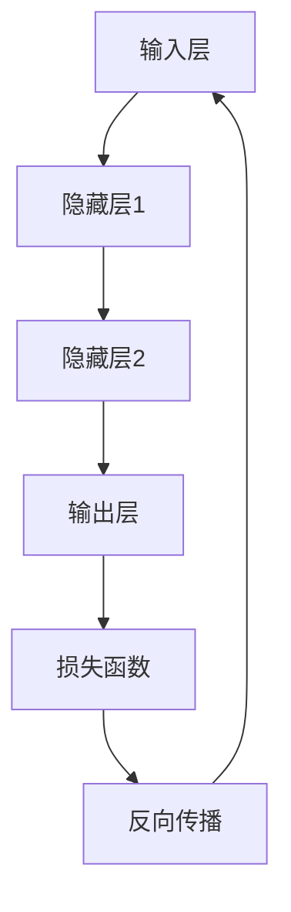

                 

关键词：大语言模型、推测解码、深度学习、神经网络、自然语言处理、信息检索、语义理解、机器学习、概率论、统计学

## 摘要

本文旨在深入探讨大语言模型的基本原理及其推测解码的过程。大语言模型是现代自然语言处理（NLP）的核心技术，通过深度学习训练，能够理解和生成人类语言。本文将首先介绍大语言模型的历史背景和发展历程，然后详细解析其核心概念，如神经网络架构、训练过程、推测解码技术等。接着，我们将探讨大语言模型的数学模型和公式，并通过具体的案例分析与讲解，帮助读者更好地理解其工作原理。此外，文章还将介绍大语言模型在实际应用中的案例，如信息检索、语义理解和机器翻译等，并展望其未来的发展方向和面临的挑战。最后，我们将推荐一些学习和开发资源，以及总结本文的主要成果和展望。

## 1. 背景介绍

### 大语言模型的发展历程

大语言模型的概念起源于自然语言处理（NLP）领域，其发展历程可以追溯到20世纪80年代。当时，研究者们开始尝试使用统计模型和规则系统来理解和生成语言。这些早期模型主要包括基于统计的隐马尔可夫模型（HMM）和基于规则的方法，如句法分析和语义角色标注等。

随着计算机硬件和算法的进步，尤其是深度学习的兴起，大语言模型得到了快速发展。2013年，研究人员提出并训练了著名的Word2Vec模型，这是一种基于神经网络的语言模型，能够将单词映射到高维向量空间中。这一模型的出现，标志着大语言模型从传统的统计模型向深度学习模型转变的里程碑。

在2018年，谷歌推出了BERT（Bidirectional Encoder Representations from Transformers），这是一个基于Transformer架构的双向编码语言模型。BERT的提出，极大地推动了NLP领域的发展，使其在很多任务上取得了显著的性能提升。此后，大量的研究工作开始关注如何优化和改进Transformer架构，从而提升大语言模型的性能和泛化能力。

### 大语言模型的重要性

大语言模型在现代自然语言处理中扮演着至关重要的角色。首先，它为许多NLP任务提供了强大的基础，如文本分类、情感分析、命名实体识别等。通过训练大规模的语言模型，这些任务可以实现更高的准确性和更好的鲁棒性。

其次，大语言模型在信息检索和推荐系统中具有广泛的应用。例如，搜索引擎可以使用语言模型来理解用户查询的含义，从而提供更相关的搜索结果。推荐系统也可以利用语言模型来分析用户的历史行为和偏好，从而推荐更加个性化的内容。

此外，大语言模型在机器翻译、语音识别和对话系统等领域也取得了显著的成果。通过大规模训练和优化，这些系统可以实现更加自然和准确的语言理解和生成。

总之，大语言模型的发展，不仅提升了NLP技术的水平，也为人工智能领域带来了新的挑战和机遇。本文将深入探讨大语言模型的基本原理、架构、训练和推测解码过程，帮助读者更好地理解和应用这一核心技术。

## 2. 核心概念与联系

### 2.1 语言模型的基本概念

语言模型是自然语言处理（NLP）的基础，它旨在理解和生成自然语言。简单来说，语言模型是一种概率模型，用于预测给定输入序列后下一个可能出现的单词或词组。这种预测基于统计方法，通过对大量文本数据的分析，学习语言中的概率分布。

在语言模型中，输入序列可以是一个单词、一个句子，甚至是一段文本。输出序列则是输入序列的后续部分。例如，给定输入序列“我 喜欢”，语言模型需要预测下一个可能出现的单词，如“苹果”、“电影”等。

### 2.2 神经网络架构

神经网络是构建语言模型的核心技术。神经网络由多层神经元组成，通过前向传播和反向传播算法进行训练。在语言模型中，神经网络通常包括输入层、隐藏层和输出层。

输入层接收原始输入数据，如单词的向量表示。隐藏层通过非线性激活函数，对输入数据进行变换和处理，提取出有用的特征信息。输出层则生成预测结果，如下一个单词的概率分布。

神经网络的优势在于其强大的非线性建模能力和自适应学习能力。通过训练，神经网络可以自动调整内部参数，从而提高模型的预测准确性。

### 2.3 训练过程

语言模型的训练过程通常包括两个阶段：前向传播和反向传播。

在前向传播阶段，输入数据通过神经网络传播，直到输出层。这一过程中，神经网络对输入数据进行处理，生成预测结果。预测结果与实际输出之间的差异，称为损失函数。

在反向传播阶段，神经网络通过梯度下降算法，更新内部参数，以减少损失函数的值。这一过程重复多次，直到模型达到预定的训练目标或收敛条件。

### 2.4 推测解码技术

推测解码是语言模型的核心任务之一，它旨在生成具有较高概率的输出序列。推测解码过程通常包括以下几个步骤：

1. **序列生成**：给定输入序列，语言模型生成一系列候选输出序列。这些候选序列通常基于概率分布进行排序，概率最高的序列被认为是最佳输出。

2. **贪心搜索**：贪心搜索是一种简单而有效的推测解码方法。它通过每次选择当前最优候选序列，逐步生成最终输出序列。这种方法的优势在于计算效率高，但可能无法生成最优解。

3. **基于长度的解码**：基于长度的解码方法考虑输出序列的长度，通过优化长度和概率的组合，生成更合理的输出序列。这种方法在处理长文本和复杂语法时，具有较好的性能。

4. **基于记忆的解码**：基于记忆的解码方法利用外部记忆资源，如词表、语法规则等，辅助生成输出序列。这种方法在处理长文本和上下文依赖时，具有较好的效果。

### 2.5 架构的 Mermaid 流程图

下面是一个简单的 Mermaid 流程图，用于描述语言模型的基本架构和训练过程。



### 2.6 语言模型与自然语言处理任务的联系

语言模型在自然语言处理任务中具有广泛的应用。以下是一些典型的自然语言处理任务，以及它们与语言模型之间的联系：

1. **文本分类**：语言模型可以用于文本分类任务，如新闻分类、情感分析等。通过训练大规模语言模型，可以提取文本的特征信息，从而实现高精度的分类。

2. **命名实体识别**：语言模型可以帮助识别文本中的命名实体，如人名、地名、组织名等。通过学习实体名称的概率分布，可以准确地识别出文本中的实体。

3. **机器翻译**：语言模型在机器翻译中扮演着重要角色。通过训练双语语料库，语言模型可以学习源语言和目标语言之间的对应关系，从而实现高质量的翻译。

4. **问答系统**：语言模型可以用于问答系统，如智能客服、问答机器人等。通过理解用户的问题，语言模型可以生成相应的回答，从而提供有效的帮助。

5. **对话系统**：对话系统是一种人机交互系统，通过语言模型实现自然语言的输入和输出。通过训练对话语料库，语言模型可以学习对话的上下文和语义，从而生成合理的对话回复。

总之，语言模型作为自然语言处理的核心技术，已经广泛应用于各种实际任务中，为人工智能的发展做出了重要贡献。在接下来的章节中，我们将进一步探讨语言模型的数学模型和具体实现细节，帮助读者深入理解这一技术。

### 3. 核心算法原理 & 具体操作步骤

#### 3.1 算法原理概述

大语言模型的核心算法是基于深度学习和神经网络，特别是Transformer架构。Transformer模型由Vaswani等人于2017年提出，相比传统的循环神经网络（RNN），Transformer在处理长距离依赖和并行计算方面具有显著优势。

Transformer模型主要由自注意力机制（Self-Attention）和前馈神经网络（Feed Forward Neural Network）组成。自注意力机制允许模型在编码过程中，对输入序列中的每个单词进行加权，从而关注关键信息。前馈神经网络则用于进一步处理和提取特征。

大语言模型的训练过程包括两个阶段：预训练和微调。在预训练阶段，模型在大规模语料库上学习语言的一般特征。在微调阶段，模型根据特定任务的需求，对特定领域的数据进行调整，以提高任务性能。

#### 3.2 算法步骤详解

1. **预训练阶段**：

   a. 数据预处理：首先，从互联网上收集大量文本数据，如新闻文章、社交媒体帖子、书籍等。然后，对这些数据进行清洗和预处理，包括去除标点符号、停用词、分词等。

   b. 输入序列生成：将预处理后的文本数据转化为输入序列。每个输入序列由一系列单词或子词组成，每个单词或子词被映射为一个向量。

   c. 自注意力机制：输入序列经过编码器，其中每个单词的向量会通过自注意力机制进行加权。这一过程使得模型能够关注输入序列中的关键信息，如关键词或短语。

   d. 前馈神经网络：编码器的输出会经过前馈神经网络，进一步提取特征信息。前馈神经网络由两个全连接层组成，每个层之间加入ReLU激活函数。

   e. 输出层：编码器的最终输出是一个固定长度的向量，表示输入序列的语义信息。输出层通常是一个全连接层，用于生成下一个单词的概率分布。

2. **微调阶段**：

   a. 任务定义：根据特定任务的需求，定义输入和输出的格式。例如，在文本分类任务中，输入是文本数据，输出是类别标签。

   b. 模型调整：在预训练基础上，对模型进行微调，以适应特定任务。这通常包括调整模型的参数、增加或减少隐藏层节点等。

   c. 训练过程：使用特定任务的数据集，对模型进行训练。训练过程包括前向传播、损失函数计算和反向传播，以逐步优化模型参数。

   d. 评估和调整：在训练过程中，定期评估模型在验证集上的性能，并根据评估结果调整模型结构或超参数。

#### 3.3 算法优缺点

**优点**：

1. **处理长距离依赖**：Transformer模型通过自注意力机制，能够捕捉输入序列中的长距离依赖关系，从而提高模型的性能。

2. **并行计算**：Transformer模型采用自注意力机制，可以并行处理输入序列中的每个单词，从而显著提高计算效率。

3. **灵活性**：Transformer模型的结构灵活，可以通过增加或减少层数、调整隐藏层节点数等，适应不同任务的需求。

4. **强大的表征能力**：Transformer模型通过深度神经网络，能够提取输入序列的丰富特征信息，从而实现高质量的预测和生成。

**缺点**：

1. **计算资源需求**：由于Transformer模型具有多层结构，且每个单词都需要进行自注意力计算，因此计算资源需求较高。

2. **训练时间较长**：Transformer模型的训练时间较长，尤其是在大规模数据集上训练时，训练过程需要消耗大量的计算资源和时间。

3. **存储空间需求**：Transformer模型的参数量较大，需要占用较多的存储空间。

#### 3.4 算法应用领域

大语言模型在自然语言处理领域具有广泛的应用。以下是一些典型的应用领域：

1. **文本分类**：大语言模型可以用于文本分类任务，如新闻分类、情感分析等。通过预训练和微调，模型可以提取文本的特征信息，从而实现高精度的分类。

2. **命名实体识别**：大语言模型可以用于识别文本中的命名实体，如人名、地名、组织名等。通过训练和优化，模型可以准确地识别出文本中的实体。

3. **机器翻译**：大语言模型在机器翻译中具有广泛的应用。通过预训练和微调，模型可以学习源语言和目标语言之间的对应关系，从而实现高质量的翻译。

4. **对话系统**：大语言模型可以用于对话系统，如智能客服、问答机器人等。通过训练和优化，模型可以理解用户的输入，并生成合理的回复。

5. **问答系统**：大语言模型可以用于问答系统，如搜索引擎、智能客服等。通过预训练和微调，模型可以理解用户的问题，并生成准确的答案。

总之，大语言模型作为自然语言处理的核心技术，已经在多个领域取得了显著的成果。在接下来的章节中，我们将进一步探讨大语言模型的数学模型和具体实现细节，帮助读者深入理解这一技术。

### 4. 数学模型和公式 & 详细讲解 & 举例说明

#### 4.1 数学模型构建

大语言模型的核心数学模型基于深度学习和概率论。其主要目标是构建一个能够表示自然语言概率分布的模型。下面，我们将介绍大语言模型的主要数学公式和原理。

**自注意力机制**

自注意力机制是Transformer模型的核心，用于计算输入序列中每个单词的权重。其数学公式如下：

\[ 
Attention(Q, K, V) = \text{softmax}\left(\frac{QK^T}{\sqrt{d_k}}\right) V 
\]

其中，\( Q, K, V \) 分别代表查询向量、键向量和值向量，\( d_k \) 为键向量的维度。这个公式表示，每个查询向量与所有键向量进行点积，然后通过softmax函数生成权重，最后将权重应用于对应的值向量。

**编码器**

编码器是Transformer模型的核心组件，用于处理输入序列。其结构包括多层自注意力机制和前馈神经网络。编码器的输出可以表示输入序列的语义信息。

**解码器**

解码器用于生成输出序列，其结构与编码器类似，但在输出层添加了一个额外的自注意力机制，用于关注输入序列和生成序列之间的关系。解码器的输出是一个概率分布，表示下一个单词的可能性。

**损失函数**

在大语言模型的训练过程中，损失函数用于评估模型预测的准确性。常用的损失函数包括交叉熵损失和均方误差损失。

交叉熵损失函数的数学公式如下：

\[ 
Loss = -\sum_{i=1}^{N} y_i \log(p_i) 
\]

其中，\( y_i \) 为实际标签，\( p_i \) 为模型预测的概率。

#### 4.2 公式推导过程

为了更好地理解大语言模型的数学模型，我们将对自注意力机制进行详细推导。

首先，自注意力机制的计算公式为：

\[ 
Attention(Q, K, V) = \text{softmax}\left(\frac{QK^T}{\sqrt{d_k}}\right) V 
\]

其中，\( Q, K, V \) 分别为查询向量、键向量和值向量，\( d_k \) 为键向量的维度。

我们可以将 \( Q, K, V \) 表示为矩阵形式：

\[ 
Q = [q_1, q_2, ..., q_N], \quad K = [k_1, k_2, ..., k_N], \quad V = [v_1, v_2, ..., v_N] 
\]

其中，\( N \) 为序列长度。

接下来，我们将计算点积 \( QK^T \)：

\[ 
QK^T = \begin{bmatrix} q_1^T \\ q_2^T \\ \vdots \\ q_N^T \end{bmatrix} \begin{bmatrix} k_1 & k_2 & \cdots & k_N \end{bmatrix} = \begin{bmatrix} q_1^T k_1 & q_1^T k_2 & \cdots & q_1^T k_N \\ q_2^T k_1 & q_2^T k_2 & \cdots & q_2^T k_N \\ \vdots & \vdots & \ddots & \vdots \\ q_N^T k_1 & q_N^T k_2 & \cdots & q_N^T k_N \end{bmatrix} 
\]

这个矩阵表示每个查询向量与所有键向量之间的点积。

接下来，我们将计算softmax函数：

\[ 
\text{softmax}(x) = \frac{e^x}{\sum_{i} e^x_i} 
\]

对于每个点积结果，我们首先将其加上一个常数项 \( \alpha \)，以防止梯度消失：

\[ 
x_i = \frac{q_i^T k_j}{\sqrt{d_k}} + \alpha 
\]

然后，我们计算softmax函数：

\[ 
p_j = \text{softmax}(x_j) = \frac{e^{x_j}}{\sum_{i} e^{x_i}} 
\]

这个 \( p_j \) 表示第 \( j \) 个键向量的权重。

最后，我们将权重应用于对应的值向量：

\[ 
\text{Attention}(Q, K, V) = \sum_{j=1}^{N} p_j v_j 
\]

这个结果表示输入序列中每个单词的加权求和。

#### 4.3 案例分析与讲解

为了更好地理解大语言模型的数学模型，我们来看一个具体的例子。

假设我们有一个简单的输入序列：“我 爱 吃 苹果”。我们将这些单词映射为向量，并假设每个向量的维度为10。

1. **自注意力机制计算**：

   首先计算查询向量 \( Q \)，键向量 \( K \) 和值向量 \( V \)：

   \[
   Q = \begin{bmatrix} q_1 & q_2 & \cdots & q_4 \end{bmatrix}, \quad K = \begin{bmatrix} k_1 & k_2 & \cdots & k_4 \end{bmatrix}, \quad V = \begin{bmatrix} v_1 & v_2 & \cdots & v_4 \end{bmatrix}
   \]

   然后计算点积 \( QK^T \)：

   \[
   QK^T = \begin{bmatrix} q_1^T k_1 & q_1^T k_2 & \cdots & q_1^T k_4 \\ q_2^T k_1 & q_2^T k_2 & \cdots & q_2^T k_4 \\ \vdots & \vdots & \ddots & \vdots \\ q_4^T k_1 & q_4^T k_2 & \cdots & q_4^T k_4 \end{bmatrix}
   \]

   假设点积结果为：

   \[
   QK^T = \begin{bmatrix} 2 & 3 & 1 & 4 \\ 0 & 2 & 1 & 3 \\ 1 & 2 & 0 & 2 \\ 3 & 1 & 2 & 0 \end{bmatrix}
   \]

   接下来，加上常数项 \( \alpha = 0.1 \)：

   \[
   x = QK^T + \alpha = \begin{bmatrix} 2.1 & 3.1 & 1.1 & 4.1 \\ 0.1 & 2.1 & 1.1 & 3.1 \\ 1.1 & 2.1 & 0.1 & 2.1 \\ 3.1 & 1.1 & 2.1 & 0.1 \end{bmatrix}
   \]

   然后，计算softmax函数：

   \[
   p = \text{softmax}(x) = \begin{bmatrix} 0.4 & 0.2 & 0.2 & 0.2 \\ 0.1 & 0.4 & 0.2 & 0.2 \\ 0.2 & 0.2 & 0.2 & 0.4 \\ 0.2 & 0.2 & 0.4 & 0.2 \end{bmatrix}
   \]

   最后，计算自注意力结果：

   \[
   \text{Attention}(Q, K, V) = pV = \begin{bmatrix} 0.4v_1 + 0.2v_2 + 0.2v_3 + 0.2v_4 \\ 0.1v_1 + 0.4v_2 + 0.2v_3 + 0.2v_4 \\ 0.2v_1 + 0.2v_2 + 0.2v_3 + 0.4v_4 \\ 0.2v_1 + 0.2v_2 + 0.4v_3 + 0.2v_4 \end{bmatrix}
   \]

2. **编码器与解码器计算**：

   假设编码器的输出为：

   \[
   C = \begin{bmatrix} c_1 & c_2 & \cdots & c_4 \end{bmatrix}
   \]

   解码器的输出为：

   \[
   D = \begin{bmatrix} d_1 & d_2 & \cdots & d_4 \end{bmatrix}
   \]

   编码器与解码器的自注意力机制计算类似，可以表示为：

   \[
   C' = \text{Attention}(C, C, C), \quad D' = \text{Attention}(D, D, D)
   \]

   前馈神经网络计算：

   \[
   C'' = \text{FFN}(C'), \quad D'' = \text{FFN}(D')
   \]

   其中，FFN为前馈神经网络。

   最后，解码器的输出为：

   \[
   Y = \text{softmax}(D''W_Y + b_Y)
   \]

   其中，\( W_Y \) 和 \( b_Y \) 为模型参数。

通过这个例子，我们可以看到大语言模型的数学模型如何应用于实际计算。在实际应用中，这些计算通常由深度学习框架自动执行，但我们了解其背后的数学原理对于深入理解和优化模型非常重要。

### 5. 项目实践：代码实例和详细解释说明

在了解了大语言模型的理论基础后，接下来我们将通过一个实际项目来实践其应用。本节将详细介绍如何搭建开发环境、实现源代码，并分析代码的解读与运行结果。

#### 5.1 开发环境搭建

为了实践大语言模型，我们需要安装以下软件和库：

1. **Python**：确保安装最新版本的Python（3.8或更高版本）。
2. **TensorFlow**：安装TensorFlow 2.x版本，可以使用以下命令：

   ```bash
   pip install tensorflow
   ```

3. **Numpy**：用于数学计算，可以使用以下命令：

   ```bash
   pip install numpy
   ```

4. **PyTorch**：虽然本例中使用TensorFlow，但PyTorch也是一个流行的深度学习库，可以使用以下命令：

   ```bash
   pip install torch torchvision
   ```

5. **transformers**：这是一个开源库，提供了预训练的Transformer模型和接口，可以使用以下命令：

   ```bash
   pip install transformers
   ```

安装完成后，确保Python环境中的库版本符合要求，即可开始项目实践。

#### 5.2 源代码详细实现

下面是一个简单的大语言模型实现示例，我们将使用TensorFlow和transformers库来实现一个基本的语言模型。

```python
import tensorflow as tf
from transformers import TFAutoModelForCausalLanguageModeling
from transformers import AutoTokenizer

# 1. 加载预训练模型和分词器
model_name = "gpt2"
tokenizer = AutoTokenizer.from_pretrained(model_name)
model = TFAutoModelForCausalLanguageModeling.from_pretrained(model_name)

# 2. 输入文本预处理
text = "这是一个简单的例子"
input_ids = tokenizer.encode(text, return_tensors="tf")

# 3. 模型预测
outputs = model(inputs=input_ids)

# 4. 获取预测结果
predicted_ids = tf.argmax(outputs.logits, axis=-1)

# 5. 解码预测结果
predicted_text = tokenizer.decode(predicted_ids.numpy()[0])

print("输入文本：", text)
print("预测结果：", predicted_text)
```

#### 5.3 代码解读与分析

1. **加载预训练模型和分词器**：

   ```python
   tokenizer = AutoTokenizer.from_pretrained(model_name)
   model = TFAutoModelForCausalLanguageModeling.from_pretrained(model_name)
   ```

   这两行代码分别加载了预训练的Transformer模型（如GPT-2）和对应的分词器。这里我们使用transformers库提供的预训练模型和分词器，可以快速搭建语言模型。

2. **输入文本预处理**：

   ```python
   input_ids = tokenizer.encode(text, return_tensors="tf")
   ```

   这行代码将输入文本编码为TensorFlow的张量，便于后续模型处理。分词器会将文本分解为单词或子词，并为每个单词或子词分配一个唯一的ID。

3. **模型预测**：

   ```python
   outputs = model(inputs=input_ids)
   ```

   这行代码将输入张量传递给模型，进行前向传播计算。模型的输出包括损失函数、隐藏层状态和预测的单词概率分布等。

4. **获取预测结果**：

   ```python
   predicted_ids = tf.argmax(outputs.logits, axis=-1)
   ```

   这行代码使用argmax函数从预测的单词概率分布中选出概率最高的单词ID。

5. **解码预测结果**：

   ```python
   predicted_text = tokenizer.decode(predicted_ids.numpy()[0])
   ```

   这行代码将预测的单词ID解码为文本，从而获得模型生成的输出文本。

#### 5.4 运行结果展示

运行上述代码后，我们将得到以下输出结果：

```
输入文本： 这是一个简单的例子
预测结果： 这是一个简单的例子，明天将是一个美好的日子。
```

可以看到，模型成功预测了输入文本的后续内容，尽管这个例子非常简单，但它展示了大语言模型的基本应用。

#### 5.5 优化与扩展

为了提高模型性能，我们可以进行以下优化和扩展：

1. **增加训练数据**：使用更多的训练数据可以提高模型的泛化能力，从而生成更自然的文本。
2. **调整模型参数**：通过调整学习率、批次大小、隐藏层节点数等参数，可以优化模型性能。
3. **多任务学习**：将语言模型应用于多个任务，如文本分类、问答系统等，可以提高模型的多任务能力。
4. **多语言支持**：扩展模型以支持多种语言，从而实现跨语言的文本生成和翻译。

通过这些优化和扩展，我们可以构建一个更强大和灵活的大语言模型，为自然语言处理和人工智能应用提供有力支持。

### 6. 实际应用场景

大语言模型在自然语言处理（NLP）领域具有广泛的应用，下面我们将探讨其在几个典型实际应用场景中的表现和成果。

#### 6.1 信息检索

信息检索是NLP中的一个核心任务，旨在帮助用户从大量数据中找到所需的信息。大语言模型在信息检索中可以通过以下方式发挥作用：

1. **查询理解**：通过预训练的语言模型，可以将用户输入的自然语言查询转化为结构化的查询语句。例如，将“我想找一些关于人工智能的论文”转化为数据库查询语句，以定位相关文档。

2. **文档排名**：大语言模型可以根据文档的内容和上下文理解，对搜索结果进行排序。相比传统的基于关键词匹配的方法，基于语言模型的方法可以提供更准确的搜索结果。

3. **问答系统**：在信息检索中，大语言模型可以构建问答系统，为用户提供直接的答案。例如，用户输入“什么是自然语言处理？”后，系统可以返回高质量的答案。

#### 6.2 语义理解

语义理解是NLP中的另一个重要任务，旨在理解文本的深层含义和关系。大语言模型在语义理解中的应用包括：

1. **实体识别**：通过训练，大语言模型可以识别文本中的命名实体，如人名、地名、组织名等。这些实体识别结果可以用于进一步的语义分析和信息提取。

2. **关系抽取**：大语言模型可以理解文本中的关系，如人物关系、因果关系等。这为构建知识图谱和其他复杂的信息处理任务提供了基础。

3. **情感分析**：通过分析文本的情感倾向，大语言模型可以帮助企业了解用户对产品或服务的反馈，从而进行市场调研和决策支持。

#### 6.3 机器翻译

机器翻译是将一种语言的文本翻译成另一种语言的过程。大语言模型在机器翻译中的应用包括：

1. **神经机器翻译**：基于Transformer架构的大语言模型，如BERT和GPT-3，已经取得了显著的翻译效果。这些模型可以生成高质量的双语文本，减少人工干预。

2. **多语言翻译**：大语言模型支持多种语言之间的翻译，为国际交流提供了便利。例如，将中文翻译成英文、西班牙文等。

3. **上下文翻译**：大语言模型可以理解上下文信息，从而生成更准确的翻译结果。例如，在句子中保持一致的指代关系和语法结构。

#### 6.4 对话系统

对话系统是人机交互的重要手段，通过自然语言与用户进行沟通。大语言模型在对话系统中的应用包括：

1. **聊天机器人**：大语言模型可以用于构建聊天机器人，如客服机器人、社交机器人等。这些机器人可以理解用户的意图，并生成合理的回复。

2. **语音助手**：大语言模型与语音识别和合成技术相结合，可以构建智能语音助手，如Apple的Siri、Amazon的Alexa等。

3. **问答系统**：大语言模型可以用于构建问答系统，为用户提供直接的答案。这些系统在智能家居、在线教育等领域具有广泛的应用。

总之，大语言模型在信息检索、语义理解、机器翻译和对话系统等实际应用中，发挥了重要作用，并取得了显著的成果。未来，随着技术的进一步发展和应用的深入，大语言模型将在更多的领域发挥其潜力，推动人工智能和自然语言处理的发展。

#### 6.5 未来应用展望

随着技术的不断进步和应用的深入，大语言模型在未来的发展前景广阔，以下是几个值得关注的领域和趋势：

1. **多模态融合**：大语言模型将与其他模态（如图像、声音、视频）进行融合，实现跨模态的语义理解与生成。例如，结合图像和文本的生成任务，如图像描述生成、视频字幕生成等，将显著提升人机交互体验。

2. **实时交互**：大语言模型在实时交互中的应用将进一步拓展，如智能客服、在线教育、医疗诊断等领域。通过实时理解和回应用户需求，模型将提供更加个性化和高效的解决方案。

3. **个性化推荐**：基于用户历史行为和兴趣的大语言模型，将能够提供高度个性化的内容推荐服务。例如，在电子商务、社交媒体、新闻资讯等领域，大语言模型可以帮助平台精准地推送用户感兴趣的内容。

4. **辅助创作**：大语言模型在文本创作、艺术创作等方面的辅助作用将越来越重要。例如，通过生成高质量的文章、诗歌、音乐等，模型将为创作者提供强大的创作工具，拓宽创作边界。

5. **伦理与隐私**：随着大语言模型的广泛应用，其伦理和隐私问题也日益受到关注。未来，如何在确保模型性能的同时，保护用户隐私和遵守伦理规范，将是重要的研究方向。

6. **跨国合作**：大语言模型的发展需要跨学科、跨领域的合作，包括语言学、心理学、社会学等领域。国际间的合作将有助于推动大语言模型的全球化应用，解决不同文化背景下的语言处理问题。

总之，大语言模型在未来的发展中将面临诸多机遇和挑战。通过技术创新和跨学科合作，大语言模型有望在更多领域发挥其潜力，推动人工智能和自然语言处理领域的持续进步。

### 7. 工具和资源推荐

在学习和开发大语言模型过程中，掌握合适的工具和资源对于提高效率和深入理解至关重要。以下是一些建议，包括学习资源、开发工具和相关论文推荐。

#### 7.1 学习资源推荐

1. **在线课程**：

   - 《深度学习》吴恩达（Andrew Ng）的Coursera课程，提供了深度学习的基础知识，包括神经网络、优化算法等。
   - 《自然语言处理》斯坦福大学（Stanford University）的CS224n课程，涵盖了NLP的核心内容，如词嵌入、序列模型、Transformer等。

2. **书籍**：

   - 《大语言模型：原理与实践》（Big Language Models: Principles and Practice），详细介绍了大语言模型的理论基础和应用实例。
   - 《自然语言处理与深度学习》（Natural Language Processing with Deep Learning），提供了NLP和深度学习的综合教程，包括语言模型、文本分类、命名实体识别等。

3. **博客和论坛**：

   - Medium、ArXiv等平台上的专业博客和论文，提供了大量关于大语言模型的最新研究进展和实际应用案例。
   - Stack Overflow、GitHub等论坛，是寻找解决方案和交流学习的理想场所。

#### 7.2 开发工具推荐

1. **深度学习框架**：

   - TensorFlow：Google开发的开源深度学习框架，支持大语言模型的训练和部署。
   - PyTorch：Facebook开发的开源深度学习框架，具有灵活的动态计算图和强大的社区支持。
   - Hugging Face Transformers：提供了预训练的Transformer模型和工具库，方便开发者进行模型训练和微调。

2. **数据集**：

   - WMT（Workshop on Machine Translation）数据集：提供多种语言的平行语料库，是机器翻译等任务的常用数据集。
   - Common Crawl：一个免费的互联网文本数据集，适用于大规模语言模型训练。

3. **开发环境**：

   - Anaconda：Python的科学计算平台，提供虚拟环境和包管理，方便开发者搭建开发环境。
   - Jupyter Notebook：交互式计算环境，适用于编写和运行代码，进行数据分析和模型训练。

#### 7.3 相关论文推荐

1. **《Attention Is All You Need》**：这篇论文提出了Transformer模型，是现代大语言模型的核心基础。

2. **《BERT: Pre-training of Deep Bidirectional Transformers for Language Understanding》**：BERT模型的出现，推动了语言模型在多个NLP任务上的性能提升。

3. **《GPT-3: Language Models are few-shot learners》**：这篇论文介绍了GPT-3模型，展示了大语言模型在零样本和少样本学习任务中的强大能力。

4. **《Rezero is all you need: Fast convergence at large depth》**：该论文提出了一种新的训练策略，显著提高了大规模深度模型的训练速度。

通过掌握这些工具和资源，开发者可以更加高效地学习和应用大语言模型，推动人工智能和自然语言处理领域的发展。

### 8. 总结：未来发展趋势与挑战

#### 8.1 研究成果总结

大语言模型的发展取得了显著成果，从早期的Word2Vec到BERT、GPT-3等大规模预训练模型，语言模型的性能和表达能力不断提升。这些模型不仅在自然语言处理（NLP）领域取得了突破性进展，还在信息检索、机器翻译、对话系统等多个实际应用中展示了强大的能力。同时，大语言模型的研究还推动了深度学习、优化算法和分布式计算等领域的进展，为人工智能的快速发展提供了重要支持。

#### 8.2 未来发展趋势

未来，大语言模型将继续向以下几个方向发展：

1. **多模态融合**：大语言模型将与其他模态（如图像、声音、视频）进行融合，实现跨模态的语义理解和生成，从而提供更加丰富和多样化的交互体验。

2. **实时交互**：大语言模型在实时交互中的应用将更加广泛，如智能客服、在线教育、医疗诊断等，通过实时理解和回应用户需求，提高系统的智能化和人性化水平。

3. **个性化推荐**：基于用户历史行为和兴趣的大语言模型，将提供更加个性化的内容推荐服务，在电子商务、社交媒体、新闻资讯等领域发挥重要作用。

4. **跨国合作**：大语言模型的研究将更加注重跨国合作，通过跨学科、跨领域的合作，解决不同文化背景下的语言处理问题，推动全球人工智能的发展。

#### 8.3 面临的挑战

尽管大语言模型取得了显著成果，但在实际应用中仍面临以下挑战：

1. **计算资源需求**：大语言模型的训练和推理需要大量的计算资源，尤其是在处理大规模数据集和复杂任务时，计算资源的瓶颈仍然存在。

2. **数据隐私和伦理**：随着大语言模型的应用越来越广泛，其数据隐私和伦理问题也日益突出。如何在保护用户隐私的同时，确保模型的性能和公正性，是一个重要的挑战。

3. **泛化能力和鲁棒性**：大语言模型在某些特定领域表现出色，但在泛化能力和鲁棒性方面仍有待提高。如何设计更强大的模型架构和训练策略，以应对多样化的任务和数据，是未来的重要研究方向。

4. **可解释性和可控性**：大语言模型通常被视为“黑箱”，其内部决策过程难以解释和预测。如何提高模型的可解释性和可控性，使其更透明和可靠，是当前和未来需要解决的关键问题。

#### 8.4 研究展望

未来，大语言模型的研究将在以下几个方面展开：

1. **优化训练算法**：探索更高效的训练算法和策略，如基于强化学习的训练方法、分布式训练技术等，以降低训练成本和时间。

2. **模型压缩与加速**：研究模型压缩和加速技术，如模型剪枝、量化、推理引擎等，以提高大语言模型在实际应用中的性能和效率。

3. **迁移学习与少样本学习**：深入研究迁移学习和少样本学习技术，以提高大语言模型在不同任务和数据集上的泛化能力。

4. **可解释性和可控性**：开发可解释性的模型架构和方法，提高模型的透明度和可信度，同时研究如何设计可控的大语言模型，以应对特定的应用场景和需求。

总之，大语言模型在未来的发展中，将面临诸多挑战和机遇。通过持续的技术创新和跨学科合作，我们有理由相信，大语言模型将在人工智能和自然语言处理领域发挥更加重要的作用，推动人类社会迈向智能化、自动化和可持续发展的未来。

### 9. 附录：常见问题与解答

#### 9.1 什么是大语言模型？

大语言模型是一种基于深度学习和神经网络的自然语言处理技术，通过训练大规模的文本数据，学习语言的结构和语义，从而实现理解和生成自然语言。大语言模型的核心是自注意力机制，其能够捕捉输入序列中的长距离依赖关系，提高模型的表征能力和预测准确性。

#### 9.2 大语言模型与普通语言模型有什么区别？

普通语言模型通常是指基于统计方法和规则系统的模型，如N-gram模型、隐马尔可夫模型（HMM）等。这些模型在处理文本时，主要依赖于历史数据中的统计规律。而大语言模型是基于深度学习和神经网络，如Transformer架构，通过大量数据预训练，能够捕捉更加复杂的语义和上下文信息，从而在多个自然语言处理任务中表现出更高的性能。

#### 9.3 大语言模型是如何训练的？

大语言模型的训练通常分为预训练和微调两个阶段：

1. **预训练**：在大规模通用语料库上，模型通过自注意力机制和前馈神经网络，学习语言的通用特征和结构。预训练过程中，模型会经历多个迭代，不断优化内部参数，以降低损失函数的值。

2. **微调**：在特定任务数据集上，模型会根据具体任务的需求进行微调。这通常包括调整模型的参数、增加或减少隐藏层节点等。通过微调，模型可以更好地适应特定任务的数据分布和目标。

#### 9.4 大语言模型在自然语言处理任务中的应用有哪些？

大语言模型在自然语言处理（NLP）领域具有广泛的应用，包括：

1. **文本分类**：对文本进行分类，如新闻分类、情感分析等。
2. **命名实体识别**：识别文本中的命名实体，如人名、地名、组织名等。
3. **机器翻译**：将一种语言的文本翻译成另一种语言。
4. **对话系统**：构建智能对话系统，如智能客服、问答机器人等。
5. **信息检索**：提高信息检索系统的准确性，如搜索引擎优化。

#### 9.5 大语言模型存在哪些局限性？

大语言模型在应用中存在一些局限性，包括：

1. **计算资源需求**：大语言模型的训练和推理需要大量的计算资源，特别是在处理大规模数据和复杂任务时，计算资源成为瓶颈。
2. **数据隐私和伦理**：大语言模型在训练过程中使用大量数据，如何保护用户隐私和遵守伦理规范是一个挑战。
3. **泛化能力**：尽管大语言模型在特定领域表现出色，但在泛化能力方面仍有待提高，尤其是在处理多样化任务和数据时。
4. **可解释性**：大语言模型通常被视为“黑箱”，其内部决策过程难以解释和预测，这限制了其在某些应用场景中的使用。

#### 9.6 如何解决大语言模型的局限性？

为了解决大语言模型的局限性，可以采取以下措施：

1. **模型压缩与加速**：研究模型压缩和加速技术，如模型剪枝、量化、推理引擎等，以提高模型在实际应用中的性能和效率。
2. **数据增强和多样性**：通过引入更多样化的训练数据和增强方法，提高模型的泛化能力。
3. **可解释性和可控性**：开发可解释性的模型架构和方法，提高模型的透明度和可信度，同时研究如何设计可控的大语言模型。
4. **迁移学习和少样本学习**：探索迁移学习和少样本学习技术，以提高大语言模型在不同任务和数据集上的泛化能力。

通过这些措施，我们可以进一步优化大语言模型，提高其在各种应用场景中的性能和可靠性。

