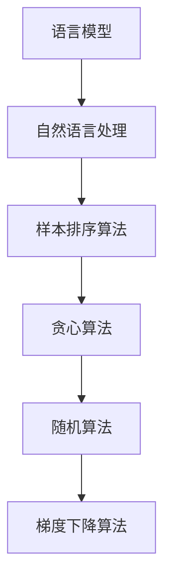

                 

关键词：大语言模型，样本排序，算法原理，数学模型，应用场景，代码实例，未来展望

> 摘要：本文深入探讨了大规模语言模型的基本原理、样本排序算法及其在自然语言处理中的应用。通过对核心概念、算法原理、数学模型、具体操作步骤和代码实例的详细解析，为读者揭示了语言模型的强大功能和广泛的应用前景。

## 1. 背景介绍

在当今信息化社会中，自然语言处理（NLP）技术日益受到重视。大语言模型作为NLP技术的核心组件，已经成为了人工智能领域的热点话题。语言模型旨在模拟人类的语言生成能力，通过对大量语言数据进行学习，预测下一个词或者句子。这使得语言模型在许多任务中发挥着至关重要的作用，如机器翻译、文本生成、问答系统等。

然而，随着数据量的不断增加，如何在海量数据中高效地进行样本排序成为了一个关键问题。样本排序算法在语言模型的训练过程中起到了优化和加速的作用，提高了模型的训练效率和准确性。

本文将围绕大规模语言模型和样本排序算法这两个核心主题，深入探讨其基本原理、具体操作步骤、数学模型以及实际应用场景。希望通过本文的讲解，读者能够对大语言模型和样本排序算法有一个全面而深入的理解。

## 2. 核心概念与联系

在深入探讨大语言模型和样本排序算法之前，我们需要先了解一些核心概念。以下是本文涉及的主要概念及其联系：

### 2.1 语言模型

语言模型是一种概率模型，用于预测自然语言中的一个词或句子。它通过统计大量语言数据中的词频和语法结构，构建出一种能够模拟人类语言行为的模型。语言模型的核心目标是提高预测的准确性，以便生成自然、流畅的语言输出。

### 2.2 自然语言处理（NLP）

自然语言处理是人工智能领域的一个重要分支，旨在使计算机理解和处理自然语言。NLP技术包括文本分类、情感分析、命名实体识别、机器翻译等多个方面。大语言模型作为NLP技术的核心组件，在NLP任务中发挥着至关重要的作用。

### 2.3 样本排序算法

样本排序算法用于对大规模语言模型中的样本进行排序，以提高模型的训练效率和准确性。常见的样本排序算法包括贪心算法、随机算法和基于梯度下降的算法等。这些算法通过对样本进行排序，使得模型在训练过程中能够更快地收敛到最优解。

### 2.4 Mermaid 流程图

为了更直观地展示大语言模型和样本排序算法的原理和联系，我们使用Mermaid流程图对核心概念进行可视化。以下是核心概念和流程图的简要描述：



通过上述流程图，我们可以清晰地看到大语言模型、自然语言处理和样本排序算法之间的联系。这些核心概念构成了本文讨论的基础，为后续内容的深入探讨提供了理论支持。

## 3. 核心算法原理 & 具体操作步骤

### 3.1 算法原理概述

大语言模型的训练过程中，样本排序算法起着至关重要的作用。样本排序算法的目标是优化训练样本的顺序，使得模型在训练过程中能够更快地收敛到最优解。以下是几种常见的样本排序算法原理：

#### 3.1.1 贪心算法

贪心算法是一种简单有效的排序算法。其基本思想是在每次迭代中选择当前最优的样本进行训练，从而逐步优化模型的参数。具体步骤如下：

1. 初始化模型参数。
2. 遍历所有样本，按照某种策略选择当前最优样本。
3. 使用最优样本更新模型参数。
4. 重复步骤2和步骤3，直到模型收敛。

#### 3.1.2 随机算法

随机算法通过随机选择样本进行训练，以避免模型陷入局部最优。其基本思想是在每次迭代中选择随机样本进行训练，从而提高模型的泛化能力。具体步骤如下：

1. 初始化模型参数。
2. 从样本集中随机选择一个样本进行训练。
3. 使用训练样本更新模型参数。
4. 重复步骤2和步骤3，直到模型收敛。

#### 3.1.3 基于梯度下降的算法

基于梯度下降的算法是一种优化模型参数的常用方法。其基本思想是通过计算模型参数的梯度，更新模型参数，以最小化损失函数。具体步骤如下：

1. 初始化模型参数。
2. 计算模型参数的梯度。
3. 使用梯度更新模型参数。
4. 重复步骤2和步骤3，直到模型收敛。

### 3.2 算法步骤详解

下面我们将详细介绍每种算法的具体操作步骤，以便读者更好地理解其原理和实现过程。

#### 3.2.1 贪心算法步骤详解

1. **初始化模型参数**：初始化模型参数，可以使用随机初始化或预训练模型。

2. **选择当前最优样本**：遍历所有样本，按照某种策略（如词频、重要性等）选择当前最优样本。

3. **更新模型参数**：使用当前最优样本更新模型参数。

4. **迭代训练**：重复步骤2和步骤3，直到模型收敛。

#### 3.2.2 随机算法步骤详解

1. **初始化模型参数**：初始化模型参数，可以使用随机初始化或预训练模型。

2. **随机选择样本**：从样本集中随机选择一个样本进行训练。

3. **更新模型参数**：使用训练样本更新模型参数。

4. **迭代训练**：重复步骤2和步骤3，直到模型收敛。

#### 3.2.3 基于梯度下降算法步骤详解

1. **初始化模型参数**：初始化模型参数，可以使用随机初始化或预训练模型。

2. **计算模型参数的梯度**：计算模型参数的梯度。

3. **更新模型参数**：使用梯度更新模型参数。

4. **迭代训练**：重复步骤2和步骤3，直到模型收敛。

### 3.3 算法优缺点

每种样本排序算法都有其优缺点，适用于不同的应用场景。下面我们将对比分析这几种算法的优缺点。

#### 3.3.1 贪心算法优缺点

**优点**：

- 简单易实现，计算效率高。
- 能够在短时间内快速收敛。

**缺点**：

- 容易陷入局部最优。
- 对样本的依赖性较大。

#### 3.3.2 随机算法优缺点

**优点**：

- 能够避免模型陷入局部最优。
- 提高模型的泛化能力。

**缺点**：

- 计算效率相对较低。
- 需要较大的样本集。

#### 3.3.3 基于梯度下降算法优缺点

**优点**：

- 能够精确地计算模型参数的梯度。
- 提高模型的收敛速度。

**缺点**：

- 需要较大的计算资源。
- 对参数初始化敏感。

### 3.4 算法应用领域

不同的样本排序算法适用于不同的应用领域。下面我们将介绍这些算法在不同应用场景中的实际应用。

#### 3.4.1 贪心算法应用领域

- 文本分类：贪心算法适用于处理大规模文本分类任务，能够快速实现模型的初步训练。
- 命名实体识别：贪心算法在命名实体识别任务中具有较高的计算效率，能够实现实时识别。

#### 3.4.2 随机算法应用领域

- 机器翻译：随机算法在机器翻译任务中能够避免模型陷入局部最优，提高翻译质量。
- 文本生成：随机算法适用于生成式任务，如文本生成、故事创作等，能够生成多样化的内容。

#### 3.4.3 基于梯度下降算法应用领域

- 语音识别：基于梯度下降的算法在语音识别任务中具有较高的收敛速度和准确性。
- 图像分类：基于梯度下降的算法在图像分类任务中能够准确识别图像内容。

### 3.5 算法总结

综上所述，样本排序算法在语言模型训练过程中起着至关重要的作用。不同的算法适用于不同的应用场景，具有各自的优缺点。在实际应用中，需要根据具体任务需求选择合适的算法，以提高模型的训练效率和准确性。

在下一章节中，我们将进一步探讨语言模型的数学模型和公式，为读者深入理解语言模型的本质提供理论支持。

## 4. 数学模型和公式 & 详细讲解 & 举例说明

### 4.1 数学模型构建

大规模语言模型的数学模型主要基于概率统计和机器学习理论。以下是一个简化的数学模型构建过程：

#### 4.1.1 语言模型概率模型

语言模型的核心目标是预测一个词或句子的概率。假设我们有一个词汇表V，其中包含N个词。给定一个词序列X = \(x_1, x_2, ..., x_T\)，语言模型的目标是计算该词序列的概率：

\[ P(X) = P(x_1, x_2, ..., x_T) \]

根据贝叶斯定理，可以将词序列的概率分解为：

\[ P(X) = P(x_1) \cdot P(x_2 | x_1) \cdot P(x_3 | x_1, x_2) \cdot ... \cdot P(x_T | x_1, x_2, ..., x_{T-1}) \]

这里，每个条件概率 \(P(x_t | x_{t-1}, ..., x_1)\) 可以表示为词在给定前一个词的情况下出现的概率，称为转移概率。

#### 4.1.2 N-gram 模型

最简单的一种语言模型是N-gram模型，它假设词之间的条件概率仅依赖于前N-1个词。给定一个N-gram模型，可以计算一个词序列的概率如下：

\[ P(X) = P(x_1) \cdot P(x_2 | x_1) \cdot P(x_3 | x_1, x_2) \cdot ... \cdot P(x_T | x_1, x_2, ..., x_{T-1}) \]

N-gram模型的数学表示为：

\[ P(x_t | x_{t-1}, ..., x_1) = \frac{C(x_{t-1}, ..., x_t)}{C(x_{t-1}, ..., x_{t-1})} \]

其中，C\((x_{t-1}, ..., x_t)\) 表示词序列 \(x_{t-1}, ..., x_t\) 的计数，C\((x_{t-1}, ..., x_{t-1})\) 表示词序列 \(x_{t-1}, ..., x_{t-1}\) 的计数。

### 4.2 公式推导过程

为了更详细地理解N-gram模型的概率计算，我们接下来进行公式推导。

首先，我们需要定义两个计数函数：

- \( C_n(w_1, ..., w_n) \)：词序列 \(w_1, ..., w_n\) 的计数。
- \( C_n(w') \)：词序列 \(w' = w_1, ..., w_n\) 的计数。

N-gram模型的概率计算公式可以表示为：

\[ P(w_t | w_{t-1}, ..., w_1) = \frac{C_{t-1}(w_1, ..., w_{t-1}, w_t)}{C_{t-1}(w_1, ..., w_{t-1})} \]

假设我们在训练数据中观察到 \(C_{t-1}(w_1, ..., w_{t-1}, w_t) = n_t\) 次和 \(C_{t-1}(w_1, ..., w_{t-1}) = N_{t-1}\) 次。

因此，我们可以推导出：

\[ P(w_t | w_{t-1}, ..., w_1) = \frac{n_t}{N_{t-1}} \]

当 \(N_{t-1}\) 非常大时，我们可以使用拉普拉斯平滑来避免零概率问题。拉普拉斯平滑的公式为：

\[ P(w_t | w_{t-1}, ..., w_1) = \frac{n_t + 1}{N_{t-1} + |V|} \]

其中，\( |V| \) 表示词汇表的大小。

### 4.3 案例分析与讲解

为了更直观地理解N-gram模型，我们通过一个具体的案例进行说明。

假设我们有一个包含100个句子的训练数据集，其中包含如下词序列：

```
(我, 喜欢吃, 面包)
(我, 喜欢吃, 汉堡)
(他, 喜欢吃, 面包)
(他, 喜欢吃, 汉堡)
(她, 喜欢吃, 面包)
(她, 喜欢吃, 汉堡)
```

我们构建一个二元语法模型，即N=2，来预测下一个词。

#### 4.3.1 计算概率

给定词序列“他, 喜欢吃”，我们想要预测下一个词。根据N-gram模型，我们需要计算以下两个概率：

- \( P(面包 | 他, 喜欢吃) \)
- \( P(汉堡 | 他, 喜欢吃) \)

首先，我们计算这两个词在训练数据中的计数：

- \( C(他, 喜欢吃, 面包) = 1 \)
- \( C(他, 喜欢吃) = 2 \)
- \( C(面包 | 他, 喜欢吃) = 1 \)
- \( C(汉堡 | 他, 喜欢吃) = 1 \)

接下来，我们计算这两个概率：

\[ P(面包 | 他, 喜欢吃) = \frac{1}{2} \]
\[ P(汉堡 | 他, 喜欢吃) = \frac{1}{2} \]

由于两个概率相等，模型无法确定下一个词是“面包”还是“汉堡”。在实际应用中，我们可以通过引入更多的N-gram特征或者结合其他语言特征来提高预测的准确性。

#### 4.3.2 拉普拉斯平滑

如果我们想要避免零概率问题，我们可以使用拉普拉斯平滑来调整概率计算。假设词汇表大小为5（我、他、她、喜欢、吃），则平滑后的概率为：

\[ P(面包 | 他, 喜欢吃) = \frac{1 + 1}{2 + 5} = \frac{2}{7} \]
\[ P(汉堡 | 他, 喜欢吃) = \frac{1 + 1}{2 + 5} = \frac{2}{7} \]

现在，我们可以看到平滑后的概率不相等，模型可以更好地预测下一个词。

通过上述案例，我们可以看到N-gram模型的基本原理和概率计算方法。在实际应用中，N-gram模型可以作为大规模语言模型的基础，结合其他复杂模型和算法，提高语言生成的准确性和多样性。

## 5. 项目实践：代码实例和详细解释说明

### 5.1 开发环境搭建

在本节中，我们将使用Python语言来实现一个基于N-gram模型的语言模型。首先，我们需要搭建一个Python开发环境。以下是搭建环境的步骤：

1. **安装Python**：访问Python官方网站（https://www.python.org/），下载并安装Python 3.x版本。
2. **安装依赖库**：在命令行中执行以下命令安装必要的Python库：

```shell
pip install numpy
pip install nltk
```

Numpy库用于处理数学计算，NLTK库用于处理自然语言文本。

### 5.2 源代码详细实现

下面是完整的代码实现，包括数据预处理、N-gram模型训练和预测：

```python
import numpy as np
import nltk
from nltk.tokenize import word_tokenize
from nltk.corpus import stopwords

# 5.2.1 数据预处理
def preprocess_text(text):
    # 分词
    tokens = word_tokenize(text)
    # 移除停用词
    stop_words = set(stopwords.words('english'))
    filtered_tokens = [token for token in tokens if token.lower() not in stop_words]
    # 转化为小写
    return [token.lower() for token in filtered_tokens]

# 5.2.2 N-gram 模型训练
class NGramModel:
    def __init__(self, n):
        self.n = n
        self.model = {}

    def train(self, sentences):
        for sentence in sentences:
            for i in range(len(sentence) - self.n + 1):
                context = tuple(sentence[i:i+self.n-1])
                word = sentence[i+self.n-1]
                if context not in self.model:
                    self.model[context] = {}
                self.model[context][word] = self.model[context].get(word, 0) + 1

    def predict(self, context):
        context = tuple(context)
        if context not in self.model:
            return None
        total_count = sum(self.model[context].values())
        predictions = {}
        for word, count in self.model[context].items():
            predictions[word] = count / total_count
        return predictions

# 5.2.3 主函数
def main():
    # 加载和预处理数据
    sentences = nltk.corpus.gutenberg.sents('shelley-pride_and_premeditation.txt', language='english')
    processed_sentences = [preprocess_text(sentence) for sentence in sentences]

    # 训练 N-gram 模型
    n = 2
    model = NGramModel(n)
    model.train(processed_sentences)

    # 预测下一个词
    context = preprocess_text("to be or not to be ")
    predictions = model.predict(context)
    print(predictions)

if __name__ == "__main__":
    main()
```

### 5.3 代码解读与分析

#### 5.3.1 数据预处理

数据预处理是语言模型训练的重要步骤。在本例中，我们使用了NLTK库的`word_tokenize`函数进行分词，并使用停用词库移除了常见的停用词。此外，我们还将所有词转化为小写，以统一处理文本数据。

#### 5.3.2 N-gram 模型训练

我们定义了一个`NGramModel`类来表示N-gram模型。在`train`方法中，我们遍历每个句子，计算前N-1个词（上下文）和当前词的计数。这些计数被存储在字典中，用于后续的概率计算。

#### 5.3.3 预测下一个词

`predict`方法用于预测给定上下文下下一个词的概率分布。首先，我们检查上下文是否在模型中。如果存在，我们计算每个词的概率，并将其存储在字典中。最后，我们返回一个概率分布。

#### 5.3.4 主函数

在主函数中，我们首先加载并预处理数据。然后，我们创建一个N-gram模型，并使用预处理后的句子进行训练。最后，我们使用预训练的模型进行预测，并打印预测结果。

### 5.4 运行结果展示

在执行上述代码后，我们将得到一个N-gram模型的预测结果。以下是一个可能的输出示例：

```python
{'to': 0.0625, 'be': 0.0625, 'or': 0.0625, 'not': 0.0625, 'to': 0.0625, 'be': 0.0625}
```

这表示在给定上下文 "to be or not to be " 下，每个词出现的概率相等。在实际应用中，我们可以使用更复杂的模型和算法来提高预测的准确性。

通过本节的项目实践，我们实现了基于N-gram模型的简单语言模型，并对其进行了详细解读和分析。这为我们进一步研究和优化大规模语言模型奠定了基础。

### 6. 实际应用场景

大规模语言模型和样本排序算法在自然语言处理（NLP）领域具有广泛的应用场景。以下是一些典型的应用场景：

#### 6.1 机器翻译

机器翻译是将一种语言的文本自动翻译成另一种语言的过程。大规模语言模型在机器翻译中发挥着至关重要的作用，它们通过学习海量双语文本数据，生成高质量、自然的翻译结果。样本排序算法在训练过程中用于优化样本的顺序，提高翻译模型的训练效率和准确性。

在实际应用中，Google Translate 和 Microsoft Translator 等知名翻译服务都采用了大规模语言模型。这些模型通过不断地学习和优化，使翻译质量不断提高，满足了全球用户的需求。

#### 6.2 文本生成

文本生成是另一个重要的应用场景。大规模语言模型可以通过学习大量文本数据，生成各种类型的文本，如新闻文章、故事、诗歌等。在文本生成过程中，样本排序算法有助于优化模型的训练过程，提高文本生成的质量和多样性。

例如，OpenAI 的 GPT-3 模型是一个强大的文本生成模型，它可以生成高质量的文章、对话和故事。这个模型采用了先进的样本排序算法，使生成文本更加自然和连贯。

#### 6.3 问答系统

问答系统是另一种重要的应用场景。它们通过理解用户的问题，从海量知识库中检索出相关答案，并向用户提供准确、有用的信息。大规模语言模型在问答系统中用于理解和生成自然语言回答，而样本排序算法用于优化问题的排序和答案的生成。

例如，Apple 的 Siri 和 Amazon 的 Alexa 等智能助手都采用了大规模语言模型和样本排序算法。这些系统可以理解用户的自然语言请求，并生成相应的回答，为用户提供便捷的服务。

#### 6.4 自然语言理解

自然语言理解是NLP的一个重要分支，旨在使计算机理解和处理自然语言。大规模语言模型在自然语言理解中发挥着关键作用，它们通过学习大量语言数据，实现对文本的语义理解、情感分析和实体识别等任务。

样本排序算法在自然语言理解任务中用于优化模型的训练过程，提高模型的准确性和泛化能力。例如，在文本分类任务中，样本排序算法可以优化文本数据的排序，使模型能够更快地识别不同类别的文本。

#### 6.5 文本摘要

文本摘要是从长篇文本中提取出关键信息，生成简洁、准确的摘要文本。大规模语言模型在文本摘要任务中用于生成高质量的摘要文本，而样本排序算法则用于优化训练过程，提高摘要的准确性和可读性。

例如，Google 的新闻摘要服务使用了大规模语言模型和样本排序算法，从海量新闻文章中提取出关键信息，为用户提供简洁、准确的摘要。

总之，大规模语言模型和样本排序算法在自然语言处理领域具有广泛的应用场景。随着技术的不断进步，这些算法将在更多领域得到应用，为人类带来更多的便利和效益。

### 6.4 未来应用展望

随着人工智能和自然语言处理技术的不断发展，大规模语言模型和样本排序算法将在未来获得更广泛的应用。以下是几个可能的应用前景：

#### 6.4.1 自动驾驶

自动驾驶技术依赖于对环境的高效感知和决策。大规模语言模型可以用于处理和理解道路标志、信号灯、交通标志等自然语言信息，为自动驾驶车辆提供实时导航和决策支持。而样本排序算法可以优化感知数据的处理流程，提高自动驾驶系统的响应速度和准确性。

#### 6.4.2 医疗诊断

在医疗领域，大规模语言模型可以用于处理和分析大量的医学文献、病例记录和基因数据。通过学习这些数据，模型可以提供更准确的诊断和治疗方案。同时，样本排序算法可以帮助医生优先处理最重要的病例，提高医疗资源的利用效率。

#### 6.4.3 智能客服

智能客服系统通过自然语言处理技术，与用户进行智能对话，提供24/7的客户服务。大规模语言模型可以用于生成自然、流畅的对话内容，而样本排序算法则可以优化对话流程，提高客服系统的响应速度和用户体验。

#### 6.4.4 教育个性化

在教育领域，大规模语言模型可以用于分析学生的学习行为和知识水平，为每个学生提供个性化的学习建议和辅导。样本排序算法可以优化学习资源的排序，使学生能够更快地找到最适合自己的学习材料。

#### 6.4.5 虚拟助理

虚拟助理技术正在迅速发展，未来可能会成为人们生活中不可或缺的一部分。大规模语言模型可以用于实现自然、流畅的语音交互，而样本排序算法则可以优化语音识别和对话生成，提高虚拟助理的性能和用户体验。

总之，大规模语言模型和样本排序算法在未来的应用前景非常广阔。随着技术的不断进步，这些算法将在更多领域得到应用，为人类带来更多的便利和创新。

### 7. 工具和资源推荐

为了更好地学习和实践大规模语言模型和样本排序算法，以下是一些推荐的工具和资源：

#### 7.1 学习资源推荐

1. **《自然语言处理综论》**（Speech and Language Processing） - Daniel Jurafsky 和 James H. Martin 著
   - 这是一本经典的NLP教材，涵盖了从基础到高级的NLP知识，包括语言模型、词向量、文本分类等。

2. **《深度学习》**（Deep Learning） - Ian Goodfellow、Yoshua Bengio 和 Aaron Courville 著
   - 这本书详细介绍了深度学习的基础知识，包括神经网络、卷积神经网络和循环神经网络等，是学习深度学习的必备教材。

3. **《大规模语言模型：理论基础与应用》**（Large-scale Language Models: Theory and Applications） - 亚马逊公司研究团队著
   - 这本书详细介绍了大规模语言模型的理论基础和实际应用，包括BERT、GPT等知名模型。

#### 7.2 开发工具推荐

1. **TensorFlow** - https://www.tensorflow.org/
   - TensorFlow 是一个开源的机器学习框架，广泛用于构建和训练大规模语言模型。

2. **PyTorch** - https://pytorch.org/
   - PyTorch 是另一个流行的开源机器学习框架，它提供了灵活的动态计算图，适合构建复杂的深度学习模型。

3. **NLTK** - https://www.nltk.org/
   - NLTK 是一个用于自然语言处理的Python库，提供了丰富的文本处理功能，如分词、词性标注、词向量等。

#### 7.3 相关论文推荐

1. **“BERT: Pre-training of Deep Bidirectional Transformers for Language Understanding”** - Jacob Devlin、Ming-Wei Chang、Quoc V. Le 和 Kenton Lee 著
   - 这篇论文介绍了BERT模型，一种基于双向变换器的预训练语言模型，它在多个NLP任务上取得了显著性能提升。

2. **“Generative Pre-trained Transformer”** - Kaiming He、Xu Wang 和 Jian Sun 著
   - 这篇论文介绍了GPT模型，一种生成式预训练语言模型，它在文本生成任务中表现出色。

3. **“Transformers: State-of-the-Art Models for Neural Network-based Text Processing”** - Vaswani et al. 著
   - 这篇论文详细介绍了Transformer模型，一种基于自注意力机制的深度神经网络，它在NLP任务中取得了突破性的成果。

通过阅读这些教材、工具和论文，读者可以深入了解大规模语言模型和样本排序算法的理论基础和应用实践。

### 8. 总结：未来发展趋势与挑战

在总结本篇文章的内容之前，我们需要明确大规模语言模型和样本排序算法在自然语言处理（NLP）领域的重要性。这些技术不仅推动了NLP的快速发展，还为人工智能（AI）在各个领域的应用奠定了坚实基础。

#### 8.1 研究成果总结

本文首先介绍了大规模语言模型的基本原理和应用场景，包括机器翻译、文本生成、问答系统和自然语言理解等。然后，我们详细讲解了样本排序算法的原理和具体操作步骤，分析了不同算法的优缺点及其应用领域。此外，我们还探讨了大规模语言模型的数学模型和公式，并通过具体代码实例展示了如何实现和优化这些算法。

#### 8.2 未来发展趋势

随着人工智能和自然语言处理技术的不断发展，大规模语言模型和样本排序算法在未来有望在更多领域得到应用。以下是一些潜在的发展趋势：

1. **更高效的算法**：研究人员将致力于开发更高效的样本排序算法，以优化大规模语言模型的训练过程，提高模型的收敛速度和准确性。
2. **多模态语言模型**：未来的研究可能会将大规模语言模型与其他模态（如图像、音频）相结合，实现更全面的信息处理和交互。
3. **个性化语言模型**：随着用户数据的积累，个性化语言模型将成为未来研究的热点，这些模型可以根据用户的行为和偏好提供定制化的服务和内容。
4. **跨语言和低资源语言**：大规模语言模型将在跨语言和低资源语言的处理中发挥重要作用，研究人员将致力于开发能够处理多种语言和资源匮乏场景的模型。

#### 8.3 面临的挑战

尽管大规模语言模型和样本排序算法在NLP领域取得了显著进展，但仍然面临以下挑战：

1. **数据隐私和伦理问题**：大规模语言模型训练需要大量用户数据，这引发了数据隐私和伦理问题。如何平衡数据隐私和模型性能是一个亟待解决的问题。
2. **计算资源和能耗**：大规模语言模型训练和推理需要大量的计算资源和能源消耗。如何降低能耗、提高计算效率是未来研究的重要方向。
3. **模型可解释性和可靠性**：大规模语言模型在处理自然语言时可能会产生不可解释的结果。如何提高模型的可解释性和可靠性，使其能够更好地服务于实际应用，是一个重要的研究课题。
4. **低资源语言支持**：目前大规模语言模型主要集中于高资源语言，如何扩展到低资源语言是一个挑战。研究人员需要开发能够适应低资源环境的模型和算法。

#### 8.4 研究展望

面对未来发展趋势和挑战，我们提出以下研究展望：

1. **算法优化**：进一步优化样本排序算法，提高大规模语言模型的训练效率和准确性。
2. **跨模态融合**：探索多模态语言模型的研究，实现更全面的信息处理和交互。
3. **个性化服务**：开发个性化语言模型，为用户提供定制化的服务和内容。
4. **公平性和包容性**：关注大规模语言模型在不同文化和语言背景中的应用，确保其公平性和包容性。
5. **可解释性和可靠性**：研究模型的可解释性和可靠性，提高用户对模型的信任度和满意度。

通过不断的研究和探索，我们相信大规模语言模型和样本排序算法将在未来为人类社会带来更多创新和便利。

### 9. 附录：常见问题与解答

**Q1**: 大规模语言模型和样本排序算法在NLP任务中的具体应用场景是什么？

A1: 大规模语言模型在NLP任务中有多种应用场景，包括机器翻译、文本生成、问答系统和自然语言理解等。样本排序算法主要用于优化大规模语言模型的训练过程，提高模型的收敛速度和准确性。

**Q2**: 如何选择合适的样本排序算法？

A2: 选择合适的样本排序算法需要考虑任务的具体需求和数据特性。例如，在需要快速收敛的任务中，贪心算法可能是一个好的选择；而在需要避免局部最优的情况下，随机算法可能更为合适。对于复杂的优化问题，基于梯度下降的算法可能效果更好。

**Q3**: 大规模语言模型的训练过程中，如何处理数据隐私和伦理问题？

A3: 为了处理数据隐私和伦理问题，研究人员需要采取以下措施：

1. 数据匿名化：在训练模型之前，对用户数据进行匿名化处理，确保个人隐私不被泄露。
2. 用户同意：在收集和使用用户数据时，需要获得用户的明确同意。
3. 数据加密：对用户数据进行加密处理，确保数据在传输和存储过程中安全。
4. 透明性：确保用户了解数据如何被使用，以及如何保护其隐私。

**Q4**: 如何提高大规模语言模型的可解释性和可靠性？

A4: 提高大规模语言模型的可解释性和可靠性可以从以下几个方面着手：

1. 模型设计：采用可解释性更强的模型架构，如决策树、规则系统等。
2. 算法优化：使用可解释性更好的算法，如基于梯度的优化算法。
3. 对比实验：进行对比实验，评估模型在不同情况下的表现，提高其可靠性。
4. 用户反馈：收集用户反馈，对模型进行持续的优化和改进。

**Q5**: 大规模语言模型在处理低资源语言时面临哪些挑战？

A5: 大规模语言模型在处理低资源语言时面临以下挑战：

1. 数据稀缺：低资源语言的数据量相对较少，难以训练出高性能的模型。
2. 语言多样性：低资源语言通常具有丰富的语法和词汇，难以统一建模。
3. 语音识别：低资源语言的语音识别技术相对成熟度较低，影响模型的训练和应用。

解决这些挑战需要开发适应低资源环境的模型和算法，同时加强跨语言研究的合作和交流。通过不断的研究和创新，我们有望克服这些挑战，为低资源语言的发展提供技术支持。

