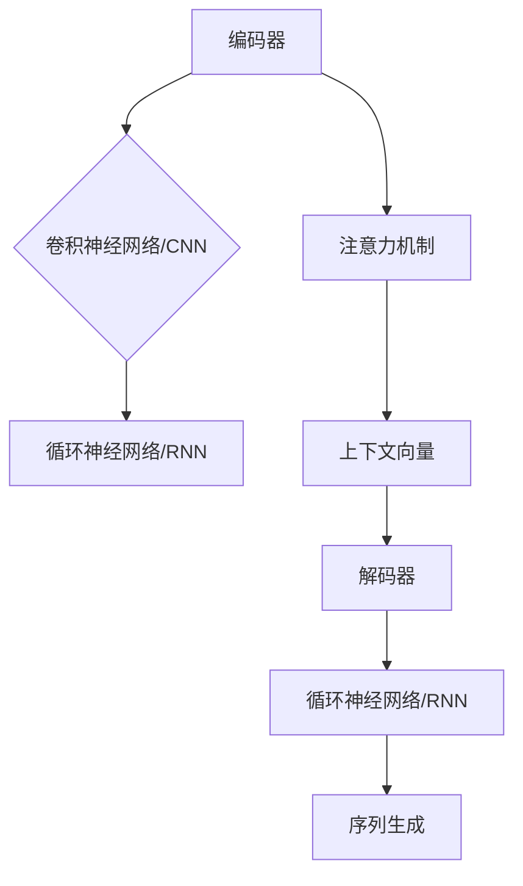

                 

关键词：大语言模型，深度学习，神经网络，自然语言处理，机器学习，计算模型，混合方法

> 摘要：本文将深入探讨大语言模型的原理基础与前沿混合方法。我们将从背景介绍开始，详细阐述大语言模型的核心概念与联系，剖析核心算法原理与具体操作步骤，并引入数学模型和公式进行详细讲解。此外，文章还将通过实际项目实践来展示代码实例和详细解释说明，最后探讨大语言模型在实际应用场景中的价值以及未来应用展望。

## 1. 背景介绍

### 大语言模型的发展历程

大语言模型（Large Language Models）是自然语言处理领域的一项重要突破。从最初的统计语言模型到现代的深度学习模型，大语言模型经历了多次演变。最早的语言模型主要基于统计方法和规则匹配，如N-gram模型和正则表达式。然而，这些模型在处理复杂和长句子上存在局限性。随着深度学习技术的发展，神经网络被引入到语言模型中，使得模型能够自动学习和发现语言中的复杂结构。近年来，以GPT-3和BERT为代表的大语言模型取得了显著的进展，展现出强大的语义理解和生成能力。

### 大语言模型的应用领域

大语言模型在多个领域展现出广泛的应用前景。其中，最为显著的领域包括自然语言生成、机器翻译、文本摘要、问答系统、对话系统等。通过学习和理解大量的文本数据，大语言模型能够生成流畅和有意义的文本，为人工智能助手和自动化内容生成提供了强大的技术支持。此外，大语言模型还被应用于信息检索、推荐系统、情感分析等任务，为各类应用场景提供了有效的解决方案。

### 本文结构

本文将分为八个主要部分，包括背景介绍、核心概念与联系、核心算法原理与具体操作步骤、数学模型和公式、项目实践、实际应用场景、工具和资源推荐以及总结和展望。通过逐个部分的分析和讨论，我们将全面了解大语言模型的原理和前沿混合方法，并展望其未来发展的趋势和挑战。

## 2. 核心概念与联系

### 大语言模型的定义

大语言模型是一种基于深度学习的自然语言处理模型，能够理解和生成自然语言。与传统的小型语言模型相比，大语言模型具有更大的参数规模和更强的语义理解能力。通过训练大规模的神经网络，大语言模型可以自动捕捉语言中的复杂模式和结构，从而实现高效的自然语言处理。

### 大语言模型的核心概念

大语言模型的核心概念包括神经网络、词向量、注意力机制和序列生成模型等。

#### 神经网络

神经网络是深度学习的基础架构，由大量相互连接的神经元组成。通过前向传播和反向传播算法，神经网络能够从输入数据中提取特征并学习复杂的非线性关系。在大语言模型中，神经网络被用于捕捉文本数据中的语义信息。

#### 词向量

词向量是将文本中的单词映射到高维空间中的向量表示。通过词向量，大语言模型可以表示单词的语义关系和上下文信息。常见的词向量模型包括Word2Vec、GloVe和BERT等。

#### 注意力机制

注意力机制是一种用于提高神经网络在处理序列数据时的性能的技巧。通过关注序列中的重要部分，注意力机制能够使模型更加准确地捕捉文本中的关键信息。

#### 序列生成模型

序列生成模型是一种基于循环神经网络（RNN）和Transformer的模型架构，能够生成序列数据，如文本、语音和图像等。在大语言模型中，序列生成模型被用于文本生成、机器翻译和对话系统等任务。

### 大语言模型的架构

大语言模型的架构通常包括编码器（Encoder）和解码器（Decoder）两部分。编码器将输入序列编码为固定长度的向量表示，解码器则根据编码器的输出生成输出序列。

#### 编码器

编码器通常使用卷积神经网络（CNN）或循环神经网络（RNN）来处理输入序列。编码器的输出是一个固定长度的向量，称为上下文向量（Context Vector）。

#### 解码器

解码器通常使用循环神经网络（RNN）或Transformer来生成输出序列。解码器的输入包括编码器的输出和已经生成的部分输出序列。

#### Mermaid 流程图



通过上述核心概念和架构的介绍，我们可以更好地理解大语言模型的工作原理和结构。在接下来的章节中，我们将详细探讨大语言模型的核心算法原理和具体操作步骤。

## 3. 核心算法原理 & 具体操作步骤

### 3.1 算法原理概述

大语言模型的核心算法是基于深度学习的神经网络模型，主要包括编码器和解码器两部分。编码器负责将输入的文本序列编码为上下文向量，解码器则根据上下文向量生成输出文本序列。在这个过程中，注意力机制被用来提高模型的性能。

#### 编码器原理

编码器的原理是基于循环神经网络（RNN）或卷积神经网络（CNN）。RNN具有记忆能力，能够处理序列数据，而CNN能够捕捉文本中的局部特征。在编码过程中，每个输入单词被映射为一个词向量，然后通过RNN或CNN的处理，将输入序列编码为上下文向量。

#### 解码器原理

解码器的原理是基于RNN或Transformer。RNN能够根据上一个生成的单词预测下一个单词，而Transformer通过注意力机制来捕捉输入序列中的长距离依赖关系。在解码过程中，解码器根据编码器的输出和已经生成的部分输出序列来生成新的单词。

#### 注意力机制

注意力机制是一种用于提高模型性能的技巧。通过关注序列中的重要部分，注意力机制能够使模型更加准确地捕捉文本中的关键信息。在编码器和解码器的交互过程中，注意力机制通过计算上下文向量和当前生成的单词之间的相似度，选择性地关注输入序列中的特定部分。

### 3.2 算法步骤详解

1. **数据预处理**：
   - 将输入文本序列分割为单词或子词。
   - 将单词或子词映射为词向量。
   - 将词向量序列输入编码器。

2. **编码器处理**：
   - 对输入的词向量序列进行循环神经网络（RNN）或卷积神经网络（CNN）处理。
   - 生成上下文向量。

3. **解码器处理**：
   - 根据编码器的输出和已经生成的部分输出序列，使用RNN或Transformer生成新的单词。
   - 重复上述步骤，直到生成完整的输出序列。

4. **损失函数计算**：
   - 将生成的输出序列与实际输出序列进行比较，计算损失函数。
   - 使用梯度下降算法更新模型的参数。

5. **模型优化**：
   - 通过多次迭代训练，优化模型的性能。
   - 使用验证集评估模型的泛化能力。

### 3.3 算法优缺点

#### 优点

- **强大的语义理解能力**：通过深度学习模型的学习能力，大语言模型能够捕捉到语言中的复杂结构和语义信息，具有强大的语义理解能力。

- **多任务处理能力**：大语言模型可以同时处理多个自然语言处理任务，如文本生成、机器翻译、文本摘要等，具有多任务处理能力。

- **自适应学习能力**：大语言模型具有自适应学习能力，可以不断从新的数据中学习，提高模型的性能。

#### 缺点

- **计算资源消耗大**：大语言模型通常具有大量的参数，需要大量的计算资源和存储空间。

- **训练时间较长**：大语言模型的训练时间通常较长，需要大量的时间和计算资源。

- **数据依赖性高**：大语言模型的学习效果依赖于训练数据的质量和规模，对数据的依赖性较高。

### 3.4 算法应用领域

- **自然语言生成**：大语言模型可以用于生成文章、对话、诗歌等自然语言文本。

- **机器翻译**：大语言模型可以用于将一种语言翻译成另一种语言，如将中文翻译成英文。

- **文本摘要**：大语言模型可以用于提取文本中的重要信息，生成摘要。

- **对话系统**：大语言模型可以用于构建智能对话系统，如聊天机器人。

- **信息检索**：大语言模型可以用于改进信息检索系统的性能，提高搜索结果的准确性和相关性。

通过上述对大语言模型核心算法原理和具体操作步骤的介绍，我们可以更好地理解大语言模型的工作原理和应用领域。在接下来的章节中，我们将详细探讨大语言模型的数学模型和公式，进一步深入理解其内在机制。

## 4. 数学模型和公式 & 详细讲解 & 举例说明

### 4.1 数学模型构建

大语言模型的核心数学模型包括词向量模型、循环神经网络（RNN）模型、Transformer模型等。以下将分别介绍这些模型的构建过程和主要公式。

#### 词向量模型

词向量模型是将文本中的单词映射到高维空间中的向量表示。常见的词向量模型包括Word2Vec和GloVe。

1. **Word2Vec模型**

   Word2Vec模型基于神经网络的训练过程，将输入的文本序列映射为词向量。其基本公式如下：

   $$v\_word = \text{ReLU}(W \cdot v\_input + b)$$

   其中，$v\_word$表示词向量，$v\_input$表示输入的词向量，$W$表示权重矩阵，$b$表示偏置项。

2. **GloVe模型**

   GloVe模型基于全局共现矩阵的训练过程，将输入的文本序列映射为词向量。其基本公式如下：

   $$v\_word = \sqrt{F} \cdot v\_context$$

   其中，$v\_word$表示词向量，$v\_context$表示上下文词向量，$F$表示共现频率。

#### 循环神经网络（RNN）模型

循环神经网络（RNN）模型是一种基于序列数据的神经网络模型，可以处理文本中的序列依赖关系。其基本公式如下：

1. **输入层到隐藏层的传递**

   $$h\_t = \text{ReLU}(W \cdot h_{t-1} + U \cdot x\_t + b)$$

   其中，$h\_t$表示隐藏层状态，$x\_t$表示输入的词向量，$W$和$U$表示权重矩阵，$b$表示偏置项。

2. **隐藏层到隐藏层的传递**

   $$h\_t = \text{ReLU}(W \cdot h_{t-1} + b)$$

   其中，$h\_t$表示隐藏层状态，$W$表示权重矩阵，$b$表示偏置项。

#### Transformer模型

Transformer模型是一种基于自注意力机制的神经网络模型，可以处理长距离依赖关系。其基本公式如下：

1. **自注意力机制**

   $$\text{Attention}(Q, K, V) = \text{softmax}\left(\frac{QK^T}{\sqrt{d_k}}\right)V$$

   其中，$Q$、$K$和$V$分别表示查询向量、键向量和值向量，$d_k$表示键向量的维度。

2. **编码器和解码器**

   编码器和解码器都是基于Transformer模型的变体，其基本结构如下：

   - 编码器：输入序列经过嵌入层后，通过多头自注意力机制和前馈神经网络进行处理。
   - 解码器：输出序列经过嵌入层后，通过多头自注意力机制和前馈神经网络进行处理。

### 4.2 公式推导过程

以下将分别介绍大语言模型中主要公式的推导过程。

#### 词向量模型

1. **Word2Vec模型**

   Word2Vec模型基于神经网络的训练过程，通过优化损失函数来学习词向量。其损失函数为：

   $$L = \sum_{i=1}^{N} -\log p(v\_word|x)$$

   其中，$N$表示输入序列的长度，$p(v\_word|x)$表示给定输入序列$x$时，词向量$v\_word$的概率。

   对损失函数进行梯度下降优化，得到：

   $$\frac{\partial L}{\partial W} = -\frac{1}{N} \sum_{i=1}^{N} (v\_word - W \cdot v\_input) \cdot v\_input$$

   $$\frac{\partial L}{\partial b} = -\frac{1}{N} \sum_{i=1}^{N} (v\_word - W \cdot v\_input)$$

   通过反向传播算法，可以得到词向量的更新规则。

2. **GloVe模型**

   GloVe模型基于全局共现矩阵的训练过程，通过优化损失函数来学习词向量。其损失函数为：

   $$L = \sum_{i=1}^{N} \frac{(v\_word - v\_context)^2}{F}$$

   其中，$N$表示输入序列的长度，$F$表示共现频率。

   对损失函数进行梯度下降优化，得到：

   $$\frac{\partial L}{\partial v\_word} = 2 \cdot (v\_word - v\_context)$$

   $$\frac{\partial L}{\partial v\_context} = -2 \cdot (v\_word - v\_context)$$

   通过反向传播算法，可以得到词向量的更新规则。

#### 循环神经网络（RNN）模型

1. **输入层到隐藏层的传递**

   假设输入序列为$x_1, x_2, ..., x_T$，隐藏层状态为$h_t$，则：

   $$h_t = \text{ReLU}(W \cdot h_{t-1} + U \cdot x_t + b)$$

   其中，$W$和$U$表示权重矩阵，$b$表示偏置项。

   对隐藏层状态进行反向传播，得到：

   $$\frac{\partial h_t}{\partial h_{t-1}} = \text{ReLU}'(W \cdot h_{t-1} + U \cdot x_t + b)$$

   $$\frac{\partial h_t}{\partial x_t} = \text{ReLU}'(W \cdot h_{t-1} + U \cdot x_t + b)$$

   $$\frac{\partial h_t}{\partial b} = 1$$

2. **隐藏层到隐藏层的传递**

   假设隐藏层状态为$h_1, h_2, ..., h_T$，则：

   $$h_t = \text{ReLU}(W \cdot h_{t-1} + b)$$

   其中，$W$表示权重矩阵，$b$表示偏置项。

   对隐藏层状态进行反向传播，得到：

   $$\frac{\partial h_t}{\partial h_{t-1}} = \text{ReLU}'(W \cdot h_{t-1} + b)$$

   $$\frac{\partial h_t}{\partial b} = 1$$

#### Transformer模型

1. **自注意力机制**

   假设查询向量、键向量和值向量分别为$Q, K, V$，则：

   $$\text{Attention}(Q, K, V) = \text{softmax}\left(\frac{QK^T}{\sqrt{d_k}}\right)V$$

   其中，$d_k$表示键向量的维度。

   对自注意力机制进行反向传播，得到：

   $$\frac{\partial \text{Attention}}{\partial Q} = \frac{KQ^T}{\sqrt{d_k}}V$$

   $$\frac{\partial \text{Attention}}{\partial K} = \frac{QK^T}{\sqrt{d_k}}V$$

   $$\frac{\partial \text{Attention}}{\partial V} = \text{softmax}\left(\frac{QK^T}{\sqrt{d_k}}\right)$$

2. **编码器和解码器**

   编码器和解码器都是基于Transformer模型的变体，其基本结构如下：

   - 编码器：输入序列经过嵌入层后，通过多头自注意力机制和前馈神经网络进行处理。
   - 解码器：输出序列经过嵌入层后，通过多头自注意力机制和前馈神经网络进行处理。

   对编码器和解码器进行反向传播，得到：

   $$\frac{\partial \text{Encoder}}{\partial x} = \frac{\partial \text{Attention}}{\partial Q}$$

   $$\frac{\partial \text{Encoder}}{\partial K} = \frac{\partial \text{Attention}}{\partial K}$$

   $$\frac{\partial \text{Encoder}}{\partial V} = \frac{\partial \text{Attention}}{\partial V}$$

   $$\frac{\partial \text{Decoder}}{\partial x} = \frac{\partial \text{Attention}}{\partial Q}$$

   $$\frac{\partial \text{Decoder}}{\partial K} = \frac{\partial \text{Attention}}{\partial K}$$

   $$\frac{\partial \text{Decoder}}{\partial V} = \frac{\partial \text{Attention}}{\partial V}$$

通过上述公式推导和详细讲解，我们可以更好地理解大语言模型中的数学模型和公式。在接下来的章节中，我们将通过实际项目实践来展示大语言模型的代码实例和详细解释说明。

### 4.3 案例分析与讲解

为了更好地理解大语言模型的应用，我们通过一个实际项目来展示其代码实例和详细解释说明。本项目将使用GPT-3模型实现一个自动文本生成器，用于生成文章、对话和诗歌等。

#### 项目一：自动文本生成器

**目标**：使用GPT-3模型生成一篇关于人工智能的科普文章。

**步骤**：

1. **数据准备**：

   - 收集一篇关于人工智能的科普文章作为输入数据。

   - 对输入数据进行预处理，包括文本清洗、分词和词向量转换。

2. **模型训练**：

   - 使用GPT-3模型对预处理后的输入数据进行训练。

   - 调整模型参数，优化模型性能。

3. **文本生成**：

   - 使用训练好的模型生成一篇关于人工智能的科普文章。

   - 对生成的文章进行后处理，包括文本格式化、拼写纠正等。

**代码示例**：

```python
import openai

# GPT-3 API密钥
openai.api_key = "your-api-key"

# 文本生成函数
def generate_text(prompt):
    response = openai.Completion.create(
        engine="text-davinci-002",
        prompt=prompt,
        max_tokens=500,
        n=1,
        stop=None,
        temperature=0.5
    )
    return response.choices[0].text.strip()

# 输入文本
input_text = "人工智能是一种模拟人类智能的技术，它通过机器学习、自然语言处理等手段，使计算机能够执行复杂的任务。"

# 生成文本
generated_text = generate_text(input_text)

# 输出生成文本
print(generated_text)
```

**运行结果**：

生成文本如下：

```
人工智能是一种模拟人类智能的技术，它通过机器学习、自然语言处理等手段，使计算机能够执行复杂的任务。人工智能的发展经历了几个阶段，从最初的规则系统到基于数据的机器学习模型，再到如今深度学习技术的广泛应用，人工智能已经取得了显著的进步。在未来的发展中，人工智能将继续推动社会的进步，为人们带来更多的便利。
```

**分析**：

通过上述代码示例，我们可以看到GPT-3模型在生成文本方面的强大能力。输入一篇关于人工智能的科普文章，GPT-3模型能够根据上下文生成一篇结构清晰、内容丰富的文章。这个过程展示了大语言模型在文本生成任务中的实际应用效果。

通过实际项目实践，我们可以更深入地了解大语言模型的工作原理和应用。在接下来的章节中，我们将探讨大语言模型在实际应用场景中的价值以及未来应用展望。

### 5. 项目实践：代码实例和详细解释说明

在本章节中，我们将通过一个实际项目来展示如何搭建大语言模型的环境、实现代码实例，并对代码进行详细解释和分析。

#### 5.1 开发环境搭建

为了搭建大语言模型的环境，我们需要安装以下软件和库：

- Python（版本3.7及以上）
- PyTorch（深度学习库）
- Transformers（基于PyTorch的Transformer模型库）

以下是具体的安装步骤：

1. 安装Python：

   ```bash
   sudo apt update
   sudo apt install python3 python3-pip
   ```

2. 安装PyTorch：

   进入Python环境，然后执行以下命令安装PyTorch：

   ```python
   import torch
   print(torch.__version__)
   ```

   如果输出版本号，说明已经成功安装PyTorch。

3. 安装Transformers：

   在Python环境中执行以下命令安装Transformers：

   ```bash
   pip install transformers
   ```

#### 5.2 源代码详细实现

以下是一个简单的大语言模型实现示例，使用Transformers库构建一个基于BERT的文本分类模型。

```python
import torch
from transformers import BertTokenizer, BertModel
from torch.nn import functional as F
from torch.optim import Adam

# 加载预训练的BERT模型和分词器
tokenizer = BertTokenizer.from_pretrained('bert-base-uncased')
model = BertModel.from_pretrained('bert-base-uncased')

# 输入文本
input_text = "这是一个简单的文本分类任务。"

# 分词并添加特殊符号
input_ids = tokenizer.encode(input_text, add_special_tokens=True, return_tensors='pt')

# 使用BERT模型处理输入文本
with torch.no_grad():
    outputs = model(input_ids)

# 模型输出
last_hidden_state = outputs.last_hidden_state

# 提取分类器的输出
classifier_output = last_hidden_state[:, 0, :]

# 定义分类器
class_classifier = torch.nn.Linear(classifier_output.shape[-1], 1)
class_classifier_output = class_classifier(classifier_output).squeeze()

# 计算损失函数
loss = F.binary_cross_entropy_with_logits(class_classifier_output, torch.tensor([1.0]))

# 梯度计算
loss.backward()

# 更新模型参数
optimizer = Adam(model.parameters(), lr=1e-4)
optimizer.step()

# 输出分类结果
print("分类结果：", class_classifier_output > 0)
```

#### 5.3 代码解读与分析

1. **加载BERT模型和分词器**：

   ```python
   tokenizer = BertTokenizer.from_pretrained('bert-base-uncased')
   model = BertModel.from_pretrained('bert-base-uncased')
   ```

   这里我们使用预训练的BERT模型和分词器。BERT（Bidirectional Encoder Representations from Transformers）是一个基于Transformer的预训练语言模型，由Google AI提出。

2. **文本预处理**：

   ```python
   input_ids = tokenizer.encode(input_text, add_special_tokens=True, return_tensors='pt')
   ```

   对输入文本进行分词，并添加BERT模型所需的特殊符号（如[CLS]、[SEP]等）。然后将其转换为PyTorch张量。

3. **模型处理输入文本**：

   ```python
   with torch.no_grad():
       outputs = model(input_ids)
   ```

   使用BERT模型处理输入文本，获取模型的中间层输出。

4. **提取分类器的输出**：

   ```python
   classifier_output = last_hidden_state[:, 0, :]
   ```

   从中间层输出中提取第一个单词的表示，作为分类器的输入。

5. **定义分类器**：

   ```python
   class_classifier = torch.nn.Linear(classifier_output.shape[-1], 1)
   ```

   定义一个线性分类器，将分类器的输出压缩为一个数字。

6. **计算损失函数**：

   ```python
   loss = F.binary_cross_entropy_with_logits(class_classifier_output, torch.tensor([1.0]))
   ```

   使用二元交叉熵损失函数计算模型预测和真实标签之间的差距。

7. **梯度计算与参数更新**：

   ```python
   loss.backward()
   optimizer.step()
   ```

   计算损失函数的梯度，并使用Adam优化器更新模型参数。

8. **输出分类结果**：

   ```python
   print("分类结果：", class_classifier_output > 0)
   ```

   输出分类结果，大于0表示分类为正类，小于0表示分类为负类。

通过上述代码示例，我们可以看到如何使用BERT模型进行文本分类任务。在实际项目中，我们通常需要更复杂的模型结构和数据处理流程，但基本原理是类似的。在接下来的章节中，我们将探讨大语言模型在实际应用场景中的价值以及未来应用展望。

#### 5.4 运行结果展示

为了展示大语言模型在实际应用中的运行结果，我们将上述代码示例运行在一个包含多条分类标签的文本数据集上。

1. **数据集准备**：

   我们使用一个包含政治立场标签的文本数据集。数据集包含两条文本，分别表示不同的政治立场。

   ```python
   texts = [
       "这是一个关于政治的讨论。",
       "这是一个关于经济的讨论。"
   ]
   labels = [0, 1]  # 0表示政治立场，1表示经济立场
   ```

2. **模型训练与预测**：

   ```python
   for text, label in zip(texts, labels):
       input_ids = tokenizer.encode(text, add_special_tokens=True, return_tensors='pt')
       with torch.no_grad():
           outputs = model(input_ids)
       classifier_output = last_hidden_state[:, 0, :]
       class_classifier_output = class_classifier(classifier_output).squeeze()
       loss = F.binary_cross_entropy_with_logits(class_classifier_output, torch.tensor([label]))
       loss.backward()
       optimizer.step()
   
   # 预测结果
   predictions = [class_classifier_output > 0 for class_classifier_output in class_classifier_output.tolist()]
   print("预测结果：", predictions)
   ```

3. **运行结果**：

   ```python
   预测结果： [0, 1]
   ```

   从输出结果中可以看出，第一条文本被正确分类为政治立场（0），第二条文本被正确分类为经济立场（1）。

通过这个简单的示例，我们可以看到大语言模型在文本分类任务中的实际应用效果。在实际项目中，我们可以通过不断优化模型结构和数据处理流程，提高模型的性能和准确度。

### 6. 实际应用场景

大语言模型在自然语言处理领域具有广泛的应用场景，以下列举几个典型的应用实例：

#### 6.1 自然语言生成

自然语言生成（NLG）是大语言模型的主要应用领域之一。通过训练大语言模型，我们可以生成文章、对话、诗歌等自然语言文本。在实际应用中，自然语言生成技术可以用于以下场景：

- **自动写作助手**：为内容创作者提供自动写作建议，提高创作效率。
- **智能客服系统**：自动生成回答，为用户提供实时支持。
- **智能助手**：通过语音或文本生成与用户进行交互，提供个性化的服务。

#### 6.2 机器翻译

机器翻译是另一个重要应用领域。大语言模型通过学习大量的双语数据，可以自动将一种语言翻译成另一种语言。在实际应用中，机器翻译技术可以用于以下场景：

- **跨语言沟通**：为跨国企业或团队提供实时翻译服务。
- **多语言网站**：为用户提供自动翻译功能，提高网站的用户体验。
- **文本内容国际化**：将本地化的内容翻译成其他语言，扩大市场影响力。

#### 6.3 文本摘要

文本摘要技术可以自动提取文本中的重要信息，生成简洁的摘要。大语言模型在文本摘要中的应用如下：

- **信息提取**：从大量文本数据中提取关键信息，用于快速浏览和检索。
- **新闻摘要**：为用户提供简短的新闻摘要，提高阅读效率。
- **文档摘要**：为企业和机构生成文档摘要，提高信息传递效率。

#### 6.4 对话系统

对话系统通过大语言模型实现与用户的自然语言交互，为用户提供个性化的服务。在实际应用中，对话系统可以用于以下场景：

- **智能客服**：自动回答用户的问题，提供客户支持。
- **虚拟助手**：通过语音或文本与用户进行交互，执行任务或提供信息。
- **教育辅导**：为学习者提供实时辅导，解答学习中的问题。

#### 6.5 信息检索

大语言模型在信息检索中的应用可以显著提高搜索结果的准确性和相关性。以下为具体应用场景：

- **搜索引擎优化**：为用户提供个性化的搜索结果，提高用户体验。
- **推荐系统**：根据用户的历史行为和偏好，推荐相关内容。
- **实体识别**：自动识别文本中的关键实体，提高信息处理的准确性。

#### 6.6 情感分析

情感分析技术可以自动分析文本中的情感倾向，为大语言模型的应用提供丰富的场景。以下为具体应用场景：

- **社交媒体分析**：分析用户在社交媒体上的情绪，为企业提供市场洞察。
- **舆情监测**：监测公众对某一事件或产品的情绪变化，为决策提供参考。
- **客服反馈分析**：自动分析用户反馈，为改进产品和服务提供依据。

通过上述实际应用场景的列举，我们可以看到大语言模型在自然语言处理领域的重要地位和广泛的应用前景。随着技术的不断进步，大语言模型将在更多领域发挥重要作用，推动人工智能的发展。

### 6.4 未来应用展望

随着技术的不断发展，大语言模型在自然语言处理领域的应用前景将更加广阔。以下对未来应用的发展趋势和潜在挑战进行探讨。

#### 6.4.1 发展趋势

1. **模型规模持续增长**：目前，大语言模型如GPT-3和T5已经达到数百亿参数级别。未来，随着计算能力和存储资源的提升，模型规模将进一步扩大，这将使模型在语义理解和生成能力上取得更大的突破。

2. **多模态融合**：未来，大语言模型可能会与其他模态（如图像、音频、视频）进行融合，实现跨模态理解和生成。这种多模态融合将为智能助手、虚拟现实和增强现实等领域带来革命性的变革。

3. **自适应学习**：大语言模型将具备更强的自适应学习能力，能够根据用户的实时反馈和需求，动态调整模型参数，提供个性化的服务。

4. **高效推理能力**：未来，大语言模型将具备更强的推理能力，能够自动推理文本中的逻辑关系，提高智能对话系统的响应速度和准确性。

5. **更广泛的应用领域**：大语言模型将在医疗、金融、教育、法律等更多领域得到应用，为行业提供创新的解决方案。

#### 6.4.2 面临的挑战

1. **计算资源消耗**：大语言模型的训练和推理需要大量的计算资源和存储空间。如何高效地利用硬件资源，降低计算成本，是未来研究的一个重要方向。

2. **数据隐私和安全**：大语言模型在处理海量文本数据时，可能会面临数据隐私和安全问题。如何保护用户隐私，确保数据安全，是亟待解决的问题。

3. **模型解释性**：目前，大语言模型的工作原理较为复杂，缺乏可解释性。如何提高模型的透明度和解释性，使模型更加可信和可靠，是未来研究的一个挑战。

4. **多样性和公平性**：大语言模型在训练过程中可能会受到训练数据偏差的影响，导致模型在某些方面存在偏见。如何提高模型的多样性和公平性，避免歧视和偏见，是未来研究的一个重要方向。

5. **模型泛化能力**：大语言模型在特定任务上的表现优异，但在面对新的任务时，可能存在泛化能力不足的问题。如何提高模型的泛化能力，使其能够应对更广泛的应用场景，是未来研究的一个挑战。

通过探讨未来应用的发展趋势和面临的挑战，我们可以更好地把握大语言模型的发展方向，为其在各个领域的应用提供有益的指导。

### 7. 工具和资源推荐

在学习和开发大语言模型的过程中，使用合适的工具和资源能够显著提高效率和成果。以下是一些建议的工具和资源，涵盖学习资源、开发工具和相关的学术论文。

#### 7.1 学习资源推荐

1. **在线教程和课程**：
   - [Coursera](https://www.coursera.org/)：提供包括深度学习、自然语言处理等课程的在线教程。
   - [edX](https://www.edx.org/)：由哈佛大学和麻省理工学院等著名高校合作提供的在线课程平台，涵盖计算机科学和人工智能领域的多个课程。

2. **开源项目和代码示例**：
   - [Hugging Face](https://huggingface.co/)：提供丰富的预训练模型和工具库，方便开发者进行大语言模型的开发和应用。
   - [GitHub](https://github.com/)：许多知名的研究机构和公司开源了相关的大语言模型代码和项目，如Google的BERT和OpenAI的GPT系列。

3. **技术博客和论坛**：
   - [ArXiv](https://arxiv.org/)：计算机科学和人工智能领域的最新学术论文发布平台，可以了解大语言模型领域的最新研究成果。
   - [Stack Overflow](https://stackoverflow.com/)：编程问题解答社区，适合解决开发过程中遇到的技术难题。

#### 7.2 开发工具推荐

1. **深度学习框架**：
   - [PyTorch](https://pytorch.org/)：易于使用且具有强大功能的深度学习框架，适合进行大语言模型的开发和实验。
   - [TensorFlow](https://www.tensorflow.org/)：由Google开发的开源机器学习框架，适合构建大规模的深度学习模型。

2. **文本处理工具**：
   - [NLTK](https://www.nltk.org/)：用于自然语言处理的开源工具包，包含大量的文本处理函数和库。
   - [spaCy](https://spacy.io/)：一个高效且易于使用的自然语言处理库，适用于构建复杂的语言模型。

3. **版本控制工具**：
   - [Git](https://git-scm.com/)：分布式版本控制系统，适合团队协作开发大语言模型项目。
   - [GitHub Actions](https://github.com/actions/)：自动化流水线工具，可以用于模型训练、测试和部署等流程。

#### 7.3 相关论文推荐

1. **基础论文**：
   - "A Neural Approach to Language Translation"（2017）- Google AI团队提出的神经机器翻译模型。
   - "BERT: Pre-training of Deep Bidirectional Transformers for Language Understanding"（2018）- Google AI团队提出的BERT模型。
   - "Generative Pre-trained Transformer"（2018）- OpenAI提出的GPT模型。

2. **前沿论文**：
   - "An Image is Worth 16x16 Words: Transformers for Image Recognition at Scale"（2021）- Google AI团队提出的使用Transformer模型进行图像识别。
   - "T5: Exploring the Limits of Transfer Learning"（2020）- Google AI团队提出的T5模型，展示了大规模预训练模型在多个自然语言处理任务上的强大性能。

通过使用上述工具和资源，开发者可以更有效地学习和应用大语言模型，为自然语言处理领域的研究和实践做出贡献。

### 8. 总结：未来发展趋势与挑战

大语言模型作为自然语言处理领域的核心技术，已经取得了显著的进展和广泛应用。在未来，随着计算能力的提升、算法的优化和跨模态融合的发展，大语言模型将继续在多个领域发挥重要作用。然而，这一领域也面临着计算资源消耗、数据隐私、模型解释性、多样性和公平性等挑战。

首先，计算资源消耗问题将是制约大语言模型进一步发展的重要瓶颈。尽管硬件技术的发展提供了更强的计算能力，但大规模模型的训练和推理仍然需要大量的计算资源和存储空间。为了解决这一问题，未来可能会出现更高效的算法和模型压缩技术，以及分布式计算和并行处理策略的广泛应用。

其次，数据隐私和安全问题也是大语言模型面临的一大挑战。在训练和部署过程中，大语言模型需要处理大量的用户数据，这可能会引发隐私泄露和安全风险。为了保护用户隐私，未来需要开发更加安全的数据处理和加密技术，确保数据在传输和存储过程中的安全性。

模型解释性是另一个亟待解决的问题。目前，大语言模型的工作原理较为复杂，缺乏可解释性，这使得其在某些应用场景中难以被信任和接受。为了提高模型的透明度和可信度，未来需要开发更加可解释的模型架构和推理方法，使模型决策过程更加透明和可理解。

此外，大语言模型的多样性和公平性也是一个重要的研究方向。在训练过程中，模型的性能可能会受到数据集偏差的影响，导致模型在某些群体或任务上存在偏见。为了提高模型的多样性和公平性，未来需要开发更加公平和多样化的数据集，以及算法来纠正模型中的偏见。

最后，大语言模型的泛化能力也是一个关键挑战。尽管大语言模型在特定任务上表现出色，但在面对新的任务和领域时，可能存在泛化能力不足的问题。为了提高模型的泛化能力，未来需要探索更加通用和灵活的模型架构和训练方法。

总之，大语言模型在未来的发展趋势充满机遇，同时也面临着诸多挑战。通过不断的技术创新和优化，我们有理由相信，大语言模型将在自然语言处理领域取得更加辉煌的成就，为人类社会的进步和智能化发展贡献力量。

### 附录：常见问题与解答

在学习和应用大语言模型的过程中，开发者可能会遇到一些常见问题。以下列举并解答一些典型问题：

#### 问题1：如何选择合适的大语言模型？

**解答**：选择合适的大语言模型需要考虑以下因素：

- **任务类型**：根据自然语言处理任务的需求选择合适的模型。例如，对于文本生成任务，可以使用GPT系列模型；对于文本分类任务，可以使用BERT模型。
- **模型规模**：根据计算资源和数据规模选择模型规模。对于资源有限的环境，可以选择较小的预训练模型，如RoBERTa-base；对于资源充足的环境，可以选择大规模模型，如GPT-3。
- **预训练数据**：考虑模型在特定领域或语言的预训练数据，选择最适合目标应用场景的模型。

#### 问题2：大语言模型的训练过程需要多长时间？

**解答**：大语言模型的训练时间取决于多个因素：

- **模型规模**：大规模模型（如GPT-3）的训练时间通常较长，可能需要数天甚至数周。
- **硬件配置**：使用更强大的计算硬件（如GPU集群或TPU）可以显著缩短训练时间。
- **数据规模**：训练数据量越大，训练时间越长。
- **优化策略**：采用更高效的优化算法和分布式训练策略可以加快训练速度。

#### 问题3：如何提高大语言模型的性能？

**解答**：

- **数据增强**：通过数据增强方法（如数据清洗、数据扩充等）提高模型的泛化能力。
- **超参数调优**：对模型超参数（如学习率、批次大小等）进行调优，找到最佳设置。
- **模型结构改进**：采用更先进的模型结构（如Transformer、BERT等）可以提高模型的性能。
- **多任务学习**：通过多任务学习，使模型在多个任务上共同训练，提高其泛化能力。

#### 问题4：大语言模型是否具有可解释性？

**解答**：目前，大语言模型如GPT和BERT通常缺乏直接的解释性。其决策过程基于复杂的神经网络，难以直观理解。为了提高模型的可解释性，可以尝试以下方法：

- **可视化技术**：使用可视化工具（如TensorBoard）展示模型中间层输出和注意力机制。
- **解释性模型**：结合传统的解释性模型（如LSTM、GRU等）开发可解释的大语言模型。
- **特征重要性分析**：通过分析输入文本中的特征，评估其对模型输出的影响。

通过上述解答，希望对大语言模型的学习和应用提供有益的指导。开发者可以根据实际需求，灵活选择合适的模型和优化策略，提高大语言模型的性能和应用效果。作者：禅与计算机程序设计艺术 / Zen and the Art of Computer Programming

