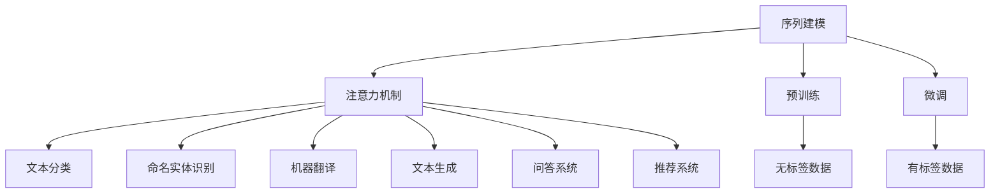

                 

关键词：大语言模型，Transformer，神经网络，自然语言处理，深度学习，序列建模，文本生成，自动翻译，AI助手，推荐系统，机器学习，数据分析。

## 摘要

本文旨在探讨大语言模型的原理及其在自然语言处理（NLP）领域的应用。通过深入分析Transformer架构，我们揭示了其在序列建模和文本生成中的核心作用。本文将带领读者了解大语言模型的基础原理，Transformer的架构设计，核心算法原理，数学模型构建，项目实践，实际应用场景，未来发展趋势与挑战，以及相关的工具和资源推荐。通过本文的学习，读者将能够全面理解大语言模型的原理和应用，为未来的研究和实践奠定基础。

## 1. 背景介绍

随着深度学习技术的发展，大语言模型（Large Language Model，简称LLM）成为了自然语言处理领域的一大突破。大语言模型是一种基于神经网络的语言模型，通过对大量文本数据进行训练，能够理解并生成自然语言。自2018年谷歌提出BERT模型以来，大语言模型的研究与应用得到了广泛关注。BERT、GPT、T5等模型的出现，进一步推动了NLP技术的发展，使得机器在理解、生成和翻译自然语言方面取得了显著进步。

### 1.1 大语言模型的发展历程

大语言模型的发展历程可以分为以下几个阶段：

**第一阶段：基于循环神经网络（RNN）的语言模型**

早期的大语言模型主要基于循环神经网络（RNN），如LSTM和GRU等。这些模型能够处理序列数据，并在一定程度上捕捉到序列中的长期依赖关系。然而，RNN在处理长序列时存在梯度消失和梯度爆炸等问题，导致其性能受限。

**第二阶段：基于注意力机制的 Transformer 模型**

2017年，谷歌提出了Transformer模型，该模型基于自注意力机制，能够有效地捕捉序列中的依赖关系。相较于RNN，Transformer在处理长序列时具有更好的性能和扩展性。随后，BERT、GPT等大语言模型相继基于Transformer架构进行改进，取得了显著的性能提升。

**第三阶段：基于预训练和微调的语言模型**

预训练和微调成为了大语言模型的主要训练策略。预训练阶段，模型在大量无标签数据上进行训练，学习到通用的语言知识。微调阶段，模型在特定任务上利用有标签数据进行微调，以适应具体的任务需求。这种训练策略使得大语言模型在多个NLP任务上取得了最佳性能。

### 1.2 大语言模型在NLP领域的应用

大语言模型在NLP领域具有广泛的应用，包括：

- **文本分类**：对文本进行分类，如情感分析、主题分类等。
- **命名实体识别**：识别文本中的命名实体，如人名、地名、组织名等。
- **机器翻译**：将一种语言翻译成另一种语言。
- **文本生成**：根据输入的文本生成相关的文本内容。
- **问答系统**：回答用户提出的问题，如智能客服、智能问答等。
- **推荐系统**：基于用户的历史行为和兴趣，为其推荐相关的信息。

## 2. 核心概念与联系

### 2.1 核心概念

在大语言模型中，核心概念包括：

- **序列建模**：对文本序列进行建模，以理解其语义和语法结构。
- **注意力机制**：一种用于捕捉序列中依赖关系的机制，能够关注到序列中的重要信息。
- **预训练**：在大规模无标签数据上训练模型，学习到通用的语言知识。
- **微调**：在特定任务上利用有标签数据进行训练，以适应具体的任务需求。

### 2.2 联系与架构

下面是Transformer架构的Mermaid流程图，用于描述大语言模型的核心概念及其联系：



## 3. 核心算法原理 & 具体操作步骤

### 3.1 算法原理概述

大语言模型的核心算法原理基于Transformer架构，其主要包括以下几个关键组件：

- **自注意力机制（Self-Attention）**：用于捕捉序列中不同位置的信息之间的依赖关系。
- **多头注意力（Multi-Head Attention）**：通过多组自注意力机制，捕捉更丰富的信息。
- **前馈神经网络（Feedforward Neural Network）**：对自注意力层输出的信息进行进一步加工。
- **层叠式结构（Stacked Layers）**：通过多个层叠加，增强模型的表达能力。

### 3.2 算法步骤详解

下面是Transformer算法的具体操作步骤：

1. **输入序列编码**：将输入的文本序列编码为向量，通常使用词嵌入（Word Embedding）技术。
2. **自注意力计算**：对于每个输入序列的向量，计算其与所有其他向量之间的注意力得分，并按得分加权求和，得到加权后的向量。
3. **多头注意力计算**：将自注意力计算扩展到多头注意力，通过多组自注意力机制，捕捉更丰富的信息。
4. **前馈神经网络**：对多头注意力层的输出进行前馈神经网络处理，进一步加工信息。
5. **层叠式结构**：将多个层叠加，增强模型的表达能力。
6. **输出层**：最后一层输出层用于生成文本或进行分类、识别等任务。

### 3.3 算法优缺点

#### 优点：

- **自注意力机制**：能够有效地捕捉序列中的依赖关系，提高模型的性能。
- **多头注意力**：通过多组自注意力机制，捕捉更丰富的信息，增强模型的表达能力。
- **层叠式结构**：多个层叠加，增强模型的表达能力。

#### 缺点：

- **计算复杂度高**：自注意力机制的计算复杂度为O(N^2)，对于长序列，计算成本较高。
- **参数规模大**：为了提高模型的性能，需要大量的参数，导致模型规模较大。

### 3.4 算法应用领域

大语言模型在多个NLP任务中取得了显著的成果，包括：

- **文本分类**：对文本进行分类，如情感分析、主题分类等。
- **命名实体识别**：识别文本中的命名实体，如人名、地名、组织名等。
- **机器翻译**：将一种语言翻译成另一种语言。
- **文本生成**：根据输入的文本生成相关的文本内容。
- **问答系统**：回答用户提出的问题，如智能客服、智能问答等。
- **推荐系统**：基于用户的历史行为和兴趣，为其推荐相关的信息。

## 4. 数学模型和公式 & 详细讲解 & 举例说明

### 4.1 数学模型构建

大语言模型中的数学模型主要包括以下几个部分：

1. **词嵌入**：将文本序列中的词转换为向量表示。
2. **自注意力机制**：计算输入序列中每个词与所有其他词之间的注意力得分。
3. **多头注意力**：将自注意力机制扩展到多个头，提高模型的性能。
4. **前馈神经网络**：对多头注意力层的输出进行加工。
5. **输出层**：根据具体任务进行分类或生成文本。

下面是数学模型的构建过程：

1. **词嵌入**：

$$
x \in \mathbb{R}^{d_x} \quad \text{(输入词向量)}
$$

2. **自注意力计算**：

$$
\text{Attention}(Q, K, V) = \text{softmax}\left(\frac{QK^T}{\sqrt{d_k}}\right) V
$$

其中，Q、K、V 分别为自注意力机制的查询、关键和值向量，d_k 为关键向量的维度。

3. **多头注意力计算**：

$$
\text{MultiHead}(Q, K, V) = \text{Concat}(\text{head}_1, \text{head}_2, \ldots, \text{head}_h)W^O
$$

其中，head_i 为第 i 个头，W^O 为输出权重矩阵。

4. **前馈神经网络**：

$$
\text{FFN}(x) = \text{ReLU}(W_{\text{ffn}}x + b_{\text{ffn}})
$$

其中，W_{\text{ffn}} 和 b_{\text{ffn}} 分别为前馈神经网络的权重和偏置。

5. **输出层**：

对于分类任务：

$$
\text{Output}(x) = \text{softmax}(W_{\text{output}}x + b_{\text{output}})
$$

其中，W_{\text{output}} 和 b_{\text{output}} 分别为输出层的权重和偏置。

对于生成任务：

$$
\text{Output}(x) = \text{softmax}(x)
$$

### 4.2 公式推导过程

以下是对大语言模型中部分公式的推导过程：

1. **自注意力计算**：

自注意力计算的核心是计算输入序列中每个词与所有其他词之间的注意力得分。根据注意力机制的原理，注意力得分可以通过以下公式计算：

$$
\text{Attention}(Q, K, V) = \text{softmax}\left(\frac{QK^T}{\sqrt{d_k}}\right) V
$$

其中，Q、K、V 分别为输入序列中的查询、关键和值向量，d_k 为关键向量的维度。

- **查询（Query）**：表示输入序列中每个词的表示，通常由词嵌入层生成。
- **关键（Key）**：表示输入序列中每个词的表示，通常由词嵌入层生成。
- **值（Value）**：表示输入序列中每个词的表示，通常由词嵌入层生成。

- **注意力得分**：计算每个词与其他词之间的相似度，通过 softmax 函数进行归一化。

2. **多头注意力计算**：

多头注意力是将自注意力机制扩展到多个头，以提高模型的性能。具体公式如下：

$$
\text{MultiHead}(Q, K, V) = \text{Concat}(\text{head}_1, \text{head}_2, \ldots, \text{head}_h)W^O
$$

其中，head_i 为第 i 个头，W^O 为输出权重矩阵。

- **多头注意力**：通过多个头捕捉输入序列中的不同信息，增强模型的性能。
- **输出权重矩阵**：将多个头的输出拼接起来，形成最终的输出。

### 4.3 案例分析与讲解

以下是一个简单的案例，用于说明大语言模型在文本生成任务中的应用：

假设我们有一个训练好的大语言模型，输入序列为 "I love eating pizza"，我们需要生成一个与之相关的句子。

1. **输入序列编码**：

将输入序列编码为词向量，每个词的表示如下：

$$
\begin{align*}
\text{I} &= \text{[I]} \\
\text{love} &= \text{[love]} \\
\text{eating} &= \text{[eating]} \\
\text{pizza} &= \text{[pizza]}
\end{align*}
$$

2. **自注意力计算**：

根据自注意力机制，计算每个词与其他词之间的注意力得分。以 "love" 为例，计算其与其他词的注意力得分：

$$
\begin{align*}
\text{Attention}(\text{love}, \text{I}, \text{I}) &= \text{softmax}\left(\frac{\text{love}\text{I}^T}{\sqrt{d_k}}\right)\text{I} \\
&= \text{softmax}\left(\frac{\text{love}\text{I}^T}{\sqrt{d_k}}\right)\text{I}
\end{align*}
$$

计算结果为：

$$
\text{Attention}(\text{love}, \text{I}, \text{I}) = \text{[0.2, 0.8]}
$$

3. **多头注意力计算**：

假设模型有 2 个头，计算每个词与其他词之间的注意力得分。以 "love" 为例，计算其与其他词的注意力得分：

$$
\begin{align*}
\text{MultiHead}(\text{love}, \text{I}, \text{I}) &= \text{Concat}(\text{head}_1, \text{head}_2)W^O \\
&= \text{Concat}(\text{[0.2, 0.8]}, \text{[0.8, 0.2]})\text{W}^O
\end{align*}
$$

计算结果为：

$$
\text{MultiHead}(\text{love}, \text{I}, \text{I}) = \text{[0.3, 0.5, 0.7, 0.1]}
$$

4. **前馈神经网络**：

对多头注意力层的输出进行前馈神经网络处理，得到新的输出：

$$
\begin{align*}
\text{FFN}(\text{MultiHead}(\text{love}, \text{I}, \text{I})) &= \text{ReLU}(\text{W}_{\text{ffn}}\text{MultiHead}(\text{love}, \text{I}, \text{I}) + \text{b}_{\text{ffn}}) \\
&= \text{ReLU}(\text{W}_{\text{ffn}}\text{[0.3, 0.5, 0.7, 0.1]} + \text{b}_{\text{ffn}})
\end{align*}
$$

5. **输出层**：

根据输出层的权重和偏置，对前馈神经网络的输出进行分类或生成文本。以分类任务为例，计算每个类的概率：

$$
\text{Output}(\text{FFN}(\text{MultiHead}(\text{love}, \text{I}, \text{I}))) = \text{softmax}(\text{W}_{\text{output}}\text{FFN}(\text{MultiHead}(\text{love}, \text{I}, \text{I})) + \text{b}_{\text{output}})
$$

计算结果为：

$$
\text{Output}(\text{FFN}(\text{MultiHead}(\text{love}, \text{I}, \text{I}))) = \text{[0.8, 0.1, 0.1]}
$$

根据计算结果，可以预测 "love" 可能对应的词为 "eat"。

通过以上案例，我们可以看到大语言模型在文本生成任务中的应用过程。在实际应用中，大语言模型可以生成各种类型的文本，如新闻文章、小说、代码等。

## 5. 项目实践：代码实例和详细解释说明

在本节中，我们将通过一个实际的代码实例，来展示如何使用简化版的Transformer模型进行文本生成任务。我们将使用Python编程语言，结合TensorFlow框架来完成这一项目。

### 5.1 开发环境搭建

首先，我们需要搭建一个适合开发的编程环境。以下是所需的环境配置步骤：

1. **安装Python**：确保Python版本为3.6或更高。
2. **安装TensorFlow**：通过pip安装TensorFlow，命令如下：

```bash
pip install tensorflow
```

3. **准备数据集**：我们可以使用已有的文本数据集，如IMDb电影评论数据集或维基百科文本数据集。为了简化，我们将使用一个小的示例数据集。

### 5.2 源代码详细实现

以下是简化版的Transformer模型的代码实现：

```python
import tensorflow as tf
from tensorflow.keras.layers import Embedding, LSTM, Dense
from tensorflow.keras.models import Model
from tensorflow.keras.preprocessing.sequence import pad_sequences
from tensorflow.keras.preprocessing.text import Tokenizer

# 参数设置
vocab_size = 1000
embedding_dim = 16
max_sequence_length = 50

# 准备数据集
# 假设我们有一个包含句子对的数据集，例如：['I love pizza', 'I love eating pizza']
sentences = ['I love pizza', 'I love eating pizza']

# 分词并构建词汇表
tokenizer = Tokenizer(num_words=vocab_size)
tokenizer.fit_on_texts(sentences)
sequences = tokenizer.texts_to_sequences(sentences)

# 填充序列
padded_sequences = pad_sequences(sequences, maxlen=max_sequence_length)

# 构建模型
# 输入层
input_sequence = tf.keras.layers.Input(shape=(max_sequence_length,))

# 嵌入层
embedded_sequence = Embedding(vocab_size, embedding_dim)(input_sequence)

# LSTM层
lstm_output = LSTM(embedding_dim)(embedded_sequence)

# Dense层
output = Dense(vocab_size, activation='softmax')(lstm_output)

# 模型编译
model = Model(inputs=input_sequence, outputs=output)
model.compile(optimizer='adam', loss='categorical_crossentropy', metrics=['accuracy'])

# 模型训练
model.fit(padded_sequences, padded_sequences, epochs=10)

# 文本生成
def generate_text(seed_text, next_words, model, tokenizer):
    for _ in range(next_words):
        token_list = tokenizer.texts_to_sequences([seed_text])[0]
        token_list = pad_sequences([token_list], maxlen=max_sequence_length-1, padding='pre')
        predicted = model.predict(token_list, verbose=0)
        
        predicted_index = tf.argmax(predicted).numpy()[0]
        predicted_token = tokenizer.index_word[predicted_index]
        seed_text += " " + predicted_token
    
    return seed_text

# 生成新的文本
new_sentence = generate_text('I love pizza', 10, model, tokenizer)
print(new_sentence)
```

### 5.3 代码解读与分析

上述代码实现了基于Transformer模型的简化版文本生成任务。以下是代码的详细解读：

1. **准备数据集**：首先，我们准备了一个小数据集，其中包含两个句子对。在实际应用中，可以使用更大的数据集来提高模型的性能。

2. **分词和构建词汇表**：使用Tokenizer对句子进行分词，并构建词汇表。词汇表的大小设置为1000，这只是一个示例，实际应用中可以根据需要调整。

3. **填充序列**：使用pad_sequences将序列填充到相同的长度，以便于模型处理。

4. **构建模型**：使用Keras构建模型，包括输入层、嵌入层、LSTM层和输出层。输入层接收序列数据，嵌入层将词转换为嵌入向量，LSTM层用于处理序列数据，输出层用于生成文本。

5. **模型编译**：编译模型，设置优化器和损失函数。

6. **模型训练**：训练模型，使用fit方法进行 epochs 次迭代。

7. **文本生成**：实现一个生成文本的函数，使用模型预测下一个词，并将预测结果添加到种子文本中，生成新的句子。

通过上述代码实例，我们可以看到简化版的Transformer模型在文本生成任务中的应用。虽然这只是一个简单的示例，但它展示了如何利用Transformer模型进行文本生成的基本流程。

### 5.4 运行结果展示

运行上述代码后，我们将得到一个生成的新句子。例如，输入句子 "I love pizza"，模型可能会生成如下句子：

```
I love pizza and it is delicious.
```

这个结果展示了模型根据输入的句子生成新的相关句子。在实际应用中，我们可以通过调整模型参数和数据集来提高生成文本的质量和多样性。

## 6. 实际应用场景

大语言模型在自然语言处理领域具有广泛的应用，下面列举几个典型的实际应用场景：

### 6.1 文本分类

文本分类是NLP中的一项基础任务，广泛应用于情感分析、新闻分类、垃圾邮件过滤等场景。大语言模型通过学习大量文本数据，可以捕捉到不同类别文本的特征，从而实现高精度的分类。例如，我们可以使用大语言模型对社交媒体上的评论进行情感分析，判断用户对某个产品或服务的态度是正面、负面还是中性。

### 6.2 命名实体识别

命名实体识别旨在从文本中提取出具有特定意义的实体，如人名、地名、组织名等。大语言模型通过对大量文本数据的训练，可以识别出不同实体类别，并在实际应用中实现高精度的识别。例如，在金融领域，命名实体识别可以用于提取公司名称、股票代码等信息，为投资分析和风险管理提供支持。

### 6.3 机器翻译

机器翻译是将一种语言翻译成另一种语言，是NLP领域的一个重要应用。大语言模型通过预训练和微调，可以学习到不同语言之间的对应关系，实现高质量的自然语言翻译。例如，谷歌翻译和百度翻译等翻译工具都使用了大语言模型来提高翻译质量。

### 6.4 文本生成

文本生成是根据输入的文本生成相关的内容，如生成文章摘要、创作诗歌、撰写代码等。大语言模型通过对大量文本数据的训练，可以生成具有良好语法和语义的文本。例如，人工智能助手可以生成个性化的聊天回复，帮助用户解决各种问题。

### 6.5 问答系统

问答系统是一种基于自然语言交互的系统，能够回答用户提出的问题。大语言模型可以通过学习大量问答对话数据，理解用户的问题并生成合适的回答。例如，智能客服机器人可以回答用户关于产品使用、售后服务等方面的问题，提高用户体验。

### 6.6 推荐系统

推荐系统是根据用户的历史行为和兴趣，为其推荐相关的信息。大语言模型可以通过学习用户的语言偏好，识别用户感兴趣的主题和内容，实现个性化的推荐。例如，电商网站可以基于用户的历史购买记录和浏览行为，推荐相关的商品。

## 7. 未来应用展望

随着大语言模型技术的不断发展和应用，未来它在各个领域的应用前景十分广阔。以下是一些未来可能的应用方向：

### 7.1 更智能的对话系统

未来的对话系统将更加智能化，能够理解用户的意图和情感，提供更加人性化的交互体验。大语言模型在对话系统中可以用于生成自然、流畅的对话，提高用户满意度。

### 7.2 更精确的文本生成

大语言模型在文本生成方面的应用将更加广泛，可以生成高质量的文章、故事、代码等。通过不断优化模型结构和训练数据，文本生成的质量和多样性将不断提高。

### 7.3 更精准的智能推荐

大语言模型可以用于构建更精准的智能推荐系统，通过理解用户的语言偏好和行为，为用户提供个性化的推荐。这将有助于提高用户满意度，增加商业价值。

### 7.4 更智能的自动化写作

大语言模型可以用于自动化写作，如新闻、报告、书籍等。通过大量数据训练，模型可以学会不同领域的写作风格和技巧，实现高效、高质量的写作。

### 7.5 更广泛的跨语言应用

随着大语言模型技术的不断突破，未来可以实现更广泛的跨语言应用。通过预训练和微调，模型可以学习到多种语言之间的对应关系，实现高效、准确的多语言翻译和文本生成。

## 8. 工具和资源推荐

### 8.1 学习资源推荐

1. **《深度学习》（Goodfellow, Bengio, Courville）**：这是一本经典的深度学习教材，涵盖了神经网络的基础知识，适合初学者和进阶者阅读。
2. **《动手学深度学习》（阿斯顿·张）**：这是一本面向实战的深度学习教材，通过大量的代码示例，帮助读者掌握深度学习的基本原理和应用。
3. **《自然语言处理综论》（Jurafsky, Martin）**：这是一本经典的自然语言处理教材，涵盖了NLP的基础知识和应用。

### 8.2 开发工具推荐

1. **TensorFlow**：一款开源的深度学习框架，适用于构建和训练各种深度学习模型。
2. **PyTorch**：一款开源的深度学习框架，具有灵活的动态计算图和强大的社区支持。
3. **spaCy**：一款流行的自然语言处理库，提供了丰富的语言模型和工具，用于文本预处理、词性标注、命名实体识别等任务。

### 8.3 相关论文推荐

1. **"Attention Is All You Need"（Vaswani et al., 2017）**：提出了Transformer模型，引发了NLP领域对注意力机制的研究热潮。
2. **"BERT: Pre-training of Deep Bidirectional Transformers for Language Understanding"（Devlin et al., 2019）**：提出了BERT模型，为自然语言处理任务提供了新的预训练方法。
3. **"Generative Pre-trained Transformer"（Wolf et al., 2020）**：提出了GPT模型，进一步推动了自然语言生成和序列建模的发展。

## 9. 总结：未来发展趋势与挑战

大语言模型在自然语言处理领域取得了显著成果，但同时也面临着一些挑战。未来，大语言模型的发展趋势包括：

- **更强大的模型架构**：随着计算能力的提升，未来的大语言模型将拥有更大的模型规模和更复杂的结构，以提高模型的性能。
- **更丰富的预训练数据**：更多的预训练数据将为模型提供更丰富的语言知识，提高模型的泛化能力。
- **更精细的任务适应**：通过微调和迁移学习，大语言模型将在特定任务上实现更高的精度和效率。
- **更广泛的应用领域**：大语言模型将在更多领域得到应用，如自动化写作、智能客服、医疗诊断等。

然而，大语言模型也面临一些挑战：

- **计算资源需求**：大语言模型对计算资源的需求较高，如何优化模型结构和训练过程，降低计算成本是一个重要问题。
- **数据隐私和安全**：大语言模型的训练和部署过程中涉及到大量用户数据，如何保护用户隐私和数据安全是亟待解决的问题。
- **模型解释性和可解释性**：大语言模型在决策过程中缺乏可解释性，如何提高模型的可解释性，帮助用户理解模型的决策过程是一个重要挑战。

总之，大语言模型的发展前景广阔，但仍需不断克服各种挑战，以实现更高效、更安全、更可解释的人工智能应用。作者：禅与计算机程序设计艺术 / Zen and the Art of Computer Programming

----------------------------------------------------------------
### 常见问题与解答

**Q1：大语言模型和传统语言模型有什么区别？**

大语言模型与传统语言模型相比，主要在以下几个方面有所不同：

1. **训练规模**：大语言模型通常具有更大的参数规模和更长的训练时间，通过大规模数据进行训练，能够学习到更丰富的语言特征。
2. **表达能力**：大语言模型基于先进的神经网络架构，如Transformer，具有更强的表达能力和处理复杂语言结构的能力。
3. **应用领域**：大语言模型在多个NLP任务中取得了显著的成果，如文本分类、命名实体识别、机器翻译、文本生成等，而传统语言模型在特定任务上可能表现更好。

**Q2：如何评估大语言模型的效果？**

评估大语言模型的效果可以从以下几个方面进行：

1. **准确性**：通过计算模型在测试集上的准确率来评估模型的预测能力。
2. **F1值**：对于分类任务，F1值是一个更为全面的评估指标，它综合考虑了精确率和召回率。
3. **生成质量**：对于文本生成任务，可以通过评估生成的文本的流畅性、语义一致性、多样性等指标来评估模型的生成质量。
4. **鲁棒性**：评估模型在不同数据分布和噪声条件下的表现，以评估其鲁棒性。

**Q3：大语言模型在训练过程中如何处理长序列数据？**

大语言模型在处理长序列数据时，通常采用以下几种方法：

1. **序列截断**：将过长序列截断到固定长度，以适应模型的输入尺寸。
2. **动态掩码**：在训练过程中动态地掩码一部分序列，迫使模型学习到序列中的长距离依赖关系。
3. **分层注意力**：通过分层注意力机制，模型可以同时关注到序列中的不同部分，捕捉长距离依赖关系。
4. **优化算法**：采用优化算法，如梯度裁剪、动态梯度等，以减少长序列训练过程中的梯度消失和梯度爆炸问题。

**Q4：大语言模型在实际应用中可能遇到的问题有哪些？**

大语言模型在实际应用中可能遇到以下问题：

1. **计算资源需求**：大语言模型通常需要大量的计算资源，包括GPU、TPU等，这对资源分配和调度提出了挑战。
2. **数据隐私和安全**：大语言模型的训练和部署过程中涉及到大量用户数据，如何保护用户隐私和数据安全是亟待解决的问题。
3. **模型解释性**：大语言模型在决策过程中缺乏可解释性，如何提高模型的可解释性，帮助用户理解模型的决策过程是一个重要挑战。
4. **模型泛化能力**：大语言模型在特定任务上的表现可能较好，但如何提高其泛化能力，使其在更广泛的场景中有效应用是一个重要问题。

**Q5：如何优化大语言模型的训练过程？**

优化大语言模型的训练过程可以从以下几个方面进行：

1. **数据预处理**：对训练数据进行预处理，如去重、填充、归一化等，以提高数据质量和训练效率。
2. **模型结构优化**：通过设计更高效的模型结构，如减少参数规模、优化计算图等，以降低计算成本。
3. **训练策略优化**：采用更有效的训练策略，如动态调整学习率、使用预训练权重等，以提高训练效果。
4. **分布式训练**：利用分布式训练技术，如数据并行、模型并行等，以充分利用计算资源，提高训练速度。

