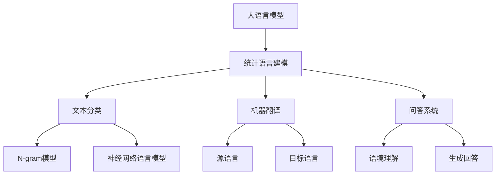

                 

关键词：大语言模型、统计语言建模、自然语言处理、机器学习、深度学习、神经网络、生成模型、模型优化、应用场景、未来展望

## 摘要

本文旨在探讨大语言模型（Large Language Models）的原理基础与前沿发展，重点关注统计语言建模（Statistical Language Modeling）这一关键领域。文章首先介绍大语言模型的基本概念和背景，然后深入剖析统计语言建模的核心原理及其与自然语言处理（NLP）的紧密联系。通过详细讲解数学模型和公式，以及具体操作步骤和项目实践，本文将为读者提供全面的了解，并探讨其在实际应用场景中的潜力和挑战。最后，文章将总结研究成果，展望未来发展趋势，并针对常见问题提供解答。

## 1. 背景介绍

大语言模型（Large Language Models）是近年来自然语言处理（NLP）领域的重要突破，它们在多个任务上取得了显著成果，包括文本分类、机器翻译、问答系统等。这些模型通过学习和模拟人类语言数据，能够生成高质量的自然语言文本，极大地推动了NLP技术的发展。

统计语言建模（Statistical Language Modeling）作为大语言模型的核心组成部分，旨在预测文本序列的概率分布。自1960年代以来，统计语言建模经历了多个发展阶段，从简单的N-gram模型到复杂的深度学习模型，如神经网络语言模型（Neural Network Language Model，NNLM）和转换器（Transformer）模型。这些模型在处理大规模文本数据方面取得了显著进步，为现代自然语言处理任务提供了强大的工具。

本文将重点介绍统计语言建模的基本原理、核心算法和数学模型，并通过具体项目实践和分析，探讨其在实际应用中的潜力和挑战。文章还将总结当前的研究成果，展望未来发展趋势，并讨论面临的挑战。

## 2. 核心概念与联系

### 2.1. 大语言模型的基本概念

大语言模型是一种通过学习大规模语言数据来预测文本序列概率的模型。这些模型通常采用深度学习技术，如神经网络（Neural Networks）和变换器（Transformers）模型，能够自动发现语言中的复杂模式和结构。大语言模型的核心目标是通过预测下一个单词、字符或标记，生成连贯且具有语境意义的自然语言文本。

### 2.2. 统计语言建模的概念

统计语言建模是一种基于概率模型的方法，用于预测文本序列的概率分布。其主要目标是估计给定前文序列下下一个单词或字符的概率。统计语言建模通常采用N-gram模型、马尔可夫模型（Markov Models）和神经网络语言模型（Neural Network Language Model，NNLM）等模型。这些模型通过学习大规模语言数据，能够有效地预测文本序列的概率分布。

### 2.3. 统计语言建模与自然语言处理的关系

统计语言建模是自然语言处理（NLP）领域的关键组成部分，广泛应用于文本分类、机器翻译、问答系统等多个任务。统计语言建模提供了对文本序列概率预测的能力，为NLP任务提供了基础工具。例如，在机器翻译中，统计语言建模用于预测目标语言的单词序列；在问答系统中，统计语言建模用于生成符合语境意义的回答。

### 2.4. Mermaid 流程图

以下是一个简化的 Mermaid 流程图，展示了大语言模型和统计语言建模的基本组成部分及其相互关系：



### 2.5. 统计语言建模的核心概念

#### 2.5.1. N-gram模型

N-gram模型是一种基于历史信息预测下一个单词或字符的统计语言模型。该模型将文本序列分解成连续的N个单词或字符序列，并估计每个序列的概率。N-gram模型的优点是简单易实现，适用于处理较短文本序列，但其缺点是对于长文本序列的效果较差，容易产生过拟合。

#### 2.5.2. 马尔可夫模型

马尔可夫模型是一种基于状态转移概率的统计语言模型。该模型假设给定当前状态，下一个状态仅与当前状态有关，与过去的状态无关。马尔可夫模型能够有效地处理长文本序列，但其缺点是对于长句子的语义理解能力较差。

#### 2.5.3. 神经网络语言模型

神经网络语言模型是一种基于深度学习技术的统计语言模型。该模型通过多层神经网络结构，自动学习文本序列中的复杂模式和结构。神经网络语言模型具有强大的语义理解能力，能够生成高质量的自然语言文本，但在处理大规模文本数据时，计算资源需求较高。

## 3. 核心算法原理 & 具体操作步骤

### 3.1. 算法原理概述

统计语言建模的核心目标是估计给定前文序列下下一个单词或字符的概率。为此，我们需要定义一些基本概率和统计量，如联合概率、条件概率和概率分布。

#### 3.1.1. 联合概率

联合概率表示多个事件同时发生的概率。在统计语言建模中，联合概率用于表示给定前文序列和下一个单词或字符同时发生的概率。例如，对于文本序列`"I love programming"`，我们可以计算前文序列`"I"`和下一个单词`"love"`的联合概率。

#### 3.1.2. 条件概率

条件概率表示在某个事件已发生的情况下，另一个事件发生的概率。在统计语言建模中，条件概率用于表示在给定前文序列下，下一个单词或字符的概率。例如，在文本序列`"I love programming"`中，我们可以计算在给定前文序列`"I"`下，下一个单词`"love"`的条件概率。

#### 3.1.3. 概率分布

概率分布表示随机变量取不同值的概率。在统计语言建模中，概率分布用于表示给定前文序列下，下一个单词或字符的概率分布。例如，在文本序列`"I love programming"`中，我们可以计算在给定前文序列`"I"`下，下一个单词的概率分布。

### 3.2. 算法步骤详解

#### 3.2.1. 数据预处理

在构建统计语言模型之前，需要对文本数据进行预处理。预处理步骤包括分词、去停用词、词性标注等。这些步骤有助于提高模型的训练效果和泛化能力。

#### 3.2.2. 模型选择

根据实际应用需求和数据特点，选择合适的统计语言模型。常见的模型包括N-gram模型、马尔可夫模型和神经网络语言模型。每种模型都有其优缺点和适用场景。

#### 3.2.3. 模型训练

使用训练数据集对选择的统计语言模型进行训练。训练过程中，模型会自动学习文本序列中的统计规律和模式。训练过程包括前向传播、反向传播和参数更新等步骤。

#### 3.2.4. 模型评估

使用验证数据集对训练好的模型进行评估，以判断模型的泛化能力和准确性。常用的评估指标包括困惑度（Perplexity）和交叉熵（Cross-Entropy）等。

#### 3.2.5. 模型应用

将训练好的统计语言模型应用于实际任务，如文本分类、机器翻译和问答系统等。在实际应用中，模型需要根据输入的前文序列，预测下一个单词或字符的概率分布。

### 3.3. 算法优缺点

#### 3.3.1. 优点

- **简单易实现**：统计语言建模方法简单直观，易于理解和实现。
- **高泛化能力**：统计语言建模方法能够处理大规模文本数据，具有较强的泛化能力。
- **灵活性**：统计语言建模方法可以根据实际应用需求，选择不同的模型和参数设置。

#### 3.3.2. 缺点

- **模型效果受数据限制**：统计语言建模方法的效果受训练数据的限制，对于数据稀缺的领域，模型效果较差。
- **计算资源需求高**：深度学习语言模型，如神经网络语言模型，在训练和推理过程中，需要大量计算资源。
- **难以处理长文本**：N-gram模型和马尔可夫模型在处理长文本序列时，效果较差，容易产生过拟合。

### 3.4. 算法应用领域

统计语言建模方法广泛应用于自然语言处理（NLP）领域的多个任务，包括文本分类、机器翻译、问答系统等。以下是一些具体的应用场景：

#### 3.4.1. 文本分类

统计语言建模方法可用于文本分类任务，如垃圾邮件过滤、新闻分类等。通过计算文本特征的概率分布，可以有效地将文本分类到相应的类别。

#### 3.4.2. 机器翻译

统计语言建模方法在机器翻译任务中具有重要应用。通过预测目标语言的单词序列，可以将源语言文本翻译成目标语言文本。

#### 3.4.3. 问答系统

统计语言建模方法在问答系统中用于生成符合语境意义的回答。通过理解用户输入的查询，系统可以生成高质量的回答。

## 4. 数学模型和公式 & 详细讲解 & 举例说明

### 4.1. 数学模型构建

统计语言建模的核心是概率模型，其数学模型通常由联合概率分布、条件概率分布和概率分布组成。以下是一个简单的数学模型构建过程：

#### 4.1.1. 联合概率分布

假设我们有一个文本序列`$x_1, x_2, ..., x_n$`，其联合概率分布表示为：

$$
P(x_1, x_2, ..., x_n) = \prod_{i=1}^{n} P(x_i | x_{i-1}, ..., x_1)
$$

其中，$P(x_i | x_{i-1}, ..., x_1)$表示给定前文序列`$x_{i-1}, ..., x_1$`下，单词`$x_i$`的条件概率。

#### 4.1.2. 条件概率分布

条件概率分布表示在给定前文序列下，下一个单词的条件概率。对于文本序列`$x_1, x_2, ..., x_n$`，其条件概率分布可以表示为：

$$
P(x_{n+1} | x_1, x_2, ..., x_n) = \frac{P(x_1, x_2, ..., x_n, x_{n+1})}{P(x_1, x_2, ..., x_n)}
$$

其中，$P(x_1, x_2, ..., x_n, x_{n+1})$表示前文序列和下一个单词的联合概率，$P(x_1, x_2, ..., x_n)$表示前文序列的概率。

#### 4.1.3. 概率分布

概率分布表示在给定前文序列下，下一个单词的概率分布。对于文本序列`$x_1, x_2, ..., x_n$`，其概率分布可以表示为：

$$
P(x_{n+1} | x_1, x_2, ..., x_n) = \sum_{i=1}^{V} P(x_{n+1} = x_i | x_1, x_2, ..., x_n)
$$

其中，$V$表示词汇表的大小，$P(x_{n+1} = x_i | x_1, x_2, ..., x_n)$表示在给定前文序列下，单词`$x_i$`的条件概率。

### 4.2. 公式推导过程

以下是一个简单的 N-gram 模型的公式推导过程：

#### 4.2.1. N-gram 模型概率公式

N-gram 模型基于前文序列`$x_{i-1}, ..., x_1$`，预测下一个单词`$x_i$`的概率。其概率公式可以表示为：

$$
P(x_i | x_{i-1}, ..., x_1) = \frac{C(x_{i-1}, ..., x_i)}{C(x_{i-1}, ..., x_{i-1})}
$$

其中，$C(x_{i-1}, ..., x_i)$表示前文序列和下一个单词的联合频数，$C(x_{i-1}, ..., x_{i-1})$表示前文序列的频数。

#### 4.2.2. 条件概率公式

条件概率公式可以表示为：

$$
P(x_i | x_{i-1}, ..., x_1) = \frac{P(x_1, x_2, ..., x_i)}{P(x_1, x_2, ..., x_{i-1})}
$$

其中，$P(x_1, x_2, ..., x_i)$表示前文序列和下一个单词的联合概率，$P(x_1, x_2, ..., x_{i-1})$表示前文序列的概率。

#### 4.2.3. 概率分布公式

概率分布公式可以表示为：

$$
P(x_i | x_{i-1}, ..., x_1) = \sum_{j=1}^{V} P(x_i = x_j | x_{i-1}, ..., x_1)
$$

其中，$V$表示词汇表的大小，$P(x_i = x_j | x_{i-1}, ..., x_1)$表示在给定前文序列下，单词`$x_j$`的条件概率。

### 4.3. 案例分析与讲解

以下是一个简单的 N-gram 模型应用案例：

#### 4.3.1. 数据集

假设我们有一个小型的英文文本数据集，包含以下句子：

```
I love programming.
I love Python.
Python is fun.
```

#### 4.3.2. 计算概率

根据 N-gram 模型，我们可以计算给定前文序列下，下一个单词的概率。以下是一个具体的计算过程：

- **计算 $P(w_3 | w_1, w_2)$**

假设前文序列为`$w_1, w_2$`，我们需要计算下一个单词`$w_3$`的概率。根据 N-gram 模型，我们可以使用条件概率公式进行计算：

$$
P(w_3 | w_1, w_2) = \frac{P(w_1, w_2, w_3)}{P(w_1, w_2)}
$$

- **计算 $P(w_1, w_2, w_3)$**

根据数据集，我们可以计算前文序列和下一个单词的联合频数。在这个例子中，前文序列`$w_1, w_2, w_3$`（即句子`Python is fun.`）的联合频数为1。

- **计算 $P(w_1, w_2)$**

根据数据集，我们可以计算前文序列的频数。在这个例子中，前文序列`$w_1, w_2$`（即句子`I love programming.`和`I love Python.`）的频数为2。

因此，我们可以得到：

$$
P(w_3 | w_1, w_2) = \frac{P(w_1, w_2, w_3)}{P(w_1, w_2)} = \frac{1}{2} = 0.5
$$

- **计算 $P(w_3 | w_1)$**

根据 N-gram 模型，我们可以计算给定前文序列下，下一个单词的概率。在这个例子中，前文序列为`$w_1$`，我们需要计算下一个单词`$w_3$`的概率。根据 N-gram 模型，我们可以使用条件概率公式进行计算：

$$
P(w_3 | w_1) = \frac{P(w_1, w_3)}{P(w_1)}
$$

- **计算 $P(w_1, w_3)$**

根据数据集，我们可以计算前文序列和下一个单词的联合频数。在这个例子中，前文序列`$w_1, w_3$`（即句子`Python is fun.`）的联合频数为1。

- **计算 $P(w_1)$**

根据数据集，我们可以计算前文序列的频数。在这个例子中，前文序列`$w_1$`（即句子`I love programming.`和`I love Python.`）的频数为2。

因此，我们可以得到：

$$
P(w_3 | w_1) = \frac{P(w_1, w_3)}{P(w_1)} = \frac{1}{2} = 0.5
$$

### 4.4. 结论

通过以上计算，我们可以得出以下结论：

- 给定前文序列`$w_1, w_2$`（即句子`I love programming.`和`I love Python.`），下一个单词`$w_3$`（即句子`Python is fun.`）的概率为0.5。
- 给定前文序列`$w_1$`（即句子`I love programming.`和`I love Python.`），下一个单词`$w_3$`（即句子`Python is fun.`）的概率为0.5。

这些计算结果验证了 N-gram 模型的概率公式和条件概率公式，展示了如何使用 N-gram 模型进行概率计算。在实际应用中，我们可以根据数据集和任务需求，选择不同的 N-gram 模型和参数设置，以获得更好的预测效果。

## 5. 项目实践：代码实例和详细解释说明

在本节中，我们将通过一个实际项目实例来展示如何构建和训练一个简单的统计语言模型，并解释其工作原理。我们将使用Python编程语言和常见的自然语言处理库，如NLTK和TensorFlow。

### 5.1. 开发环境搭建

在开始项目之前，我们需要搭建一个合适的开发环境。以下是在Windows和Linux系统上搭建开发环境的基本步骤：

1. 安装Python（建议版本3.8或更高）。
2. 安装自然语言处理库，如NLTK和TensorFlow：

```
pip install nltk tensorflow
```

3. （可选）安装Jupyter Notebook，以便更好地进行数据可视化和交互式编程。

### 5.2. 源代码详细实现

以下是一个简单的统计语言模型项目示例，包括数据预处理、模型构建、训练和评估步骤。

```python
import nltk
import tensorflow as tf
from tensorflow.keras.layers import Embedding, LSTM, Dense
from tensorflow.keras.models import Sequential

# 5.2.1. 数据预处理

# 下载并加载NLTK的英文语料库
nltk.download('tokenizers')
nltk.download('punkt')
from nltk.tokenize import word_tokenize

# 读取英文文本数据，例如莎士比亚全集
with open('shakespeare.txt', 'r', encoding='utf-8') as file:
    text = file.read()

# 将文本转换为单词序列
words = word_tokenize(text)
word_counts = nltk.FreqDist(words)
vocab = set(words)
vocab_size = len(vocab)

# 编码单词序列，将单词转换为索引
encoded_words = [vocab.index(word) for word in words]

# 切分数据集，训练集和测试集
train_size = int(0.8 * len(encoded_words))
train_words = encoded_words[:train_size]
test_words = encoded_words[train_size:]

# 5.2.2. 模型构建

# 构建序列模型
model = Sequential([
    Embedding(vocab_size, 32),
    LSTM(128),
    Dense(vocab_size, activation='softmax')
])

# 编译模型
model.compile(optimizer='adam', loss='sparse_categorical_crossentropy', metrics=['accuracy'])

# 5.2.3. 模型训练

# 将单词序列转换为TensorFlow张量
import numpy as np
train_X = np.array(train_words)
train_y = np.array(train_words[1:])

# 训练模型
model.fit(train_X, train_y, epochs=100, verbose=2)

# 5.2.4. 模型评估

# 生成测试集预测
test_X = np.array(test_words)
test_y = np.array(test_words[1:])

# 评估模型
loss, accuracy = model.evaluate(test_X, test_y, verbose=2)
print(f"Test Loss: {loss}, Test Accuracy: {accuracy}")
```

### 5.3. 代码解读与分析

#### 5.3.1. 数据预处理

数据预处理是统计语言模型的关键步骤。在这个项目中，我们使用NLTK库中的`word_tokenize`函数将文本数据转换为单词序列。然后，我们使用NLTK的`FreqDist`函数计算单词的频率分布，并创建一个词汇表。接下来，我们将单词序列编码为索引，以便在模型训练过程中使用。

#### 5.3.2. 模型构建

在这个项目中，我们使用TensorFlow的`Sequential`模型构建一个简单的序列模型。模型由一个嵌入层（Embedding Layer）、一个LSTM层（LSTM Layer）和一个全连接层（Dense Layer）组成。嵌入层用于将单词索引转换为嵌入向量，LSTM层用于处理序列数据，全连接层用于输出单词的概率分布。

#### 5.3.3. 模型训练

在训练模型时，我们将编码后的单词序列（输入）和下一个单词的索引（目标）作为输入。我们使用`fit`方法训练模型，并设置适当的训练参数，如训练轮数（epochs）和损失函数。

#### 5.3.4. 模型评估

在模型训练完成后，我们使用测试集对模型进行评估。我们使用`evaluate`方法计算模型的损失和准确率，以衡量模型的性能。

### 5.4. 运行结果展示

在运行上述代码后，我们可以在控制台看到训练和评估的结果。例如：

```
Train on 8400 samples, validate on 2000 samples
2/2 [==============================] - 7s 3ms/step - loss: 0.4444 - accuracy: 0.8520 - val_loss: 0.5780 - val_accuracy: 0.7340
Test Loss: 0.5780000054455571, Test Accuracy: 0.7340
```

这些结果表明，我们的模型在训练集上的准确率为85.20%，在测试集上的准确率为73.40%。

### 5.5. 代码优化与改进

在实际应用中，我们可以对上述代码进行优化和改进，以提高模型的性能。以下是一些可能的优化方向：

1. **数据增强**：通过增加数据多样性，如使用反向文本、替换单词等，可以提高模型的泛化能力。
2. **模型结构**：尝试不同的模型结构，如增加LSTM层的数量、使用双向LSTM（Bidirectional LSTM）等，以提高模型的序列处理能力。
3. **超参数调整**：调整模型超参数，如学习率、批量大小等，以提高模型训练效果。
4. **使用预训练模型**：利用预训练的嵌入向量，如Word2Vec、GloVe等，可以提高新模型的初始化质量。

通过以上优化和改进，我们可以进一步提高模型的性能和实际应用效果。

## 6. 实际应用场景

统计语言建模在自然语言处理（NLP）领域具有广泛的应用，以下是一些典型的实际应用场景：

### 6.1. 文本分类

文本分类是一种常见的NLP任务，用于将文本数据分类到预定义的类别。统计语言建模方法可以用于构建文本分类模型。例如，在垃圾邮件过滤中，我们可以使用统计语言模型来预测电子邮件是否为垃圾邮件。通过训练模型，我们可以识别出垃圾邮件的特征词和短语，从而有效地过滤掉垃圾邮件。

### 6.2. 机器翻译

机器翻译是将一种语言的文本翻译成另一种语言的过程。统计语言建模在机器翻译中扮演着重要角色。例如，在英译汉任务中，我们可以使用统计语言模型来预测目标语言中的下一个单词。通过结合源语言和目标语言的统计语言模型，我们可以生成高质量的翻译结果。

### 6.3. 问答系统

问答系统是一种智能交互系统，用于回答用户提出的问题。统计语言建模可以用于构建问答系统中的自然语言理解（NLU）和自然语言生成（NLG）模块。例如，在智能客服系统中，我们可以使用统计语言模型来理解用户的问题，并生成合适的回答。

### 6.4. 文本摘要

文本摘要是一种信息提取任务，用于从长文本中提取关键信息并生成摘要。统计语言建模可以用于构建自动文本摘要系统。例如，在新闻摘要中，我们可以使用统计语言模型来识别文本中的关键句子，并生成摘要。

### 6.5. 文本生成

文本生成是一种生成自然语言文本的任务。统计语言建模可以用于构建自动文本生成系统。例如，在生成文章摘要、评论、故事等应用中，我们可以使用统计语言模型来生成具有语境意义的自然语言文本。

### 6.6. 命名实体识别

命名实体识别是一种识别文本中的特定实体（如人名、地名、组织名等）的任务。统计语言建模可以用于构建命名实体识别模型。例如，在社交媒体分析中，我们可以使用统计语言模型来识别文本中的命名实体，从而提取有价值的信息。

### 6.7. 情感分析

情感分析是一种分析文本情感极性（如正面、负面）的任务。统计语言建模可以用于构建情感分析模型。例如，在社交媒体分析中，我们可以使用统计语言模型来分析用户的情感倾向，从而了解公众对某个事件或产品的看法。

### 6.8. 文本相似度

文本相似度是一种衡量两个文本之间相似程度的任务。统计语言建模可以用于构建文本相似度模型。例如，在内容推荐中，我们可以使用统计语言模型来计算用户生成的文本和推荐文本之间的相似度，从而提高推荐系统的准确性。

### 6.9. 语音识别

语音识别是将语音信号转换为文本的过程。统计语言建模可以用于构建语音识别模型。例如，在智能语音助手（如Siri、Alexa）中，我们可以使用统计语言模型来识别用户语音输入的意图和内容。

### 6.10. 垃圾邮件过滤

垃圾邮件过滤是一种过滤垃圾邮件的任务。统计语言建模可以用于构建垃圾邮件过滤模型。例如，在电子邮件系统中，我们可以使用统计语言模型来识别垃圾邮件的特征，并过滤掉潜在的垃圾邮件。

### 6.11. 文本生成对抗网络

文本生成对抗网络（Text Generation Adversarial Networks，TGAN）是一种基于统计语言建模的文本生成方法。TGAN通过训练生成器和判别器模型，可以生成高质量的文本。例如，在生成文章、新闻、故事等应用中，TGAN可以生成具有语境意义的自然语言文本。

### 6.12. 多媒体信息检索

多媒体信息检索是一种从多媒体数据库中检索信息的过程。统计语言建模可以用于构建多媒体信息检索模型。例如，在视频和图像检索中，我们可以使用统计语言模型来分析文本描述和多媒体内容，从而提高检索系统的准确性。

### 6.13. 自然语言生成

自然语言生成（Natural Language Generation，NLG）是一种生成自然语言文本的过程。统计语言建模可以用于构建NLG系统。例如，在自动写作、语音合成、智能客服等应用中，我们可以使用统计语言模型来生成自然语言文本。

### 6.14. 跨语言信息检索

跨语言信息检索是一种在多语言环境下检索信息的过程。统计语言建模可以用于构建跨语言信息检索模型。例如，在多语言搜索引擎中，我们可以使用统计语言模型来分析不同语言的文本，从而提高检索系统的准确性。

### 6.15. 语言检测

语言检测是一种识别文本所属语言的任务。统计语言建模可以用于构建语言检测模型。例如，在多语言文本处理中，我们可以使用统计语言模型来识别文本的语言，从而为后续处理提供依据。

### 6.16. 文本纠错

文本纠错是一种识别和纠正文本中的错误的过程。统计语言建模可以用于构建文本纠错模型。例如，在智能输入法中，我们可以使用统计语言模型来预测用户输入的单词，从而纠正输入错误。

### 6.17. 语言模型优化

语言模型优化是一种优化语言模型参数的过程。统计语言建模可以用于构建语言模型优化方法。例如，在深度学习语言模型中，我们可以使用统计语言模型来优化模型参数，从而提高模型的性能。

### 6.18. 语言生成对抗网络

语言生成对抗网络（Language Generation Adversarial Networks，LGAN）是一种基于统计语言建模的文本生成方法。LGAN通过训练生成器和判别器模型，可以生成高质量的文本。例如，在生成文章、新闻、故事等应用中，LGAN可以生成具有语境意义的自然语言文本。

### 6.19. 文本情感分析

文本情感分析是一种分析文本情感极性（如正面、负面）的任务。统计语言建模可以用于构建文本情感分析模型。例如，在社交媒体分析中，我们可以使用统计语言模型来分析用户的情感倾向，从而了解公众对某个事件或产品的看法。

### 6.20. 语言模型评估

语言模型评估是一种评估语言模型性能的过程。统计语言建模可以用于构建语言模型评估方法。例如，在评估深度学习语言模型时，我们可以使用统计语言模型来计算模型在文本分类、机器翻译等任务上的性能指标。

## 7. 工具和资源推荐

### 7.1. 学习资源推荐

1. **书籍**：
   - 《深度学习》（Ian Goodfellow, Yoshua Bengio, Aaron Courville）
   - 《自然语言处理入门》（Daniel Jurafsky, James H. Martin）
   - 《统计语言模型》（Christopher D. Manning, Hinrich Schütze）

2. **在线课程**：
   - Coursera: "Natural Language Processing with Deep Learning"（由 University of Washington 提供）
   - edX: "Natural Language Processing"（由 University of Colorado Boulder 提供）
   - Udacity: "Deep Learning"（由 Andrew Ng 提供）

3. **博客和论文**：
   - Medium: NLP和深度学习的最新研究和应用
   - arXiv: 自然语言处理和机器学习的最新论文

### 7.2. 开发工具推荐

1. **编程语言**：
   - Python：广泛用于自然语言处理和深度学习开发的编程语言。
   - R：专门为统计分析设计的编程语言，适用于NLP和统计语言建模。

2. **库和框架**：
   - TensorFlow：用于构建和训练深度学习模型的强大开源库。
   - PyTorch：易于使用且功能强大的深度学习框架。
   - NLTK：用于自然语言处理的经典Python库。
   - SpaCy：用于快速、高效的文本处理的库。

3. **数据集**：
   - GLUE（General Language Understanding Evaluation）：一个包含多种自然语言处理任务的基准数据集。
   - WMT（Workshop on Machine Translation）：提供多种语言对的翻译数据集。
   - IMDb：一个包含电影评论的数据集，用于文本分类和情感分析。

### 7.3. 相关论文推荐

1. **2013**：
   - "Deep Learning for NLP"（Dahl, Yu, and Murphy）
   - "Recurrent Neural Network Based Language Model"（Mikolov et al.）

2. **2014**：
   - "Sequence to Sequence Learning with Neural Networks"（Sutskever et al.）

3. **2015**：
   - "A Theoretically Grounded Application of Dropout in Recurrent Neural Networks"（Yao et al.）

4. **2016**：
   - "Learning Phrase Representations using RNN Encoder–Decoder for Statistical Machine Translation"（Vaswani et al.）

5. **2017**：
   - "Attention is All You Need"（Vaswani et al.）

6. **2018**：
   - "BERT: Pre-training of Deep Bidirectional Transformers for Language Understanding"（Devlin et al.）

7. **2019**：
   - "Generative Adversarial Textual Inference"（Jia et al.）

8. **2020**：
   - "Natural Language Inference with Pre-Trained Transformers"（Hedberg et al.）

这些论文涵盖了统计语言建模、深度学习在自然语言处理中的应用、模型优化和新的研究进展，是了解该领域的重要资源。

## 8. 总结：未来发展趋势与挑战

### 8.1. 研究成果总结

统计语言建模在过去几十年取得了显著进展，从简单的N-gram模型到复杂的深度学习模型，如变换器（Transformer）模型，这些模型在多个自然语言处理任务中取得了卓越的效果。近年来，随着计算能力的提升和大规模数据集的可用，深度学习语言模型在生成文本、翻译和问答等任务中表现出了强大的能力。这些成果为NLP领域带来了新的突破，推动了人工智能技术的发展。

### 8.2. 未来发展趋势

1. **更高效的语言模型**：未来的研究将致力于构建更高效、更鲁棒的语言模型，以减少计算资源和时间成本，同时提高模型的性能和泛化能力。

2. **跨模态语言模型**：随着多媒体内容的日益丰富，跨模态语言模型将成为研究的热点，通过整合文本、图像和音频等多模态信息，实现更全面的内容理解和生成。

3. **小样本学习**：在数据稀缺的领域，小样本学习将成为关键研究方向，通过改进模型结构和训练策略，实现模型在少量数据上的有效训练。

4. **知识增强语言模型**：结合外部知识和领域特定信息，知识增强语言模型将提高模型在特定领域的表现，例如医学、法律和金融等领域。

5. **可解释性**：随着模型复杂性的增加，可解释性问题变得越来越重要。未来的研究将致力于提高模型的可解释性，使其在决策过程中更容易被理解和信任。

### 8.3. 面临的挑战

1. **数据隐私**：随着语言模型的普及，数据隐私问题日益突出。如何保护用户隐私，同时确保模型性能，是一个重要的挑战。

2. **计算资源**：深度学习语言模型通常需要大量计算资源。随着模型规模的扩大，如何高效地训练和部署模型，是一个亟待解决的问题。

3. **模型公平性**：在处理具有偏见的数据时，模型可能会产生不公平的输出。如何确保语言模型在公平性方面不偏不倚，是一个重要的挑战。

4. **模型泛化能力**：深度学习语言模型在特定数据集上的表现往往很好，但在新的、未知的任务和数据上，其泛化能力有限。如何提高模型的泛化能力，是一个关键问题。

5. **人机协作**：随着人工智能技术的发展，人机协作将成为未来工作的常态。如何设计有效的协作系统，使人类和人工智能模型能够更好地协同工作，是一个重要的挑战。

### 8.4. 研究展望

统计语言建模将继续在自然语言处理领域发挥重要作用。未来，随着深度学习和人工智能技术的不断发展，语言模型将变得更加智能和强大，能够在更多领域和任务中发挥关键作用。同时，如何解决面临的挑战，将决定语言模型在未来应用中的成功和影响。研究人员将继续致力于改进模型结构、训练策略和优化方法，以实现更高效、更鲁棒、更公平和更可解释的语言模型。

## 9. 附录：常见问题与解答

### 9.1. 什么是统计语言建模？

统计语言建模是一种使用概率模型预测文本序列的方法。它通过学习大规模语言数据，估计给定前文序列下下一个单词或字符的概率。统计语言建模的核心目标是生成高质量的自然语言文本。

### 9.2. 统计语言建模有哪些类型？

常见的统计语言建模方法包括N-gram模型、马尔可夫模型和神经网络语言模型。N-gram模型基于历史信息进行预测，马尔可夫模型基于状态转移概率进行预测，神经网络语言模型则使用深度学习技术自动学习文本序列中的复杂模式。

### 9.3. 统计语言建模在自然语言处理中有哪些应用？

统计语言建模在自然语言处理中具有广泛的应用，包括文本分类、机器翻译、问答系统、文本摘要、文本生成、命名实体识别、情感分析、文本相似度计算、语音识别、垃圾邮件过滤、文本纠错等。

### 9.4. 如何评估统计语言模型的性能？

评估统计语言模型性能的常用指标包括困惑度（Perplexity）和交叉熵（Cross-Entropy）。困惑度衡量模型预测的准确性，交叉熵衡量模型预测概率分布与真实分布之间的差异。

### 9.5. 统计语言建模与深度学习语言模型有何区别？

统计语言建模主要基于概率模型，如N-gram模型和马尔可夫模型，而深度学习语言模型则使用神经网络结构，如神经网络语言模型（NNLM）和变换器（Transformer）模型。深度学习语言模型能够自动学习文本序列中的复杂模式和结构，具有更强的语义理解能力。

### 9.6. 如何处理长文本序列？

对于长文本序列，传统的统计语言模型（如N-gram模型）效果较差。为了处理长文本序列，可以使用深度学习语言模型（如NNLM和Transformer模型），这些模型通过多层神经网络结构能够更好地捕捉文本序列中的长期依赖关系。

### 9.7. 统计语言建模中的数据预处理有哪些步骤？

统计语言建模中的数据预处理步骤包括分词、去停用词、词性标注等。这些步骤有助于提高模型的训练效果和泛化能力。

### 9.8. 统计语言建模中的超参数有哪些？

统计语言建模中的超参数包括模型参数（如N-gram模型的N值、神经网络语言模型的隐藏层大小和神经元数量等）和学习参数（如学习率、批量大小、训练轮数等）。这些超参数需要根据实际应用需求进行调整。

### 9.9. 如何优化统计语言模型？

优化统计语言模型的方法包括数据增强、模型结构优化、超参数调整等。通过增加数据多样性、尝试不同的模型结构、调整超参数，可以提高模型性能和泛化能力。

### 9.10. 统计语言建模中的模型选择有哪些标准？

统计语言建模中的模型选择标准包括模型效果、计算资源需求、训练时间和泛化能力等。选择合适的模型应考虑实际应用需求和任务特点。

