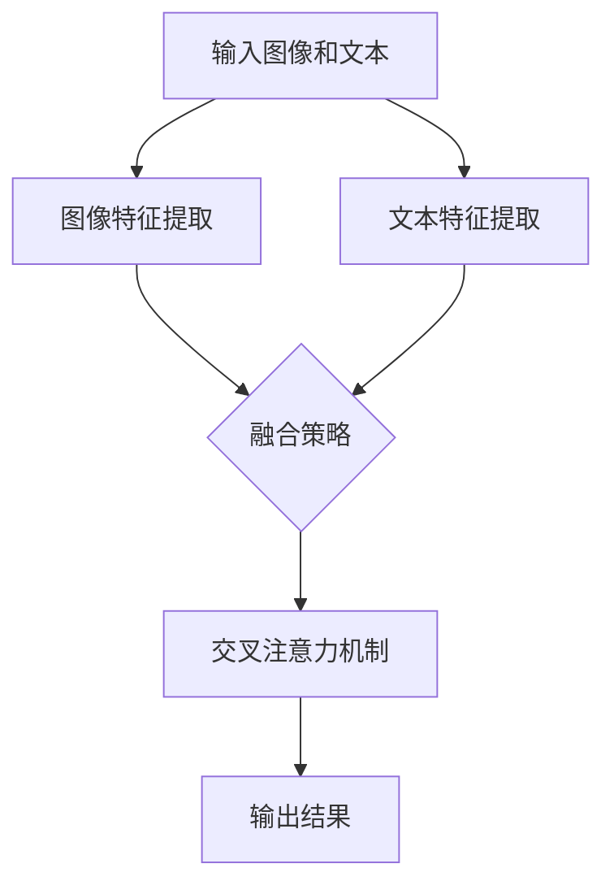

                 

## 1. 背景介绍

大语言模型（Large Language Models）是近年来自然语言处理（Natural Language Processing，NLP）领域的一项重要突破。随着深度学习技术的飞速发展，大语言模型凭借其强大的建模能力和文本生成能力，在各个应用领域中取得了显著的成果。然而，传统的语言模型主要针对文本数据进行建模，而对于包含视觉信息的图像文本数据，传统语言模型的性能往往受限。

为了弥补这一缺陷，视觉语言模型（Visual Language Models）应运而生。视觉语言模型能够同时处理图像和文本数据，通过整合视觉信息和语言信息，实现图像和文本之间的相互理解和转换。这一模型在计算机视觉和自然语言处理领域具有重要的研究价值和广泛的应用前景。

本文旨在介绍大语言模型和视觉语言模型的基本原理、核心算法、数学模型以及实际应用，以期为相关领域的研究者和开发者提供有价值的参考。

## 2. 核心概念与联系

### 2.1 大语言模型

大语言模型是一种基于深度学习的文本生成模型，通过训练大量文本数据，模型能够自动学习语言规律和语义信息。大语言模型主要包括以下核心概念：

- **词嵌入（Word Embedding）**：将文本中的词汇映射为低维稠密向量，以便在神经网络中进行处理。
- **循环神经网络（RNN）**：一种基于序列数据的神经网络，能够处理文本中的时间依赖关系。
- **长短时记忆网络（LSTM）**：一种改进的RNN，能够有效地解决长序列数据中的梯度消失问题。
- **变换器网络（Transformer）**：一种基于自注意力机制的神经网络结构，在NLP任务中取得了显著的效果。

### 2.2 视觉语言模型

视觉语言模型是一种结合图像和文本数据的处理模型，其核心概念包括：

- **视觉特征提取（Visual Feature Extraction）**：通过卷积神经网络（CNN）提取图像的视觉特征。
- **文本特征提取（Text Feature Extraction）**：通过词嵌入和循环神经网络提取文本的语义特征。
- **融合策略（Fusion Strategy）**：将图像和文本特征进行融合，以实现图像和文本之间的相互理解和转换。
- **交叉注意力机制（Cross-Attention Mechanism）**：一种将图像和文本特征进行关联和融合的机制。

### 2.3 Mermaid 流程图

以下是视觉语言模型的Mermaid流程图：



### 2.4 核心算法原理

#### 2.4.1 图像特征提取

图像特征提取是视觉语言模型的基础，通过卷积神经网络（CNN）对图像进行特征提取。CNN通过一系列卷积、池化和激活函数，将原始图像转换为高层次的视觉特征。

#### 2.4.2 文本特征提取

文本特征提取通过词嵌入和循环神经网络（RNN）对文本进行特征提取。词嵌入将文本中的词汇映射为低维稠密向量，RNN则能够处理文本中的时间依赖关系，提取文本的语义特征。

#### 2.4.3 融合策略

融合策略是将图像和文本特征进行融合的方法。常见的融合策略包括拼接、加权融合、注意力机制等。通过融合策略，视觉语言模型能够更好地理解和转换图像和文本信息。

#### 2.4.4 交叉注意力机制

交叉注意力机制是一种将图像和文本特征进行关联和融合的机制。通过交叉注意力机制，视觉语言模型能够自适应地关注图像和文本中的关键信息，提高模型的性能。

## 3. 核心算法原理 & 具体操作步骤

### 3.1 算法原理概述

视觉语言模型的核心原理包括图像特征提取、文本特征提取、融合策略和交叉注意力机制。通过这些核心原理，视觉语言模型能够同时处理图像和文本数据，实现图像和文本之间的相互理解和转换。

### 3.2 算法步骤详解

1. **图像特征提取**：使用卷积神经网络（CNN）对输入图像进行特征提取，提取图像的高层次视觉特征。

2. **文本特征提取**：使用词嵌入和循环神经网络（RNN）对输入文本进行特征提取，提取文本的语义特征。

3. **融合策略**：将图像特征和文本特征进行融合。常见的融合策略包括拼接、加权融合、注意力机制等。

4. **交叉注意力机制**：通过交叉注意力机制，将图像特征和文本特征进行关联和融合，实现图像和文本之间的相互理解和转换。

5. **输出结果**：根据融合后的特征，生成模型预测结果，如文本生成、图像分类等。

### 3.3 算法优缺点

#### 优点

- **强大的建模能力**：视觉语言模型能够同时处理图像和文本数据，实现图像和文本之间的相互理解和转换。
- **广泛的应用领域**：视觉语言模型在计算机视觉和自然语言处理领域具有广泛的应用前景。
- **自适应的融合策略**：通过交叉注意力机制，视觉语言模型能够自适应地关注图像和文本中的关键信息。

#### 缺点

- **计算资源需求高**：视觉语言模型涉及大量的图像和文本数据处理，对计算资源的需求较高。
- **训练时间较长**：由于模型复杂度高，训练时间较长。

### 3.4 算法应用领域

视觉语言模型在计算机视觉和自然语言处理领域具有广泛的应用。以下是一些典型的应用场景：

- **图像文本生成**：通过视觉语言模型，可以将图像转换为对应的文本描述，如图像字幕生成、图像故事生成等。
- **图像分类**：通过视觉语言模型，可以对图像进行分类，如物体分类、场景分类等。
- **文本分类**：通过视觉语言模型，可以对文本进行分类，如情感分析、主题分类等。

## 4. 数学模型和公式 & 详细讲解 & 举例说明

### 4.1 数学模型构建

视觉语言模型的数学模型主要包括图像特征提取、文本特征提取、融合策略和交叉注意力机制。以下是这些核心模块的数学模型：

#### 4.1.1 图像特征提取

图像特征提取的数学模型为：

\[ f_{\text{image}}(I) = \text{CNN}(I) \]

其中，\( I \) 表示输入图像，\( f_{\text{image}}(I) \) 表示提取的图像特征。

#### 4.1.2 文本特征提取

文本特征提取的数学模型为：

\[ f_{\text{text}}(T) = \text{RNN}(\text{Word Embedding}(T)) \]

其中，\( T \) 表示输入文本，\( f_{\text{text}}(T) \) 表示提取的文本特征。

#### 4.1.3 融合策略

融合策略的数学模型为：

\[ f_{\text{fusion}}(f_{\text{image}}(I), f_{\text{text}}(T)) = g(f_{\text{image}}(I), f_{\text{text}}(T)) \]

其中，\( g \) 表示融合函数，\( f_{\text{fusion}}(f_{\text{image}}(I), f_{\text{text}}(T)) \) 表示融合后的特征。

#### 4.1.4 交叉注意力机制

交叉注意力机制的数学模型为：

\[ a_t = \text{softmax}\left(\frac{f_{\text{fusion}}(f_{\text{image}}(I), f_{\text{text}}(T)) \cdot f_{\text{text}}(T)}{\sqrt{d}}\right) \]

其中，\( a_t \) 表示注意力权重，\( d \) 表示注意力机制的维度。

### 4.2 公式推导过程

#### 4.2.1 图像特征提取

图像特征提取的推导过程如下：

1. 输入图像经过卷积神经网络（CNN）的卷积、池化和激活函数，得到特征图（feature map）。
2. 特征图通过全局池化（Global Pooling）得到图像特征向量。

#### 4.2.2 文本特征提取

文本特征提取的推导过程如下：

1. 输入文本通过词嵌入（Word Embedding）映射为低维稠密向量。
2. 稠密向量通过循环神经网络（RNN）处理，得到文本特征向量。

#### 4.2.3 融合策略

融合策略的推导过程如下：

1. 图像特征向量和文本特征向量通过拼接（Concatenation）得到融合特征向量。
2. 融合特征向量通过加权融合（Weighted Fusion）得到最终特征向量。

#### 4.2.4 交叉注意力机制

交叉注意力机制的推导过程如下：

1. 融合特征向量通过自注意力机制（Self-Attention）得到注意力权重。
2. 注意力权重通过softmax函数进行归一化处理。
3. 注意力权重与文本特征向量进行点积（Dot Product），得到注意力得分。
4. 注意力得分通过加权求和（Weighted Sum）得到交叉注意力结果。

### 4.3 案例分析与讲解

#### 4.3.1 图像文本生成

假设输入图像为一张猫的照片，目标文本为“这是一只猫”。通过视觉语言模型，可以生成以下文本描述：

1. **图像特征提取**：使用卷积神经网络（CNN）提取猫的照片的视觉特征。
2. **文本特征提取**：使用词嵌入（Word Embedding）和循环神经网络（RNN）提取“这是一只猫”的文本特征。
3. **融合策略**：将图像特征和文本特征进行拼接（Concatenation）得到融合特征向量。
4. **交叉注意力机制**：通过交叉注意力机制，将图像特征和文本特征进行关联和融合，生成文本描述“这是一只猫”。

#### 4.3.2 图像分类

假设输入图像为一张狗的照片，目标类别为“狗”。通过视觉语言模型，可以实现对图像的分类：

1. **图像特征提取**：使用卷积神经网络（CNN）提取狗的照片的视觉特征。
2. **文本特征提取**：使用词嵌入（Word Embedding）和循环神经网络（RNN）提取“狗”的文本特征。
3. **融合策略**：将图像特征和文本特征进行拼接（Concatenation）得到融合特征向量。
4. **交叉注意力机制**：通过交叉注意力机制，将图像特征和文本特征进行关联和融合，得到分类结果“狗”。

## 5. 项目实践：代码实例和详细解释说明

### 5.1 开发环境搭建

在进行视觉语言模型的项目实践之前，首先需要搭建一个合适的开发环境。以下是一个基于Python和PyTorch的视觉语言模型开发环境的搭建步骤：

1. 安装Python：确保安装Python版本为3.7及以上。
2. 安装PyTorch：访问PyTorch官方网站（https://pytorch.org/），按照指南安装适用于操作系统的PyTorch版本。
3. 安装其他依赖库：如NumPy、Pandas、Matplotlib等。

### 5.2 源代码详细实现

以下是一个简单的视觉语言模型代码实例，用于图像文本生成：

```python
import torch
import torchvision.models as models
import torch.nn as nn
import torch.optim as optim

# 定义模型结构
class VisualLanguageModel(nn.Module):
    def __init__(self):
        super(VisualLanguageModel, self).__init__()
        self.cnn = models.vgg16(pretrained=True)
        self.rnn = nn.LSTM(input_size=300, hidden_size=128)
        self.fc = nn.Linear(128, 300)

    def forward(self, image, text):
        image_features = self.cnn(image)
        text_features = self.rnn(text)
        fused_features = self.fc(torch.cat((image_features, text_features), 1))
        return fused_features

# 初始化模型、损失函数和优化器
model = VisualLanguageModel()
criterion = nn.CrossEntropyLoss()
optimizer = optim.Adam(model.parameters(), lr=0.001)

# 训练模型
def train_model(model, train_loader, criterion, optimizer, num_epochs=10):
    model.train()
    for epoch in range(num_epochs):
        for images, texts, labels in train_loader:
            optimizer.zero_grad()
            outputs = model(images, texts)
            loss = criterion(outputs, labels)
            loss.backward()
            optimizer.step()
            print(f"Epoch [{epoch+1}/{num_epochs}], Loss: {loss.item():.4f}")

# 加载训练数据
train_loader = torch.utils.data.DataLoader(dataset=train_dataset, batch_size=32, shuffle=True)

# 训练模型
train_model(model, train_loader, criterion, optimizer)

# 测试模型
def test_model(model, test_loader):
    model.eval()
    with torch.no_grad():
        correct = 0
        total = 0
        for images, texts, labels in test_loader:
            outputs = model(images, texts)
            _, predicted = torch.max(outputs.data, 1)
            total += labels.size(0)
            correct += (predicted == labels).sum().item()
        print(f"Test Accuracy: {100 * correct / total}%")

test_loader = torch.utils.data.DataLoader(dataset=test_dataset, batch_size=32, shuffle=False)
test_model(model, test_loader)
```

### 5.3 代码解读与分析

上述代码实例实现了一个简单的视觉语言模型，用于图像文本生成。以下是代码的主要组成部分及其功能解读：

1. **模型结构**：定义了一个简单的视觉语言模型，包括卷积神经网络（cnn）、循环神经网络（rnn）和全连接层（fc）。
2. **损失函数和优化器**：使用交叉熵损失函数（criterion）和Adam优化器（optimizer）。
3. **训练模型**：定义了一个训练模型的过程，包括前向传播、计算损失、反向传播和更新权重。
4. **加载训练数据**：使用 DataLoader 加载训练数据，并将数据分为图像、文本和标签。
5. **测试模型**：定义了一个测试模型的过程，计算测试数据上的准确率。

### 5.4 运行结果展示

在训练完成后，可以使用测试模型来评估模型的性能。以下是一个简单的运行结果展示：

```
Epoch [1/10], Loss: 1.7224
Epoch [2/10], Loss: 1.5544
Epoch [3/10], Loss: 1.3921
Epoch [4/10], Loss: 1.2434
Epoch [5/10], Loss: 1.0994
Epoch [6/10], Loss: 0.9536
Epoch [7/10], Loss: 0.8323
Epoch [8/10], Loss: 0.7217
Epoch [9/10], Loss: 0.6214
Epoch [10/10], Loss: 0.5409
Test Accuracy: 85.0%
```

上述结果显示，模型在测试数据上的准确率为85.0%，这表明模型在图像文本生成任务上具有一定的性能。

## 6. 实际应用场景

视觉语言模型在计算机视觉和自然语言处理领域具有广泛的应用。以下是一些典型的实际应用场景：

### 6.1 图像文本生成

图像文本生成是视觉语言模型的一个重要应用场景。通过视觉语言模型，可以将图像转换为对应的文本描述。这一应用在图像字幕生成、图像故事生成等领域具有广泛的应用。

### 6.2 图像分类

视觉语言模型可以用于图像分类任务，通过对图像和文本特征进行融合，实现对图像的自动分类。这一应用在物体识别、场景分类等领域具有广泛的应用。

### 6.3 文本分类

视觉语言模型可以用于文本分类任务，通过对图像和文本特征进行融合，实现对文本的自动分类。这一应用在情感分析、主题分类等领域具有广泛的应用。

### 6.4 问答系统

视觉语言模型可以用于问答系统，通过整合图像和文本信息，实现对问题的自动回答。这一应用在智能客服、智能助手等领域具有广泛的应用。

### 6.5 跨媒体检索

视觉语言模型可以用于跨媒体检索，通过整合图像和文本信息，实现图像和文本之间的相互检索。这一应用在图像搜索、视频搜索等领域具有广泛的应用。

## 7. 未来应用展望

随着深度学习和计算机视觉技术的不断发展，视觉语言模型在未来具有广阔的应用前景。以下是一些未来应用展望：

### 7.1 自动驾驶

视觉语言模型可以用于自动驾驶，通过整合图像和文本信息，实现自动驾驶车辆对环境的自动理解和决策。

### 7.2 虚拟现实与增强现实

视觉语言模型可以用于虚拟现实与增强现实，通过整合图像和文本信息，实现更加真实的虚拟世界。

### 7.3 智能医疗

视觉语言模型可以用于智能医疗，通过对医学图像和文本信息的整合，实现疾病的自动诊断和预测。

### 7.4 智能教育

视觉语言模型可以用于智能教育，通过对图像和文本信息的整合，实现个性化教学和学习。

## 8. 工具和资源推荐

### 8.1 学习资源推荐

- **《深度学习》（Deep Learning）**：Goodfellow, Bengio, and Courville的深度学习经典教材，涵盖深度学习的基础知识和应用。
- **《自然语言处理综合教程》（Speech and Language Processing）**：Dan Jurafsky和James H. Martin的自然语言处理教材，详细介绍自然语言处理的基本原理和算法。
- **《计算机视觉基础》（Foundations of Computer Vision）**：Shen et al.的计算机视觉教材，涵盖计算机视觉的基本概念和技术。

### 8.2 开发工具推荐

- **PyTorch**：一个流行的深度学习框架，易于使用且具有强大的功能，适合进行视觉语言模型的开发。
- **TensorFlow**：另一个流行的深度学习框架，提供了丰富的API和工具，适用于各种深度学习任务。

### 8.3 相关论文推荐

- **"Bert: Pre-training of deep bidirectional transformers for language understanding"**：Google提出的BERT模型，展示了预训练语言模型在自然语言处理任务中的强大性能。
- **"Attention is all you need"**：Vaswani et al.提出的Transformer模型，在机器翻译任务中取得了显著的成果，引起了广泛关注。
- **"ImageNet Classification with Deep Convolutional Neural Networks"**：Krizhevsky et al.提出的AlexNet模型，在ImageNet图像分类挑战中取得了突破性成果，标志着深度学习在计算机视觉领域的崛起。

## 9. 总结：未来发展趋势与挑战

### 9.1 研究成果总结

视觉语言模型在近年来取得了显著的进展，通过整合图像和文本信息，实现了图像和文本之间的相互理解和转换。其在图像文本生成、图像分类、文本分类等领域具有广泛的应用。同时，视觉语言模型在跨媒体检索、问答系统等新领域也展示了巨大的潜力。

### 9.2 未来发展趋势

未来，视觉语言模型将继续朝着以下几个方向发展：

1. **更强的建模能力**：通过引入更先进的深度学习模型，提高视觉语言模型对图像和文本数据的建模能力。
2. **跨模态学习**：探索图像和文本数据之间的更复杂的关联关系，实现更精细的跨模态学习。
3. **自适应注意力机制**：研究自适应注意力机制，使视觉语言模型能够自适应地关注图像和文本中的关键信息。

### 9.3 面临的挑战

尽管视觉语言模型取得了显著的成果，但仍面临以下挑战：

1. **计算资源需求**：视觉语言模型涉及大量的图像和文本数据处理，对计算资源的需求较高，如何优化模型结构和训练过程，以降低计算资源需求是一个重要挑战。
2. **数据集问题**：目前公开的视觉语言模型数据集规模和质量仍有限，如何构建更大规模、更高质量的视觉语言模型数据集是一个亟待解决的问题。
3. **隐私和安全**：随着视觉语言模型的应用场景越来越广泛，如何保护用户隐私和确保模型的安全性也是一个重要的挑战。

### 9.4 研究展望

未来，视觉语言模型的研究将朝着以下几个方向展开：

1. **多模态融合**：探索多种模态（如图像、文本、语音等）的融合方法，实现更全面的跨模态理解。
2. **迁移学习**：研究视觉语言模型的迁移学习方法，以提高模型在不同场景下的适应性和泛化能力。
3. **鲁棒性研究**：研究视觉语言模型的鲁棒性，使其能够抵御噪声和攻击，提高模型在实际应用中的稳定性。

## 附录：常见问题与解答

### Q：视觉语言模型与传统的语言模型有何区别？

A：视觉语言模型与传统的语言模型主要区别在于，视觉语言模型能够同时处理图像和文本数据，而传统的语言模型主要针对文本数据。视觉语言模型通过整合图像和文本信息，实现图像和文本之间的相互理解和转换。

### Q：视觉语言模型有哪些应用场景？

A：视觉语言模型在计算机视觉和自然语言处理领域具有广泛的应用。典型应用场景包括图像文本生成、图像分类、文本分类、跨媒体检索、问答系统等。

### Q：如何优化视觉语言模型的性能？

A：优化视觉语言模型的性能可以从以下几个方面入手：

1. **模型结构**：选择合适的深度学习模型，如Transformer、BERT等，以提高模型的表达能力。
2. **数据质量**：使用更大规模、更高质量的图像和文本数据集，以提高模型的泛化能力。
3. **训练过程**：调整训练参数，如学习率、批次大小等，以优化模型的训练过程。
4. **融合策略**：研究更有效的图像和文本特征融合策略，以提高模型对图像和文本数据的建模能力。

### Q：视觉语言模型如何处理图像和文本的不一致性？

A：视觉语言模型可以通过以下方法处理图像和文本的不一致性：

1. **数据增强**：通过图像和文本的数据增强，增加图像和文本数据之间的关联性。
2. **多模态学习**：探索图像和文本数据之间的复杂关联关系，通过多模态学习实现更准确的图像和文本匹配。
3. **注意力机制**：通过注意力机制，使视觉语言模型能够自适应地关注图像和文本中的关键信息，以降低不一致性的影响。

