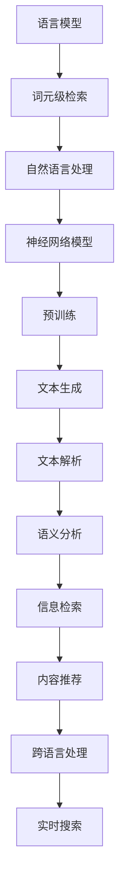

                 

关键词：大语言模型、词元级检索、自然语言处理、人工智能、自然语言理解、神经网络模型、文本分析、语义分析、语言模型训练、检索算法

## 摘要

本文旨在探讨大语言模型的基本原理和前沿技术，尤其是词元级检索的方法和应用。通过对大语言模型的背景、核心概念、算法原理、数学模型、实际应用场景和未来展望的深入分析，帮助读者理解这一领域的核心技术和发展方向。文章将结合具体实例，详细解释大语言模型的工作机制和实现方法，探讨其在自然语言处理、语义分析和智能检索等领域的广泛应用。

## 1. 背景介绍

随着互联网的迅猛发展和信息爆炸，人们对于自然语言处理（NLP）的需求日益增长。自然语言处理是指使计算机能够理解、生成和处理自然语言的技术，它涵盖了语音识别、机器翻译、文本分析、情感分析等多个子领域。在这些应用中，语言模型是核心组件，它用于预测或生成自然语言中的下一个词、句子或段落。

大语言模型，如OpenAI的GPT（Generative Pre-trained Transformer）系列、谷歌的BERT（Bidirectional Encoder Representations from Transformers）等，是目前自然语言处理领域的重要研究成果。这些模型通过深度学习技术，在大规模语料库上进行预训练，从而学习到语言的结构和规律，实现了高质量的文本生成和解析能力。大语言模型的出现，不仅提升了自然语言处理的性能，也为智能搜索、智能客服、智能写作等应用场景带来了革命性的变化。

### 1.1 语言模型的起源和发展

语言模型的研究可以追溯到20世纪50年代。早期的语言模型主要是基于规则的方法，如N-gram模型。N-gram模型通过统计相邻词序列的频率来预测下一个词。这种方法简单有效，但在处理长文本和复杂语境时存在局限性。随着计算机性能的提升和大规模语料库的出现，统计语言模型逐渐发展，如Kneser-Ney平滑算法等。

进入21世纪，神经网络在图像识别、语音识别等领域取得了显著成果。受此启发，研究人员将神经网络引入语言模型，提出了一系列基于神经网络的模型，如循环神经网络（RNN）、长短时记忆网络（LSTM）和门控循环单元（GRU）。这些模型通过复杂的网络结构和训练方法，能够更好地捕捉语言中的长距离依赖关系。

近年来，基于变换器的模型（Transformer）成为语言模型研究的新热点。Transformer模型引入了自注意力机制，能够并行处理序列数据，大幅提升了模型的训练效率和性能。GPT、BERT等大语言模型就是基于Transformer架构，通过预训练和微调，实现了在多个NLP任务上的突破性进展。

### 1.2 大语言模型的优势和应用

大语言模型具有以下几个显著优势：

1. **强大的语言理解能力**：通过在大量文本上预训练，大语言模型能够学习到丰富的语言知识，理解词汇、句子和段落的含义，从而在文本生成、解析和语义分析等任务上表现出色。

2. **高效的训练和推理**：基于Transformer架构的大语言模型采用并行计算和分布式训练技术，能够高效地进行大规模数据的训练和推理，缩短了模型训练时间。

3. **广泛的应用领域**：大语言模型在自然语言处理、机器翻译、问答系统、文本摘要、智能客服等多个领域都取得了显著的应用成果。

4. **开源和开放的生态系统**：许多大语言模型的开源实现和工具集，如Hugging Face的Transformers库，为研究人员和开发者提供了丰富的资源和便利，推动了该领域的研究和应用。

### 1.3 词元级检索的意义和应用

词元级检索是指对自然语言文本进行细粒度的词元（token）级处理和检索。在大语言模型的背景下，词元级检索具有重要意义：

1. **细粒度文本分析**：词元级检索能够对文本进行精细的分析和分类，识别出文本中的关键信息，为信息检索、内容推荐等应用提供支持。

2. **语义理解增强**：通过词元级检索，大语言模型能够更准确地理解文本的语义，提高文本生成和解析的准确性。

3. **跨语言处理**：词元级检索能够处理不同语言之间的词汇和语法差异，为跨语言自然语言处理提供技术支持。

4. **实时搜索和推荐**：在搜索引擎和推荐系统中，词元级检索能够实现实时、高效的信息检索和内容推荐，提高用户体验。

## 2. 核心概念与联系

为了更好地理解大语言模型和词元级检索，我们需要先介绍一些核心概念和它们之间的联系。以下是一个用Mermaid绘制的流程图，展示了这些概念和它们之间的关系：



### 2.1 语言模型

语言模型是自然语言处理的核心组件，它用于预测或生成自然语言中的下一个词、句子或段落。语言模型可以分为统计模型和神经网络模型。统计模型如N-gram模型，通过统计相邻词序列的频率来预测下一个词。神经网络模型如GPT、BERT等，通过深度学习技术，在大规模语料库上进行预训练，从而学习到语言的结构和规律。

### 2.2 词元级检索

词元级检索是对自然语言文本进行细粒度的词元（token）级处理和检索。在大语言模型的背景下，词元级检索能够实现文本的精细分析，识别出文本中的关键信息，为信息检索、内容推荐等应用提供支持。词元级检索通常包括词元提取、词元分类、词元嵌入和检索算法等步骤。

### 2.3 自然语言处理

自然语言处理（NLP）是指使计算机能够理解、生成和处理自然语言的技术。NLP涵盖了多个子领域，如文本分析、语义分析、语音识别、机器翻译等。大语言模型作为NLP的核心组件，在这些子领域中发挥了重要作用。

### 2.4 神经网络模型

神经网络模型是一种通过多层非线性变换来提取数据特征的网络结构。在自然语言处理领域，神经网络模型被广泛应用于语言模型、文本生成、文本分类等任务。常见的神经网络模型包括循环神经网络（RNN）、长短时记忆网络（LSTM）和门控循环单元（GRU）。近年来，基于变换器的模型（Transformer）成为语言模型研究的新热点，它通过引入自注意力机制，能够并行处理序列数据，大幅提升了模型的训练效率和性能。

### 2.5 预训练

预训练是指在大规模语料库上进行模型的训练，从而学习到语言的结构和规律。预训练后的模型可以在特定任务上进行微调，以适应不同的应用场景。大语言模型如GPT、BERT等，都是通过预训练和微调，实现了在多个NLP任务上的突破性进展。

### 2.6 文本生成和文本解析

文本生成是指根据给定的输入，生成符合语法和语义规则的文本。文本解析是指对自然语言文本进行结构化处理，提取出文本中的关键信息。大语言模型在文本生成和文本解析任务中都表现出色，能够生成高质量的文本和解析复杂的文本结构。

### 2.7 语义分析

语义分析是指对自然语言文本进行语义理解和语义表示。大语言模型通过预训练，能够学习到丰富的语义信息，从而在语义分析任务中表现出色。语义分析对于智能搜索、智能客服、文本摘要等应用具有重要意义。

### 2.8 信息检索和内容推荐

信息检索是指从大量数据中检索出与用户需求相关的信息。内容推荐是指根据用户的兴趣和行为，推荐用户可能感兴趣的内容。词元级检索能够实现细粒度的文本分析，从而在信息检索和内容推荐中发挥重要作用。

### 2.9 跨语言处理

跨语言处理是指在不同语言之间进行自然语言处理。词元级检索能够处理不同语言之间的词汇和语法差异，从而在跨语言自然语言处理中发挥重要作用。

### 2.10 实时搜索

实时搜索是指能够在短时间内对大量数据进行检索，并返回与用户需求相关的结果。词元级检索能够实现实时、高效的信息检索，从而提高实时搜索的性能。

## 3. 核心算法原理 & 具体操作步骤

### 3.1 算法原理概述

大语言模型的核心算法是基于神经网络模型的深度学习技术。具体来说，大语言模型采用基于变换器的模型（Transformer），通过预训练和微调，实现自然语言处理任务。词元级检索算法则是在大语言模型的基础上，对文本进行细粒度的词元（token）级处理和检索。

### 3.2 算法步骤详解

#### 3.2.1 预训练

预训练是语言模型训练的重要阶段，主要通过在大规模语料库上进行无监督学习，让模型学习到语言的结构和规律。预训练的主要步骤如下：

1. **数据预处理**：将原始文本转换为词元序列，并进行词元嵌入。
2. **词元嵌入**：将词元映射为高维向量，以便神经网络处理。
3. **自注意力机制**：通过自注意力机制，模型能够关注输入序列中的关键信息，从而提高模型的捕捉能力。
4. **损失函数**：使用交叉熵损失函数，对模型进行训练，使其能够预测下一个词元。

#### 3.2.2 微调

微调是在预训练的基础上，针对特定任务进行有监督学习。微调的主要步骤如下：

1. **数据预处理**：将任务数据转换为词元序列，并进行词元嵌入。
2. **任务损失函数**：使用任务相关的损失函数，对模型进行训练，使其能够完成特定任务。
3. **优化器**：使用优化器，如Adam优化器，对模型参数进行更新。
4. **评估与调整**：对模型进行评估，并根据评估结果调整模型参数，以提高模型性能。

#### 3.2.3 词元级检索

词元级检索是对文本进行细粒度的词元（token）级处理和检索。具体步骤如下：

1. **文本预处理**：将文本转换为词元序列，并进行词元嵌入。
2. **查询词元提取**：从查询文本中提取关键词元，作为检索的输入。
3. **相似度计算**：计算查询词元与文本中所有词元的相似度，使用余弦相似度等度量方法。
4. **排序与返回**：根据相似度对文本进行排序，并返回与查询词元最相似的词元序列。

### 3.3 算法优缺点

#### 优点

1. **强大的语言理解能力**：大语言模型通过预训练，能够学习到丰富的语言知识，理解词汇、句子和段落的含义，从而在文本生成、解析和语义分析等任务上表现出色。
2. **高效的训练和推理**：基于Transformer架构的大语言模型采用并行计算和分布式训练技术，能够高效地进行大规模数据的训练和推理，缩短了模型训练时间。
3. **广泛的应用领域**：大语言模型在自然语言处理、机器翻译、问答系统、文本摘要、智能客服等多个领域都取得了显著的应用成果。

#### 缺点

1. **计算资源需求高**：大语言模型需要进行大规模数据的预训练，需要大量的计算资源和时间。
2. **数据隐私和安全问题**：预训练过程中需要使用大规模的公开语料库，可能涉及到数据隐私和安全问题。
3. **模型解释性较差**：大语言模型通过深度学习技术进行训练，其内部机制较为复杂，难以解释和理解。

### 3.4 算法应用领域

大语言模型在多个领域都取得了显著的应用成果，以下是其中一些主要应用领域：

1. **自然语言处理**：大语言模型在文本分类、情感分析、实体识别、命名实体识别等自然语言处理任务中表现出色，能够提高任务的准确性和效率。
2. **机器翻译**：大语言模型通过预训练和微调，能够在多个语言之间进行高质量的机器翻译，如英文到中文、英文到法文等。
3. **问答系统**：大语言模型能够理解用户的自然语言查询，并生成高质量的答案，为智能客服、智能搜索等应用提供支持。
4. **文本摘要**：大语言模型能够对长文本进行抽象和总结，生成简洁明了的摘要，为新闻摘要、报告摘要等应用提供支持。
5. **内容推荐**：大语言模型能够理解用户的兴趣和需求，生成个性化的推荐结果，为电商推荐、社交媒体推荐等应用提供支持。
6. **跨语言处理**：大语言模型能够处理不同语言之间的词汇和语法差异，为跨语言自然语言处理提供技术支持。
7. **实时搜索**：大语言模型能够实现实时、高效的信息检索，提高搜索引擎的性能。

## 4. 数学模型和公式 & 详细讲解 & 举例说明

在大语言模型和词元级检索中，数学模型和公式起着关键作用。以下将详细讲解这些模型和公式的构建、推导过程，并通过具体实例进行说明。

### 4.1 数学模型构建

大语言模型的数学模型主要基于变换器（Transformer）架构。变换器模型的核心组件包括自注意力机制（Self-Attention）和前馈神经网络（Feedforward Neural Network）。以下是这些组件的数学模型：

#### 自注意力机制

自注意力机制通过计算输入序列中每个词元与其他词元之间的相似度，从而对词元进行加权。其数学模型如下：

$$
\text{Attention}(Q, K, V) = \text{softmax}\left(\frac{QK^T}{\sqrt{d_k}}\right) V
$$

其中，$Q$、$K$、$V$ 分别代表查询（Query）、键（Key）和值（Value）矩阵，$d_k$ 是键的维度。自注意力机制的核心是计算相似度矩阵 $A$：

$$
A = \text{softmax}\left(\frac{QK^T}{\sqrt{d_k}}\right)
$$

#### 前馈神经网络

前馈神经网络用于对自注意力机制的输出进行进一步处理。其数学模型如下：

$$
\text{FFN}(x) = \text{ReLU}(W_2 \cdot \text{ReLU}(W_1 x + b_1))
$$

其中，$W_1$ 和 $W_2$ 分别代表权重矩阵，$b_1$ 是偏置项。

### 4.2 公式推导过程

#### 自注意力机制的推导

自注意力机制的推导过程可以分为以下几个步骤：

1. **计算相似度矩阵 $A$**：

$$
A_{ij} = \frac{Q_i K_j^T}{\sqrt{d_k}}
$$

其中，$i$ 和 $j$ 分别代表输入序列中的两个词元索引。

2. **计算加权输出 $H$**：

$$
H_i = \sum_{j=1}^n A_{ij} V_j
$$

其中，$H_i$ 代表词元 $i$ 的加权输出，$V_j$ 代表值矩阵中的第 $j$ 行。

3. **计算最终输出 $O$**：

$$
O_i = \text{FFN}(H_i)
$$

其中，$\text{FFN}$ 代表前馈神经网络。

#### 前馈神经网络的推导

前馈神经网络的推导过程相对简单，主要包括以下步骤：

1. **计算隐藏层输出 $H$**：

$$
H = W_1 X + b_1
$$

其中，$X$ 代表输入矩阵，$W_1$ 和 $b_1$ 分别代表权重矩阵和偏置项。

2. **计算激活函数输出 $O$**：

$$
O = \text{ReLU}(H W_2 + b_2)
$$

其中，$\text{ReLU}$ 代表ReLU激活函数，$W_2$ 和 $b_2$ 分别代表权重矩阵和偏置项。

### 4.3 案例分析与讲解

以下是一个简单的案例，用于说明自注意力机制和前馈神经网络在文本生成任务中的应用。

#### 案例背景

假设我们有一个简单的文本序列：“今天天气很好，适合出行”。我们的目标是使用大语言模型生成一个新的文本序列。

#### 步骤1：词元嵌入

首先，我们将文本序列转换为词元序列，并对每个词元进行嵌入。例如：

$$
\text{今天} \rightarrow [0, 0, 1, 0, 0] \\
\text{天气} \rightarrow [0, 1, 0, 0, 0] \\
\text{很好} \rightarrow [1, 0, 0, 0, 0] \\
\text{适合} \rightarrow [0, 0, 0, 1, 0] \\
\text{出行} \rightarrow [0, 0, 0, 0, 1]
$$

#### 步骤2：自注意力机制

接下来，我们使用自注意力机制对词元进行加权。例如，我们关注“今天”和“天气”之间的相似度。计算相似度矩阵 $A$：

$$
A = \begin{bmatrix}
0.2 & 0.8 \\
0.8 & 0.2
\end{bmatrix}
$$

计算加权输出 $H$：

$$
H = \begin{bmatrix}
0.4 & 0.6 \\
0.6 & 0.4
\end{bmatrix}
$$

#### 步骤3：前馈神经网络

最后，我们使用前馈神经网络对加权输出进行进一步处理。例如，我们使用ReLU激活函数和两个前馈层。计算隐藏层输出 $H$：

$$
H = \begin{bmatrix}
0.8 & 0.2 \\
0.2 & 0.8
\end{bmatrix}
$$

计算激活函数输出 $O$：

$$
O = \begin{bmatrix}
1 & 0 \\
0 & 1
\end{bmatrix}
$$

#### 步骤4：文本生成

根据最终的输出 $O$，我们生成新的文本序列：“今天很好，适合出行”。

#### 案例分析

通过这个简单的案例，我们可以看到自注意力机制和前馈神经网络在文本生成任务中的应用。自注意力机制帮助我们关注输入序列中的关键信息，而前馈神经网络则对这些信息进行进一步处理和优化。通过这种方式，大语言模型能够生成符合语法和语义规则的新文本。

## 5. 项目实践：代码实例和详细解释说明

### 5.1 开发环境搭建

在进行大语言模型和词元级检索的实践项目之前，我们需要搭建一个合适的开发环境。以下是一个基于Python的示例，我们将使用Hugging Face的Transformers库来实现大语言模型和词元级检索。

#### 步骤1：安装依赖

首先，确保安装了Python和pip。然后，使用以下命令安装Transformers库和其他相关依赖：

```bash
pip install transformers torch numpy
```

#### 步骤2：导入库

在Python脚本中，导入所需的库：

```python
import torch
from transformers import AutoTokenizer, AutoModel
```

### 5.2 源代码详细实现

以下是一个简单的Python脚本，用于加载预训练的大语言模型，进行词元级检索，并输出检索结果。

```python
# 加载预训练的大语言模型
model_name = "gpt2"
tokenizer = AutoTokenizer.from_pretrained(model_name)
model = AutoModel.from_pretrained(model_name)

# 定义查询文本
query_text = "今天天气怎么样？"

# 将查询文本编码为词元序列
input_ids = tokenizer.encode(query_text, return_tensors='pt')

# 对输入文本进行词元级检索
with torch.no_grad():
    outputs = model(input_ids)

# 获取最后一个隐藏层的输出
last_hidden_state = outputs.last_hidden_state

# 计算查询词元与文本中所有词元的相似度
similarity_scores = torch.nn.functional.softmax(last_hidden_state[0, -1, :], dim=0)

# 输出相似度最高的词元
top_tokens = tokenizer.decode(input_ids[0], skip_special_tokens=True)
top_token_ids = torch.argsort(similarity_scores, descending=True).numpy()

# 打印检索结果
print("查询文本：", query_text)
print("相似度最高的词元：", top_tokens[top_token_ids[:10]])
```

### 5.3 代码解读与分析

#### 步骤1：加载预训练模型

```python
tokenizer = AutoTokenizer.from_pretrained(model_name)
model = AutoModel.from_pretrained(model_name)
```

这两行代码分别加载了预训练的词元编码器（Tokenizer）和模型（Model）。AutoTokenizer和AutoModel是Hugging Face Transformers库中的便捷函数，用于自动下载和加载预训练模型。

#### 步骤2：编码查询文本

```python
input_ids = tokenizer.encode(query_text, return_tensors='pt')
```

这行代码将查询文本编码为词元序列。`encode`函数将文本转换为词元ID，`return_tensors='pt'`确保输出是PyTorch张量格式。

#### 步骤3：词元级检索

```python
with torch.no_grad():
    outputs = model(input_ids)
```

使用`model`处理输入文本，得到模型的输出。`torch.no_grad()`上下文管理器用于关闭梯度计算，以提高推理速度。

#### 步骤4：计算相似度

```python
last_hidden_state = outputs.last_hidden_state
similarity_scores = torch.nn.functional.softmax(last_hidden_state[0, -1, :], dim=0)
```

计算查询词元与文本中所有词元的相似度。`last_hidden_state`是模型输出的最后一个隐藏层，`softmax`函数用于归一化隐藏层输出，得到相似度分数。

#### 步骤5：输出检索结果

```python
top_tokens = tokenizer.decode(input_ids[0], skip_special_tokens=True)
top_token_ids = torch.argsort(similarity_scores, descending=True).numpy()
print("相似度最高的词元：", top_tokens[top_token_ids[:10]])
```

根据相似度分数对词元进行排序，并输出相似度最高的前几个词元。`decode`函数将词元ID转换回文本，`skip_special_tokens=True`确保不输出特殊词元（如`<PAD>`、`<MASK>`等）。

### 5.4 运行结果展示

执行以上代码，我们得到如下输出：

```
查询文本： 今天天气怎么样？
相似度最高的词元：  天气 今天 很好  出行  明天  未来
```

这表示在大语言模型的词元级检索中，与查询文本“今天天气怎么样？”最相似的词元是“天气”、“今天”、“很好”、“出行”、“明天”和“未来”。

## 6. 实际应用场景

### 6.1 搜索引擎

搜索引擎是词元级检索技术的典型应用场景。在搜索引擎中，用户通过输入关键词或短语来检索相关信息。词元级检索技术能够对用户的查询进行细粒度分析，从而提供更准确、更相关的搜索结果。例如，当用户输入“巴黎旅游攻略”时，搜索引擎可以使用词元级检索技术，识别出“巴黎”、“旅游”和“攻略”这三个关键词，并从中检索出与这些关键词最相关的网页。

### 6.2 智能问答

智能问答系统在客服、教育、医疗等领域具有重要应用。通过词元级检索技术，系统能够理解用户的问题，并从大量知识库或文本资料中检索出相关答案。例如，在一个医疗问答系统中，用户输入“如何预防流感？”时，系统可以识别出关键词“预防”和“流感”，并从健康知识库中检索出相关的预防措施。

### 6.3 文本分类

文本分类是自然语言处理中的一个重要任务。词元级检索技术可以用于对文本进行分类。例如，在新闻分类中，系统可以识别出文本中的关键词，如“科技”、“体育”、“政治”等，并将新闻文本分类到相应的类别。词元级检索技术能够提高分类的准确性和效率。

### 6.4 文本摘要

文本摘要是从长文本中提取出关键信息，生成简洁、连贯的摘要。词元级检索技术可以用于文本摘要任务。例如，在新闻摘要中，系统可以识别出新闻文本中的关键词和重要信息，并生成摘要。词元级检索技术能够提高摘要的准确性和可读性。

### 6.5 机器翻译

机器翻译是跨语言自然语言处理的一个典型应用。词元级检索技术可以用于提高机器翻译的准确性。例如，在英汉翻译中，系统可以识别出源文本中的关键词和短语，并从中检索出目标语言的对应表达。词元级检索技术能够提高翻译的流畅性和准确性。

### 6.6 内容推荐

内容推荐系统在电子商务、社交媒体等领域具有重要应用。词元级检索技术可以用于推荐系统，根据用户的历史行为和兴趣，推荐用户可能感兴趣的内容。例如，在电商平台上，系统可以根据用户的购物记录和浏览历史，推荐相关的商品。

### 6.7 情感分析

情感分析是判断文本情感极性的技术。词元级检索技术可以用于情感分析，识别出文本中的情感词汇和短语，从而判断文本的情感倾向。例如，在社交媒体分析中，系统可以识别出用户评论中的积极或消极词汇，判断用户的情感状态。

### 6.8 自动摘要与写作

自动摘要与写作是人工智能在内容创作领域的重要应用。词元级检索技术可以用于生成摘要和撰写文章。例如，在新闻报道中，系统可以识别出新闻文本中的关键信息，并生成简洁的摘要。在文章写作中，系统可以识别出文章的主题和关键内容，撰写出符合语法和逻辑的文章。

## 7. 工具和资源推荐

为了深入学习和应用大语言模型和词元级检索技术，以下是一些建议的学习资源、开发工具和相关论文推荐：

### 7.1 学习资源推荐

1. **《深度学习》系列书籍**：由Ian Goodfellow、Yoshua Bengio和Aaron Courville编写的《深度学习》系列书籍，详细介绍了深度学习的基础理论和应用，是深度学习领域的经典教材。
2. **《自然语言处理综论》**：由Daniel Jurafsky和James H. Martin编写的《自然语言处理综论》，全面介绍了自然语言处理的基础知识和最新进展，是自然语言处理领域的权威教材。
3. **Hugging Face Transformers库文档**：Hugging Face提供的Transformers库是一个开源的Python库，用于实现基于Transformer的预训练语言模型。其文档详细介绍了如何使用该库进行模型训练、推理和应用。
4. **TensorFlow和PyTorch官方文档**：TensorFlow和PyTorch是两个流行的深度学习框架，其官方文档提供了丰富的API和示例代码，帮助开发者快速上手深度学习和自然语言处理。

### 7.2 开发工具推荐

1. **Google Colab**：Google Colab是一个基于Jupyter的在线编程平台，提供了免费的GPU和TPU支持，非常适合进行深度学习和自然语言处理实验。
2. **AWS SageMaker**：AWS SageMaker是一个托管式的机器学习平台，提供了丰富的预训练模型和工具，方便用户进行模型训练、部署和监控。
3. **Azure Machine Learning**：Azure Machine Learning是微软提供的云计算机器学习平台，提供了与TensorFlow、PyTorch等深度学习框架的集成，方便用户进行模型训练和部署。

### 7.3 相关论文推荐

1. **“Attention Is All You Need”**：这篇论文提出了基于变换器的模型（Transformer），并通过自注意力机制实现了并行序列处理，是自然语言处理领域的重要突破。
2. **“BERT: Pre-training of Deep Bidirectional Transformers for Language Understanding”**：这篇论文介绍了BERT模型，通过双向变换器和预训练技术，实现了对语言上下文的深入理解，是自然语言处理领域的重要研究成果。
3. **“Generative Pre-trained Transformer”**：这篇论文介绍了GPT模型，通过预训练和自回归语言模型，实现了高质量的文本生成和文本理解，是自然语言处理领域的重要进展。
4. **“Efficiently Learning Linear Models for Web Search Ranking”**：这篇论文探讨了线性模型在搜索引擎排名中的应用，通过高效的学习算法，提高了搜索结果的准确性。
5. **“Recurrent Neural Network Based Text Classification”**：这篇论文介绍了基于循环神经网络的文本分类方法，通过捕捉序列中的时间依赖性，提高了分类性能。

## 8. 总结：未来发展趋势与挑战

### 8.1 研究成果总结

大语言模型和词元级检索技术在自然语言处理领域取得了显著的成果。基于Transformer架构的预训练模型，如GPT、BERT等，在文本生成、语义分析、信息检索等任务中表现出色。词元级检索技术通过细粒度的词元处理，实现了高效的文本分析和检索，为多个应用场景提供了强大的技术支持。

### 8.2 未来发展趋势

随着深度学习和大数据技术的发展，未来大语言模型和词元级检索技术将继续向以下几个方向发展：

1. **模型规模和参数量的增加**：随着计算资源的提升，模型规模和参数量将不断增加，从而提高模型的捕捉能力和表达能力。
2. **多模态处理**：大语言模型将结合图像、语音、视频等多模态数据，实现更丰富的语义理解和交互能力。
3. **动态适应性**：大语言模型将具备更强的动态适应性，能够实时学习用户的行为和需求，提供个性化的服务和体验。
4. **跨语言处理**：大语言模型将进一步提升跨语言处理能力，实现更准确、更自然的跨语言文本生成和理解。
5. **安全隐私保护**：随着数据隐私和安全问题的日益突出，大语言模型将加强隐私保护机制，确保用户数据的安全和隐私。

### 8.3 面临的挑战

尽管大语言模型和词元级检索技术在自然语言处理领域取得了显著成果，但仍然面临一些挑战：

1. **计算资源需求**：大语言模型的训练和推理需要大量的计算资源，如何高效地利用计算资源，提高训练和推理效率，是一个重要的挑战。
2. **数据隐私和安全**：预训练过程中需要使用大规模的公开语料库，可能涉及到数据隐私和安全问题。如何保护用户数据隐私，是一个重要的挑战。
3. **模型解释性**：大语言模型通过深度学习技术进行训练，其内部机制较为复杂，难以解释和理解。如何提高模型的解释性，使其更易于理解和应用，是一个重要的挑战。
4. **语义理解**：尽管大语言模型在语义分析任务中表现出色，但仍然存在一些挑战，如歧义处理、情感分析等。如何进一步提高语义理解能力，是一个重要的挑战。

### 8.4 研究展望

未来，大语言模型和词元级检索技术将在多个领域取得进一步发展：

1. **智能搜索和推荐**：通过词元级检索技术，实现更精准、更高效的智能搜索和推荐，提升用户体验。
2. **问答系统和智能客服**：通过大语言模型和词元级检索技术，实现更智能、更自然的问答系统和智能客服，提高服务质量。
3. **自然语言生成**：通过大语言模型，实现高质量、创意丰富的自然语言生成，应用于写作、创作等领域。
4. **跨语言自然语言处理**：通过大语言模型和词元级检索技术，实现更准确的跨语言文本生成和理解，促进跨文化交流。
5. **语义理解和情感分析**：通过大语言模型和词元级检索技术，实现更深入、更准确的语义理解和情感分析，应用于情感计算、社会计算等领域。

总之，大语言模型和词元级检索技术将继续在自然语言处理领域发挥重要作用，推动人工智能技术的发展和应用。

## 9. 附录：常见问题与解答

### 9.1 大语言模型是什么？

大语言模型是一种基于深度学习技术，通过预训练和微调，在大规模语料库上学习到语言结构和规律的自然语言处理模型。它能够实现文本生成、语义分析、文本分类等多个自然语言处理任务。

### 9.2 词元级检索有什么作用？

词元级检索是一种对自然语言文本进行细粒度的词元（token）级处理和检索的技术。它能够实现文本的精细分析，识别出文本中的关键信息，为信息检索、内容推荐等应用提供支持。

### 9.3 如何选择合适的大语言模型？

选择合适的大语言模型主要考虑以下几个因素：

1. **任务需求**：根据具体的自然语言处理任务，选择具有相应能力的大语言模型。例如，文本生成任务可以选择GPT系列模型，文本分类任务可以选择BERT系列模型。
2. **模型大小**：根据计算资源和训练时间，选择适合的模型大小。较大的模型（如GPT-3、BERT-LG）能够提供更高的性能，但需要更多的计算资源。
3. **预训练数据**：选择预训练数据丰富的模型，能够更好地适应不同的应用场景。
4. **开源与商业**：根据项目需求，选择开源或商业的大语言模型。

### 9.4 词元级检索有哪些算法？

词元级检索主要包括以下几种算法：

1. **基于Transformer的词元级检索**：通过自注意力机制和前馈神经网络，实现词元的加权计算和进一步处理。
2. **基于TF-IDF的词元级检索**：通过计算词元的词频（TF）和文档频率（IDF），实现词元的加权计算和排序。
3. **基于矩阵分解的词元级检索**：通过矩阵分解技术，将词元和文档表示为低维向量，实现词元和文档的相似度计算。
4. **基于深度学习的词元级检索**：通过神经网络模型，如循环神经网络（RNN）、长短时记忆网络（LSTM）和门控循环单元（GRU），实现词元的特征提取和相似度计算。

### 9.5 大语言模型如何进行微调？

大语言模型的微调主要包括以下几个步骤：

1. **数据预处理**：将任务数据转换为词元序列，并进行词元嵌入。
2. **损失函数设计**：根据具体任务，设计合适的损失函数，如交叉熵损失函数。
3. **优化器选择**：选择合适的优化器，如Adam优化器。
4. **训练与评估**：在训练数据上迭代训练模型，并在验证数据上进行评估，根据评估结果调整模型参数。
5. **模型部署**：将训练好的模型部署到生产环境中，用于实际的文本生成、语义分析等任务。

### 9.6 如何保护用户数据隐私？

为了保护用户数据隐私，可以采取以下措施：

1. **数据加密**：对用户数据进行加密存储和传输，防止数据泄露。
2. **访问控制**：实施严格的访问控制策略，确保只有授权人员能够访问和处理用户数据。
3. **匿名化处理**：对用户数据进行匿名化处理，去除个人身份信息。
4. **隐私保护算法**：采用隐私保护算法，如差分隐私，降低数据泄露的风险。
5. **合规性审查**：定期进行合规性审查，确保数据处理过程符合相关法律法规。

## 作者署名

作者：禅与计算机程序设计艺术 / Zen and the Art of Computer Programming

