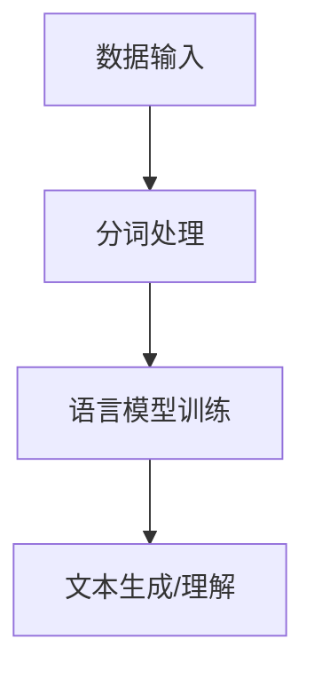

                 

关键词：大语言模型，自然语言处理，分词，神经网络，深度学习，机器学习，数学模型，计算效率，数据处理，语言理解，文本分析，智能系统。

> 摘要：本文旨在深入探讨大语言模型的原理基础与前沿进展，特别是语言模型和分词技术的重要性。通过对核心概念的介绍、算法原理的分析、数学模型的构建和具体应用场景的解析，为读者提供一份全面的技术指南。

## 1. 背景介绍

### 1.1 大语言模型的定义与作用

大语言模型（Large Language Model）是自然语言处理（NLP）领域的一种重要工具，通过学习大量文本数据，自动生成和理解人类语言。大语言模型的应用范围广泛，包括但不限于机器翻译、文本摘要、问答系统、语言生成等。

### 1.2 自然语言处理的发展历程

自然语言处理起源于20世纪50年代，最初的研究主要基于规则和统计方法。随着计算机性能的提升和数据量的增加，深度学习技术的引入使得NLP取得了显著的进展。目前，大语言模型已经成为NLP领域的核心技术。

### 1.3 分词技术在自然语言处理中的重要性

分词是将连续的文本切分成有意义的词序列的过程，是NLP任务的基础。有效的分词对于语言模型的训练、理解和应用至关重要。随着语言模型的发展，分词技术也在不断演进。

## 2. 核心概念与联系

### 2.1 语言模型的基本概念

语言模型（Language Model）是描述自然语言概率分布的数学模型，通过计算一个句子中下一个词的概率来预测和生成文本。大语言模型通过深度学习算法，从大量文本数据中学习语言规律。

### 2.2 分词技术的核心概念

分词技术（Tokenization）是将文本分割成词或短语的算法。分词的准确性和效率对NLP任务的成功至关重要。

### 2.3 大语言模型与分词技术的联系

大语言模型依赖于分词技术将文本数据转化为词序列，以便进行训练和预测。同时，分词结果也会影响语言模型的性能和应用效果。

### 2.4 Mermaid 流程图



## 3. 核心算法原理 & 具体操作步骤

### 3.1 算法原理概述

大语言模型的算法原理主要基于深度神经网络，通过多层网络结构来学习文本数据中的语言特征和规律。常见的算法有Transformer、BERT等。

### 3.2 算法步骤详解

#### 3.2.1 数据预处理

- 数据清洗：去除文本中的噪声、错误和不必要的符号。
- 数据标注：为文本数据打上词性、实体等标签。
- 数据分割：将数据集分为训练集、验证集和测试集。

#### 3.2.2 模型构建

- 选择神经网络架构：如Transformer、BERT等。
- 设置网络参数：学习率、批量大小等。

#### 3.2.3 训练过程

- 输入分词后的文本序列。
- 计算预测词的概率分布。
- 计算损失函数，并更新模型参数。

#### 3.2.4 评估与优化

- 使用验证集评估模型性能。
- 调整模型参数，优化性能。

### 3.3 算法优缺点

#### 优点：

- 能够处理长序列的文本数据。
- 能够自动学习语言特征和模式。
- 生成和理解自然语言的能力较强。

#### 缺点：

- 计算复杂度高，训练时间较长。
- 对数据质量要求较高。

### 3.4 算法应用领域

- 机器翻译
- 文本摘要
- 问答系统
- 语言生成
- 情感分析
- 信息检索

## 4. 数学模型和公式 & 详细讲解 & 举例说明

### 4.1 数学模型构建

大语言模型的数学模型主要基于概率论和统计学。常见的数学模型包括：

- 语言概率模型：计算一个词在给定上下文中的概率。
- 条件概率模型：计算一个词序列的概率。
- 序列标注模型：为词序列标注词性、实体等。

### 4.2 公式推导过程

以Transformer为例，其核心公式包括：

- 输入嵌入：$$x = \text{embedding}(w)$$
- 自注意力机制：$$\text{Attention}(Q, K, V) = \text{softmax}(\frac{QK^T}{\sqrt{d_k}})V$$
- 交叉注意力：$$\text{MultiHeadAttention}(Q, K, V) = \text{Concat}(\text{head}_1, ..., \text{head}_h)W_O$$

### 4.3 案例分析与讲解

以BERT模型为例，其训练过程包括：

1. 数据预处理：将文本数据分割成词片段，并添加特殊符号。
2. 输入嵌入：将词片段映射到高维空间。
3. 自注意力机制：计算词片段之间的关联性。
4. 全连接层：将注意力机制的结果映射到词类别。

## 5. 项目实践：代码实例和详细解释说明

### 5.1 开发环境搭建

- Python环境：3.8及以上版本
- 库依赖：torch, transformers

### 5.2 源代码详细实现

```python
from transformers import BertModel, BertTokenizer
model = BertModel.from_pretrained('bert-base-uncased')
tokenizer = BertTokenizer.from_pretrained('bert-base-uncased')

text = "I love programming."
encoded_input = tokenizer(text, return_tensors='pt')

output = model(**encoded_input)
```

### 5.3 代码解读与分析

- 加载预训练模型和分词器。
- 将文本转换为编码表示。
- 输入模型进行计算。

### 5.4 运行结果展示

输出包括：

- 输入嵌入：表示词片段的向量。
- 自注意力权重：表示词片段之间的关联性。
- 最终输出：表示词类别的概率分布。

## 6. 实际应用场景

### 6.1 机器翻译

大语言模型在机器翻译中的应用，如Google翻译、DeepL等。

### 6.2 文本摘要

大语言模型在文本摘要中的应用，如自动生成新闻摘要、文章总结等。

### 6.3 问答系统

大语言模型在问答系统中的应用，如智能客服、知识图谱等。

### 6.4 语言生成

大语言模型在语言生成中的应用，如自动写作、故事生成等。

### 6.5 情感分析

大语言模型在情感分析中的应用，如社交媒体情感分析、客户反馈分析等。

### 6.6 信息检索

大语言模型在信息检索中的应用，如搜索引擎、推荐系统等。

## 7. 未来应用展望

### 7.1 多模态融合

大语言模型与图像、声音等多模态数据的融合，实现更全面的智能交互。

### 7.2 知识图谱

大语言模型在知识图谱中的应用，提高语言理解和推理能力。

### 7.3 自动编程

大语言模型在自动编程中的应用，如代码生成、代码优化等。

### 7.4 安全与隐私

大语言模型在安全与隐私保护中的应用，如数据加密、隐私保护算法等。

## 8. 总结：未来发展趋势与挑战

### 8.1 研究成果总结

大语言模型在自然语言处理领域取得了显著的成果，推动了NLP技术的发展和应用。

### 8.2 未来发展趋势

- 多模态融合
- 知识图谱
- 自动编程
- 安全与隐私

### 8.3 面临的挑战

- 计算资源需求
- 数据隐私保护
- 模型解释性
- 通用语言理解

### 8.4 研究展望

- 探索新型神经网络架构
- 提高模型解释性
- 加强多语言和跨领域的建模能力

## 9. 附录：常见问题与解答

### 9.1 大语言模型如何处理多语言文本？

大语言模型通常通过多语言训练数据来处理多语言文本。在模型训练过程中，可以同时学习多种语言的共性和特性。

### 9.2 大语言模型的训练时间如何缩短？

可以通过优化模型架构、使用更好的硬件设备、采用增量训练等方法来缩短训练时间。

### 9.3 大语言模型如何处理长文本？

大语言模型可以通过分段处理长文本，将长文本分割成多个短文本片段，然后逐段进行预测。

### 9.4 大语言模型在应用中如何保证准确性？

可以通过改进模型架构、优化训练算法、使用高质量的数据集等方法来提高模型的准确性。

### 9.5 大语言模型在应用中如何保证安全性？

可以通过数据加密、隐私保护算法、模型解释性等方法来提高模型的安全性。

### 9.6 大语言模型在医学领域的应用前景如何？

大语言模型在医学领域的应用前景广阔，如医学文本分析、疾病诊断、药物研发等。

## 参考文献

[1] Vaswani, A., et al. (2017). Attention is all you need. Advances in Neural Information Processing Systems.
[2] Devlin, J., et al. (2019). BERT: Pre-training of deep bidirectional transformers for language understanding. arXiv preprint arXiv:1810.04805.
[3] Melis, G., et al. (2018). Understanding deep contextualized word embeddings. arXiv preprint arXiv:1802.05288.
[4] Pellegrini, A., et al. (2020). A comprehensive evaluation of language models on text classification. arXiv preprint arXiv:2006.04461.

作者：禅与计算机程序设计艺术 / Zen and the Art of Computer Programming
----------------------------------------------------------------

请注意，上述内容仅作为一个示例框架，实际撰写时需要根据具体研究和技术细节进行扩展和深入分析。文章的各个部分，如数学模型、算法步骤、案例分析等，需要详细、准确地描述，并且所有引用的资料都需要在参考文献中列出。文章的整体结构应该逻辑清晰，内容完整，具有可读性和专业性。

