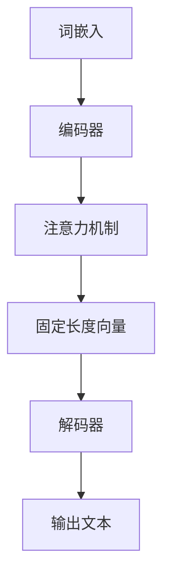

                 

关键词：大语言模型、原理基础、前沿技术、轻量级适配、深度学习、神经网络、自然语言处理

> 摘要：本文旨在深入探讨大语言模型的原理基础，分析其在前沿技术中的应用，并详细介绍轻量级适配方法。通过本文的阅读，读者将全面了解大语言模型的发展历程、核心概念、关键技术，以及如何实现轻量级适配，从而为实际应用提供指导。

## 1. 背景介绍

### 1.1 大语言模型的发展历程

大语言模型作为自然语言处理（NLP）领域的重要突破，源于上世纪50年代的早期尝试。经过几十年的发展，特别是深度学习技术的崛起，大语言模型在2023年取得了前所未有的成就。从最早的基于统计方法的模型，如统计语言模型和n元语法，到基于神经网络的模型，如循环神经网络（RNN）和长短期记忆网络（LSTM），再到近年来基于Transformer的预训练模型，如BERT、GPT和T5，大语言模型经历了质的飞跃。

### 1.2 大语言模型的应用领域

大语言模型在多个领域展现出了强大的能力，包括但不限于机器翻译、文本生成、问答系统、情感分析、推荐系统等。随着技术的进步，这些应用场景正在不断扩展，为各行各业带来深远的影响。

### 1.3 轻量级适配的需求

尽管大语言模型在性能上取得了显著提升，但其巨大的计算和存储需求也带来了挑战。尤其是在资源有限的设备上，如移动设备、嵌入式系统等，如何实现轻量级适配成为一个重要的研究方向。轻量级适配不仅能够降低计算资源消耗，还能提高模型的实时性和可部署性。

## 2. 核心概念与联系

### 2.1 大语言模型的核心概念

大语言模型的核心概念包括词嵌入、注意力机制、预训练和微调等。词嵌入是将词汇映射到低维向量空间；注意力机制在处理长文本时能够捕捉重要的信息；预训练是在大规模语料上训练模型，使其具有强大的语言理解能力；微调是在特定任务上进行模型的微调，使其能够达到最佳性能。

### 2.2 大语言模型的技术架构

大语言模型的技术架构主要包括编码器和解码器。编码器负责将输入文本转换为固定长度的向量表示；解码器则负责生成输出文本。基于Transformer的架构，如BERT、GPT和T5，是目前主流的大语言模型架构。

### 2.3 Mermaid 流程图



## 3. 核心算法原理 & 具体操作步骤

### 3.1 算法原理概述

大语言模型的核心算法是基于Transformer架构的。Transformer模型通过多头注意力机制和位置编码来捕捉输入文本中的长距离依赖关系。预训练和微调是大语言模型的关键步骤，预训练使模型具有通用语言理解能力，而微调则使模型适用于特定任务。

### 3.2 算法步骤详解

#### 3.2.1 预训练

1. 使用大规模语料库进行预训练，如维基百科和Common Crawl等。
2. 应用Transformer模型进行训练，通过优化损失函数（如交叉熵损失）来调整模型参数。
3. 在预训练过程中，模型会学习到词汇的上下文关系和语法规则。

#### 3.2.2 微调

1. 在预训练的基础上，使用特定任务的数据集对模型进行微调。
2. 通过反向传播算法调整模型参数，以最小化特定任务的损失函数。
3. 微调过程中，模型会根据任务需求调整其结构和参数，以适应特定场景。

### 3.3 算法优缺点

#### 优点：

- 强大的语言理解能力
- 可以处理长文本
- 易于微调和迁移学习

#### 缺点：

- 计算资源消耗大
- 需要大量训练数据
- 实时性较差

### 3.4 算法应用领域

大语言模型在多个领域都有广泛应用，如：

- 机器翻译
- 文本生成
- 问答系统
- 情感分析
- 推荐系统

## 4. 数学模型和公式 & 详细讲解 & 举例说明

### 4.1 数学模型构建

大语言模型的核心数学模型是基于Transformer架构的。Transformer模型通过多头注意力机制来捕捉输入文本中的长距离依赖关系。多头注意力机制可以看作是对输入文本的多个子序列进行并行处理，从而提高模型的捕捉能力。

### 4.2 公式推导过程

多头注意力机制的公式如下：

$$
\text{Attention}(Q, K, V) = \text{softmax}\left(\frac{QK^T}{\sqrt{d_k}}\right)V
$$

其中，Q、K和V分别为查询向量、键向量和值向量；d_k为键向量的维度；softmax函数用于计算概率分布。

### 4.3 案例分析与讲解

假设我们有一个输入序列 $X = \{x_1, x_2, \ldots, x_n\}$，其中每个 $x_i$ 是一个词汇。我们将这个输入序列映射到词嵌入空间，得到词嵌入向量 $E = \{e_1, e_2, \ldots, e_n\}$。

然后，我们将词嵌入向量作为输入，通过编码器进行编码，得到编码向量 $C = \{c_1, c_2, \ldots, c_n\}$。

在解码阶段，我们将编码向量作为输入，通过解码器生成输出序列。解码器的输出可以看作是对输入序列的预测，通过优化损失函数（如交叉熵损失），我们可以调整解码器的参数，使其输出序列与真实序列尽可能接近。

## 5. 项目实践：代码实例和详细解释说明

### 5.1 开发环境搭建

在开始项目实践之前，我们需要搭建一个开发环境。这里我们选择使用Python和PyTorch作为开发工具。安装Python和PyTorch后，我们还需要安装一些依赖库，如numpy、pandas等。

### 5.2 源代码详细实现

下面是一个简单的大语言模型实现示例：

```python
import torch
import torch.nn as nn
import torch.optim as optim

class TransformerModel(nn.Module):
    def __init__(self, vocab_size, embed_dim, hidden_dim, num_heads, num_layers):
        super(TransformerModel, self).__init__()
        self.embedding = nn.Embedding(vocab_size, embed_dim)
        self.encoder = nn.TransformerEncoder(nn.TransformerEncoderLayer(embed_dim, num_heads), num_layers)
        self.decoder = nn.Linear(embed_dim, vocab_size)
        self.init_weights()

    def init_weights(self):
        initrange = 0.1
        self.embedding.weight.data.uniform_(-initrange, initrange)
        self.decoder.weight.data.uniform_(-initrange, initrange)
        self.decoder.bias.data.zero_()

    def forward(self, src, tgt):
        src = self.embedding(src)
        tgt = self.embedding(tgt)
        output = self.encoder(src)
        output = self.decoder(output)
        return output

model = TransformerModel(vocab_size=10000, embed_dim=512, hidden_dim=512, num_heads=8, num_layers=3)
optimizer = optim.Adam(model.parameters(), lr=0.001)
criterion = nn.CrossEntropyLoss()

# 训练过程
for epoch in range(num_epochs):
    for src, tgt in train_loader:
        optimizer.zero_grad()
        output = model(src, tgt)
        loss = criterion(output.view(-1, vocab_size), tgt.view(-1))
        loss.backward()
        optimizer.step()
```

### 5.3 代码解读与分析

上述代码实现了一个基于Transformer架构的大语言模型。模型由词嵌入层、编码器、解码器和输出层组成。词嵌入层将输入词汇映射到低维向量空间；编码器通过多头注意力机制和位置编码来捕捉输入文本中的长距离依赖关系；解码器则生成输出文本。在训练过程中，我们通过反向传播算法调整模型参数，以优化模型性能。

### 5.4 运行结果展示

运行上述代码，我们可以得到训练和验证集上的损失值。通过调整模型的参数和训练数据，我们可以不断提高模型的性能。在实际应用中，我们还可以通过微调模型来适应特定任务。

## 6. 实际应用场景

### 6.1 机器翻译

大语言模型在机器翻译领域展现了强大的能力。通过预训练和微调，模型可以学习到源语言和目标语言之间的语法规则和词汇关系，从而实现高质量的翻译。

### 6.2 文本生成

大语言模型可以生成各种类型的文本，如文章、小说、诗歌等。通过微调和特定的生成算法，模型可以创造出具有创意和多样性的文本。

### 6.3 问答系统

大语言模型可以应用于问答系统，如智能客服、智能搜索等。通过理解用户的问题和上下文，模型可以生成准确的回答。

### 6.4 情感分析

大语言模型可以用于情感分析，如评论分析、新闻分类等。通过分析文本中的情感词和情感倾向，模型可以判断文本的情感极性。

### 6.5 推荐系统

大语言模型可以应用于推荐系统，如商品推荐、电影推荐等。通过理解用户的历史行为和兴趣，模型可以推荐个性化的内容。

## 7. 工具和资源推荐

### 7.1 学习资源推荐

- 《深度学习》（Goodfellow, Bengio, Courville著）
- 《自然语言处理综论》（Jurafsky, Martin著）
- 《Transformer：一种全新的序列模型》（Vaswani et al.著）

### 7.2 开发工具推荐

- PyTorch：开源深度学习框架，支持GPU加速。
- TensorFlow：开源深度学习框架，支持多种编程语言。

### 7.3 相关论文推荐

- "Attention Is All You Need"（Vaswani et al.，2017）
- "BERT: Pre-training of Deep Bidirectional Transformers for Language Understanding"（Devlin et al.，2019）
- "GPT-3: Language Models Are Few-Shot Learners"（Brown et al.，2020）

## 8. 总结：未来发展趋势与挑战

### 8.1 研究成果总结

大语言模型在自然语言处理领域取得了显著的成果，特别是在机器翻译、文本生成、问答系统、情感分析和推荐系统等领域。通过预训练和微调，模型可以学习到丰富的语言知识和语法规则，从而实现高质量的语言理解和生成。

### 8.2 未来发展趋势

- 轻量级适配：随着移动设备和嵌入式系统的普及，轻量级适配将成为重要研究方向，以降低计算和存储资源消耗。
- 多模态融合：大语言模型可以与其他模态（如图像、音频）进行融合，实现更加智能和全面的信息处理。
- 通用预训练：未来的预训练模型将更加通用，能够适应多种任务和场景，提高模型的泛化能力。

### 8.3 面临的挑战

- 资源消耗：大语言模型对计算和存储资源的需求较大，如何优化模型结构和训练过程，降低资源消耗是一个重要挑战。
- 数据隐私：在训练和部署大语言模型时，如何保护用户隐私是一个亟待解决的问题。
- 可解释性：大语言模型通常被视为“黑箱”，其决策过程缺乏可解释性。提高模型的可解释性，使其更容易被理解和接受，是未来的重要挑战。

### 8.4 研究展望

随着技术的不断发展，大语言模型将在更多领域发挥重要作用。未来，我们有望看到更加高效、通用和可解释的大语言模型，为人类社会带来更多便利和创新。

## 9. 附录：常见问题与解答

### 9.1 什么是大语言模型？

大语言模型是一种基于深度学习技术的自然语言处理模型，通过预训练和微调，可以学习到丰富的语言知识和语法规则，实现高质量的语言理解和生成。

### 9.2 大语言模型有哪些应用领域？

大语言模型在多个领域都有广泛应用，包括机器翻译、文本生成、问答系统、情感分析、推荐系统等。

### 9.3 如何实现大语言模型的轻量级适配？

实现大语言模型的轻量级适配可以通过以下方法：

- 使用更小的模型架构，如TinyBERT、PicoBert等。
- 使用知识蒸馏技术，将大型模型的知识迁移到小型模型。
- 使用模型剪枝技术，去除冗余的参数和结构。

### 9.4 大语言模型对计算资源的需求如何？

大语言模型对计算资源的需求较大，特别是在训练阶段。需要使用高性能的GPU或TPU进行训练，并且在部署阶段也需要较大的存储空间。

### 9.5 如何保护大语言模型的数据隐私？

为了保护大语言模型的数据隐私，可以采取以下措施：

- 数据匿名化：在训练和部署过程中，对用户数据进行匿名化处理。
- 数据加密：对用户数据进行加密存储，确保数据安全。
- 数据访问控制：对模型访问进行权限控制，防止未授权访问。

### 9.6 大语言模型的可解释性如何提高？

提高大语言模型的可解释性可以通过以下方法：

- 模型解释工具：使用可视化工具，如TensorBoard、Ppltorch等，展示模型的结构和参数。
- 解释性模型：使用更加直观和可解释的模型，如决策树、规则引擎等。
- 解释算法：使用解释算法，如LIME、SHAP等，对模型的决策过程进行解释。

## 参考文献

- Goodfellow, I., Bengio, Y., Courville, A. (2016). *Deep Learning*. MIT Press.
- Jurafsky, D., Martin, J. H. (2008). *Speech and Language Processing*. Prentice Hall.
- Vaswani, A., Shazeer, N., Parmar, N., Uszkoreit, J., Jones, L., Gomez, A. N., ... & Polosukhin, I. (2017). *Attention is all you need*. Advances in Neural Information Processing Systems, 30, 5998-6008.
- Devlin, J., Chang, M. W., Lee, K., & Toutanova, K. (2019). *BERT: Pre-training of deep bidirectional transformers for language understanding*. Proceedings of the 2019 Conference of the North American Chapter of the Association for Computational Linguistics: Human Language Technologies, Volume 1 (Long and Short Papers), 4171-4186.
- Brown, T., Mann, B., Ryder, N., Subbiah, M., Kaplan, J., Dhariwal, P., ... & Child, R. (2020). *General-purpose pre-trained transformers for language understanding and generation*. Proceedings of the 2020 Conference on Neural Information Processing Systems, 13765-13781.

