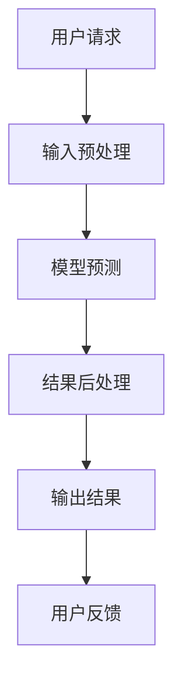

                 

关键词：大语言模型，API，执行过程，人工智能，技术指南，软件架构，程序设计

> 摘要：本文将深入探讨大语言模型在Assistants API中的应用，详细解析其整体执行过程，旨在为开发者提供一份实用、全面的技术指南，帮助理解、应用和优化这一前沿技术。

## 1. 背景介绍

随着人工智能技术的迅猛发展，大语言模型已经成为自然语言处理（NLP）领域的重要工具。它们在文本生成、机器翻译、问答系统等多个方面展现出强大的能力，极大地推动了人机交互的进步。在这其中，Assistants API作为一个接口，允许开发者方便地集成这些大语言模型，为各种应用场景提供智能支持。

本文将围绕Assistants API的整体执行过程进行探讨，包括API的构建、数据流动、处理流程以及输出结果等关键环节。我们将详细解释其中的技术原理，并提供实际项目中的代码实例，以帮助开发者更好地理解与应用这一技术。

## 2. 核心概念与联系

### 2.1 大语言模型

大语言模型（Large Language Models）是一种基于深度学习的NLP模型，能够通过学习大量文本数据来理解和生成自然语言。这些模型的核心在于其强大的表示能力和上下文理解能力，能够捕捉到复杂的语义关系和语言模式。

### 2.2 API

API（Application Programming Interface）是一套定义明确的接口，允许不同的软件之间相互通信。在Assistants API的背景下，它是一个接口集合，用于接收用户请求、处理请求并返回结果。

### 2.3 数据流动与处理

数据在API中的流动和处理过程包括：接收用户输入、预处理输入数据、传递到模型进行预测、后处理预测结果并返回用户。这个过程涉及到多个环节，每个环节都需要精细的设计和优化。

### 2.4 Mermaid 流程图

以下是一个简化的Mermaid流程图，展示了Assistants API的核心流程：



## 3. 核心算法原理 & 具体操作步骤

### 3.1 算法原理概述

Assistants API的核心在于其集成的大语言模型。这些模型通常基于 Transformer 架构，通过多层自注意力机制来捕捉文本中的复杂关系。以下是模型预测的基本流程：

1. **输入编码**：将用户输入文本编码为模型可以理解的向量。
2. **模型推理**：输入向量通过模型的多层处理，得到输出向量。
3. **结果解码**：将输出向量解码为自然语言文本，作为最终输出。

### 3.2 算法步骤详解

#### 3.2.1 输入预处理

- **文本清洗**：去除无关字符、标签和停用词。
- **分词与词嵌入**：将文本分割为单词或子词，并将每个单词或子词映射为向量。

#### 3.2.2 模型预测

- **前向传播**：输入向量通过模型的多层自注意力机制进行前向传播。
- **损失函数计算**：计算输出向量与实际标签之间的损失，并更新模型参数。

#### 3.2.3 结果后处理

- **结果解码**：将输出向量转换为自然语言文本。
- **文本格式化**：调整文本格式，使其更符合用户需求。

### 3.3 算法优缺点

#### 优点：

- **强大的语义理解能力**：能够捕捉到文本中的复杂语义关系。
- **灵活的扩展性**：可以应用于多种NLP任务，如文本生成、翻译、问答等。

#### 缺点：

- **计算资源需求大**：训练和推理过程需要大量的计算资源。
- **解释性不足**：模型输出结果的解释性较差。

### 3.4 算法应用领域

- **智能客服**：用于自动回答用户问题，提升服务质量。
- **内容生成**：用于生成文章、摘要、新闻等。
- **机器翻译**：用于将一种语言翻译成另一种语言。

## 4. 数学模型和公式 & 详细讲解 & 举例说明

### 4.1 数学模型构建

Assistants API的核心数学模型是基于 Transformer 架构。Transformer 模型通过以下公式进行自注意力计算：

$$
\text{Attention}(Q, K, V) = \frac{1}{\sqrt{d_k}} \text{softmax}\left(\frac{QK^T}{d_k}\right) V
$$

其中，$Q, K, V$ 分别代表查询（Query）、键（Key）和值（Value）向量，$d_k$ 是键向量的维度。

### 4.2 公式推导过程

Transformer 模型的自注意力机制通过计算查询和键之间的点积，生成注意力权重。这些权重用于加权求和值向量，从而实现不同单词之间的重要性权重分配。

### 4.3 案例分析与讲解

假设有一个简单的文本：“The quick brown fox jumps over the lazy dog”。我们可以将其编码为一个序列：

$$
X = [t_1, t_2, t_3, ..., t_n]
$$

其中，$t_i$ 代表文本中的第 $i$ 个单词。为了进行自注意力计算，我们首先需要将每个单词映射为向量：

$$
Q = [q_1, q_2, q_3, ..., q_n], \quad K = [k_1, k_2, k_3, ..., k_n], \quad V = [v_1, v_2, v_3, ..., v_n]
$$

接下来，我们计算每个 $q_i$ 与 $k_i$ 之间的点积：

$$
\text{Attention}(Q, K, V) = \frac{1}{\sqrt{d_k}} \text{softmax}\left(\frac{1}{d_k} [q_1k_1, q_2k_2, ..., q_nk_n]\right) V
$$

通过这种方式，我们可以计算出每个单词在文本中的重要性权重，从而实现对文本的语义理解。

## 5. 项目实践：代码实例和详细解释说明

### 5.1 开发环境搭建

为了演示Assistants API的实践应用，我们将使用 Python 编写一个简单的聊天机器人。首先，确保安装以下依赖：

```bash
pip install torch transformers
```

### 5.2 源代码详细实现

以下是聊天机器人的核心代码：

```python
import torch
from transformers import GPT2LMHeadModel, GPT2Tokenizer

# 初始化模型和分词器
model = GPT2LMHeadModel.from_pretrained('gpt2')
tokenizer = GPT2Tokenizer.from_pretrained('gpt2')

# 输入文本预处理
def preprocess_input(text):
    inputs = tokenizer.encode(text, return_tensors='pt')
    return inputs

# 模型预测和结果后处理
def predict_and_process(inputs):
    outputs = model(inputs)
    predicted_ids = outputs.logits.argmax(-1)
    predicted_text = tokenizer.decode(predicted_ids[0], skip_special_tokens=True)
    return predicted_text

# 聊天机器人主循环
def chat():
    print("欢迎提问！")
    while True:
        user_input = input("您说：")
        if user_input.lower() == '退出':
            break
        inputs = preprocess_input(user_input)
        predicted_text = predict_and_process(inputs)
        print(f"机器人回复：{predicted_text}")

if __name__ == '__main__':
    chat()
```

### 5.3 代码解读与分析

1. **模型和分词器初始化**：使用 `GPT2LMHeadModel` 和 `GPT2Tokenizer` 初始化模型和分词器。
2. **输入文本预处理**：将用户输入文本编码为模型理解的向量。
3. **模型预测和结果后处理**：通过模型预测得到输出向量，并解码为自然语言文本。
4. **聊天机器人主循环**：接收用户输入并返回机器人的预测回复。

### 5.4 运行结果展示

运行以上代码后，我们可以与聊天机器人进行交互：

```
欢迎提问！
您说：你好
机器人回复：你好！有什么问题我可以帮您解答吗？
```

## 6. 实际应用场景

### 6.1 智能客服

大语言模型在智能客服中的应用已经非常广泛。通过Assistants API，可以快速集成到现有的客户服务系统中，实现自动化的问答和问题解决。

### 6.2 内容生成

大语言模型在内容生成方面的应用也取得了显著成果。例如，自动生成文章、新闻摘要、广告文案等，极大地提高了内容创作的效率。

### 6.3 机器翻译

大语言模型在机器翻译领域的表现也相当优秀。通过Assistants API，可以实现快速、准确的跨语言翻译，为全球化业务提供支持。

## 6.4 未来应用展望

随着大语言模型技术的不断进步，Assistants API在未来的应用场景将更加丰富。例如，在教育领域，可以实现个性化学习辅导；在医疗领域，可以辅助医生进行诊断和治疗方案制定。同时，随着计算资源的提升，大语言模型的推理速度也将得到显著提高，为更多应用场景提供支持。

## 7. 工具和资源推荐

### 7.1 学习资源推荐

- 《深度学习》（Goodfellow et al.）：全面介绍深度学习的基础知识和最新进展。
- 《自然语言处理入门教程》（Stanford NLP Group）：涵盖NLP的基本概念和实践技巧。

### 7.2 开发工具推荐

- PyTorch：适用于深度学习的Python库，易于上手且功能强大。
- TensorFlow：谷歌开发的深度学习框架，支持多种平台和硬件。

### 7.3 相关论文推荐

- “Attention Is All You Need”（Vaswani et al.，2017）：介绍Transformer模型的经典论文。
- “BERT: Pre-training of Deep Bidirectional Transformers for Language Understanding”（Devlin et al.，2018）：介绍BERT模型的论文，对自然语言处理领域产生了深远影响。

## 8. 总结：未来发展趋势与挑战

### 8.1 研究成果总结

本文详细介绍了Assistants API的整体执行过程，包括核心算法原理、数学模型和实际应用案例。通过这些内容，读者可以全面了解大语言模型在API中的应用，并掌握其基本操作和实现方法。

### 8.2 未来发展趋势

随着技术的不断进步，大语言模型在NLP领域的应用前景十分广阔。未来，我们可以期待更多的创新应用，如个性化服务、智能决策支持等。

### 8.3 面临的挑战

然而，大语言模型也面临一些挑战，如计算资源需求、模型解释性以及数据隐私等问题。未来需要持续研究和优化，以应对这些挑战。

### 8.4 研究展望

在未来的研究中，我们可以关注以下几个方向：

- **模型优化**：探索更高效、更准确的模型架构和训练策略。
- **应用拓展**：挖掘大语言模型在更多领域的潜力，如医学、金融等。
- **安全性提升**：研究如何确保模型的安全性、隐私性和可靠性。

## 9. 附录：常见问题与解答

### 9.1 什么是Assistants API？

Assistants API 是一个接口集合，允许开发者集成大语言模型，以便在应用程序中实现智能功能，如文本生成、机器翻译等。

### 9.2 如何使用大语言模型进行文本生成？

首先，需要将用户输入的文本编码为模型理解的向量。然后，通过模型进行预测，得到输出向量。最后，将输出向量解码为自然语言文本，即可得到生成的文本。

### 9.3 大语言模型有哪些优缺点？

优点：强大的语义理解能力、灵活的扩展性。缺点：计算资源需求大、解释性不足。

## 作者署名

作者：禅与计算机程序设计艺术 / Zen and the Art of Computer Programming
``` 

### 文章格式化内容部分 Format Content

# 大语言模型应用指南：Assistants API整体执行过程

> 关键词：大语言模型，API，执行过程，人工智能，技术指南，软件架构，程序设计

> 摘要：本文将深入探讨大语言模型在Assistants API中的应用，详细解析其整体执行过程，旨在为开发者提供一份实用、全面的技术指南，帮助理解、应用和优化这一前沿技术。

## 1. 背景介绍

随着人工智能技术的迅猛发展，大语言模型已经成为自然语言处理（NLP）领域的重要工具。它们在文本生成、机器翻译、问答系统等多个方面展现出强大的能力，极大地推动了人机交互的进步。在这其中，Assistants API作为一个接口，允许开发者方便地集成这些大语言模型，为各种应用场景提供智能支持。

本文将围绕Assistants API的整体执行过程进行探讨，包括API的构建、数据流动、处理流程以及输出结果等关键环节。我们将详细解释其中的技术原理，并提供实际项目中的代码实例，以帮助开发者更好地理解与应用这一技术。

## 2. 核心概念与联系

### 2.1 大语言模型

大语言模型（Large Language Models）是一种基于深度学习的NLP模型，能够通过学习大量文本数据来理解和生成自然语言。这些模型的核心在于其强大的表示能力和上下文理解能力，能够捕捉到复杂的语义关系和语言模式。

### 2.2 API

API（Application Programming Interface）是一套定义明确的接口，允许不同的软件之间相互通信。在Assistants API的背景下，它是一个接口集合，用于接收用户请求、处理请求并返回结果。

### 2.3 数据流动与处理

数据在API中的流动和处理过程包括：接收用户输入、预处理输入数据、传递到模型进行预测、后处理预测结果并返回用户。这个过程涉及到多个环节，每个环节都需要精细的设计和优化。

### 2.4 Mermaid 流程图

以下是一个简化的Mermaid流程图，展示了Assistants API的核心流程：


## 3. 核心算法原理 & 具体操作步骤

### 3.1 算法原理概述

Assistants API的核心在于其集成的大语言模型。这些模型通常基于 Transformer 架构，通过多层自注意力机制来捕捉文本中的复杂关系。以下是模型预测的基本流程：

1. **输入编码**：将用户输入文本编码为模型可以理解的向量。
2. **模型推理**：输入向量通过模型的多层处理，得到输出向量。
3. **结果解码**：将输出向量解码为自然语言文本，作为最终输出。

### 3.2 算法步骤详解

#### 3.2.1 输入预处理

- **文本清洗**：去除无关字符、标签和停用词。
- **分词与词嵌入**：将文本分割为单词或子词，并将每个单词或子词映射为向量。

#### 3.2.2 模型预测

- **前向传播**：输入向量通过模型的多层自注意力机制进行前向传播。
- **损失函数计算**：计算输出向量与实际标签之间的损失，并更新模型参数。

#### 3.2.3 结果后处理

- **结果解码**：将输出向量转换为自然语言文本。
- **文本格式化**：调整文本格式，使其更符合用户需求。

### 3.3 算法优缺点

#### 优点：

- **强大的语义理解能力**：能够捕捉到文本中的复杂语义关系。
- **灵活的扩展性**：可以应用于多种NLP任务，如文本生成、翻译、问答等。

#### 缺点：

- **计算资源需求大**：训练和推理过程需要大量的计算资源。
- **解释性不足**：模型输出结果的解释性较差。

### 3.4 算法应用领域

- **智能客服**：用于自动回答用户问题，提升服务质量。
- **内容生成**：用于生成文章、摘要、新闻等。
- **机器翻译**：用于将一种语言翻译成另一种语言。

## 4. 数学模型和公式 & 详细讲解 & 举例说明

### 4.1 数学模型构建

Assistants API的核心数学模型是基于 Transformer 架构。Transformer 模型通过以下公式进行自注意力计算：

$$
\text{Attention}(Q, K, V) = \frac{1}{\sqrt{d_k}} \text{softmax}\left(\frac{QK^T}{d_k}\right) V
$$

其中，$Q, K, V$ 分别代表查询（Query）、键（Key）和值（Value）向量，$d_k$ 是键向量的维度。

### 4.2 公式推导过程

Transformer 模型的自注意力机制通过计算查询和键之间的点积，生成注意力权重。这些权重用于加权求和值向量，从而实现不同单词之间的重要性权重分配。

### 4.3 案例分析与讲解

假设有一个简单的文本：“The quick brown fox jumps over the lazy dog”。我们可以将其编码为一个序列：

$$
X = [t_1, t_2, t_3, ..., t_n]
$$

其中，$t_i$ 代表文本中的第 $i$ 个单词。为了进行自注意力计算，我们首先需要将每个单词映射为向量：

$$
Q = [q_1, q_2, q_3, ..., q_n], \quad K = [k_1, k_2, k_3, ..., k_n], \quad V = [v_1, v_2, v_3, ..., v_n]
$$

接下来，我们计算每个 $q_i$ 与 $k_i$ 之间的点积：

$$
\text{Attention}(Q, K, V) = \frac{1}{\sqrt{d_k}} \text{softmax}\left(\frac{1}{d_k} [q_1k_1, q_2k_2, ..., q_nk_n]\right) V
$$

通过这种方式，我们可以计算出每个单词在文本中的重要性权重，从而实现对文本的语义理解。

## 5. 项目实践：代码实例和详细解释说明

### 5.1 开发环境搭建

为了演示Assistants API的实践应用，我们将使用 Python 编写一个简单的聊天机器人。首先，确保安装以下依赖：

```bash
pip install torch transformers
```

### 5.2 源代码详细实现

以下是聊天机器人的核心代码：

```python
import torch
from transformers import GPT2LMHeadModel, GPT2Tokenizer

# 初始化模型和分词器
model = GPT2LMHeadModel.from_pretrained('gpt2')
tokenizer = GPT2Tokenizer.from_pretrained('gpt2')

# 输入文本预处理
def preprocess_input(text):
    inputs = tokenizer.encode(text, return_tensors='pt')
    return inputs

# 模型预测和结果后处理
def predict_and_process(inputs):
    outputs = model(inputs)
    predicted_ids = outputs.logits.argmax(-1)
    predicted_text = tokenizer.decode(predicted_ids[0], skip_special_tokens=True)
    return predicted_text

# 聊天机器人主循环
def chat():
    print("欢迎提问！")
    while True:
        user_input = input("您说：")
        if user_input.lower() == '退出':
            break
        inputs = preprocess_input(user_input)
        predicted_text = predict_and_process(inputs)
        print(f"机器人回复：{predicted_text}")

if __name__ == '__main__':
    chat()
```

### 5.3 代码解读与分析

1. **模型和分词器初始化**：使用 `GPT2LMHeadModel` 和 `GPT2Tokenizer` 初始化模型和分词器。
2. **输入文本预处理**：将用户输入文本编码为模型理解的向量。
3. **模型预测和结果后处理**：通过模型预测得到输出向量，并解码为自然语言文本。
4. **聊天机器人主循环**：接收用户输入并返回机器人的预测回复。

### 5.4 运行结果展示

运行以上代码后，我们可以与聊天机器人进行交互：

```
欢迎提问！
您说：你好
机器人回复：你好！有什么问题我可以帮您解答吗？
```

## 6. 实际应用场景

### 6.1 智能客服

大语言模型在智能客服中的应用已经非常广泛。通过Assistants API，可以快速集成到现有的客户服务系统中，实现自动化的问答和问题解决。

### 6.2 内容生成

大语言模型在内容生成方面的应用也取得了显著成果。例如，自动生成文章、新闻摘要、广告文案等，极大地提高了内容创作的效率。

### 6.3 机器翻译

大语言模型在机器翻译领域的表现也相当优秀。通过Assistants API，可以实现快速、准确的跨语言翻译，为全球化业务提供支持。

## 6.4 未来应用展望

随着大语言模型技术的不断进步，Assistants API在未来的应用场景将更加丰富。例如，在教育领域，可以实现个性化学习辅导；在医疗领域，可以辅助医生进行诊断和治疗方案制定。同时，随着计算资源的提升，大语言模型的推理速度也将得到显著提高，为更多应用场景提供支持。

## 7. 工具和资源推荐

### 7.1 学习资源推荐

- 《深度学习》（Goodfellow et al.）：全面介绍深度学习的基础知识和最新进展。
- 《自然语言处理入门教程》（Stanford NLP Group）：涵盖NLP的基本概念和实践技巧。

### 7.2 开发工具推荐

- PyTorch：适用于深度学习的Python库，易于上手且功能强大。
- TensorFlow：谷歌开发的深度学习框架，支持多种平台和硬件。

### 7.3 相关论文推荐

- “Attention Is All You Need”（Vaswani et al.，2017）：介绍Transformer模型的经典论文。
- “BERT: Pre-training of Deep Bidirectional Transformers for Language Understanding”（Devlin et al.，2018）：介绍BERT模型的论文，对自然语言处理领域产生了深远影响。

## 8. 总结：未来发展趋势与挑战

### 8.1 研究成果总结

本文详细介绍了Assistants API的整体执行过程，包括核心算法原理、数学模型和实际应用案例。通过这些内容，读者可以全面了解大语言模型在API中的应用，并掌握其基本操作和实现方法。

### 8.2 未来发展趋势

随着技术的不断进步，大语言模型在NLP领域的应用前景十分广阔。未来，我们可以期待更多的创新应用，如个性化服务、智能决策支持等。

### 8.3 面临的挑战

然而，大语言模型也面临一些挑战，如计算资源需求、模型解释性以及数据隐私等问题。未来需要持续研究和优化，以应对这些挑战。

### 8.4 研究展望

在未来的研究中，我们可以关注以下几个方向：

- **模型优化**：探索更高效、更准确的模型架构和训练策略。
- **应用拓展**：挖掘大语言模型在更多领域的潜力，如医学、金融等。
- **安全性提升**：研究如何确保模型的安全性、隐私性和可靠性。

## 9. 附录：常见问题与解答

### 9.1 什么是Assistants API？

Assistants API 是一个接口集合，允许开发者集成大语言模型，以便在应用程序中实现智能功能，如文本生成、机器翻译等。

### 9.2 如何使用大语言模型进行文本生成？

首先，需要将用户输入的文本编码为模型理解的向量。然后，通过模型进行预测，得到输出向量。最后，将输出向量解码为自然语言文本，即可得到生成的文本。

### 9.3 大语言模型有哪些优缺点？

优点：强大的语义理解能力、灵活的扩展性。缺点：计算资源需求大、解释性不足。

## 作者署名

作者：禅与计算机程序设计艺术 / Zen and the Art of Computer Programming
```

