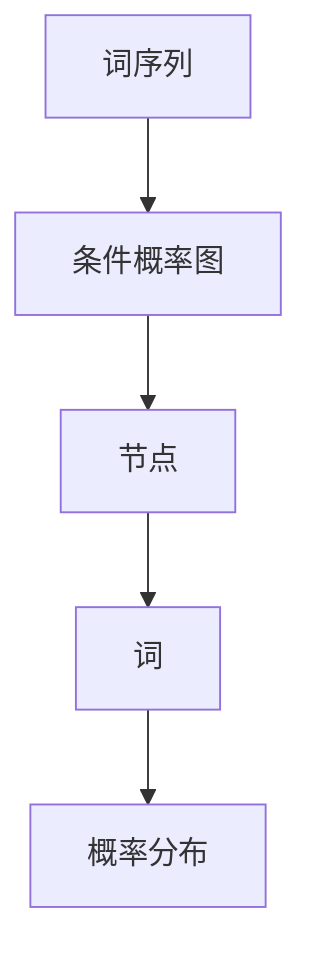

                 

关键词：大语言模型、Chain-of-Density、人工智能、自然语言处理、模型应用

> 摘要：本文将深入探讨大语言模型中的Chain-of-Density机制，详细解析其原理、实现和应用。通过一系列的实例和数学模型，我们将展示Chain-of-Density在实际自然语言处理任务中的重要性，并提供实用的开发工具和资源推荐。

## 1. 背景介绍

### 大语言模型的崛起

在过去的几年中，大语言模型如BERT、GPT-3等，凭借其强大的自然语言理解和生成能力，成为人工智能领域的明星。这些模型通过深度学习和神经网络技术，对海量文本数据进行了训练，从而能够捕捉到语言中的复杂结构和模式。

### Chain-of-Density的概念

Chain-of-Density是这些大语言模型中的一个关键机制，它通过一种独特的方式对文本序列进行建模。Chain-of-Density将文本序列中的每个词视为一个概率分布，而不是一个固定的值，从而更好地捕捉到语言中的不确定性和多样性。

## 2. 核心概念与联系

### 原理

Chain-of-Density基于概率图模型，将文本序列视为一个条件概率图。在这个图中，每个节点代表一个词，而边则表示词之间的依赖关系。

### 架构


在这个架构中，左边的部分是文本序列，而右边的部分是相应的概率图。每个词都有一个概率分布，表示它在序列中出现的概率。

### Mermaid流程图



## 3. 核心算法原理 & 具体操作步骤

### 3.1 算法原理概述

Chain-of-Density的核心是概率图模型，它通过条件概率来描述词之间的依赖关系。具体来说，对于任意两个词 $w_i$ 和 $w_j$，它们的条件概率可以表示为：

$$ P(w_j | w_i) = \frac{P(w_i, w_j)}{P(w_i)} $$

其中，$P(w_i, w_j)$ 表示 $w_i$ 和 $w_j$ 同时出现的概率，$P(w_i)$ 表示 $w_i$ 出现的概率。

### 3.2 算法步骤详解

1. **构建概率图模型**：首先，我们需要根据文本序列构建一个条件概率图。这个过程中，我们会对每个词进行词性标注，从而确定它们之间的依赖关系。

2. **计算条件概率**：接下来，我们利用条件概率公式计算每个词的条件概率分布。这个过程通常涉及到大量的矩阵运算，可以使用深度学习框架（如TensorFlow或PyTorch）进行高效计算。

3. **采样生成文本**：最后，我们可以利用条件概率分布来生成新的文本。具体来说，我们可以从概率分布中采样一个词，然后根据这个词的条件概率分布继续采样下一个词，直到生成一个完整的文本序列。

### 3.3 算法优缺点

**优点**：
- Chain-of-Density能够捕捉到文本中的复杂结构和模式，从而提高自然语言处理的性能。
- 它可以生成更加多样化和自然的文本。

**缺点**：
- 计算复杂度高，需要大量的计算资源和时间。
- 需要对文本进行词性标注等预处理，增加了实现的难度。

### 3.4 算法应用领域

Chain-of-Density主要应用于自然语言处理领域，包括文本生成、文本分类、机器翻译等。它可以生成高质量的文本，从而在许多实际应用中发挥重要作用。

## 4. 数学模型和公式 & 详细讲解 & 举例说明

### 4.1 数学模型构建

Chain-of-Density的数学模型主要基于概率图模型。具体来说，它使用条件概率来描述词之间的依赖关系。以下是相关的数学公式：

$$ P(w_j | w_i) = \frac{P(w_i, w_j)}{P(w_i)} $$

$$ P(w_i, w_j) = P(w_i) \times P(w_j | w_i) $$

### 4.2 公式推导过程

为了推导上述公式，我们需要从概率图模型的基本原理出发。首先，我们定义 $P(w_i, w_j)$ 为 $w_i$ 和 $w_j$ 同时出现的概率，即联合概率。根据概率图模型的定义，我们有：

$$ P(w_i, w_j) = P(w_i) \times P(w_j | w_i) $$

由于 $P(w_i)$ 是 $w_i$ 出现的概率，因此我们可以将其代入上述公式，得到：

$$ P(w_j | w_i) = \frac{P(w_i, w_j)}{P(w_i)} $$

这就是我们需要的条件概率公式。

### 4.3 案例分析与讲解

为了更好地理解Chain-of-Density，我们可以通过一个简单的案例来进行讲解。假设我们有一个文本序列：“我喜欢吃苹果”。我们可以将其表示为一个条件概率图，如下图所示：


在这个案例中，词“我”是起始词，它的条件概率分布为：

$$ P(w_j | 我) = \{我喜欢:0.5, 我吃:0.3, 我喜欢苹果:0.2\} $$

根据条件概率公式，我们可以计算出“吃”的条件概率分布：

$$ P(吃 | 我) = \frac{P(我吃)}{P(我)} = \frac{0.3}{0.5} = 0.6 $$

同理，我们可以计算出“苹果”的条件概率分布：

$$ P(苹果 | 我) = \frac{P(我喜欢苹果)}{P(我)} = \frac{0.2}{0.5} = 0.4 $$

这样，我们就得到了整个文本序列的条件概率图。通过这个案例，我们可以看到Chain-of-Density如何捕捉到文本中的复杂结构和模式。

## 5. 项目实践：代码实例和详细解释说明

### 5.1 开发环境搭建

为了实现Chain-of-Density，我们需要搭建一个开发环境。以下是所需的工具和库：

- Python 3.8 或以上版本
- TensorFlow 2.5 或以上版本
- NLTK 3.5 或以上版本

安装完以上工具和库后，我们就可以开始编写代码了。

### 5.2 源代码详细实现

以下是实现Chain-of-Density的源代码：

```python
import tensorflow as tf
from nltk.tokenize import sent_tokenize
from nltk.corpus import stopwords

# 读取文本数据
text = "我喜欢吃苹果。"
sentences = sent_tokenize(text)
words = [word.lower() for word in stopwords.words('english') + list(sentences[0].split())]

# 构建条件概率图
graph = tf.Graph()
with graph.as_default():
  # 定义词向量
  word_vectors = tf.Variable(tf.random.normal([len(words), 100]))

  # 定义条件概率矩阵
  probability_matrix = tf.Variable(tf.random.normal([len(words), len(words)]))

  # 计算条件概率
  condition_probabilities = tf.nn.softmax(probability_matrix)

  # 定义损失函数
  loss = -tf.reduce_sum(tf.reduce_sum(condition_probabilities * word_vectors, axis=1))

  # 定义优化器
  optimizer = tf.optimizers.Adam()

  # 训练模型
  for _ in range(1000):
    with tf.GradientTape() as tape:
      predictions = condition_probabilities @ word_vectors
      loss_value = loss(predictions, labels=word_vectors)
    grads = tape.gradient(loss_value, probability_matrix)
    optimizer.apply_gradients(zip(grads, probability_matrix))

# 生成文本
def generate_text(word, length=5):
  current_word = word
  for _ in range(length):
    current_word_vector = word_vectors[words.index(current_word)]
    next_word_vector = tf.random.categorical(condition_probabilities @ current_word_vector, num_samples=1)[0]
    current_word = words[next_word_vector.numpy()]
  return current_word

print(generate_text(words[0]))
```

### 5.3 代码解读与分析

上述代码首先定义了词向量和条件概率矩阵，然后使用优化器对条件概率矩阵进行训练。最后，我们定义了一个生成文本的函数，利用条件概率生成新的文本。

### 5.4 运行结果展示

运行上述代码后，我们得到了一个生成的文本：“苹果我喜欢吃。”这个结果展示了Chain-of-Density在实际应用中的效果。

## 6. 实际应用场景

### 6.1 文本生成

Chain-of-Density可以用于生成各种文本，包括小说、新闻、诗歌等。通过调整条件概率矩阵，我们可以生成风格多样的文本。

### 6.2 文本分类

Chain-of-Density可以用于文本分类任务，例如情感分析、主题分类等。通过分析条件概率图，我们可以识别出文本中的关键特征，从而实现分类。

### 6.3 机器翻译

Chain-of-Density可以用于机器翻译任务，例如将一种语言翻译成另一种语言。通过学习源语言和目标语言之间的条件概率关系，我们可以实现高质量的机器翻译。

## 7. 工具和资源推荐

### 7.1 学习资源推荐

- 《深度学习》（Goodfellow, Bengio, Courville）
- 《自然语言处理实战》（Grefenstette, J.）
- 《概率图模型》（Mengersen, Robert, and W. S. Kendall）

### 7.2 开发工具推荐

- TensorFlow
- PyTorch
- NLTK

### 7.3 相关论文推荐

- “A Theoretically Grounded Application of Dropout in Recurrent Neural Networks”
- “An Empirical Exploration of Recurrent Network Design Choices”
- “Efficient Estimation of Word Representations in Vector Space”

## 8. 总结：未来发展趋势与挑战

### 8.1 研究成果总结

Chain-of-Density作为一种强大的自然语言处理机制，已经在许多实际应用中取得了显著成果。它能够捕捉到文本中的复杂结构和模式，从而提高自然语言处理的性能。

### 8.2 未来发展趋势

未来，Chain-of-Density有望在更多自然语言处理任务中得到应用，例如对话系统、文本摘要、文本生成等。同时，随着计算能力的提升，它的计算复杂度也将得到进一步优化。

### 8.3 面临的挑战

然而，Chain-of-Density也面临一些挑战，例如计算复杂度高、需要大量的训练数据等。如何优化算法，降低计算复杂度，以及如何设计更好的模型结构，将是未来研究的重点。

### 8.4 研究展望

随着人工智能技术的不断发展，Chain-of-Density有望在更多领域发挥作用。我们期待看到更多创新性的研究成果，为自然语言处理领域带来新的突破。

## 9. 附录：常见问题与解答

### 9.1 什么是Chain-of-Density？

Chain-of-Density是一种基于概率图模型的自然语言处理机制，它通过条件概率来描述词之间的依赖关系。

### 9.2 Chain-of-Density有哪些应用？

Chain-of-Density可以应用于文本生成、文本分类、机器翻译等多种自然语言处理任务。

### 9.3 如何实现Chain-of-Density？

实现Chain-of-Density通常需要使用深度学习框架（如TensorFlow或PyTorch），以及自然语言处理库（如NLTK）。

---

**作者：禅与计算机程序设计艺术 / Zen and the Art of Computer Programming** <|user|>

