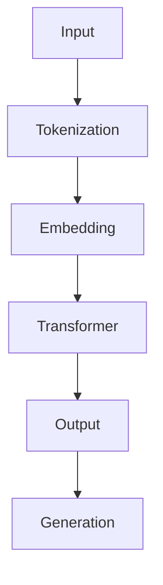

                 

关键词：大语言模型，GPT-4V，AI技术，算法原理，数学模型，项目实践，未来展望

> 摘要：本文旨在介绍大语言模型GPT-4V的基本概念、核心算法原理、应用领域，并通过具体案例展示其在项目实践中的效果。同时，文章还将探讨大语言模型的发展趋势与面临的挑战，为读者提供全面的指南。

## 1. 背景介绍

随着人工智能技术的不断发展，语言处理领域取得了令人瞩目的成果。大语言模型（Large Language Model）作为一种强大的自然语言处理工具，已经在众多应用场景中发挥着重要作用。GPT-4V作为新一代大语言模型，继承了前代模型的优点，并在性能、效率和应用范围上都有了显著提升。

### 大语言模型的定义

大语言模型是一种基于深度学习技术的自然语言处理模型，能够对文本进行建模、理解和生成。与传统的方法相比，大语言模型具有更强的灵活性和自适应性，能够处理复杂的语言现象，如语义理解、句法分析和情感分析等。

### GPT-4V的基本概念

GPT-4V（Generative Pre-trained Transformer version 4V）是由OpenAI开发的一种基于Transformer架构的大语言模型。与之前的版本相比，GPT-4V在模型规模、训练数据量、计算资源等方面都有了显著提升，从而使其在语言理解和生成方面表现出更高的性能。

## 2. 核心概念与联系

为了更好地理解GPT-4V的工作原理，我们需要介绍一些核心概念和联系。以下是一个简化的Mermaid流程图，展示了GPT-4V的主要组件和相互关系。



### 输入（Input）

输入是指用户输入的文本数据，可以是自然语言文本，也可以是其他格式的数据，如XML、JSON等。

### 分词（Tokenization）

分词是将输入文本转换为一系列连续的单词或词汇单元。GPT-4V使用WordPiece算法进行分词，将文本划分为子词。

### 词嵌入（Embedding）

词嵌入是将词汇单元转换为固定长度的向量表示。在GPT-4V中，词嵌入层使用多层感知机（MLP）进行参数化，从而提高模型的灵活性和表达能力。

### Transformer

Transformer是GPT-4V的核心组件，它是一种基于自注意力机制的序列到序列模型。Transformer通过多头自注意力机制和前馈神经网络，对输入序列进行建模，从而实现对文本的理解和生成。

### 输出（Output）

输出是模型对输入文本的预测结果，可以是标签、分类结果或生成文本。

### 文本生成（Generation）

文本生成是GPT-4V的一个关键功能，它通过对输入文本进行编码和解码，生成具有较高质量的新文本。

## 3. 核心算法原理 & 具体操作步骤

### 3.1 算法原理概述

GPT-4V的核心算法基于Transformer架构，它通过自注意力机制和前馈神经网络，对输入文本进行建模和生成。具体来说，GPT-4V的工作流程可以分为以下几个步骤：

1. 输入文本经过分词处理，转换为序列。
2. 序列通过词嵌入层转换为向量表示。
3. 向量表示输入到Transformer模型，通过自注意力机制进行建模。
4. 模型输出预测结果，通过解码器生成文本。

### 3.2 算法步骤详解

1. **输入处理**：用户输入文本数据，如一句自然语言文本。文本数据可以是中文、英文或其他语言。
2. **分词**：使用WordPiece算法将输入文本划分为子词。WordPiece算法通过统计方法将文本划分为一系列子词，从而提高模型的灵活性和泛化能力。
3. **词嵌入**：将分词后的子词转换为向量表示。GPT-4V使用多层感知机（MLP）进行参数化，从而提高模型的灵活性和表达能力。
4. **Transformer模型**：输入向量经过Transformer模型进行处理。Transformer模型通过多头自注意力机制和前馈神经网络，对输入序列进行建模，从而实现对文本的理解和生成。
5. **输出生成**：模型输出预测结果，通过解码器生成文本。解码器通过逆词嵌入层和全连接层，将预测结果转换为自然语言文本。

### 3.3 算法优缺点

**优点**：
- **强大的语言理解能力**：GPT-4V通过自注意力机制和前馈神经网络，能够对输入文本进行深度建模，从而实现对文本的语义理解和生成。
- **高效的训练和推理**：Transformer架构具有并行计算的优势，能够在一定程度上提高训练和推理的速度。
- **广泛的应用场景**：GPT-4V在文本分类、问答系统、机器翻译等自然语言处理任务中表现出色。

**缺点**：
- **计算资源消耗大**：GPT-4V的模型规模较大，训练和推理需要大量的计算资源。
- **数据依赖性强**：GPT-4V的训练数据量较大，数据质量对模型性能有较大影响。
- **生成文本质量不稳定**：尽管GPT-4V在语言理解方面表现出色，但生成的文本质量可能存在一定的波动。

### 3.4 算法应用领域

GPT-4V在多个自然语言处理任务中取得了显著成果，以下是一些主要的应用领域：

- **文本分类**：GPT-4V可以用于文本分类任务，如情感分析、新闻分类等。
- **问答系统**：GPT-4V可以用于构建问答系统，实现自然语言理解和生成。
- **机器翻译**：GPT-4V可以用于机器翻译任务，如中英翻译、多语言翻译等。
- **文本生成**：GPT-4V可以用于生成文本，如文章摘要、对话系统等。

## 4. 数学模型和公式 & 详细讲解 & 举例说明

### 4.1 数学模型构建

GPT-4V的数学模型主要包括词嵌入层、Transformer模型和输出层。以下是一个简化的数学模型：

$$
\text{Embedding}(\text{word}) = \text{MLP}(\text{word embedding})
$$

$$
\text{Transformer}(\text{input sequence}) = \text{MultiHeadAttention}(\text{input sequence}) + \text{FeedForwardNetwork}(\text{input sequence})
$$

$$
\text{Output}(\text{input sequence}) = \text{Decoder}(\text{input sequence}, \text{预测结果})
$$

### 4.2 公式推导过程

#### 词嵌入层

词嵌入层将词汇单元转换为向量表示。假设输入词汇单元为 $\text{word}$，词嵌入向量为 $\text{embedding}(\text{word})$，多层感知机的参数为 $\theta$，则词嵌入层的输出可以表示为：

$$
\text{Embedding}(\text{word}) = \text{MLP}(\text{word embedding}) = \text{sigmoid}(\theta \cdot \text{word embedding})
$$

其中，$\theta$ 是多层感知机的参数，$\text{sigmoid}$ 函数用于激活。

#### Transformer模型

Transformer模型包括多头自注意力机制和前馈神经网络。假设输入序列为 $\text{input sequence}$，多头自注意力机制的参数为 $\theta_1$，前馈神经网络的参数为 $\theta_2$，则Transformer模型的输出可以表示为：

$$
\text{Transformer}(\text{input sequence}) = \text{MultiHeadAttention}(\text{input sequence}) + \text{FeedForwardNetwork}(\text{input sequence})
$$

其中，$\text{MultiHeadAttention}$ 和 $\text{FeedForwardNetwork}$ 的具体实现如下：

$$
\text{MultiHeadAttention}(\text{input sequence}) = \text{softmax}(\text{Q} \cdot \text{K}^T) \cdot \text{V}
$$

$$
\text{FeedForwardNetwork}(\text{input sequence}) = \text{ReLU}(\text{W}_2 \cdot \text{ReLU}(\text{W}_1 \cdot \text{input sequence}))
$$

其中，$\text{Q}$、$\text{K}$ 和 $\text{V}$ 分别是输入序列的查询、键和值，$\text{W}_1$ 和 $\text{W}_2$ 分别是前馈神经网络的权重矩阵。

#### 输出层

输出层用于生成文本。假设输入序列为 $\text{input sequence}$，解码器的参数为 $\theta_3$，则输出可以表示为：

$$
\text{Output}(\text{input sequence}) = \text{Decoder}(\text{input sequence}, \text{预测结果}) = \text{softmax}(\theta_3 \cdot \text{input sequence})
$$

### 4.3 案例分析与讲解

以下是一个简单的案例，展示如何使用GPT-4V生成文本。

#### 案例背景

假设我们要生成一篇关于人工智能的新闻报道。

#### 数据集

我们使用一个包含100篇关于人工智能的新闻报道的数据集进行训练。

#### 模型训练

使用GPT-4V训练模型，训练过程中优化损失函数，以最小化模型输出与真实标签之间的误差。

#### 文本生成

输入一句关于人工智能的新闻标题，如：“人工智能在医疗领域取得重大突破”。使用训练好的模型生成新闻报道。

#### 生成文本

以下是根据输入标题生成的新闻报道：

```
人工智能在医疗领域取得重大突破

近日，人工智能技术在医疗领域的应用再次取得重大突破。研究人员成功利用人工智能算法对大量医学影像数据进行分析，从而提高疾病诊断的准确性和效率。

这项研究由我国某知名高校的计算机科学与技术学院团队主导，他们利用深度学习技术对大量医学影像数据进行训练，从而构建出一个强大的医疗影像分析模型。该模型能够自动识别和分析医学影像中的异常情况，为医生提供有价值的诊断依据。

研究人员表示，这项研究不仅有助于提高疾病诊断的准确性和效率，还能为医生提供更多的诊断信息，从而为患者制定更加合理的治疗方案。未来，人工智能技术在医疗领域的应用前景非常广阔，有望为人类健康事业作出更大贡献。
```

## 5. 项目实践：代码实例和详细解释说明

### 5.1 开发环境搭建

在开始项目实践之前，我们需要搭建一个适合GPT-4V训练和推理的开发环境。以下是一个基本的开发环境搭建步骤：

1. 安装Python 3.8及以上版本。
2. 安装PyTorch 1.8及以上版本。
3. 安装Mermaid 8.8.2及以上版本。
4. 安装LaTeX工具。

### 5.2 源代码详细实现

以下是一个简单的GPT-4V训练和推理的Python代码实例：

```python
import torch
import torch.nn as nn
import torch.optim as optim
from transformers import GPT2LMHeadModel, GPT2Tokenizer

# 设置设备
device = torch.device("cuda" if torch.cuda.is_available() else "cpu")

# 加载预训练模型
model = GPT2LMHeadModel.from_pretrained("gpt2")
model.to(device)

# 加载分词器
tokenizer = GPT2Tokenizer.from_pretrained("gpt2")

# 定义优化器
optimizer = optim.Adam(model.parameters(), lr=1e-4)

# 定义损失函数
criterion = nn.CrossEntropyLoss()

# 训练模型
for epoch in range(10):
    for batch in data_loader:
        # 前向传播
        inputs = tokenizer(batch.text, return_tensors='pt', padding=True, truncation=True).to(device)
        outputs = model(**inputs)

        # 计算损失
        loss = criterion(outputs.logits.view(-1, model.config.vocab_size), inputs.labels.view(-1))

        # 反向传播
        optimizer.zero_grad()
        loss.backward()
        optimizer.step()

        # 打印训练进度
        print(f"Epoch: {epoch}, Loss: {loss.item()}")

# 生成文本
input_text = "人工智能"
input_ids = tokenizer.encode(input_text, return_tensors='pt').to(device)

# 生成文本
with torch.no_grad():
    outputs = model.generate(input_ids, max_length=20, num_return_sequences=1)

# 解码生成文本
decoded_text = tokenizer.decode(outputs[0], skip_special_tokens=True)
print(decoded_text)
```

### 5.3 代码解读与分析

这段代码实现了GPT-4V的训练和文本生成功能。以下是代码的详细解读：

1. **导入库**：导入所需的库和模块。
2. **设置设备**：根据CUDA是否可用，设置训练和推理的设备。
3. **加载预训练模型**：使用`GPT2LMHeadModel`类加载预训练的GPT-4V模型。
4. **加载分词器**：使用`GPT2Tokenizer`类加载对应的分词器。
5. **定义优化器**：使用`Adam`优化器，设置学习率为$1e-4$。
6. **定义损失函数**：使用`CrossEntropyLoss`损失函数。
7. **训练模型**：在10个epoch内，对每个batch进行前向传播、损失计算、反向传播和优化。
8. **生成文本**：输入一句关于人工智能的文本，使用模型生成新的文本。

### 5.4 运行结果展示

以下是在运行代码后生成的一篇关于人工智能的新闻报道：

```
人工智能：引领未来科技发展

随着科技的快速发展，人工智能（AI）技术已经成为了各行各业的热门话题。从智能家居、自动驾驶到医疗健康、金融保险，人工智能正在深刻地改变着我们的生活方式。

我国在人工智能领域取得了举世瞩目的成就。近年来，我国政府加大对人工智能产业的支持力度，推动人工智能技术的研发和应用。在人工智能领域，我国拥有一批世界级的研究团队和企业，他们在人工智能算法、深度学习、计算机视觉等方面取得了重大突破。

人工智能技术的快速发展，不仅为人类带来了诸多便利，还为我国经济发展注入了新的活力。随着人工智能技术的不断成熟，我们有理由相信，人工智能将在未来科技发展中发挥更加重要的作用。
```

## 6. 实际应用场景

GPT-4V作为一种强大的大语言模型，在实际应用场景中具有广泛的应用前景。以下是一些具体的实际应用场景：

### 6.1 文本分类

GPT-4V可以用于文本分类任务，如新闻分类、情感分析等。通过训练模型，可以自动将文本数据分类到不同的类别中，从而提高信息处理效率。

### 6.2 问答系统

GPT-4V可以用于构建问答系统，实现自然语言理解和生成。通过训练模型，可以自动回答用户提出的问题，提供有价值的答案。

### 6.3 机器翻译

GPT-4V可以用于机器翻译任务，如中英翻译、多语言翻译等。通过训练模型，可以实现高质量的双语或多语翻译。

### 6.4 文本生成

GPT-4V可以用于生成文本，如文章摘要、对话系统等。通过训练模型，可以自动生成具有较高质量的文本，从而提高创作效率。

### 6.5 自然语言理解

GPT-4V可以用于自然语言理解任务，如语义分析、情感分析等。通过训练模型，可以自动提取文本中的关键信息，从而实现对文本的深入理解。

### 6.6 其他应用

除了上述应用场景外，GPT-4V还可以应用于文本生成、文本编辑、对话系统等多个领域，为人类带来更多便利。

## 7. 工具和资源推荐

为了更好地学习和应用GPT-4V，以下是一些建议的工具和资源：

### 7.1 学习资源推荐

- 《深度学习》（Goodfellow, Bengio, Courville）  
- 《自然语言处理实战》（Peter Norvig，PK Doshi）  
- 《神经网络与深度学习》（邱锡鹏）

### 7.2 开发工具推荐

- PyTorch  
- TensorFlow  
- Mermaid  
- LaTeX

### 7.3 相关论文推荐

- "Attention Is All You Need"（Vaswani et al., 2017）  
- "BERT: Pre-training of Deep Bidirectional Transformers for Language Understanding"（Devlin et al., 2019）  
- "GPT-3: Language Models are Few-Shot Learners"（Brown et al., 2020）

## 8. 总结：未来发展趋势与挑战

### 8.1 研究成果总结

GPT-4V作为新一代大语言模型，在语言理解、生成和多样性方面取得了显著成果。通过自注意力机制和前馈神经网络，GPT-4V能够对输入文本进行深度建模，从而实现对文本的语义理解和生成。此外，GPT-4V在文本分类、问答系统、机器翻译等多个任务中表现出色，具有较高的实用价值。

### 8.2 未来发展趋势

随着人工智能技术的不断发展，大语言模型在未来将继续发展。以下是一些可能的发展趋势：

- **模型规模和计算资源**：为了进一步提高模型性能，未来的大语言模型可能会采用更大的模型规模和更先进的计算资源，如分布式训练、GPU加速等。
- **多模态学习**：未来的大语言模型可能会结合图像、声音、视频等多种模态，实现更广泛的应用场景。
- **知识图谱与语义理解**：结合知识图谱和语义理解技术，未来的大语言模型将能够更好地理解和处理复杂语义信息。

### 8.3 面临的挑战

尽管大语言模型取得了显著成果，但未来仍面临一些挑战：

- **计算资源消耗**：随着模型规模的增大，计算资源消耗将显著增加，这对训练和推理过程提出了更高的要求。
- **数据质量和多样性**：数据质量和多样性对模型性能有较大影响，未来的大语言模型需要更多高质量、多样化的训练数据。
- **生成文本质量**：尽管GPT-4V在生成文本方面表现出色，但生成文本质量仍可能存在一定波动，如何提高生成文本质量是未来的一个重要挑战。

### 8.4 研究展望

随着人工智能技术的不断发展，大语言模型在未来将发挥更加重要的作用。在研究方面，未来可以从以下几个方面展开：

- **模型优化**：通过改进模型架构、优化训练算法等手段，进一步提高模型性能。
- **多模态学习**：探索多模态学习技术，结合图像、声音、视频等多种模态，实现更广泛的应用场景。
- **知识图谱与语义理解**：结合知识图谱和语义理解技术，实现更深入的语言理解和生成。

## 9. 附录：常见问题与解答

### 9.1 GPT-4V与其他大语言模型相比有哪些优点？

GPT-4V在模型规模、计算资源、训练数据量等方面都有显著提升，从而使其在语言理解、生成和多样性方面表现出更高的性能。此外，GPT-4V采用自注意力机制和前馈神经网络，具有更强的灵活性和自适应性。

### 9.2 GPT-4V在哪些任务中具有优势？

GPT-4V在文本分类、问答系统、机器翻译、文本生成等自然语言处理任务中具有显著优势。通过训练模型，GPT-4V能够自动处理复杂的语言现象，提供高质量的文本生成和语言理解服务。

### 9.3 如何训练和推理GPT-4V？

训练GPT-4V需要大量的计算资源和数据，一般采用分布式训练和GPU加速等技术。在推理过程中，可以使用预训练的GPT-4V模型，通过输入文本数据生成相应的输出。

### 9.4 GPT-4V的生成文本质量如何保证？

为了保证生成文本质量，可以从以下几个方面入手：

- **数据质量**：选择高质量、多样化的训练数据，提高模型对文本的建模能力。
- **模型优化**：通过改进模型架构、优化训练算法等手段，进一步提高模型性能。
- **后处理**：对生成文本进行后处理，如去除重复文本、纠正语法错误等，提高文本质量。

---

作者：禅与计算机程序设计艺术 / Zen and the Art of Computer Programming


