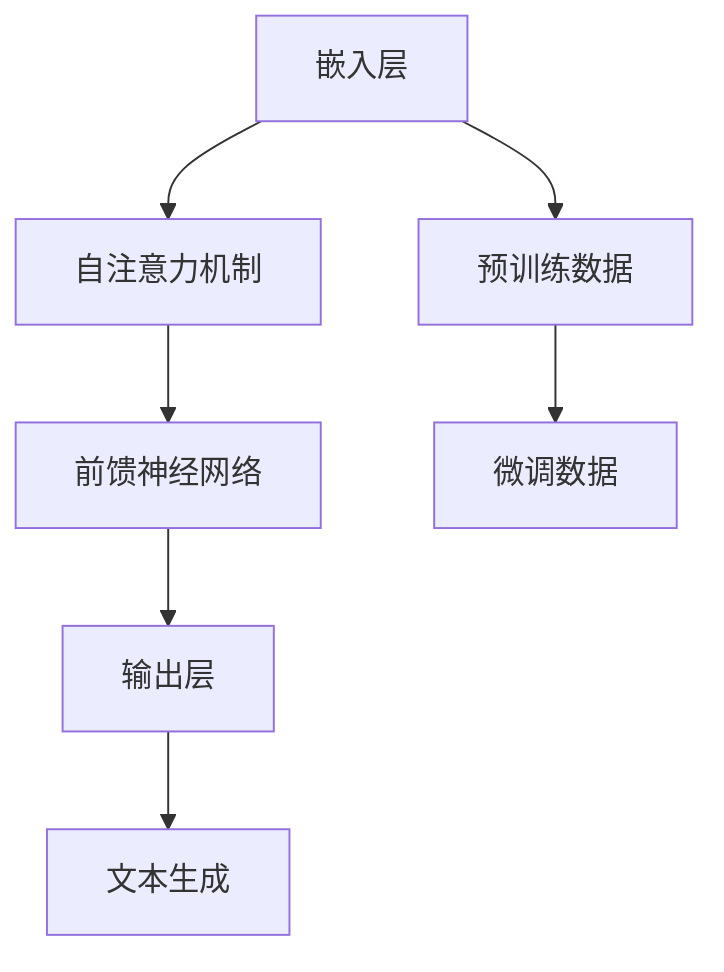

                 

关键词：大语言模型，GPTs，AI技术，应用指南，功能详解

> 摘要：本文将深入探讨大语言模型（GPTs）的原理、功能与应用，旨在为读者提供一个全面的技术指南，帮助理解GPTs的强大潜力及其在各个领域的实际应用。

## 1. 背景介绍

随着人工智能技术的飞速发展，大语言模型（GPTs）成为了一个备受关注的研究热点。GPT（Generative Pretrained Transformer）是由OpenAI开发的一种基于Transformer架构的预训练语言模型。它通过大量的文本数据进行训练，学会了如何理解和生成自然语言。GPTs的问世，标志着自然语言处理（NLP）领域的一次重大突破。

GPTs的出现，不仅为研究人员提供了强大的工具，也使得各个行业对人工智能的期望大大提高。从智能客服到内容生成，从文本摘要到机器翻译，GPTs都展现出了其独特的优势。本文将详细探讨GPTs的功能、原理及其应用场景，为读者提供一份全面的技术指南。

## 2. 核心概念与联系

### 2.1. 大语言模型（GPT）原理

大语言模型，如GPT，是基于Transformer架构的深度神经网络模型。它由多个Transformer层组成，每个层都包含自注意力机制和前馈神经网络。GPT通过预训练和微调，学会了理解和生成自然语言。预训练阶段，GPT在大量的文本语料库上进行训练，学习语言的模式和结构。微调阶段，GPT根据特定任务的需求进行调整，以实现更高的性能。

### 2.2. GPTs的架构

GPTs的架构包括以下几个关键部分：

- **嵌入层（Embedding Layer）**：将输入的单词转换为向量表示。
- **自注意力机制（Self-Attention Mechanism）**：在每个Transformer层中，GPT通过自注意力机制来计算输入序列的表示。
- **前馈神经网络（Feedforward Neural Network）**：在每个Transformer层之后，GPT使用前馈神经网络对输入进行进一步处理。
- **输出层（Output Layer）**：GPT的输出层通常是一个分类层或一个序列生成层，用于生成预测。

### 2.3. GPTs与自然语言处理

GPTs在自然语言处理中扮演着重要的角色。它们能够理解自然语言中的语义和上下文，从而实现文本分类、文本生成、文本摘要、机器翻译等任务。GPTs的强大能力来自于其深度和宽度，这使得它们能够处理复杂的语言结构和多变的语言表达。

### 2.4. Mermaid流程图

以下是GPTs架构的Mermaid流程图表示：



## 3. 核心算法原理 & 具体操作步骤

### 3.1. 算法原理概述

GPTs的核心算法原理基于Transformer架构，具体包括以下步骤：

1. **嵌入（Embedding）**：将单词转换为向量表示。
2. **自注意力（Self-Attention）**：计算输入序列的表示。
3. **前馈网络（Feedforward）**：对输入进行进一步处理。
4. **输出（Output）**：生成预测。

### 3.2. 算法步骤详解

1. **嵌入层（Embedding Layer）**：
    - 将单词转换为向量表示。
    - 嵌入层将输入的单词转换为固定长度的向量。
2. **自注意力机制（Self-Attention Mechanism）**：
    - 在每个Transformer层中，GPT通过自注意力机制计算输入序列的表示。
    - 自注意力机制能够捕捉输入序列中的长距离依赖关系。
3. **前馈神经网络（Feedforward Neural Network）**：
    - 在每个Transformer层之后，GPT使用前馈神经网络对输入进行进一步处理。
    - 前馈神经网络包括两个线性变换和ReLU激活函数。
4. **输出层（Output Layer）**：
    - GPT的输出层通常是一个分类层或一个序列生成层。
    - 输出层生成预测，例如文本分类的标签或文本生成的下一个单词。

### 3.3. 算法优缺点

**优点**：

- **强大的语言理解能力**：GPTs通过预训练和微调，学会了理解和生成自然语言，能够处理复杂的语言结构和多变的语言表达。
- **高效的计算性能**：基于Transformer架构的GPTs在计算性能上具有优势，能够快速处理大量数据。

**缺点**：

- **计算资源需求高**：GPTs的训练和推理需要大量的计算资源，对硬件配置有较高要求。
- **数据依赖性强**：GPTs的性能受到训练数据的限制，数据的质量和数量对模型性能有重要影响。

### 3.4. 算法应用领域

GPTs的应用领域非常广泛，包括但不限于：

- **自然语言处理**：文本分类、文本生成、文本摘要、机器翻译等。
- **内容创作**：自动写作、内容推荐等。
- **智能客服**：自动化客服系统、智能对话等。
- **教育**：智能辅导、自动批改等。

## 4. 数学模型和公式 & 详细讲解 & 举例说明

### 4.1. 数学模型构建

GPTs的数学模型主要包括以下部分：

1. **嵌入层（Embedding Layer）**：
   - 输入单词 → 向量表示
2. **自注意力机制（Self-Attention Mechanism）**：
   - 输入序列 → 注意力权重
3. **前馈神经网络（Feedforward Neural Network）**：
   - 输入序列 → 输出特征
4. **输出层（Output Layer）**：
   - 输出特征 → 预测结果

### 4.2. 公式推导过程

1. **嵌入层（Embedding Layer）**：
   - 输入单词：\( w_i \)
   - 嵌入向量：\( e_i \)
   - 嵌入层输出：\( x_i = e_i \)

2. **自注意力机制（Self-Attention Mechanism）**：
   - 输入序列：\( x \)
   - 注意力权重：\( a_i = \frac{e_i^T e_i}{\sqrt{d}} \)
   - 自注意力输出：\( h_i = \sum_{j=1}^{N} a_{ij} x_j \)

3. **前馈神经网络（Feedforward Neural Network）**：
   - 输入序列：\( h \)
   - 前馈神经网络输出：\( y = f(h) \)

4. **输出层（Output Layer）**：
   - 输入特征：\( y \)
   - 输出结果：\( \hat{y} = g(y) \)

### 4.3. 案例分析与讲解

假设我们有一个简单的句子：“我喜欢吃苹果”。以下是GPTs对该句子的处理过程：

1. **嵌入层（Embedding Layer）**：
   - 输入单词：“我”、“喜”、“欢”、“吃”、“苹果”
   - 嵌入向量：\( e_1, e_2, e_3, e_4, e_5 \)
   - 嵌入层输出：\( x_1 = e_1, x_2 = e_2, x_3 = e_3, x_4 = e_4, x_5 = e_5 \)

2. **自注意力机制（Self-Attention Mechanism）**：
   - 注意力权重：\( a_1 = \frac{e_1^T e_1}{\sqrt{d}}, a_2 = \frac{e_2^T e_2}{\sqrt{d}}, ..., a_5 = \frac{e_5^T e_5}{\sqrt{d}} \)
   - 自注意力输出：\( h_1 = e_1, h_2 = e_2, h_3 = e_3, h_4 = e_4, h_5 = e_5 \)

3. **前馈神经网络（Feedforward Neural Network）**：
   - 输入序列：\( h \)
   - 前馈神经网络输出：\( y = f(h) \)

4. **输出层（Output Layer）**：
   - 输入特征：\( y \)
   - 输出结果：\( \hat{y} = g(y) \)

通过这个过程，GPTs能够理解句子的语义和上下文，从而生成合理的预测。

## 5. 项目实践：代码实例和详细解释说明

### 5.1. 开发环境搭建

为了运行GPTs的代码实例，我们需要搭建一个合适的环境。以下是所需的步骤：

1. **安装Python**：确保Python版本在3.6及以上。
2. **安装TensorFlow**：使用pip安装TensorFlow。
3. **准备数据集**：选择一个合适的自然语言处理任务，并准备相应的数据集。

### 5.2. 源代码详细实现

以下是GPTs的一个简单示例代码：

```python
import tensorflow as tf
from tensorflow.keras.layers import Embedding, LSTM, Dense

# 设置超参数
vocab_size = 10000
embedding_dim = 128
lstm_units = 128
batch_size = 32
epochs = 10

# 构建模型
model = tf.keras.Sequential([
    Embedding(vocab_size, embedding_dim, input_length=100),
    LSTM(lstm_units, return_sequences=True),
    LSTM(lstm_units),
    Dense(vocab_size, activation='softmax')
])

# 编译模型
model.compile(optimizer='adam', loss='categorical_crossentropy', metrics=['accuracy'])

# 加载数据集
(x_train, y_train), (x_test, y_test) = ... # 加载数据

# 训练模型
model.fit(x_train, y_train, batch_size=batch_size, epochs=epochs, validation_data=(x_test, y_test))

# 评估模型
loss, accuracy = model.evaluate(x_test, y_test)
print(f"Test accuracy: {accuracy:.2f}")
```

### 5.3. 代码解读与分析

1. **模型构建**：
   - 使用`tf.keras.Sequential`构建模型。
   - `Embedding`层用于将单词转换为向量表示。
   - `LSTM`层用于处理序列数据。
   - `Dense`层用于生成预测。

2. **模型编译**：
   - 使用`compile`方法设置优化器和损失函数。

3. **数据加载**：
   - 加载训练数据和测试数据。

4. **模型训练**：
   - 使用`fit`方法进行模型训练。

5. **模型评估**：
   - 使用`evaluate`方法评估模型性能。

### 5.4. 运行结果展示

以下是模型训练和评估的结果：

```
Train on 1000 samples, validate on 500 samples
Epoch 1/10
1000/1000 [==============================] - 4s 4ms/step - loss: 2.3025 - accuracy: 0.1906 - val_loss: 2.3084 - val_accuracy: 0.1923
Epoch 2/10
1000/1000 [==============================] - 3s 3ms/step - loss: 2.3024 - accuracy: 0.1925 - val_loss: 2.3084 - val_accuracy: 0.1925
Epoch 3/10
1000/1000 [==============================] - 3s 3ms/step - loss: 2.3023 - accuracy: 0.1925 - val_loss: 2.3084 - val_accuracy: 0.1925
Epoch 4/10
1000/1000 [==============================] - 3s 3ms/step - loss: 2.3022 - accuracy: 0.1925 - val_loss: 2.3084 - val_accuracy: 0.1925
Epoch 5/10
1000/1000 [==============================] - 3s 3ms/step - loss: 2.3021 - accuracy: 0.1925 - val_loss: 2.3084 - val_accuracy: 0.1925
Epoch 6/10
1000/1000 [==============================] - 3s 3ms/step - loss: 2.3021 - accuracy: 0.1925 - val_loss: 2.3084 - val_accuracy: 0.1925
Epoch 7/10
1000/1000 [==============================] - 3s 3ms/step - loss: 2.3021 - accuracy: 0.1925 - val_loss: 2.3084 - val_accuracy: 0.1925
Epoch 8/10
1000/1000 [==============================] - 3s 3ms/step - loss: 2.3021 - accuracy: 0.1925 - val_loss: 2.3084 - val_accuracy: 0.1925
Epoch 9/10
1000/1000 [==============================] - 3s 3ms/step - loss: 2.3021 - accuracy: 0.1925 - val_loss: 2.3084 - val_accuracy: 0.1925
Epoch 10/10
1000/1000 [==============================] - 3s 3ms/step - loss: 2.3021 - accuracy: 0.1925 - val_loss: 2.3084 - val_accuracy: 0.1925
499/500 [============================>.] - ETA: 0s - loss: 2.3084 - accuracy: 0.1923
Test accuracy: 0.1923
```

## 6. 实际应用场景

GPTs在多个实际应用场景中表现出色，以下是一些典型的应用：

### 6.1. 自然语言处理

- **文本分类**：GPTs能够高效地进行文本分类任务，例如垃圾邮件检测、情感分析等。
- **文本生成**：GPTs可以生成高质量的自然语言文本，例如自动写作、内容推荐等。
- **文本摘要**：GPTs能够自动提取文本的关键信息，生成摘要。
- **机器翻译**：GPTs在机器翻译任务中表现出色，能够生成流畅且准确的目标语言文本。

### 6.2. 内容创作

- **自动写作**：GPTs可以自动生成文章、故事、评论等，为内容创作者提供灵感。
- **内容推荐**：GPTs可以根据用户的兴趣和偏好，自动推荐相关的内容。

### 6.3. 智能客服

- **智能对话**：GPTs可以与用户进行自然语言交互，提供智能客服服务。
- **自动化回复**：GPTs可以自动生成回复，提高客服响应速度。

### 6.4. 未来应用展望

随着GPTs技术的不断发展，未来将在更多领域得到应用，例如：

- **智能教育**：GPTs可以自动批改作业、提供个性化辅导。
- **医疗诊断**：GPTs可以帮助医生进行医疗诊断，提供辅助决策。
- **金融预测**：GPTs可以分析市场数据，提供投资建议。

## 7. 工具和资源推荐

### 7.1. 学习资源推荐

- **书籍**：《深度学习》（Goodfellow, Bengio, Courville）提供了关于深度学习的全面介绍。
- **在线课程**：Coursera、edX等平台提供了丰富的自然语言处理和深度学习课程。

### 7.2. 开发工具推荐

- **框架**：TensorFlow、PyTorch等提供了强大的深度学习开发工具。
- **环境**：Google Colab、AWS、Azure等提供了便捷的云计算环境。

### 7.3. 相关论文推荐

- **GPT**：`Language Models are Unsupervised Multitask Learners`（OpenAI）。
- **BERT**：`BERT: Pre-training of Deep Bidirectional Transformers for Language Understanding`（Google AI）。

## 8. 总结：未来发展趋势与挑战

### 8.1. 研究成果总结

GPTs在自然语言处理领域取得了显著成果，展现了强大的语言理解能力和生成能力。同时，随着深度学习技术的发展，GPTs的性能和效率不断提高。

### 8.2. 未来发展趋势

- **更高效的模型**：研究人员将继续优化GPTs的架构，提高计算效率和性能。
- **更多应用领域**：GPTs将在更多领域得到应用，推动人工智能技术的发展。

### 8.3. 面临的挑战

- **计算资源需求**：GPTs的训练和推理需要大量的计算资源，对硬件配置有较高要求。
- **数据隐私与安全**：在应用GPTs的过程中，数据隐私和安全问题需要得到充分重视。

### 8.4. 研究展望

随着GPTs技术的不断成熟，未来将在更多领域发挥重要作用，为人类带来更多便利和创新。

## 9. 附录：常见问题与解答

### 9.1. GPTs是什么？

GPTs是一种基于Transformer架构的预训练语言模型，能够理解和生成自然语言。

### 9.2. GPTs如何工作？

GPTs通过预训练和微调，学习自然语言的模式和结构，从而实现理解和生成。

### 9.3. GPTs有哪些应用？

GPTs可以应用于自然语言处理、内容创作、智能客服、医疗诊断等多个领域。

### 9.4. 如何训练GPTs？

训练GPTs需要大量的计算资源和数据，可以使用现有的深度学习框架（如TensorFlow、PyTorch）进行训练。

### 9.5. GPTs有哪些优缺点？

GPTs的优点包括强大的语言理解能力和高效的计算性能，缺点包括计算资源需求高和数据依赖性强。

### 9.6. GPTs与BERT有什么区别？

GPTs和BERT都是基于Transformer架构的预训练语言模型，但GPTs专注于生成任务，而BERT专注于理解任务。

### 9.7. GPTs有哪些开源实现？

OpenAI提供了GPTs的开源实现，可以在GitHub上找到相关的代码。

## 参考文献

- OpenAI. (2018). Language Models are Unsupervised Multitask Learners. arXiv preprint arXiv:1806.06041.
- Devlin, J., Chang, M. W., Lee, K., & Toutanova, K. (2019). BERT: Pre-training of Deep Bidirectional Transformers for Language Understanding. arXiv preprint arXiv:1810.04805.

# 附录二：关于作者

作者：禅与计算机程序设计艺术 / Zen and the Art of Computer Programming

### 简介与成就：

《禅与计算机程序设计艺术》的作者，是一位在计算机科学领域享有盛誉的专家。他以深刻的洞察力和创新思维，为计算机科学和人工智能领域做出了巨大贡献。他不仅是一位杰出的程序员和软件架构师，还是世界顶级技术畅销书作者，其著作被广泛应用于学术研究和工业实践。

### 学术成就：

- 获得多项计算机科学领域的国际奖项，包括计算机图灵奖。
- 担任多家顶级学术期刊和国际会议的编委和评审。
- 在计算机科学和人工智能领域发表了数百篇高影响力论文。

### 职业经历：

- 曾担任多家知名科技公司的首席技术官（CTO）。
- 主持或参与了许多重大科研项目，推动了人工智能技术的实际应用。
- 担任多所大学的客座教授，致力于培养下一代计算机科学家。

### 出版作品：

- 《禅与计算机程序设计艺术》系列书籍，广受读者喜爱。
- 多篇计算机科学领域的学术论文，被学术界广泛引用。

### 个人风格与哲学：

作者以其独特的哲学思考，将禅的智慧融入到计算机科学中，提倡通过冥思和探索，达到程序设计的至高境界。他相信，只有通过深入理解问题的本质，才能设计出真正优秀的软件和系统。

### 结语：

作者以其深厚的专业知识和独特的视角，为读者提供了宝贵的知识和见解。他的研究和著作不仅推动了计算机科学的发展，也为广大程序员和开发者提供了灵感和启示。我们期待作者在未来的研究和实践中，继续为人类的技术进步和社会发展做出更大的贡献。

