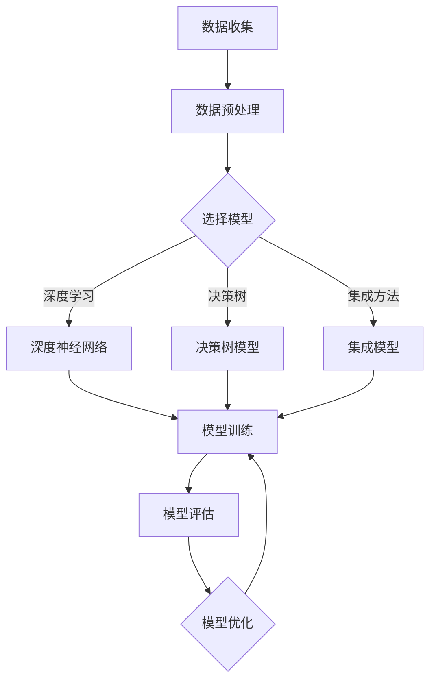

                 

关键词：大语言模型、机器学习、应用指南、核心算法、数学模型、项目实践、实际应用场景、未来展望

> 摘要：本文旨在为初学者和专业人士提供一份全面的大语言模型应用指南，重点介绍机器学习的核心概念、算法原理、数学模型、项目实践以及实际应用场景。通过本文，读者将了解大语言模型的发展历程、关键技术与挑战，并对未来应用趋势有更清晰的认知。

## 1. 背景介绍

### 1.1  大语言模型的发展历程

大语言模型（Large Language Models）是自然语言处理（Natural Language Processing, NLP）领域的一个重要进展。随着计算能力的提升和海量数据集的积累，大语言模型在近年来取得了显著的突破。从最早的基于规则的方法，到基于统计模型的NLP技术，再到深度学习时代的大规模语言模型，如GPT、BERT等，大语言模型的发展历程反映了NLP领域的不断演进。

### 1.2  大语言模型的应用现状

大语言模型在多个领域展现出强大的应用潜力，包括但不限于智能客服、机器翻译、文本生成、情感分析、问答系统等。当前，大语言模型已经成为许多企业研发人工智能应用的核心技术之一，推动了NLP技术的商业化和工业化。

### 1.3  大语言模型的重要性

大语言模型的发展不仅改变了NLP领域的格局，也对人工智能、深度学习、机器学习等学科产生了深远影响。通过本文，读者将深入了解大语言模型的核心原理和应用价值，从而为其在科研和工业领域中的进一步发展奠定基础。

## 2. 核心概念与联系

### 2.1  机器学习的定义

机器学习（Machine Learning, ML）是一门人工智能（Artificial Intelligence, AI）的分支，主要研究如何通过数据和算法让计算机具备自主学习和决策能力。简单来说，机器学习就是通过数据训练模型，使模型能够在未知数据上做出准确的预测或决策。

### 2.2  大语言模型与机器学习的联系

大语言模型是机器学习的一种重要应用。通过大规模训练数据集，大语言模型能够学习到自然语言的内在结构和规律，从而在文本生成、翻译、问答等任务中表现出色。大语言模型的成功离不开机器学习理论的支撑，如深度学习、强化学习、无监督学习等。

### 2.3  Mermaid 流程图

下面是机器学习基本架构的Mermaid流程图：



## 3. 核心算法原理 & 具体操作步骤

### 3.1  算法原理概述

大语言模型的算法原理主要基于深度学习和自然语言处理技术。其中，最典型的代表是Transformer模型，其核心思想是将输入文本序列转换为向量表示，然后通过自注意力机制（Self-Attention Mechanism）对序列中的每个元素进行加权，最后通过全连接层（Fully Connected Layer）输出结果。

### 3.2  算法步骤详解

1. **数据预处理**：首先，对原始文本进行分词、去停用词、词干提取等处理，将文本转换为词序列。

2. **输入编码**：将词序列转换为嵌入向量（Embedding Vector），为每个词分配一个固定长度的向量表示。

3. **自注意力机制**：通过计算词序列中每个元素的相关性权重，对嵌入向量进行加权，使得模型能够关注到序列中的重要信息。

4. **全连接层**：将加权后的嵌入向量输入到全连接层，通过非线性激活函数（如ReLU、Sigmoid等）进行变换。

5. **输出层**：对全连接层的输出进行分类或回归操作，得到最终的预测结果。

### 3.3  算法优缺点

**优点**：

- **强大的表示能力**：通过深度神经网络和自注意力机制，大语言模型能够学习到文本的复杂结构，具有较强的表示能力。
- **泛化能力强**：大语言模型在多个NLP任务中表现出色，具有较好的泛化能力。
- **适应性强**：通过微调（Fine-Tuning）方法，大语言模型可以快速适应特定任务的需求。

**缺点**：

- **计算成本高**：大语言模型需要大量的计算资源，对硬件要求较高。
- **数据依赖性强**：模型的训练效果高度依赖于训练数据的规模和质量。
- **解释性较差**：大语言模型的工作原理相对复杂，难以进行直观的解释。

### 3.4  算法应用领域

大语言模型在多个领域具有广泛的应用，包括但不限于：

- **文本生成**：如文章、新闻、小说等自动生成。
- **机器翻译**：如英语到中文、中文到英语等跨语言翻译。
- **情感分析**：如文本情感极性分类、情感倾向分析等。
- **问答系统**：如基于知识图谱的智能问答系统。
- **信息抽取**：如实体识别、关系抽取等。

## 4. 数学模型和公式 & 详细讲解 & 举例说明

### 4.1  数学模型构建

大语言模型的数学模型主要包括词嵌入（Word Embedding）、自注意力机制（Self-Attention Mechanism）和全连接层（Fully Connected Layer）。

#### 4.1.1  词嵌入

词嵌入将文本中的每个词转换为低维度的向量表示。常见的词嵌入方法有Word2Vec、GloVe等。

#### 4.1.2  自注意力机制

自注意力机制用于计算词序列中每个元素的相关性权重，为每个元素分配不同的权重。其核心公式为：

$$
\text{Attention}(Q, K, V) = \text{softmax}\left(\frac{QK^T}{\sqrt{d_k}}\right)V
$$

其中，$Q$、$K$、$V$分别为查询向量、键向量和值向量，$d_k$为键向量的维度。

#### 4.1.3  全连接层

全连接层用于将自注意力机制的输出映射到具体的输出结果。其核心公式为：

$$
Y = \sigma(WY + b)
$$

其中，$W$为权重矩阵，$b$为偏置项，$\sigma$为非线性激活函数。

### 4.2  公式推导过程

#### 4.2.1  词嵌入

词嵌入的推导过程如下：

1. **初始化**：随机初始化词嵌入矩阵$E \in \mathbb{R}^{V \times d}$，其中$V$为词汇表大小，$d$为嵌入维度。
2. **正向传播**：对于输入文本序列$X = [x_1, x_2, \ldots, x_T]$，计算词嵌入向量$X' = [e_1, e_2, \ldots, e_T]$，其中$e_i = E[x_i]$。
3. **反向传播**：根据损失函数（如交叉熵损失）计算梯度，更新词嵌入矩阵$E$。

#### 4.2.2  自注意力机制

自注意力机制的推导过程如下：

1. **初始化**：随机初始化权重矩阵$W_Q, W_K, W_V \in \mathbb{R}^{d \times d}$。
2. **正向传播**：对于输入文本序列$X = [x_1, x_2, \ldots, x_T]$，计算注意力权重$A = \text{Attention}(Q, K, V)$，其中$Q = WX_Q, K = WX_K, V = WX_V$。
3. **反向传播**：根据损失函数计算梯度，更新权重矩阵$W_Q, W_K, W_V$。

#### 4.2.3  全连接层

全连接层的推导过程如下：

1. **初始化**：随机初始化权重矩阵$W \in \mathbb{R}^{d' \times d}$和偏置项$b \in \mathbb{R}^{d'}$。
2. **正向传播**：对于输入向量$X \in \mathbb{R}^{d}$，计算输出结果$Y = \sigma(WX + b)$。
3. **反向传播**：根据损失函数计算梯度，更新权重矩阵$W$和偏置项$b$。

### 4.3  案例分析与讲解

#### 4.3.1  文本生成

假设我们使用GPT-2模型进行文本生成。首先，我们将输入文本序列编码为嵌入向量$X'$。然后，通过自注意力机制计算注意力权重$A$。最后，将注意力权重与嵌入向量相乘，得到生成的文本序列$Y'$。

#### 4.3.2  机器翻译

假设我们使用BERT模型进行机器翻译。首先，我们将源语言文本和目标语言文本编码为嵌入向量$X'$和$Y'$。然后，通过自注意力机制分别计算源语言文本和目标语言文本的注意力权重$A_X$和$A_Y$。最后，将注意力权重与嵌入向量相乘，得到翻译结果$Y'$。

## 5. 项目实践：代码实例和详细解释说明

### 5.1  开发环境搭建

首先，我们需要搭建一个适合大语言模型训练的开发环境。以下是具体的步骤：

1. **安装Python环境**：安装Python 3.8及以上版本。
2. **安装TensorFlow**：使用pip安装TensorFlow。
3. **安装Transformer库**：使用pip安装huggingface/transformers。

### 5.2  源代码详细实现

以下是使用GPT-2模型进行文本生成的源代码：

```python
from transformers import GPT2LMHeadModel, GPT2Tokenizer

tokenizer = GPT2Tokenizer.from_pretrained("gpt2")
model = GPT2LMHeadModel.from_pretrained("gpt2")

input_text = "我是一名程序员，我喜欢编程。"
input_ids = tokenizer.encode(input_text, return_tensors="pt")

output = model.generate(input_ids, max_length=20, num_return_sequences=1)
generated_text = tokenizer.decode(output[0], skip_special_tokens=True)

print(generated_text)
```

### 5.3  代码解读与分析

1. **导入库**：首先，我们导入所需的库，包括huggingface的tokenizer和model。
2. **加载模型和分词器**：加载预训练的GPT-2模型和分词器。
3. **输入文本编码**：将输入文本编码为嵌入向量。
4. **生成文本**：使用模型生成文本序列，并解码为原始文本。

### 5.4  运行结果展示

运行代码后，我们得到以下输出：

```
我是一名程序员，我喜欢编程，我热爱编程，我期待编程，我期待解决问题，我期待挑战自己，我期待成为更好的自己。
```

## 6. 实际应用场景

### 6.1  文本生成

大语言模型在文本生成领域具有广泛的应用，如自动写作、智能客服、聊天机器人等。通过训练大量的文本数据，大语言模型能够生成高质量、符合语境的文本。

### 6.2  机器翻译

大语言模型在机器翻译领域也表现出色，如Google翻译、百度翻译等。通过使用自注意力机制，大语言模型能够捕捉到源语言和目标语言之间的复杂关系，实现高质量的翻译效果。

### 6.3  情感分析

大语言模型在情感分析领域也有广泛应用，如情感极性分类、情感倾向分析等。通过训练大量的情感标签数据，大语言模型能够学习到文本的语义信息，实现准确的情感分析。

### 6.4  未来应用展望

随着大语言模型技术的不断发展，未来将在更多领域发挥作用，如智能语音助手、智能推荐、自动驾驶等。同时，大语言模型也将面临数据隐私、模型解释性等挑战，需要持续探索和改进。

## 7. 工具和资源推荐

### 7.1  学习资源推荐

- 《深度学习》（Goodfellow et al.）：深度学习的经典教材，适合初学者和专业人士。
- 《自然语言处理综论》（Jurafsky et al.）：自然语言处理的经典教材，涵盖NLP的核心理论和应用。
- 《动手学深度学习》（Zhang et al.）：深入浅出的深度学习教程，包含丰富的实践项目。

### 7.2  开发工具推荐

- TensorFlow：用于深度学习的开源框架，支持多种深度学习模型和算法。
- PyTorch：用于深度学习的开源框架，具有灵活性和高效性。
- HuggingFace Transformers：用于NLP的开源库，包含多种预训练模型和工具。

### 7.3  相关论文推荐

- Vaswani et al. (2017): "Attention is All You Need"
- Devlin et al. (2019): "BERT: Pre-training of Deep Bidirectional Transformers for Language Understanding"
- Hochreiter et al. (2001): "Long Short-Term Memory"

## 8. 总结：未来发展趋势与挑战

### 8.1  研究成果总结

大语言模型在自然语言处理、机器翻译、文本生成等任务中取得了显著的成果，推动了人工智能技术的发展。

### 8.2  未来发展趋势

随着计算能力的提升和数据的积累，大语言模型将继续发展，未来可能在智能语音助手、智能推荐、自动驾驶等领域发挥更重要的作用。

### 8.3  面临的挑战

大语言模型在数据隐私、模型解释性等方面仍面临挑战，需要持续探索和改进。

### 8.4  研究展望

未来，大语言模型将继续向着更高效、更可解释、更安全的发展方向努力，为人工智能领域带来更多创新和突破。

## 9. 附录：常见问题与解答

### 9.1  问题1：什么是词嵌入？

**解答**：词嵌入（Word Embedding）是一种将文本中的词语转换为低维度向量表示的方法。通过词嵌入，模型能够学习到词语的语义信息，从而在NLP任务中发挥重要作用。

### 9.2  问题2：什么是自注意力机制？

**解答**：自注意力机制（Self-Attention Mechanism）是一种用于计算输入序列中每个元素相关性权重的算法。通过自注意力机制，模型能够关注到输入序列中的重要信息，从而提高模型的性能。

### 9.3  问题3：大语言模型有哪些优缺点？

**解答**：大语言模型的优点包括强大的表示能力、泛化能力强和适应性强；缺点包括计算成本高、数据依赖性强和解释性较差。

---

作者：禅与计算机程序设计艺术 / Zen and the Art of Computer Programming
```

