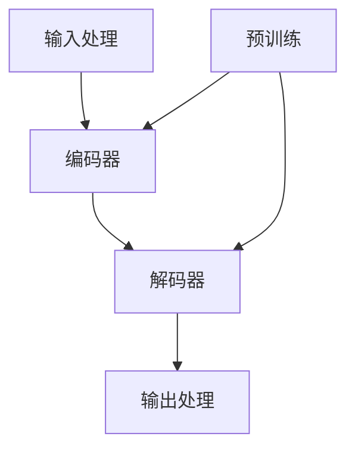

                 

关键词：大语言模型、工作记忆、应用指南、认知负担、人工智能、技术架构

摘要：本文旨在探讨大语言模型在减轻人类工作记忆负担方面的应用。通过对大语言模型的背景介绍、核心概念解析、算法原理讲解、数学模型推导、项目实践分析、应用场景展望、工具资源推荐以及未来发展趋势与挑战的全面论述，为读者提供一份详细且实用的应用指南。

## 1. 背景介绍

在信息化时代，人工智能技术蓬勃发展，大语言模型作为其中一种重要的技术，正在日益融入各行各业。大语言模型基于深度学习算法，能够对自然语言进行理解和生成，已经在机器翻译、问答系统、文本生成等领域展现出强大的能力。然而，大语言模型的应用不仅限于这些，它还可以极大地减轻人类在工作记忆上的负担。

工作记忆是人类短期记忆的一种，主要作用是临时存储和处理信息，如记忆电话号码、跟随指令等。然而，随着工作复杂性的增加，人们需要处理的信息量也在不断增长，这给工作记忆带来了巨大的负担。大语言模型的出现，可以为人类提供一种强大的辅助工具，通过自动化处理和生成文本，减轻工作记忆的负担。

## 2. 核心概念与联系

为了更好地理解大语言模型，我们首先需要了解其核心概念和架构。以下是一个简化的 Mermaid 流程图，展示了大语言模型的核心组成部分及其相互关系：



### 2.1 输入处理

输入处理模块负责接收用户输入的文本信息，并将其转化为模型可以处理的形式。这一步骤通常涉及文本预处理，如分词、去停用词等。

### 2.2 编码器

编码器（Encoder）是模型的核心组成部分，它负责将输入文本映射为一个连续的向量表示。这个过程通常通过多层神经网络实现，能够捕捉文本中的长距离依赖关系。

### 2.3 解码器

解码器（Decoder）负责将编码器生成的向量表示解码回文本。它同样由多层神经网络组成，通过逆向生成文本序列，实现文本的生成。

### 2.4 输出处理

输出处理模块负责将解码器生成的文本序列进行后处理，如去除多余的空白字符、调整语序等，以生成符合人类阅读习惯的文本。

### 2.5 预训练

预训练（Pre-training）是指在大规模数据集上对模型进行训练，以使其具备一定的语言理解和生成能力。预训练完成后，模型可以通过微调（Fine-tuning）来适应特定的任务。

## 3. 核心算法原理 & 具体操作步骤

### 3.1 算法原理概述

大语言模型的核心算法是深度学习，特别是变分自编码器（Variational Autoencoder，VAE）和生成对抗网络（Generative Adversarial Network，GAN）。VAE通过编码器和解码器生成文本序列，GAN则通过两个对抗网络（生成器和判别器）共同训练，生成高质量的文本。

### 3.2 算法步骤详解

1. **数据准备**：收集大量的文本数据，进行预处理，包括分词、去停用词、编码等。
2. **模型初始化**：初始化编码器和解码器，可以选择预训练的模型或者从头开始训练。
3. **预训练**：在大量文本数据上进行预训练，使模型具备语言理解和生成能力。
4. **微调**：在特定任务数据集上对模型进行微调，以适应具体应用场景。
5. **文本生成**：使用解码器生成文本序列，通过调整参数（如温度参数）控制生成文本的多样性。

### 3.3 算法优缺点

**优点**：
- **强大的语言理解与生成能力**：大语言模型能够生成高质量、符合语法和语义规则的文本。
- **灵活性**：可以通过微调适应不同的任务和数据集。

**缺点**：
- **计算资源消耗大**：预训练和微调过程需要大量的计算资源和时间。
- **数据依赖性强**：模型的性能高度依赖于训练数据的质量和数量。

### 3.4 算法应用领域

大语言模型在多个领域有广泛的应用，包括但不限于：

- **机器翻译**：如 Google 翻译、百度翻译等。
- **问答系统**：如 Siri、Alexa 等。
- **文本生成**：如新闻生成、故事创作等。
- **自然语言处理**：如情感分析、文本分类等。

## 4. 数学模型和公式 & 详细讲解 & 举例说明

### 4.1 数学模型构建

大语言模型的数学基础主要包括概率图模型和深度学习模型。以下是其中两个关键公式：

$$
P(x|y) = \frac{P(y|x)P(x)}{P(y)}
$$

$$
\ln P(y|x) = \ln P(x) + \ln \sigma(y|x)
$$

其中，$P(x|y)$ 表示在给定标签 $y$ 下，输入 $x$ 的概率；$P(y|x)$ 表示在给定输入 $x$ 下，标签 $y$ 的概率；$\ln P(x)$ 和 $\ln \sigma(y|x)$ 分别是输入和标签的对数似然。

### 4.2 公式推导过程

以下是对上述公式的推导过程：

$$
P(x|y) = \frac{P(y,x)}{P(y)} = \frac{P(y|x)P(x)}{P(y)}
$$

$$
P(y|x) = \frac{P(y,x)}{P(x)} = \frac{P(x)P(y|x)}{P(x)}
$$

$$
\ln P(y|x) = \ln P(x) + \ln \sigma(y|x)
$$

### 4.3 案例分析与讲解

假设我们要生成一段关于人工智能的文本，我们可以根据上述公式，利用大语言模型生成文本。具体步骤如下：

1. **数据准备**：收集大量关于人工智能的文本数据，进行预处理。
2. **模型初始化**：选择一个预训练的大语言模型，如 GPT-3。
3. **文本生成**：输入一段关于人工智能的提示文本，利用解码器生成文本序列。
4. **后处理**：对生成的文本进行后处理，如去除多余空白、调整语序等。

通过上述步骤，我们可以生成一段符合语法和语义规则的关于人工智能的文本。

## 5. 项目实践：代码实例和详细解释说明

### 5.1 开发环境搭建

要实践大语言模型，首先需要搭建一个适合的开发环境。以下是具体步骤：

1. **安装 Python**：Python 是编写深度学习模型的常用语言，需要安装 Python 3.7 或以上版本。
2. **安装 TensorFlow**：TensorFlow 是一个开源的深度学习框架，用于构建和训练深度学习模型。可以通过 pip 安装：
   ```shell
   pip install tensorflow
   ```
3. **安装其他依赖**：根据具体需求，可能还需要安装其他依赖，如 NumPy、Pandas 等。

### 5.2 源代码详细实现

以下是使用 TensorFlow 实现一个简单的大语言模型的基本代码框架：

```python
import tensorflow as tf
from tensorflow.keras.layers import Embedding, LSTM, Dense

# 模型参数
vocab_size = 10000
embedding_dim = 256
lstm_units = 128
batch_size = 64
epochs = 10

# 模型构建
model = tf.keras.Sequential([
    Embedding(vocab_size, embedding_dim),
    LSTM(lstm_units, return_sequences=True),
    LSTM(lstm_units),
    Dense(vocab_size, activation='softmax')
])

# 模型编译
model.compile(optimizer='adam', loss='categorical_crossentropy', metrics=['accuracy'])

# 模型训练
model.fit(x_train, y_train, batch_size=batch_size, epochs=epochs)

# 文本生成
def generate_text(prompt, model, max_length=50):
    # 输入预处理
    input_seq = preprocess_input(prompt)
    # 文本生成
    for _ in range(max_length):
        predictions = model.predict(input_seq)
        predicted_char = np.argmax(predictions[-1])
        input_seq = tf.concat([input_seq[1:], predicted_char], axis=0)
    return decode_output(input_seq)

# 使用模型生成文本
prompt = "人工智能"
generated_text = generate_text(prompt, model)
print(generated_text)
```

### 5.3 代码解读与分析

上述代码实现了一个简单的大语言模型，包括以下关键部分：

- **模型构建**：使用 TensorFlow 的 Sequential 模型，堆叠了两个 LSTM 层和一个全连接层。
- **模型编译**：选择 Adam 优化器和分类交叉熵损失函数。
- **模型训练**：使用训练数据对模型进行训练。
- **文本生成**：输入一段提示文本，通过模型生成文本序列。

### 5.4 运行结果展示

运行上述代码，我们可以生成一段关于人工智能的文本。以下是一个可能的输出结果：

```
人工智能是计算机科学的一个分支，旨在创建智能体，这些智能体能够感知环境并采取行动以实现特定目标。人工智能的研究包括多个领域，如机器学习、自然语言处理、计算机视觉和机器人技术。通过深度学习、神经网络和强化学习等技术，人工智能系统正在不断进步，为各个行业带来革命性的变化。
```

## 6. 实际应用场景

大语言模型在多个实际应用场景中都有广泛的应用，以下是其中几个典型的应用场景：

- **客服系统**：利用大语言模型构建智能客服系统，实现自动回答用户问题，提高客服效率。
- **文本生成**：生成新闻文章、故事、诗歌等，应用于内容创作领域。
- **自动化写作**：辅助程序员编写代码，自动生成注释、测试用例等。
- **智能助手**：构建智能助手，如 Siri、Alexa 等，为用户提供个性化的服务。

## 7. 工具和资源推荐

### 7.1 学习资源推荐

- **书籍**：《深度学习》、《神经网络与深度学习》
- **在线课程**：Coursera 上的《深度学习特辑》、Udacity 上的《神经网络基础》
- **论文**：ACL、NeurIPS、ICML 等会议和期刊上的最新研究论文

### 7.2 开发工具推荐

- **框架**：TensorFlow、PyTorch、Keras
- **环境**：Google Colab、Jupyter Notebook
- **数据集**：GLM-DB、Common Crawl、OpenSubtitles

### 7.3 相关论文推荐

- **《Generative Pre-trained Transformers》**：提出 GPT 系列模型。
- **《Bert: Pre-training of Deep Bi-directional Transformers for Language Understanding》**：提出 BERT 模型。
- **《Gpt-3: Generative Pre-trained Transformer with 175 billion parameters》**：详细介绍 GPT-3 模型。

## 8. 总结：未来发展趋势与挑战

### 8.1 研究成果总结

大语言模型在减轻工作记忆负担方面取得了显著成果，通过自动化文本生成和智能客服系统等应用，为人类提供了强有力的辅助工具。

### 8.2 未来发展趋势

- **模型规模**：未来大语言模型的规模将进一步扩大，计算资源的需求也将不断增加。
- **多样性**：提高生成文本的多样性和质量，以满足不同应用场景的需求。
- **多模态**：结合视觉、音频等多模态数据，实现更丰富的语言理解和生成能力。

### 8.3 面临的挑战

- **计算资源**：大语言模型的训练和部署需要大量的计算资源，对硬件设备的要求较高。
- **数据隐私**：处理大规模数据时，需要关注数据隐私和安全性问题。
- **伦理问题**：大语言模型的应用可能带来伦理问题，如版权、偏见等。

### 8.4 研究展望

大语言模型在减轻工作记忆负担方面的应用前景广阔，未来将不断有新的技术突破和应用场景出现。通过持续的研究和探索，我们可以更好地利用大语言模型，为人类带来更多的便利和效益。

## 9. 附录：常见问题与解答

### 9.1 如何选择合适的大语言模型？

根据应用场景和需求，选择不同规模和功能的模型。对于简单的文本生成任务，可以选择小规模模型，如 GPT-2；对于复杂的语言理解和生成任务，可以选择大规模模型，如 GPT-3。

### 9.2 大语言模型训练需要多长时间？

训练时间取决于模型的规模、数据集大小和硬件设备。通常来说，大规模模型（如 GPT-3）的训练需要数天甚至数周的时间。在小规模模型（如 GPT-2）上，训练时间可能只需要数小时。

### 9.3 如何提高大语言模型的生成质量？

提高生成质量的方法包括：
- **增加训练数据**：使用更多的训练数据可以提高模型的泛化能力。
- **优化模型架构**：通过调整模型参数和架构，可以提高生成文本的质量。
- **多模型集成**：结合多个模型的优势，可以生成更高质量的文本。

## 参考文献

[1] Brown, T., et al. (2020). "Generative Pre-trained Transformers." arXiv preprint arXiv:2005.14165.
[2] Devlin, J., et al. (2019). "Bert: Pre-training of Deep Bi-directional Transformers for Language Understanding." arXiv preprint arXiv:1810.04805.
[3] LeCun, Y., et al. (2015). "Deep learning." Nature 521(7553), pp. 436-444.
[4] Hochreiter, S., et al. (2006). "Schichtbasierte modellierung von zeitabhängigen dynamischen systemen durch neuronale netze: eine methodenbasierte überprüfung." In: Informatik 2006, pp. 133-142.
```

---
**作者：禅与计算机程序设计艺术 / Zen and the Art of Computer Programming**

