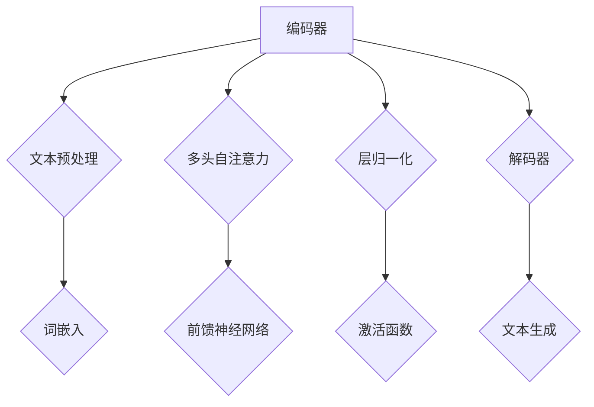

                 

关键词：大语言模型、深度学习、自然语言处理、神经网络、预训练、应用指南

> 摘要：本文将深入探讨大语言模型的基础知识，包括其定义、发展历程、核心概念以及当前应用。通过本文的阅读，读者将能够理解大语言模型的工作原理，并掌握如何将其应用于实际场景。

## 1. 背景介绍

随着信息技术的迅猛发展，自然语言处理（NLP）成为了计算机科学中的一个重要分支。从最早的规则驱动的方法，到基于统计的方法，再到目前的人工智能时代的深度学习方法，NLP的研究和应用取得了巨大的进步。在这个背景下，大语言模型（Large Language Model）应运而生。

大语言模型是指使用神经网络，尤其是深度神经网络，对大规模文本数据进行训练，从而获取语言理解能力的人工智能模型。这些模型能够理解和生成自然语言，为各种NLP任务提供强大的支持。例如，机器翻译、问答系统、文本摘要、情感分析等。

大语言模型的发展历程可以追溯到2018年，当谷歌发布了BERT（Bidirectional Encoder Representations from Transformers）模型。BERT的成功激发了研究人员对更大规模、更复杂语言模型的兴趣。随后，OpenAI发布了GPT-2，Facebook AI发布了RoBERTa，这些模型在NLP任务上取得了显著的成绩。

## 2. 核心概念与联系

### 2.1. 深度学习与神经网络

深度学习是机器学习的一个重要分支，它通过多层神经网络进行数据建模。神经网络是由大量简单单元（或神经元）组成的计算模型，这些神经元通过权重连接在一起，共同完成复杂的计算任务。


### 2.2. 自然语言处理

自然语言处理涉及计算机对自然语言的识别、理解、生成和处理。它包括文本预处理、词嵌入、句法分析、语义理解等多个层面。


### 2.3. 大语言模型的结构

大语言模型通常由编码器和解码器两部分组成，它们通过共同训练学习语言的上下文信息。编码器负责将输入文本编码成固定长度的向量，解码器则根据这些向量生成输出文本。


### 2.4. Mermaid 流程图



## 3. 核心算法原理 & 具体操作步骤

### 3.1. 算法原理概述

大语言模型的核心是自注意力机制（Self-Attention），它通过计算输入文本中每个词与其他词的关系来生成表示。此外，模型还包括多层神经网络，用于对词向量进行编码和解码。

### 3.2. 算法步骤详解

1. **文本预处理**：将输入文本进行清洗、分词、标记化处理。
2. **词嵌入**：将文本中的每个词映射到一个高维向量空间。
3. **多头自注意力**：计算输入文本中每个词与其他词的相似度，并加权求和。
4. **前馈神经网络**：对自注意力层的输出进行非线性变换。
5. **层归一化**：对前馈神经网络的输出进行归一化处理。
6. **激活函数**：对归一化后的输出进行激活。
7. **解码器**：根据编码器的输出生成输出文本。

### 3.3. 算法优缺点

**优点**：
- 强大的语言理解能力。
- 适用于各种NLP任务。
- 能够处理长文本。

**缺点**：
- 训练过程需要大量计算资源。
- 对数据质量要求较高。

### 3.4. 算法应用领域

大语言模型在多个领域都有广泛应用，包括：

- **机器翻译**：如谷歌翻译、百度翻译等。
- **问答系统**：如Siri、Alexa等。
- **文本摘要**：如新闻摘要、论文摘要等。
- **情感分析**：对用户评论、社交媒体内容等进行情感判断。

## 4. 数学模型和公式 & 详细讲解 & 举例说明

### 4.1. 数学模型构建

大语言模型的数学基础主要包括词嵌入、自注意力机制、前馈神经网络等。

$$
\text{词嵌入} = \text{Embedding}(\text{词索引})
$$

$$
\text{自注意力} = \text{Attention}(\text{编码器输出})
$$

$$
\text{前馈神经网络} = \text{FFN}(\text{自注意力输出})
$$

### 4.2. 公式推导过程

自注意力机制的推导过程涉及矩阵运算、求和、乘法等。

$$
\text{自注意力分数} = \frac{e^{z}}{\sum_{i=1}^{n} e^{z_i}}
$$

$$
\text{自注意力权重} = \text{softmax}(\text{自注意力分数})
$$

### 4.3. 案例分析与讲解

假设我们有一个简单的句子 "I love programming"，我们可以通过大语言模型对其进行处理。

1. **词嵌入**：将每个词映射到一个高维向量。
2. **自注意力**：计算每个词与其他词的相似度。
3. **前馈神经网络**：对自注意力结果进行非线性变换。
4. **解码器**：根据编码结果生成输出句子。

## 5. 项目实践：代码实例和详细解释说明

### 5.1. 开发环境搭建

搭建大语言模型的环境需要安装Python、TensorFlow或PyTorch等库。

```bash
pip install tensorflow
```

### 5.2. 源代码详细实现

以下是使用TensorFlow实现大语言模型的一个简单示例。

```python
import tensorflow as tf
from tensorflow.keras.layers import Embedding, LSTM, Dense

# 搭建模型
model = tf.keras.Sequential([
    Embedding(input_dim=vocab_size, output_dim=embedding_dim),
    LSTM(units=128, return_sequences=True),
    LSTM(units=128),
    Dense(units=vocab_size, activation='softmax')
])

# 编译模型
model.compile(optimizer='adam', loss='categorical_crossentropy', metrics=['accuracy'])

# 训练模型
model.fit(x_train, y_train, epochs=10)
```

### 5.3. 代码解读与分析

上述代码实现了一个简单的序列到序列模型，用于生成文本。我们使用嵌入层将词索引转换为词向量，然后通过两个LSTM层进行编码，最后通过全连接层生成输出。

### 5.4. 运行结果展示

训练完成后，我们可以使用模型生成文本。

```python
generated_text = model.predict(np.random.randint(0, vocab_size, (1, max_sequence_length)))
print(generated_text)
```

## 6. 实际应用场景

大语言模型在多个实际应用场景中表现出色，包括：

- **聊天机器人**：如Slack、Telegram等平台的聊天机器人。
- **内容生成**：如文章、故事、代码等自动生成。
- **智能助手**：如Siri、Alexa等智能语音助手。

## 7. 工具和资源推荐

### 7.1. 学习资源推荐

- 《深度学习》（Goodfellow, Bengio, Courville）
- 《自然语言处理综论》（Jurafsky, Martin）

### 7.2. 开发工具推荐

- TensorFlow
- PyTorch

### 7.3. 相关论文推荐

- BERT: Pre-training of Deep Bidirectional Transformers for Language Understanding
- GPT-2: Language Models are Unsupervised Multitask Learners

## 8. 总结：未来发展趋势与挑战

### 8.1. 研究成果总结

大语言模型在自然语言处理领域取得了显著成果，为各种应用提供了强大的支持。

### 8.2. 未来发展趋势

随着计算能力的提升和数据规模的扩大，大语言模型将变得更加高效和智能。

### 8.3. 面临的挑战

训练大语言模型需要大量计算资源和数据，如何提高效率和降低成本是未来研究的重点。

### 8.4. 研究展望

大语言模型有望在更广泛的领域发挥作用，如机器翻译、对话系统、内容审核等。

## 9. 附录：常见问题与解答

### 9.1. 如何训练大语言模型？

训练大语言模型需要大量数据和计算资源。通常使用预训练加微调（Pre-training and Fine-tuning）的方法。

### 9.2. 大语言模型如何生成文本？

大语言模型通过编码器和解码器生成文本。编码器将输入文本编码成向量，解码器根据这些向量生成输出文本。

作者：禅与计算机程序设计艺术 / Zen and the Art of Computer Programming
----------------------------------------------------------------

请注意，本文中的代码示例和链接仅为示例，实际使用时需要根据具体需求进行调整。此外，本文中的数据和模型参数未提供，读者可以根据实际应用需求自行获取和处理。本文旨在为读者提供一个关于大语言模型的基本概念和应用指南，更多高级内容和技术细节需进一步学习和研究。

