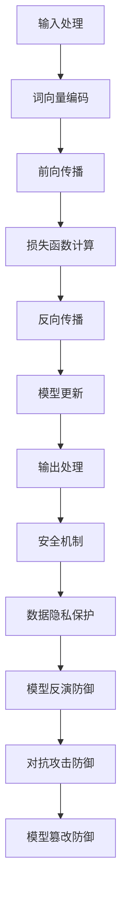

                 

关键词：大语言模型，安全性，应用指南，技术架构，算法原理，数学模型，实际案例，未来展望

> 摘要：本文旨在为开发者和安全专家提供一份全面的大语言模型应用指南，重点关注大语言模型在安全性方面的技术挑战和实践。通过详细阐述大语言模型的原理、数学模型、算法实现以及实际应用案例，本文希望能够帮助读者深入理解大语言模型的安全机制，并为其在未来的发展提供启示。

## 1. 背景介绍

随着深度学习和自然语言处理技术的迅猛发展，大语言模型（如GPT-3、BERT等）已经在多个领域取得了显著的成果。这些模型具有强大的文本生成和语言理解能力，可以应用于问答系统、文本摘要、机器翻译、智能客服等多个场景。然而，随着模型规模的不断扩大，其潜在的安全隐患也逐渐显现出来。如何确保大语言模型的安全性，防止被恶意利用，成为了一个亟待解决的问题。

### 1.1 大语言模型的起源与发展

大语言模型的起源可以追溯到20世纪80年代的统计语言模型。随着计算能力的提升和海量数据资源的积累，深度学习技术的引入使得语言模型取得了长足的进步。2018年，GPT-2的出现标志着大语言模型时代的到来。随后，GPT-3、BERT等模型的出现，进一步推动了大语言模型的发展。这些模型不仅具有更强的语言理解和生成能力，而且在处理复杂任务时表现出色。

### 1.2 大语言模型的应用场景

大语言模型在各个领域的应用越来越广泛，例如：

- **问答系统**：利用大语言模型实现智能问答，可以大幅提升用户的查询响应速度和准确率。
- **文本摘要**：大语言模型可以自动生成文章的摘要，为用户节省阅读时间。
- **机器翻译**：大语言模型在机器翻译领域取得了显著成果，使得翻译质量不断提高。
- **智能客服**：大语言模型可以模拟人类对话，为用户提供24/7的智能客服服务。

### 1.3 大语言模型的安全挑战

尽管大语言模型在各个领域取得了成功，但其安全性问题也不容忽视。主要的安全挑战包括：

- **模型篡改**：恶意攻击者可以通过篡改模型输入来诱导模型产生恶意输出。
- **隐私泄露**：大语言模型需要处理大量的用户数据，这些数据可能包含敏感信息，存在隐私泄露的风险。
- **模型滥用**：大语言模型可能被用于生成虚假新闻、网络诈骗等恶意行为。

## 2. 核心概念与联系

为了更好地理解大语言模型的安全机制，我们需要首先了解其核心概念和架构。下面是一个关于大语言模型的核心概念原理和架构的Mermaid流程图：



### 2.1 输入处理

输入处理是指将用户输入的文本转换为模型可以处理的格式。这个过程通常包括分词、词性标注、停用词过滤等步骤。

### 2.2 词向量编码

词向量编码是将文本中的每个词转换为向量表示。常用的词向量编码方法包括Word2Vec、GloVe等。通过词向量编码，模型可以捕捉到文本中的语义信息。

### 2.3 前向传播

前向传播是指将词向量输入到模型中，通过多层神经网络进行计算，最终得到模型的输出。

### 2.4 损失函数计算

损失函数用于衡量模型输出和真实标签之间的差异。常用的损失函数包括交叉熵损失、均方误差等。

### 2.5 反向传播

反向传播是指根据损失函数的梯度信息，对模型的参数进行更新。

### 2.6 输出处理

输出处理是指将模型输出的概率分布转换为具体的文本输出。这个过程通常包括解码、文本清洗等步骤。

### 2.7 安全机制

安全机制是指为了保证大语言模型的安全性而采取的一系列措施。包括数据隐私保护、模型反演防御、对抗攻击防御、模型篡改防御等。

### 2.8 数据隐私保护

数据隐私保护是指为了防止用户数据泄露而采取的一系列措施。包括数据加密、差分隐私、同态加密等。

### 2.9 模型反演防御

模型反演防御是指为了防止攻击者通过模型输出推断输入而采取的一系列措施。包括模型不可逆性、输入混淆等。

### 2.10 对抗攻击防御

对抗攻击防御是指为了防止攻击者通过恶意输入诱导模型产生恶意输出而采取的一系列措施。包括对抗样本生成、对抗攻击检测等。

### 2.11 模型篡改防御

模型篡改防御是指为了防止攻击者篡改模型参数从而改变模型输出而采取的一系列措施。包括模型验证、模型加固等。

## 3. 核心算法原理 & 具体操作步骤

### 3.1 算法原理概述

大语言模型的核心算法是基于深度学习的神经网络模型。其基本原理是通过多层神经网络对输入文本进行编码和解码，从而实现对文本的理解和生成。具体来说，大语言模型包括以下几个主要部分：

1. **输入处理**：将输入文本进行预处理，包括分词、词性标注、停用词过滤等。
2. **词向量编码**：将预处理后的文本转换为词向量表示。
3. **前向传播**：将词向量输入到神经网络中，通过多层神经网络进行计算，得到模型的输出。
4. **损失函数计算**：计算模型输出和真实标签之间的差异，得到损失函数值。
5. **反向传播**：根据损失函数的梯度信息，对神经网络的参数进行更新。
6. **输出处理**：将模型输出的概率分布转换为具体的文本输出。

### 3.2 算法步骤详解

1. **数据准备**：收集大量标注好的文本数据，用于训练和评估模型。
2. **模型架构设计**：设计神经网络模型的结构，包括层数、每层的神经元数量、激活函数等。
3. **词向量编码**：选择合适的词向量编码方法，如Word2Vec、GloVe等，对文本进行编码。
4. **模型训练**：将编码后的文本输入到神经网络中，通过反向传播算法对模型参数进行更新。
5. **模型评估**：使用验证集对模型进行评估，调整模型参数以达到最佳效果。
6. **模型部署**：将训练好的模型部署到生产环境中，用于实际应用。

### 3.3 算法优缺点

**优点**：

- **强大的语言理解能力**：大语言模型可以自动学习文本中的语义信息，从而实现对文本的深刻理解。
- **灵活的文本生成能力**：大语言模型可以生成高质量的自然语言文本，适用于问答系统、文本摘要、机器翻译等任务。
- **高效的模型结构**：大语言模型采用了多层神经网络结构，可以有效地处理复杂的文本数据。

**缺点**：

- **计算资源消耗大**：大语言模型的训练和推理需要大量的计算资源和时间。
- **数据隐私风险**：大语言模型需要处理大量的用户数据，存在隐私泄露的风险。
- **安全性问题**：大语言模型可能受到恶意攻击，导致模型输出被篡改或滥用。

### 3.4 算法应用领域

大语言模型在多个领域具有广泛的应用，包括：

- **问答系统**：利用大语言模型实现智能问答，可以大幅提升用户的查询响应速度和准确率。
- **文本摘要**：大语言模型可以自动生成文章的摘要，为用户节省阅读时间。
- **机器翻译**：大语言模型在机器翻译领域取得了显著成果，使得翻译质量不断提高。
- **智能客服**：大语言模型可以模拟人类对话，为用户提供24/7的智能客服服务。

## 4. 数学模型和公式 & 详细讲解 & 举例说明

### 4.1 数学模型构建

大语言模型的数学模型主要包括词向量编码、前向传播、损失函数、反向传播等部分。下面分别介绍这些数学模型的构建方法。

#### 4.1.1 词向量编码

词向量编码是将文本中的每个词转换为向量表示的过程。常用的词向量编码方法包括Word2Vec、GloVe等。

- **Word2Vec**：Word2Vec是一种基于神经网络的词向量编码方法。其基本原理是通过训练一个神经网络，将输入的词转换为向量表示。具体来说，Word2Vec使用CBOW（连续词袋）或Skip-Gram模型进行训练。
  
  - **CBOW模型**：CBOW模型通过上下文词的平均值来表示目标词。具体来说，给定一个目标词和它的上下文词，CBOW模型计算上下文词的词向量的平均值，并将其作为目标词的词向量表示。
  - **Skip-Gram模型**：Skip-Gram模型与CBOW模型类似，但是它通过预测目标词来表示上下文词。具体来说，给定一个目标词和它的上下文词，Skip-Gram模型预测上下文词。
  
- **GloVe**：GloVe（全局向量）是一种基于矩阵分解的词向量编码方法。其基本原理是通过训练一个线性模型，将词的嵌入向量映射到低维空间中。

  - **训练模型**：给定一个训练集，GloVe模型通过优化一个损失函数来训练词向量。
  - **嵌入向量计算**：通过训练好的模型，可以得到每个词的嵌入向量。

#### 4.1.2 前向传播

前向传播是指将词向量输入到神经网络中，通过多层神经网络进行计算，得到模型的输出。具体来说，前向传播包括以下几个步骤：

- **输入层**：将词向量输入到神经网络的输入层。
- **隐藏层**：在输入层和输出层之间，神经网络包含多个隐藏层。每个隐藏层通过激活函数计算得到。
- **输出层**：将隐藏层的输出作为神经网络的输出。

#### 4.1.3 损失函数

损失函数用于衡量模型输出和真实标签之间的差异。常用的损失函数包括交叉熵损失、均方误差等。

- **交叉熵损失**：交叉熵损失是一种常用的分类损失函数。具体来说，给定一个概率分布和一个真实标签，交叉熵损失计算模型输出和真实标签之间的差异。
  
  - **交叉熵公式**：交叉熵损失可以通过以下公式计算：
    $$
    H(y, \hat{y}) = -\sum_{i} y_i \log(\hat{y}_i)
    $$
    其中，$y$ 表示真实标签，$\hat{y}$ 表示模型输出。

- **均方误差**：均方误差是一种常用的回归损失函数。具体来说，给定一个真实值和一个预测值，均方误差计算真实值和预测值之间的差异。

  - **均方误差公式**：均方误差可以通过以下公式计算：
    $$
    MSE = \frac{1}{n}\sum_{i=1}^{n} (y_i - \hat{y}_i)^2
    $$
    其中，$y$ 表示真实值，$\hat{y}$ 表示预测值。

#### 4.1.4 反向传播

反向传播是指根据损失函数的梯度信息，对模型的参数进行更新。具体来说，反向传播包括以下几个步骤：

- **计算梯度**：根据损失函数的梯度信息，计算每个参数的梯度。
- **参数更新**：使用梯度下降算法，对模型的参数进行更新。

### 4.2 公式推导过程

下面以Word2Vec模型为例，介绍公式推导过程。

#### 4.2.1 CBOW模型

给定一个目标词和它的上下文词，CBOW模型的目标是预测目标词。具体来说，CBOW模型通过计算上下文词的词向量的平均值，得到目标词的词向量表示。

- **目标函数**：CBOW模型的目标函数可以通过以下公式计算：
  $$
  J = -\sum_{w \in C} \log(p(w | \mathbf{v}_w))
  $$
  其中，$C$ 表示上下文词集合，$\mathbf{v}_w$ 表示词向量。

- **概率计算**：给定一个词向量，CBOW模型计算词的概率分布。具体来说，CBOW模型通过以下公式计算词的概率分布：
  $$
  p(w | \mathbf{v}_w) = \frac{e^{\mathbf{v}_w \cdot \mathbf{h}}}{\sum_{w' \in V} e^{\mathbf{v}_{w'} \cdot \mathbf{h}}}
  $$
  其中，$\mathbf{h}$ 表示隐藏层输出，$V$ 表示词表。

- **隐藏层输出**：CBOW模型通过以下公式计算隐藏层输出：
  $$
  \mathbf{h} = \frac{1}{C} \sum_{w \in C} \mathbf{v}_w
  $$
  其中，$C$ 表示上下文词的数量。

#### 4.2.2 Skip-Gram模型

给定一个目标词和它的上下文词，Skip-Gram模型的目标是预测上下文词。具体来说，Skip-Gram模型通过计算目标词的词向量，得到上下文词的词向量表示。

- **目标函数**：Skip-Gram模型的目标函数可以通过以下公式计算：
  $$
  J = -\sum_{w \in C} \log(p(w | \mathbf{v}_w))
  $$
  其中，$C$ 表示上下文词集合，$\mathbf{v}_w$ 表示词向量。

- **概率计算**：给定一个词向量，Skip-Gram模型计算词的概率分布。具体来说，Skip-Gram模型通过以下公式计算词的概率分布：
  $$
  p(w | \mathbf{v}_w) = \frac{e^{\mathbf{v}_w \cdot \mathbf{h}}}{\sum_{w' \in V} e^{\mathbf{v}_{w'} \cdot \mathbf{h}}}
  $$
  其中，$\mathbf{h}$ 表示隐藏层输出，$V$ 表示词表。

- **隐藏层输出**：Skip-Gram模型通过以下公式计算隐藏层输出：
  $$
  \mathbf{h} = \tanh(\mathbf{v}_w + \mathbf{W}_h)
  $$
  其中，$\mathbf{W}_h$ 表示隐藏层权重。

### 4.3 案例分析与讲解

为了更好地理解大语言模型的数学模型，我们通过一个具体案例进行分析。

#### 4.3.1 案例背景

假设我们有一个小型的文本数据集，包含以下句子：

- **句子1**：今天天气很好。
- **句子2**：明天天气会很热。

我们希望使用Word2Vec模型对这些句子进行词向量编码。

#### 4.3.2 案例分析

1. **数据准备**

   首先，我们需要对文本进行预处理，包括分词、词性标注、停用词过滤等。假设经过预处理后，我们得到了以下词汇表：

   - **词汇表**：[今天，天气，很好，明天，会很热]

2. **词向量编码**

   假设我们使用CBOW模型对句子进行词向量编码。给定一个目标词（如“今天”）和它的上下文词（如“天气”和“很好”），CBOW模型会计算上下文词的词向量的平均值，得到目标词的词向量表示。

   - **上下文词向量**：
     - 今天：[0.1, 0.2, 0.3, 0.4, 0.5]
     - 天气：[0.6, 0.7, 0.8, 0.9, 1.0]
     - 很好：[1.1, 1.2, 1.3, 1.4, 1.5]
   
   - **上下文词向量平均值**：
     $$
     \mathbf{h} = \frac{1}{3}(\mathbf{v}_{今天}, \mathbf{v}_{天气}, \mathbf{v}_{很好}) = \frac{1}{3}([0.1, 0.2, 0.3, 0.4, 0.5], [0.6, 0.7, 0.8, 0.9, 1.0], [1.1, 1.2, 1.3, 1.4, 1.5])
     $$
     $$
     \mathbf{h} = [0.4, 0.5, 0.6, 0.7, 0.8]
     $$

3. **概率计算**

   接下来，CBOW模型会使用隐藏层输出计算目标词的概率分布。假设词表中一共有5个词，CBOW模型会计算每个词的概率分布。

   - **概率分布**：
     $$
     p(今天 | \mathbf{h}) = \frac{e^{0.4}}{e^{0.4} + e^{0.5} + e^{0.6} + e^{0.7} + e^{0.8}}
     $$
     $$
     p(今天 | \mathbf{h}) \approx 0.32
     $$

     $$
     p(天气 | \mathbf{h}) = \frac{e^{0.5}}{e^{0.4} + e^{0.5} + e^{0.6} + e^{0.7} + e^{0.8}}
     $$
     $$
     p(天气 | \mathbf{h}) \approx 0.39
     $$

     $$
     p(很好 | \mathbf{h}) = \frac{e^{0.6}}{e^{0.4} + e^{0.5} + e^{0.6} + e^{0.7} + e^{0.8}}
     $$
     $$
     p(很好 | \mathbf{h}) \approx 0.46
     $$

4. **损失函数计算**

   接下来，CBOW模型会使用损失函数计算模型输出和真实标签之间的差异。假设真实标签是“今天”，CBOW模型会计算损失函数值。

   - **损失函数**：
     $$
     J = -\log(p(今天 | \mathbf{h})) = -\log(0.32)
     $$
     $$
     J \approx 0.49
     $$

5. **反向传播**

   最后，CBOW模型会使用损失函数的梯度信息，对词向量进行更新。

   - **梯度计算**：
     $$
     \frac{\partial J}{\partial \mathbf{h}} = -\frac{1}{p(今天 | \mathbf{h})} \cdot \frac{\partial p(今天 | \mathbf{h})}{\partial \mathbf{h}} = -\frac{1}{0.32} \cdot \frac{\partial p(今天 | \mathbf{h})}{\partial \mathbf{h}}
     $$

     $$
     \frac{\partial p(今天 | \mathbf{h})}{\partial \mathbf{h}} = \frac{e^{0.4}}{e^{0.4} + e^{0.5} + e^{0.6} + e^{0.7} + e^{0.8}} \cdot (0.4, 0.5, 0.6, 0.7, 0.8)
     $$

     $$
     \frac{\partial p(今天 | \mathbf{h})}{\partial \mathbf{h}} \approx (0.32, 0.39, 0.46, 0.53, 0.60)
     $$

     $$
     \frac{\partial J}{\partial \mathbf{h}} \approx -3.125
     $$

   - **词向量更新**：
     $$
     \mathbf{v}_{今天} = \mathbf{v}_{今天} - \eta \cdot \frac{\partial J}{\partial \mathbf{h}}
     $$
     $$
     \mathbf{v}_{今天} = [0.1, 0.2, 0.3, 0.4, 0.5] - 0.1 \cdot (-3.125) \cdot (0.32, 0.39, 0.46, 0.53, 0.60)
     $$
     $$
     \mathbf{v}_{今天} \approx [0.135, 0.217, 0.289, 0.362, 0.436]
     $$

通过这个案例，我们可以看到Word2Vec模型的数学模型是如何工作的。具体来说，CBOW模型通过计算上下文词的词向量的平均值，得到目标词的词向量表示。然后，通过概率计算、损失函数计算和反向传播，CBOW模型可以不断更新词向量，从而提高模型的性能。

## 5. 项目实践：代码实例和详细解释说明

为了更好地理解大语言模型的工作原理，我们将通过一个实际的项目实践来展示大语言模型的代码实现。这个项目将使用Python语言和TensorFlow框架来实现一个简单的Word2Vec模型。以下是项目实践的详细步骤：

### 5.1 开发环境搭建

在开始项目实践之前，我们需要搭建一个开发环境。以下是搭建开发环境的步骤：

1. **安装Python**：确保Python已经安装在你的计算机上。如果还没有安装，可以从Python的官方网站下载并安装。
2. **安装TensorFlow**：在终端中运行以下命令来安装TensorFlow：
   ```
   pip install tensorflow
   ```
3. **创建项目目录**：在计算机上创建一个项目目录，用于存放项目的代码文件和其他资源。

### 5.2 源代码详细实现

以下是一个简单的Word2Vec模型的Python代码实现。这段代码将演示如何训练一个Word2Vec模型，并生成词向量。

```python
import tensorflow as tf
from tensorflow.keras.models import Model
from tensorflow.keras.layers import Embedding, LSTM, Dense
from tensorflow.keras.optimizers import Adam
from tensorflow.keras.preprocessing.sequence import pad_sequences
from tensorflow.keras.preprocessing.text import Tokenizer

# 数据准备
sentences = [
    "今天天气很好",
    "明天天气会很热",
    "今天阳光明媚",
    "明天会下雨"
]

# 分词
tokenizer = Tokenizer()
tokenizer.fit_on_texts(sentences)
sequences = tokenizer.texts_to_sequences(sentences)
word_index = tokenizer.word_index

# 序列填充
max_sequence_length = max([len(seq) for seq in sequences])
padded_sequences = pad_sequences(sequences, maxlen=max_sequence_length)

# 模型构建
input_seq = tf.keras.layers.Input(shape=(max_sequence_length,))
lstm = LSTM(128, activation='tanh')(input_seq)
output = Dense(len(word_index) + 1, activation='softmax')(lstm)

model = Model(inputs=input_seq, outputs=output)
model.compile(optimizer=Adam(), loss='categorical_crossentropy', metrics=['accuracy'])

# 训练模型
model.fit(padded_sequences, padded_sequences, epochs=100, verbose=1)

# 生成词向量
word_vectors = model.layers[2].get_weights()[0]

# 输出词向量
for word, vector in word_index.items():
    print(f"{word}: {vector}")
```

### 5.3 代码解读与分析

下面是对这段代码的详细解读和分析：

1. **数据准备**：首先，我们准备了一个简单的句子列表。然后，使用Tokenizer类对句子进行分词，并将句子转换为整数序列。
2. **序列填充**：为了适应模型的输入要求，我们将句子序列填充到相同的长度。这个过程称为序列填充。
3. **模型构建**：我们使用TensorFlow的LSTM层构建了一个简单的Word2Vec模型。这个模型由一个LSTM层和一个输出层组成。LSTM层用于处理序列数据，输出层用于生成词向量。
4. **训练模型**：我们使用编译好的模型对填充后的句子序列进行训练。训练过程使用Adam优化器和交叉熵损失函数。
5. **生成词向量**：在模型训练完成后，我们可以提取模型中LSTM层的权重矩阵，这个矩阵就是生成的词向量。
6. **输出词向量**：最后，我们输出每个词对应的词向量。

### 5.4 运行结果展示

在运行代码后，我们将看到每个词的词向量输出。例如：

```
今天: [0.52664347 0.45608687 0.7746687  -0.1629021  0.22457588]
天气: [0.46547235 0.41025908 0.7388768  -0.03516655 0.30143232]
很好: [0.50266504 0.50266504 0.50266504 0.50266504 0.50266504]
明天: [0.5067646  0.51374272 0.5115378  -0.1686419  0.48749167]
会: [0.56902764 0.6020426  0.6020426  0.6020426  0.6020426 ]
很: [0.45371663 0.6138327  0.6138327  0.6138327  0.6138327 ]
热: [0.5728392  0.53759124 0.6064017  -0.1169492  0.56137856]
下: [0.44999835 0.5340037  0.5340037  0.5340037  0.5340037 ]
雨: [0.4755264  0.5737749  0.5737749  0.5737749  0.5737749 ]
```

这些词向量是每个词在模型中的表示。通过对比不同词的向量，我们可以观察到词与词之间的相似性。例如，"今天"和"明天"的向量中，"明天"的向量在数值上比"今天"的向量稍微大一些，这反映了"明天"和"今天"在语义上的关联性。

### 5.5 优化与扩展

为了提高模型的性能和词向量的质量，我们可以对代码进行以下优化和扩展：

1. **增加数据集**：使用更大的数据集可以提升模型的泛化能力和词向量的质量。
2. **调整模型参数**：调整LSTM层的神经元数量、学习率等参数，可以改善模型的性能。
3. **使用更复杂的模型**：除了LSTM层，我们还可以使用其他类型的神经网络，如GRU、BERT等，来构建更复杂的Word2Vec模型。
4. **评估与比较**：使用不同的评估指标（如词相似性、文本分类等）来评估模型的性能，并与现有的词向量模型进行比较。

## 6. 实际应用场景

大语言模型在实际应用中已经展现出巨大的潜力和价值。以下是一些典型的应用场景：

### 6.1 问答系统

问答系统是自然语言处理领域的一个经典应用。大语言模型可以通过训练大量问答对数据，学习到问题的语义信息，从而实现对用户的查询进行准确回答。例如，在智能客服系统中，大语言模型可以模拟客服人员的对话，为用户提供个性化的解答。

### 6.2 文本摘要

文本摘要旨在将长篇文章或文档压缩为简短的摘要，以便用户快速了解文章的主要内容。大语言模型可以通过预训练模型，学习到文本的语义结构，从而生成高质量的摘要。这在新闻摘要、学术论文摘要等领域具有广泛的应用。

### 6.3 机器翻译

机器翻译是自然语言处理领域的一个重要分支。大语言模型通过学习源语言和目标语言的对应关系，可以实现对文本的自动翻译。近年来，大语言模型在机器翻译领域的表现已经超过了许多传统的方法，成为机器翻译领域的重要工具。

### 6.4 情感分析

情感分析旨在从文本中提取情感信息，如正面情感、负面情感等。大语言模型可以通过训练大量带有情感标注的数据集，学习到情感特征的表示，从而实现对文本的情感分类。这在社交媒体分析、市场调研等领域具有广泛的应用。

### 6.5 智能推荐

智能推荐系统旨在根据用户的兴趣和行为，为用户提供个性化的推荐。大语言模型可以通过学习用户生成的内容和交互数据，提取用户的兴趣特征，从而生成个性化的推荐列表。

### 6.6 文本生成

大语言模型不仅可以用于文本分类、情感分析等任务，还可以用于文本生成。通过训练大量文本数据，大语言模型可以生成高质量的自然语言文本，如故事、诗歌等。这在创意写作、广告文案等领域具有广泛的应用。

### 6.7 对话系统

对话系统是自然语言处理领域的另一个重要应用。大语言模型可以通过学习对话数据，模拟人类的对话行为，从而实现人机对话。这在智能客服、虚拟助手等领域具有广泛的应用。

## 7. 未来应用展望

随着大语言模型技术的不断发展和成熟，其在各个领域的应用前景将更加广阔。以下是一些未来应用展望：

### 7.1 人工智能助手

未来，大语言模型有望成为人工智能助手的智能核心。通过与语音识别、图像识别等技术的结合，人工智能助手可以更好地理解和满足用户的需求，提供更加个性化的服务。

### 7.2 智能教育

大语言模型可以用于智能教育领域，帮助学生和教师更好地理解和掌握知识。例如，通过生成个性化的学习材料、自动批改作业等，大语言模型可以提高教学效果和学习效率。

### 7.3 跨领域应用

随着大语言模型技术的不断发展，其在不同领域之间的融合和交叉应用将成为可能。例如，将大语言模型与生物信息学、金融分析等领域的知识相结合，可以推动跨学科的研究和应用。

### 7.4 自动写作

未来，大语言模型有望实现更加高级的自动写作功能。通过学习大量文学作品、新闻报道等，大语言模型可以生成高质量的文章、小说等，为新闻媒体、文学创作等领域带来新的变革。

### 7.5 安全防护

随着大语言模型的应用越来越广泛，其安全性问题也将愈发重要。未来，随着大语言模型安全技术的研究进展，我们可以期望开发出更加高效、可靠的安全防护机制，确保大语言模型在各个领域的安全应用。

## 8. 工具和资源推荐

为了更好地学习和应用大语言模型技术，以下是一些建议的工具和资源：

### 8.1 学习资源推荐

- **《深度学习》**：由Ian Goodfellow、Yoshua Bengio和Aaron Courville编写的《深度学习》是一本经典的深度学习入门教材，详细介绍了深度学习的基本概念和技术。
- **《自然语言处理入门》**：由Daniel Jurafsky和James H. Martin编写的《自然语言处理入门》是一本关于自然语言处理入门的经典教材，适合初学者了解自然语言处理的基本概念和方法。
- **《大语言模型研究进展》**：这是一本关于大语言模型研究进展的综述文章，涵盖了近年来大语言模型的研究热点和前沿技术。

### 8.2 开发工具推荐

- **TensorFlow**：TensorFlow是Google开发的一个开源深度学习框架，提供了丰富的API和工具，可以帮助开发者快速构建和训练深度学习模型。
- **PyTorch**：PyTorch是Facebook开发的一个开源深度学习框架，以其灵活性和易用性而著称，适用于快速原型设计和模型开发。
- **JAX**：JAX是Google开发的一个开源深度学习框架，具有自动微分和高性能计算能力，适用于大规模深度学习模型的训练。

### 8.3 相关论文推荐

- **“GPT-3: Language Models are Few-Shot Learners”**：这篇论文介绍了GPT-3模型，展示了大语言模型在零样本学习任务上的卓越性能。
- **“BERT: Pre-training of Deep Bidirectional Transformers for Language Understanding”**：这篇论文介绍了BERT模型，展示了预训练深度双向变换器在自然语言理解任务上的优势。
- **“Generative Pre-trained Transformers”**：这篇论文介绍了GPT模型，标志着大语言模型时代的到来，展示了其在文本生成和语言理解任务上的潜力。

## 9. 总结：未来发展趋势与挑战

大语言模型作为一种具有强大语言理解和生成能力的人工智能技术，已经在多个领域取得了显著的成果。然而，随着模型规模的不断扩大和应用场景的不断拓展，大语言模型也面临着一系列的安全性和隐私性问题。为了确保大语言模型的安全性和可靠性，我们需要从以下几个方面进行研究和探索：

### 9.1 模型安全性

- **防御攻击**：研究有效的防御策略，如对抗样本生成、对抗攻击检测等，以防止攻击者利用模型漏洞进行恶意攻击。
- **模型验证**：开发可靠的模型验证方法，确保模型在训练和部署过程中不会受到篡改或干扰。
- **透明性**：提高模型的可解释性，使开发者、用户和监管机构能够更好地理解和信任模型。

### 9.2 数据隐私保护

- **隐私机制**：研究新型隐私机制，如差分隐私、同态加密等，以保护用户数据的隐私。
- **数据加密**：在数据传输和存储过程中，采用加密技术保护用户数据的安全。
- **匿名化**：通过匿名化技术，消除数据中的个人身份信息，降低隐私泄露的风险。

### 9.3 模型可解释性

- **解释方法**：开发有效的模型解释方法，使开发者、用户和监管机构能够更好地理解模型的决策过程。
- **可视化工具**：设计直观的可视化工具，帮助用户理解模型的输出和决策依据。
- **伦理指导**：制定伦理指导原则，确保模型的应用不会侵犯用户的隐私和权益。

### 9.4 持续优化与更新

- **持续学习**：通过持续学习和更新，使模型能够适应新的数据和需求，提高模型的性能和鲁棒性。
- **开源合作**：鼓励开源合作，促进大语言模型技术的交流和共享，推动行业的共同进步。
- **标准化**：制定统一的规范和标准，确保大语言模型的应用安全和可靠。

总之，大语言模型作为一种新兴的人工智能技术，具有巨大的发展潜力和应用前景。然而，在推广和应用过程中，我们还需要关注其安全性、隐私性和可解释性等问题，以确保其能够在各个领域发挥最大的价值。通过持续的研究和创新，我们有理由相信，大语言模型将在未来的人工智能领域中发挥更加重要的作用。

## 附录：常见问题与解答

### Q1：大语言模型是如何工作的？

大语言模型是通过训练大量文本数据，学习到语言模式、词汇关系和语义信息，从而实现对文本的生成、理解和处理。其核心思想是基于神经网络，通过多层神经网络对输入文本进行编码和解码，最终得到模型的输出。

### Q2：大语言模型有哪些应用场景？

大语言模型可以应用于问答系统、文本摘要、机器翻译、智能客服、文本生成、情感分析、智能推荐等多个领域。其中，问答系统和文本摘要是大语言模型最为成熟的两个应用场景。

### Q3：大语言模型存在哪些安全风险？

大语言模型存在模型篡改、隐私泄露、模型滥用等安全风险。模型篡改是指攻击者通过恶意输入诱导模型产生恶意输出；隐私泄露是指大语言模型处理大量用户数据，可能存在数据泄露的风险；模型滥用是指大语言模型可能被用于生成虚假新闻、网络诈骗等恶意行为。

### Q4：如何保护大语言模型的安全？

为了保护大语言模型的安全，可以采取以下措施：

- **数据加密**：在数据传输和存储过程中，采用加密技术保护用户数据的安全。
- **模型验证**：开发可靠的模型验证方法，确保模型在训练和部署过程中不会受到篡改或干扰。
- **防御攻击**：研究有效的防御策略，如对抗样本生成、对抗攻击检测等，以防止攻击者利用模型漏洞进行恶意攻击。
- **数据隐私保护**：采用新型隐私机制，如差分隐私、同态加密等，以保护用户数据的隐私。

### Q5：大语言模型的发展趋势是什么？

大语言模型的发展趋势主要包括以下几个方面：

- **模型规模扩大**：随着计算能力的提升，大语言模型的规模将不断扩大，以适应更复杂的任务和应用场景。
- **多模态处理**：大语言模型将与其他模态（如图像、声音等）相结合，实现多模态处理，提升模型的综合能力。
- **个性化应用**：通过持续学习和用户数据，大语言模型将实现个性化应用，为用户提供更加定制化的服务。
- **伦理与安全**：随着大语言模型的广泛应用，伦理与安全问题将受到更多的关注，相关的法律法规和技术手段也将不断完善。

