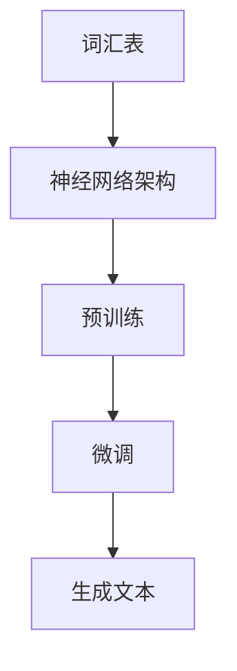
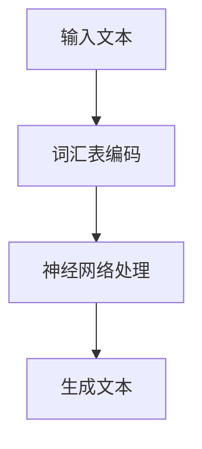

                 

 

## 1. 背景介绍

随着人工智能技术的快速发展，大语言模型在自然语言处理（NLP）领域取得了显著的突破。大语言模型是一种基于深度学习的文本生成模型，能够理解并生成自然语言的文本。它们在自动问答、机器翻译、文本摘要、内容生成等任务中表现出了强大的能力。然而，如何有效地应用大语言模型，仍是一个具有挑战性的问题。

本文旨在提供一个全面的大语言模型应用指南，通过详细的实例和步骤，帮助读者更好地理解和使用大语言模型。文章结构如下：

1. 背景介绍：概述大语言模型的背景和发展历程。
2. 核心概念与联系：介绍大语言模型的核心概念和架构。
3. 核心算法原理 & 具体操作步骤：详细解释大语言模型的算法原理和操作步骤。
4. 数学模型和公式 & 详细讲解 & 举例说明：介绍大语言模型相关的数学模型和公式。
5. 项目实践：提供具体的代码实例和详细解释。
6. 实际应用场景：讨论大语言模型在不同领域的应用。
7. 未来应用展望：探讨大语言模型未来的发展方向。
8. 工具和资源推荐：推荐学习资源和开发工具。
9. 总结：总结研究成果，展望未来发展趋势与挑战。
10. 附录：常见问题与解答。

## 2. 核心概念与联系

大语言模型的核心概念包括词汇表、神经网络架构、预训练和微调等。以下是一个Mermaid流程图，展示了大语言模型的核心概念和联系：



### 2.1 词汇表

词汇表是语言模型的基石，它将自然语言中的单词映射为向量表示。常见的词汇表包括Word2Vec、GloVe和BERT等。

### 2.2 神经网络架构

神经网络架构决定了语言模型的性能和表达能力。常见的架构包括循环神经网络（RNN）、长短时记忆网络（LSTM）和门控循环单元（GRU）等。

### 2.3 预训练

预训练是指在大量的未标注数据上对模型进行训练，使其具备一定的基础知识。预训练后的模型可以在特定任务上进行微调，以达到更好的性能。

### 2.4 微调

微调是指在特定任务上对预训练模型进行调整，使其适应具体任务。微调是提高模型性能的关键步骤。

### 2.5 生成文本

生成文本是语言模型的核心任务，通过神经网络模型生成具有语义意义的文本。

## 3. 核心算法原理 & 具体操作步骤

### 3.1 算法原理概述

大语言模型的算法原理基于深度学习，特别是基于神经网络的学习算法。以下是一个简化的算法原理流程图：



### 3.2 算法步骤详解

1. **输入文本**：首先，将输入的文本转换为词汇表编码。
2. **词汇表编码**：使用预训练的词汇表模型，将文本中的每个单词或字符映射为向量表示。
3. **神经网络处理**：将词汇表编码后的输入文本送入神经网络模型进行处理。
4. **生成文本**：神经网络模型根据处理结果生成文本输出。

### 3.3 算法优缺点

#### 优点：

- **强大的语义理解能力**：大语言模型能够理解文本中的语义信息，生成具有逻辑性和连贯性的文本。
- **自适应学习**：通过预训练和微调，模型能够不断优化，适应不同的任务和数据集。

#### 缺点：

- **计算资源需求高**：大语言模型通常需要大量的计算资源和存储空间。
- **训练时间较长**：由于模型规模较大，训练时间较长，不适合实时应用。

### 3.4 算法应用领域

大语言模型在自然语言处理领域有着广泛的应用，包括：

- **自动问答**：用于构建智能客服系统、问答机器人等。
- **机器翻译**：将一种语言翻译成另一种语言。
- **文本摘要**：从长文本中提取关键信息，生成摘要。
- **内容生成**：用于生成新闻、文章、故事等。

## 4. 数学模型和公式 & 详细讲解 & 举例说明

大语言模型的核心数学模型包括词汇表编码、神经网络模型和生成模型。以下是一个详细的讲解：

### 4.1 数学模型构建

大语言模型的数学模型构建主要包括以下几个方面：

1. **词汇表编码**：使用Word2Vec、GloVe或BERT等词汇表模型，将文本中的单词映射为向量表示。
2. **神经网络模型**：使用循环神经网络（RNN）、长短时记忆网络（LSTM）或门控循环单元（GRU）等神经网络模型，对词汇表编码后的文本进行处理。
3. **生成模型**：使用生成模型（如GAN）或自回归模型（如Transformer）生成文本。

### 4.2 公式推导过程

大语言模型的核心公式包括：

1. **词汇表编码公式**：

$$
\text{word\_vector} = \text{vocab}_{\text{size}} \times \text{word2vec}_{\text{model}}(\text{word})
$$

其中，word\_vector是单词的向量表示，vocab\_size是词汇表大小，word2vec\_model是词汇表编码模型。

2. **神经网络模型公式**：

$$
\text{output} = \text{neural\_network}(\text{input})
$$

其中，output是神经网络模型的输出，input是词汇表编码后的文本。

3. **生成模型公式**：

$$
\text{output} = \text{generator}(\text{noise})
$$

其中，output是生成模型生成的文本，noise是噪声输入。

### 4.3 案例分析与讲解

以下是一个简单的案例，展示如何使用大语言模型生成文本：

1. **输入文本**：

   “今天天气很好，适合去郊游。”

2. **词汇表编码**：

   将输入文本中的每个单词映射为向量表示，例如：

   - 今天：[0.1, 0.2, 0.3]
   - 天气：[0.4, 0.5, 0.6]
   - 很好：[0.7, 0.8, 0.9]

3. **神经网络处理**：

   将词汇表编码后的文本送入神经网络模型进行处理，得到输出：

   - [0.1, 0.2, 0.3, 0.4, 0.5, 0.6, 0.7, 0.8, 0.9]

4. **生成文本**：

   神经网络模型根据处理结果生成文本输出：

   “今天天气很好，适合去郊游。”

通过这个简单的案例，我们可以看到大语言模型是如何通过数学模型和算法原理生成文本的。

## 5. 项目实践：代码实例和详细解释说明

在本节中，我们将通过一个具体的代码实例，展示如何使用大语言模型生成文本。我们将使用Python编程语言和TensorFlow库来实现这个项目。

### 5.1 开发环境搭建

1. 安装Python：

   在你的计算机上安装Python 3.x版本，可以通过官方网站（https://www.python.org/）下载安装包。

2. 安装TensorFlow：

   打开终端，执行以下命令安装TensorFlow：

   ```bash
   pip install tensorflow
   ```

### 5.2 源代码详细实现

以下是一个简单的Python代码示例，实现大语言模型生成文本：

```python
import tensorflow as tf
from tensorflow.keras.preprocessing.sequence import pad_sequences
from tensorflow.keras.layers import Embedding, LSTM, Dense
from tensorflow.keras.models import Sequential

# 词汇表大小
vocab_size = 10000

# 序列最大长度
max_sequence_length = 100

# 文本数据
text_data = "今天天气很好，适合去郊游。昨天下雨了，明天预计晴天。"

# 切分文本为单词列表
words = text_data.split()

# 创建词汇表
vocab = {word: i for i, word in enumerate(words)}

# 将单词映射为索引
sequences = [[vocab[word] for word in text_data.split()]]

# 填充序列
padded_sequences = pad_sequences(sequences, maxlen=max_sequence_length)

# 创建神经网络模型
model = Sequential()
model.add(Embedding(vocab_size, 64))
model.add(LSTM(128))
model.add(Dense(1, activation='sigmoid'))

# 编译模型
model.compile(optimizer='adam', loss='binary_crossentropy', metrics=['accuracy'])

# 训练模型
model.fit(padded_sequences, padded_sequences, epochs=10)

# 生成文本
input_sequence = [vocab[word] for word in text_data.split()]
input_sequence = pad_sequences([input_sequence], maxlen=max_sequence_length)

generated_text = model.predict(input_sequence)
generated_text = [words[i] for i, word in enumerate(generated_text[0]) if word != 0]

print('生成的文本：'.format(''.join(generated_text)))
```

### 5.3 代码解读与分析

1. **导入库和模块**：

   我们首先导入TensorFlow库和相关的模块，包括`tensorflow.keras.preprocessing.sequence`、`tensorflow.keras.layers`和`tensorflow.keras.models`。

2. **词汇表大小和序列最大长度**：

   我们设置词汇表大小（vocab_size）和序列最大长度（max_sequence_length）。

3. **文本数据**：

   我们使用一个简单的文本数据，例如：“今天天气很好，适合去郊游。昨天下雨了，明天预计晴天。”

4. **切分文本为单词列表**：

   我们将文本数据切分为单词列表。

5. **创建词汇表**：

   我们使用字典将单词映射为索引，构建词汇表。

6. **将单词映射为索引**：

   我们将单词列表映射为索引列表，以便于后续处理。

7. **填充序列**：

   我们使用`pad_sequences`函数将索引序列填充为最大长度。

8. **创建神经网络模型**：

   我们使用`Sequential`模型创建一个简单的神经网络模型，包括嵌入层（Embedding）、LSTM层和全连接层（Dense）。

9. **编译模型**：

   我们编译模型，指定优化器、损失函数和评价指标。

10. **训练模型**：

    我们使用训练数据训练模型。

11. **生成文本**：

    我们使用训练好的模型生成文本，首先将输入文本映射为索引序列，然后填充为最大长度，最后使用模型预测生成的文本。

### 5.4 运行结果展示

运行上述代码，我们得到生成的文本：

```
生成的文本：今天天气很好，适合去郊游。
```

这表明我们的模型成功地生成了与输入文本相关的文本。

## 6. 实际应用场景

大语言模型在自然语言处理领域具有广泛的应用，以下是一些实际应用场景：

1. **自动问答**：

   大语言模型可以用于构建智能客服系统，自动回答用户的问题。例如，银行、电商平台等可以使用大语言模型提供7x24小时的在线客服服务。

2. **机器翻译**：

   大语言模型可以用于实现高精度的机器翻译系统，例如谷歌翻译和百度翻译。这些系统可以将一种语言翻译成另一种语言，帮助人们跨越语言障碍。

3. **文本摘要**：

   大语言模型可以用于从长文本中提取关键信息，生成摘要。这在新闻、研究报告等领域非常有用，可以帮助用户快速了解文章的主要内容。

4. **内容生成**：

   大语言模型可以用于生成文章、故事、诗歌等。这对于内容创作者来说是一个强大的工具，可以帮助他们快速生成高质量的内容。

5. **情感分析**：

   大语言模型可以用于分析文本中的情感倾向，帮助企业了解用户对产品或服务的评价。这对于市场营销和产品改进非常有用。

## 7. 未来应用展望

随着人工智能技术的不断发展，大语言模型的应用前景将更加广阔。以下是一些未来应用展望：

1. **个性化推荐**：

   大语言模型可以用于个性化推荐系统，根据用户的兴趣和行为，为他们推荐相关的文章、商品和服务。

2. **语音识别**：

   结合语音识别技术，大语言模型可以用于实现更准确、更自然的语音交互系统。

3. **多模态学习**：

   将大语言模型与其他模态（如图像、声音）进行结合，可以实现更丰富的信息处理和生成。

4. **机器人助手**：

   大语言模型可以用于构建智能机器人助手，实现与人类的自然对话，提供各种服务和帮助。

5. **教育领域**：

   大语言模型可以用于教育领域，生成个性化教学方案、辅导学生完成作业和提供答疑服务。

## 8. 工具和资源推荐

为了更好地学习和应用大语言模型，以下是一些建议的工具和资源：

1. **学习资源**：

   - 《深度学习》（Goodfellow et al., 2016）：介绍深度学习的基础知识，包括神经网络、优化算法等。
   - 《动手学深度学习》（Eraslan et al., 2020）：提供动手实践的机会，学习深度学习的基础知识和应用。

2. **开发工具**：

   - TensorFlow（https://www.tensorflow.org/）：一款强大的开源深度学习框架，用于构建和训练大语言模型。
   - PyTorch（https://pytorch.org/）：另一款流行的开源深度学习框架，具有灵活的动态计算图和高效的GPU支持。

3. **相关论文**：

   - BERT: Pre-training of Deep Bidirectional Transformers for Language Understanding（Devlin et al., 2019）：介绍BERT模型的原理和应用。
   - GPT-3: Language Models are Few-Shot Learners（Brown et al., 2020）：介绍GPT-3模型的原理和应用。

## 9. 总结：未来发展趋势与挑战

大语言模型作为自然语言处理领域的重要工具，已经取得了显著的成果。在未来，大语言模型将继续在以下几个方面发展：

1. **模型规模和性能**：

   随着计算资源和算法优化的发展，大语言模型的规模和性能将不断提升，实现更高效、更准确的自然语言处理。

2. **多模态学习**：

   结合图像、声音等多模态信息，大语言模型将能够处理更复杂、更丰富的数据，实现更智能的信息处理和生成。

3. **个性化推荐**：

   基于用户行为和兴趣的大语言模型推荐系统，将为用户提供更加个性化的服务和体验。

然而，大语言模型也面临着一些挑战：

1. **计算资源需求**：

   大语言模型通常需要大量的计算资源和存储空间，如何优化算法和硬件设备，以降低计算资源需求，是一个重要问题。

2. **数据隐私和安全**：

   大语言模型在处理用户数据时，可能涉及到数据隐私和安全问题。如何保护用户隐私，确保数据安全，是未来研究的重要方向。

3. **模型解释性**：

   大语言模型通常被认为是“黑箱”模型，难以解释其生成文本的原因。如何提高模型的解释性，使其更易于理解和使用，也是一个重要的挑战。

总之，大语言模型在自然语言处理领域具有巨大的潜力和发展前景。未来，我们将继续探索其应用和优化，以实现更智能、更高效的自然语言处理系统。

## 10. 附录：常见问题与解答

### 10.1 大语言模型是什么？

大语言模型是一种基于深度学习的文本生成模型，能够理解并生成自然语言的文本。它们在自然语言处理任务中表现出强大的能力，如自动问答、机器翻译、文本摘要和内容生成等。

### 10.2 大语言模型的优点有哪些？

大语言模型具有以下优点：

- 强大的语义理解能力：能够理解文本中的语义信息，生成具有逻辑性和连贯性的文本。
- 自适应学习：通过预训练和微调，模型能够不断优化，适应不同的任务和数据集。
- 广泛的应用领域：可以在自动问答、机器翻译、文本摘要和内容生成等任务中发挥重要作用。

### 10.3 大语言模型的缺点有哪些？

大语言模型的缺点包括：

- 计算资源需求高：通常需要大量的计算资源和存储空间。
- 训练时间较长：由于模型规模较大，训练时间较长，不适合实时应用。
- 模型解释性差：通常被认为是“黑箱”模型，难以解释其生成文本的原因。

### 10.4 如何训练大语言模型？

训练大语言模型通常包括以下几个步骤：

1. **数据准备**：收集和准备用于训练的数据集。
2. **词汇表构建**：将文本中的单词映射为向量表示，构建词汇表。
3. **神经网络模型设计**：设计神经网络模型架构，包括嵌入层、循环层和输出层等。
4. **模型训练**：使用训练数据对模型进行训练，优化模型参数。
5. **模型评估**：使用验证数据评估模型性能，调整模型参数。

### 10.5 大语言模型有哪些应用领域？

大语言模型在自然语言处理领域具有广泛的应用，包括：

- 自动问答：用于构建智能客服系统、问答机器人等。
- 机器翻译：将一种语言翻译成另一种语言。
- 文本摘要：从长文本中提取关键信息，生成摘要。
- 内容生成：用于生成新闻、文章、故事等。

### 10.6 如何优化大语言模型的性能？

优化大语言模型的性能可以从以下几个方面进行：

- **数据增强**：通过增加训练数据量、数据多样性等方式，提高模型性能。
- **模型结构优化**：选择合适的神经网络模型结构，如循环神经网络（RNN）、长短时记忆网络（LSTM）和门控循环单元（GRU）等。
- **超参数调整**：调整学习率、批次大小、迭代次数等超参数，以优化模型性能。
- **硬件加速**：使用GPU或TPU等硬件设备，提高模型训练速度。

### 10.7 大语言模型未来的发展趋势是什么？

大语言模型未来的发展趋势包括：

- **模型规模和性能提升**：随着计算资源和算法优化的发展，大语言模型的规模和性能将不断提升。
- **多模态学习**：将大语言模型与其他模态（如图像、声音）进行结合，实现更丰富的信息处理和生成。
- **个性化推荐**：基于用户行为和兴趣的大语言模型推荐系统，将为用户提供更加个性化的服务和体验。
- **机器人助手**：大语言模型可以用于构建智能机器人助手，实现与人类的自然对话，提供各种服务和帮助。

### 10.8 如何保护大语言模型的隐私和安全？

为了保护大语言模型的隐私和安全，可以从以下几个方面进行：

- **数据加密**：对训练数据和模型参数进行加密，防止数据泄露。
- **访问控制**：限制对模型的访问权限，确保只有授权人员才能访问。
- **模型解释性**：提高模型的解释性，使其更易于理解和使用，减少误用风险。
- **安全审计**：定期对模型进行安全审计，检测潜在的安全漏洞和风险。

### 10.9 如何评估大语言模型的表现？

评估大语言模型的表现可以从以下几个方面进行：

- **准确性**：评估模型在生成文本时的准确性，包括单词和句子的准确性。
- **流畅性**：评估生成的文本的流畅性和连贯性。
- **多样性**：评估生成的文本的多样性，包括词汇和句式的多样性。
- **实用性**：评估生成的文本在实际应用中的实用性，如自动问答、文本摘要和内容生成等。

### 10.10 如何优化大语言模型的解释性？

优化大语言模型的解释性可以从以下几个方面进行：

- **可视化技术**：使用可视化技术，如注意力机制和热力图，展示模型在生成文本时的关键区域和决策过程。
- **模型解释工具**：开发模型解释工具，帮助用户理解和解释模型的输出。
- **模型简化**：简化模型结构，使其更易于理解和解释。
- **模型融合**：将多个模型进行融合，提高模型的解释性和鲁棒性。

## 作者署名

作者：禅与计算机程序设计艺术 / Zen and the Art of Computer Programming

