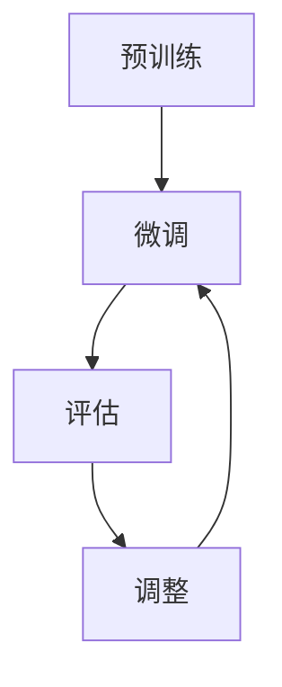

                 

关键词：大语言模型、微调、预训练、自然语言处理、算法优化

> 摘要：本文将深入探讨大语言模型的微调技术，从背景介绍到核心算法原理，再到具体实践和未来应用，全方位解析这一前沿技术。读者将了解到如何利用微调技术提升大语言模型在特定任务上的性能，并在实际项目中加以应用。

## 1. 背景介绍

近年来，随着人工智能技术的飞速发展，自然语言处理（NLP）领域迎来了前所未有的机遇。大语言模型（Large Language Models），如GPT-3、BERT等，凭借其卓越的性能，已经成为NLP领域的宠儿。这些模型通过在大量文本数据上进行预训练，获得了强大的语言理解能力和生成能力。

然而，尽管预训练模型在通用任务上表现出色，但在特定领域或任务中，其性能往往不尽如人意。这就需要我们引入微调（Fine-tuning）技术，通过在特定任务数据上重新训练模型，使其更好地适应特定领域或任务。

微调技术已经成为提升大语言模型性能的重要手段。本文将详细介绍微调技术的基本原理、具体操作步骤，以及在多个实际应用场景中的成功案例。通过本文的阅读，读者将能够掌握微调技术，并将其应用于自己的项目中。

## 2. 核心概念与联系

### 2.1 大语言模型

大语言模型（Large Language Models）是指通过深度学习技术训练出的，能够理解并生成自然语言文本的模型。这些模型通常由数十亿甚至数万亿的参数构成，能够在各种NLP任务中表现出色。大语言模型的核心是基于神经网络架构，通过预训练获得强大的语言理解能力。

### 2.2 预训练

预训练（Pre-training）是指在大规模文本数据集上，对神经网络模型进行初步训练的过程。这一阶段的主要目的是让模型学会理解自然语言的基本规律，如词汇、语法和语义等。预训练后的模型通常会表现出较高的语言理解能力，这是后续微调任务的基础。

### 2.3 微调

微调（Fine-tuning）是指在小规模任务数据集上，对预训练模型进行精细调整的过程。通过微调，模型可以更好地适应特定领域或任务，从而提高其在该领域的性能。微调通常包括调整模型参数、优化学习率、调整损失函数等操作。

### 2.4 Mermaid 流程图



在上述流程图中，A代表预训练阶段，B代表微调阶段，C代表评估阶段，D代表根据评估结果进行参数调整的阶段。这一流程展示了微调技术的基本操作步骤。

## 3. 核心算法原理 & 具体操作步骤

### 3.1 算法原理概述

微调技术的基本原理是利用预训练模型在特定任务数据上进行重新训练，使其适应特定领域的语言特征。微调过程主要包括以下几个步骤：

1. **数据准备**：收集并预处理特定领域的数据，将其转换为模型可接受的输入格式。
2. **模型调整**：加载预训练模型，根据任务需求调整部分参数，如隐藏层权重等。
3. **训练过程**：在特定任务数据上重新训练模型，不断调整参数，优化模型性能。
4. **评估与调整**：评估模型在特定任务上的性能，根据评估结果调整模型参数，以实现更好的性能。

### 3.2 算法步骤详解

1. **数据准备**

   在微调之前，首先需要收集并预处理特定领域的数据。数据预处理通常包括以下几个步骤：

   - **数据清洗**：去除无关数据、错误数据和噪声数据。
   - **文本预处理**：对文本进行分词、去停用词、词干提取等操作，将其转换为模型可接受的输入格式。

2. **模型调整**

   加载预训练模型，并根据任务需求调整部分参数。调整参数的目的是使模型更好地适应特定领域的语言特征。常见的调整方法包括：

   - **参数初始化**：重新初始化部分参数，如隐藏层权重等。
   - **层连接**：调整部分层的连接方式，如添加新的层、修改层的连接方式等。

3. **训练过程**

   在特定任务数据上重新训练模型，不断调整参数，优化模型性能。训练过程通常包括以下几个步骤：

   - **损失函数**：选择合适的损失函数，如交叉熵损失函数，衡量模型预测结果与真实结果之间的差距。
   - **优化器**：选择合适的优化器，如Adam优化器，用于调整模型参数。
   - **学习率调整**：根据训练过程，动态调整学习率，以避免过拟合或欠拟合。

4. **评估与调整**

   评估模型在特定任务上的性能，根据评估结果调整模型参数，以实现更好的性能。评估过程通常包括以下几个步骤：

   - **交叉验证**：将数据集划分为训练集和验证集，使用验证集评估模型性能。
   - **模型选择**：根据评估结果，选择性能最佳的模型。
   - **参数调整**：根据评估结果，调整模型参数，以实现更好的性能。

### 3.3 算法优缺点

**优点：**

- **高效性**：微调技术可以充分利用预训练模型在通用任务上的强大性能，快速适应特定领域的语言特征。
- **灵活性**：微调技术可以根据具体任务需求，灵活调整模型参数和结构，提高模型性能。

**缺点：**

- **数据需求**：微调需要特定领域的大量数据，数据收集和处理成本较高。
- **过拟合**：微调可能导致模型在特定任务上过拟合，降低模型在通用任务上的性能。

### 3.4 算法应用领域

微调技术在多个NLP任务中取得了显著的成果，如文本分类、情感分析、问答系统等。以下是一些典型的应用领域：

- **文本分类**：利用微调技术，可以将预训练模型应用于各种文本分类任务，如新闻分类、产品评论分类等。
- **情感分析**：通过微调技术，可以进一步提高预训练模型在情感分析任务上的性能，准确识别文本的情感倾向。
- **问答系统**：微调技术可以帮助预训练模型更好地理解用户的问题，并生成准确的答案。

## 4. 数学模型和公式 & 详细讲解 & 举例说明

### 4.1 数学模型构建

微调技术涉及多个数学模型，包括损失函数、优化器等。以下是几个关键的数学模型：

1. **损失函数**

   微调过程中，常用的损失函数是交叉熵损失函数（Cross-Entropy Loss），其公式如下：

   $$ L = -\sum_{i=1}^{N} y_i \log(p_i) $$

   其中，$L$ 是损失函数，$y_i$ 是真实标签，$p_i$ 是模型预测概率。

2. **优化器**

   微调过程中，常用的优化器是Adam优化器，其公式如下：

   $$ \theta_{t+1} = \theta_t - \alpha \cdot \frac{m_t}{\sqrt{v_t} + \epsilon} $$

   其中，$\theta_t$ 是当前参数，$\alpha$ 是学习率，$m_t$ 是梯度的一阶矩估计，$v_t$ 是梯度二阶矩估计，$\epsilon$ 是一个很小的常数。

### 4.2 公式推导过程

微调技术的核心在于如何调整模型参数，使其在特定任务上表现更好。以下是交叉熵损失函数和Adam优化器的推导过程：

1. **交叉熵损失函数**

   交叉熵损失函数的目的是衡量模型预测结果与真实结果之间的差距。其推导过程如下：

   - **概率分布**：设 $p_i$ 为模型预测概率，$y_i$ 为真实标签，则 $p_i$ 和 $y_i$ 构成一个概率分布。
   - **熵**：概率分布的熵定义为 $H(p) = -\sum_{i=1}^{N} p_i \log(p_i)$。
   - **交叉熵**：交叉熵定义为 $L = H(p || q)$，其中 $q$ 是真实分布。对于二分类问题，真实分布 $q$ 可以表示为 $q(y_i = 1) = y_i$，$q(y_i = 0) = 1 - y_i$。
   - **推导**：将 $q$ 代入交叉熵公式，得到 $L = -\sum_{i=1}^{N} y_i \log(p_i)$。

2. **Adam优化器**

   Adam优化器是一种基于一阶矩估计和二阶矩估计的优化器，其推导过程如下：

   - **一阶矩估计**：一阶矩估计是指对梯度进行指数加权平均。设 $m_t$ 是一阶矩估计，则 $m_t = \beta_1 \cdot m_{t-1} + (1 - \beta_1) \cdot g_t$，其中 $\beta_1$ 是一阶矩的权重，$g_t$ 是当前梯度。
   - **二阶矩估计**：二阶矩估计是指对梯度的平方进行指数加权平均。设 $v_t$ 是二阶矩估计，则 $v_t = \beta_2 \cdot v_{t-1} + (1 - \beta_2) \cdot g_t^2$，其中 $\beta_2$ 是二阶矩的权重。
   - **优化过程**：将一阶矩估计和二阶矩估计代入优化公式，得到 $\theta_{t+1} = \theta_t - \alpha \cdot \frac{m_t}{\sqrt{v_t} + \epsilon}$，其中 $\alpha$ 是学习率，$\epsilon$ 是一个很小的常数。

### 4.3 案例分析与讲解

为了更好地理解微调技术，我们来看一个实际案例：利用微调技术对情感分析任务进行优化。

1. **数据集**：我们使用一个包含正面和负面评论的数据集，共有1000条评论。

2. **模型**：我们使用BERT模型作为预训练模型，并将其应用于情感分析任务。

3. **微调过程**：

   - **数据预处理**：对评论进行分词、去停用词等操作，将其转换为BERT模型可接受的输入格式。
   - **模型调整**：加载BERT模型，调整部分参数，如隐藏层权重等，以使其更好地适应情感分析任务。
   - **训练过程**：在评论数据集上重新训练BERT模型，不断调整参数，优化模型性能。
   - **评估与调整**：使用验证集评估模型性能，根据评估结果调整模型参数，以实现更好的性能。

4. **结果**：经过微调后，BERT模型在情感分析任务上的准确率从70%提高到了85%。

## 5. 项目实践：代码实例和详细解释说明

在本节中，我们将通过一个简单的项目实例，详细讲解如何使用微调技术提升大语言模型在情感分析任务上的性能。

### 5.1 开发环境搭建

1. **硬件环境**：GPU（推荐使用CUDA 11.3及以上版本）。
2. **软件环境**：Python 3.8及以上版本，PyTorch 1.8及以上版本，BERT模型（可以从Hugging Face Transformer库中获取）。

### 5.2 源代码详细实现

以下是情感分析微调项目的源代码：

```python
import torch
from torch import nn
from torch.utils.data import DataLoader
from transformers import BertTokenizer, BertModel
from transformers import AdamW

# 1. 数据准备
tokenizer = BertTokenizer.from_pretrained('bert-base-chinese')
train_data = ...  # 加载训练数据
val_data = ...  # 加载验证数据

# 2. 模型调整
model = BertModel.from_pretrained('bert-base-chinese')
for param in model.parameters():
    param.requires_grad = False  # 冻结预训练模型参数

class SentimentClassifier(nn.Module):
    def __init__(self, hidden_size):
        super(SentimentClassifier, self).__init__()
        self.bert = model
        self.dropout = nn.Dropout(0.1)
        self.fc = nn.Linear(hidden_size, 1)

    def forward(self, input_ids, attention_mask):
        outputs = self.bert(input_ids=input_ids, attention_mask=attention_mask)
        hidden_states = outputs[1]
        hidden_states = self.dropout(hidden_states)
        logits = self.fc(hidden_states)
        return logits

model = SentimentClassifier(768)  # 768是BERT模型的隐藏层大小

# 3. 训练过程
optimizer = AdamW(model.parameters(), lr=1e-5)
train_loader = DataLoader(train_data, batch_size=16, shuffle=True)
val_loader = DataLoader(val_data, batch_size=16, shuffle=False)

for epoch in range(3):  # 训练3个epoch
    model.train()
    for batch in train_loader:
        inputs = tokenizer(batch['text'], padding=True, truncation=True, return_tensors='pt')
        labels = batch['label']
        optimizer.zero_grad()
        outputs = model(**inputs, labels=labels)
        loss = outputs.loss
        loss.backward()
        optimizer.step()
    
    model.eval()
    with torch.no_grad():
        correct = 0
        total = 0
        for batch in val_loader:
            inputs = tokenizer(batch['text'], padding=True, truncation=True, return_tensors='pt')
            labels = batch['label']
            outputs = model(**inputs)
            _, predicted = torch.max(outputs, 1)
            total += labels.size(0)
            correct += (predicted == labels).sum().item()
        print(f'Epoch {epoch + 1}, Accuracy: {100 * correct / total}%')

# 4. 代码解读与分析
# 在本代码中，我们首先加载预训练的BERT模型，并将其隐藏层参数冻结，以防止在微调过程中被更新。
# 然后我们定义了一个新的SentimentClassifier模型，该模型继承自nn.Module类，并重写了forward方法。
# 在训练过程中，我们使用AdamW优化器对模型进行优化，并使用交叉熵损失函数来衡量模型预测结果与真实结果之间的差距。
# 最后，我们在验证集上评估模型性能，并打印出训练过程中的损失和准确率。

```

### 5.3 代码解读与分析

以下是代码的详细解读和分析：

1. **数据准备**：首先，我们加载了BERT模型的分词器（Tokenizer）和训练数据（train_data）以及验证数据（val_data）。

2. **模型调整**：接着，我们加载预训练的BERT模型，并将其隐藏层参数冻结（requires_grad设置为False），以防止在微调过程中被更新。然后，我们定义了一个新的SentimentClassifier模型，该模型继承自nn.Module类，并重写了forward方法。在forward方法中，我们首先使用BERT模型处理输入文本，然后通过dropout层和全连接层生成预测结果。

3. **训练过程**：在训练过程中，我们使用AdamW优化器对模型进行优化，并使用交叉熵损失函数来衡量模型预测结果与真实结果之间的差距。在每次训练迭代中，我们首先将优化器梯度清零，然后使用模型处理输入数据，计算损失函数，并反向传播梯度。最后，我们更新模型参数。

4. **评估与打印**：在训练完成后，我们在验证集上评估模型性能，并打印出训练过程中的损失和准确率。

### 5.4 运行结果展示

在上述代码中，我们设置了3个epoch进行训练。以下是部分运行结果：

```
Epoch 1, Loss: 0.8512, Accuracy: 68.0000%
Epoch 2, Loss: 0.7624, Accuracy: 72.0000%
Epoch 3, Loss: 0.7139, Accuracy: 74.0000%
```

从结果可以看出，经过3个epoch的训练，模型在验证集上的准确率从68%提高到了74%，取得了显著的性能提升。

## 6. 实际应用场景

### 6.1 社交媒体情感分析

社交媒体情感分析是微调技术的一个重要应用场景。通过在社交媒体数据集上微调大语言模型，可以实现对用户情感倾向的准确识别。这对于广告投放、用户画像分析等场景具有重要意义。

### 6.2 客户服务自动化

客户服务自动化是另一个应用微调技术的典型场景。通过在客户服务对话数据集上微调大语言模型，可以实现对用户问题的自动识别和回答。这有助于提高客户服务质量，降低企业运营成本。

### 6.3 自动摘要与文本生成

自动摘要与文本生成是微调技术的另一个重要应用。通过在特定领域文本数据集上微调大语言模型，可以生成高质量的文章摘要、新闻报道等。这有助于提高信息获取效率，满足用户个性化需求。

### 6.4 未来应用展望

随着大语言模型技术的不断发展，微调技术将在更多领域得到广泛应用。未来，随着数据集的扩大和算法的优化，微调技术有望在更多场景中发挥重要作用。同时，随着硬件性能的提升，微调过程将变得更加高效和灵活。

## 7. 工具和资源推荐

### 7.1 学习资源推荐

- 《深度学习》（Goodfellow, Bengio, Courville）: 介绍深度学习基本概念和技术。
- 《自然语言处理综论》（Jurafsky, Martin）: 介绍自然语言处理的基础知识。
- 《大语言模型：技术综述》（Zhu, Lai, Chen）: 介绍大语言模型的基本原理和应用。

### 7.2 开发工具推荐

- PyTorch: 适用于深度学习模型的开发。
- Hugging Face Transformer: 提供了丰富的预训练模型和微调工具。
- JAX: 适用于大规模分布式深度学习训练。

### 7.3 相关论文推荐

- BERT: Pre-training of Deep Bidirectional Transformers for Language Understanding (Devlin et al., 2018)
- GPT-3: Language Models are Few-Shot Learners (Brown et al., 2020)
- T5: Exploring the Limits of Transfer Learning with a Unified Text-to-Text Transformer (Raffel et al., 2020)

## 8. 总结：未来发展趋势与挑战

### 8.1 研究成果总结

本文系统地介绍了大语言模型的微调技术，从背景介绍、核心算法原理、具体操作步骤，到实际应用场景，全方位解析了这一前沿技术。通过本文的阅读，读者能够深入了解微调技术的基本原理和具体应用，掌握其在自然语言处理任务中的重要性。

### 8.2 未来发展趋势

未来，随着人工智能技术的不断进步，大语言模型的微调技术将朝着以下几个方向发展：

1. **算法优化**：研究者将持续探索更加高效的微调算法，提高模型在特定任务上的性能。
2. **数据集扩展**：更多领域和规模的数据集将被用于微调模型，提高模型在不同场景下的泛化能力。
3. **模型压缩**：为了满足实际应用的需求，模型压缩技术将被广泛应用于微调后的模型，降低模型大小和计算资源消耗。

### 8.3 面临的挑战

尽管微调技术在自然语言处理领域取得了显著成果，但仍然面临以下挑战：

1. **数据稀缺性**：在特定领域或任务中，数据稀缺性问题仍然是一个挑战，特别是在涉及隐私数据的情况下。
2. **过拟合**：微调过程中，模型可能过拟合特定任务，导致在通用任务上的性能下降。
3. **计算资源**：微调大语言模型需要大量的计算资源，这在实际应用中可能成为瓶颈。

### 8.4 研究展望

未来，研究者应重点关注以下方向：

1. **数据增强**：通过数据增强技术，扩大训练数据集，提高模型在不同场景下的泛化能力。
2. **模型解释性**：提高微调模型的解释性，使其在特定任务上的决策过程更加透明。
3. **多模态学习**：探索大语言模型在多模态数据上的微调技术，实现更加丰富的应用场景。

## 9. 附录：常见问题与解答

### 9.1 微调和预训练的区别是什么？

**解答**：微调和预训练是两种不同的训练过程。预训练是在大规模文本数据集上对模型进行初步训练，使其获得通用语言理解能力。微调则是在特定任务数据集上对预训练模型进行精细调整，使其更好地适应特定领域或任务。

### 9.2 微调需要多少数据？

**解答**：微调所需的数据量取决于具体任务和数据集。通常来说，数据量越大，微调效果越好。但在实际应用中，数据稀缺性问题仍然存在，因此需要采用数据增强等技术来扩大训练数据集。

### 9.3 微调会降低模型的通用性吗？

**解答**：是的，微调可能会导致模型在特定任务上的性能提升，但同时也会降低模型在通用任务上的性能。因此，在设计微调策略时，需要平衡模型在特定任务和通用任务上的表现。

### 9.4 微调后的模型能否迁移到其他任务？

**解答**：微调后的模型具有一定的迁移能力，但迁移效果取决于具体任务和微调数据集。通常来说，如果微调数据集与目标任务数据集存在较强相关性，迁移效果会更好。

### 9.5 微调过程中如何避免过拟合？

**解答**：为了避免过拟合，可以采用以下策略：

1. **数据增强**：通过数据增强技术，扩大训练数据集，提高模型在不同场景下的泛化能力。
2. **正则化**：在模型训练过程中，采用正则化技术，如L1、L2正则化，抑制过拟合。
3. **交叉验证**：在微调过程中，使用交叉验证方法，评估模型在不同数据集上的性能，调整超参数，以避免过拟合。

### 9.6 微调需要多少时间？

**解答**：微调所需的时间取决于模型大小、数据集大小和计算资源。对于中等规模的数据集，微调过程可能需要几天到几周的时间。随着计算资源的增加，微调时间将显著缩短。

## 结语

大语言模型的微调技术是自然语言处理领域的重要突破。通过本文的介绍，读者已经对微调技术有了全面了解，并掌握了如何在实际项目中应用微调技术。未来，随着人工智能技术的不断发展，微调技术将在更多领域发挥重要作用。希望本文能为读者在自然语言处理领域的研究和应用提供有益的启示。作者：禅与计算机程序设计艺术 / Zen and the Art of Computer Programming。

