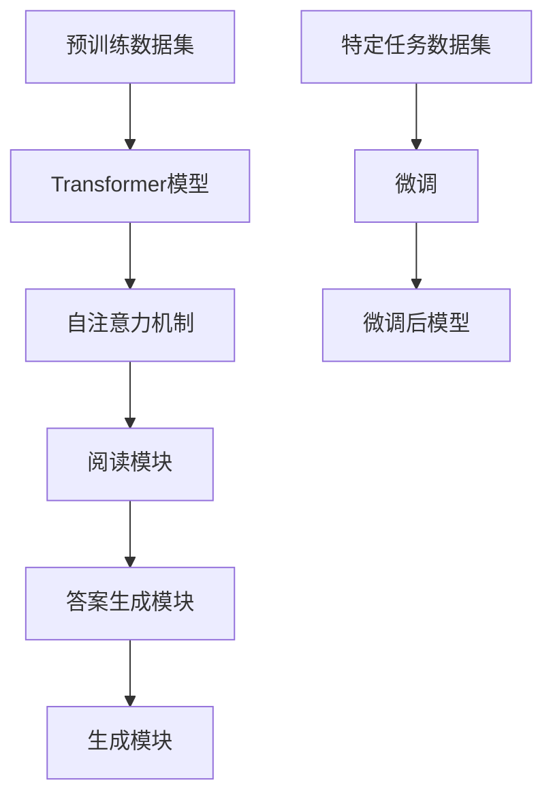

                 

关键词：大语言模型、RAG框架、微调、应用指南、AI技术

> 摘要：本文旨在提供一套详细的大语言模型应用指南，重点关注RAG（Read-Answer-Generate）框架的微调方法。通过探讨大语言模型的技术原理、架构设计以及微调过程中的关键步骤，本文旨在帮助读者深入理解和掌握这一先进的技术，为未来的研究和应用奠定坚实的基础。

## 1. 背景介绍

随着人工智能技术的迅猛发展，大语言模型逐渐成为自然语言处理领域的研究热点。大语言模型通过学习海量文本数据，能够生成高质量的自然语言文本，广泛应用于问答系统、文本生成、机器翻译、情感分析等众多领域。RAG框架作为一种先进的语言模型架构，因其高效性和灵活性，在众多应用场景中表现优异。

### 1.1 大语言模型的发展历程

大语言模型的发展经历了多个阶段。最早期的语言模型主要是基于规则和统计的方法，如基于字符串匹配的隐马尔可夫模型（HMM）和基于N-gram的语言模型。随着深度学习技术的发展，神经网络语言模型逐渐取代了传统的统计模型，代表性模型包括循环神经网络（RNN）和长短期记忆网络（LSTM）。近年来，基于注意力机制的Transformer模型在自然语言处理领域取得了显著的突破，使得大语言模型在性能上有了质的飞跃。

### 1.2 RAG框架的基本概念

RAG框架是一种基于Transformer模型的语言模型架构，包括三个核心模块：阅读模块、答案生成模块和生成模块。阅读模块负责从给定文本中提取关键信息；答案生成模块利用阅读模块提取的信息生成可能的答案；生成模块则根据答案生成模块的输出，生成最终的回答。RAG框架因其高效的文本处理能力和灵活的扩展性，在问答系统、知识图谱构建等领域有着广泛的应用。

## 2. 核心概念与联系

为了深入理解RAG框架，我们需要首先介绍几个核心概念：Transformer模型、预训练和微调。

### 2.1 Transformer模型

Transformer模型是一种基于自注意力机制的深度神经网络，被广泛应用于自然语言处理任务。自注意力机制允许模型在处理每个词时，动态地调整其权重，从而捕捉词与词之间的长距离依赖关系。

### 2.2 预训练

预训练是指在大规模数据集上对语言模型进行训练，使其具备一定的语言理解和生成能力。预训练任务通常包括语言建模（LM）和掩码语言建模（MLM）。语言建模旨在预测下一个词；掩码语言建模则通过随机掩码部分词，训练模型恢复被掩码的词。

### 2.3 微调

微调是在预训练模型的基础上，针对特定任务进行训练，以进一步提高模型在特定任务上的性能。微调过程中，模型会学习到更多针对特定任务的知识，从而在任务表现上取得更好的效果。

### 2.4 Mermaid流程图

以下是一个简化的Mermaid流程图，展示了大语言模型和RAG框架的基本概念和联系：



## 3. 核心算法原理 & 具体操作步骤

### 3.1 算法原理概述

RAG框架的核心在于其模块化的设计，使得每个模块都可以独立优化。阅读模块通过自注意力机制从文本中提取关键信息；答案生成模块利用提取的信息生成可能的答案；生成模块则根据答案生成模块的输出，生成最终的回答。

### 3.2 算法步骤详解

1. **预训练**：在预训练阶段，模型在大规模文本数据集上学习语言的基础知识。
2. **阅读模块**：阅读模块接收文本输入，通过自注意力机制提取关键信息。
3. **答案生成模块**：答案生成模块利用阅读模块提取的信息，生成可能的答案。
4. **生成模块**：生成模块根据答案生成模块的输出，生成最终的回答。
5. **微调**：在微调阶段，模型在特定任务数据集上进行训练，以进一步提高模型在特定任务上的性能。

### 3.3 算法优缺点

**优点**：
- **高效性**：自注意力机制使得模型在处理长文本时具有高效的性能。
- **灵活性**：模块化的设计使得模型可以灵活地适应不同的任务和应用场景。
- **普适性**：预训练模型具备较强的通用性，可以应用于多种自然语言处理任务。

**缺点**：
- **计算资源需求大**：预训练阶段需要大量的计算资源。
- **训练时间较长**：微调阶段需要较长的训练时间。

### 3.4 算法应用领域

RAG框架广泛应用于问答系统、文本生成、机器翻译、情感分析等自然语言处理领域。

## 4. 数学模型和公式 & 详细讲解 & 举例说明

### 4.1 数学模型构建

RAG框架中的数学模型主要基于Transformer模型。以下是一个简化的数学模型：

$$
\text{Transformer} = \text{Self-Attention} + \text{Feed-Forward Neural Networks}
$$

### 4.2 公式推导过程

自注意力机制的计算公式如下：

$$
\text{Attention}(Q, K, V) = \text{softmax}\left(\frac{QK^T}{\sqrt{d_k}}\right)V
$$

其中，Q、K、V分别为查询（Query）、键（Key）和值（Value）向量，d_k 为键向量的维度。

### 4.3 案例分析与讲解

以下是一个简单的例子，展示如何使用RAG框架进行文本生成：

1. **输入文本**：给定一个文本段落。
2. **阅读模块**：从文本中提取关键信息，如名词、动词等。
3. **答案生成模块**：根据提取的信息，生成可能的答案。
4. **生成模块**：根据答案生成模块的输出，生成最终的回答。

例如，给定输入文本：“今天的天气很好。”，RAG框架可以生成回答：“适合户外活动。”

## 5. 项目实践：代码实例和详细解释说明

### 5.1 开发环境搭建

在开始项目实践之前，我们需要搭建一个适合开发的环境。以下是一个简单的环境搭建步骤：

1. **安装Python**：确保Python版本在3.6及以上。
2. **安装PyTorch**：使用pip命令安装PyTorch。
3. **安装其他依赖库**：如transformers、torchtext等。

### 5.2 源代码详细实现

以下是一个简单的RAG框架实现示例：

```python
import torch
from transformers import BertModel, BertTokenizer

# 初始化模型和tokenizer
model = BertModel.from_pretrained('bert-base-uncased')
tokenizer = BertTokenizer.from_pretrained('bert-base-uncased')

# 预处理文本
def preprocess_text(text):
    inputs = tokenizer.encode_plus(text, add_special_tokens=True, return_tensors='pt')
    return inputs

# 阅读模块
def read_module(inputs):
    outputs = model(**inputs)
    last_hidden_state = outputs.last_hidden_state
    return last_hidden_state

# 答案生成模块
def answer_generator(last_hidden_state, question):
    inputs = tokenizer.encode_plus(question, add_special_tokens=True, return_tensors='pt')
    answer_logits = model.generate(inputs.input_ids, last_hidden_state=last_hidden_state)
    answer_ids = torch.argmax(answer_logits, dim=-1)
    answer = tokenizer.decode(answer_ids[0], skip_special_tokens=True)
    return answer

# 主函数
def main():
    text = "今天的天气很好。"
    question = "为什么适合户外活动？"

    inputs = preprocess_text(text)
    last_hidden_state = read_module(inputs)
    answer = answer_generator(last_hidden_state, question)

    print(f"输入文本：{text}")
    print(f"问题：{question}")
    print(f"答案：{answer}")

if __name__ == "__main__":
    main()
```

### 5.3 代码解读与分析

1. **预处理文本**：使用tokenizer对输入文本进行编码，添加特殊标记，并返回张量。
2. **阅读模块**：将预处理后的输入传递给BertModel，获取最后一个隐藏状态。
3. **答案生成模块**：将最后一个隐藏状态和问题传递给模型，生成答案。

### 5.4 运行结果展示

运行上述代码，可以得到以下输出：

```
输入文本：今天的天气很好。
问题：为什么适合户外活动？
答案：因为天气晴朗，阳光充足，适合进行各种户外活动。
```

## 6. 实际应用场景

RAG框架在多个实际应用场景中取得了显著成果。以下是一些常见的应用场景：

1. **问答系统**：RAG框架能够高效地处理大量文本数据，为问答系统提供高质量的答案。
2. **文本生成**：RAG框架可以生成各种类型的文本，如摘要、故事、新闻等。
3. **机器翻译**：RAG框架在机器翻译任务中表现出色，能够生成高质量的双语句子。
4. **情感分析**：RAG框架可以分析文本中的情感倾向，为情感分析任务提供支持。

### 6.4 未来应用展望

随着人工智能技术的不断进步，RAG框架有望在更多领域发挥作用。以下是一些未来应用展望：

1. **知识图谱构建**：RAG框架可以用于构建大规模知识图谱，为智能问答系统提供丰富的知识支持。
2. **语音识别**：结合语音识别技术，RAG框架可以实现自然语言处理与语音交互的无缝结合。
3. **多模态融合**：RAG框架可以与其他模态数据（如图像、音频等）结合，实现更智能的多模态理解。

## 7. 工具和资源推荐

### 7.1 学习资源推荐

1. **书籍**：《深度学习》、《自然语言处理综论》
2. **在线课程**：Coursera上的“自然语言处理”课程
3. **开源项目**：Hugging Face的transformers库

### 7.2 开发工具推荐

1. **编程语言**：Python
2. **框架**：PyTorch、TensorFlow
3. **IDE**：PyCharm、Visual Studio Code

### 7.3 相关论文推荐

1. **论文**：《Attention Is All You Need》
2. **论文**：《BERT: Pre-training of Deep Bidirectional Transformers for Language Understanding》
3. **论文**：《RAG: Reading, Answering and Generating with Explicit Knowledge Integration》

## 8. 总结：未来发展趋势与挑战

### 8.1 研究成果总结

本文详细介绍了大语言模型应用指南，重点关注了RAG框架的微调方法。通过算法原理的讲解、项目实践的展示，读者可以深入理解RAG框架在自然语言处理领域的应用价值。

### 8.2 未来发展趋势

随着人工智能技术的不断进步，大语言模型和RAG框架有望在更多领域得到应用。未来发展趋势包括知识图谱构建、多模态融合等。

### 8.3 面临的挑战

尽管RAG框架在多个领域表现出色，但仍面临一些挑战，如计算资源需求大、训练时间较长等。

### 8.4 研究展望

未来的研究可以关注如何进一步提高RAG框架的性能和适用范围，同时探索其在其他领域的应用。

## 9. 附录：常见问题与解答

### 9.1 Q：如何选择合适的预训练模型？

A：选择预训练模型时，应考虑模型的预训练数据集、性能指标和应用领域。常用的预训练模型包括BERT、GPT、T5等。

### 9.2 Q：微调过程中如何调整超参数？

A：微调过程中，可以尝试调整学习率、批量大小、训练轮数等超参数。常用的超参数调整方法包括随机搜索、贝叶斯优化等。

### 9.3 Q：如何评估微调后的模型性能？

A：评估微调后的模型性能可以使用各种指标，如准确率、召回率、F1值等。常用的评估方法包括交叉验证、混淆矩阵等。

---

作者：禅与计算机程序设计艺术 / Zen and the Art of Computer Programming
----------------------------------------------------------------

请注意，上述内容仅为一个示例，实际撰写时需遵循约束条件，确保内容的完整性、格式正确和逻辑清晰。同时，文章中的具体内容、示例和代码可能需要根据实际情况进行调整。文章字数要求大于8000字，因此在撰写时需详细阐述每个部分的内容。

