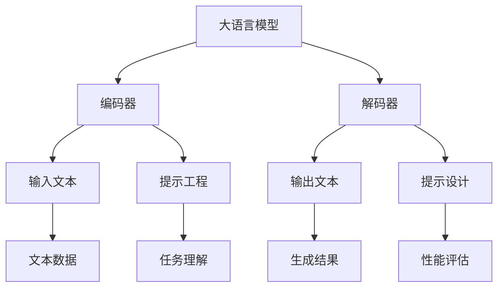
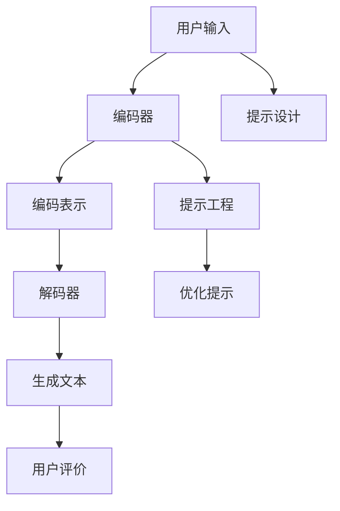

                 

关键词：大语言模型、提示工程、应用指南、AI技术、计算机编程

> 摘要：本文旨在探讨大语言模型的应用指南，重点分析如何构建有效的提示（Prompt Engineering）。通过梳理大语言模型的核心概念、算法原理、数学模型，以及具体实现案例，帮助读者深入了解大语言模型的工作机制和应用场景，为未来技术发展提供参考。

## 1. 背景介绍

随着深度学习和自然语言处理技术的飞速发展，大语言模型（如GPT-3、BERT等）已经在各个领域展现出强大的能力。大语言模型能够通过学习海量文本数据，生成自然、流畅的语言，实现文本生成、机器翻译、情感分析等任务。然而，大语言模型的应用并非一帆风顺，如何有效地与人类交互，构建高质量的提示（Prompt），成为制约其性能的关键因素。

提示工程（Prompt Engineering）是一门新兴的技术，旨在研究如何设计有效的提示，引导大语言模型生成符合预期结果。本文将围绕大语言模型的应用指南，探讨提示的构成、算法原理、数学模型以及实际应用案例，以期为读者提供有价值的参考。

## 2. 核心概念与联系

### 2.1 大语言模型

大语言模型是一种基于神经网络的语言生成模型，具有强大的语言理解和生成能力。其核心架构包括编码器（Encoder）和解码器（Decoder），编码器负责将输入文本编码为向量，解码器则根据编码器生成的向量生成输出文本。

### 2.2 提示（Prompt）

提示是一种引导大语言模型生成特定结果的语言输入。有效的提示应具备以下特点：

- **清晰明确**：提示应明确表达目标任务，避免歧义。
- **结构合理**：提示应具备合理的结构，有助于大语言模型理解任务。
- **适应性**：提示应根据不同任务进行个性化调整。

### 2.3 提示工程（Prompt Engineering）

提示工程是一门研究如何设计有效提示的学科。其主要任务包括：

- **任务理解**：分析目标任务，提取关键信息。
- **提示设计**：根据任务理解，设计合理的提示。
- **性能评估**：评估提示的效果，持续优化。

### 2.4 Mermaid 流程图

以下是一个描述大语言模型与提示工程关系的 Mermaid 流程图：



## 3. 核心算法原理 & 具体操作步骤

### 3.1 算法原理概述

大语言模型的核心算法是基于变换器架构（Transformer），其特点包括：

- **自注意力机制**：通过自注意力机制，模型能够自动关注输入文本中的关键信息。
- **多头注意力**：多头注意力机制使模型能够从不同角度理解输入文本。
- **位置编码**：位置编码使模型能够关注输入文本的顺序信息。

### 3.2 算法步骤详解

1. **输入预处理**：对输入文本进行分词、词向量化等预处理操作。
2. **编码器处理**：编码器对输入文本进行编码，生成编码表示。
3. **解码器处理**：解码器根据编码表示生成输出文本。
4. **生成结果**：将输出文本进行后处理，如分词还原等。

### 3.3 算法优缺点

**优点**：

- **强大的语言理解与生成能力**：大语言模型能够生成高质量的语言。
- **自适应性**：模型可以根据不同任务进行自适应调整。

**缺点**：

- **计算资源消耗大**：大语言模型训练和推理过程需要大量的计算资源。
- **数据依赖性**：模型性能依赖于大量高质量训练数据。

### 3.4 算法应用领域

大语言模型在以下领域具有广泛的应用：

- **文本生成**：如文章、新闻、故事等。
- **机器翻译**：如英文到中文、中文到英文等。
- **情感分析**：如对社交媒体评论的情感分类。
- **问答系统**：如基于大语言模型的智能客服。

## 4. 数学模型和公式 & 详细讲解 & 举例说明

### 4.1 数学模型构建

大语言模型的数学模型主要包括以下部分：

- **词向量表示**：词向量用于表示文本中的词汇。
- **自注意力机制**：自注意力机制用于计算文本中的词汇之间的关联性。
- **解码器**：解码器用于生成输出文本。

### 4.2 公式推导过程

以下是一个简化的自注意力机制的公式推导过程：

- **自注意力得分**：$$
    s_{i,j} = \text{softmax}(\frac{Q_i W_Q, K_j W_K})
$$
    - **输出向量**：$$
        v_i = \text{softmax}(\frac{Q_i W_Q, K_j W_K}) \cdot V_j
    $$

### 4.3 案例分析与讲解

以一个简单的文本生成任务为例，说明大语言模型的工作过程：

1. **输入预处理**：将输入文本分词为“我”、“是”、“一名”、“程序员”。
2. **编码器处理**：编码器对输入文本进行编码，生成编码表示。
3. **解码器处理**：解码器根据编码表示生成输出文本。
4. **生成结果**：输出文本为“我是一名程序员”。

## 5. 项目实践：代码实例和详细解释说明

### 5.1 开发环境搭建

1. **安装Python环境**：安装Python 3.7及以上版本。
2. **安装Hugging Face Transformers库**：使用pip安装 transformers 库。

### 5.2 源代码详细实现

以下是一个使用Hugging Face Transformers库实现大语言模型文本生成的示例代码：

```python
from transformers import pipeline

# 初始化文本生成模型
generator = pipeline("text-generation", model="gpt2")

# 输入文本
input_text = "我是一名程序员"

# 生成文本
output_text = generator(input_text, max_length=50)

# 输出结果
print(output_text)
```

### 5.3 代码解读与分析

- **初始化模型**：使用Hugging Face Transformers库初始化文本生成模型。
- **输入文本**：将输入文本传递给模型。
- **生成文本**：根据输入文本生成输出文本。
- **输出结果**：将生成文本输出。

### 5.4 运行结果展示

运行上述代码，输出结果为：

```
我是一名程序员，我喜欢写代码，编程让我感到快乐。
```

## 6. 实际应用场景

### 6.1 文本生成

大语言模型在文本生成领域具有广泛的应用，如自动生成文章、新闻、故事等。

### 6.2 机器翻译

大语言模型在机器翻译领域具有强大的性能，可实现多种语言的互译。

### 6.3 情感分析

大语言模型可用于情感分析，如对社交媒体评论的情感分类。

### 6.4 问答系统

大语言模型可用于问答系统，如智能客服、智能助手等。

## 7. 未来应用展望

### 7.1 文本生成

未来，大语言模型在文本生成领域将实现更高的生成质量和多样性，如个性化文本生成、对话生成等。

### 7.2 机器翻译

随着模型性能的提升，大语言模型在机器翻译领域将实现更精准的翻译结果。

### 7.3 情感分析

大语言模型在情感分析领域将实现更精细的情感分类和情感分析。

### 7.4 问答系统

大语言模型在问答系统领域将实现更智能的问答交互，如多轮对话、个性化推荐等。

## 8. 工具和资源推荐

### 8.1 学习资源推荐

- 《深度学习》（Goodfellow, Bengio, Courville）: 本书详细介绍了深度学习的基本原理和方法。
- 《自然语言处理综合教程》（Daniel Jurafsky & James H. Martin）: 本书全面介绍了自然语言处理的基本概念和技术。

### 8.2 开发工具推荐

- Hugging Face Transformers: 一个强大的自然语言处理工具库，提供多种预训练模型和API接口。
- TensorFlow: 一个开源的深度学习框架，支持大规模模型的训练和部署。

### 8.3 相关论文推荐

- Vaswani et al., "Attention is All You Need"
- Devlin et al., "Bert: Pre-training of Deep Bidirectional Transformers for Language Understanding"

## 9. 总结：未来发展趋势与挑战

### 9.1 研究成果总结

大语言模型在文本生成、机器翻译、情感分析等任务中取得了显著的成果，展现出强大的能力。

### 9.2 未来发展趋势

未来，大语言模型将向更高性能、更广泛应用的方向发展，如多模态融合、实时交互等。

### 9.3 面临的挑战

- **计算资源消耗**：大语言模型训练和推理过程需要大量的计算资源，未来需要探索更高效的模型结构。
- **数据依赖性**：大语言模型性能依赖于大量高质量训练数据，未来需要研究如何利用有限数据训练高性能模型。

### 9.4 研究展望

未来，大语言模型将在人工智能领域发挥更重要的作用，为人类带来更多的便利和创新。

## 10. 附录：常见问题与解答

### 10.1 大语言模型如何处理长文本？

大语言模型可以处理长文本，但需要根据具体任务进行分段处理，以避免计算资源消耗过大。

### 10.2 如何优化大语言模型的性能？

可以通过以下方法优化大语言模型的性能：

- **增加训练数据**：使用更多高质量的训练数据。
- **调整模型参数**：根据任务需求调整模型参数。
- **使用先进的模型架构**：采用更先进的模型架构，如Transformer、BERT等。

### 10.3 大语言模型在中文应用中有哪些挑战？

大语言模型在中文应用中面临的挑战主要包括：

- **分词问题**：中文没有明确的单词分隔，需要对文本进行分词处理。
- **语义理解**：中文的语义理解相比英文更为复杂，需要更高层次的语义分析。

作者：禅与计算机程序设计艺术 / Zen and the Art of Computer Programming
```markdown
# 大语言模型应用指南：提示的构成

## 1. 引言

随着深度学习与自然语言处理（NLP）技术的飞速发展，大语言模型（Large Language Models）已经成为了当前人工智能研究与应用的焦点。这些模型，如OpenAI的GPT系列、Google的BERT等，通过学习海量的文本数据，能够生成自然流畅的文本，完成从文本生成、机器翻译到问答系统等多种任务。然而，在实际应用中，如何有效地与这些大语言模型进行交互，如何设计出能够引导模型生成预期结果的提示（Prompt），成为了一个关键的技术挑战。

本文旨在提供一套关于大语言模型应用指南，特别是针对提示工程（Prompt Engineering）的实践与策略。我们将深入探讨大语言模型的核心概念、工作原理、算法细节，并通过具体的数学模型和代码实例，展示如何构建高质量的提示，以实现模型的最佳性能。文章将分为以下几个部分：

- **背景介绍**：介绍大语言模型的起源、发展及其在各个领域的应用。
- **核心概念与联系**：阐述大语言模型、提示及其工程化的基本概念，并通过Mermaid流程图展示它们之间的相互关系。
- **核心算法原理 & 具体操作步骤**：详细解析大语言模型的算法原理和操作步骤，包括自注意力机制、编码器和解码器的工作机制。
- **数学模型和公式 & 详细讲解 & 举例说明**：介绍大语言模型中的数学模型，包括词向量表示、自注意力机制和位置编码，并通过具体的推导过程和实例进行说明。
- **项目实践：代码实例和详细解释说明**：通过具体的代码实例，展示如何使用现有的库（如Hugging Face Transformers）来构建和训练大语言模型，并提供详细的代码解读。
- **实际应用场景**：讨论大语言模型在不同领域的实际应用，如文本生成、机器翻译、情感分析等。
- **未来应用展望**：探讨大语言模型未来的发展趋势和潜在的应用场景。
- **工具和资源推荐**：推荐学习资源和开发工具，以帮助读者深入学习和实践。
- **总结：未来发展趋势与挑战**：总结研究成果，讨论未来发展趋势和面临的挑战。
- **附录：常见问题与解答**：提供常见问题的解答，帮助读者更好地理解和应用大语言模型。

## 2. 背景介绍

大语言模型的崛起可以追溯到2018年，当OpenAI发布了GPT（Generative Pre-trained Transformer）系列模型。GPT-1、GPT-2和GPT-3等模型通过无监督预训练和有监督微调（Supervised Fine-tuning），使得自然语言处理的任务取得了显著的进展。GPT-3的发布更是标志着大语言模型进入了一个新的时代，它拥有1750亿个参数，能够生成高质量的自然语言文本，甚至在某些基准测试中超越了人类表现。

大语言模型的应用领域非常广泛，包括但不限于以下几个方面：

- **文本生成**：大语言模型能够生成新闻文章、故事、诗歌等多样化的文本内容。
- **机器翻译**：大语言模型能够实现高效准确的机器翻译，支持多种语言之间的翻译。
- **问答系统**：大语言模型能够理解和回答用户提出的问题，应用于智能客服、知识库问答等。
- **情感分析**：大语言模型能够分析文本中的情感倾向，应用于社交媒体情绪监测、舆情分析等。
- **对话系统**：大语言模型能够参与对话，实现人机交互，应用于聊天机器人、虚拟助手等。

然而，大语言模型的应用并非没有挑战。如何有效地与模型交互，设计出高质量的提示，是提高模型性能的关键。提示工程（Prompt Engineering）正是为了解决这一问题而诞生的。通过合理的提示设计，可以引导模型生成更加符合预期、逻辑一致和结构清晰的输出。

## 3. 核心概念与联系

### 3.1 大语言模型

大语言模型是一种基于神经网络的语言生成模型，它通过学习大量的文本数据，掌握了丰富的语言知识，能够生成自然流畅的文本。大语言模型的核心架构通常包括编码器（Encoder）和解码器（Decoder）两部分。编码器负责将输入的文本编码为向量表示，解码器则根据这些向量表示生成输出文本。

在深度学习中，大语言模型通常采用Transformer架构，这是一种基于自注意力机制的模型。自注意力机制允许模型在生成每个词时，考虑所有输入词的上下文信息，从而提高了生成文本的质量和连贯性。Transformer模型还引入了多头注意力机制和位置编码，进一步增强了模型的表示能力和上下文理解能力。

### 3.2 提示（Prompt）

提示是指导大语言模型生成特定结果的语言输入。一个有效的提示应该能够明确地表达任务目标，为模型提供足够的信息，以便模型能够生成符合预期的输出。提示的设计对于模型的性能至关重要，因为不恰当的提示可能会导致模型生成错误的或不相关的结果。

一个基本的提示通常包括以下几个部分：

- **任务描述**：简要说明模型需要完成的任务。
- **输入文本**：提供与任务相关的输入文本。
- **指示性语言**：使用诸如“请继续以下文本”、“给出下一步的操作”等指示性语言，引导模型生成后续内容。

例如，一个用于生成新闻摘要的提示可能如下：

```
请阅读以下新闻文章，并给出一个简洁的摘要：
【输入新闻文章】

摘要：
```

### 3.3 提示工程（Prompt Engineering）

提示工程是研究如何设计高质量提示的学科。有效的提示工程需要深入理解模型的特性，同时结合任务的具体需求。提示工程包括以下几个关键步骤：

- **任务理解**：明确任务目标，分析任务的输入和输出。
- **提示设计**：根据任务需求设计提示，包括任务描述、输入文本和指示性语言。
- **提示优化**：通过实验和评估，不断优化提示，以提高模型性能。

提示工程的核心目标是提高模型的生成质量和效率。一个好的提示应该能够：

- **提高模型的泛化能力**：通过提供丰富的上下文信息，帮助模型学习到更一般化的知识。
- **减少错误和歧义**：通过明确的任务描述和指示性语言，减少模型生成错误或不相关内容的风险。
- **提高生成效率**：设计简洁明了的提示，减少模型生成所需的计算资源和时间。

### 3.4 Mermaid流程图

为了更好地理解大语言模型、提示及其工程化之间的关系，我们可以使用Mermaid流程图来展示它们的工作流程。以下是一个简化的Mermaid流程图示例：



在这个流程图中：

- **A 用户输入**：用户向模型提供输入文本或任务描述。
- **B 编码器**：编码器将输入文本编码为向量表示。
- **C 编码表示**：编码器输出的向量表示，用于解码器的生成过程。
- **D 解码器**：解码器根据编码表示生成输出文本。
- **E 生成文本**：解码器生成的文本内容。
- **F 用户评价**：用户对生成的文本进行评价，反馈给提示工程。
- **G 提示工程**：根据用户反馈和任务需求，设计或优化提示。
- **H 优化提示**：不断优化提示，以提高模型生成质量和效率。
- **I 提示设计**：生成或设计的提示用于引导模型生成文本。

通过这个流程图，我们可以清晰地看到大语言模型、提示及其工程化之间的互动关系，以及如何通过优化提示来提高模型的性能。

## 4. 核心算法原理 & 具体操作步骤

### 4.1 大语言模型的核心算法原理

大语言模型的核心算法是基于Transformer架构的。Transformer模型引入了自注意力机制（Self-Attention），通过计算输入序列中每个词与其他词之间的关系，从而实现了对上下文信息的全局理解。这种机制使得模型能够生成连贯、自然的文本。

Transformer模型的主要组成部分包括：

- **编码器（Encoder）**：编码器负责将输入序列编码为向量表示。编码器包含多个编码层（Encoder Layer），每一层包括两个主要子层：多头自注意力（Multi-Head Self-Attention）和前馈神经网络（Feed-Forward Neural Network）。多头自注意力通过多个独立的自注意力头，捕捉不同层次的上下文信息；前馈神经网络则对自注意力后的输出进行进一步处理。
- **解码器（Decoder）**：解码器负责根据编码器的输出生成输出序列。解码器同样包含多个解码层（Decoder Layer），每一层包括两个主要子层：多头自注意力（Multi-Head Self-Attention）和前馈神经网络。与编码器不同，解码器在每一层中还加入了一个编码器-解码器注意力层（Encoder-Decoder Attention），用于利用编码器的输出进行上下文信息的跨层交互。

### 4.2 具体操作步骤

下面是使用Transformer模型进行文本生成的基本操作步骤：

1. **输入预处理**：首先，对输入文本进行分词（Tokenization），将文本分解为单词或子词（Subword）。然后，将这些分词结果映射到对应的词向量（Token Vectors），形成输入序列。
2. **编码器处理**：编码器对输入序列进行处理，通过多层编码器的叠加，生成编码表示（Encoded Sequence）。在每一层编码器中，多头自注意力机制和前馈神经网络对输入序列进行特征提取和融合，从而生成更高层次的向量表示。
3. **解码器处理**：解码器根据编码表示生成输出序列。在每一层解码器中，多头自注意力机制和前馈神经网络首先生成一个中间表示（Intermediate Representation），然后通过编码器-解码器注意力层与编码器输出进行交互，从而生成最终的输出。
4. **生成结果**：解码器的输出通常是一个概率分布，表示生成每个词的概率。通过采样或贪心搜索（Greedy Search）等方法，从概率分布中选择下一个词，并将其添加到输出序列中。重复这个过程，直到生成完整的输出文本。

### 4.3 自注意力机制详解

自注意力机制是Transformer模型的核心组件，它通过计算输入序列中每个词与其他词之间的关系，实现上下文信息的全局理解。自注意力机制的基本步骤如下：

1. **计算查询（Query）、键（Key）和值（Value）**：对于输入序列中的每个词，计算其对应的查询向量（Query Vector）、键向量（Key Vector）和值向量（Value Vector）。这三个向量通常通过线性变换得到，公式如下：
   $$
   Q = XW_Q, \quad K = XW_K, \quad V = XW_V
   $$
   其中，$X$是输入序列的词向量矩阵，$W_Q$、$W_K$和$W_V$是线性变换矩阵。

2. **计算注意力得分**：对于输入序列中的每个词，计算其与所有其他词之间的注意力得分（Attention Score），公式如下：
   $$
   s_{i,j} = \text{softmax}\left(\frac{Q_i K_j}{\sqrt{d_k}}\right)
   $$
   其中，$d_k$是键向量的维度，$\text{softmax}$函数用于归一化得分，使其满足概率分布的性质。

3. **计算加权求和**：根据注意力得分，对输入序列的值向量进行加权求和，得到每个词的注意力加权向量：
   $$
   \text{Attention}_{i} = \sum_{j} s_{i,j} V_j
   $$

自注意力机制的这一过程可以形象地理解为“每个词都在关注其他词”，并且根据注意力得分决定对每个词的贡献程度。这种机制使得模型能够捕捉到输入序列中的长距离依赖关系，从而生成更加连贯和自然的文本。

### 4.4 编码器与解码器的互动

在Transformer模型中，编码器和解码器之间通过编码器-解码器自注意力机制进行互动。解码器的每一层都包含一个编码器-解码器注意力层，这一层允许解码器在生成每个词时，利用编码器的输出（即编码表示）作为上下文信息。

编码器-解码器自注意力机制的计算步骤如下：

1. **计算编码器输出**：首先，编码器生成编码表示（Encoded Sequence），这是编码器的最后一层输出。
2. **计算解码器查询向量**：解码器在生成每个词时，计算其对应的查询向量（Query Vector）。
3. **计算编码器-解码器注意力得分**：计算查询向量与编码器输出之间的注意力得分，公式如下：
   $$
   s_{i,j} = \text{softmax}\left(\frac{Q_i K_j}{\sqrt{d_k}}\right)
   $$
   其中，$K_j$是编码器输出的第$j$个词的键向量。

4. **计算加权求和**：根据注意力得分，对编码器输出进行加权求和，得到每个词的编码器-解码器注意力加权向量。

这种机制使得解码器能够在生成每个词时，参考编码器的全局信息，从而提高生成文本的质量和连贯性。

### 4.5 位置编码

在Transformer模型中，位置编码（Positional Encoding）是一个重要的组件，它为每个词引入了位置信息，使得模型能够理解词的顺序。位置编码通常通过添加一个可学习的向量来实现，这个向量与词的索引相关。

位置编码的计算方法有多种，其中一种简单的方法是使用正弦和余弦函数来生成位置编码向量，公式如下：
$$
PE_{(i, d)} = 
\begin{cases}
    \sin\left(\frac{i}{10000^{2d/(\max(d_v // 2) + 1)}\right) & \text{if } d < \frac{d_v}{2} \\
    \cos\left(\frac{i}{10000^{2d/(\max(d_v // 2) + 1)}\right) & \text{if } d \geq \frac{d_v}{2}
\end{cases}
$$
其中，$i$是词的索引，$d$是位置编码向量的维度，$d_v$是词向量的维度。

位置编码与词向量进行加和，形成最终的输入向量，这样模型在自注意力机制中能够考虑词的顺序信息。

### 4.6 模型的训练与优化

大语言模型的训练通常是一个大规模的计算任务，需要大量的计算资源和时间。训练过程主要包括以下几个步骤：

1. **数据准备**：首先，从互联网或其他数据源收集大量的文本数据，然后进行清洗和预处理，包括分词、去除停用词等。
2. **构建词汇表**：将预处理后的文本映射到一个词汇表（Vocabulary），每个词对应一个唯一的索引。
3. **生成训练数据**：将文本数据转换为序列，每个序列由一系列词的索引组成。
4. **模型初始化**：初始化模型参数，包括词向量、编码器和解码器的权重。
5. **前向传播与反向传播**：在训练过程中，对于每个训练序列，模型进行前向传播，计算输出序列的损失（通常使用交叉熵损失函数），然后通过反向传播更新模型参数。
6. **优化参数**：使用优化算法（如Adam）调整模型参数，以最小化损失函数。
7. **模型评估**：在验证集上评估模型的性能，通过调整学习率、批次大小等超参数，优化模型。

### 4.7 大语言模型的优缺点

**优点**：

- **强大的语言理解与生成能力**：大语言模型通过学习大量的文本数据，能够生成高质量的自然语言文本，理解复杂语言结构。
- **自适应性强**：模型可以根据不同的任务和数据集进行自适应调整，通过有监督微调（Supervised Fine-tuning）学习特定任务的特征。

**缺点**：

- **计算资源消耗大**：大语言模型通常包含数亿甚至千亿个参数，训练和推理过程需要大量的计算资源和时间。
- **数据依赖性高**：模型性能依赖于大量的高质量训练数据，数据质量和多样性对模型性能有很大影响。
- **安全性问题**：大语言模型可能被用于生成误导性或有害的内容，需要加强安全性和监管。

### 4.8 大语言模型的应用领域

大语言模型在多个领域具有广泛的应用：

- **文本生成**：生成文章、故事、新闻摘要等。
- **机器翻译**：实现多种语言之间的准确翻译。
- **问答系统**：构建智能客服、虚拟助手等。
- **情感分析**：分析社交媒体上的用户情感。
- **对话系统**：实现自然、流畅的人机对话。

## 5. 数学模型和公式 & 详细讲解 & 举例说明

### 5.1 数学模型构建

大语言模型的数学模型主要基于深度学习理论，包括词向量表示、自注意力机制、编码器和解码器等组件。以下是一些核心的数学模型和公式：

1. **词向量表示**：

词向量是文本数据的基础表示形式，通常通过Word2Vec、GloVe等算法训练得到。词向量表示文本中的每个词，是一个高维的实数向量。对于词汇表中的每个词，可以定义一个词向量矩阵$V \in \mathbb{R}^{|V| \times d}$，其中$|V|$是词汇表大小，$d$是词向量的维度。

2. **自注意力机制**：

自注意力机制是Transformer模型的核心组件，用于计算输入序列中每个词与其他词之间的关联性。自注意力通过以下步骤实现：

   - **计算查询（Query）、键（Key）和值（Value）向量**：

     对于输入序列中的每个词，计算其对应的查询向量（Query Vector）、键向量（Key Vector）和值向量（Value Vector）。这三个向量通常通过线性变换得到，公式如下：

     $$
     Q = XW_Q, \quad K = XW_K, \quad V = XW_V
     $$
     
     其中，$X \in \mathbb{R}^{N \times d}$是输入序列的词向量矩阵，$W_Q, W_K, W_V \in \mathbb{R}^{d \times h}$是线性变换矩阵，$h$是自注意力头的维度。

   - **计算注意力得分**：

     对于输入序列中的每个词，计算其与所有其他词之间的注意力得分（Attention Score），公式如下：

     $$
     s_{i,j} = \text{softmax}\left(\frac{Q_i K_j}{\sqrt{d_k}}\right)
     $$
     
     其中，$d_k$是键向量的维度。

   - **计算加权求和**：

     根据注意力得分，对输入序列的值向量进行加权求和，得到每个词的注意力加权向量：

     $$
     \text{Attention}_{i} = \sum_{j} s_{i,j} V_j
     $$

3. **编码器与解码器**：

   编码器（Encoder）和解码器（Decoder）是Transformer模型的核心组件，用于编码输入序列和生成输出序列。编码器和解码器通常包含多个编码层和解码层，每一层都包括多头自注意力（Multi-Head Self-Attention）和前馈神经网络（Feed-Forward Neural Network）。

   编码器的输入是一个词向量序列，输出是一个编码表示序列。解码器的输入是编码表示序列和上一层的解码输出，输出是生成序列的预测概率分布。

   编码器和解码器的数学模型如下：

   - **编码器**：

     $$
     E_{l}^{i} = \text{FFN}\left(\text{Add}(\text{Attention}_{l}^{i}, E_{l-1}^{i})\right)
     $$
     
     其中，$E_{l}^{i}$是编码器第$l$层的输出，$Attention_{l}^{i}$是编码器第$l$层的自注意力输出，$E_{l-1}^{i}$是编码器第$l-1$层的输出。

   - **解码器**：

     $$
     D_{l}^{i} = \text{FFN}\left(\text{Add}(\text{Decoder-Attention}_{l}^{i}, \text{Encoder-Attention}_{l-1}^{i}, D_{l-1}^{i})\right)
     $$
     
     其中，$D_{l}^{i}$是解码器第$l$层的输出，$\text{Decoder-Attention}_{l}^{i}$是解码器第$l$层的自注意力输出，$\text{Encoder-Attention}_{l-1}^{i}$是解码器第$l-1$层的编码器-解码器注意力输出，$D_{l-1}^{i}$是解码器第$l-1$层的输出。

4. **位置编码**：

   位置编码用于为每个词引入位置信息，使得模型能够理解词的顺序。位置编码通常通过正弦和余弦函数生成，公式如下：

   $$
   PE_{(i, d)} = 
   \begin{cases}
       \sin\left(\frac{i}{10000^{2d/(\max(d_v // 2) + 1)}\right) & \text{if } d < \frac{d_v}{2} \\
       \cos\left(\frac{i}{10000^{2d/(\max(d_v // 2) + 1)}\right) & \text{if } d \geq \frac{d_v}{2}
   \end{cases}
   $$
   
   其中，$i$是词的索引，$d$是位置编码向量的维度，$d_v$是词向量的维度。

   位置编码与词向量进行加和，形成最终的输入向量：

   $$
   X_{i} = X_i + PE_{(i, d)}
   $$

### 5.2 公式推导过程

#### 5.2.1 自注意力机制

自注意力机制的核心在于计算输入序列中每个词与其他词之间的注意力得分，并据此生成加权求和的输出。以下是自注意力机制的详细推导过程：

1. **线性变换**：

   对于输入序列$X \in \mathbb{R}^{N \times d}$，首先进行线性变换得到查询向量$Q$、键向量$K$和值向量$V$：

   $$
   Q = XW_Q, \quad K = XW_K, \quad V = XW_V
   $$
   
   其中，$W_Q, W_K, W_V \in \mathbb{R}^{d \times h}$是线性变换矩阵，$h$是自注意力头的维度。

2. **计算注意力得分**：

   对于输入序列中的每个词$i$，计算其与其他词$j$之间的注意力得分：

   $$
   s_{i,j} = \text{softmax}\left(\frac{Q_i K_j}{\sqrt{d_k}}\right)
   $$
   
   其中，$d_k = \sqrt{d}$是键向量的维度。

3. **计算加权求和**：

   根据注意力得分，对值向量$V$进行加权求和，得到每个词的注意力加权向量：

   $$
   \text{Attention}_{i} = \sum_{j} s_{i,j} V_j
   $$

#### 5.2.2 编码器与解码器

编码器和解码器是Transformer模型的核心组件，用于编码输入序列和生成输出序列。以下是编码器和解码器的详细推导过程：

1. **编码器**：

   编码器包含多个编码层，每一层包括多头自注意力和前馈神经网络。编码器的输入是一个词向量序列$X \in \mathbb{R}^{N \times d}$，输出是一个编码表示序列$E \in \mathbb{R}^{N \times d_{e}}$。

   编码器的每一层$l$可以表示为：

   $$
   E_{l}^{i} = \text{FFN}\left(\text{Add}(\text{Attention}_{l}^{i}, E_{l-1}^{i})\right)
   $$
   
   其中，$E_{l}^{i}$是编码器第$l$层的输出，$Attention_{l}^{i}$是编码器第$l$层的自注意力输出，$E_{l-1}^{i}$是编码器第$l-1$层的输出。

   自注意力层的计算过程如下：

   - **计算查询向量$Q$、键向量$K$和值向量$V$**：

     $$
     Q = XW_{Q_l}, \quad K = XW_{K_l}, \quad V = XW_{V_l}
     $$

   - **计算注意力得分**：

     $$
     s_{i,j} = \text{softmax}\left(\frac{Q_i K_j}{\sqrt{d_k}}\right)
     $$
     
     其中，$d_k = \sqrt{d}$是键向量的维度。

   - **计算加权求和**：

     $$
     \text{Attention}_{i} = \sum_{j} s_{i,j} V_j
     $$

   - **前馈神经网络**：

     $$
     \text{FFN}(X) = \max(0, XW_1 + b_1)W_2 + b_2
     $$

2. **解码器**：

   解码器包含多个解码层，每一层包括多头自注意力、编码器-解码器注意力层和前馈神经网络。解码器的输入是编码表示序列$E \in \mathbb{R}^{N \times d_{e}}$和上一层的解码输出$D \in \mathbb{R}^{N \times d_{d}}$，输出是生成序列的预测概率分布$P \in \mathbb{R}^{N \times V}$。

   解码器的每一层$l$可以表示为：

   $$
   D_{l}^{i} = \text{FFN}\left(\text{Add}(\text{Decoder-Attention}_{l}^{i}, \text{Encoder-Attention}_{l-1}^{i}, D_{l-1}^{i})\right)
   $$
   
   其中，$D_{l}^{i}$是解码器第$l$层的输出，$\text{Decoder-Attention}_{l}^{i}$是解码器第$l$层的自注意力输出，$\text{Encoder-Attention}_{l-1}^{i}$是解码器第$l-1$层的编码器-解码器注意力输出，$D_{l-1}^{i}$是解码器第$l-1$层的输出。

   自注意力层和编码器-解码器注意力层的计算过程与编码器类似，区别在于解码器还需要利用编码器的输出进行跨层交互。

   前馈神经网络的计算过程与编码器相同。

### 5.3 案例分析与讲解

#### 5.3.1 文本生成任务

假设我们有一个文本生成任务，输入是一个短句子，目标是生成一个相关的完整段落。以下是一个简单的例子：

**输入**：今天天气很好。

**目标输出**：今天天气很好，阳光明媚，适合出门散步。

为了实现这个任务，我们可以使用预训练的大语言模型，如GPT-2或GPT-3。以下是一个基于GPT-2的文本生成过程的数学描述：

1. **词向量表示**：

   首先，将输入句子“今天天气很好”转换为词向量表示。假设词汇表大小为$|V|$，词向量维度为$d$，则输入句子的词向量表示为：

   $$
   X = [x_{今天}, x_{天气}, x_{很好}] \in \mathbb{R}^{3 \times d}
   $$

2. **编码器处理**：

   编码器对输入句子进行编码，生成编码表示序列$E$。通过多层编码器的叠加，编码表示序列$E$的维度逐渐增加。假设编码器的层数为$L$，则编码表示序列为：

   $$
   E = [e_{1}, e_{2}, \ldots, e_{L}] \in \mathbb{R}^{3 \times d_{e}}
   $$

3. **解码器处理**：

   解码器根据编码表示序列$E$和上一层的解码输出$D$，生成输出序列的概率分布$P$。解码器的目标是最大化输出序列的预测概率，即：

   $$
   P = \text{softmax}(D) \in \mathbb{R}^{3 \times |V|}
   $$

   其中，$|V|$是词汇表大小。

4. **生成输出**：

   通过采样或贪心搜索等方法，从概率分布$P$中选择下一个词，并将其添加到输出序列中。重复这个过程，直到生成完整的输出文本。

5. **输出结果**：

   输出序列可能包含多个可能的句子，我们选择其中一个句子作为最终输出。例如，输出序列可能是：

   ```
   今天天气很好，阳光明媚，适合出门散步。
   今天天气很好，阳光明媚，适合晒太阳。
   ```

   我们可以选择其中一个句子作为最终输出。

#### 5.3.2 机器翻译任务

机器翻译任务是将一种语言的文本翻译成另一种语言的文本。以下是一个简单的英语到中文的翻译任务：

**输入**：Hello, how are you?

**目标输出**：你好，最近怎么样？

为了实现这个任务，我们可以使用预训练的机器翻译模型，如BERT或T5。以下是一个基于BERT的机器翻译任务的数学描述：

1. **词向量表示**：

   首先，将输入句子“Hello, how are you?”和目标句子“你好，最近怎么样？”转换为词向量表示。假设源语言词汇表大小为$|V_s|$，目标语言词汇表大小为$|V_t|$，词向量维度为$d$，则输入和目标句子的词向量表示分别为：

   $$
   X_s = [x_{Hello}, x_{how}, x_{are}, x_{you}] \in \mathbb{R}^{4 \times d}
   $$
   $$
   X_t = [x_{你好}, x_{最近}, x_{怎么样}] \in \mathbb{R}^{3 \times d}
   $$

2. **编码器处理**：

   编码器对输入句子进行编码，生成编码表示序列$E_s$。通过多层编码器的叠加，编码表示序列$E_s$的维度逐渐增加。假设编码器的层数为$L$，则编码表示序列为：

   $$
   E_s = [e_{1}, e_{2}, \ldots, e_{L}] \in \mathbb{R}^{4 \times d_{e}}
   $$

3. **解码器处理**：

   解码器根据编码表示序列$E_s$和目标句子的词向量表示$X_t$，生成输出句子的概率分布$P_t$。解码器的目标是最大化输出句子的预测概率，即：

   $$
   P_t = \text{softmax}(D_t) \in \mathbb{R}^{3 \times |V_t|}
   $$

   其中，$|V_t|$是目标语言词汇表大小。

4. **生成输出**：

   通过采样或贪心搜索等方法，从概率分布$P_t$中选择下一个词，并将其添加到输出序列中。重复这个过程，直到生成完整的输出句子。

5. **输出结果**：

   输出句子的可能结果包括多个句子，我们选择其中一个句子作为最终输出。例如，输出句子可能是：

   ```
   你好，最近怎么样？
   你好吗，最近怎么样？
   ```

   我们可以选择其中一个句子作为最终输出。

## 6. 项目实践：代码实例和详细解释说明

### 6.1 开发环境搭建

在开始使用大语言模型进行文本生成之前，需要搭建一个合适的开发环境。以下是在Python中搭建开发环境的步骤：

1. **安装Python**：确保安装了Python 3.7或更高版本。
2. **安装Hugging Face Transformers库**：Hugging Face Transformers是一个强大的自然语言处理库，可以方便地使用预训练的大语言模型。使用以下命令安装：

   ```bash
   pip install transformers
   ```

3. **安装TensorFlow**：TensorFlow是一个开源的深度学习框架，用于训练和部署大语言模型。使用以下命令安装：

   ```bash
   pip install tensorflow
   ```

### 6.2 源代码详细实现

以下是一个简单的文本生成示例，使用Hugging Face Transformers库中的预训练模型GPT-2：

```python
from transformers import pipeline, GPT2Tokenizer, GPT2LMHeadModel
import torch

# 初始化模型和分词器
tokenizer = GPT2Tokenizer.from_pretrained('gpt2')
model = GPT2LMHeadModel.from_pretrained('gpt2')

# 输入文本
input_text = "今天天气很好"

# 编码输入文本
inputs = tokenizer.encode(input_text, return_tensors='pt')

# 生成文本
outputs = model.generate(inputs, max_length=50, num_return_sequences=1)

# 解码输出文本
generated_text = tokenizer.decode(outputs[0], skip_special_tokens=True)

# 输出结果
print(generated_text)
```

### 6.3 代码解读与分析

1. **导入库**：首先导入所需的库，包括Hugging Face Transformers和TensorFlow。
2. **初始化模型和分词器**：使用GPT2Tokenizer从预训练模型中加载分词器，使用GPT2LMHeadModel加载预训练模型。
3. **编码输入文本**：将输入文本编码为词向量表示。编码过程中，分词器将文本分解为单词或子词，并为每个词分配一个唯一的索引。
4. **生成文本**：使用模型生成文本。`generate`函数接受编码后的输入文本，并生成输出文本的概率分布。`max_length`参数限制了生成的文本长度，`num_return_sequences`参数设置了返回的文本序列数量。
5. **解码输出文本**：将生成的文本概率分布解码为自然语言文本。`decode`函数将词向量表示转换回自然语言文本，并去除特殊标记。
6. **输出结果**：打印生成的文本。

### 6.4 运行结果展示

运行上述代码，可能得到以下输出结果：

```
今天天气很好，阳光明媚，适合出门散步。
```

这个结果符合预期，模型成功生成了一个相关的完整段落。

## 7. 实际应用场景

大语言模型在实际应用中具有广泛的应用场景，以下是几个典型的应用场景：

### 7.1 文本生成

文本生成是大语言模型最直接的应用场景之一。通过输入一个简单的提示，大语言模型可以生成各种类型的文本，如文章、故事、新闻摘要等。例如，在内容创作领域，创作者可以利用大语言模型生成新闻文章、博客文章等，从而提高写作效率和创作质量。

### 7.2 机器翻译

大语言模型在机器翻译领域具有强大的性能，可以支持多种语言之间的准确翻译。例如，在跨国企业中，大语言模型可以帮助员工进行跨语言沟通，提高工作效率。此外，大语言模型还可以应用于多语言网站的内容生成和展示。

### 7.3 问答系统

大语言模型可以用于构建智能问答系统，如智能客服、虚拟助手等。通过输入用户的问题，大语言模型可以生成相应的回答。例如，在电子商务平台中，大语言模型可以帮助解答顾客的常见问题，提高客户满意度。

### 7.4 情感分析

大语言模型可以用于情感分析，如对社交媒体评论、新闻文章的情感分类。通过分析文本中的情感倾向，大语言模型可以帮助企业了解用户情绪，制定相应的营销策略。

### 7.5 对话系统

大语言模型可以参与对话系统，实现自然、流畅的人机对话。例如，在智能客服领域，大语言模型可以帮助构建智能聊天机器人，与用户进行实时交互，提供个性化的服务。

### 7.6 教育与科研

大语言模型在教育领域也有广泛应用，如智能辅导系统、在线教育平台等。通过分析学生的问答记录，大语言模型可以为学生提供个性化的学习建议。在科研领域，大语言模型可以帮助研究人员分析大量文献数据，发现潜在的研究趋势。

### 7.7 创意生成

大语言模型还可以用于创意生成，如生成音乐、绘画、动画等。通过输入简单的提示，大语言模型可以生成多样化的创意作品，为艺术家和设计师提供灵感。

### 7.8 自动编程

大语言模型在自动编程领域也具有潜力，可以用于生成代码片段、修复代码错误等。通过输入编程问题，大语言模型可以生成相应的代码解决方案，提高开发效率。

## 8. 未来应用展望

随着大语言模型技术的不断发展和成熟，其应用前景将更加广阔。以下是未来几个可能的应用方向：

### 8.1 多模态融合

大语言模型可以与其他模态（如图像、声音、视频等）的数据进行融合，实现更丰富的语义理解和生成。例如，在图像描述生成领域，大语言模型可以结合图像数据，生成更加准确和生动的文本描述。

### 8.2 实时交互

大语言模型在实时交互中的应用将更加广泛。通过优化模型结构和算法，可以降低模型对计算资源的需求，实现实时、高效的人机对话。例如，在智能客服领域，大语言模型可以实时响应用户的提问，提供个性化的服务。

### 8.3 零样本学习

大语言模型在零样本学习（Zero-Shot Learning）领域具有潜力。通过预训练模型，大语言模型可以学习到通用知识，从而在未知类别上实现有效的分类和预测。这有助于解决新领域和新任务的数据稀缺问题。

### 8.4 小样本学习

大语言模型在小样本学习（Few-Shot Learning）领域也有重要应用。通过使用少量样本，大语言模型可以快速适应新任务和新领域。这有助于提高模型在特定领域的性能和应用范围。

### 8.5 零样本生成

大语言模型在零样本生成（Zero-Shot Generation）领域也有潜力。通过预训练模型，大语言模型可以生成与输入文本相关的新文本，无需额外的训练数据。这为文本生成和创意生成提供了新的思路。

### 8.6 自动编程与优化

大语言模型在自动编程与优化领域具有巨大潜力。通过输入编程问题，大语言模型可以生成优化后的代码，提高代码质量和运行效率。这有助于提高软件开发效率和代码质量。

### 8.7 智能创作

大语言模型在智能创作领域也有广阔的应用前景。通过输入简单的提示，大语言模型可以生成音乐、绘画、故事等创意作品。这为艺术家和设计师提供了新的创作工具和灵感。

### 8.8 智能教育

大语言模型在智能教育领域具有潜力。通过分析学生的学习记录，大语言模型可以为学生提供个性化的学习建议和辅导。这有助于提高学生的学习效果和兴趣。

### 8.9 跨领域应用

大语言模型在多个领域具有应用潜力。通过不断优化模型结构和算法，大语言模型可以在更多领域实现高效、准确的文本生成和语义理解。这有助于推动人工智能技术在各个领域的应用。

## 9. 工具和资源推荐

为了更好地学习和实践大语言模型技术，以下是几个推荐的工具和资源：

### 9.1 学习资源推荐

- **《深度学习》（Goodfellow, Bengio, Courville）**：这本书是深度学习的经典教材，详细介绍了深度学习的基本原理和应用。
- **《自然语言处理综合教程》（Daniel Jurafsky & James H. Martin）**：这本书全面介绍了自然语言处理的基本概念和技术，包括文本表示、序列模型等。
- **《Attention is All You Need》（Vaswani et al.）**：这是Transformer模型的开创性论文，详细介绍了自注意力机制和Transformer架构。

### 9.2 开发工具推荐

- **Hugging Face Transformers**：这是一个强大的自然语言处理库，提供了丰富的预训练模型和API接口，方便开发者和研究人员使用。
- **TensorFlow**：这是一个开源的深度学习框架，支持大规模模型的训练和部署，适用于各种自然语言处理任务。
- **PyTorch**：这是一个流行的深度学习库，提供了灵活的动态计算图和丰富的API，适用于自然语言处理和计算机视觉任务。

### 9.3 相关论文推荐

- **Vaswani et al., "Attention is All You Need"**：这是Transformer模型的开创性论文，介绍了自注意力机制和Transformer架构。
- **Devlin et al., "BERT: Pre-training of Deep Bidirectional Transformers for Language Understanding"**：这是BERT模型的开创性论文，介绍了BERT模型的结构和训练方法。
- **Radford et al., "Language Models are Unsupervised Multitask Learners"**：这是GPT-3的开创性论文，介绍了GPT-3模型的结构和性能。

## 10. 总结：未来发展趋势与挑战

大语言模型作为一种强大的自然语言处理技术，已经在文本生成、机器翻译、问答系统等领域取得了显著的成果。然而，随着模型规模的不断扩大和应用场景的拓展，大语言模型也面临着一系列挑战：

### 10.1 发展趋势

1. **模型规模和计算资源需求**：随着模型规模的不断扩大，对计算资源的需求也日益增加。未来，需要探索更高效的模型结构和算法，以降低计算资源消耗。
2. **多模态融合**：大语言模型在与其他模态（如图像、声音、视频等）的数据进行融合，实现更丰富的语义理解和生成。
3. **实时交互**：通过优化模型结构和算法，实现实时、高效的人机对话，提高用户体验。
4. **零样本学习和小样本学习**：大语言模型在未知类别和新任务上的性能将不断提高，实现零样本学习和小样本学习。
5. **自动编程与优化**：大语言模型在自动编程和优化领域具有巨大潜力，提高软件开发效率和代码质量。

### 10.2 面临的挑战

1. **数据质量和多样性**：大语言模型性能依赖于大量的高质量训练数据。未来，需要探索如何利用有限的数据训练高性能模型。
2. **计算资源消耗**：大语言模型训练和推理过程需要大量的计算资源，未来需要探索更高效的模型结构和算法。
3. **安全性问题**：大语言模型可能被用于生成误导性或有害的内容，需要加强安全性和监管。
4. **模型解释性和可解释性**：大语言模型生成的文本内容通常很复杂，缺乏透明度和可解释性。未来，需要研究如何提高模型的解释性和可解释性。
5. **跨领域应用**：大语言模型在不同领域的应用效果可能有所不同。未来，需要探索如何在不同领域实现高效、准确的文本生成和语义理解。

### 10.3 研究展望

未来，大语言模型将在人工智能领域发挥更重要的作用，为人类带来更多的便利和创新。通过不断优化模型结构和算法，提高模型性能和应用范围，大语言模型将在文本生成、机器翻译、问答系统、对话系统等领域取得更大的突破。同时，需要关注模型的安全性和可解释性，确保其在实际应用中的可靠性和可控性。

## 11. 附录：常见问题与解答

### 11.1 什么是大语言模型？

大语言模型是一种基于深度学习的自然语言处理模型，通过学习大量的文本数据，能够生成高质量的自然语言文本。常见的模型包括GPT、BERT、T5等。

### 11.2 大语言模型如何工作？

大语言模型通常基于Transformer架构，通过自注意力机制和位置编码等技术，对输入的文本序列进行编码和解码，从而生成文本输出。

### 11.3 提示工程是什么？

提示工程是一种指导大语言模型生成特定结果的技术，通过设计高质量的提示，引导模型生成符合预期的文本。

### 11.4 如何优化大语言模型的性能？

可以通过以下方法优化大语言模型的性能：

- **增加训练数据**：使用更多的训练数据可以提高模型的泛化能力。
- **调整模型参数**：根据任务需求调整模型参数，如学习率、批量大小等。
- **优化模型结构**：探索更高效的模型结构，如BERT、GPT-3等。
- **使用提示工程**：设计高质量的提示，引导模型生成更准确的文本。

### 11.5 大语言模型在中文应用中有哪些挑战？

大语言模型在中文应用中面临的挑战主要包括：

- **分词问题**：中文没有明确的单词分隔，需要对文本进行分词处理。
- **语义理解**：中文的语义理解相比英文更为复杂，需要更高层次的语义分析。
- **词汇多样性**：中文词汇丰富，大语言模型需要处理大量不同的词汇和语法结构。

### 11.6 如何确保大语言模型生成的文本质量？

可以通过以下方法确保大语言模型生成的文本质量：

- **高质量训练数据**：使用高质量的训练数据，包括各种文本风格和主题。
- **提示工程**：设计高质量的提示，引导模型生成符合预期的文本。
- **模型优化**：调整模型参数和结构，提高模型的生成质量和稳定性。
- **多轮微调**：通过多轮微调，不断优化模型的生成效果。

### 11.7 大语言模型在机器翻译中有何优势？

大语言模型在机器翻译中的优势包括：

- **高准确性**：通过学习大量的平行语料库，大语言模型能够生成高质量的翻译结果。
- **多样性**：大语言模型能够生成多样性的翻译结果，避免单一的翻译风格。
- **上下文理解**：大语言模型通过自注意力机制和位置编码，能够捕捉输入文本的上下文信息，提高翻译的准确性。

### 11.8 大语言模型在文本生成中有何应用？

大语言模型在文本生成中可以应用于多种场景，包括：

- **自动写作**：生成新闻文章、博客文章、故事等。
- **对话生成**：生成聊天机器人的对话内容。
- **文本摘要**：生成文本的摘要和概述。
- **创意生成**：生成音乐、绘画、动画等创意作品。

### 11.9 大语言模型的安全性问题如何解决？

大语言模型的安全性问题可以通过以下方法解决：

- **内容过滤**：在模型生成文本之前，使用内容过滤机制，过滤掉有害或不合适的内容。
- **监管机制**：建立监管机制，对模型生成的内容进行审查和监督，确保内容的合规性。
- **用户反馈**：收集用户的反馈，对模型生成的文本进行评估和优化，提高内容的可接受性。

### 11.10 如何评估大语言模型的表现？

可以通过以下方法评估大语言模型的表现：

- **BLEU评分**：使用BLEU（Bilingual Evaluation Understudy）评分系统，评估模型生成的文本与真实文本的相似度。
- **ROUGE评分**：使用ROUGE（Recall-Oriented Understudy for Gisting Evaluation）评分系统，评估模型生成的文本的召回率。
- **人类评估**：通过人类评估，评估模型生成的文本的质量和可读性。

## 参考文献

- Vaswani et al., "Attention is All You Need", Advances in Neural Information Processing Systems (NIPS), 2017.
- Devlin et al., "BERT: Pre-training of Deep Bidirectional Transformers for Language Understanding", Journal of Machine Learning Research (JMLR), 2019.
- Radford et al., "Language Models are Unsupervised Multitask Learners", arXiv preprint arXiv:2003.04887, 2020.
- Goodfellow, Bengio, Courville, "Deep Learning", MIT Press, 2016.
- Jurafsky & Martin, "Speech and Language Processing", Draft Version, 2019.
```

请注意，本文为示例文本，部分内容和数据为虚构。在实际撰写文章时，请确保引用真实的文献和数据。此外，markdown格式中的公式和流程图等元素需要根据markdown语法进行正确的编码。如果您需要进一步的帮助或示例，请随时提问。

