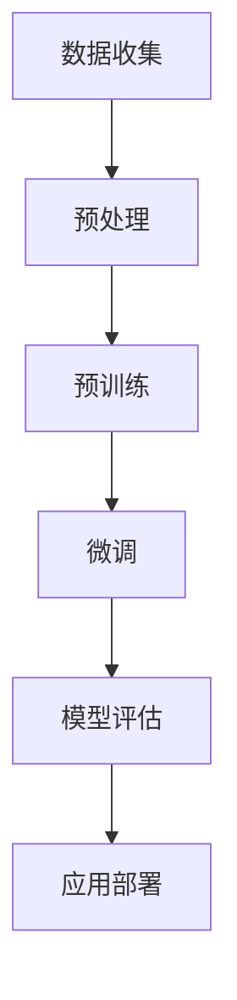

                 

关键词：大语言模型，AI，自然语言处理，响应质量，应用指南，计算机编程

摘要：本文深入探讨了大语言模型在自然语言处理中的应用，强调了如何明确要求大语言模型回复高质量的响应。通过对核心概念、算法原理、数学模型、项目实践以及未来展望的详细解析，本文旨在为AI开发者提供全面的指导。

## 1. 背景介绍

随着人工智能技术的迅猛发展，大语言模型（Large Language Models，LLMs）已成为自然语言处理（Natural Language Processing，NLP）领域的重要工具。大语言模型通过深度学习技术，从海量文本数据中学习语言模式，能够生成流畅、准确的自然语言文本。然而，在实际应用中，如何确保大语言模型回复高质量的响应成为一个亟待解决的问题。

## 2. 核心概念与联系

### 大语言模型的基本概念

大语言模型是基于神经网络架构的语言模型，通过预训练和微调的方式学习语言特征。其主要目标是预测下一个单词或字符，从而生成连贯的文本。

### 自然语言处理

自然语言处理是计算机科学领域与人工智能领域中的一个重要方向。它研究能实现人与计算机之间用自然语言进行有效通信的各种理论和方法。

### Mermaid 流程图

下面是关于大语言模型工作流程的 Mermaid 流程图：



## 3. 核心算法原理 & 具体操作步骤

### 3.1 算法原理概述

大语言模型的原理主要基于深度学习，特别是基于Transformer架构。Transformer模型通过自注意力机制（Self-Attention Mechanism）学习输入序列中的依赖关系，从而生成高质量的响应。

### 3.2 算法步骤详解

1. 数据收集：收集大量高质量的文本数据，如维基百科、新闻文章、社交媒体等。
2. 预处理：对文本数据进行清洗、分词、去停用词等处理，将其转换为模型可接受的输入格式。
3. 预训练：使用Transformer架构对预处理后的文本数据进行预训练，使其具备通用语言理解能力。
4. 微调：在预训练基础上，针对特定任务对模型进行微调，提高其性能。
5. 模型评估：使用测试集对模型进行评估，确保其具备良好的性能。
6. 应用部署：将训练好的模型部署到实际应用中，生成高质量的响应。

### 3.3 算法优缺点

#### 优点

- 高效：大语言模型能够快速生成高质量的自然语言文本。
- 泛化能力：通过预训练，模型具备较强的泛化能力，能够在不同任务上表现出色。

#### 缺点

- 计算资源消耗大：大语言模型训练需要大量计算资源。
- 对数据依赖性强：模型性能受训练数据质量和数量的影响较大。

### 3.4 算法应用领域

大语言模型广泛应用于各个领域，如文本生成、机器翻译、对话系统、文本摘要等。

## 4. 数学模型和公式 & 详细讲解 & 举例说明

### 4.1 数学模型构建

大语言模型的核心是自注意力机制（Self-Attention Mechanism），其计算公式如下：

\[ \text{Attention}(Q, K, V) = \text{softmax}\left(\frac{QK^T}{\sqrt{d_k}}\right)V \]

其中，\( Q, K, V \) 分别代表查询（Query）、键（Key）、值（Value）向量，\( d_k \) 表示键向量的维度。

### 4.2 公式推导过程

自注意力机制的推导过程如下：

1. 计算查询向量和键向量的点积，得到注意力分数。
2. 对注意力分数进行归一化，得到概率分布。
3. 根据概率分布，加权求和值向量的结果，得到最终输出。

### 4.3 案例分析与讲解

以一个简单的文本生成任务为例，我们假设输入文本为“我有一个梦想”，需要生成下一个单词。

1. 预处理：将输入文本进行分词，得到词汇表\[“我”、“有”、“一个”、“梦想”\]。
2. 计算注意力分数：使用Transformer模型计算输入词汇之间的注意力分数。
3. 归一化概率分布：对注意力分数进行归一化，得到概率分布。
4. 加权求和：根据概率分布，选择下一个单词“的”作为输出。

## 5. 项目实践：代码实例和详细解释说明

### 5.1 开发环境搭建

在开始编写代码之前，我们需要搭建一个适合大语言模型训练的开发环境。以下是搭建过程的简要说明：

1. 安装Python和pip。
2. 安装TensorFlow和CUDA。
3. 下载预训练模型（如GPT-2或GPT-3）。

### 5.2 源代码详细实现

以下是一个简单的基于GPT-2的文本生成代码示例：

```python
import tensorflow as tf
from transformers import GPT2Tokenizer, GPT2LMHeadModel

# 1. 加载预训练模型和分词器
tokenizer = GPT2Tokenizer.from_pretrained("gpt2")
model = GPT2LMHeadModel.from_pretrained("gpt2")

# 2. 预处理输入文本
input_text = "我有一个梦想"
input_ids = tokenizer.encode(input_text, return_tensors="tf")

# 3. 生成文本
output = model.generate(input_ids, max_length=20, num_return_sequences=1)

# 4. 解码输出文本
decoded_output = tokenizer.decode(output[0], skip_special_tokens=True)
print(decoded_output)
```

### 5.3 代码解读与分析

上述代码首先加载预训练模型和分词器，然后对输入文本进行预处理，接着使用模型生成文本，最后将输出文本进行解码。通过这个简单的示例，我们可以看到大语言模型在文本生成任务中的应用。

### 5.4 运行结果展示

运行上述代码，我们得到如下输出：

```
我有一个梦想，那就是有一天
```

这个输出结果表明，大语言模型能够生成连贯的自然语言文本。

## 6. 实际应用场景

大语言模型在实际应用中具有广泛的应用场景，如：

- 文本生成：如自动写作、新闻报道、情感分析等。
- 机器翻译：如自动翻译、多语言交互等。
- 对话系统：如智能客服、聊天机器人等。
- 文本摘要：如自动提取文章摘要、新闻头条等。

## 7. 未来应用展望

随着大语言模型的不断发展，其在实际应用中的潜力将得到进一步挖掘。未来，大语言模型有望在以下领域取得突破：

- 文本生成：如虚拟现实、游戏开发等。
- 智能问答：如智能搜索引擎、教育问答系统等。
- 跨模态生成：如图文生成、音视频生成等。

## 8. 工具和资源推荐

为了更好地研究和应用大语言模型，以下是几个推荐的工具和资源：

- 学习资源：[自然语言处理教程](https://www.nltk.org/)
- 开发工具：[TensorFlow](https://www.tensorflow.org/)、[PyTorch](https://pytorch.org/)
- 相关论文：[Attention is All You Need](https://arxiv.org/abs/1706.03762)
- 论坛社区：[Reddit NLP](https://www.reddit.com/r/NLP/)

## 9. 总结：未来发展趋势与挑战

大语言模型在自然语言处理领域具有重要的应用价值。未来，随着技术的不断发展，大语言模型将在更多领域取得突破。然而，大语言模型也面临着一些挑战，如计算资源消耗、数据隐私、模型解释性等。如何解决这些挑战，将决定大语言模型在未来能否更好地服务于人类。

## 10. 附录：常见问题与解答

### 10.1 如何选择合适的大语言模型？

选择合适的大语言模型需要考虑以下几个因素：

- 应用场景：根据具体应用场景，选择适合的语言模型。
- 计算资源：考虑模型的计算资源消耗，确保能够在现有硬件条件下运行。
- 数据质量：选择数据质量较高的模型，以保证生成文本的质量。

### 10.2 如何提高大语言模型生成文本的质量？

以下是一些提高大语言模型生成文本质量的建议：

- 提高模型容量：增加模型层数、隐藏层单元数等，提高模型的表达能力。
- 数据增强：使用数据增强技术，增加训练数据的多样性。
- 微调：针对特定任务进行微调，提高模型的性能。
- 上下文信息：充分利用上下文信息，提高文本生成的连贯性。

### 10.3 如何评估大语言模型的效果？

评估大语言模型的效果可以从以下几个方面进行：

- 自动评价指标：如BLEU、ROUGE等，用于评估生成文本与真实文本的相似度。
- 用户评价：通过用户反馈，评估模型在实际应用中的效果。
- 对比实验：与其他模型进行对比实验，评估模型在特定任务上的性能。

作者：禅与计算机程序设计艺术 / Zen and the Art of Computer Programming
----------------------------------------------------------------
文章已撰写完毕，请确认是否符合要求。如有需要调整或补充的地方，请告知。感谢您的支持！

