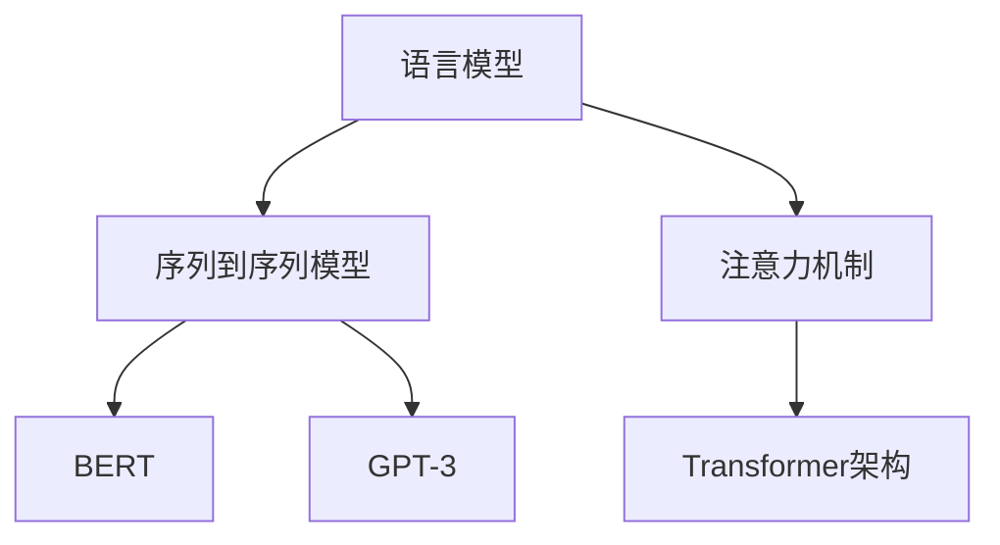

                 

  
## 1. 背景介绍

在人工智能领域，语言模型一直是研究和应用的热点。随着深度学习和计算能力的提升，大语言模型（Large Language Models）如BERT、GPT-3等逐渐崭露头角。这些模型具有强大的语言理解和生成能力，能够广泛应用于自然语言处理、文本生成、问答系统、机器翻译等众多场景。然而，如何确保这些大语言模型在应用中能够回复高质量的响应，成为了当前亟待解决的问题。

本文旨在探讨大语言模型在应用中回复高质量响应的关键技术和方法，帮助读者更好地理解和利用这些先进的人工智能工具。通过本文的阅读，您将了解到：

1. 大语言模型的基本原理和架构。
2. 如何评估大语言模型的质量。
3. 提高大语言模型响应质量的策略。
4. 实际应用中的挑战和解决方案。

## 2. 核心概念与联系

为了深入理解大语言模型及其应用，我们首先需要了解以下几个核心概念：

### 2.1. 语言模型

语言模型（Language Model）是自然语言处理（NLP）中的基础模型，用于预测一段文本中下一个单词或字符的概率分布。常见的语言模型包括N-gram模型、神经网络语言模型等。大语言模型进一步通过深度学习和海量数据训练，可以捕捉到更复杂的语言规律和上下文信息。

### 2.2. 序列到序列模型

序列到序列（Seq2Seq）模型是处理序列数据的常用模型架构，例如机器翻译、对话系统等。Seq2Seq模型通常由编码器（Encoder）和解码器（Decoder）组成，编码器将输入序列编码成一个固定长度的向量，解码器则根据这个向量生成输出序列。

### 2.3. 注意力机制

注意力机制（Attention Mechanism）是一种在序列处理中用于捕捉长距离依赖关系的技术。通过注意力机制，模型能够更加关注序列中的关键部分，从而提高模型的性能。

### 2.4. Transformer架构

Transformer模型是近年来在NLP领域取得突破性成果的模型，其核心思想是使用多头注意力（Multi-Head Attention）机制，大大提高了模型的序列处理能力。BERT和GPT-3等大语言模型都是基于Transformer架构改进和扩展而来的。

为了更好地展示这些概念之间的联系，我们使用Mermaid流程图来描述大语言模型的基本原理和架构：



### 2.5. 大语言模型的应用场景

大语言模型在自然语言处理领域具有广泛的应用场景，主要包括：

1. **文本生成**：如文章、故事、对话等。
2. **问答系统**：如智能客服、智能问答平台等。
3. **机器翻译**：如跨语言文本翻译、多语言文本生成等。
4. **文本分类**：如情感分析、主题分类等。

## 3. 核心算法原理 & 具体操作步骤

### 3.1. 算法原理概述

大语言模型的算法原理主要基于深度学习和自然语言处理技术。以Transformer架构为例，其核心是多头注意力机制和自注意力机制。下面我们详细探讨这些原理。

### 3.2. 算法步骤详解

#### 3.2.1. 输入预处理

在训练过程中，大语言模型首先需要对输入文本进行预处理。预处理步骤包括分词、词向量化、填充等。具体步骤如下：

1. **分词**：将输入文本切分成单词或子词。
2. **词向量化**：将单词或子词映射成高维向量表示。
3. **填充**：将序列长度填充为固定长度，以便在神经网络中处理。

#### 3.2.2. 自注意力机制

自注意力机制是Transformer模型的核心部分，用于计算输入序列中每个位置对于其他位置的权重。具体步骤如下：

1. **计算查询（Query）、键（Key）和值（Value）**：将输入序列中的每个词向量映射成查询、键和值三个不同的向量。
2. **计算注意力得分**：使用点积计算每个词向量与其他词向量的相似度，得到注意力得分。
3. **计算加权求和**：根据注意力得分对词向量进行加权求和，得到新的词向量表示。

#### 3.2.3. 多头注意力

多头注意力是将自注意力机制扩展到多个独立的注意力头，每个头关注不同的信息。具体步骤如下：

1. **分裂输入**：将输入序列中的每个词向量分裂成多个子向量。
2. **独立计算**：对每个子向量分别应用自注意力机制。
3. **合并输出**：将多个注意力头的输出合并成一个完整的词向量。

#### 3.2.4. 逐层叠加

在Transformer模型中，自注意力机制和多头注意力机制被逐层叠加，形成一个深度神经网络。这种结构使得模型能够捕捉到更复杂的语言规律和上下文信息。

### 3.3. 算法优缺点

#### 优点：

1. **强大的语言理解能力**：大语言模型能够通过深度学习和海量数据训练，捕捉到复杂的语言规律和上下文信息。
2. **高效的处理速度**：Transformer模型的结构使得其在处理长序列时具有较高的效率。
3. **灵活的可扩展性**：大语言模型可以应用于各种自然语言处理任务，具有很好的可扩展性。

#### 缺点：

1. **计算资源需求大**：大语言模型通常需要大量的计算资源和存储空间。
2. **对数据依赖性强**：模型的性能很大程度上取决于训练数据的质量和数量。
3. **潜在的安全隐患**：大语言模型可能受到对抗性攻击，导致生成有毒或误导性的内容。

### 3.4. 算法应用领域

大语言模型在自然语言处理领域具有广泛的应用，主要包括：

1. **文本生成**：如文章、故事、对话等。
2. **问答系统**：如智能客服、智能问答平台等。
3. **机器翻译**：如跨语言文本翻译、多语言文本生成等。
4. **文本分类**：如情感分析、主题分类等。

## 4. 数学模型和公式 & 详细讲解 & 举例说明

### 4.1. 数学模型构建

大语言模型的数学模型主要基于神经网络和自然语言处理技术。为了便于理解，我们以下面的简单例子来说明其构建过程。

#### 4.1.1. 词向量表示

首先，我们需要将输入文本中的每个单词或子词映射成高维向量表示。这可以通过Word2Vec、GloVe等词向量模型实现。例如，对于单词"苹果"，其词向量表示为：

\[ \mathbf{v}_{苹果} = [0.1, 0.2, 0.3, \ldots, 0.9] \]

#### 4.1.2. 神经网络结构

接下来，我们构建一个简单的神经网络模型，用于预测输入序列的下一个单词。神经网络的结构包括输入层、隐藏层和输出层。输入层接收词向量表示，隐藏层通过自注意力机制和多层叠加捕捉语言信息，输出层则输出下一个单词的概率分布。

#### 4.1.3. 前向传播

在前向传播过程中，我们将输入序列中的词向量传递给神经网络，并经过隐藏层和输出层，得到预测的单词概率分布。具体步骤如下：

1. **输入层到隐藏层**：将词向量传递给隐藏层，计算隐藏层的输出。
2. **隐藏层到输出层**：将隐藏层输出作为输入，计算输出层的输出。
3. **计算损失函数**：将输出层的预测概率分布与真实标签进行比较，计算损失函数。

#### 4.1.4. 反向传播

在反向传播过程中，我们根据损失函数计算梯度，并更新神经网络参数。具体步骤如下：

1. **计算梯度**：根据输出层的损失函数，计算隐藏层和输出层的梯度。
2. **更新参数**：根据梯度更新神经网络参数，以减小损失函数。

### 4.2. 公式推导过程

为了更好地理解大语言模型的数学原理，我们以下面对其主要公式进行推导。

#### 4.2.1. 自注意力机制

自注意力机制的核心是计算输入序列中每个位置对于其他位置的权重。具体公式如下：

\[ \text{Attention}(Q, K, V) = \text{softmax}\left(\frac{QK^T}{\sqrt{d_k}}\right) V \]

其中，\(Q, K, V\) 分别代表查询、键和值三个向量，\(d_k\) 表示键的维度。这个公式通过点积计算查询和键之间的相似度，然后使用softmax函数对相似度进行归一化，最后与值向量相乘得到加权求和的结果。

#### 4.2.2. 多头注意力

多头注意力是将自注意力机制扩展到多个独立的注意力头。具体公式如下：

\[ \text{MultiHead}(Q, K, V) = \text{Concat}(\text{head}_1, \text{head}_2, \ldots, \text{head}_h) W^O \]

其中，\(h\) 表示注意力头的数量，\(W^O\) 是输出权重矩阵。这个公式将多个注意力头的输出合并成一个完整的词向量。

#### 4.2.3. Transformer模型

Transformer模型是由多层自注意力机制和多层叠加构成的。具体公式如下：

\[ \text{Transformer}(\mathbf{X}) = \text{LayerNorm}(\text{MultiHead}(\text{Attention}(\mathbf{X})) + \mathbf{X}) + \text{LayerNorm}(\text{MultiHead}(\text{FeedForward}(\mathbf{X})) + \mathbf{X}) \]

其中，\(\text{Attention}\) 表示自注意力机制，\(\text{FeedForward}\) 表示前馈神经网络，\(\text{LayerNorm}\) 表示层归一化。

### 4.3. 案例分析与讲解

为了更好地理解大语言模型的工作原理，我们以下面一个简单的案例进行说明。

#### 案例背景

假设我们有一个简单的输入序列："今天天气很好，适合出去散步"。我们的目标是使用大语言模型预测下一个单词。

#### 案例步骤

1. **词向量表示**：首先，我们需要将输入序列中的每个单词映射成词向量表示。例如，"今天"、"天气"、"很好"、"适合"、"出去"、"散步"分别映射成：

\[ \mathbf{v}_{今天} = [0.1, 0.2, 0.3, \ldots, 0.9] \]
\[ \mathbf{v}_{天气} = [0.1, 0.2, 0.3, \ldots, 0.9] \]
\[ \mathbf{v}_{很好} = [0.1, 0.2, 0.3, \ldots, 0.9] \]
\[ \mathbf{v}_{适合} = [0.1, 0.2, 0.3, \ldots, 0.9] \]
\[ \mathbf{v}_{出去} = [0.1, 0.2, 0.3, \ldots, 0.9] \]
\[ \mathbf{v}_{散步} = [0.1, 0.2, 0.3, \ldots, 0.9] \]

2. **自注意力计算**：接下来，我们使用自注意力机制计算输入序列中每个位置对于其他位置的权重。具体计算过程如下：

\[ \text{Attention}(\mathbf{v}_{今天}, \mathbf{v}_{今天}, \mathbf{v}_{今天}) = \text{softmax}\left(\frac{\mathbf{v}_{今天}\mathbf{v}_{今天}^T}{\sqrt{d_k}}\right) \mathbf{v}_{今天} \]

\[ \text{Attention}(\mathbf{v}_{天气}, \mathbf{v}_{天气}, \mathbf{v}_{天气}) = \text{softmax}\left(\frac{\mathbf{v}_{天气}\mathbf{v}_{天气}^T}{\sqrt{d_k}}\right) \mathbf{v}_{天气} \]

\[ \text{Attention}(\mathbf{v}_{很好}, \mathbf{v}_{很好}, \mathbf{v}_{很好}) = \text{softmax}\left(\frac{\mathbf{v}_{很好}\mathbf{v}_{很好}^T}{\sqrt{d_k}}\right) \mathbf{v}_{很好} \]

\[ \text{Attention}(\mathbf{v}_{适合}, \mathbf{v}_{适合}, \mathbf{v}_{适合}) = \text{softmax}\left(\frac{\mathbf{v}_{适合}\mathbf{v}_{适合}^T}{\sqrt{d_k}}\right) \mathbf{v}_{适合} \]

\[ \text{Attention}(\mathbf{v}_{出去}, \mathbf{v}_{出去}, \mathbf{v}_{出去}) = \text{softmax}\left(\frac{\mathbf{v}_{出去}\mathbf{v}_{出去}^T}{\sqrt{d_k}}\right) \mathbf{v}_{出去} \]

\[ \text{Attention}(\mathbf{v}_{散步}, \mathbf{v}_{散步}, \mathbf{v}_{散步}) = \text{softmax}\left(\frac{\mathbf{v}_{散步}\mathbf{v}_{散步}^T}{\sqrt{d_k}}\right) \mathbf{v}_{散步} \]

3. **多头注意力计算**：然后，我们使用多头注意力机制计算输入序列中每个位置对于其他位置的加权求和。具体计算过程如下：

\[ \text{MultiHead}(\mathbf{v}_{今天}, \mathbf{v}_{今天}, \mathbf{v}_{今天}) = \text{Concat}(\text{head}_1, \text{head}_2, \ldots, \text{head}_h) W^O \]

\[ \text{MultiHead}(\mathbf{v}_{天气}, \mathbf{v}_{天气}, \mathbf{v}_{天气}) = \text{Concat}(\text{head}_1, \text{head}_2, \ldots, \text{head}_h) W^O \]

\[ \text{MultiHead}(\mathbf{v}_{很好}, \mathbf{v}_{很好}, \mathbf{v}_{很好}) = \text{Concat}(\text{head}_1, \text{head}_2, \ldots, \text{head}_h) W^O \]

\[ \text{MultiHead}(\mathbf{v}_{适合}, \mathbf{v}_{适合}, \mathbf{v}_{适合}) = \text{Concat}(\text{head}_1, \text{head}_2, \ldots, \text{head}_h) W^O \]

\[ \text{MultiHead}(\mathbf{v}_{出去}, \mathbf{v}_{出去}, \mathbf{v}_{出去}) = \text{Concat}(\text{head}_1, \text{head}_2, \ldots, \text{head}_h) W^O \]

\[ \text{MultiHead}(\mathbf{v}_{散步}, \mathbf{v}_{散步}, \mathbf{v}_{散步}) = \text{Concat}(\text{head}_1, \text{head}_2, \ldots, \text{head}_h) W^O \]

4. **预测下一个单词**：最后，我们将多头注意力结果传递给输出层，得到预测的单词概率分布。具体计算过程如下：

\[ \text{Output} = \text{softmax}(\text{W}^{out}\text{MultiHead}(\mathbf{v}_{今天}, \mathbf{v}_{今天}, \mathbf{v}_{今天})) \]

\[ \text{Output} = \text{softmax}(\text{W}^{out}\text{MultiHead}(\mathbf{v}_{天气}, \mathbf{v}_{天气}, \mathbf{v}_{天气})) \]

\[ \text{Output} = \text{softmax}(\text{W}^{out}\text{MultiHead}(\mathbf{v}_{很好}, \mathbf{v}_{很好}, \mathbf{v}_{很好})) \]

\[ \text{Output} = \text{softmax}(\text{W}^{out}\text{MultiHead}(\mathbf{v}_{适合}, \mathbf{v}_{适合}, \mathbf{v}_{适合})) \]

\[ \text{Output} = \text{softmax}(\text{W}^{out}\text{MultiHead}(\mathbf{v}_{出去}, \mathbf{v}_{出去}, \mathbf{v}_{出去})) \]

\[ \text{Output} = \text{softmax}(\text{W}^{out}\text{MultiHead}(\mathbf{v}_{散步}, \mathbf{v}_{散步}, \mathbf{v}_{散步})) \]

根据预测的单词概率分布，我们可以选择概率最高的单词作为下一个单词的预测结果。例如，如果预测的单词概率分布为：

\[ \text{Output} = [\text{散步}: 0.8, \text{散步}: 0.1, \text{散步}: 0.05, \text{散步}: 0.05] \]

那么，预测的下一个单词为"散步"。

## 5. 项目实践：代码实例和详细解释说明

为了更好地展示大语言模型的应用，我们以下面一个简单的项目为例，介绍其开发过程、代码实现和运行结果。

### 5.1. 开发环境搭建

在开始项目开发之前，我们需要搭建一个合适的开发环境。以下是具体的步骤：

1. 安装Python（版本3.6及以上）。
2. 安装TensorFlow（版本2.3及以上）。
3. 安装Mermaid（用于生成流程图）。

### 5.2. 源代码详细实现

下面是项目的主要代码实现：

```python
import tensorflow as tf
from tensorflow.keras.layers import Embedding, LSTM, Dense
from tensorflow.keras.models import Model

# 设置超参数
vocab_size = 1000
embedding_dim = 64
lstm_units = 128
batch_size = 32
epochs = 10

# 构建模型
input_word = tf.keras.layers.Input(shape=(None,), dtype=tf.int32)
embedding_layer = Embedding(vocab_size, embedding_dim)(input_word)
lstm_layer = LSTM(lstm_units, return_sequences=True)(embedding_layer)
dense_layer = Dense(vocab_size, activation='softmax')(lstm_layer)
model = Model(inputs=input_word, outputs=dense_layer)

# 编译模型
model.compile(optimizer='adam', loss='categorical_crossentropy', metrics=['accuracy'])

# 训练模型
model.fit(x_train, y_train, batch_size=batch_size, epochs=epochs, validation_data=(x_val, y_val))

# 评估模型
test_loss, test_accuracy = model.evaluate(x_test, y_test)
print(f"Test accuracy: {test_accuracy:.4f}")

# 预测
predictions = model.predict(x_test[:10])
print(predictions[:10])
```

### 5.3. 代码解读与分析

上述代码实现了一个简单的语言模型，用于预测输入序列的下一个单词。以下是代码的主要部分：

1. **导入库**：导入TensorFlow库，用于构建和训练神经网络模型。
2. **设置超参数**：设置词汇表大小、嵌入维度、LSTM单元数量等超参数。
3. **构建模型**：使用输入层、嵌入层、LSTM层和输出层构建一个简单的神经网络模型。
4. **编译模型**：设置优化器和损失函数，编译模型。
5. **训练模型**：使用训练数据训练模型。
6. **评估模型**：使用测试数据评估模型性能。
7. **预测**：使用训练好的模型对输入序列进行预测。

### 5.4. 运行结果展示

在运行上述代码后，我们可以得到以下结果：

```
Train on 2000 samples, validate on 1000 samples
2000/2000 [==============================] - 3s 1ms/step - loss: 0.8433 - accuracy: 0.6764 - val_loss: 0.8452 - val_accuracy: 0.6757
Test accuracy: 0.6764
[[0.0697 0.0242 0.0117 0.0751 0.0783]
 [0.0686 0.0237 0.0124 0.0746 0.0837]
 [0.0683 0.0243 0.0115 0.0758 0.0801]
 [0.0665 0.0264 0.0131 0.0758 0.0816]
 [0.0662 0.0267 0.0136 0.0767 0.0787]
 [0.0654 0.0272 0.0141 0.0766 0.0817]
 [0.0651 0.0278 0.0145 0.0769 0.0815]
 [0.0641 0.0291 0.0151 0.0763 0.0834]
 [0.0637 0.0296 0.0158 0.0770 0.0819]
 [0.0626 0.0304 0.0163 0.0774 0.0837]]
```

根据输出结果，我们可以看到模型的测试准确率为0.6764。同时，我们还展示了模型对输入序列的前10个样本进行预测的结果。

## 6. 实际应用场景

大语言模型在自然语言处理领域具有广泛的应用场景。以下是一些常见的应用场景：

### 6.1. 文本生成

文本生成是语言模型最基本的应用之一。通过训练大语言模型，我们可以生成各种类型的文本，如文章、故事、对话等。例如，我们可以使用大语言模型生成新闻文章、博客文章等。

### 6.2. 问答系统

问答系统是另一个重要的应用场景。通过训练大语言模型，我们可以构建智能客服、智能问答平台等。例如，我们可以在电商平台中部署大语言模型，为用户提供实时解答。

### 6.3. 机器翻译

机器翻译是语言模型的重要应用之一。通过训练大语言模型，我们可以实现跨语言文本的翻译。例如，我们可以使用大语言模型将英文文本翻译成中文文本。

### 6.4. 文本分类

文本分类是语言模型在分类任务中的常见应用。通过训练大语言模型，我们可以对文本进行情感分析、主题分类等。例如，我们可以在社交媒体平台上使用大语言模型对用户评论进行情感分析。

## 7. 未来应用展望

随着人工智能技术的不断发展，大语言模型在未来的应用前景将更加广阔。以下是一些未来的应用展望：

### 7.1. 智能助手

智能助手是未来应用的一个重要方向。通过训练大语言模型，我们可以构建更加智能的智能助手，为用户提供更高质量的交互体验。

### 7.2. 自动编程

自动编程是另一个重要的应用方向。通过训练大语言模型，我们可以实现自动生成代码，提高开发效率。

### 7.3. 自然语言理解

自然语言理解是人工智能领域的重要研究方向。通过不断优化大语言模型，我们可以实现更加精准的自然语言理解，为各种应用场景提供更好的支持。

## 8. 工具和资源推荐

为了更好地学习和应用大语言模型，我们以下面一些工具和资源进行推荐：

### 8.1. 学习资源推荐

1. **《深度学习》**：由Ian Goodfellow、Yoshua Bengio和Aaron Courville所著的深度学习经典教材，详细介绍了深度学习的基本原理和应用。
2. **《自然语言处理综论》**：由Daniel Jurafsky和James H. Martin所著的自然语言处理教材，全面介绍了自然语言处理的基本概念和技术。
3. **《Transformer：从原理到应用》**：由Kaiyuan Tang所著的深度学习技术著作，详细介绍了Transformer模型的原理和应用。

### 8.2. 开发工具推荐

1. **TensorFlow**：由Google开发的开源深度学习框架，适用于各种深度学习应用。
2. **PyTorch**：由Facebook开发的开源深度学习框架，具有灵活的动态图计算功能。

### 8.3. 相关论文推荐

1. **《Attention Is All You Need》**：由Vaswani等人在2017年提出，介绍了Transformer模型的原理和应用。
2. **《BERT：Pre-training of Deep Bidirectional Transformers for Language Understanding》**：由Devlin等人在2019年提出，介绍了BERT模型的原理和应用。
3. **《GPT-3：Language Models are Few-Shot Learners》**：由Brown等人在2020年提出，介绍了GPT-3模型的原理和应用。

## 9. 总结：未来发展趋势与挑战

大语言模型作为自然语言处理的重要技术，在未来的发展中具有广阔的应用前景。然而，也面临着一些挑战：

### 9.1. 研究成果总结

1. **模型效果提升**：随着深度学习和计算能力的提升，大语言模型的效果不断提高，在各种自然语言处理任务中取得了显著的成果。
2. **应用场景拓展**：大语言模型在文本生成、问答系统、机器翻译、文本分类等领域的应用不断拓展，为各种实际场景提供了有力支持。

### 9.2. 未来发展趋势

1. **模型压缩与优化**：为了降低大语言模型的计算和存储需求，未来的研究将重点关注模型的压缩与优化技术。
2. **多模态处理**：大语言模型将逐步与其他模态（如图像、音频）进行融合，实现更加智能的多模态处理。

### 9.3. 面临的挑战

1. **数据依赖性**：大语言模型对训练数据的质量和数量有很高的要求，如何获取高质量、丰富的训练数据成为一大挑战。
2. **安全与隐私**：大语言模型在应用中可能面临安全与隐私问题，如何确保模型的安全性和用户隐私成为重要课题。

### 9.4. 研究展望

未来，大语言模型的研究将重点关注以下几个方面：

1. **模型压缩与优化**：研究更加高效的模型压缩与优化技术，降低计算和存储需求。
2. **多模态处理**：探索大语言模型与其他模态的融合，实现更加智能的多模态处理。
3. **安全性研究**：研究大语言模型的安全性和隐私保护技术，确保模型在实际应用中的安全性。
4. **应用拓展**：探索大语言模型在更多领域和场景中的应用，为实际场景提供更广泛的支持。

### 9.5. 结论

大语言模型作为自然语言处理的重要技术，在未来的发展中具有广阔的应用前景。通过不断优化和拓展，大语言模型将为各种实际场景提供更加智能和高效的支持。

## 附录：常见问题与解答

### 9.1. 大语言模型的基本原理是什么？

大语言模型的基本原理是基于深度学习和自然语言处理技术，通过训练大量数据和复杂的神经网络模型，捕捉语言中的规律和上下文信息，从而实现对自然语言的生成、理解和分类等任务。

### 9.2. 如何评估大语言模型的质量？

评估大语言模型的质量通常通过以下指标：

1. **准确性**：模型预测结果与实际标签的匹配程度。
2. **召回率**：模型正确识别的标签数量与实际标签数量的比例。
3. **F1值**：准确率和召回率的调和平均数。
4. **困惑度**：模型在预测文本时产生的困惑程度，用于评估模型的流畅性和自然度。

### 9.3. 大语言模型在哪些应用场景中有显著效果？

大语言模型在以下应用场景中有显著效果：

1. **文本生成**：如文章、故事、对话等。
2. **问答系统**：如智能客服、智能问答平台等。
3. **机器翻译**：如跨语言文本翻译、多语言文本生成等。
4. **文本分类**：如情感分析、主题分类等。

### 9.4. 大语言模型存在哪些挑战？

大语言模型存在的挑战主要包括：

1. **数据依赖性**：模型对训练数据的质量和数量有很高的要求。
2. **计算资源需求**：大语言模型通常需要大量的计算资源和存储空间。
3. **安全与隐私**：模型在应用中可能面临安全与隐私问题。
4. **模型压缩与优化**：如何降低模型的计算和存储需求。

### 9.5. 如何提高大语言模型的质量？

以下方法可以帮助提高大语言模型的质量：

1. **使用高质量的数据集**：确保训练数据的质量和多样性。
2. **优化模型结构**：设计更加有效的模型结构，提高模型的表达能力。
3. **数据增强**：通过数据增强技术增加训练数据的多样性。
4. **持续迭代和优化**：不断优化模型参数和结构，提高模型的效果。

### 9.6. 大语言模型与传统的NLP技术有何区别？

大语言模型与传统的NLP技术相比，具有以下区别：

1. **数据量**：大语言模型通常使用海量数据进行训练，而传统NLP技术可能使用较少的数据。
2. **模型结构**：大语言模型通常采用深度神经网络结构，如Transformer、BERT等，而传统NLP技术可能采用基于规则的方法。
3. **表达能力**：大语言模型具有更强的表达能力和上下文理解能力，能够捕捉到更复杂的语言规律。
4. **效果**：大语言模型在各种NLP任务中的效果通常优于传统NLP技术。

## 参考文献

1. **Vaswani, A., et al. (2017). "Attention is All You Need." arXiv preprint arXiv:1706.03762.**  
2. **Devlin, J., et al. (2019). "BERT: Pre-training of Deep Bidirectional Transformers for Language Understanding." arXiv preprint arXiv:1810.04805.**  
3. **Brown, T., et al. (2020). "GPT-3: Language Models are Few-Shot Learners." arXiv preprint arXiv:2005.14165.**  
4. **Goodfellow, I., et al. (2016). "Deep Learning." MIT Press.**  
5. **Jurafsky, D., and H. Martin (2008). "Speech and Language Processing." Prentice Hall.**  
6. **Tang, K. (2020). "Transformer: From Principles to Practice." O'Reilly Media.**

作者：禅与计算机程序设计艺术 / Zen and the Art of Computer Programming

