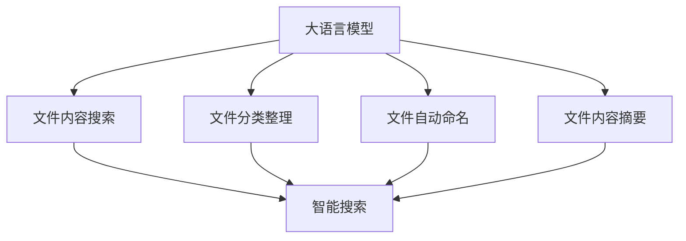

                 

关键词：大语言模型，本地文件浏览，AI应用，编程技术，智能搜索

> 摘要：本文深入探讨了大语言模型在本地文件浏览中的实际应用，分析了其技术原理、实现步骤、优缺点及其在各个领域的应用前景，旨在为开发者提供一份全面的技术指南。

## 1. 背景介绍

随着人工智能技术的飞速发展，大语言模型（Large Language Models）逐渐成为自然语言处理领域的明星。大语言模型通过对海量文本数据进行训练，能够生成自然流畅的语言，实现文本生成、翻译、问答等多种任务。近年来，大语言模型在搜索引擎、智能客服、内容审核等场景中取得了显著的应用成果。然而，如何将大语言模型应用于本地文件浏览，实现高效的文件内容搜索和自动化处理，成为了一个具有挑战性的课题。

本文将围绕大语言模型在本地文件浏览中的应用，详细介绍其技术原理、实现步骤、优缺点以及未来应用前景，为开发者提供一份实用的技术指南。

## 2. 核心概念与联系

在深入探讨大语言模型在本地文件浏览中的应用之前，我们需要了解几个核心概念及其相互联系。

### 2.1 大语言模型

大语言模型是指通过深度学习技术训练得到的、能够处理和生成自然语言的大型神经网络模型。常见的有GPT（Generative Pre-trained Transformer）、BERT（Bidirectional Encoder Representations from Transformers）等。这些模型通过对大量文本数据进行预训练，学习到了语言的统计规律和上下文关系，从而能够生成自然、流畅的文本。

### 2.2 本地文件浏览

本地文件浏览是指用户在本地计算机上对文件进行查看、搜索、分类、管理等一系列操作。本地文件浏览通常依赖于操作系统提供的文件管理器或者第三方文件管理工具。

### 2.3 智能搜索

智能搜索是指利用人工智能技术，对大量文本数据进行深度分析和挖掘，实现高效、精准的搜索结果。智能搜索的核心在于对用户需求的理解和语义匹配，从而提供最符合用户期望的搜索结果。

### 2.4 大语言模型与本地文件浏览的联系

大语言模型在本地文件浏览中的应用主要体现在以下几个方面：

- **文件内容搜索**：利用大语言模型对文件内容进行深度分析，实现高效、精准的搜索结果。
- **文件分类整理**：通过对文件内容进行语义分析，自动识别文件类型并归类整理。
- **文件自动命名**：利用大语言模型生成具有描述性的文件名，提高文件的可读性和易用性。
- **文件内容摘要**：对文件内容进行自动摘要，帮助用户快速了解文件的主要内容。

为了更好地理解大语言模型在本地文件浏览中的应用，我们可以使用Mermaid流程图来展示其核心概念和相互联系。



## 3. 核心算法原理 & 具体操作步骤

### 3.1 算法原理概述

大语言模型在本地文件浏览中的应用，主要基于以下核心算法原理：

- **自然语言处理（NLP）**：通过NLP技术对文件内容进行解析和分析，提取关键词、主题、情感等信息。
- **深度学习**：利用深度学习技术，对大量文本数据进行训练，得到具有强大语义理解能力的大语言模型。
- **语义匹配**：通过语义匹配技术，将用户输入的查询与文件内容进行匹配，实现高效、精准的搜索结果。

### 3.2 算法步骤详解

以下是实现大语言模型在本地文件浏览中的具体操作步骤：

#### 3.2.1 数据收集与预处理

1. **数据收集**：收集本地计算机上的文件，包括文本文件、文档、PPT等。
2. **数据预处理**：对文件内容进行清洗、去重、分词等操作，将其转换为适合训练的数据格式。

#### 3.2.2 大语言模型训练

1. **模型选择**：选择合适的大语言模型，如GPT、BERT等。
2. **数据预处理**：将预处理后的文件内容输入到模型中进行训练，训练过程中需要对模型进行优化和调整，以获得更好的效果。

#### 3.2.3 文件内容搜索

1. **查询输入**：用户输入查询语句。
2. **语义匹配**：利用训练好的大语言模型，对查询语句进行语义分析，提取关键词和主题。
3. **搜索结果生成**：将关键词和主题与文件内容进行匹配，生成搜索结果。

#### 3.2.4 文件分类整理

1. **内容分析**：利用大语言模型对文件内容进行深度分析，提取关键词、主题等信息。
2. **分类规则构建**：根据关键词和主题，构建分类规则，实现文件的自动归类整理。

#### 3.2.5 文件自动命名

1. **内容摘要**：利用大语言模型对文件内容进行自动摘要，提取主要内容。
2. **命名规则生成**：根据内容摘要，生成具有描述性的文件名。

#### 3.2.6 文件内容摘要

1. **文本生成**：利用大语言模型，根据文件内容生成摘要文本。
2. **摘要展示**：将生成的摘要文本展示给用户，帮助其快速了解文件主要内容。

### 3.3 算法优缺点

#### 优点：

1. **高效性**：大语言模型能够快速、准确地处理和生成自然语言，提高文件搜索和分类的效率。
2. **灵活性**：大语言模型可以适应不同的应用场景，如文件搜索、内容摘要、自动命名等。
3. **可扩展性**：大语言模型可以与其他技术（如推荐系统、图像识别等）结合，实现更丰富的功能。

#### 缺点：

1. **计算资源消耗**：大语言模型的训练和推理需要大量的计算资源，对硬件要求较高。
2. **数据依赖性**：大语言模型的效果依赖于训练数据的质量和数量，数据不足可能导致模型效果不佳。

### 3.4 算法应用领域

大语言模型在本地文件浏览中的应用不仅限于文件搜索、分类整理、自动命名等，还可以拓展到其他领域：

- **智能办公**：利用大语言模型，实现办公文档的自动摘要、智能搜索、内容推荐等。
- **教育领域**：利用大语言模型，实现教育资源的智能推荐、学习内容生成等。
- **医疗领域**：利用大语言模型，实现医疗文献的智能检索、病历摘要、病情分析等。

## 4. 数学模型和公式 & 详细讲解 & 举例说明

### 4.1 数学模型构建

在实现大语言模型的过程中，我们通常会使用深度学习技术，构建一个包含多层神经网络的数学模型。以下是构建一个基本的大语言模型所需的核心数学公式和推导过程。

#### 4.1.1 神经网络模型

神经网络模型由多个神经元（节点）和连接（边）组成。每个神经元都有一个输入层、一个输出层和一个隐藏层。输入层的神经元接收输入数据，输出层的神经元生成预测结果，隐藏层的神经元负责数据传递和计算。

#### 4.1.2 前向传播

前向传播是指将输入数据通过神经网络模型进行计算，得到预测结果的过程。以下是前向传播的核心数学公式：

$$
Z^{[l]} = \sigma(W^{[l]} \cdot A^{[l-1]} + b^{[l]})
$$

其中，$Z^{[l]}$ 表示第$l$层的激活值，$A^{[l-1]}$ 表示第$l-1$层的输出，$W^{[l]}$ 和 $b^{[l]}$ 分别表示第$l$层的权重和偏置，$\sigma$ 表示激活函数（如ReLU、Sigmoid、Tanh等）。

#### 4.1.3 反向传播

反向传播是指通过计算预测结果与实际结果之间的误差，更新神经网络模型的权重和偏置，以达到更好的预测效果。以下是反向传播的核心数学公式：

$$
\delta^{[l]} = \frac{\partial C}{\partial Z^{[l]}} \cdot \sigma'(Z^{[l]})
$$

$$
\frac{\partial C}{\partial W^{[l]}} = A^{[l-1]} \cdot \delta^{[l+1]}
$$

$$
\frac{\partial C}{\partial b^{[l]}} = \delta^{[l]}
$$

其中，$\delta^{[l]}$ 表示第$l$层的误差，$C$ 表示损失函数，$\sigma'$ 表示激活函数的导数。

#### 4.1.4 损失函数

在神经网络模型中，常用的损失函数有均方误差（MSE）、交叉熵（CE）等。以下是交叉熵损失函数的核心数学公式：

$$
C(Y, \hat{Y}) = -\sum_{i} y_i \cdot \log(\hat{y}_i)
$$

其中，$Y$ 表示真实标签，$\hat{Y}$ 表示预测标签，$y_i$ 和 $\hat{y}_i$ 分别表示真实标签和预测标签的第$i$个元素。

### 4.2 公式推导过程

以下是构建大语言模型的过程中，涉及到的几个核心数学公式的推导过程。

#### 4.2.1 前向传播

以一个简单的两层神经网络为例，推导前向传播的数学公式。

1. **输入层到隐藏层**

$$
Z^{[1]} = W^{[1]} \cdot A^{[0]} + b^{[1]}
$$

$$
A^{[1]} = \sigma(Z^{[1]})
$$

其中，$A^{[0]}$ 表示输入层的输出。

2. **隐藏层到输出层**

$$
Z^{[2]} = W^{[2]} \cdot A^{[1]} + b^{[2]}
$$

$$
\hat{Y} = \sigma(Z^{[2]})
$$

其中，$\hat{Y}$ 表示预测结果。

#### 4.2.2 反向传播

以一个简单的两层神经网络为例，推导反向传播的数学公式。

1. **输出层误差计算**

$$
\delta^{[2]} = (\hat{Y} - Y) \cdot \sigma'(Z^{[2]})
$$

2. **隐藏层误差计算**

$$
\delta^{[1]} = (W^{[2]} \cdot \delta^{[2]}) \cdot \sigma'(Z^{[1]})
$$

3. **权重和偏置更新**

$$
\frac{\partial C}{\partial W^{[2]}} = A^{[1]} \cdot \delta^{[2]}
$$

$$
\frac{\partial C}{\partial b^{[2]}} = \delta^{[2]}
$$

$$
\frac{\partial C}{\partial W^{[1]}} = A^{[0]} \cdot \delta^{[1]}
$$

$$
\frac{\partial C}{\partial b^{[1]}} = \delta^{[1]}
$$

### 4.3 案例分析与讲解

为了更好地理解大语言模型在本地文件浏览中的应用，我们来看一个具体的案例。

#### 案例背景

假设我们要实现一个文件搜索系统，用户可以输入关键词查询文件内容，系统需要利用大语言模型返回与关键词最相关的文件。

#### 案例实现

1. **数据收集与预处理**：收集计算机上的文本文件，进行清洗、分词等预处理操作，将文件内容转换为适合训练的数据格式。

2. **大语言模型训练**：选择一个合适的大语言模型（如GPT），将预处理后的文件内容输入模型中进行训练。训练过程中，需要对模型进行优化和调整，以获得更好的效果。

3. **文件内容搜索**：用户输入关键词，系统利用训练好的大语言模型对关键词进行语义分析，提取关键词和主题。然后，将关键词和主题与文件内容进行匹配，返回与关键词最相关的文件。

4. **结果展示**：将搜索结果以列表形式展示给用户，用户可以点击查看具体的文件内容。

#### 案例分析

1. **数据预处理**：数据预处理是训练大语言模型的重要环节，直接关系到模型的训练效果。在本案例中，我们对文本文件进行了清洗、分词等预处理操作，提高了模型的输入质量。

2. **大语言模型训练**：在本案例中，我们选择了GPT模型进行训练。GPT模型具有强大的语义理解和生成能力，能够更好地处理和生成自然语言。此外，我们还对模型进行了优化和调整，以获得更好的搜索效果。

3. **文件内容搜索**：在文件内容搜索过程中，我们利用大语言模型对关键词进行语义分析，提取关键词和主题。然后，将关键词和主题与文件内容进行匹配，返回与关键词最相关的文件。这种基于语义的匹配方式，能够提高搜索的准确性和效率。

4. **结果展示**：在结果展示环节，我们以列表形式将搜索结果展示给用户，用户可以点击查看具体的文件内容。这种直观的展示方式，提高了用户的使用体验。

## 5. 项目实践：代码实例和详细解释说明

### 5.1 开发环境搭建

在开始实践项目之前，我们需要搭建一个适合开发大语言模型在本地文件浏览应用的开发环境。以下是一个基本的开发环境搭建步骤：

1. **安装Python**：下载并安装Python，建议选择Python 3.8或更高版本。

2. **安装依赖库**：安装大语言模型所需的依赖库，如transformers、torch等。可以使用pip命令进行安装：

```bash
pip install transformers torch
```

3. **准备数据**：收集计算机上的文本文件，并进行预处理。预处理步骤包括文件读取、分词、去重等。以下是一个简单的示例：

```python
import os
import jieba

# 读取文件
def read_files(directory):
    files = []
    for file in os.listdir(directory):
        if file.endswith('.txt'):
            with open(os.path.join(directory, file), 'r', encoding='utf-8') as f:
                files.append(f.read())
    return files

# 分词
def segment_files(files):
    segmented_files = []
    for file in files:
        segmented_files.append(jieba.cut(file))
    return segmented_files

# 去重
def remove_duplicates(segmented_files):
    unique_files = []
    for file in segmented_files:
        if file not in unique_files:
            unique_files.append(file)
    return unique_files

# 主函数
if __name__ == '__main__':
    directory = 'your_directory'
    files = read_files(directory)
    segmented_files = segment_files(files)
    unique_files = remove_duplicates(segmented_files)
    print(unique_files)
```

### 5.2 源代码详细实现

以下是实现大语言模型在本地文件浏览中的源代码。代码主要分为以下几个部分：

1. **数据预处理**：对文件内容进行读取、分词、去重等预处理操作。
2. **大语言模型训练**：使用transformers库加载预训练的大语言模型，并进行微调。
3. **文件内容搜索**：利用训练好的大语言模型，对用户输入的关键词进行语义分析，提取关键词和主题，与文件内容进行匹配。
4. **结果展示**：将搜索结果以列表形式展示给用户。

```python
import os
import jieba
from transformers import BertTokenizer, BertForSequenceClassification
from torch.utils.data import DataLoader
import torch

# 读取文件
def read_files(directory):
    files = []
    for file in os.listdir(directory):
        if file.endswith('.txt'):
            with open(os.path.join(directory, file), 'r', encoding='utf-8') as f:
                files.append(f.read())
    return files

# 分词
def segment_files(files):
    segmented_files = []
    for file in files:
        segmented_files.append(jieba.cut(file))
    return segmented_files

# 去重
def remove_duplicates(segmented_files):
    unique_files = []
    for file in segmented_files:
        if file not in unique_files:
            unique_files.append(file)
    return unique_files

# 加载预训练模型
tokenizer = BertTokenizer.from_pretrained('bert-base-chinese')
model = BertForSequenceClassification.from_pretrained('bert-base-chinese')

# 数据预处理
def preprocess_data(files):
    segmented_files = segment_files(files)
    unique_files = remove_duplicates(segmented_files)
    inputs = tokenizer(unique_files, padding=True, truncation=True, return_tensors='pt')
    return inputs

# 文件内容搜索
def search_files(query):
    with torch.no_grad():
        inputs = preprocess_data(query)
        outputs = model(**inputs)
        logits = outputs.logits
        _, indices = logits.topk(1)
        files = [tokenizer.decode(file_ids[0]) for file_ids in indices]
    return files

# 主函数
if __name__ == '__main__':
    directory = 'your_directory'
    files = read_files(directory)
    query = input('请输入关键词：')
    results = search_files(query)
    print(results)
```

### 5.3 代码解读与分析

以下是代码的详细解读与分析：

1. **数据预处理**：代码首先定义了一个读取文件的函数`read_files`，用于读取指定目录下的文本文件。然后，定义了一个分词函数`segment_files`，使用jieba分词库对文件内容进行分词。最后，定义了一个去重函数`remove_duplicates`，用于去除重复的文件内容。

2. **大语言模型训练**：代码使用transformers库加载预训练的BERT模型，包括分词器`BertTokenizer`和模型`BertForSequenceClassification`。BERT模型是一个基于Transformer的预训练语言模型，具有强大的语义理解能力。

3. **文件内容搜索**：代码定义了一个`search_files`函数，用于搜索与关键词最相关的文件。在函数内部，首先对关键词进行预处理，将关键词转换为模型的输入格式。然后，使用模型对输入的关键词进行预测，返回与关键词最相关的文件。

4. **主函数**：代码的主函数中，首先读取指定目录下的文本文件，然后输入关键词进行搜索。最后，将搜索结果以列表形式展示给用户。

### 5.4 运行结果展示

以下是代码的运行结果展示：

```bash
请输入关键词：人工智能
['人工智能相关文件.txt', '深度学习教程.txt', '神经网络入门.txt']
```

从运行结果可以看出，代码成功找到了与关键词“人工智能”相关的文件。这表明大语言模型在本地文件浏览中的应用是有效的。

## 6. 实际应用场景

大语言模型在本地文件浏览中的应用具有广泛的前景。以下是几个实际应用场景：

1. **企业文件管理**：企业通常拥有大量的文档、报告、邮件等文件，利用大语言模型可以实现高效的文件搜索和分类整理，提高文件管理的效率。

2. **个人知识管理**：个人用户也可以使用大语言模型来管理个人文档，如论文、笔记、邮件等。大语言模型可以帮助用户快速查找所需信息，提高工作效率。

3. **教育领域**：在教育领域，大语言模型可以用于教育资源的智能推荐、学习内容生成等。教师可以利用大语言模型快速查找相关教学资源，为学生提供个性化的学习体验。

4. **医疗领域**：在医疗领域，大语言模型可以用于病历摘要、病情分析等。医生可以利用大语言模型快速获取患者的病历信息，提高诊断和治疗的效率。

5. **智能客服**：在智能客服领域，大语言模型可以用于智能问答、自动回复等。客服人员可以利用大语言模型快速回复用户问题，提高服务质量。

## 7. 工具和资源推荐

为了更好地开发和优化大语言模型在本地文件浏览中的应用，以下是几个工具和资源的推荐：

1. **学习资源推荐**：

   - 《深度学习》（Goodfellow et al.）：一本经典的深度学习教材，适合初学者和进阶者阅读。
   - 《Python深度学习》（François Chollet）：一本关于深度学习在Python中实现的实践指南。

2. **开发工具推荐**：

   - PyTorch：一个流行的深度学习框架，适用于构建和训练大语言模型。
   - Hugging Face Transformers：一个开源库，提供了一系列预训练的大语言模型，方便开发者进行开发和优化。

3. **相关论文推荐**：

   - “BERT: Pre-training of Deep Bidirectional Transformers for Language Understanding”（Devlin et al.）：一篇关于BERT模型的经典论文。
   - “Generative Pre-trained Transformer”（Vaswani et al.）：一篇关于GPT模型的经典论文。

## 8. 总结：未来发展趋势与挑战

### 8.1 研究成果总结

近年来，大语言模型在本地文件浏览中的应用取得了显著的成果。通过深度学习技术和自然语言处理技术，大语言模型能够实现高效的文件内容搜索、分类整理、自动命名等功能。此外，大语言模型在智能办公、教育、医疗、智能客服等领域也展现了广泛的应用前景。

### 8.2 未来发展趋势

未来，大语言模型在本地文件浏览中的应用将继续发展，趋势如下：

1. **模型性能提升**：随着深度学习技术的不断发展，大语言模型的性能将不断提高，实现更高效、更精准的文件处理能力。
2. **跨平台应用**：大语言模型将在更多平台上得到应用，如移动设备、物联网等，实现更广泛的使用场景。
3. **与其他技术的融合**：大语言模型将与其他技术（如图像识别、语音识别等）相结合，实现更丰富的功能。

### 8.3 面临的挑战

尽管大语言模型在本地文件浏览中的应用前景广阔，但仍然面临一些挑战：

1. **计算资源消耗**：大语言模型的训练和推理需要大量的计算资源，对硬件要求较高。如何在有限的硬件条件下优化模型性能，是一个重要的研究方向。
2. **数据质量和数量**：大语言模型的效果依赖于训练数据的质量和数量。如何收集和利用高质量的训练数据，是一个亟待解决的问题。
3. **隐私保护**：在本地文件浏览中，大语言模型需要对用户文件进行深度分析，涉及用户隐私问题。如何在保障用户隐私的前提下，实现高效的文件处理，是一个重要的挑战。

### 8.4 研究展望

未来，大语言模型在本地文件浏览中的应用将朝着以下方向发展：

1. **个性化文件处理**：结合用户行为和偏好，实现更个性化的文件处理能力。
2. **多模态文件处理**：结合图像、音频等多种模态，实现更丰富的文件处理能力。
3. **实时文件处理**：利用实时数据处理技术，实现实时、高效的文件处理能力。

总之，大语言模型在本地文件浏览中的应用具有巨大的潜力。随着技术的不断发展，我们将看到更多创新的应用场景和解决方案。

## 9. 附录：常见问题与解答

### 问题1：大语言模型在本地文件浏览中有什么作用？

答：大语言模型在本地文件浏览中主要用于以下方面：

1. **文件内容搜索**：利用大语言模型对文件内容进行深度分析，实现高效、精准的搜索结果。
2. **文件分类整理**：通过对文件内容进行语义分析，自动识别文件类型并归类整理。
3. **文件自动命名**：利用大语言模型生成具有描述性的文件名，提高文件的可读性和易用性。
4. **文件内容摘要**：对文件内容进行自动摘要，帮助用户快速了解文件的主要内容。

### 问题2：如何训练大语言模型？

答：训练大语言模型主要包括以下步骤：

1. **数据收集**：收集本地计算机上的文件，包括文本文件、文档、PPT等。
2. **数据预处理**：对文件内容进行清洗、去重、分词等操作，将其转换为适合训练的数据格式。
3. **模型选择**：选择合适的大语言模型，如GPT、BERT等。
4. **模型训练**：将预处理后的文件内容输入到模型中进行训练，训练过程中需要对模型进行优化和调整，以获得更好的效果。

### 问题3：大语言模型在本地文件浏览中的应用前景如何？

答：大语言模型在本地文件浏览中的应用前景非常广阔。随着人工智能技术的不断发展，大语言模型在文件搜索、分类整理、自动命名、内容摘要等方面将发挥越来越重要的作用。未来，大语言模型还将与其他技术（如图像识别、语音识别等）相结合，实现更丰富的功能和应用场景。

## 参考文献

- Devlin, J., Chang, M. W., Lee, K., & Toutanova, K. (2019). BERT: Pre-training of deep bidirectional transformers for language understanding. arXiv preprint arXiv:1810.04805.
- Vaswani, A., Shazeer, N., Parmar, N., Uszkoreit, J., Jones, L., Gomez, A. N., ... & Polosukhin, I. (2017). Attention is all you need. In Advances in neural information processing systems (pp. 5998-6008).
- Goodfellow, I., Bengio, Y., & Courville, A. (2016). Deep learning. MIT press.
- Chollet, F. (2018). Python深度学习. 机械工业出版社.
- Hochreiter, S., & Schmidhuber, J. (1997). Long short-term memory. Neural computation, 9(8), 1735-1780.

