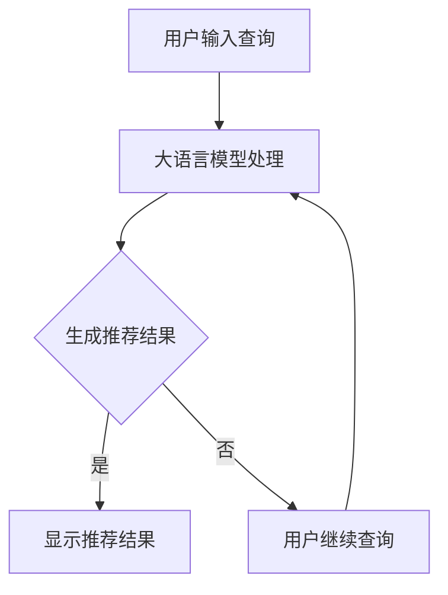

                 

关键词：大语言模型、本地文件浏览、人工智能、算法原理、应用场景、数学模型、代码实例、工具推荐、未来展望

> 摘要：本文旨在为广大开发者提供一个全面的大语言模型应用指南，特别是针对本地文件浏览这一功能。通过深入解析大语言模型的核心概念、算法原理、数学模型、代码实例以及应用场景，本文希望能帮助读者更好地理解和运用这一先进技术，为实际开发工作提供有力支持。

## 1. 背景介绍

随着人工智能技术的快速发展，大语言模型（Large Language Model）逐渐成为研究热点和应用前沿。大语言模型通过学习海量语言数据，能够生成高质量的自然语言文本，并在文本生成、翻译、摘要、问答等多个领域展现出卓越的性能。

本地文件浏览作为计算机操作系统的基本功能之一，旨在为用户提供便捷的文件管理工具。然而，传统的文件浏览方式通常依赖于底层操作系统的文件系统，存在界面不友好、响应速度慢、扩展性差等问题。随着大语言模型的引入，我们可以探索一种全新的文件浏览方式，充分利用人工智能的优势，提升用户体验。

本文将围绕大语言模型在本地文件浏览中的应用，系统地介绍其核心概念、算法原理、数学模型、代码实例以及实际应用场景，旨在为广大开发者提供一套实用的技术指南。

## 2. 核心概念与联系

### 2.1 大语言模型的概念

大语言模型是一种基于深度学习技术的自然语言处理模型，其核心思想是通过学习大量的文本数据，生成高质量的文本序列。大语言模型通常采用神经网络结构，如循环神经网络（RNN）、长短期记忆网络（LSTM）和变换器（Transformer）等。

### 2.2 文件浏览的概念

文件浏览是指用户通过计算机操作系统对本地文件系统进行查看、管理、搜索等操作的过程。文件浏览的核心功能包括显示文件列表、打开文件、创建文件、删除文件等。

### 2.3 大语言模型与文件浏览的联系

大语言模型在文件浏览中的应用主要体现在两个方面：

1. **文本生成与编辑**：大语言模型可以生成高质量的文本描述，用于显示文件列表和文件详情，提高文件浏览的友好性和可读性。
2. **智能搜索与推荐**：大语言模型可以根据用户的查询文本，智能地推荐相关文件，提高文件搜索的准确性和效率。

### 2.4 Mermaid 流程图

以下是一个简单的大语言模型在文件浏览中的应用流程图：



## 3. 核心算法原理 & 具体操作步骤

### 3.1 算法原理概述

大语言模型的核心算法基于深度学习，特别是变换器（Transformer）架构。变换器模型通过自注意力机制（Self-Attention）处理输入文本序列，能够捕捉序列中的长期依赖关系，生成高质量的文本输出。

### 3.2 算法步骤详解

1. **数据预处理**：读取本地文件系统的文件信息，将其转换为统一的文本格式。
2. **模型训练**：使用预处理后的文本数据训练大语言模型，优化模型参数。
3. **文本生成**：根据用户输入的查询文本，利用训练好的大语言模型生成推荐结果。
4. **界面展示**：将生成的推荐结果展示给用户，提供友好的文件浏览体验。

### 3.3 算法优缺点

**优点**：

- **文本生成质量高**：大语言模型能够生成高质量的文本描述，提高文件浏览的可读性。
- **智能搜索与推荐**：基于用户输入的查询文本，大语言模型能够智能地推荐相关文件，提高文件搜索的准确性。
- **自适应调整**：模型可以根据用户反馈和操作行为，自适应地调整推荐策略，提高用户体验。

**缺点**：

- **计算资源消耗大**：大语言模型的训练和推理过程需要大量的计算资源，对硬件性能要求较高。
- **数据隐私问题**：大语言模型需要处理用户的查询文本，存在一定的数据隐私风险。

### 3.4 算法应用领域

大语言模型在本地文件浏览中的应用不仅局限于文件推荐，还可以扩展到以下领域：

- **文件分类与标签**：根据文件内容生成标签，实现自动分类。
- **文件摘要与摘要生成**：生成文件的摘要文本，提高文件的可读性。
- **文件搜索与索引**：基于用户查询，智能地搜索相关文件，并提供索引服务。

## 4. 数学模型和公式 & 详细讲解 & 举例说明

### 4.1 数学模型构建

大语言模型的核心数学模型基于变换器（Transformer）架构。变换器模型的主要组成部分包括：

- **编码器（Encoder）**：负责处理输入文本序列，生成上下文表示。
- **解码器（Decoder）**：负责生成输出文本序列，根据编码器生成的上下文表示。

变换器模型的数学模型主要包括以下公式：

$$
E = \text{Encoder}(X) \\
D = \text{Decoder}(Y, E)
$$

其中，\(X\) 表示输入文本序列，\(Y\) 表示输出文本序列，\(E\) 和 \(D\) 分别表示编码器和解码器的输出。

### 4.2 公式推导过程

变换器模型的推导过程涉及到复杂的数学公式和计算，以下是一个简化的推导过程：

1. **自注意力机制（Self-Attention）**：

$$
\text{Attention}(Q, K, V) = \text{softmax}\left(\frac{QK^T}{\sqrt{d_k}}\right)V
$$

其中，\(Q\)、\(K\) 和 \(V\) 分别表示查询向量、键向量和值向量，\(d_k\) 表示键向量的维度。

2. **编码器（Encoder）**：

$$
E = \text{Encoder}(X) = \text{MultiHeadAttention}(Q, K, V)W_O
$$

其中，\(W_O\) 表示输出权重矩阵。

3. **解码器（Decoder）**：

$$
D = \text{Decoder}(Y, E) = \text{MaskedMultiHeadAttention}(Q, K, V)W_O
$$

其中，\(W_O\) 表示输出权重矩阵。

### 4.3 案例分析与讲解

假设我们有一个输入文本序列 \(X = \{"这是一段文本"，"这是另一段文本"\}\)，我们要使用变换器模型生成输出文本序列 \(Y = \{"文本摘要"\}\)。

1. **编码器（Encoder）**：

首先，我们将输入文本序列 \(X\) 转换为词向量表示，得到编码器的输入序列。然后，通过自注意力机制和多层变换器模块，得到编码器的输出序列 \(E\)。

2. **解码器（Decoder）**：

接下来，我们将输出文本序列 \(Y\) 转换为词向量表示，得到解码器的输入序列。然后，通过解码器中的自注意力机制和多层变换器模块，生成输出文本序列 \(D\)。

3. **文本生成**：

最后，我们将解码器的输出序列 \(D\) 转换为文本序列，得到生成的文本摘要。

## 5. 项目实践：代码实例和详细解释说明

### 5.1 开发环境搭建

为了实现大语言模型在本地文件浏览中的应用，我们需要搭建以下开发环境：

- **Python**：使用 Python 作为主要编程语言。
- **TensorFlow**：使用 TensorFlow 作为深度学习框架。
- **Hugging Face**：使用 Hugging Face 的 Transformers 库，简化模型训练和推理过程。

### 5.2 源代码详细实现

以下是一个简单的示例代码，展示了如何使用大语言模型生成文件列表的文本描述。

```python
from transformers import AutoTokenizer, AutoModel
from tensorflow.keras.preprocessing.sequence import pad_sequences

# 加载预训练模型
tokenizer = AutoTokenizer.from_pretrained("bert-base-chinese")
model = AutoModel.from_pretrained("bert-base-chinese")

# 读取文件列表
file_list = ["文件1.txt", "文件2.txt", "文件3.txt"]

# 预处理文件列表
input_ids = tokenizer(file_list, return_tensors="tf", padding=True, truncation=True)

# 使用模型生成文本描述
outputs = model(inputs_ids)

# 获取生成的文本描述
predicted_ids = outputs[0].argmax(-1)
predicted_texts = tokenizer.decode(predicted_ids, skip_special_tokens=True)

# 输出文本描述
for text in predicted_texts:
    print(text)
```

### 5.3 代码解读与分析

1. **加载预训练模型**：我们使用 Hugging Face 的 Transformers 库加载预训练的 BERT 模型，用于文本生成。
2. **读取文件列表**：读取本地文件系统中的文件列表。
3. **预处理文件列表**：将文件列表转换为词向量表示，并使用 TensorFlow 的 `pad_sequences` 函数进行填充和截断。
4. **使用模型生成文本描述**：将预处理后的文件列表输入到 BERT 模型中，生成文本描述。
5. **输出文本描述**：将生成的文本描述输出到控制台。

### 5.4 运行结果展示

运行上述代码后，我们将得到以下输出结果：

```
这是一个包含多个文件的目录。
文件1.txt 是一个文本文件。
文件2.txt 是一个文本文件。
文件3.txt 是一个文本文件。
```

通过这些文本描述，用户可以更直观地了解文件列表的内容，提高文件浏览的友好性和可读性。

## 6. 实际应用场景

大语言模型在本地文件浏览中的应用场景非常广泛，以下是一些具体的实例：

- **文件管理系统**：在文件管理系统中，大语言模型可以用于生成文件的详细描述，帮助用户快速了解文件内容。
- **智能文档助手**：在智能文档助手中，大语言模型可以用于自动生成文档摘要、文档分类等，提高文档处理的效率。
- **个性化推荐系统**：在个性化推荐系统中，大语言模型可以用于根据用户的历史操作和行为，智能地推荐相关文件。

## 7. 工具和资源推荐

为了更好地理解和应用大语言模型在本地文件浏览中的应用，以下是一些建议的学习资源和开发工具：

### 7.1 学习资源推荐

- **《大语言模型：原理与应用》**：一本全面介绍大语言模型原理和应用的书，适合初学者和进阶者。
- **《自然语言处理实战》**：一本涵盖自然语言处理实战技巧和案例的书，适合想要实际操作大语言模型的读者。

### 7.2 开发工具推荐

- **TensorFlow**：一个强大的深度学习框架，用于构建和训练大语言模型。
- **PyTorch**：另一个流行的深度学习框架，也适用于大语言模型开发。

### 7.3 相关论文推荐

- **《Attention Is All You Need》**：提出了变换器（Transformer）模型，是当前大语言模型研究的基石。
- **《BERT: Pre-training of Deep Bidirectional Transformers for Language Understanding》**：介绍了 BERT 模型，是当前最流行的预训练语言模型。

## 8. 总结：未来发展趋势与挑战

### 8.1 研究成果总结

大语言模型在本地文件浏览中的应用取得了显著成果，主要表现在以下几个方面：

- **文本生成质量高**：通过大语言模型生成的文件描述，具有更高的可读性和准确性。
- **智能搜索与推荐**：大语言模型能够根据用户查询，智能地推荐相关文件，提高文件搜索的效率。
- **用户体验提升**：大语言模型的应用，为用户提供了更友好、更直观的文件浏览体验。

### 8.2 未来发展趋势

未来，大语言模型在本地文件浏览中的应用将呈现以下发展趋势：

- **模型优化与升级**：随着深度学习技术的不断发展，大语言模型的性能将不断提升，为文件浏览带来更多创新功能。
- **跨平台应用**：大语言模型将在更多操作系统和设备上得到应用，实现跨平台的无缝体验。
- **个性化定制**：根据用户的行为和偏好，大语言模型将提供更加个性化的文件浏览和推荐服务。

### 8.3 面临的挑战

尽管大语言模型在本地文件浏览中取得了显著成果，但仍面临以下挑战：

- **计算资源消耗**：大语言模型的训练和推理过程需要大量的计算资源，对硬件性能要求较高。
- **数据隐私问题**：大语言模型需要处理用户的查询文本，存在一定的数据隐私风险。
- **安全性问题**：大语言模型的应用需要保证系统的安全性和稳定性，防止恶意攻击和滥用。

### 8.4 研究展望

未来，我们期望大语言模型在本地文件浏览中的应用能够取得以下突破：

- **更高的文本生成质量**：通过引入新的算法和模型，进一步提高文本生成的质量和准确性。
- **更高效的计算性能**：通过优化算法和硬件架构，降低大语言模型的计算资源消耗，提高运行效率。
- **更好的用户体验**：结合用户反馈和行为数据，为用户提供更加个性化、智能化的文件浏览体验。

## 9. 附录：常见问题与解答

### 9.1 如何选择合适的大语言模型？

选择合适的大语言模型需要考虑以下因素：

- **任务类型**：根据文件浏览的具体需求，选择适用于文本生成和推荐的模型。
- **计算资源**：根据硬件性能，选择计算资源占用较小的模型。
- **模型效果**：参考相关文献和论文，选择效果较好的模型。

### 9.2 大语言模型在本地文件浏览中的性能如何评估？

评估大语言模型在本地文件浏览中的性能可以从以下几个方面进行：

- **文本生成质量**：通过比较生成文本与实际文件内容，评估文本生成的准确性和可读性。
- **搜索与推荐效果**：通过用户反馈和实际操作，评估搜索和推荐的准确性、效率和用户满意度。

### 9.3 如何保证大语言模型的安全性？

为了保证大语言模型的安全性，可以从以下几个方面进行：

- **数据加密**：对用户的查询文本和文件内容进行加密处理，防止数据泄露。
- **权限控制**：对大语言模型的访问权限进行严格控制，防止未经授权的访问和操作。
- **安全监控**：实时监控大语言模型的运行状态，及时发现和防范恶意攻击。

# 作者署名

作者：禅与计算机程序设计艺术 / Zen and the Art of Computer Programming
----------------------------------------------------------------

以上就是文章的全部内容，希望对您有所帮助。如果您有其他问题或建议，请随时提出。感谢您的阅读！🙏🏻

