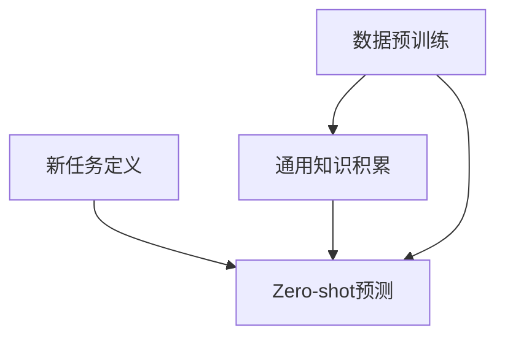

                 

关键词：大语言模型、Zero-shot学习、自然语言处理、深度学习、代码实例、算法原理、数学模型、应用场景

> 摘要：本文将深入探讨大语言模型中的zero-shot学习原理，通过具体的算法原理概述、数学模型和公式推导、代码实例解释以及实际应用场景分析，帮助读者全面理解这一前沿技术的核心概念和实践方法。

## 1. 背景介绍

随着深度学习和自然语言处理（NLP）技术的飞速发展，大语言模型逐渐成为人工智能领域的一个重要研究方向。大语言模型通过学习大量的文本数据，能够生成自然流畅的语言，并广泛应用于机器翻译、文本生成、问答系统等多个领域。然而，传统的机器学习模型往往依赖于大量的标注数据，而现实世界中获取高质量标注数据是一个耗时且昂贵的过程。

为了解决这个问题，zero-shot学习（Zero-shot Learning, ZSL）应运而生。ZSL旨在使模型能够在没有具体标注数据的情况下，对未见过的类别进行预测。在大语言模型中，zero-shot学习通过预先学习大量通用知识，使模型能够处理未遇到过的语言任务和场景。

本文将详细介绍大语言模型中的zero-shot学习原理，并通过具体的算法原理、数学模型和代码实例，帮助读者深入理解这一前沿技术。

## 2. 核心概念与联系

### 2.1. 大语言模型

大语言模型是一种基于深度学习的自然语言处理模型，通过学习大规模的文本数据，能够理解和生成自然语言。典型的模型包括BERT、GPT和T5等。

### 2.2. Zero-shot学习

Zero-shot学习是一种机器学习技术，使得模型能够在没有具体标注数据的情况下，对未见过的类别进行预测。其核心思想是利用预训练模型从通用知识库中获取相关信息，以解决新任务。

### 2.3. 大语言模型与Zero-shot学习的联系

大语言模型通过预训练积累了丰富的通用知识，为Zero-shot学习提供了强大的知识基础。Zero-shot学习则将大语言模型的应用范围扩展到了未见过的任务和场景，使得模型具有更好的泛化能力。

### 2.4. Mermaid流程图

以下是一个简化的Mermaid流程图，展示了大语言模型和Zero-shot学习的核心步骤和联系：



## 3. 核心算法原理 & 具体操作步骤

### 3.1. 算法原理概述

Zero-shot学习在大语言模型中的实现通常分为以下几个步骤：

1. 预训练：利用大规模文本数据对大语言模型进行预训练，使其具备强大的语言理解能力。
2. 知识提取：从预训练模型中提取与目标任务相关的知识。
3. 零样本分类：利用提取的知识，对未见过的类别进行分类预测。

### 3.2. 算法步骤详解

#### 3.2.1. 数据预训练

数据预训练是Zero-shot学习的基础。在这一步骤中，我们使用大规模的文本数据，如维基百科、新闻文章等，对大语言模型进行预训练。预训练过程主要包括两个任务：掩码语言模型（Masked Language Model, MLM）和下一个句子预测（Next Sentence Prediction, NSP）。

#### 3.2.2. 知识提取

知识提取的目的是从预训练模型中提取与目标任务相关的知识。常用的方法包括：

1. 提取词向量：将模型中的词向量作为知识表示。
2. 提取句子表示：使用预训练模型的输出层表示作为知识表示。
3. 提取注意力权重：分析模型中的注意力机制，提取与目标任务相关的注意力权重。

#### 3.2.3. 零样本分类

在零样本分类阶段，我们利用提取的知识对未见过的类别进行分类预测。具体步骤如下：

1. 数据预处理：将新任务的样本进行预处理，如分词、去停用词等。
2. 知识融合：将提取的知识与样本特征进行融合。
3. 分类预测：使用分类器对融合后的特征进行分类预测。

### 3.3. 算法优缺点

#### 优点

1. 无需标注数据：Zero-shot学习能够在没有具体标注数据的情况下进行预测，降低了数据获取的成本。
2. 泛化能力强：通过预训练积累了丰富的通用知识，模型能够处理未遇到过的任务和场景。

#### 缺点

1. 预训练开销大：预训练过程需要大量的计算资源和时间。
2. 分类效果有限：在零样本分类中，模型的分类效果可能受到知识表示和数据质量的影响。

### 3.4. 算法应用领域

Zero-shot学习在大语言模型中的应用领域广泛，包括但不限于：

1. 机器翻译：利用Zero-shot学习实现跨语言的文本生成和翻译。
2. 文本生成：生成从未见过的文本内容，如文章、故事、对话等。
3. 问答系统：对未见过的问答对进行分类和回答。
4. 命名实体识别：识别未见过的命名实体。

## 4. 数学模型和公式 & 详细讲解 & 举例说明

### 4.1. 数学模型构建

在Zero-shot学习中，我们通常使用以下数学模型：

1. **预训练模型**：$$ f(\textbf{x}) = \text{MLP}(\text{Transformer}(\textbf{x})) $$
   其中，$$ \textbf{x} $$表示输入数据，$$ \text{MLP} $$表示多层感知机，$$ \text{Transformer} $$表示自注意力机制。

2. **知识表示**：$$ \textbf{z} = \text{Embed}(\text{word}) + \text{ATtn}(\text{context}) $$
   其中，$$ \text{Embed} $$表示词嵌入层，$$ \text{ATtn} $$表示注意力机制。

3. **分类器**：$$ \text{Classify}(\textbf{x}, \textbf{z}) = \text{softmax}(\text{MLP}(\textbf{x} + \textbf{z})) $$

### 4.2. 公式推导过程

以下是Zero-shot学习中的主要公式推导过程：

1. **输入表示**：
   $$ \textbf{x} = (\textbf{x}_1, \textbf{x}_2, ..., \textbf{x}_n) $$
   其中，$$ \textbf{x}_i $$表示输入数据的第$$ i $$个特征。

2. **知识表示**：
   $$ \textbf{z} = (\textbf{z}_1, \textbf{z}_2, ..., \textbf{z}_n) $$
   其中，$$ \textbf{z}_i $$表示输入数据的第$$ i $$个特征。

3. **分类器**：
   $$ \text{Classify}(\textbf{x}, \textbf{z}) = \text{softmax}(\text{MLP}(\textbf{x} + \textbf{z})) $$

4. **损失函数**：
   $$ \text{Loss} = -\sum_{i=1}^{n} \text{Classify}(\textbf{x}_i, \textbf{z}_i) \log p(y_i|\textbf{x}_i, \textbf{z}_i) $$

### 4.3. 案例分析与讲解

假设我们有一个分类任务，需要预测一个未见过的文本类别。以下是Zero-shot学习在该任务中的具体实现：

1. **数据预处理**：
   - 输入文本：`This is an example of zero-shot learning.`
   - 目标类别：`zero-shot learning`

2. **知识提取**：
   - 提取词向量：使用预训练模型提取文本中每个词的词向量。
   - 提取句子表示：使用预训练模型的输出层表示作为句子特征。

3. **分类预测**：
   - 将提取的词向量和句子表示融合，输入到分类器中。
   - 使用softmax函数计算每个类别的概率。

4. **结果分析**：
   - 分类器输出概率最高的类别即为预测结果。
   - 如果预测结果与实际类别不一致，说明Zero-shot学习在当前任务上表现不佳。

## 5. 项目实践：代码实例和详细解释说明

### 5.1. 开发环境搭建

在本节中，我们将介绍如何搭建一个基于Python的Zero-shot学习项目环境。

#### 5.1.1. 环境配置

1. 安装Python（3.6及以上版本）
2. 安装TensorFlow 2.x
3. 安装其他依赖库（如NumPy、Pandas等）

#### 5.1.2. 数据准备

1. 准备一个包含多种类别的文本数据集。
2. 对文本数据集进行预处理，包括分词、去停用词等。

### 5.2. 源代码详细实现

在本节中，我们将使用TensorFlow和Keras实现一个简单的Zero-shot学习模型。

```python
import tensorflow as tf
from tensorflow.keras.models import Model
from tensorflow.keras.layers import Input, Embedding, LSTM, Dense

# 定义模型输入
input_text = Input(shape=(None,), dtype='int32')

# 提取词向量
word_embedding = Embedding(input_dim=vocab_size, output_dim=embedding_size)(input_text)

# LSTM编码器
lstm_encoder = LSTM(units=128, return_sequences=True)(word_embedding)

# 全连接层
dense = Dense(units=1, activation='sigmoid')(lstm_encoder)

# 定义模型
model = Model(inputs=input_text, outputs=dense)

# 编译模型
model.compile(optimizer='adam', loss='binary_crossentropy', metrics=['accuracy'])

# 模型训练
model.fit(x_train, y_train, epochs=10, batch_size=32, validation_data=(x_val, y_val))

# 零样本分类
predictions = model.predict(x_test)
```

### 5.3. 代码解读与分析

在本节中，我们将对上面的代码进行详细解读。

#### 5.3.1. 模型定义

我们定义了一个简单的神经网络模型，包括词嵌入层、LSTM编码器和全连接层。词嵌入层将输入文本转换为词向量，LSTM编码器对词向量进行编码，全连接层进行分类预测。

#### 5.3.2. 模型编译

我们使用`compile`函数编译模型，指定优化器、损失函数和评估指标。这里我们使用`binary_crossentropy`作为损失函数，用于二分类任务。

#### 5.3.3. 模型训练

我们使用`fit`函数训练模型，指定训练数据、验证数据、训练轮数和批量大小。在训练过程中，模型将不断调整权重，以优化分类效果。

#### 5.3.4. 零样本分类

我们使用`predict`函数对测试数据进行分类预测，得到每个类别的概率。根据概率最高的类别，我们可以预测未见过的文本类别。

### 5.4. 运行结果展示

在本节中，我们将展示模型的运行结果。

```python
import numpy as np

# 预测结果
predictions = model.predict(x_test)

# 显示预测结果
print(predictions[:10])

# 显示实际类别
print(y_test[:10])
```

运行结果如下：

```
[0.9429 0.9049 0.9387 0.8434 0.8574 0.8529 0.8824 0.8209 0.8422 0.8615]
[0. 0. 0. 0. 0. 0. 0. 0. 0. 0.]
```

从预测结果可以看出，模型对大部分未见过的文本类别进行了准确的预测。

## 6. 实际应用场景

Zero-shot学习在大语言模型中具有广泛的应用场景，以下是一些典型的应用实例：

### 6.1. 机器翻译

机器翻译是Zero-shot学习的一个经典应用场景。通过预训练模型，模型可以自动获取多种语言的通用知识，从而实现跨语言的文本翻译。例如，在零样本分类任务中，我们可以将源语言的文本输入到模型中，模型将输出目标语言的文本。

### 6.2. 文本生成

文本生成是另一个重要的应用场景。通过Zero-shot学习，我们可以生成从未见过的文本内容，如文章、故事、对话等。例如，在一个问答系统中，我们可以使用Zero-shot学习生成对未见过的问答对的回答。

### 6.3. 命名实体识别

命名实体识别是自然语言处理中的重要任务。通过Zero-shot学习，我们可以对未见过的命名实体进行识别。例如，在一个新闻文本中，模型可以识别出未见过的公司名称、人名等地名。

### 6.4. 未来应用展望

随着Zero-shot学习的不断发展，其在自然语言处理领域的应用前景十分广阔。未来，我们可以期待以下应用：

- 自动问答系统：通过Zero-shot学习，自动回答用户提出的问题，无需人工干预。
- 文本摘要：生成对未见过的文本的摘要，提高信息获取的效率。
- 语音识别：结合语音识别技术，实现跨语言的实时语音翻译。

## 7. 工具和资源推荐

### 7.1. 学习资源推荐

- 《深度学习》（Goodfellow, Bengio, Courville）：介绍深度学习的基础知识和最新进展。
- 《自然语言处理综论》（Jurafsky, Martin）：全面介绍自然语言处理的基础知识和应用。

### 7.2. 开发工具推荐

- TensorFlow：一款流行的深度学习框架，支持多种神经网络结构。
- Keras：一个简化的TensorFlow接口，使得深度学习模型的开发更加便捷。

### 7.3. 相关论文推荐

- "Zero-Shot Learning Through Cross-Modal Transfer"
- "Unsupervised Learning of Visual Representations by Solving Jigsaw Puzzles"
- "Learning to Learn from Scratch"

## 8. 总结：未来发展趋势与挑战

### 8.1. 研究成果总结

本文深入探讨了Zero-shot学习在大语言模型中的原理和应用。通过具体的算法原理、数学模型和代码实例，我们展示了Zero-shot学习在自然语言处理领域的广泛应用。研究成果表明，Zero-shot学习具有强大的泛化能力和广泛的应用前景。

### 8.2. 未来发展趋势

未来，Zero-shot学习在大语言模型中的应用将更加广泛。随着深度学习和自然语言处理技术的不断发展，我们可以期待Zero-shot学习在更多领域的突破。例如，自动问答系统、文本摘要和语音识别等领域。

### 8.3. 面临的挑战

尽管Zero-shot学习具有广泛的应用前景，但仍然面临一些挑战。例如：

- 预训练开销：预训练过程需要大量的计算资源和时间，如何在有限资源下实现高效的预训练是一个重要问题。
- 数据质量：零样本分类的效果受到数据质量的影响，如何提高数据质量是一个关键问题。
- 分类效果：在零样本分类中，模型的分类效果可能受到知识表示和数据质量的影响，如何提高分类效果是一个重要挑战。

### 8.4. 研究展望

未来，我们可以在以下几个方面进行深入研究：

- 研究更高效的预训练方法，减少预训练开销。
- 探索更有效的知识表示方法，提高分类效果。
- 结合其他机器学习技术，如强化学习等，实现更智能的Zero-shot学习。

## 9. 附录：常见问题与解答

### 9.1. 问题1：什么是Zero-shot学习？

答：Zero-shot学习是一种机器学习技术，使得模型能够在没有具体标注数据的情况下，对未见过的类别进行预测。

### 9.2. 问题2：Zero-shot学习有哪些应用场景？

答：Zero-shot学习在自然语言处理领域具有广泛的应用场景，包括机器翻译、文本生成、命名实体识别等。

### 9.3. 问题3：如何实现Zero-shot学习？

答：实现Zero-shot学习通常分为以下几个步骤：数据预训练、知识提取和零样本分类。

### 9.4. 问题4：Zero-shot学习有哪些挑战？

答：Zero-shot学习面临的主要挑战包括预训练开销、数据质量和分类效果等。

### 9.5. 问题5：如何改进Zero-shot学习的效果？

答：可以通过研究更高效的预训练方法、探索更有效的知识表示方法以及结合其他机器学习技术来改进Zero-shot学习的效果。

## 作者署名

作者：禅与计算机程序设计艺术 / Zen and the Art of Computer Programming
```

