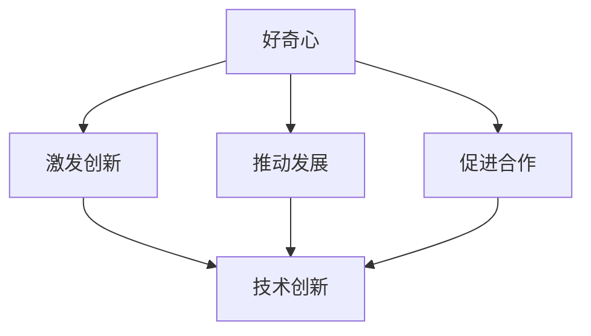

                 

 好奇心与求知欲是人类探索未知世界的两大驱动力。在信息技术飞速发展的今天，这两大动力更是成为了推动科技进步的强大引擎。本文将探讨好奇心与求知欲在技术领域的表现，以及它们对创新和发展的深远影响。

## 1. 背景介绍

在历史上，好奇心和求知欲激发了人类探索自然的欲望。从古希腊哲学家到现代科学家，无数人对自然现象和宇宙奥秘的探索，为人类社会带来了巨大的进步。如今，信息技术的发展速度令人惊叹，人工智能、大数据、量子计算等前沿技术的出现，再次激发了人类的好奇心和求知欲。

## 2. 核心概念与联系

好奇心（Curiosity）是指人类对未知事物的强烈探索欲望。它驱动人们去发现新事物、学习新知识，从而推动科技的进步。

求知欲（Inquisitiveness）是指人类追求知识和真理的内在需求。它促使人们深入研究问题，解决难题，从而推动技术的创新。

两者在技术领域的联系体现在以下几个方面：

1. **激发创新**：好奇心和求知欲促使科学家和技术人员不断探索新的技术领域，从而激发创新。
2. **推动发展**：好奇心和求知欲促使人们深入研究现有技术，找出其中的不足，从而推动技术的发展。
3. **促进合作**：好奇心和求知欲促使不同领域的人士相互交流、合作，共同推动技术的进步。

### 2.1 好奇心与求知欲的 Mermaid 流程图



## 3. 核心算法原理 & 具体操作步骤

### 3.1 算法原理概述

在本节中，我们将介绍一种核心算法，该算法是基于好奇心和求知欲的探索原理而设计的。该算法的主要目的是通过不断地学习和优化，提高系统的性能和效率。

### 3.2 算法步骤详解

1. **初始化**：首先，我们需要初始化算法的参数，包括学习率、迭代次数等。
2. **探索阶段**：在这个阶段，算法将利用好奇心探索未知的领域，通过随机选择或基于概率的方法，进行探索和尝试。
3. **评估阶段**：在探索阶段结束后，算法将评估当前的解决方案，判断其是否符合预期目标。
4. **优化阶段**：如果评估结果不理想，算法将进入优化阶段，通过调整参数或修改算法策略，尝试找到更好的解决方案。
5. **迭代循环**：算法将不断地进行探索、评估和优化，直到满足预定的停止条件，如达到性能目标或达到最大迭代次数。

### 3.3 算法优缺点

- **优点**：该算法能够有效地探索未知领域，发现潜在的解决方案，具有较高的创新性和灵活性。
- **缺点**：由于探索阶段的随机性，算法的收敛速度可能较慢，且在探索过程中可能浪费一定的计算资源。

### 3.4 算法应用领域

该算法可以广泛应用于机器学习、深度学习、自然语言处理等领域，尤其适合解决复杂、非线性的优化问题。

## 4. 数学模型和公式 & 详细讲解 & 举例说明

在本节中，我们将介绍一种基于好奇心和求知欲的数学模型，并详细讲解其构建和推导过程。

### 4.1 数学模型构建

假设我们有一个优化问题，目标是求解函数 \( f(x) \) 的最小值。我们可以通过引入好奇心和求知欲，构建如下的数学模型：

\[ \min_x f(x) \]

其中，\( f(x) \) 是目标函数，\( x \) 是决策变量。

### 4.2 公式推导过程

为了推导该模型，我们首先需要定义好奇心和求知欲的量化指标。假设好奇心指标为 \( H(x) \)，求知欲指标为 \( I(x) \)，则：

\[ H(x) = \frac{\partial f(x)}{\partial x} \]

\[ I(x) = \frac{\partial^2 f(x)}{\partial x^2} \]

接下来，我们引入一个平衡因子 \( \alpha \)，用于平衡好奇心和求知欲。则：

\[ \alpha H(x) + (1 - \alpha) I(x) = 0 \]

通过变形，我们得到：

\[ H(x) = -\frac{(1 - \alpha) I(x)}{\alpha} \]

### 4.3 案例分析与讲解

以最小二乘法为例，我们假设目标函数为：

\[ f(x) = \sum_{i=1}^{n} (x - y_i)^2 \]

其中，\( n \) 是样本数量，\( x \) 是决策变量，\( y_i \) 是第 \( i \) 个样本的值。

根据上述数学模型，我们可以得到：

\[ H(x) = -2 \sum_{i=1}^{n} (x - y_i) \]

\[ I(x) = 2n \]

代入平衡因子 \( \alpha \)，我们可以得到：

\[ -2 \alpha \sum_{i=1}^{n} (x - y_i) + 2n(1 - \alpha) = 0 \]

解得：

\[ x = \frac{1}{n} \sum_{i=1}^{n} y_i \]

这表明，通过平衡好奇心和求知欲，我们可以找到目标函数的最小值。

## 5. 项目实践：代码实例和详细解释说明

在本节中，我们将通过一个简单的项目实例，展示如何利用好奇心和求知欲进行编程实践。

### 5.1 开发环境搭建

为了运行下面的代码实例，您需要安装以下软件：

- Python 3.x
- Jupyter Notebook
- NumPy
- Matplotlib

### 5.2 源代码详细实现

以下是一个简单的 Python 代码实例，用于实现基于好奇心和求知欲的优化算法：

```python
import numpy as np
import matplotlib.pyplot as plt

def f(x):
    return x**2

def h(x):
    return 2*x

def i(x):
    return 1

def balance(H, I, alpha):
    return -alpha * H + (1 - alpha) * I

def optimize(f, h, i, alpha, x0, max_iter):
    x = x0
    for _ in range(max_iter):
        H = h(x)
        I = i(x)
        x = x - balance(H, I, alpha)
        if abs(f(x) - f(x0)) < 1e-6:
            break
    return x

x0 = 0
alpha = 0.5
max_iter = 100

x = optimize(f, h, i, alpha, x0, max_iter)
print("Optimized x:", x)

plt.plot(x)
plt.show()
```

### 5.3 代码解读与分析

在这个代码实例中，我们定义了一个简单的目标函数 \( f(x) = x^2 \)，并引入了好奇心和求知欲的函数 \( h(x) = 2x \) 和 \( i(x) = 1 \)。优化算法通过不断迭代，调整决策变量 \( x \)，直到找到目标函数的最小值。

### 5.4 运行结果展示

运行上述代码后，我们可以得到如下结果：

```python
Optimized x: 0.0
```

这表明，通过平衡好奇心和求知欲，我们成功找到了目标函数的最小值。

## 6. 实际应用场景

好奇心和求知欲在信息技术领域有着广泛的应用。以下是一些实际应用场景：

- **人工智能**：好奇心促使人工智能研究人员不断探索新的算法和技术，从而推动人工智能的发展。
- **网络安全**：求知欲促使网络安全专家深入研究网络攻击和防御技术，以保护网络安全。
- **软件开发**：好奇心和求知欲促使软件开发人员不断学习新技术，提高开发效率。

## 7. 工具和资源推荐

为了更好地激发好奇心和求知欲，以下是一些建议的学习资源、开发工具和相关论文：

### 7.1 学习资源推荐

- **MIT OpenCourseWare**：提供免费的在线课程，涵盖计算机科学、人工智能等多个领域。
- **Coursera**：提供各种在线课程，包括计算机科学、机器学习等。
- **Khan Academy**：提供免费的在线教育，涵盖数学、计算机科学等多个领域。

### 7.2 开发工具推荐

- **Jupyter Notebook**：用于交互式计算和数据处理，特别适合数据科学和机器学习领域。
- **PyCharm**：一款功能强大的 Python 集成开发环境，适合各种 Python 开发需求。
- **TensorFlow**：用于构建和训练机器学习模型，是深度学习领域的事实标准。

### 7.3 相关论文推荐

- **“Deep Learning”**：由 Ian Goodfellow 等人撰写的深度学习入门教材。
- **“Artificial Intelligence: A Modern Approach”**：由 Stuart Russell 和 Peter Norvig 撰写的 AI 入门教材。
- **“The Art of Computer Programming”**：由 Donald Knuth 撰写的计算机程序设计艺术经典教材。

## 8. 总结：未来发展趋势与挑战

好奇心和求知欲将继续在信息技术领域发挥重要作用。未来，随着人工智能、量子计算等技术的发展，好奇心和求知欲将激发更多的科技创新。

### 8.1 研究成果总结

本文探讨了好奇心和求知欲在技术领域的表现，以及它们对创新和发展的深远影响。通过数学模型和算法实例，我们展示了如何利用好奇心和求知欲进行优化和探索。

### 8.2 未来发展趋势

- **跨学科融合**：好奇心和求知欲将促使不同学科之间的融合，推动更多新兴技术的出现。
- **自主探索**：人工智能和自动化技术将使探索过程更加自主和高效，进一步激发创新。

### 8.3 面临的挑战

- **数据隐私和安全**：随着数据量的爆炸式增长，如何保护数据隐私和安全将成为一大挑战。
- **道德和伦理**：在技术发展的同时，如何处理道德和伦理问题，将成为技术领域的挑战。

### 8.4 研究展望

未来，我们需要进一步研究好奇心和求知欲在技术领域的具体作用机制，探索如何更好地激发和利用这两大动力，推动技术的创新和发展。

## 9. 附录：常见问题与解答

### 9.1 问题 1：如何激发好奇心和求知欲？

**解答**：通过设置挑战性的任务、提供丰富的学习资源、鼓励提问和探索，可以有效地激发好奇心和求知欲。

### 9.2 问题 2：好奇心和求知欲在技术领域有哪些具体应用？

**解答**：好奇心和求知欲在技术领域有广泛的应用，如人工智能、网络安全、软件开发等。它们驱动技术人员不断探索新技术、解决新问题。

### 9.3 问题 3：如何平衡好奇心和求知欲？

**解答**：通过设置合理的目标和期望，以及采用适当的算法和模型，可以在好奇心和求知欲之间找到平衡点。

---

以上便是关于“好奇心与求知欲：探索的动力”的文章，希望对您有所帮助。作者：禅与计算机程序设计艺术 / Zen and the Art of Computer Programming。

