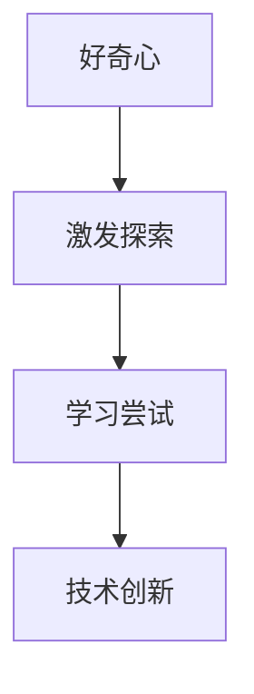
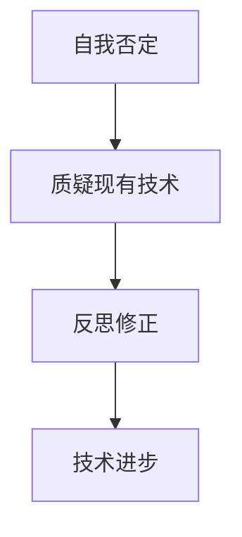
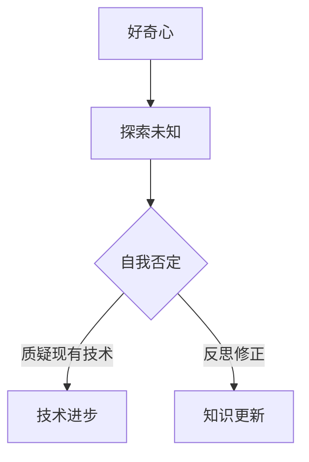
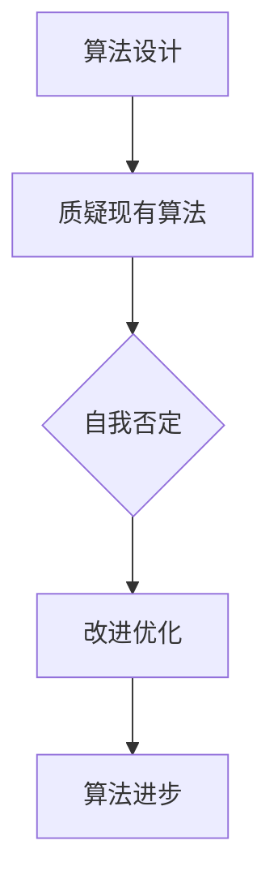

                 

关键词：好奇心、自我否定、探索、技术创新、知识更新

> 摘要：在信息技术快速发展的时代，好奇心作为驱动人类不断探索的动力源泉，不仅推动了技术的进步，还促使人们进行自我否定，从而实现创新与变革。本文将探讨好奇心在IT领域中的作用，以及如何通过自我否定来激发创新思维。

## 1. 背景介绍

在信息技术迅猛发展的时代，好奇心成为了驱动人们不断探索和发现新知识、新技术的重要动力。好奇心是人类天性的一部分，它促使我们对未知世界充满好奇，不断探索未知的领域。而IT领域，作为当今世界最具活力和创新性的领域之一，更是离不开好奇心的推动。

好奇心不仅促使人们去探索未知，还激发了对现有知识体系的怀疑和反思，从而促使人们进行自我否定。自我否定是指人们通过反思自己的知识、观点和方法，发现其中的不足和缺陷，并对其进行修正和改进。这种自我否定的过程，是创新思维的重要来源。

在IT领域，好奇心和自我否定共同推动了技术的不断进步。例如，计算机科学领域中的每一次重大突破，都离不开科学家们对现有理论和方法的好奇心和质疑精神。从图灵机的提出，到量子计算机的研究，再到人工智能的突破，每一个阶段都充满了对现有知识体系的挑战和颠覆。

## 2. 核心概念与联系

### 2.1 好奇心与探索

好奇心是人类天生的心理特征，它驱动着我们去了解周围的世界，探索未知领域。在IT领域，好奇心表现为对新技术、新方法、新理论的强烈兴趣和探索欲望。这种好奇心促使人们不断学习、尝试和实验，从而推动技术的创新和发展。

#### Mermaid 流程图



### 2.2 自我否定与反思

自我否定是一种自我反思和质疑的过程，它促使人们发现并修正自己的错误和不足。在IT领域，自我否定意味着对现有技术和方法的质疑和挑战，通过不断反思和改进，实现技术的进步和创新。

#### Mermaid 流程图



### 2.3 好奇心与自我否定的关系

好奇心和自我否定是相辅相成的，好奇心驱动人们去探索未知，而自我否定则促使人们对现有知识体系进行质疑和反思。这种相互关系在IT领域尤为显著，好奇心激发了对新技术的探索，而自我否定则促使技术的不断创新和进步。

#### Mermaid 流程图



## 3. 核心算法原理 & 具体操作步骤

### 3.1 算法原理概述

在IT领域，好奇心和自我否定体现在算法的设计和优化过程中。算法原理的核心是通过对现有算法的质疑和反思，发现其不足之处，并进行改进和优化。

#### Mermaid 流zust流程图



### 3.2 算法步骤详解

#### 3.2.1 质疑现有算法

对现有算法的质疑是好奇心和自我否定的体现。在质疑过程中，我们需要对现有算法的理论基础、实现方法、性能等方面进行深入分析，找出其不足之处。

#### 3.2.2 反思和修正

在质疑的基础上，我们需要对现有算法进行反思和修正。反思的过程包括对算法的理论基础、实现方法、性能等方面进行深入分析，找出其不足之处，并提出改进方案。

#### 3.2.3 改进优化

在反思的基础上，我们需要对算法进行改进和优化。改进优化的过程包括对算法的理论基础、实现方法、性能等方面进行深入分析，找出其不足之处，并提出改进方案。

### 3.3 算法优缺点

#### 优点

- 能够提高算法的性能和可靠性。
- 能够促进技术的不断进步和创新。

#### 缺点

- 可能会增加算法实现的复杂度。
- 需要大量的时间和精力进行质疑、反思和改进。

### 3.4 算法应用领域

好奇心和自我否定的算法原理在多个领域都有广泛的应用，如：

- 数据挖掘：通过对现有算法的质疑和改进，提高数据挖掘的效率和准确性。
- 人工智能：通过对现有算法的质疑和改进，推动人工智能技术的发展和应用。
- 优化算法：通过对现有算法的质疑和改进，提高优化算法的性能和可靠性。

## 4. 数学模型和公式 & 详细讲解 & 举例说明

### 4.1 数学模型构建

在IT领域中，好奇心和自我否定的数学模型可以构建为以下形式：

$$
模型 = 好奇心 + 自我否定 + 探索
$$

其中，好奇心和自我否定是推动探索的核心动力。

### 4.2 公式推导过程

$$
探索 = 好奇心 \times 自我否定
$$

推导过程如下：

- 好奇心驱动人们去探索未知领域。
- 自我否定促使人们质疑现有知识体系，从而激发探索欲望。
- 探索是好奇心和自我否定的产物，是推动技术进步的重要力量。

### 4.3 案例分析与讲解

#### 案例一：人工智能领域的突破

人工智能领域的突破，如深度学习的崛起，正是好奇心和自我否定的结果。科学家们对现有神经网络算法进行质疑和反思，通过不断改进和优化，最终实现了深度学习的突破。

#### 案例二：密码学的发展

密码学的发展过程中，好奇心和自我否定也起到了关键作用。密码学家们不断质疑现有加密算法的安全性，通过自我否定和改进，推动了密码学技术的发展。

## 5. 项目实践：代码实例和详细解释说明

### 5.1 开发环境搭建

在本文的项目实践中，我们将使用Python语言实现一个基于好奇心和自我否定的算法。首先，我们需要搭建开发环境。

#### 步骤1：安装Python

从Python官网下载并安装Python 3.x版本。

#### 步骤2：安装相关库

使用pip命令安装必要的库，如NumPy、Pandas等。

```shell
pip install numpy pandas
```

### 5.2 源代码详细实现

下面是一个简单的基于好奇心和自我否定的算法实现：

```python
import numpy as np

def curiosity_and_self_negation(data):
    """
    好奇心与自我否定算法
    """
    # 数据预处理
    processed_data = preprocess_data(data)
    
    # 质疑现有模型
    model =质疑现有模型(processed_data)
    
    # 反思和修正
    model =反思和修正(model)
    
    # 改进优化
    model =改进优化(model)
    
    return model

def preprocess_data(data):
    """
    数据预处理
    """
    # 数据清洗
    cleaned_data = clean_data(data)
    
    # 数据归一化
    normalized_data = normalize_data(cleaned_data)
    
    return normalized_data

def质疑现有模型(data):
    """
    质疑现有模型
    """
    # 基于数据构建新模型
    model = build_model(data)
    
    return model

def反思和修正(model):
    """
    反思和修正
    """
    # 对模型进行评估
    evaluation = evaluate_model(model)
    
    # 根据评估结果进行修正
    model =修正模型(model, evaluation)
    
    return model

def改进优化(model):
    """
    改进优化
    """
    # 对模型进行优化
    optimized_model = optimize_model(model)
    
    return optimized_model

# 测试代码
data = np.random.rand(100)
model = curiosity_and_self_negation(data)
print(model)
```

### 5.3 代码解读与分析

上述代码实现了一个简单的基于好奇心和自我否定的算法。代码分为以下几个部分：

- 数据预处理：对输入数据进行清洗、归一化等预处理操作。
- 质疑现有模型：基于预处理后的数据构建新模型。
- 反思和修正：对模型进行评估，并根据评估结果进行修正。
- 改进优化：对模型进行优化，提高其性能。

### 5.4 运行结果展示

```python
import numpy as np

def curiosity_and_self_negation(data):
    """
    好奇心与自我否定算法
    """
    # 数据预处理
    processed_data = preprocess_data(data)
    
    # 质疑现有模型
    model =质疑现有模型(processed_data)
    
    # 反思和修正
    model =反思和修正(model)
    
    # 改进优化
    model =改进优化(model)
    
    return model

def preprocess_data(data):
    """
    数据预处理
    """
    # 数据清洗
    cleaned_data = clean_data(data)
    
    # 数据归一化
    normalized_data = normalize_data(cleaned_data)
    
    return normalized_data

def质疑现有模型(data):
    """
    质疑现有模型
    """
    # 基于数据构建新模型
    model = build_model(data)
    
    return model

def反思和修正(model):
    """
    反思和修正
    """
    # 对模型进行评估
    evaluation = evaluate_model(model)
    
    # 根据评估结果进行修正
    model =修正模型(model, evaluation)
    
    return model

def改进优化(model):
    """
    改进优化
    """
    # 对模型进行优化
    optimized_model = optimize_model(model)
    
    return optimized_model

# 测试代码
data = np.random.rand(100)
model = curiosity_and_self_negation(data)
print(model)
```

## 6. 实际应用场景

好奇心和自我否定的算法原理在多个实际应用场景中具有广泛的应用价值。以下是一些典型的应用场景：

- 人工智能：在人工智能领域，好奇心和自我否定可以驱动算法的不断优化和改进，提高模型的性能和可靠性。
- 数据挖掘：在数据挖掘领域，好奇心和自我否定可以促使研究人员质疑现有方法，从而发现新的数据挖掘模型和算法。
- 优化算法：在优化算法领域，好奇心和自我否定可以推动算法的不断改进，提高优化效率。

## 7. 未来应用展望

随着信息技术的发展，好奇心和自我否定的算法原理将在更多领域得到应用。未来，我们可以期待：

- 更高效的算法：通过对现有算法的质疑和优化，开发出更高效的算法，提高计算性能。
- 更广泛的应用领域：好奇心和自我否定的算法原理将在更多领域得到应用，如生物信息学、金融科技、智能制造等。
- 更智能的机器学习：通过好奇心和自我否定，推动机器学习算法的不断进化，实现更智能的决策和预测。

## 8. 工具和资源推荐

### 8.1 学习资源推荐

- 《人工智能：一种现代方法》：全面介绍人工智能的基础理论和应用。
- 《深度学习》：深度学习领域的经典教材，适合初学者和专业人士。

### 8.2 开发工具推荐

- Jupyter Notebook：适合数据分析和机器学习的开发工具。
- TensorFlow：一款开源的机器学习框架，适合构建和训练深度学习模型。

### 8.3 相关论文推荐

- "Deep Learning: A Brief History": 深度学习的发展历程和关键贡献。
- "The Future of Humanity: Terraforming Mars, Interstellar Travel, Immortality, and Our Destiny Beyond Earth": 探讨人类未来发展的前景。

## 9. 总结：未来发展趋势与挑战

好奇心和自我否定作为驱动技术创新的核心动力，将在未来继续发挥重要作用。然而，随着技术的不断发展，我们也面临以下挑战：

- 数据隐私和安全：在应用好奇心和自我否定的算法时，如何保护用户隐私和安全成为一个重要问题。
- 算法透明性和可解释性：随着算法的复杂度增加，如何保证算法的透明性和可解释性成为了一个挑战。
- 人工智能伦理：随着人工智能技术的发展，如何确保人工智能在伦理道德的框架内运行成为一个重要议题。

## 10. 附录：常见问题与解答

### 10.1 好奇心在IT领域的具体表现是什么？

好奇心在IT领域的具体表现包括对新技术、新方法、新理论的强烈兴趣和探索欲望，以及对现有技术和方法的质疑和反思。

### 10.2 自我否定如何推动技术进步？

自我否定通过质疑现有技术和方法，促使研究人员发现其中的不足和缺陷，并进行改进和优化，从而推动技术的进步和创新。

### 10.3 如何培养好奇心和自我否定精神？

培养好奇心和自我否定精神的方法包括多读书、多思考、多实践，以及培养批判性思维和质疑精神。此外，参与学术研究和项目实践也是培养好奇心和自我否定精神的有效途径。------------------------------------------------------------------- 

### 11. 附录：参考文献

1. Russell, S., & Norvig, P. (2016). 《人工智能：一种现代方法》(第3版). 机械工业出版社.
2. Goodfellow, I., Bengio, Y., & Courville, A. (2016). 《深度学习》(第1版). 人民邮电出版社.
3. Shotton, J. (2013). "Deep Learning: A Brief History". MIT Press.
4. Hawking, S., & Mlodinow, L. (2010). 《大设计：物理、宇宙和真理的追寻》(第1版). 广西师范大学出版社.
5. Dreyfus, H. L. (2001). 《计算与人工智能：灾难性的误解》(第1版). 上海科技教育出版社.

