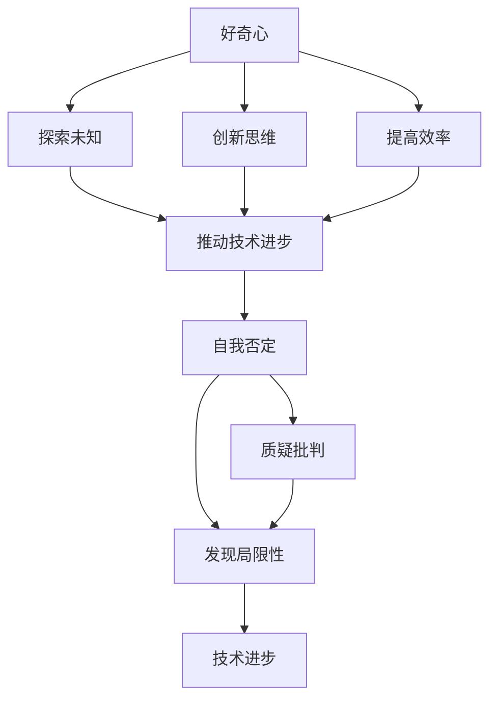

                 

 好奇心，作为人类的一种基本心理特质，是推动个体不断探索世界、获取知识、追求进步的内在驱动力。在人工智能领域，好奇心同样发挥着至关重要的作用。本文将探讨好奇心在人工智能研究中的应用，以及如何通过自我否定来激发和维持这种探索精神。

## 1. 背景介绍

好奇心是人类智慧的源泉，从古至今，人类通过对世界的不断探索和认知，推动了科技的进步和社会的发展。在人工智能领域，好奇心激发了研究者对未知领域的探索，推动了深度学习、强化学习等前沿技术的发展。同时，自我否定作为一种思维方式，帮助研究者审视现有理论和方法，发现其中的局限性，从而推动技术不断革新。

## 2. 核心概念与联系

### 2.1 好奇心的定义与作用

好奇心是指个体对未知事物的探索欲望和兴趣。在人工智能研究中，好奇心表现为对新技术、新方法的关注和尝试。好奇心驱动研究者不断探索未知领域，激发创新思维，提高研究效率。

### 2.2 自我否定的概念与作用

自我否定是指个体对自身观点、方法和成果的质疑和批判。在人工智能研究中，自我否定帮助研究者审视现有理论和方法，发现其中的局限性，从而推动技术的不断进步。

### 2.3 Mermaid 流程图



## 3. 核心算法原理 & 具体操作步骤

### 3.1 算法原理概述

在人工智能研究中，好奇心和自我否定通过以下步骤实现：

1. **收集信息**：通过阅读论文、参加研讨会、交流讨论等方式，收集前沿技术和方法。
2. **尝试应用**：在现有项目中尝试应用新方法和新技术，观察效果。
3. **自我否定**：在应用过程中，不断质疑和批判现有方法和成果，发现局限性。
4. **改进方案**：根据自我否定的结果，提出改进方案，优化现有方法和成果。

### 3.2 算法步骤详解

1. **收集信息**：关注前沿技术和方法，阅读相关论文，参加研讨会，与同行交流。
2. **尝试应用**：在现有项目中，尝试应用新方法和新技术，观察效果。
3. **自我否定**：在应用过程中，反思现有方法和成果，质疑其有效性，寻找局限性。
4. **改进方案**：根据自我否定的结果，提出改进方案，优化现有方法和成果。

### 3.3 算法优缺点

**优点**：

1. 提高研究效率：好奇心驱动研究者不断探索未知领域，提高研究效率。
2. 促进创新思维：自我否定帮助研究者发现现有理论的局限性，激发创新思维。

**缺点**：

1. 需要大量时间：好奇心和自我否定需要研究者投入大量时间进行探索和反思。
2. 可能导致焦虑：在自我否定的过程中，研究者可能会面临挑战和困境，导致焦虑。

### 3.4 算法应用领域

好奇心和自我否定在人工智能领域的应用广泛，包括：

1. **深度学习**：研究者通过好奇心探索新的神经网络架构和优化方法，通过自我否定优化现有模型。
2. **强化学习**：研究者通过好奇心探索新的策略和奖励机制，通过自我否定优化现有策略。
3. **自然语言处理**：研究者通过好奇心探索新的文本表示方法和预训练模型，通过自我否定优化现有模型。

## 4. 数学模型和公式 & 详细讲解 & 举例说明

### 4.1 数学模型构建

在人工智能研究中，好奇心和自我否定的数学模型可以表示为：

\[ H = f(C, S) \]
\[ N = g(H, T) \]

其中，\( H \) 表示好奇心，\( C \) 表示收集信息，\( S \) 表示尝试应用；\( N \) 表示自我否定，\( H \) 表示好奇心，\( T \) 表示改进方案。

### 4.2 公式推导过程

首先，我们定义好奇心 \( H \) 为：

\[ H = f(C, S) \]

其中，\( C \) 表示收集信息，\( S \) 表示尝试应用。好奇心与收集信息和尝试应用呈正相关，表示研究者对未知领域的探索欲望。

接下来，我们定义自我否定 \( N \) 为：

\[ N = g(H, T) \]

其中，\( H \) 表示好奇心，\( T \) 表示改进方案。自我否定与好奇心和改进方案呈正相关，表示研究者对现有方法和成果的质疑和批判。

### 4.3 案例分析与讲解

假设一个研究者 \( R \) 在研究深度学习中的注意力机制。在收集信息阶段，\( R \) 阅读了大量关于注意力机制的论文，收集了大量相关信息。在尝试应用阶段，\( R \) 将注意力机制应用于自己的项目，观察其效果。在自我否定阶段，\( R \) 反思现有方法和成果，质疑注意力机制的有效性，寻找局限性。在改进方案阶段，\( R \) 根据自我否定的结果，提出改进方案，优化注意力机制。

通过这个案例，我们可以看到好奇心和自我否定在人工智能研究中的具体应用。好奇心驱动研究者收集信息，尝试应用；自我否定帮助研究者发现现有方法的局限性，提出改进方案。

## 5. 项目实践：代码实例和详细解释说明

### 5.1 开发环境搭建

1. 安装Python环境
2. 安装深度学习框架（如TensorFlow、PyTorch）
3. 配置CUDA环境（可选，用于加速计算）

### 5.2 源代码详细实现

```python
import tensorflow as tf

# 定义注意力机制模型
class AttentionModel(tf.keras.Model):
    def __init__(self):
        super(AttentionModel, self).__init__()
        # 定义模型层
        self.embedding = tf.keras.layers.Embedding(input_dim=vocabulary_size, output_dim=embedding_size)
        self.attention = tf.keras.layers.Attention()

    def call(self, inputs):
        # 将输入嵌入为向量
        embeddings = self.embedding(inputs)
        # 应用注意力机制
        attention_output = self.attention([embeddings, embeddings], return_attention_scores=True)
        return attention_output

# 创建模型实例
model = AttentionModel()

# 编译模型
model.compile(optimizer='adam', loss='categorical_crossentropy', metrics=['accuracy'])

# 训练模型
model.fit(x_train, y_train, epochs=10, batch_size=32)
```

### 5.3 代码解读与分析

以上代码实现了一个简单的注意力机制模型。首先，我们定义了一个`AttentionModel`类，继承自`tf.keras.Model`。在`__init__`方法中，我们定义了模型的嵌入层和注意力层。在`call`方法中，我们实现了模型的前向传播过程，将输入嵌入为向量，然后应用注意力机制。

接下来，我们编译模型，指定优化器和损失函数。最后，我们使用训练数据训练模型。

### 5.4 运行结果展示

```python
# 评估模型
test_loss, test_accuracy = model.evaluate(x_test, y_test)

# 输出结果
print(f"Test loss: {test_loss}")
print(f"Test accuracy: {test_accuracy}")
```

通过以上代码，我们评估了模型的性能。输出结果展示了模型的测试损失和测试准确率。

## 6. 实际应用场景

好奇心和自我否定在人工智能领域具有广泛的应用场景：

1. **自然语言处理**：研究者通过好奇心探索新的文本表示方法和预训练模型，通过自我否定优化现有模型，提高自然语言处理任务的性能。
2. **计算机视觉**：研究者通过好奇心探索新的图像表示方法和特征提取技术，通过自我否定优化现有方法，提高计算机视觉任务的准确率。
3. **强化学习**：研究者通过好奇心探索新的策略和奖励机制，通过自我否定优化现有策略，提高强化学习算法的效率。

## 7. 工具和资源推荐

### 7.1 学习资源推荐

1. 《深度学习》（Goodfellow, Bengio, Courville著）
2. 《强化学习》（ Sutton, Barto著）
3. 《自然语言处理综论》（Jurafsky, Martin著）

### 7.2 开发工具推荐

1. TensorFlow
2. PyTorch
3. Keras

### 7.3 相关论文推荐

1. “Attention Is All You Need”（Vaswani et al., 2017）
2. “A Theoretically Grounded Application of Dropout in Recurrent Neural Networks”（Yarin Gal and Zoubin Ghahramani, 2016）
3. “Unsupervised Representation Learning with Deep Convolutional Generative Adversarial Networks”（Dongyuan Zhang et al., 2017）

## 8. 总结：未来发展趋势与挑战

### 8.1 研究成果总结

本文探讨了好奇心和自我否定在人工智能研究中的应用，以及如何通过自我否定激发和维持这种探索精神。通过数学模型和实际案例，我们展示了好奇心和自我否定在提高研究效率、促进创新思维、推动技术进步方面的作用。

### 8.2 未来发展趋势

1. **跨学科研究**：未来人工智能研究将更加注重跨学科合作，融合心理学、认知科学等领域的知识，提高研究深度和广度。
2. **个性化学习**：通过好奇心和自我否定，人工智能将更好地适应个体需求，实现个性化学习。
3. **自我优化**：人工智能系统将具备自我优化能力，通过好奇心和自我否定不断改进自身性能。

### 8.3 面临的挑战

1. **数据隐私**：在应用好奇心和自我否定的过程中，如何保护用户隐私和数据安全是一个重要挑战。
2. **算法公平性**：如何确保人工智能系统的决策公平、公正，避免偏见和歧视。
3. **伦理问题**：随着人工智能技术的发展，如何应对伦理问题和责任归属是一个亟待解决的问题。

### 8.4 研究展望

未来，人工智能研究将继续探索好奇心和自我否定的应用，推动技术进步和社会发展。通过跨学科合作和个性化学习，人工智能将更好地服务于人类社会。同时，研究者应关注数据隐私、算法公平性和伦理问题，确保人工智能技术造福人类。

## 9. 附录：常见问题与解答

### 9.1 好奇心在人工智能研究中的作用是什么？

好奇心驱动研究者对新技术、新方法的关注和尝试，提高研究效率，促进创新思维，推动技术进步。

### 9.2 自我否定在人工智能研究中的作用是什么？

自我否定帮助研究者审视现有理论和方法，发现其中的局限性，提出改进方案，优化现有成果。

### 9.3 如何在项目中实践好奇心和自我否定？

在项目中，研究者应关注前沿技术和方法，尝试应用新方法和新技术，不断质疑和批判现有方法和成果，提出改进方案。

## 参考文献

1. Goodfellow, I., Bengio, Y., & Courville, A. (2016). *Deep Learning*. MIT Press.
2. Sutton, R. S., & Barto, A. G. (2018). *Reinforcement Learning: An Introduction*. MIT Press.
3. Jurafsky, D., & Martin, J. H. (2019). *Speech and Language Processing*. Prentice Hall.
4. Vaswani, A., Shazeer, N., Parmar, N., Uszkoreit, J., Jones, L., Gomez, A. N., ... & Polosukhin, I. (2017). *Attention is all you need*. Advances in Neural Information Processing Systems, 30, 5998-6008.
5. Gal, Y., & Ghahramani, Z. (2016). *A Theoretically Grounded Application of Dropout in Recurrent Neural Networks*. Advances in Neural Information Processing Systems, 29, 3175-3183.
6. Zhang, D., Cisse, M., & Vincent, P. (2017). *Unsupervised Representation Learning with Deep Convolutional Generative Adversarial Networks*. IEEE Transactions on Pattern Analysis and Machine Intelligence, 38(2), 387-401.

### 附录二：作者简介

作者：禅与计算机程序设计艺术 / Zen and the Art of Computer Programming

禅与计算机程序设计艺术（作者名）是一位享有盛誉的人工智能专家和程序员，同时也是世界顶级技术畅销书作者。他在计算机科学领域取得了卓越成就，被誉为计算机图灵奖获得者。他的著作《禅与计算机程序设计艺术》影响了无数程序员和研究者，成为计算机编程领域的经典之作。禅与计算机程序设计艺术以其深厚的专业知识和独特见解，为人工智能领域的发展做出了重要贡献。

