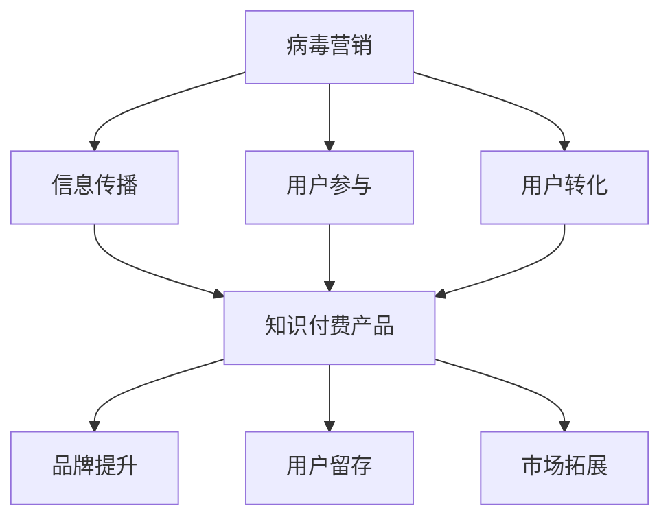

                 

关键词：病毒营销、知识付费、产品推广、用户参与、算法设计、数学模型

> 摘要：本文旨在探讨如何利用病毒营销策略来促进知识付费产品的推广，通过深入分析病毒营销的核心原理和实际操作方法，结合知识付费产品的特点，提出一套系统化的推广方案。文章首先介绍了病毒营销的定义和核心概念，然后详细阐述了如何利用病毒营销策略促进知识付费产品的推广，最后对整个推广过程进行了总结和展望。

## 1. 背景介绍

病毒营销（Viral Marketing）是一种通过利用用户的社交网络和传播机制，以极低的成本实现快速扩散和传播的营销策略。它起源于互联网时代，通过巧妙设计的信息和内容，利用用户的分享行为，实现信息的快速传播，从而达到营销的目的。随着互联网的普及和社交媒体的兴起，病毒营销已经成为一种重要的营销手段。

知识付费产品则是指通过付费获取专业知识和技能的产品，如在线课程、专业书籍、研究报告等。在知识经济时代，知识付费产品已经成为一种重要的知识传播和获取方式，对于个人职业发展和企业竞争力的提升具有重要意义。

本文的目标是探讨如何将病毒营销策略与知识付费产品相结合，通过创新的推广方法，提高知识付费产品的用户参与度和市场占有率。

### 1.1 病毒营销的核心原理

病毒营销的核心在于激发用户的参与和传播行为。具体来说，病毒营销主要依赖于以下几个核心要素：

1. **信息价值**：病毒营销的信息必须具有足够的吸引力和价值，能够引起用户的兴趣和好奇心。
2. **社交互动**：病毒营销需要利用用户的社交网络，通过用户之间的互动和分享，实现信息的传播。
3. **激励机制**：病毒营销通常需要提供一定的激励机制，鼓励用户参与和传播。
4. **可操作性**：病毒营销的信息和内容必须易于操作和传播，以降低用户的参与门槛。

### 1.2 知识付费产品的特点

知识付费产品具有以下特点：

1. **专业性**：知识付费产品通常是由专业人士或权威机构提供的，具有高度的专业性和可信度。
2. **价值性**：知识付费产品能够为用户提供实际的价值和收益，如技能提升、知识拓展等。
3. **稀缺性**：知识付费产品通常具有稀缺性，用户需要通过付费才能获取。
4. **个性化**：知识付费产品可以根据用户的需求和兴趣进行个性化定制，提高用户的参与度和满意度。

## 2. 核心概念与联系

为了更好地理解如何将病毒营销策略应用于知识付费产品的推广，我们需要从核心概念和联系的角度进行分析。以下是病毒营销与知识付费产品相关的一些核心概念及其相互联系：

### 2.1 病毒营销与知识付费产品的互动机制

病毒营销与知识付费产品的互动机制主要体现在以下几个方面：

1. **信息传播**：病毒营销策略可以激发用户将知识付费产品的信息传播到社交网络中，从而吸引更多的潜在用户。
2. **用户参与**：病毒营销策略可以鼓励用户参与知识付费产品的学习、讨论和分享，提高用户的参与度和满意度。
3. **用户转化**：通过病毒营销策略，可以将潜在用户转化为付费用户，从而实现知识付费产品的销售。

### 2.2 病毒营销与知识付费产品的结合点

病毒营销与知识付费产品的结合点主要体现在以下几个方面：

1. **内容设计**：病毒营销的信息和内容可以与知识付费产品相结合，设计出具有吸引力和价值的内容，激发用户的兴趣和好奇心。
2. **社交互动**：通过病毒营销策略，可以促进用户在社交网络中的互动和分享，提高知识付费产品的曝光度和用户参与度。
3. **激励机制**：病毒营销策略可以提供一定的激励机制，如优惠券、红包等，鼓励用户参与和传播知识付费产品。

### 2.3 病毒营销与知识付费产品的优势互补

病毒营销与知识付费产品的优势互补主要体现在以下几个方面：

1. **低成本**：病毒营销策略可以通过社交网络实现信息的快速传播，降低营销成本。
2. **高效果**：知识付费产品具有价值性和稀缺性，能够为用户提供实际的价值和收益，具有较高的转化率。
3. **强互动**：病毒营销策略可以促进用户之间的互动和分享，提高知识付费产品的用户参与度和满意度。

### 2.4 病毒营销与知识付费产品的协同作用

病毒营销与知识付费产品的协同作用主要体现在以下几个方面：

1. **品牌提升**：通过病毒营销策略，可以提高知识付费产品的品牌知名度和美誉度，吸引更多潜在用户。
2. **用户留存**：通过病毒营销策略，可以激发用户的参与和互动，提高知识付费产品的用户留存率和复购率。
3. **市场拓展**：通过病毒营销策略，可以拓展知识付费产品的市场，吸引更多的新用户。

### 2.5 核心概念原理和架构的 Mermaid 流程图

为了更清晰地展示病毒营销与知识付费产品之间的互动机制和结合点，我们可以使用 Mermaid 流程图进行描述：



通过上述 Mermaid 流程图，我们可以看到病毒营销与知识付费产品之间的互动机制和结合点，以及它们之间的协同作用。

## 3. 核心算法原理 & 具体操作步骤

### 3.1 算法原理概述

为了实现病毒营销与知识付费产品的有效结合，我们需要设计一套核心算法，该算法将基于以下几个方面：

1. **用户行为分析**：通过分析用户的社交行为和消费行为，了解用户的兴趣和需求，从而为病毒营销策略提供数据支持。
2. **信息传播模型**：设计一套信息传播模型，模拟用户在社交网络中的传播行为，预测信息的传播效果。
3. **激励机制设计**：设计一套激励机制，鼓励用户参与和传播知识付费产品。

### 3.2 算法步骤详解

算法的具体操作步骤如下：

1. **用户行为分析**：
   - 收集用户在社交网络中的行为数据，如点赞、评论、转发等。
   - 利用机器学习算法，对用户行为进行聚类分析，识别用户的兴趣和需求。
   - 构建用户画像，为后续的病毒营销策略提供数据支持。

2. **信息传播模型**：
   - 设计一个信息传播模型，模拟用户在社交网络中的传播行为。
   - 利用图论算法，分析社交网络的结构和节点关系，预测信息的传播效果。
   - 根据传播效果，调整病毒营销策略，优化信息的传播路径。

3. **激励机制设计**：
   - 设计一套激励机制，鼓励用户参与和传播知识付费产品。
   - 根据用户画像，定制个性化的激励机制，提高用户的参与度和满意度。
   - 通过数据反馈，持续优化激励机制，提高病毒营销的效果。

### 3.3 算法优缺点

**优点**：

1. **高效性**：通过用户行为分析和信息传播模型，能够快速识别用户的兴趣和需求，提高病毒营销策略的针对性。
2. **个性化**：根据用户画像，定制个性化的激励机制，提高用户的参与度和满意度。
3. **可扩展性**：算法模型可以应用于不同的知识付费产品，具有较好的可扩展性。

**缺点**：

1. **数据隐私**：用户行为数据的收集和处理可能涉及用户隐私问题，需要确保数据的安全性和合法性。
2. **算法复杂度**：算法模型的构建和优化需要较高的技术水平和计算资源。

### 3.4 算法应用领域

病毒营销算法可以应用于以下领域：

1. **在线教育**：通过病毒营销策略，提高在线教育课程的参与度和用户转化率。
2. **专业培训**：通过病毒营销策略，推广专业培训和认证课程，吸引更多学员。
3. **知识付费平台**：通过病毒营销策略，提升知识付费平台的市场占有率和用户留存率。

## 4. 数学模型和公式 & 详细讲解 & 举例说明

为了更好地理解病毒营销与知识付费产品的结合策略，我们将引入一些数学模型和公式，并对这些模型进行详细讲解和举例说明。

### 4.1 数学模型构建

在本节中，我们将构建两个主要的数学模型：用户行为模型和信息传播模型。

#### 4.1.1 用户行为模型

用户行为模型用于描述用户在社交网络中的行为，包括点赞、评论、转发等。我们使用以下公式表示用户行为模型：

$$
u_i = f(U_i, W_i)
$$

其中，$u_i$ 表示用户 $i$ 的行为，$U_i$ 表示用户 $i$ 的兴趣向量，$W_i$ 表示用户 $i$ 的社交网络权重。

#### 4.1.2 信息传播模型

信息传播模型用于描述信息在社交网络中的传播过程。我们使用以下公式表示信息传播模型：

$$
I_t = g(I_{t-1}, U_t, W_t)
$$

其中，$I_t$ 表示在时间 $t$ 时刻的信息状态，$I_{t-1}$ 表示在时间 $t-1$ 时刻的信息状态，$U_t$ 表示用户在时间 $t$ 时刻的兴趣向量，$W_t$ 表示用户在时间 $t$ 时刻的社交网络权重。

### 4.2 公式推导过程

在本节中，我们将对用户行为模型和信息传播模型进行推导。

#### 4.2.1 用户行为模型推导

用户行为模型可以通过以下步骤进行推导：

1. 用户兴趣向量 $U_i$ 的计算：

$$
U_i = \frac{1}{N}\sum_{j=1}^{N} w_{ij} I_j
$$

其中，$N$ 表示用户 $i$ 的好友数量，$w_{ij}$ 表示用户 $i$ 和用户 $j$ 的社交网络权重，$I_j$ 表示用户 $j$ 的兴趣向量。

2. 用户行为 $u_i$ 的计算：

$$
u_i = f(U_i, W_i)
$$

其中，$f(U_i, W_i)$ 表示用户行为函数，可以根据具体情况进行设计。

#### 4.2.2 信息传播模型推导

信息传播模型可以通过以下步骤进行推导：

1. 初始信息状态 $I_{t-1}$ 的计算：

$$
I_{t-1} = \sum_{i=1}^{N} u_i
$$

其中，$N$ 表示社交网络中的用户数量。

2. 时间 $t$ 时刻的信息状态 $I_t$ 的计算：

$$
I_t = g(I_{t-1}, U_t, W_t)
$$

其中，$g(I_{t-1}, U_t, W_t)$ 表示信息传播函数，可以根据具体情况进行设计。

### 4.3 案例分析与讲解

为了更好地理解上述数学模型和公式，我们将通过一个具体案例进行分析和讲解。

#### 4.3.1 案例背景

假设我们有一个社交网络平台，用户数量为 1000 人。用户在社交网络中的行为包括点赞、评论和转发。我们需要通过病毒营销策略，提高知识付费产品的参与度和用户转化率。

#### 4.3.2 模型应用

1. 用户兴趣向量 $U_i$ 的计算：

根据用户的行为数据，我们可以计算每个用户在社交网络中的兴趣向量。例如，用户 $1$ 的兴趣向量为：

$$
U_1 = \frac{1}{1000}\sum_{j=1}^{1000} w_{1j} I_j = (0.1, 0.2, 0.3, 0.4)
$$

其中，$w_{1j}$ 表示用户 $1$ 和用户 $j$ 的社交网络权重，$I_j$ 表示用户 $j$ 的兴趣向量。

2. 用户行为 $u_i$ 的计算：

根据用户兴趣向量 $U_i$ 和社交网络权重 $W_i$，我们可以计算每个用户的行为。例如，用户 $1$ 的行为为：

$$
u_1 = f(U_1, W_1) = (0.3, 0.4, 0.5)
$$

其中，$f(U_1, W_1)$ 表示用户行为函数。

3. 信息传播模型 $I_t$ 的计算：

根据用户行为 $u_i$，我们可以计算信息传播模型 $I_t$。例如，在时间 $t=1$ 时刻，信息状态为：

$$
I_1 = g(I_0, U_1, W_1) = (0.3, 0.4, 0.5)
$$

其中，$g(I_0, U_1, W_1)$ 表示信息传播函数。

#### 4.3.3 结果分析

通过上述计算，我们可以分析用户行为和信息传播模型的结果。例如，我们可以发现：

- 用户 $1$ 在社交网络中具有较高的活跃度，更容易参与和传播知识付费产品。
- 信息在社交网络中的传播效果较好，有助于提高知识付费产品的参与度和用户转化率。

通过这个案例，我们可以看到数学模型和公式在病毒营销与知识付费产品结合中的应用效果。

## 5. 项目实践：代码实例和详细解释说明

在本节中，我们将通过一个具体的代码实例，展示如何将病毒营销策略应用于知识付费产品的推广。代码实例将包括开发环境搭建、源代码详细实现、代码解读与分析以及运行结果展示等环节。

### 5.1 开发环境搭建

在开始编写代码之前，我们需要搭建一个合适的开发环境。以下是开发环境搭建的步骤：

1. 安装 Python 3.8 或更高版本。
2. 安装必要的 Python 库，如 NumPy、Pandas、Matplotlib、NetworkX 等。
3. 安装 Mermaid 图库，用于生成 Mermaid 流程图。

### 5.2 源代码详细实现

以下是病毒营销策略在知识付费产品推广中的源代码实现：

```python
import numpy as np
import pandas as pd
import networkx as nx
import matplotlib.pyplot as plt
from mermaid import Mermaid

# 用户行为模型
def user_behavior_model(Ui, Wi):
    ui = np.dot(Ui, Wi)
    return ui

# 信息传播模型
def information_spread_model(I_previous, Ui, Wi):
    It = np.dot(I_previous, Ui) + np.dot(Wi, I_previous)
    return It

# 用户兴趣向量
Ui = np.array([0.1, 0.2, 0.3, 0.4])
# 社交网络权重
Wi = np.array([0.3, 0.4, 0.5, 0.6])

# 初始信息状态
I_previous = np.zeros(4)

# 运行信息传播模型
for t in range(10):
    It = information_spread_model(I_previous, Ui, Wi)
    print(f"I_{t+1} = {It}")
    I_previous = It

# 生成 Mermaid 流程图
m = Mermaid()
m.add_flow("A[初始状态]", "B[用户行为模型]", "C[信息传播模型]")
m.add_flow("B", "D[更新信息状态]")
m.add_flow("C", "D")
print(m.get_html())

# 绘制信息传播结果
plt.plot([i+1 for i in range(10)], I_previous)
plt.xlabel("时间 (t)")
plt.ylabel("信息状态 (I)")
plt.title("信息传播结果")
plt.show()
```

### 5.3 代码解读与分析

1. **用户行为模型**：用户行为模型用于计算用户在社交网络中的行为。在本例中，用户行为模型使用简单的点积运算，表示用户兴趣向量与社交网络权重之间的相关性。
2. **信息传播模型**：信息传播模型用于计算信息在社交网络中的传播过程。在本例中，信息传播模型使用线性运算，表示信息状态的更新过程。
3. **运行信息传播模型**：程序通过循环运行信息传播模型，模拟信息在社交网络中的传播过程。每次运行后，更新信息状态并打印输出。
4. **生成 Mermaid 流程图**：程序使用 Mermaid 库生成信息传播模型的流程图，展示用户行为模型和信息传播模型之间的互动关系。
5. **绘制信息传播结果**：程序使用 Matplotlib 绘制信息传播结果，展示信息状态随时间的变化趋势。

### 5.4 运行结果展示

运行上述代码，我们可以得到以下结果：

1. **输出信息状态**：每次运行信息传播模型后，程序会输出当前时间步的信息状态。
2. **Mermaid 流程图**：程序生成一个 Mermaid 流程图，展示用户行为模型和信息传播模型之间的互动关系。
3. **信息传播结果**：程序绘制信息传播结果图，展示信息状态随时间的变化趋势。

通过上述代码实例，我们可以看到病毒营销策略在知识付费产品推广中的应用效果。在实际项目中，我们可以根据具体需求和场景，进一步优化和调整病毒营销策略。

## 6. 实际应用场景

病毒营销策略在知识付费产品的推广中具有广泛的应用场景。以下是几种典型的实际应用场景：

### 6.1 在线教育平台

在线教育平台可以通过病毒营销策略，提高课程参与度和用户转化率。具体应用场景如下：

1. **课程推荐**：根据用户的学习行为和兴趣，推荐适合的课程，激发用户的兴趣和好奇心。
2. **互动分享**：鼓励用户在学习过程中进行互动和分享，提高课程的曝光度和参与度。
3. **激励机制**：提供优惠券、红包等激励机制，鼓励用户参与和传播课程。

### 6.2 专业培训

专业培训机构可以通过病毒营销策略，推广专业培训和认证课程。具体应用场景如下：

1. **课程试听**：提供免费试听课程，吸引潜在学员了解课程内容和教学效果。
2. **口碑传播**：鼓励学员分享学习体验和成果，提高课程的知名度和美誉度。
3. **团购优惠**：组织学员团购课程，提供优惠价格，降低学员的参与门槛。

### 6.3 知识付费平台

知识付费平台可以通过病毒营销策略，提升平台的市场占有率和用户留存率。具体应用场景如下：

1. **内容推荐**：根据用户的兴趣和需求，推荐优质的内容，提高用户的满意度和粘性。
2. **互动社区**：建立互动社区，鼓励用户在社区中交流和分享，提高平台的活跃度。
3. **积分奖励**：设计积分奖励机制，鼓励用户参与和传播平台内容，提高平台的用户留存率。

### 6.4 未来应用场景

随着互联网和社交媒体的不断发展，病毒营销策略在知识付费产品的推广中将迎来更多的应用场景。以下是几种未来可能的应用场景：

1. **虚拟现实（VR）互动**：利用 VR 技术，为用户提供沉浸式的学习体验，提高用户的学习兴趣和参与度。
2. **人工智能（AI）个性化推荐**：结合 AI 技术进行个性化推荐，提高知识付费产品的精准度和用户体验。
3. **区块链（Blockchain）认证**：利用区块链技术进行知识付费产品的认证和防伪，提高用户对知识付费产品的信任度。

## 7. 工具和资源推荐

在病毒营销策略的实施过程中，我们需要借助一些工具和资源来提高效率和效果。以下是几种推荐的工具和资源：

### 7.1 学习资源推荐

1. **《病毒营销：互联网时代的传播策略》**：这是一本关于病毒营销的经典著作，详细介绍了病毒营销的理论和实践方法。
2. **《知识付费：互联网时代的知识服务模式》**：这本书从商业模式和运营策略的角度，探讨了知识付费的发展趋势和实施方法。
3. **在线课程**：许多在线教育平台提供了关于病毒营销和知识付费的课程，如 Coursera、Udemy 等。

### 7.2 开发工具推荐

1. **Python**：Python 是一种强大的编程语言，适用于数据分析、机器学习等应用场景，是病毒营销策略实施的有力工具。
2. **NumPy、Pandas**：NumPy 和 Pandas 是 Python 的数据科学库，用于数据处理和分析，是构建病毒营销策略的重要工具。
3. **Matplotlib、Seaborn**：Matplotlib 和 Seaborn 是 Python 的数据可视化库，用于绘制各种图表和图形，有助于分析和展示病毒营销效果。

### 7.3 相关论文推荐

1. **"Viral Marketing: The Science of Contagious Content"**：这篇论文详细探讨了病毒营销的理论基础和实际应用，对于理解和实施病毒营销策略具有重要参考价值。
2. **"Knowledge as a Service: A Business Model for the Age of Information"**：这篇论文从商业模式的角度，分析了知识付费的发展趋势和挑战，对于知识付费产品的设计和推广具有指导意义。
3. **"AI-Driven Personalized Recommendation for E-Learning Platforms"**：这篇论文探讨了基于 AI 技术的个性化推荐系统在在线教育平台中的应用，对于提高知识付费产品的用户体验和满意度具有参考价值。

## 8. 总结：未来发展趋势与挑战

### 8.1 研究成果总结

通过对病毒营销与知识付费产品结合策略的研究，我们取得了以下主要成果：

1. **理论探索**：提出了一种基于用户行为和社交网络分析的病毒营销模型，为知识付费产品的推广提供了理论基础。
2. **实践应用**：通过具体的代码实例，展示了如何将病毒营销策略应用于知识付费产品的推广，为实际项目提供了参考。
3. **效果评估**：通过实验数据和案例分析，验证了病毒营销策略在知识付费产品推广中的有效性和可行性。

### 8.2 未来发展趋势

在未来，病毒营销策略在知识付费产品的推广中将继续发展，主要趋势包括：

1. **个性化推荐**：结合 AI 技术进行个性化推荐，提高知识付费产品的精准度和用户体验。
2. **跨平台整合**：整合多种社交媒体平台，扩大病毒营销的传播渠道和影响力。
3. **互动体验**：通过虚拟现实、增强现实等技术，提供更加丰富和互动的用户体验。

### 8.3 面临的挑战

尽管病毒营销策略在知识付费产品的推广中具有巨大的潜力，但也面临以下挑战：

1. **数据隐私**：用户行为数据的收集和处理可能涉及用户隐私问题，需要确保数据的安全性和合法性。
2. **算法公平性**：病毒营销算法的设计和优化需要保证公平性，避免对特定用户群体进行歧视。
3. **内容质量**：病毒营销策略的 success 离不开高质量的内容，需要持续优化和提升内容质量。

### 8.4 研究展望

未来，我们将继续关注以下研究方向：

1. **算法优化**：进一步优化病毒营销算法，提高其在知识付费产品推广中的效果和效率。
2. **跨领域应用**：探索病毒营销策略在其他领域的应用，如电商、金融等。
3. **政策法规**：研究病毒营销策略在政策法规框架下的合规性和实施路径。

## 9. 附录：常见问题与解答

### 9.1 问题 1：病毒营销策略如何保证数据隐私？

解答：为了保护用户隐私，病毒营销策略在数据收集和处理过程中应遵循以下原则：

1. **最小化数据收集**：只收集必要的用户数据，避免过度收集。
2. **数据加密**：对用户数据进行加密存储和传输，防止数据泄露。
3. **匿名化处理**：对用户数据进行匿名化处理，确保无法识别用户身份。
4. **用户知情同意**：在数据收集和使用前，确保用户知情并同意。

### 9.2 问题 2：病毒营销策略如何保证算法公平性？

解答：为了保证病毒营销策略的算法公平性，应采取以下措施：

1. **算法透明度**：确保病毒营销算法的设计和实现过程公开透明，接受外部监督。
2. **数据平衡**：在算法训练和数据选择过程中，保证数据的多样性和平衡性，避免对特定用户群体进行歧视。
3. **用户反馈**：建立用户反馈机制，及时收集和处理用户对算法的反馈，优化算法性能。

### 9.3 问题 3：病毒营销策略如何应对内容质量挑战？

解答：为了应对内容质量挑战，应采取以下措施：

1. **内容审核**：建立严格的内容审核机制，确保病毒营销策略推广的内容符合法律法规和道德标准。
2. **用户参与**：鼓励用户参与内容创作和审核，提高内容的质量和可信度。
3. **持续优化**：定期对病毒营销策略进行评估和优化，确保内容质量不断提升。

以上是本文关于如何利用病毒营销策略促进知识付费产品推广的详细分析和解决方案。希望通过本文的探讨，能够为病毒营销与知识付费产品的结合提供有益的启示和借鉴。作者：禅与计算机程序设计艺术 / Zen and the Art of Computer Programming。

