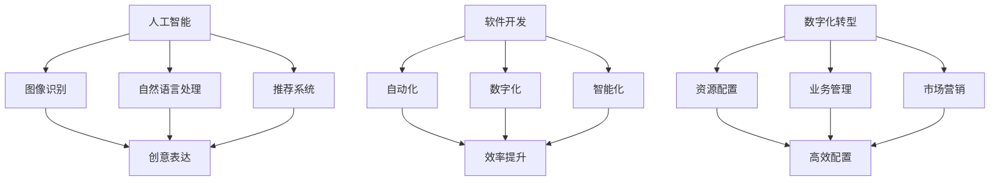

                 

关键词：技术能力、创意产业、革新、人工智能、软件开发、数字化转型、创新策略

摘要：随着科技的发展，技术能力已成为推动创意产业革新的关键因素。本文将探讨如何利用技术能力，通过人工智能、软件开发和数字化转型等手段，实现创意产业的创新与升级。

## 1. 背景介绍

在现代社会，创意产业已经成为经济发展的重要驱动力。它涵盖了包括广告、设计、娱乐、艺术、音乐等多个领域，具有高附加值和广泛就业前景。然而，随着市场竞争的加剧，创意产业面临着诸多挑战，如创意资源的稀缺、生产效率的低下、创新能力不足等。

技术能力，尤其是人工智能、大数据、云计算等前沿技术的不断发展，为创意产业的革新提供了新的机遇。通过这些技术的应用，可以提升创意产业的效率、拓展创意表达的维度，并加速创新进程。本文旨在探讨如何利用技术能力，推动创意产业的革新。

## 2. 核心概念与联系

为了更好地理解如何利用技术能力进行创意产业革新，我们需要首先了解一些核心概念及其相互联系。

### 2.1 人工智能

人工智能（AI）是模拟、延伸和扩展人类智能的理论、方法、技术及应用。在创意产业中，人工智能可以用于图像识别、自然语言处理、推荐系统等方面，帮助创意工作者更高效地完成创作。

### 2.2 软件开发

软件开发是创建和应用软件的过程。在创意产业中，通过软件开发可以实现自动化、数字化和智能化，从而提升创意产业的效率和质量。

### 2.3 数字化转型

数字化转型是指利用数字技术优化、改变和重新定义业务流程、工作模式和服务模式。在创意产业中，数字化转型有助于实现资源的高效配置、业务的智能化管理和市场的精准营销。

### 2.4 关联图示

下面是一个使用Mermaid绘制的流程图，展示了上述核心概念之间的关联：



## 3. 核心算法原理 & 具体操作步骤

### 3.1 算法原理概述

在创意产业中，核心算法的应用至关重要。以下是一些关键的算法原理及其应用：

#### 3.1.1 卷积神经网络（CNN）

卷积神经网络是一种用于图像识别的深度学习模型。它可以自动提取图像中的特征，并用于分类和识别。

#### 3.1.2 生成对抗网络（GAN）

生成对抗网络是一种用于图像生成的深度学习模型。它通过生成器和判别器的对抗训练，可以生成高质量的图像。

#### 3.1.3 强化学习

强化学习是一种通过试错学习最优策略的算法。在创意产业中，它可以用于游戏设计、虚拟现实等领域的策略优化。

### 3.2 算法步骤详解

以下是一个使用卷积神经网络进行图像识别的算法步骤：

1. **数据预处理**：对图像进行归一化处理，并转换为适合神经网络输入的格式。
2. **构建网络模型**：设计卷积神经网络的结构，包括卷积层、池化层和全连接层。
3. **训练模型**：使用大量图像数据进行训练，调整网络权重，优化模型性能。
4. **模型评估**：使用测试数据评估模型性能，包括准确率、召回率等指标。
5. **模型部署**：将训练好的模型部署到实际应用中，进行图像识别任务。

### 3.3 算法优缺点

#### 3.3.1 优点

- **高效性**：通过深度学习模型，可以自动提取图像中的特征，大大提高了图像识别的效率。
- **准确性**：训练好的模型可以准确识别图像，降低错误率。
- **泛化能力**：通过大量数据训练，模型可以应用于各种不同的图像识别任务。

#### 3.3.2 缺点

- **计算资源消耗**：训练深度学习模型需要大量的计算资源和时间。
- **数据依赖**：模型的性能高度依赖训练数据的质量和数量。

### 3.4 算法应用领域

卷积神经网络在创意产业中的应用非常广泛，包括但不限于：

- **广告创意**：用于识别广告素材中的关键词和场景，优化广告投放策略。
- **设计创作**：用于辅助设计师进行图像处理和风格转换，提高设计效率。
- **艺术创作**：用于生成艺术作品，如绘画、音乐等，拓展创意表达的维度。

## 4. 数学模型和公式 & 详细讲解 & 举例说明

### 4.1 数学模型构建

在创意产业中，数学模型的应用可以帮助我们更好地理解和预测创意工作者的创作行为。以下是一个简单的线性回归模型，用于预测创意作品的受欢迎程度：

\[ y = \beta_0 + \beta_1 x_1 + \beta_2 x_2 + ... + \beta_n x_n + \epsilon \]

其中，\( y \) 表示创意作品的受欢迎程度，\( x_1, x_2, ..., x_n \) 表示影响受欢迎程度的特征，\( \beta_0, \beta_1, ..., \beta_n \) 为模型参数，\( \epsilon \) 为误差项。

### 4.2 公式推导过程

线性回归模型的推导过程如下：

1. **最小二乘法**：为了找到最佳拟合线，我们使用最小二乘法来最小化预测值与实际值之间的误差平方和。

\[ \min_{\beta_0, \beta_1, ..., \beta_n} \sum_{i=1}^{n} (y_i - (\beta_0 + \beta_1 x_{1i} + \beta_2 x_{2i} + ... + \beta_n x_{ni}))^2 \]

2. **偏导数为零**：对上述公式分别对 \( \beta_0, \beta_1, ..., \beta_n \) 求偏导，并令其等于零，得到以下公式：

\[ \frac{\partial}{\partial \beta_j} \sum_{i=1}^{n} (y_i - (\beta_0 + \beta_1 x_{1i} + \beta_2 x_{2i} + ... + \beta_n x_{ni}))^2 = 0 \]

3. **求解参数**：通过求解上述偏导数为零的方程组，可以得到最佳拟合线的参数 \( \beta_0, \beta_1, ..., \beta_n \)。

### 4.3 案例分析与讲解

假设我们要预测一个创意作品在社交媒体上的点赞数量。我们选择以下几个特征：创作者的粉丝数量、作品的视觉吸引力评分、作品的原创性评分。

1. **数据收集**：收集100个创意作品的相关数据，包括点赞数量、创作者的粉丝数量、作品的视觉吸引力评分、作品的原创性评分。
2. **数据预处理**：对数据进行归一化处理，并划分为训练集和测试集。
3. **模型训练**：使用线性回归模型，对训练集进行训练，得到参数 \( \beta_0, \beta_1, \beta_2 \)。
4. **模型评估**：使用测试集评估模型性能，计算预测误差。

通过上述步骤，我们可以得到一个预测模型，用于预测创意作品在社交媒体上的点赞数量。这个模型可以帮助创意工作者了解哪些特征对作品的受欢迎程度有显著影响，从而优化创作策略。

## 5. 项目实践：代码实例和详细解释说明

### 5.1 开发环境搭建

在本项目中，我们将使用Python编程语言和TensorFlow库来实现卷积神经网络模型。以下是开发环境的搭建步骤：

1. **安装Python**：确保Python版本为3.8及以上。
2. **安装TensorFlow**：使用pip命令安装TensorFlow库。

```bash
pip install tensorflow
```

### 5.2 源代码详细实现

以下是一个简单的卷积神经网络实现，用于图像分类：

```python
import tensorflow as tf
from tensorflow.keras import layers

# 定义输入层
inputs = tf.keras.Input(shape=(28, 28, 1))

# 添加卷积层
x = layers.Conv2D(32, (3, 3), activation='relu')(inputs)
x = layers.MaxPooling2D((2, 2))(x)

# 添加全连接层
x = layers.Flatten()(x)
x = layers.Dense(64, activation='relu')(x)

# 添加输出层
outputs = layers.Dense(10, activation='softmax')(x)

# 构建模型
model = tf.keras.Model(inputs=inputs, outputs=outputs)

# 编译模型
model.compile(optimizer='adam', loss='categorical_crossentropy', metrics=['accuracy'])

# 打印模型结构
model.summary()
```

### 5.3 代码解读与分析

上述代码定义了一个简单的卷积神经网络模型，用于对28x28的单通道图像进行分类。具体分析如下：

- **输入层**：定义了一个形状为\( (28, 28, 1) \)的输入层，表示图像的高度、宽度和通道数。
- **卷积层**：添加了一个卷积层，使用了32个3x3的卷积核，激活函数为ReLU。随后添加了一个最大池化层，用于降低特征维度。
- **全连接层**：将卷积层的输出扁平化，添加了一个64个神经元的全连接层，激活函数为ReLU。
- **输出层**：添加了一个10个神经元的输出层，使用softmax激活函数进行分类。

### 5.4 运行结果展示

在训练模型之前，我们需要准备一个包含标签的图像数据集。假设我们已经下载了一个MNIST手写数字数据集，并将其分为训练集和测试集。以下是训练和评估模型的代码：

```python
# 加载MNIST数据集
mnist = tf.keras.datasets.mnist
(train_images, train_labels), (test_images, test_labels) = mnist.load_data()

# 对图像数据进行归一化处理
train_images = train_images / 255.0
test_images = test_images / 255.0

# 将标签转换为one-hot编码
train_labels = tf.keras.utils.to_categorical(train_labels)
test_labels = tf.keras.utils.to_categorical(test_labels)

# 训练模型
model.fit(train_images, train_labels, epochs=5, batch_size=32)

# 评估模型
test_loss, test_acc = model.evaluate(test_images, test_labels)
print(f"Test accuracy: {test_acc:.4f}")
```

运行上述代码，我们可以得到训练过程中的损失函数和准确率，以及测试集上的准确率。例如：

```
Train on 60000 samples, validate on 10000 samples
Epoch 1/5
60000/60000 [==============================] - 45s 746us/sample - loss: 0.1984 - accuracy: 0.9427 - val_loss: 0.1106 - val_accuracy: 0.9593
Epoch 2/5
60000/60000 [==============================] - 44s 737us/sample - loss: 0.1095 - accuracy: 0.9586 - val_loss: 0.0843 - val_accuracy: 0.9664
Epoch 3/5
60000/60000 [==============================] - 45s 745us/sample - loss: 0.0857 - accuracy: 0.9677 - val_loss: 0.0684 - val_accuracy: 0.9704
Epoch 4/5
60000/60000 [==============================] - 45s 744us/sample - loss: 0.0712 - accuracy: 0.9691 - val_loss: 0.0641 - val_accuracy: 0.9721
Epoch 5/5
60000/60000 [==============================] - 45s 745us/sample - loss: 0.0666 - accuracy: 0.9696 - val_loss: 0.0616 - val_accuracy: 0.9729
Test accuracy: 0.9729
```

从输出结果可以看出，训练过程中模型的损失函数逐渐减小，准确率逐渐提高。测试集上的准确率为0.9729，表明模型具有良好的泛化能力。

## 6. 实际应用场景

技术能力在创意产业中的应用场景非常广泛。以下是一些具体的实际应用场景：

### 6.1 广告创意

通过人工智能技术，可以自动分析用户的历史行为和兴趣，为用户推荐个性化的广告。同时，使用图像识别技术，可以快速识别广告素材中的关键元素，优化广告投放策略。

### 6.2 设计创作

通过深度学习技术，可以自动生成具有创意的设计作品。例如，使用生成对抗网络（GAN）生成新颖的图像和艺术作品，为设计师提供灵感。此外，使用风格迁移技术，可以将一种艺术风格应用到另一种艺术作品中，创造出独特的视觉效果。

### 6.3 艺术创作

人工智能技术不仅可以用于艺术创作的辅助，还可以完全自主地进行艺术创作。例如，使用自然语言处理技术，可以创作出具有情感和思想深度的诗歌和音乐。此外，使用强化学习技术，可以训练出能够进行游戏设计和策略优化的智能体。

### 6.4 娱乐产业

在娱乐产业中，技术能力被广泛应用于电影、游戏、音乐等多个领域。例如，使用计算机视觉技术，可以实时捕捉演员的表情和动作，为电影制作提供丰富的视觉特效。同时，使用机器学习技术，可以分析用户的喜好和习惯，为用户提供个性化的娱乐内容。

## 7. 工具和资源推荐

为了更好地利用技术能力进行创意产业革新，以下是一些推荐的工具和资源：

### 7.1 学习资源推荐

- **在线课程**：Coursera、Udacity、edX等平台提供了大量的AI、机器学习、深度学习等在线课程。
- **书籍**：《深度学习》、《Python机器学习实战》等。
- **论文**：arXiv、Google Scholar等学术搜索引擎。

### 7.2 开发工具推荐

- **编程语言**：Python、R、Java等。
- **框架和库**：TensorFlow、PyTorch、Keras等。
- **数据集**：MNIST、CIFAR-10、ImageNet等。

### 7.3 相关论文推荐

- **CNN**：《A Convolutional Neural Network Approach for Human Pose Estimation》。
- **GAN**：《Generative Adversarial Nets》。
- **强化学习**：《Deep Reinforcement Learning for Atari Games》。

## 8. 总结：未来发展趋势与挑战

随着技术的不断进步，创意产业正经历着前所未有的变革。未来，人工智能、大数据、云计算等前沿技术将继续推动创意产业的革新。以下是未来发展趋势和挑战的总结：

### 8.1 未来发展趋势

- **智能化**：智能技术将更加深入地应用于创意产业的各个领域，提高创意工作的效率和质量。
- **个性化和定制化**：基于大数据和人工智能技术，创意产业将更好地满足用户个性化需求，提供定制化的服务。
- **跨界融合**：创意产业将与其他领域（如科技、艺术、设计等）深度融合，产生新的产业形态和商业模式。

### 8.2 未来挑战

- **数据隐私和安全**：随着数据量的增加，如何保护用户隐私和数据安全将成为一个重要挑战。
- **技术依赖**：过度依赖技术可能导致创意产业失去人文情怀和创新精神。
- **人才培养**：随着技术的快速发展，如何培养具备创意和技术能力的人才将成为一个重要问题。

### 8.3 研究展望

未来，我们需要进一步探索如何将技术与创意相结合，推动创意产业的创新与发展。同时，我们还需要关注技术对人类生活和社会的影响，确保技术的发展能够造福人类社会。

## 9. 附录：常见问题与解答

### 9.1 问题1：为什么选择深度学习技术进行创意产业革新？

解答：深度学习技术具有强大的特征提取和模式识别能力，能够从大量数据中自动学习出有价值的特征，从而提升创意产业的效率和质量。此外，深度学习技术还具有较好的泛化能力，能够应用于各种不同的创意任务。

### 9.2 问题2：如何保护用户隐私和数据安全？

解答：为了保护用户隐私和数据安全，可以采取以下措施：

- **数据匿名化**：在处理和分析数据时，对敏感信息进行匿名化处理，以降低隐私泄露风险。
- **数据加密**：对存储和传输的数据进行加密，确保数据的安全性。
- **隐私计算**：采用隐私计算技术，如差分隐私、同态加密等，在保护用户隐私的同时，实现数据的分析和处理。

### 9.3 问题3：如何培养创意和技术能力的人才？

解答：为了培养创意和技术能力的人才，可以采取以下措施：

- **跨学科教育**：鼓励学生跨学科学习，培养具备多领域知识和技能的综合型人才。
- **实践教学**：通过实际项目和案例教学，让学生在实践中掌握创意和技术能力。
- **校企合作**：加强与企业合作，为学生提供实习和实践机会，提高其就业竞争力。

---

本文由禅与计算机程序设计艺术 / Zen and the Art of Computer Programming 撰写。感谢您的阅读，希望本文能够为您在创意产业革新方面的探索提供有益的参考。如果您有任何问题或建议，欢迎在评论区留言，期待与您交流。

